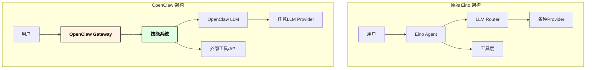
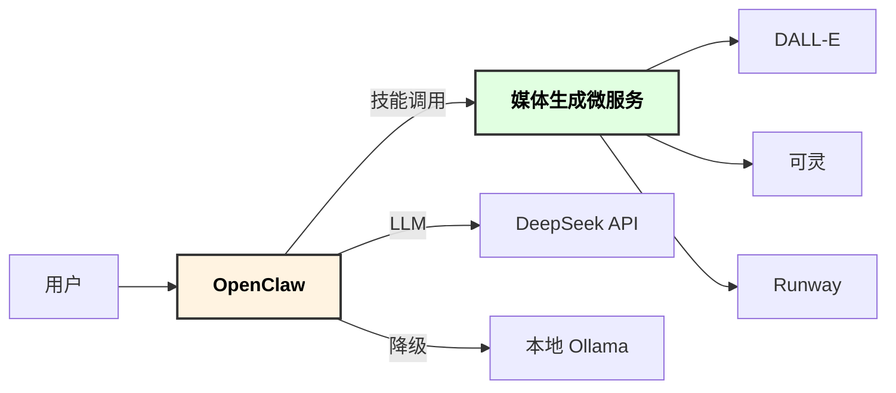

# OpenClaw 文生图/视频 Agent 实现方案

## 1. 概述

本文档描述如何使用 OpenClaw 平台实现 `architecture.md` 中定义的文生图/视频 Agent 功能，将 LLM 相关的逻辑委托给 OpenClaw 处理，简化开发工作。

### 1.1 为什么选择 OpenClaw

| 特性 | 优势 |
|-----|-----|
| **开源免费** | 180k+ GitHub Stars，活跃社区 |
| **自托管** | 数据本地存储，隐私可控 |
| **多 LLM 支持** | Claude、GPT、Grok、本地 Ollama 等 |
| **50+ 消息平台** | WhatsApp、Telegram、Slack、Discord、微信 |
| **持久化记忆** | Markdown 文件存储，可追溯 |
| **技能扩展** | 简单的 SKILL.md 机制 |

## 2. 架构对比

### 2.1 原始架构 vs OpenClaw 架构



### 2.2 职责分离

| 组件 | OpenClaw 负责 | 您需要实现 |
|-----|-------------|----------|
| LLM 调用 | ✅ 自动管理 | ❌ 无需 |
| 上下文管理 | ✅ Session 管理 | ❌ 无需 |
| 意图识别 | ✅ ReAct 循环 | ❌ 无需 |
| 工具调用 | ✅ 工具协议 | ⚠️ 实现工具接口 |
| API 集成 | ❌ | ✅ DALL-E/Kling 等 |
| 消息渠道 | ✅ 50+ 平台 | ❌ 无需 |

## 3. OpenClaw 技能实现

### 3.1 目录结构

```
~/.openclaw/workspace/skills/
└── image-video-gen/
    ├── SKILL.md              # 主技能定义
    ├── README.md             # 文档说明
    ├── config.json.example   # 配置示例
    └── tools/
        ├── image-gen.py      # 图片生成工具
        ├── video-gen.py      # 视频生成工具
        ├── prompt-opt.py     # 提示词优化工具
        └── style-analyze.py  # 风格分析工具
```

### 3.2 SKILL.md 定义

```yaml
---
name: image-video-gen
version: 1.0.0
author: your-name
description: 文生图/视频生成技能，支持静态图、GIF、表情包、视频生成
license: MIT

triggers:
  - 生成图片
  - 画一张
  - 生成视频
  - 做个表情包
  - 图生视频
  - 文生视频
  - create image
  - generate video
  - make a sticker

dependencies:
  - web-search  # 可选：用于获取参考图片

tools:
  - name: generate_image
    description: 生成静态图片，支持 DALL-E 和 Stability AI
    parameters:
      prompt:
        type: string
        description: 图片描述提示词
        required: true
      size:
        type: string
        enum: ["1024x1024", "1792x1024", "1024x1792"]
        default: "1024x1024"
      quality:
        type: string
        enum: ["standard", "hd"]
        default: "standard"
      style:
        type: string
        enum: ["natural", "vivid"]
        default: "vivid"

  - name: generate_gif
    description: 生成动态 GIF 图片
    parameters:
      prompt:
        type: string
        description: 动图描述
        required: true
      duration:
        type: number
        description: 时长（秒）
        default: 3
      fps:
        type: number
        default: 8

  - name: generate_sticker
    description: 生成表情包，支持添加文字
    parameters:
      prompt:
        type: string
        required: true
      text:
        type: string
        description: 表情包上的文字
      emotion:
        type: string
        enum: ["happy", "sad", "angry", "surprised", "cute"]

  - name: generate_video
    description: 图生视频，从图片生成视频
    parameters:
      init_image:
        type: string
        description: 初始图片 URL 或本地路径
        required: true
      prompt:
        type: string
        description: 运动描述
        required: true
      duration:
        type: number
        default: 5
      motion_strength:
        type: number
        default: 0.5

  - name: text_to_video
    description: 文生视频，从文字描述生成视频
    parameters:
      prompt:
        type: string
        required: true
      duration:
        type: number
        default: 5
      aspect_ratio:
        type: string
        enum: ["16:9", "9:16", "1:1"]
        default: "16:9"
      style:
        type: string
        enum: ["realistic", "anime", "cinematic"]
        default: "realistic"

  - name: optimize_prompt
    description: 优化图片/视频生成的提示词
    parameters:
      prompt:
        type: string
        required: true
      target_type:
        type: string
        enum: ["image", "gif", "sticker", "video"]
        default: "image"

  - name: analyze_style
    description: 分析用户描述并推荐生成风格
    parameters:
      description:
        type: string
        required: true

config:
  # API 密钥通过环境变量或 SecretRef 配置
  secrets:
    - OPENAI_API_KEY
    - STABILITY_API_KEY
    - KLING_API_KEY
    - RUNWAY_API_KEY
  
  defaults:
    output_dir: ~/openclaw/workspace/output/images
    max_concurrent: 3
    timeout: 300
---

# 文生图/视频生成技能

这是一个强大的多媒体内容生成技能，支持：

## 功能列表

1. **静态图片生成** - 使用 DALL-E 3 或 Stability AI
2. **动态 GIF 生成** - 使用 Stable Video Diffusion
3. **表情包生成** - 自动添加文字和情绪
4. **图生视频** - 使用可灵/Runway 让图片动起来
5. **文生视频** - 两步生成或直接生成视频

## 使用示例

### 生成图片
> 帮我画一只在森林里奔跑的小狐狸，水彩画风格

### 生成 GIF
> 生成一个旋转的地球动图

### 生成表情包
> 做个表情包，一只猫咪说"今天也要加油鸭"

### 图生视频
> [上传图片] 让这张图片动起来，人物微笑并挥手

### 文生视频
> 生成一段海浪拍打沙滩的视频，5秒，电影感

## 注意事项

- 中文提示词会自动翻译为英文以获得更好效果
- 视频生成可能需要 1-5 分钟，请耐心等待
- 生成的文件保存在 `~/openclaw/workspace/output/images/` 目录
```

### 3.3 工具实现示例

#### tools/image-gen.py

```python
#!/usr/bin/env python3
"""
OpenClaw 图片生成工具
"""
import os
import sys
import json
import base64
import httpx
from datetime import datetime
from pathlib import Path

# OpenClaw 工具标准入口
def run(args: dict) -> dict:
    """
    OpenClaw 调用入口
    
    Args:
        args: 包含 prompt, size, quality, style 等参数
    
    Returns:
        dict: {"success": bool, "image_path": str, "message": str}
    """
    prompt = args.get("prompt", "")
    size = args.get("size", "1024x1024")
    quality = args.get("quality", "standard")
    style = args.get("style", "vivid")
    
    if not prompt:
        return {"success": False, "message": "提示词不能为空"}
    
    # 检测并翻译中文
    if contains_chinese(prompt):
        prompt = translate_to_english(prompt)
    
    # 调用 DALL-E API
    try:
        image_data = generate_with_dalle(prompt, size, quality, style)
        image_path = save_image(image_data, prompt)
        
        return {
            "success": True,
            "image_path": image_path,
            "message": f"图片已生成: {image_path}"
        }
    except Exception as e:
        return {"success": False, "message": f"生成失败: {str(e)}"}

def contains_chinese(text: str) -> bool:
    """检测是否包含中文"""
    return any('\u4e00' <= char <= '\u9fff' for char in text)

def translate_to_english(text: str) -> str:
    """使用 LLM 翻译为英文（OpenClaw 会自动处理）"""
    # OpenClaw 环境下可以直接调用 LLM
    # 这里简化处理，实际会通过 OpenClaw 的 LLM 接口
    return text

def generate_with_dalle(prompt: str, size: str, quality: str, style: str) -> bytes:
    """调用 DALL-E 3 API"""
    api_key = os.environ.get("OPENAI_API_KEY")
    if not api_key:
        raise ValueError("OPENAI_API_KEY not configured")
    
    with httpx.Client(timeout=120) as client:
        response = client.post(
            "https://api.openai.com/v1/images/generations",
            headers={
                "Authorization": f"Bearer {api_key}",
                "Content-Type": "application/json"
            },
            json={
                "model": "dall-e-3",
                "prompt": prompt,
                "n": 1,
                "size": size,
                "quality": quality,
                "style": style,
                "response_format": "b64_json"
            }
        )
        response.raise_for_status()
        data = response.json()
        return base64.b64decode(data["data"][0]["b64_json"])

def save_image(image_data: bytes, prompt: str) -> str:
    """保存图片到本地"""
    output_dir = Path(os.environ.get(
        "OUTPUT_DIR", 
        os.path.expanduser("~/openclaw/workspace/output/images")
    ))
    output_dir.mkdir(parents=True, exist_ok=True)
    
    timestamp = datetime.now().strftime("%Y%m%d_%H%M%S")
    safe_prompt = "".join(c for c in prompt[:30] if c.isalnum() or c in " _-")
    filename = f"img_{timestamp}_{safe_prompt.replace(' ', '_')}.png"
    
    filepath = output_dir / filename
    filepath.write_bytes(image_data)
    
    return str(filepath)

# OpenClaw 工具标准入口点
if __name__ == "__main__":
    # 从 stdin 读取参数
    input_data = json.loads(sys.stdin.read())
    result = run(input_data)
    print(json.dumps(result, ensure_ascii=False))
```

#### tools/video-gen.py

```python
#!/usr/bin/env python3
"""
OpenClaw 视频生成工具 - 支持可灵/Runway
"""
import os
import sys
import json
import time
import httpx
from datetime import datetime
from pathlib import Path

def run(args: dict) -> dict:
    """
    图生视频入口
    
    Args:
        args: {
            init_image: str,      # 图片 URL 或本地路径
            prompt: str,          # 运动描述
            duration: int,        # 时长
            motion_strength: float # 运动强度
        }
    """
    init_image = args.get("init_image", "")
    prompt = args.get("prompt", "")
    duration = args.get("duration", 5)
    motion_strength = args.get("motion_strength", 0.5)
    provider = args.get("provider", "kling")  # kling 或 runway
    
    if not init_image:
        return {"success": False, "message": "需要提供初始图片"}
    
    try:
        if provider == "kling":
            video_path = generate_with_kling(init_image, prompt, duration, motion_strength)
        else:
            video_path = generate_with_runway(init_image, prompt, duration, motion_strength)
        
        return {
            "success": True,
            "video_path": video_path,
            "message": f"视频已生成: {video_path}"
        }
    except Exception as e:
        return {"success": False, "message": f"生成失败: {str(e)}"}

def generate_with_kling(image: str, prompt: str, duration: int, motion: float) -> str:
    """调用可灵 API 生成视频"""
    api_key = os.environ.get("KLING_API_KEY")
    if not api_key:
        raise ValueError("KLING_API_KEY not configured")
    
    # 1. 提交任务
    with httpx.Client(timeout=30) as client:
        response = client.post(
            "https://api.klingai.com/v1/videos/image2video",
            headers={
                "Authorization": f"Bearer {api_key}",
                "Content-Type": "application/json"
            },
            json={
                "image": image,
                "prompt": prompt,
                "duration": str(duration),
                "cfg_scale": motion * 10,  # 0-1 -> 0-10
                "mode": "std"
            }
        )
        response.raise_for_status()
        task_id = response.json()["data"]["task_id"]
    
    # 2. 轮询等待
    video_url = poll_task_status(task_id, api_key, "kling")
    
    # 3. 下载保存
    return download_video(video_url, prompt)

def generate_with_runway(image: str, prompt: str, duration: int, motion: float) -> str:
    """调用 Runway Gen-3 API"""
    api_key = os.environ.get("RUNWAY_API_KEY")
    if not api_key:
        raise ValueError("RUNWAY_API_KEY not configured")
    
    with httpx.Client(timeout=30) as client:
        response = client.post(
            "https://api.runwayml.com/v1/image_to_video",
            headers={
                "Authorization": f"Bearer {api_key}",
                "Content-Type": "application/json",
                "X-Runway-Version": "2024-09-13"
            },
            json={
                "promptImage": image,
                "promptText": prompt,
                "duration": duration,
                "ratio": "16:9"
            }
        )
        response.raise_for_status()
        task_id = response.json()["id"]
    
    video_url = poll_task_status(task_id, api_key, "runway")
    return download_video(video_url, prompt)

def poll_task_status(task_id: str, api_key: str, provider: str, max_wait: int = 600) -> str:
    """轮询任务状态"""
    start_time = time.time()
    
    if provider == "kling":
        url = f"https://api.klingai.com/v1/videos/image2video/{task_id}"
        headers = {"Authorization": f"Bearer {api_key}"}
    else:  # runway
        url = f"https://api.runwayml.com/v1/tasks/{task_id}"
        headers = {
            "Authorization": f"Bearer {api_key}",
            "X-Runway-Version": "2024-09-13"
        }
    
    with httpx.Client(timeout=30) as client:
        while time.time() - start_time < max_wait:
            response = client.get(url, headers=headers)
            data = response.json()
            
            if provider == "kling":
                status = data.get("data", {}).get("task_status")
                if status == "succeed":
                    return data["data"]["task_result"]["videos"][0]["url"]
                elif status == "failed":
                    raise Exception(f"任务失败: {data}")
            else:  # runway
                status = data.get("status")
                if status == "SUCCEEDED":
                    return data["output"][0]
                elif status == "FAILED":
                    raise Exception(f"任务失败: {data}")
            
            time.sleep(5)  # 每 5 秒检查一次
    
    raise TimeoutError("视频生成超时")

def download_video(url: str, prompt: str) -> str:
    """下载视频到本地"""
    output_dir = Path(os.environ.get(
        "OUTPUT_DIR",
        os.path.expanduser("~/openclaw/workspace/output/videos")
    ))
    output_dir.mkdir(parents=True, exist_ok=True)
    
    timestamp = datetime.now().strftime("%Y%m%d_%H%M%S")
    safe_prompt = "".join(c for c in prompt[:20] if c.isalnum() or c in " _-")
    filename = f"video_{timestamp}_{safe_prompt.replace(' ', '_')}.mp4"
    
    filepath = output_dir / filename
    
    with httpx.Client(timeout=120) as client:
        response = client.get(url)
        response.raise_for_status()
        filepath.write_bytes(response.content)
    
    return str(filepath)

if __name__ == "__main__":
    input_data = json.loads(sys.stdin.read())
    result = run(input_data)
    print(json.dumps(result, ensure_ascii=False))
```

## 4. 部署配置

### 4.1 OpenClaw 配置文件

在 `~/.openclaw/config.yaml` 中配置 LLM 和技能：

```yaml
# OpenClaw 主配置
version: "2026.3"

# LLM 配置 - 支持多 Provider 切换
llm:
  # 主要 Provider
  primary:
    provider: deepseek
    model: deepseek-chat
    api_key: ${DEEPSEEK_API_KEY}
    base_url: https://api.deepseek.com/v1
  
  # 备用 Provider
  fallback:
    - provider: openai
      model: gpt-4o
      api_key: ${OPENAI_API_KEY}
    - provider: ollama
      model: qwen3:30b
      base_url: http://localhost:11434

# 技能配置
skills:
  enabled:
    - image-video-gen
    - web-search
  
  # 技能级别的 Secret 注入
  secrets:
    image-video-gen:
      OPENAI_API_KEY: ${OPENAI_API_KEY}
      STABILITY_API_KEY: ${STABILITY_API_KEY}
      KLING_API_KEY: ${KLING_API_KEY}
      RUNWAY_API_KEY: ${RUNWAY_API_KEY}

# 消息渠道
channels:
  telegram:
    enabled: true
    token: ${TELEGRAM_BOT_TOKEN}
  
  discord:
    enabled: true
    token: ${DISCORD_BOT_TOKEN}
  
  rest:
    enabled: true
    port: 8080
    cors:
      origins: ["*"]

# 存储配置
storage:
  memory:
    type: markdown
    path: ~/.openclaw/memory
  
  output:
    path: ~/.openclaw/workspace/output

# 系统配置
system:
  heartbeat_interval: 30m
  max_concurrent_tasks: 5
  timeout: 600s
```

### 4.2 Docker Compose 部署

```yaml
version: '3.8'

services:
  openclaw:
    image: openclaw/openclaw:2026.3.2
    container_name: openclaw-image-gen
    restart: unless-stopped
    ports:
      - "8080:8080"
    volumes:
      - ./config.yaml:/root/.openclaw/config.yaml:ro
      - ./skills:/root/.openclaw/workspace/skills:ro
      - openclaw-data:/root/.openclaw/memory
      - output-data:/root/.openclaw/workspace/output
    environment:
      - DEEPSEEK_API_KEY=${DEEPSEEK_API_KEY}
      - OPENAI_API_KEY=${OPENAI_API_KEY}
      - STABILITY_API_KEY=${STABILITY_API_KEY}
      - KLING_API_KEY=${KLING_API_KEY}
      - RUNWAY_API_KEY=${RUNWAY_API_KEY}
      - TELEGRAM_BOT_TOKEN=${TELEGRAM_BOT_TOKEN}
    healthcheck:
      test: ["CMD", "curl", "-f", "http://localhost:8080/health"]
      interval: 30s
      timeout: 10s
      retries: 3

  # 可选：本地 Ollama 作为备用 LLM
  ollama:
    image: ollama/ollama:latest
    container_name: ollama
    restart: unless-stopped
    ports:
      - "11434:11434"
    volumes:
      - ollama-models:/root/.ollama
    deploy:
      resources:
        limits:
          memory: 32G

volumes:
  openclaw-data:
  output-data:
  ollama-models:
```

## 5. 使用流程

### 5.1 安装部署

```bash
# 1. 安装 OpenClaw
curl -fsSL https://get.openclaw.ai | bash

# 2. 复制技能文件
cp -r ./skills/image-video-gen ~/.openclaw/workspace/skills/

# 3. 配置环境变量
cat > ~/.openclaw/.env << 'EOF'
DEEPSEEK_API_KEY=sk-xxx
OPENAI_API_KEY=sk-xxx
KLING_API_KEY=xxx
EOF

# 4. 启动 OpenClaw
openclaw start

# 5. 验证技能加载
openclaw skill list
```

### 5.2 交互示例

```
用户: 帮我画一只在咖啡杯里泡澡的小猫，日系治愈风格

OpenClaw: 好的，我来帮你生成这张图片~

[调用 analyze_style] 分析描述...
推荐风格: vivid, 尺寸: 1024x1024, 色调: 暖色系

[调用 optimize_prompt] 优化提示词...
英文提示词: "A cute small cat relaxing in a coffee cup like a hot spring bath, 
Japanese healing art style, soft warm colors, cozy atmosphere, kawaii illustration"

[调用 generate_image] 生成图片中...
⏳ 正在调用 DALL-E 3...

✅ 图片已生成！保存在: ~/openclaw/workspace/output/images/img_20260308_143022_cat_coffee.png

[显示图片预览]
```

## 6. 与原 Eino 架构的对比

| 维度 | Eino 自研 | OpenClaw 方案 |
|-----|----------|--------------|
| **开发工作量** | 高（需实现 Agent、LLM 适配等） | 低（只需实现工具） |
| **LLM 管理** | 自己实现路由、降级 | OpenClaw 内置 |
| **会话管理** | 自己实现 Session | OpenClaw 内置 |
| **多渠道接入** | 需要单独开发 | 开箱即用 50+ 平台 |
| **部署维护** | 自己管理 | Docker 一键部署 |
| **可定制性** | 完全可控 | 受限于 OpenClaw 架构 |
| **性能** | 可深度优化 | 通用方案 |
| **学习成本** | 需学习 Eino | 需学习 OpenClaw |

## 7. 推荐方案

对于您的需求，建议采用 **混合架构**：

1. **核心工具独立实现**：图片/视频生成的 API 调用逻辑独立为微服务
2. **OpenClaw 作为前端**：利用 OpenClaw 处理用户交互、意图识别、多平台接入
3. **本地 LLM 备份**：使用 Ollama 部署本地模型作为降级方案



---

*文档版本: 1.0.0 | 最后更新: 2026-03-08*
