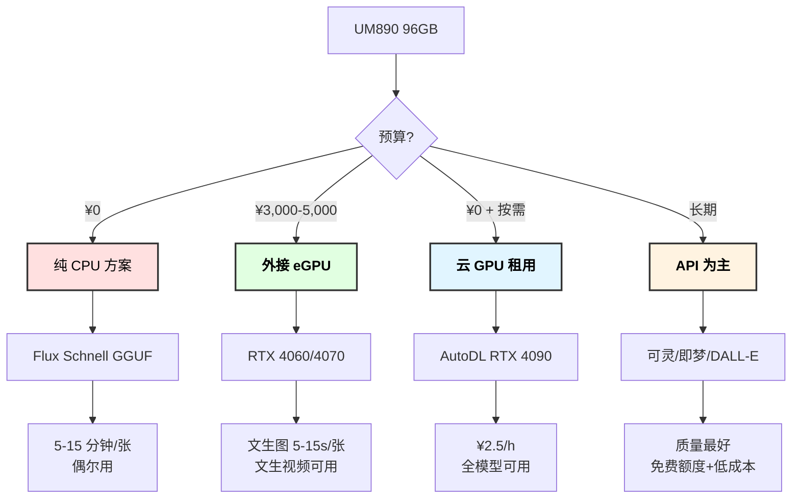

# 铭凡 UM890 本地文生图/文生视频模型部署方案

## 1. 硬件分析

### 1.1 配置评估

| 组件 | 规格 | 文生图适配评估 |
|-----|------|--------------|
| **CPU** | AMD Ryzen 9 8945HS (8C/16T, 5.2GHz) | 可跑 Flux GGUF，非常慢 |
| **内存** | 96GB DDR5-5600 | 足够，可分配大量给模型 |
| **核显** | Radeon 780M (12CU, 共享显存) | **无法运行** ComfyUI/SD (ROCm 不支持 780M) |
| **NPU** | AMD Ryzen AI (39 TOPS) | 目前无主流模型适配 |
| **独显** | 无 | 致命短板 |

### 1.2 残酷现实

```
┌──────────────────────────────────────────────────────────────────┐
│                    UM890 文生图/视频能力评估                       │
├──────────────────────────────────────────────────────────────────┤
│                                                                  │
│  ❌ Radeon 780M 核显无法运行 ComfyUI                             │
│     - ROCm 不支持 780M（GitHub Issue #4557 确认）                │
│     - 尝试运行会 GPU hang + core dump                            │
│                                                                  │
│  ⚠️ 纯 CPU 可以跑 Flux GGUF，但速度极慢                         │
│     - 1024x1024 单张图片预估 5-15 分钟                           │
│     - 实用性很低                                                  │
│                                                                  │
│  ❌ 文生视频本地几乎不可行                                        │
│     - 最小的 Wan2.1-1.3B 也需要 8GB 独立 VRAM                   │
│     - CogVideoX 最低需要 16GB VRAM                               │
│     - 纯 CPU 生成一段 5 秒视频可能需要数小时                     │
│                                                                  │
│  结论：UM890 不适合本地文生图/视频，建议外接 GPU 或用 API        │
├──────────────────────────────────────────────────────────────────┤
│  推荐：外接 eGPU 或购买独立 GPU 主机 + API 为主的混合方案        │
└──────────────────────────────────────────────────────────────────┘
```

## 2. 方案 A：纯 CPU 文生图（勉强可用）

虽然不推荐，但技术上可行。适合偶尔生成、不急着出结果的场景。

### 2.1 ComfyUI + Flux GGUF (CPU 模式)

```bash
# 1. 安装 ComfyUI
git clone https://github.com/comfyanonymous/ComfyUI.git
cd ComfyUI

# 2. 创建 Python 虚拟环境
python -m venv venv
source venv/bin/activate

# 3. 安装 PyTorch CPU 版本（关键：不要装 GPU 版）
pip install torch torchvision --index-url https://download.pytorch.org/whl/cpu

# 4. 安装依赖
pip install -r requirements.txt

# 5. 安装 GGUF 支持节点
cd custom_nodes
git clone https://github.com/city96/ComfyUI-GGUF.git
cd ..

# 6. 下载量化模型（选 Q4 减少内存占用）
mkdir -p models/unet
# Flux.1 Schnell Q4_0 (~7GB)
wget -P models/unet/ \
  "https://huggingface.co/city96/FLUX.1-schnell-gguf/resolve/main/flux1-schnell-Q4_0.gguf"

# 7. 下载 VAE 和 CLIP
mkdir -p models/vae models/clip
# 从 HuggingFace 下载对应的 VAE 和 Text Encoder

# 8. 以 CPU 模式启动
python main.py --cpu
```

### 2.2 性能预期

| 模型 | 量化 | 内存占用 | 1024x1024 速度 | 实用性 |
|-----|------|---------|---------------|-------|
| **Flux.1 Schnell Q4** | Q4_0 | ~7GB | 5-10 分钟 | 勉强 |
| **Flux.1 Schnell Q5** | Q5_K_S | ~8.3GB | 8-15 分钟 | 差 |
| **SDXL Q4** | Q4_0 | ~4GB | 3-8 分钟 | 勉强 |
| **Flux.1 Dev Q4** | Q4_0 | ~7GB | 15-30 分钟 | 不实用 |

### 2.3 优化建议

```yaml
ComfyUI CPU 优化参数:
  # 使用所有 CPU 核心
  OMP_NUM_THREADS: 16
  
  # 内存映射加速
  启用 mmap: true
  
  # 只用 Schnell（4 步就能出图，Dev 要 20-30 步）
  推荐模型: Flux.1 Schnell
  
  # 降低分辨率
  推荐分辨率: 512x512 或 768x768（速度提升 3-4 倍）
  
  # 批量生成时使用队列
  # 可以在 96GB 内存中同时加载模型 + 排队多张图
```

## 3. 方案 B：外接 eGPU（推荐升级路线）

### 3.1 UM890 支持 eGPU

UM890 配备 USB4/雷电接口，支持外接 GPU 坞。

| eGPU 方案 | GPU | 显存 | 预算 | 文生图速度 |
|----------|-----|------|------|----------|
| **入门** | RTX 4060 | 8GB | ~¥3,500 | Flux Schnell: 5-10s/张 |
| **主力** | RTX 4070 Ti Super | 16GB | ~¥5,500 | Flux Dev: 8-15s/张 |
| **旗舰** | RTX 4090 | 24GB | ~¥14,000 | Flux Dev: 3-5s/张 |

eGPU 坞推荐：
| 产品 | 接口 | 价格 | 备注 |
|-----|------|------|------|
| Razer Core X | 雷电3/4 | ~¥1,500 | 成熟稳定 |
| 铭凡 eGPU 坞 | USB4 | ~¥800 | 性价比高 |
| Sonnet Breakaway | 雷电3/4 | ~¥2,000 | 体积小 |

### 3.2 eGPU + ComfyUI 配置

```bash
# Linux 下 eGPU 热插拔
# 确认 eGPU 识别
lspci | grep -i nvidia

# 安装 NVIDIA 驱动
sudo apt install nvidia-driver-560

# 安装 CUDA 版 PyTorch
pip install torch torchvision --index-url https://download.pytorch.org/whl/cu124

# ComfyUI 正常 GPU 模式启动
python main.py --gpu-only
```

### 3.3 eGPU 方案下可运行的模型

#### 文生图

| 模型 | 显存需求 | RTX 4060 (8GB) | RTX 4070 Ti S (16GB) | RTX 4090 (24GB) |
|-----|---------|----------------|---------------------|----------------|
| **Flux.1 Schnell** | 8-12GB | ✅ Q8 量化 | ✅ FP16 | ✅ FP16 |
| **Flux.1 Dev** | 12-24GB | ⚠️ Q4 量化 | ✅ Q8 量化 | ✅ FP16 |
| **Flux.2 Klein 4B** | ~13GB | ⚠️ Q5 量化 | ✅ FP16 | ✅ FP16 |
| **SDXL** | ~6.5GB | ✅ FP16 | ✅ FP16 | ✅ FP16 |
| **SD 3.5 Medium** | ~8GB | ✅ FP16 | ✅ FP16 | ✅ FP16 |
| **HiDream I1** | 24GB+ | ❌ | ❌ | ⚠️ 量化 |

#### 文/图生视频

| 模型 | 显存需求 | RTX 4060 | RTX 4070 Ti S | RTX 4090 |
|-----|---------|----------|--------------|----------|
| **Wan2.1 T2V-1.3B** | ~8GB | ✅ 480p 5s | ✅ 720p 5s | ✅ 720p 10s |
| **Wan2.1 T2V-14B** | 12GB+ | ❌ | ⚠️ 量化+低分辨率 | ✅ 480p |
| **CogVideoX-2B** | ~12GB | ❌ | ✅ 量化 | ✅ FP16 |
| **CogVideoX-5B** | ~16GB | ❌ | ✅ 量化 | ✅ FP16 |
| **AnimateDiff** | ~8GB | ✅ | ✅ | ✅ |
| **SVD (Stable Video)** | ~8GB | ✅ | ✅ | ✅ |

## 4. 方案 C：云 GPU 租用（按需使用）

不想购置硬件的话，租用云 GPU 是灵活的选择。

### 4.1 国内云 GPU 平台

| 平台 | GPU | 显存 | 价格/小时 | 适合场景 |
|-----|-----|------|----------|---------|
| **AutoDL** | RTX 4090 | 24GB | ¥2-3 | 批量生成 |
| **Featurize** | RTX 3090 | 24GB | ¥1.5-2 | 性价比 |
| **恒源云** | A100 | 40GB | ¥8-12 | 大模型视频 |
| **矩池云** | RTX 4090 | 24GB | ¥2-3 | ComfyUI 预装 |
| **阿里云 PAI** | A10 | 24GB | ¥5-8 | 企业级 |

### 4.2 AutoDL + ComfyUI 快速部署

```bash
# AutoDL 上选择 RTX 4090 镜像

# 1. 选择社区镜像（搜索 ComfyUI，通常有预装好的）
# 或手动安装：

# 2. 克隆 ComfyUI
git clone https://github.com/comfyanonymous/ComfyUI.git
cd ComfyUI
pip install -r requirements.txt

# 3. 下载模型到数据盘（AutoDL 数据盘不计费）
mkdir -p /root/autodl-tmp/models
ln -s /root/autodl-tmp/models models/checkpoints

# 4. 开放端口并启动
python main.py --listen 0.0.0.0 --port 8188

# 通过 AutoDL 的端口映射在本地浏览器访问
```

### 4.3 成本估算

```yaml
场景1 - 偶尔使用（每周 2 小时）:
  RTX 4090 @ ¥2.5/h × 8h/月 = ¥20/月
  可生成: ~3000 张图片 或 ~200 段视频

场景2 - 中度使用（每天 1 小时）:
  RTX 4090 @ ¥2.5/h × 30h/月 = ¥75/月
  可生成: ~11000 张图片 或 ~750 段视频
  
场景3 - 批量生成:
  开机集中生成，用完即关
  更经济灵活
```

## 5. 推荐本地模型详解

### 5.1 文生图模型

#### Flux.1 Schnell（首推）

```yaml
推荐理由:
  - Apache 2.0 开源许可，可商用
  - 仅需 4 步即可出图（其他需 20-30 步）
  - 文字渲染能力强（可在图中写字）
  - GGUF 量化后 8GB 显存可用

适用: 快速原型、商业用途、需要文字的场景

ComfyUI 工作流:
  模型: flux1-schnell-Q5_K_S.gguf
  步数: 4
  CFG Scale: 1.0
  分辨率: 1024x1024
  采样器: euler
  调度器: simple
```

#### Flux.1 Dev（质量最佳）

```yaml
推荐理由:
  - 开源中质量最高的文生图模型
  - 人物细节、手部准确率高
  - 丰富的 LoRA 生态

局限: 非商用许可，需 12GB+ 显存
适用: 个人创作、艺术作品

ComfyUI 工作流:
  模型: flux1-dev-Q8_0.gguf
  步数: 20-30
  CFG Scale: 3.5
  分辨率: 1024x1024
  采样器: euler
  调度器: normal
```

#### SDXL（生态最成熟）

```yaml
推荐理由:
  - 最丰富的 LoRA/ControlNet 生态
  - 显存需求最低（6.5GB）
  - 支持负面提示词（Flux 不支持）
  - 社区资源极其丰富

局限: 图片质量略逊于 Flux
适用: 需要精细风格控制、使用 LoRA 的场景

ComfyUI 工作流:
  模型: sd_xl_base_1.0.safetensors
  步数: 25-30
  CFG Scale: 7.0
  分辨率: 1024x1024
  采样器: dpmpp_2m
  调度器: karras
```

### 5.2 文/图生视频模型

#### Wan2.1 T2V-1.3B（门槛最低）

```yaml
推荐理由:
  - 仅需 8GB 显存
  - 支持文生视频 + 图生视频
  - 开源 Apache 2.0 许可
  - 支持中英文文字渲染

性能 (RTX 4090):
  480P 5s: ~4 分钟
  
安装:
  git clone https://github.com/Wan-Video/Wan2.1
  cd Wan2.1
  pip install -r requirements.txt
  
  # 下载 1.3B 模型
  huggingface-cli download Wan-AI/Wan2.1-T2V-1.3B --local-dir ./models/

运行:
  python generate.py \
    --task t2v-1.3B \
    --size 832*480 \
    --ckpt_dir ./models/Wan2.1-T2V-1.3B \
    --prompt "一只可爱的猫咪在花园里玩耍" \
    --output ./output/
```

#### CogVideoX-2B（质量好）

```yaml
推荐理由:
  - 更好的视频连贯性
  - 3D 因果 VAE 架构
  - 支持 diffusers 库直接调用
  
显存需求: 12-16GB (量化后)

安装:
  pip install diffusers transformers accelerate

使用:
  from diffusers import CogVideoXPipeline
  import torch
  
  pipe = CogVideoXPipeline.from_pretrained(
      "THUDM/CogVideoX-2b",
      torch_dtype=torch.float16
  )
  pipe.enable_model_cpu_offload()  # 显存不够时启用
  
  video = pipe(
      prompt="一只猫咪在花园里奔跑",
      num_frames=49,
      guidance_scale=6.0,
  ).frames[0]
```

#### AnimateDiff（轻量短动画）

```yaml
推荐理由:
  - 可复用 SD 1.5/SDXL 的 LoRA
  - 显存需求低 (~8GB)
  - 适合短动画 GIF
  - ComfyUI 原生支持

局限: 动作幅度和复杂度有限
适用: 短动画、表情包、简单运动

ComfyUI 节点:
  - AnimateDiff Loader
  - Motion Module (mm_sd15_v3.ckpt)
  - 配合 ControlNet 可做更精确控制
```

## 6. UM890 最终推荐方案

### 6.1 方案决策树



### 6.2 综合推荐

```yaml
最佳实践 - 混合方案:

  日常文生图:
    方案: API 为主（即梦免费 66 积分/天 + 可灵 366 积分/月）
    成本: ¥0
    速度: 秒级
    
  批量文生图:
    方案: 云 GPU（AutoDL RTX 4090 + ComfyUI + Flux）
    成本: ¥2.5/h
    速度: 3-5s/张
    
  文生视频:
    方案: API 为主（可灵 2.1 / MiniMax）
    成本: ¥2-8/段
    速度: <1 分钟
    
  UM890 角色:
    - 运行 OpenClaw / ComfyUI 前端界面
    - 做图像后处理（Pillow / FFmpeg）
    - 编排工作流和缓存管理
    - 通用 LLM 推理（Ollama + Qwen2.5:14b）
```

## 7. 如果还是想加独显

如果后续想升级硬件专门跑文生图/视频，可以考虑单独组一台 GPU 服务器：

| 方案 | GPU | 显存 | 整机预算 | 适合 |
|-----|-----|------|---------|------|
| **入门** | RTX 4060 Ti 16GB | 16GB | ¥8,000 | 文生图 |
| **主力** | RTX 4090 | 24GB | ¥18,000 | 文生图+视频 |
| **双卡** | 2x RTX 3090 | 48GB | ¥15,000 | 大模型视频 |
| **专业** | RTX 5090 (2025) | 32GB | ¥16,000+ | 全能 |

---

*文档版本: 2.0.0 | 最后更新: 2026-03-08*
*重点修正：本文档聚焦文生图/文生视频模型，非通用 LLM*
