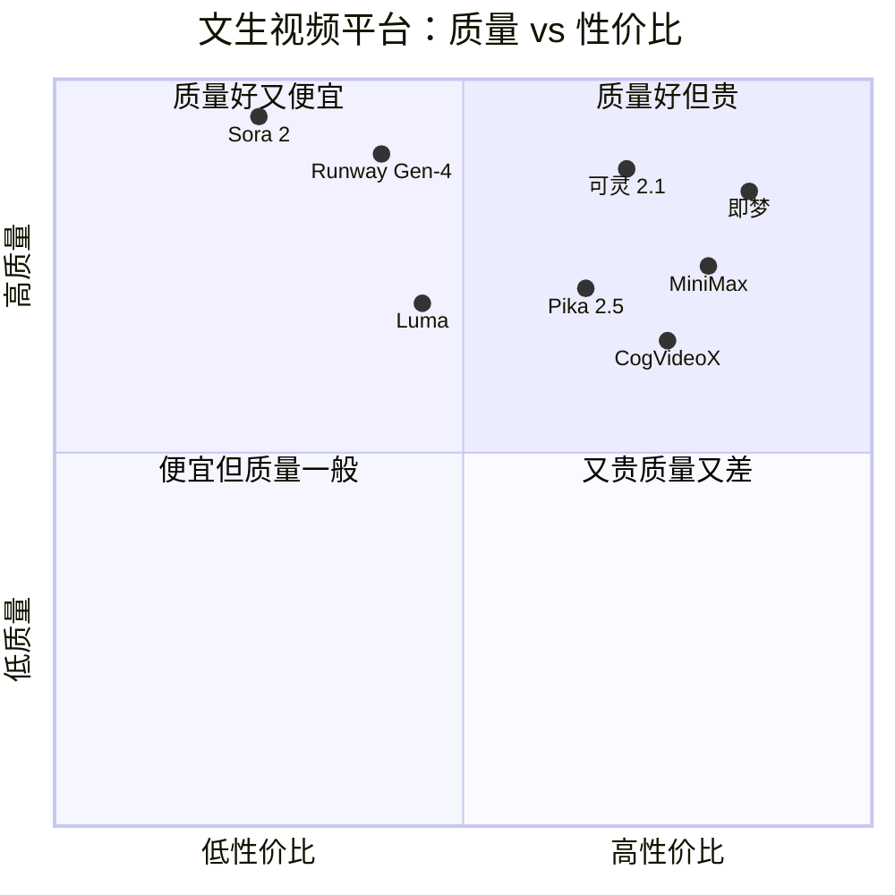
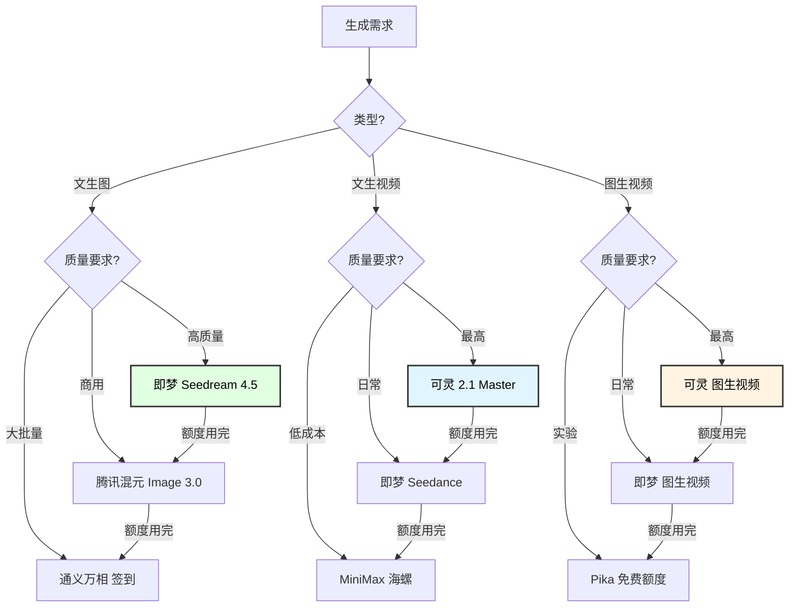

# 文生图/文生视频 API 免费额度与薅羊毛指南（2026年3月更新）

## 1. 文生图 API 全景对比

### 1.1 国内平台

| 平台 | 核心模型 | 免费额度 | 单张价格 | 质量评级 | 推荐指数 |
|-----|---------|---------|---------|---------|---------|
| **即梦 (字节)** | Seedream 4.5 | 66积分/天 (~66张) | ¥0.1/张 | ⭐⭐⭐⭐⭐ | ⭐⭐⭐⭐⭐ |
| **通义万相 (阿里)** | 万相 | 50灵感值/天签到 | 暂未售卖 | ⭐⭐⭐⭐ | ⭐⭐⭐⭐⭐ |
| **可灵 (快手)** | 可灵 2.1 | 366积分/月 | ¥0.25/张 | ⭐⭐⭐⭐⭐ | ⭐⭐⭐⭐ |
| **腾讯混元图** | 混元Image 3.0 | 100万Token | ¥0.03/张 | ⭐⭐⭐⭐⭐ | ⭐⭐⭐⭐ |
| **智谱 CogView** | CogView-4 | 500万Token | ~¥0.05/张 | ⭐⭐⭐⭐ | ⭐⭐⭐ |

### 1.2 国际平台

| 平台 | 核心模型 | 免费额度 | 单张价格 | 质量评级 | 推荐指数 |
|-----|---------|---------|---------|---------|---------|
| **Google Imagen** | Imagen 4 Fast | 每日有限额 | $0.02/张 | ⭐⭐⭐⭐⭐ | ⭐⭐⭐⭐ |
| **OpenAI** | GPT Image 1.5 | 无免费 | $0.04/张 | ⭐⭐⭐⭐⭐ | ⭐⭐⭐ |
| **Stability AI** | SD 3.5 | 25积分新用户 | $0.035-0.08/张 | ⭐⭐⭐⭐ | ⭐⭐⭐ |
| **Black Forest** | Flux 2 Pro | 无免费 | $0.055/张 | ⭐⭐⭐⭐⭐ | ⭐⭐⭐ |
| **Midjourney** | MJ v7 | 无免费 | $10/月起 | ⭐⭐⭐⭐⭐ | ⭐⭐ |

### 1.3 2026 文生图质量排行（LM Arena Elo 排名）

```
排名  模型                         Elo分   单张成本    性价比
─────────────────────────────────────────────────────────────
 1.   Flux 2 Pro v1.1              1265    $0.055     ⭐⭐⭐
 2.   GPT Image 1.5                1264    $0.040     ⭐⭐⭐⭐
 3.   腾讯混元 Image 3.0            1238    $0.030     ⭐⭐⭐⭐⭐
 4.   Google Imagen 4 Fast         1220    $0.020     ⭐⭐⭐⭐⭐
 5.   字节 Seedream 4.5            ~1230    ~$0.014    ⭐⭐⭐⭐⭐
 6.   Stability Ultra               1180    $0.080     ⭐⭐
 7.   DALL-E 3                      1150    $0.040     ⭐⭐⭐
```

## 2. 文生视频/图生视频 API 全景对比

### 2.1 国内平台

| 平台 | 核心模型 | 免费额度 | 单段价格(5s) | 最长 | 质量 | 推荐 |
|-----|---------|---------|------------|------|------|------|
| **可灵** | 可灵 2.1 Master | 66积分/天 | ¥8 (API) | 10s | ⭐⭐⭐⭐⭐ | ⭐⭐⭐⭐⭐ |
| **即梦** | Seedance | 66积分/天 | ~¥5-20积分 | 12s免费版 | ⭐⭐⭐⭐⭐ | ⭐⭐⭐⭐⭐ |
| **MiniMax 海螺** | Video-01 | 注册送积分 | ¥1.35-3.50 | 6s | ⭐⭐⭐⭐ | ⭐⭐⭐⭐ |
| **智谱 CogVideo** | CogVideoX | 500万Token | ~¥0.5 | 6s | ⭐⭐⭐⭐ | ⭐⭐⭐ |
| **Vidu** | Vidu 2.0 | 每月赠积分 | ~¥5 | 8s | ⭐⭐⭐⭐ | ⭐⭐⭐ |

### 2.2 国际平台

| 平台 | 核心模型 | 免费额度 | 月费 | 最长 | 质量 | 推荐 |
|-----|---------|---------|------|------|------|------|
| **Runway** | Gen-4 | 125积分(一次) | $12-95/月 | 10s+4K | ⭐⭐⭐⭐⭐ | ⭐⭐⭐⭐ |
| **Pika** | Pika 2.5 | 80积分/月 | $8-58/月 | 10s | ⭐⭐⭐⭐ | ⭐⭐⭐⭐ |
| **Sora** | Sora 2 | 无免费 | $20-200/月 | 25s 1080p | ⭐⭐⭐⭐⭐ | ⭐⭐⭐ |
| **Luma** | Dream Machine | 30次/月 | $24-120/月 | 5s | ⭐⭐⭐⭐ | ⭐⭐⭐ |
| **Stable Video** | SVD | API按量 | $0.20/段 | 4s | ⭐⭐⭐ | ⭐⭐ |

### 2.3 性能对比



## 3. 薅羊毛策略

### 3.1 文生图：零成本日均产出

```yaml
每日免费文生图额度:
  即梦:          66 张/天
  通义万相:      ~50 张/天（签到）
  可灵:          ~12 张/天（366/月）
  ──────────────────────────
  日均总计:      ~128 张/天
  月均总计:      ~3,840 张/月

额外一次性额度:
  Stability AI:  25 张（新用户）
  智谱CogView:   ~数百张（500万Token）
  腾讯混元:      ~数万张（100万Token，¥0.03/张 Token 消耗低）

理论月免费总量: 4,000+ 张
```

### 3.2 文生视频：零成本日均产出

```yaml
每日免费视频额度:
  即梦:          ~6 段/天（积分看消耗）
  可灵:          ~3 段/天（366积分/月，每段消耗~4积分）
  ──────────────────────────
  日均总计:      ~9 段/天
  月均总计:      ~270 段/月

一次性或月度免费:
  Pika:          80积分/月（约 15-20 段）
  Runway:        125积分（一次性，约 5-10 段）
  Luma:          30 段/月
  ──────────────────────────
  额外月度:      ~50 段/月

理论月免费总量: 320+ 段视频
```

### 3.3 多平台轮换策略



### 3.4 API 代理聚合方案

使用第三方 API 聚合平台，可以用统一接口调用多个平台，自动选择最便宜的：

```python
# multi_image_gen.py
"""多平台文生图轮换调用"""

import httpx
import os
import json
from typing import Optional, List
from dataclasses import dataclass
from enum import Enum

class Provider(Enum):
    JIMENG = "jimeng"       # 即梦
    KLING = "kling"         # 可灵
    HUNYUAN = "hunyuan"     # 腾讯混元
    WANXIANG = "wanxiang"   # 通义万相
    DALLE = "dalle"         # DALL-E
    FLUX = "flux"           # Flux API

@dataclass
class ImageResult:
    url: str
    provider: str
    cost: float
    width: int
    height: int

class MultiImageGenerator:
    """多平台文生图生成器，优先使用免费额度"""
    
    PROVIDER_PRIORITY = [
        # 按免费额度和质量排序
        Provider.JIMENG,     # 每日66张免费
        Provider.WANXIANG,   # 每日签到免费
        Provider.KLING,      # 月366积分
        Provider.HUNYUAN,    # 100万Token
        Provider.DALLE,      # 付费
        Provider.FLUX,       # 付费
    ]
    
    def __init__(self):
        self.clients = {}
        self._init_providers()
    
    def _init_providers(self):
        provider_configs = {
            Provider.JIMENG: {
                "base_url": "https://jimeng.jianying.com/api",
                "key_env": "JIMENG_API_KEY",
            },
            Provider.KLING: {
                "base_url": "https://api.klingai.com/v1",
                "key_env": "KLING_API_KEY",
            },
            Provider.HUNYUAN: {
                "base_url": "https://hunyuan.cloud.tencent.com/api",
                "key_env": "HUNYUAN_API_KEY",
            },
            Provider.DALLE: {
                "base_url": "https://api.openai.com/v1",
                "key_env": "OPENAI_API_KEY",
            },
        }
        for provider, config in provider_configs.items():
            key = os.environ.get(config["key_env"])
            if key:
                self.clients[provider] = {
                    "base_url": config["base_url"],
                    "api_key": key,
                    "failed": False,
                }
    
    def generate(
        self,
        prompt: str,
        size: str = "1024x1024",
        style: Optional[str] = None,
    ) -> ImageResult:
        """按优先级轮换调用"""
        for provider in self.PROVIDER_PRIORITY:
            if provider not in self.clients or self.clients[provider]["failed"]:
                continue
            try:
                return self._call_provider(provider, prompt, size, style)
            except Exception as e:
                print(f"[{provider.value}] failed: {e}")
                if "quota" in str(e).lower() or "limit" in str(e).lower():
                    self.clients[provider]["failed"] = True
                continue
        raise Exception("All providers exhausted")
    
    def _call_provider(
        self,
        provider: Provider,
        prompt: str,
        size: str,
        style: Optional[str],
    ) -> ImageResult:
        config = self.clients[provider]
        
        if provider == Provider.DALLE:
            return self._call_dalle(config, prompt, size, style)
        elif provider == Provider.KLING:
            return self._call_kling(config, prompt, size, style)
        # ... 其他 Provider 类似
        
        raise NotImplementedError(f"Provider {provider} not implemented")
    
    def _call_dalle(self, config, prompt, size, style) -> ImageResult:
        with httpx.Client(timeout=60) as client:
            resp = client.post(
                f"{config['base_url']}/images/generations",
                headers={"Authorization": f"Bearer {config['api_key']}"},
                json={
                    "model": "dall-e-3",
                    "prompt": prompt,
                    "n": 1,
                    "size": size,
                    "style": style or "vivid",
                }
            )
            resp.raise_for_status()
            data = resp.json()
            w, h = map(int, size.split("x"))
            return ImageResult(
                url=data["data"][0]["url"],
                provider="dalle",
                cost=0.04,
                width=w,
                height=h,
            )
    
    def _call_kling(self, config, prompt, size, style) -> ImageResult:
        with httpx.Client(timeout=60) as client:
            resp = client.post(
                f"{config['base_url']}/images/generations",
                headers={"Authorization": f"Bearer {config['api_key']}"},
                json={
                    "prompt": prompt,
                    "n": 1,
                    "image_size": size,
                }
            )
            resp.raise_for_status()
            data = resp.json()
            w, h = map(int, size.split("x"))
            return ImageResult(
                url=data["data"][0]["url"],
                provider="kling",
                cost=0.25,
                width=w,
                height=h,
            )

# 视频生成也类似
class MultiVideoGenerator:
    """多平台视频生成器"""
    
    PROVIDER_PRIORITY = [
        Provider.JIMENG,     # 每日免费
        Provider.KLING,      # 月积分
        # ... 更多
    ]
    
    def generate(
        self,
        prompt: str,
        duration: int = 5,
        resolution: str = "720p",
        init_image: Optional[str] = None,
    ):
        """按优先级生成视频"""
        # 实现逻辑同上
        pass
```

## 4. 详细免费额度领取攻略

### 4.1 即梦（最推荐）

```yaml
注册:
  地址: https://jimeng.jianying.com/
  方式: 字节系账号（抖音/TikTok）
  
免费额度:
  每日: 66 积分（自动发放，不累积）
  文生图: 1 积分/次（4 张图）
  文生视频: 5-20 积分/次
  
最大化技巧:
  - 每天登录领取，不用就浪费了
  - 文生图几乎无限用（66 张/天）
  - 视频生成选标准画质节省积分
  - 免费版视频最长 12 秒

API 接入:
  通过火山引擎开放平台
  地址: https://www.volcengine.com/
  支持 Seedream (图) + Seedance (视频)
```

### 4.2 可灵

```yaml
注册:
  地址: https://klingai.com/ (国际版)
       https://kling.kuaishou.com/ (国内版)
  方式: 快手账号
  
免费额度:
  每月: 366 积分
  图片生成: 4 积分/次
  视频生成: 20-35 积分/次（720p-1080p）
  
最大化技巧:
  - 优先用于视频生成（图片用即梦免费的）
  - 选 720p 标准模式省积分
  - 5 秒视频 = 20 积分，月可生成 ~18 段

API:
  API 地址: https://api.klingai.com/
  API 按量计费: 5s视频 ¥8, 10s视频 ¥16
```

### 4.3 通义万相

```yaml
注册:
  地址: https://tongyi.aliyun.com/wanxiang
  方式: 阿里云/淘宝账号
  
免费额度:
  每日签到: 50 灵感值
  文生图: 1 灵感值/次
  暂未开放购买
  
最大化技巧:
  - 每天签到
  - 电商场景效果特别好（阿里系优化）
  - 通过反馈获取额外灵感值
```

### 4.4 Pika（国际免费视频）

```yaml
注册:
  地址: https://pika.art/
  方式: Google/Discord 账号
  需要: 科学上网
  
免费额度:
  每月: 80 积分
  视频生成: 5 积分/次（约 16 段/月）
  
特点:
  - 生成速度最快（Turbo 12 秒出片）
  - 720p 免费
  - 适合社交媒体短视频
```

### 4.5 Luma Dream Machine

```yaml
注册:
  地址: https://lumalabs.ai/dream-machine
  方式: Google 账号
  
免费额度:
  每月: 30 段视频
  
特点:
  - 相对慷慨的免费额度
  - 3D 场景生成效果好
```

## 5. 付费方案成本分析

### 5.1 文生图月度成本

```
┌────────────────────────────────────────────────────────────────┐
│              月度文生图成本（1000张/月）                         │
├──────────────┬────────┬──────┬────────────────────────────────┤
│ 平台          │ 单价    │ 月费  │ 备注                          │
├──────────────┼────────┼──────┼────────────────────────────────┤
│ 即梦 免费     │ ¥0     │ ¥0   │ 每天 66 张绰绰有余             │
│ 万相 免费     │ ¥0     │ ¥0   │ 每天签到                       │
│ 可灵          │ ¥0.25  │ ¥250 │ 366免费积分用完后               │
│ 腾讯混元      │ ¥0.03  │ ¥30  │ 100万Token 免费额度可覆盖      │
│ GPT Image     │ $0.04  │ $40  │ ~¥280                         │
│ DALL-E 3      │ $0.04  │ $40  │ ~¥280                         │
│ Flux 2 Pro    │ $0.055 │ $55  │ ~¥385                         │
│ Midjourney    │ -      │ $10  │ ~¥70 (基础版 200张/月限制)     │
├──────────────┴────────┴──────┴────────────────────────────────┤
│ 💡 结论：即梦 + 万相免费额度可覆盖绝大部分文生图需求           │
└────────────────────────────────────────────────────────────────┘
```

### 5.2 文生视频月度成本

```
┌────────────────────────────────────────────────────────────────┐
│              月度文生视频成本（100段/月，5秒 720p）              │
├──────────────┬────────┬──────┬────────────────────────────────┤
│ 平台          │ 单价    │ 月费  │ 备注                          │
├──────────────┼────────┼──────┼────────────────────────────────┤
│ 即梦 免费     │ ¥0     │ ¥0   │ 每日 ~6 段，月 ~180 段        │
│ 可灵 免费     │ ¥0     │ ¥0   │ 月 ~18 段                     │
│ Pika 免费     │ $0     │ $0   │ 月 ~16 段                     │
│ Luma 免费     │ $0     │ $0   │ 月 30 段                      │
│ MiniMax       │ ¥1.35  │ ¥135 │ 快速版                        │
│ 可灵 API      │ ¥8     │ ¥800 │ Master 高质量                 │
│ Runway        │ -      │ $28  │ ~¥196 (Pro版)                 │
│ Sora          │ -      │ $20  │ ~¥140 (Plus版，有限次数)      │
│ Pika Pro      │ -      │ $28  │ ~¥196                         │
├──────────────┴────────┴──────┴────────────────────────────────┤
│ 💡 结论：即梦免费 ~180 段/月 可覆盖大部分需求                  │
│     如需高质量：即梦(免费) + 可灵(免费) + Pika(免费)           │
│     = 约 214 段/月，完全免费                                    │
└────────────────────────────────────────────────────────────────┘
```

## 6. 综合推荐方案

### 6.1 零成本方案

```yaml
文生图 (免费):
  首选: 即梦 (66张/天，质量顶级)
  备选: 通义万相 (签到50张/天)
  合计: ~3,480 张/月

文生视频 (免费):
  首选: 即梦 (每日积分)
  备选: 可灵 (月366积分)
  海外: Pika (80积分/月) + Luma (30段/月)
  合计: ~264 段/月

图生视频 (免费):
  首选: 可灵 (效果最好)
  备选: 即梦
  合计: ~50 段/月
```

### 6.2 低成本高质量方案（¥100/月以内）

```yaml
文生图:
  日常: 即梦免费 (够用)
  高质量: 腾讯混元 API (¥0.03/张) 
  总费用: ~¥0

文生视频:
  日常: 即梦免费 + 可灵免费
  高质量: MiniMax 快速版 (¥1.35/段 × 50 段 = ¥67.5)
  总费用: ~¥70

总计: ~¥70/月，可产出 3000+ 图 + 300+ 视频
```

### 6.3 商业级方案

```yaml
文生图:
  主力: GPT Image 1.5 ($0.04/张)
  备选: Flux 2 Pro ($0.055/张)
  预算: ~$200/月（5000张）

文生视频:
  主力: 可灵 2.1 Master (¥8/段)
  快速: MiniMax (¥2/段)
  高端: Runway Gen-4 ($28/月)
  预算: ~¥2,000/月

总计: ~¥3,500/月
```

## 7. 注意事项

### 7.1 版权与商用

| 平台 | 免费版可商用 | 付费版可商用 | 水印 |
|-----|------------|------------|------|
| 即梦 | ❌ (需会员) | ✅ | 免费版有 |
| 可灵 | ⚠️ 有限 | ✅ | 免费版有 |
| 通义万相 | ⚠️ 有限 | ✅ | 无 |
| DALL-E | ✅ | ✅ | 无 |
| Midjourney | ❌ (需付费) | ✅ | 无 |
| Pika | ⚠️ 有限 | ✅ | 免费版有 |

### 7.2 风险提示

```yaml
免费额度风险:
  - 平台可能随时调整免费策略（Google 曾削减 92% 配额）
  - 多账号可能被封禁
  - 生产环境不要完全依赖免费额度

内容安全:
  - 所有平台都有内容审核
  - 涉及人脸/真实人物可能被拒绝
  - 国内平台对内容审核更严格

数据隐私:
  - 上传的图片可能用于模型训练
  - 敏感内容避免上传到第三方平台
  - 商业项目注意 TOS 条款
```

---

*文档版本: 2.0.0 | 最后更新: 2026-03-08*
*重点修正：本文档聚焦文生图/文生视频/图生视频模型，非通用聊天 LLM*
*免费额度信息可能随时变化，请以各平台官方为准*
