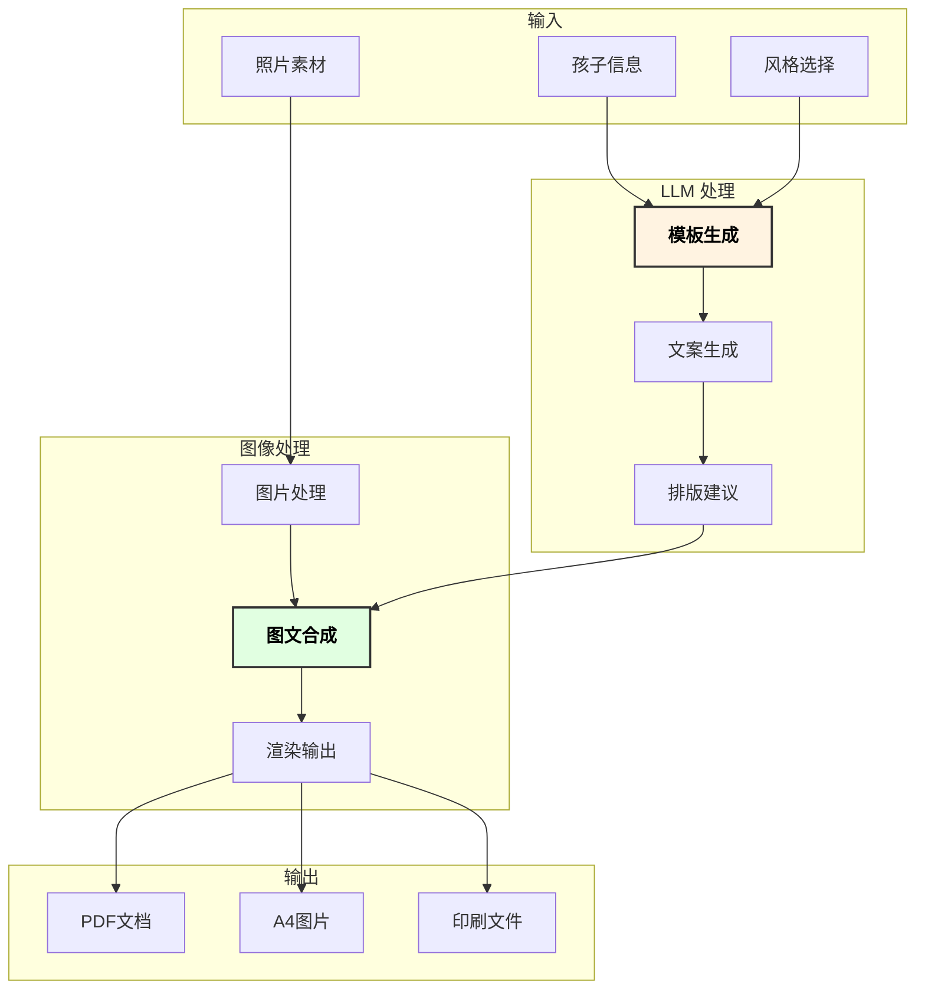

# 儿童成长手册 LLM 自动生成方案

## 1. 概述

本方案使用 LLM 生成儿童成长手册模板，结合用户上传的照片，自动排版生成 A4 尺寸的 PDF 或图片。

### 1.1 功能特点

- **模板生成**：LLM 根据孩子年龄段生成主题文案
- **智能排版**：自动将照片嵌入设计好的模板
- **多种风格**：森系水彩、北欧简约、绘本故事风等
- **批量输出**：支持整本手册一键生成

## 2. 系统架构



## 3. LLM 模板系统

### 3.1 模板 Prompt 设计

```yaml
# 成长手册模板生成 Prompt
system_prompt: |
  你是一位专业的儿童成长手册设计师，擅长为不同年龄段的孩子创作温馨、有意义的成长记录文案。
  
  设计原则：
  1. 文案要温暖、有爱、富有童趣
  2. 配合孩子的年龄特点
  3. 留白适度，便于排版
  4. 使用简单易读的字体建议

template_prompt: |
  请为以下信息生成成长手册页面：
  
  孩子信息：
  - 姓名：{name}
  - 昵称：{nickname}
  - 出生日期：{birthday}
  - 当前年龄：{age}
  - 记录主题：{theme}
  - 风格偏好：{style}
  
  请生成：
  1. 页面标题（8字以内）
  2. 主文案（50-100字）
  3. 小标签/贴纸文字（3-5个，每个4字以内）
  4. 装饰元素建议
  5. 排版布局建议

  以 JSON 格式输出。
```

### 3.2 模板类型定义

```python
# templates.py
from dataclasses import dataclass
from typing import List, Optional
from enum import Enum

class HandbookStyle(Enum):
    FOREST_WATERCOLOR = "森系水彩拼贴"    # 自然、灵动、高级感
    NORDIC_MINIMAL = "北欧极简手账"       # 干净、清爽、现代感
    STORYBOOK = "绘本故事感"              # 温馨、叙事性强
    CUTE_CARTOON = "可爱卡通风"           # 活泼、色彩鲜艳
    VINTAGE_JOURNAL = "复古日记本"        # 怀旧、文艺

class PageTheme(Enum):
    BIRTH = "出生记录"
    MONTHLY = "月龄记录"
    FIRST_YEAR = "周岁纪念"
    MILESTONE = "成长里程碑"
    BIRTHDAY = "生日纪念"
    FESTIVAL = "节日记录"
    TRAVEL = "旅行记录"
    DAILY = "日常瞬间"
    GROWTH_DATA = "成长数据"

@dataclass
class PageTemplate:
    """页面模板"""
    title: str                      # 页面标题
    main_text: str                  # 主文案
    tags: List[str]                 # 小标签
    decorations: List[str]          # 装饰元素
    layout: dict                    # 排版信息
    photo_slots: List[dict]         # 照片位置
    background: Optional[str]       # 背景样式

@dataclass
class HandbookConfig:
    """手册配置"""
    child_name: str
    nickname: str
    birthday: str
    style: HandbookStyle
    page_count: int = 20
    size: str = "A4"  # A4, A5, 方形
```

### 3.3 LLM 文案生成

```python
# content_generator.py
import json
from openai import OpenAI
from templates import HandbookStyle, PageTheme, PageTemplate

class ContentGenerator:
    """使用 LLM 生成手册内容"""
    
    def __init__(self, api_key: str, base_url: str = "https://api.deepseek.com/v1"):
        self.client = OpenAI(api_key=api_key, base_url=base_url)
        
    def generate_page(
        self, 
        name: str,
        nickname: str,
        age: str,
        theme: PageTheme,
        style: HandbookStyle,
        photo_description: str = ""
    ) -> PageTemplate:
        """生成单页内容"""
        
        prompt = f"""请为以下信息生成成长手册页面内容：

孩子信息：
- 姓名：{name}
- 昵称：{nickname}
- 当前年龄：{age}
- 记录主题：{theme.value}
- 风格偏好：{style.value}
- 照片描述：{photo_description}

请以 JSON 格式输出：
{{
    "title": "页面标题（8字以内，富有童趣）",
    "main_text": "主文案（50-100字，温馨有爱，适合该年龄段）",
    "tags": ["标签1", "标签2", "标签3"],
    "decorations": ["装饰元素1", "装饰元素2"],
    "layout_suggestion": "排版建议",
    "color_palette": ["#颜色1", "#颜色2", "#颜色3"]
}}
"""
        
        response = self.client.chat.completions.create(
            model="deepseek-chat",
            messages=[
                {"role": "system", "content": self._get_system_prompt(style)},
                {"role": "user", "content": prompt}
            ],
            temperature=0.8,
            response_format={"type": "json_object"}
        )
        
        content = json.loads(response.choices[0].message.content)
        return self._parse_to_template(content, theme)
    
    def _get_system_prompt(self, style: HandbookStyle) -> str:
        style_guides = {
            HandbookStyle.FOREST_WATERCOLOR: """
                你是森系水彩风格的文案设计师。
                特点：使用自然元素（树叶、花朵、小动物）
                色调：大地色、莫兰迪色系
                文字：诗意、温柔、有画面感
            """,
            HandbookStyle.NORDIC_MINIMAL: """
                你是北欧极简风格的文案设计师。
                特点：留白充足、几何元素、简洁线条
                色调：黑白灰为主，点缀少量彩色
                文字：简洁、直白、有力量感
            """,
            HandbookStyle.STORYBOOK: """
                你是绘本故事风格的文案设计师。
                特点：像讲故事一样，有开头有结尾
                色调：柔和、温暖、饱和度适中
                文字：叙事性强、有童话感、想象力丰富
            """,
            HandbookStyle.CUTE_CARTOON: """
                你是可爱卡通风格的文案设计师。
                特点：圆润可爱、表情丰富、活泼跳跃
                色调：明亮、饱和、对比强烈
                文字：俏皮、有趣、充满活力
            """,
            HandbookStyle.VINTAGE_JOURNAL: """
                你是复古日记本风格的文案设计师。
                特点：做旧纸张质感、手写字体、邮票贴纸
                色调：棕色、米色、复古滤镜感
                文字：文艺、怀旧、有仪式感
            """
        }
        return style_guides.get(style, style_guides[HandbookStyle.STORYBOOK])
    
    def _parse_to_template(self, content: dict, theme: PageTheme) -> PageTemplate:
        return PageTemplate(
            title=content.get("title", "成长记录"),
            main_text=content.get("main_text", ""),
            tags=content.get("tags", []),
            decorations=content.get("decorations", []),
            layout={"suggestion": content.get("layout_suggestion", "")},
            photo_slots=self._get_photo_slots(theme),
            background=content.get("color_palette", ["#FFF5E6"])[0]
        )
    
    def _get_photo_slots(self, theme: PageTheme) -> List[dict]:
        """根据主题返回照片位置"""
        slots = {
            PageTheme.BIRTH: [
                {"x": 50, "y": 200, "width": 400, "height": 300, "shape": "rounded"},
            ],
            PageTheme.MONTHLY: [
                {"x": 50, "y": 150, "width": 250, "height": 250, "shape": "circle"},
                {"x": 320, "y": 400, "width": 200, "height": 200, "shape": "rounded"},
            ],
            PageTheme.DAILY: [
                {"x": 50, "y": 150, "width": 200, "height": 200, "shape": "rounded"},
                {"x": 270, "y": 150, "width": 200, "height": 200, "shape": "rounded"},
                {"x": 160, "y": 370, "width": 200, "height": 200, "shape": "rounded"},
            ],
        }
        return slots.get(theme, slots[PageTheme.DAILY])
```

## 4. 图像处理与排版

### 4.1 使用 Pillow 进行图文合成

```python
# composer.py
from PIL import Image, ImageDraw, ImageFont, ImageFilter
from pathlib import Path
from typing import List, Tuple, Optional
import io

class PageComposer:
    """A4 页面合成器"""
    
    # A4 尺寸 (300 DPI)
    A4_WIDTH = 2480
    A4_HEIGHT = 3508
    
    def __init__(self, style: str = "forest_watercolor"):
        self.style = style
        self.fonts = self._load_fonts()
        
    def _load_fonts(self) -> dict:
        """加载字体"""
        return {
            "title": ImageFont.truetype("fonts/NotoSansSC-Bold.ttf", 120),
            "body": ImageFont.truetype("fonts/NotoSansSC-Regular.ttf", 48),
            "tag": ImageFont.truetype("fonts/NotoSansSC-Medium.ttf", 36),
            "handwrite": ImageFont.truetype("fonts/HuaKangFangYuan.ttf", 60),
        }
    
    def compose_page(
        self,
        template: 'PageTemplate',
        photos: List[Path],
        output_path: Path
    ) -> Path:
        """合成单页"""
        
        # 1. 创建背景
        page = self._create_background(template.background)
        draw = ImageDraw.Draw(page)
        
        # 2. 添加装饰元素
        page = self._add_decorations(page, template.decorations)
        
        # 3. 放置照片
        for i, slot in enumerate(template.photo_slots):
            if i < len(photos):
                page = self._place_photo(page, photos[i], slot)
        
        # 4. 添加标题
        self._draw_title(draw, template.title)
        
        # 5. 添加主文案
        self._draw_main_text(draw, template.main_text)
        
        # 6. 添加标签
        self._draw_tags(draw, template.tags)
        
        # 7. 保存
        page.save(output_path, "PNG", dpi=(300, 300))
        return output_path
    
    def _create_background(self, color: str) -> Image.Image:
        """创建背景"""
        # 基础纯色背景
        page = Image.new("RGB", (self.A4_WIDTH, self.A4_HEIGHT), color)
        
        # 根据风格添加纹理
        if self.style == "forest_watercolor":
            # 添加水彩纹理
            texture = Image.open("textures/watercolor_bg.png").resize(
                (self.A4_WIDTH, self.A4_HEIGHT)
            )
            page = Image.blend(page, texture, 0.3)
        elif self.style == "vintage_journal":
            # 添加纸张纹理
            texture = Image.open("textures/paper_vintage.png").resize(
                (self.A4_WIDTH, self.A4_HEIGHT)
            )
            page = Image.blend(page, texture, 0.5)
            
        return page
    
    def _place_photo(
        self, 
        page: Image.Image, 
        photo_path: Path, 
        slot: dict
    ) -> Image.Image:
        """放置照片到指定位置"""
        
        photo = Image.open(photo_path)
        
        # 缩放到合适尺寸
        target_size = (slot["width"], slot["height"])
        photo = self._smart_resize(photo, target_size)
        
        # 应用形状遮罩
        if slot.get("shape") == "circle":
            photo = self._apply_circle_mask(photo)
        elif slot.get("shape") == "rounded":
            photo = self._apply_rounded_mask(photo, radius=30)
        
        # 添加阴影
        shadow = self._create_shadow(photo.size)
        page.paste(shadow, (slot["x"] + 10, slot["y"] + 10), shadow)
        
        # 粘贴照片
        page.paste(photo, (slot["x"], slot["y"]), photo if photo.mode == 'RGBA' else None)
        
        return page
    
    def _smart_resize(self, img: Image.Image, target: Tuple[int, int]) -> Image.Image:
        """智能裁剪缩放，保持主体居中"""
        # 计算比例
        img_ratio = img.width / img.height
        target_ratio = target[0] / target[1]
        
        if img_ratio > target_ratio:
            # 图片更宽，按高度缩放
            new_height = target[1]
            new_width = int(new_height * img_ratio)
        else:
            # 图片更高，按宽度缩放
            new_width = target[0]
            new_height = int(new_width / img_ratio)
        
        img = img.resize((new_width, new_height), Image.Resampling.LANCZOS)
        
        # 居中裁剪
        left = (new_width - target[0]) // 2
        top = (new_height - target[1]) // 2
        return img.crop((left, top, left + target[0], top + target[1]))
    
    def _apply_circle_mask(self, img: Image.Image) -> Image.Image:
        """应用圆形遮罩"""
        size = min(img.size)
        mask = Image.new("L", (size, size), 0)
        draw = ImageDraw.Draw(mask)
        draw.ellipse((0, 0, size, size), fill=255)
        
        # 裁剪为正方形
        img = img.crop((
            (img.width - size) // 2,
            (img.height - size) // 2,
            (img.width + size) // 2,
            (img.height + size) // 2
        ))
        
        output = Image.new("RGBA", (size, size), (0, 0, 0, 0))
        output.paste(img, (0, 0))
        output.putalpha(mask)
        return output
    
    def _apply_rounded_mask(self, img: Image.Image, radius: int = 20) -> Image.Image:
        """应用圆角矩形遮罩"""
        mask = Image.new("L", img.size, 0)
        draw = ImageDraw.Draw(mask)
        draw.rounded_rectangle(
            [(0, 0), img.size],
            radius=radius,
            fill=255
        )
        
        output = img.convert("RGBA")
        output.putalpha(mask)
        return output
    
    def _create_shadow(self, size: Tuple[int, int]) -> Image.Image:
        """创建阴影"""
        shadow = Image.new("RGBA", size, (0, 0, 0, 50))
        shadow = shadow.filter(ImageFilter.GaussianBlur(radius=15))
        return shadow
    
    def _draw_title(self, draw: ImageDraw.Draw, title: str):
        """绘制标题"""
        # 标题位置：顶部居中
        bbox = draw.textbbox((0, 0), title, font=self.fonts["title"])
        text_width = bbox[2] - bbox[0]
        x = (self.A4_WIDTH - text_width) // 2
        y = 100
        
        # 绘制文字（带轻微阴影）
        draw.text((x+3, y+3), title, font=self.fonts["title"], fill="#CCCCCC")
        draw.text((x, y), title, font=self.fonts["title"], fill="#333333")
    
    def _draw_main_text(self, draw: ImageDraw.Draw, text: str):
        """绘制主文案"""
        # 自动换行
        max_width = self.A4_WIDTH - 200
        lines = self._wrap_text(text, self.fonts["body"], max_width)
        
        y = self.A4_HEIGHT - 600  # 底部区域
        for line in lines:
            draw.text((100, y), line, font=self.fonts["body"], fill="#555555")
            y += 70
    
    def _draw_tags(self, draw: ImageDraw.Draw, tags: List[str]):
        """绘制标签贴纸"""
        tag_colors = ["#FFE4E1", "#E6F3FF", "#FFF8DC", "#F0FFF0", "#FFF0F5"]
        
        x, y = 100, self.A4_HEIGHT - 200
        for i, tag in enumerate(tags[:5]):
            color = tag_colors[i % len(tag_colors)]
            bbox = draw.textbbox((0, 0), tag, font=self.fonts["tag"])
            tag_width = bbox[2] - bbox[0] + 40
            tag_height = 60
            
            # 绘制标签背景
            draw.rounded_rectangle(
                [(x, y), (x + tag_width, y + tag_height)],
                radius=15,
                fill=color
            )
            
            # 绘制标签文字
            draw.text(
                (x + 20, y + 12),
                tag,
                font=self.fonts["tag"],
                fill="#666666"
            )
            
            x += tag_width + 20
    
    def _wrap_text(self, text: str, font: ImageFont.FreeTypeFont, max_width: int) -> List[str]:
        """文字自动换行"""
        lines = []
        current_line = ""
        
        for char in text:
            test_line = current_line + char
            bbox = font.getbbox(test_line)
            if bbox[2] > max_width:
                lines.append(current_line)
                current_line = char
            else:
                current_line = test_line
        
        if current_line:
            lines.append(current_line)
        
        return lines
    
    def _add_decorations(self, page: Image.Image, decorations: List[str]) -> Image.Image:
        """添加装饰元素"""
        # 装饰素材映射
        decoration_assets = {
            "树叶": "assets/leaf.png",
            "花朵": "assets/flower.png",
            "星星": "assets/star.png",
            "爱心": "assets/heart.png",
            "蝴蝶": "assets/butterfly.png",
            "气球": "assets/balloon.png",
        }
        
        for deco in decorations:
            if deco in decoration_assets:
                try:
                    asset = Image.open(decoration_assets[deco]).convert("RGBA")
                    # 随机位置和旋转
                    import random
                    x = random.randint(0, self.A4_WIDTH - 200)
                    y = random.randint(0, self.A4_HEIGHT - 200)
                    angle = random.randint(-30, 30)
                    asset = asset.rotate(angle, expand=True)
                    page.paste(asset, (x, y), asset)
                except:
                    pass
        
        return page
```

### 4.2 PDF 生成

```python
# pdf_generator.py
from reportlab.lib.pagesizes import A4
from reportlab.pdfgen import canvas
from reportlab.lib.units import mm
from PIL import Image
from pathlib import Path
from typing import List
import io

class PDFGenerator:
    """将多个 A4 图片合成为 PDF"""
    
    def __init__(self, output_path: Path):
        self.output_path = output_path
        self.c = canvas.Canvas(str(output_path), pagesize=A4)
        self.width, self.height = A4
        
    def add_page(self, image_path: Path):
        """添加一页"""
        # 将图片适配到 A4
        self.c.drawImage(
            str(image_path),
            0, 0,
            width=self.width,
            height=self.height,
            preserveAspectRatio=True
        )
        self.c.showPage()
    
    def add_pages(self, image_paths: List[Path]):
        """批量添加页面"""
        for path in image_paths:
            self.add_page(path)
    
    def save(self):
        """保存 PDF"""
        self.c.save()
        return self.output_path


def generate_handbook_pdf(pages: List[Path], output: Path) -> Path:
    """生成完整手册 PDF"""
    pdf = PDFGenerator(output)
    pdf.add_pages(pages)
    pdf.save()
    return output
```

## 5. 完整工作流

### 5.1 命令行工具

```python
#!/usr/bin/env python3
# handbook_cli.py
"""儿童成长手册生成器 CLI"""

import click
from pathlib import Path
from content_generator import ContentGenerator
from composer import PageComposer
from pdf_generator import generate_handbook_pdf
from templates import HandbookStyle, PageTheme

@click.command()
@click.option('--name', required=True, help='孩子姓名')
@click.option('--nickname', default='', help='昵称')
@click.option('--birthday', required=True, help='出生日期 (YYYY-MM-DD)')
@click.option('--photos', required=True, type=click.Path(exists=True), help='照片文件夹路径')
@click.option('--output', default='./output', help='输出目录')
@click.option('--style', 
              type=click.Choice(['forest', 'nordic', 'storybook', 'cartoon', 'vintage']),
              default='forest',
              help='风格选择')
@click.option('--pages', default=20, help='页数')
@click.option('--api-key', envvar='DEEPSEEK_API_KEY', help='LLM API Key')
def generate(name, nickname, birthday, photos, output, style, pages, api_key):
    """生成儿童成长手册"""
    
    # 风格映射
    style_map = {
        'forest': HandbookStyle.FOREST_WATERCOLOR,
        'nordic': HandbookStyle.NORDIC_MINIMAL,
        'storybook': HandbookStyle.STORYBOOK,
        'cartoon': HandbookStyle.CUTE_CARTOON,
        'vintage': HandbookStyle.VINTAGE_JOURNAL,
    }
    
    click.echo(f"🎨 开始生成 {name} 的成长手册...")
    click.echo(f"   风格: {style_map[style].value}")
    click.echo(f"   页数: {pages}")
    
    # 初始化
    content_gen = ContentGenerator(api_key)
    composer = PageComposer(style)
    
    output_dir = Path(output)
    output_dir.mkdir(parents=True, exist_ok=True)
    
    # 收集照片
    photo_dir = Path(photos)
    photo_files = sorted(photo_dir.glob("*.jpg")) + sorted(photo_dir.glob("*.png"))
    
    # 主题序列
    themes = [
        PageTheme.BIRTH,
        PageTheme.MONTHLY,
        PageTheme.MONTHLY,
        PageTheme.MILESTONE,
        PageTheme.DAILY,
        # ... 根据页数动态调整
    ]
    
    generated_pages = []
    
    with click.progressbar(range(pages), label='生成页面') as bar:
        for i in bar:
            theme = themes[i % len(themes)]
            
            # 1. LLM 生成内容
            template = content_gen.generate_page(
                name=name,
                nickname=nickname,
                age=f"第{i+1}页",
                theme=theme,
                style=style_map[style]
            )
            
            # 2. 选择照片
            page_photos = photo_files[i*3:(i+1)*3] if photo_files else []
            
            # 3. 合成页面
            page_path = output_dir / f"page_{i+1:03d}.png"
            composer.compose_page(template, page_photos, page_path)
            generated_pages.append(page_path)
    
    # 4. 生成 PDF
    pdf_path = output_dir / f"{name}_成长手册.pdf"
    generate_handbook_pdf(generated_pages, pdf_path)
    
    click.echo(f"\n✅ 生成完成!")
    click.echo(f"   PNG 文件: {output_dir}")
    click.echo(f"   PDF 文件: {pdf_path}")

if __name__ == '__main__':
    generate()
```

### 5.2 使用示例

```bash
# 基础用法
python handbook_cli.py \
    --name "小明" \
    --nickname "明明" \
    --birthday "2023-05-15" \
    --photos ./photos/xiaoming/ \
    --output ./output/xiaoming_handbook/

# 指定风格和页数
python handbook_cli.py \
    --name "小红" \
    --nickname "红红" \
    --birthday "2022-10-01" \
    --photos ./photos/xiaohong/ \
    --style storybook \
    --pages 30

# 使用环境变量设置 API Key
export DEEPSEEK_API_KEY=sk-xxx
python handbook_cli.py --name "宝宝" --birthday "2024-01-01" --photos ./photos/
```

## 6. Web 界面方案

### 6.1 Gradio 快速界面

```python
# web_ui.py
import gradio as gr
from pathlib import Path
from content_generator import ContentGenerator
from composer import PageComposer
from templates import HandbookStyle, PageTheme

def generate_preview(
    name: str,
    nickname: str,
    style: str,
    theme: str,
    photos: list
) -> str:
    """生成预览页面"""
    
    style_map = {
        "森系水彩": HandbookStyle.FOREST_WATERCOLOR,
        "北欧极简": HandbookStyle.NORDIC_MINIMAL,
        "绘本故事": HandbookStyle.STORYBOOK,
        "可爱卡通": HandbookStyle.CUTE_CARTOON,
        "复古日记": HandbookStyle.VINTAGE_JOURNAL,
    }
    
    theme_map = {
        "出生记录": PageTheme.BIRTH,
        "月龄记录": PageTheme.MONTHLY,
        "成长里程碑": PageTheme.MILESTONE,
        "日常瞬间": PageTheme.DAILY,
    }
    
    # 生成内容
    content_gen = ContentGenerator(api_key="your-key")
    template = content_gen.generate_page(
        name=name,
        nickname=nickname,
        age="",
        theme=theme_map[theme],
        style=style_map[style]
    )
    
    # 合成页面
    composer = PageComposer(style.lower())
    output_path = Path("/tmp/preview.png")
    composer.compose_page(template, [Path(p) for p in photos], output_path)
    
    return str(output_path)

# 创建界面
with gr.Blocks(title="儿童成长手册生成器") as app:
    gr.Markdown("# 🎨 儿童成长手册生成器")
    
    with gr.Row():
        with gr.Column():
            name = gr.Textbox(label="孩子姓名")
            nickname = gr.Textbox(label="昵称")
            style = gr.Dropdown(
                choices=["森系水彩", "北欧极简", "绘本故事", "可爱卡通", "复古日记"],
                value="森系水彩",
                label="风格"
            )
            theme = gr.Dropdown(
                choices=["出生记录", "月龄记录", "成长里程碑", "日常瞬间"],
                value="日常瞬间",
                label="主题"
            )
            photos = gr.File(
                label="上传照片",
                file_count="multiple",
                file_types=["image"]
            )
            generate_btn = gr.Button("生成预览", variant="primary")
            
        with gr.Column():
            preview = gr.Image(label="预览")
            download_btn = gr.Button("下载 PDF")
    
    generate_btn.click(
        generate_preview,
        inputs=[name, nickname, style, theme, photos],
        outputs=[preview]
    )

if __name__ == "__main__":
    app.launch()
```

## 7. 所需资源

### 7.1 字体文件

```yaml
推荐字体:
  中文:
    - 思源黑体 (Noto Sans SC) - 标题/正文
    - 华康方圆体 - 手写感
    - 站酷快乐体 - 童趣
  
  英文:
    - Quicksand - 圆润现代
    - Pacifico - 手写风格
    
下载地址:
  - Google Fonts: https://fonts.google.com/
  - 站酷字体: https://www.zcool.com.cn/special/zcoolfonts/
```

### 7.2 装饰素材

```yaml
素材来源:
  - Flaticon: https://www.flaticon.com/
  - Freepik: https://www.freepik.com/
  - 千图网: https://www.58pic.com/
  
素材类型:
  - PNG 透明背景贴纸
  - 水彩纹理背景
  - 边框和相框
  - 小图标和装饰
```

### 7.3 依赖安装

```bash
pip install Pillow reportlab openai click gradio
```

## 8. 成本估算

```yaml
LLM 调用成本 (20页手册):
  - 每页约 500 tokens
  - 总计 10,000 tokens
  - DeepSeek 成本: 约 ¥0.08
  - 或使用免费额度

其他成本:
  - 字体: 免费
  - 素材: 免费/低价
  - 印刷: 约 ¥50-100/本 (线上印刷)

结论: 一本手册成本 < ¥1 (不含印刷)
```

---

*文档版本: 1.0.0 | 最后更新: 2026-03-08*
