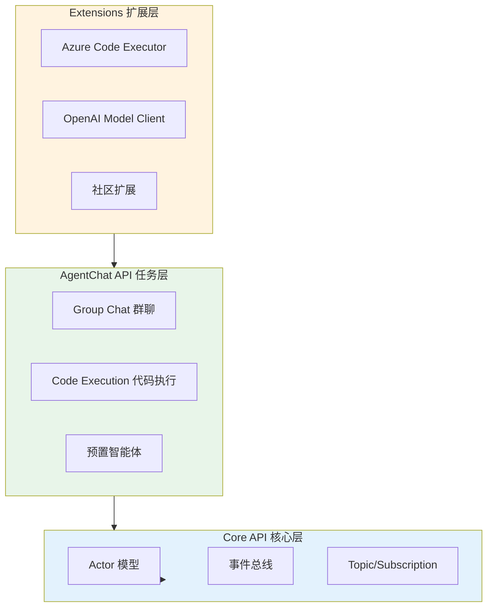
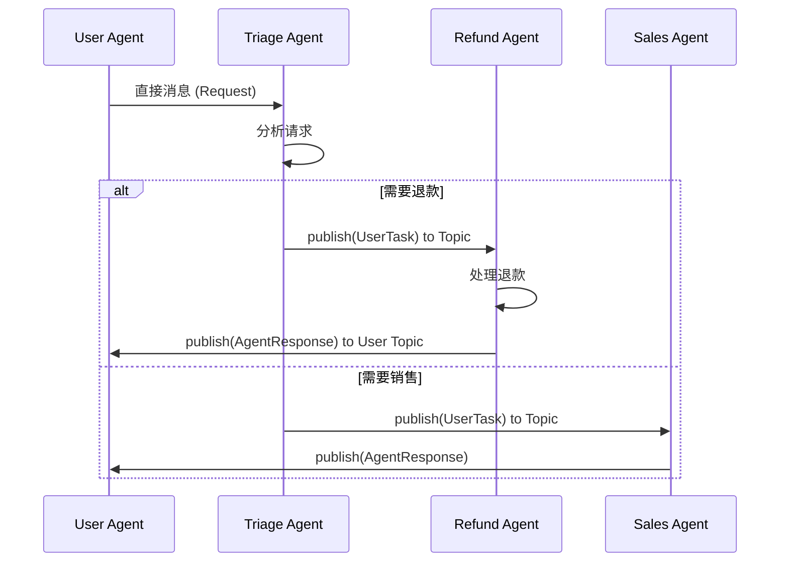
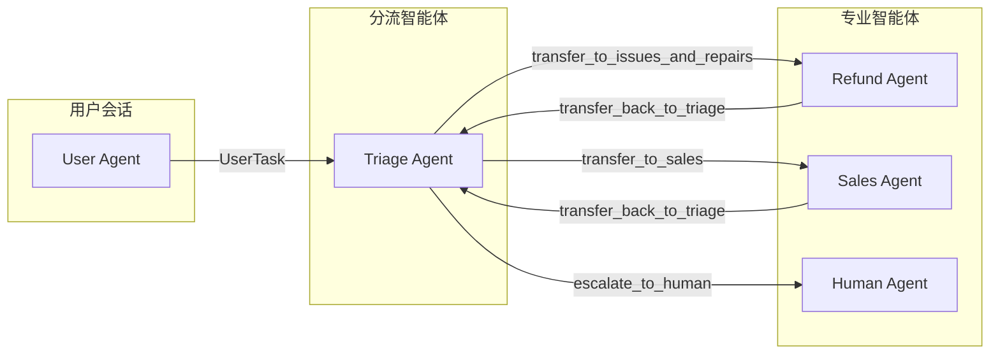
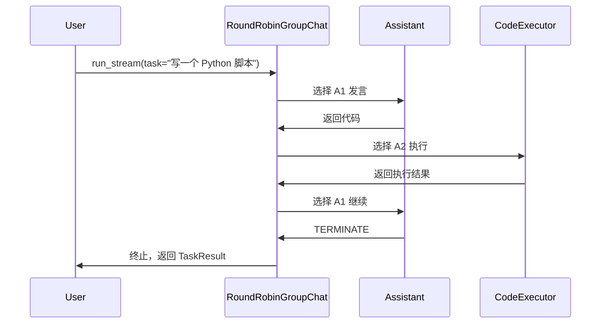

# Microsoft AutoGen (v0.4+) 深度调研

## 1. 概述

Microsoft AutoGen v0.4 是一次**从零开始的重构**，采用**异步、事件驱动的 Actor 模型**作为计算基础，旨在解决可观测性、灵活性、交互控制和规模化等问题。该版本完全替代了 v0.2 的 API。

### 1.1 Actor 模型

AutoGen v0.4 基于 **Actor 模型**构建智能体系统：

- **Actor**：每个智能体是独立的 Actor，拥有自己的状态和消息处理逻辑
- **消息传递**：智能体之间通过异步消息通信，而非共享内存
- **事件驱动**：支持分布式部署和云原生扩展
- **可组合性**：可集成来自不同框架和编程语言的智能体

### 1.2 三层架构

框架采用分层设计，从底层到高层依次为：

| 层级 | 名称 | 职责 |
|------|------|------|
| **Core API** | 核心层 | 提供可扩展的事件驱动 Actor 框架，用于创建智能体工作流 |
| **AgentChat API** | 任务层 | 基于 Core 构建的高层 API，提供群聊、代码执行、预置智能体 |
| **Extensions** | 扩展层 | 核心接口实现与第三方集成（如 Azure 代码执行器、OpenAI 模型客户端） |

### 1.3 架构图



---

## 2. 智能体间通信

AutoGen v0.4 支持两种消息传递模式：

### 2.1 直接消息 (Request/Response)

- **一对一通信**：发送方指定接收方的 Agent ID
- **同步式交互**：适用于明确的请求-响应场景
- **AgentChat 默认模式**：`RoundRobinGroupChat`、`SelectiveGroupChat` 等均基于此

### 2.2 广播 (Topic/Subscription Pub-Sub)

- **一对多通信**：发送方发布到 Topic，无需指定接收方
- **Topic 结构**：`Topic_Type/Topic_Source`（类型 + 来源）
- **订阅类型**：
  - **Direct Subscription**：特定 Topic ID 映射到特定 Agent
  - **Type-Based Subscription**：Topic 类型映射到 Agent 类型，支持无界映射

### 2.3 通信序列图



---

## 3. 子智能体机制

### 3.1 Handoff 委托模式

Handoff 是一种多智能体设计模式，允许智能体通过**特殊的工具调用**将任务委托给其他智能体：

- **Delegate Tools**：定义委托工具，返回目标 Agent 的 Topic 类型
- **任务转移**：调用委托工具时，将上下文（含函数调用和结果）发布到目标 Topic
- **适用场景**：客服分流、工单转派、专家路由等

### 3.2 直接消息嵌套

在 AgentChat 中，可通过 **Nested Chat** 实现子会话，子智能体在父会话上下文中运行。

### 3.3 Handoff 流程图



### 3.4 Handoff 代码示例

```python
# 委托工具定义
def transfer_to_sales_agent() -> str:
    return "SalesAgent"

def transfer_to_issues_and_repairs() -> str:
    return "IssuesAndRepairsAgent"

# 使用 FunctionTool 包装
transfer_to_sales_tool = FunctionTool(
    transfer_to_sales_agent,
    description="Use for anything sales or buying related."
)

# AI Agent 在 handle_task 中处理委托
# 当 LLM 返回 delegate tool call 时，发布 UserTask 到目标 Topic
for topic_type, task in delegate_targets:
    await self.publish_message(task, topic_id=TopicId(topic_type, source=self.id.key))
```

---

## 4. 会话共享

### 4.1 session_id 隔离

- **会话标识**：每个用户会话使用唯一的 `session_id`（如 UUID）
- **Topic 隔离**：同一会话内所有 Topic 的 `source` 使用相同 `session_id`
- **Agent 生命周期**：Agent ID 与 session 绑定，实现多租户隔离

### 4.2 save_state / load_state 持久化

AutoGen v0.4 提供 `save_state()` 和 `load_state()` 方法：

- **Agent 状态**：包含模型上下文和消息历史
- **Team 状态**：递归保存所有参与智能体的状态
- **终止条件**：Termination Condition 也支持状态保存与恢复

```python
# 保存状态
state = await assistant.save_state()
with open("assistant_state.json", "w") as f:
    json.dump(state, f)

# 加载状态
with open("assistant_state.json", "r") as f:
    state = json.load(f)
await assistant.load_state(state)
```

**注意**：`save_state`/`load_state` 不提供完整序列化，仍需单独构造 Agent/Team 实例并传入相同参数。

---

## 5. 任务管理

### 5.1 RoundRobinGroupChat

- **轮询调度**：按固定顺序依次选择下一个发言的智能体
- **适用场景**：双智能体对话、代码执行（Assistant + CodeExecutor）

### 5.2 SelectorGroupChat

- **选择器调度**：根据自定义逻辑选择下一个发言者
- **Stateflow**：支持基于状态的流程控制

### 5.3 终止条件

- **TextMentionTermination**：当消息包含特定文本（如 "TERMINATE"）时终止
- **MaxMessageTermination**：达到最大消息数时终止
- **组合**：可使用 `|` 组合多个条件，满足任一即终止

### 5.4 任务管理序列图



### 5.5 代码示例

```python
from autogen_agentchat.agents import AssistantAgent, CodeExecutorAgent
from autogen_agentchat.teams import RoundRobinGroupChat
from autogen_agentchat.conditions import TextMentionTermination, MaxMessageTermination
from autogen_ext.code_executors.local import LocalCommandLineCodeExecutor

termination = TextMentionTermination("TERMINATE") | MaxMessageTermination(10)
group_chat = RoundRobinGroupChat(
    [assistant, code_executor],
    termination_condition=termination
)
stream = group_chat.run_stream(task="Write a python script to print 'Hello, world!'")
```

---

## 6. 内存存储

### 6.1 状态可序列化字典

- **save_state 返回**：包含消息历史和元数据的字典
- **可写入磁盘**：通过 `json.dump` 持久化
- **跨请求恢复**：适用于 FastAPI 等无状态 Web 应用

### 6.2 无内置长期记忆

- **无向量存储**：AutoGen 不提供类似 RAG 的长期记忆
- **无 LLM 分析**：不自动提取、归纳或检索历史知识
- **扩展方案**：需自行集成外部记忆系统（如 CrewAI Memory、LangChain Memory）

---

## 7. 优缺点总结

| 维度 | 优点 | 缺点 |
|------|------|------|
| **架构** | Actor 模型支持分布式、可扩展；三层架构清晰，Core 可独立使用 | 学习曲线较陡，需理解 Topic/Subscription |
| **通信** | 支持直接消息与 Pub-Sub 广播；灵活适配多种协作模式 | Pub-Sub 需在 Core 层实现，AgentChat 高层 API 封装有限 |
| **子智能体** | Handoff 模式清晰，易于实现客服分流等场景 | AgentChat 层 Handoff 高层 API 仍在完善中 |
| **会话** | save_state/load_state 支持持久化；session_id 隔离多租户 | 非完整序列化，需手动管理实例构造 |
| **任务管理** | RoundRobin/Selector 简单易用；终止条件可组合 | 复杂流程需自定义 Selector 或使用 Core |
| **内存** | 状态可序列化，便于调试和恢复 | 无内置长期记忆，需自行扩展 |
| **生态** | 微软背书，社区活跃；支持 Python 与 .NET | 部分 v0.2 功能（如 Teachable Agent、RAG Agent）尚未迁移 |
