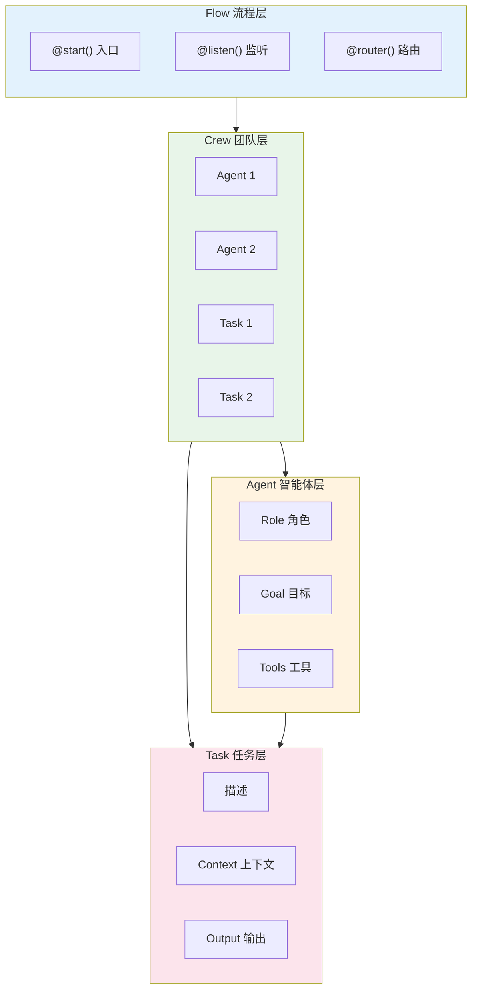
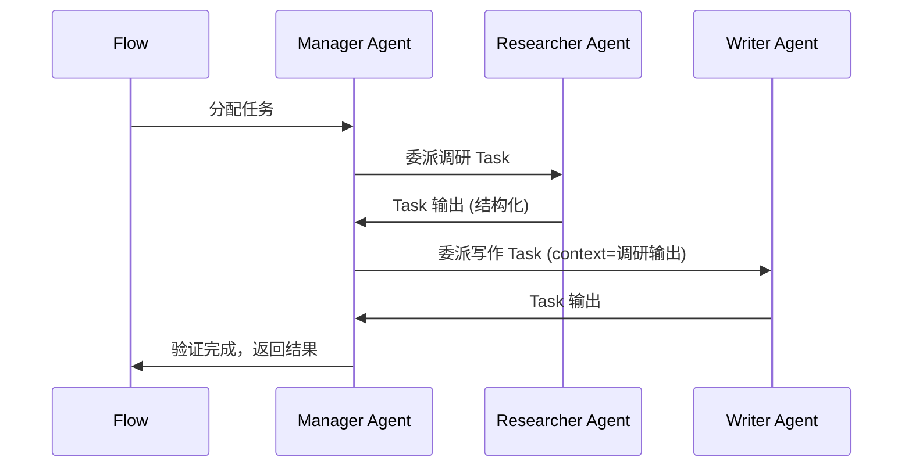
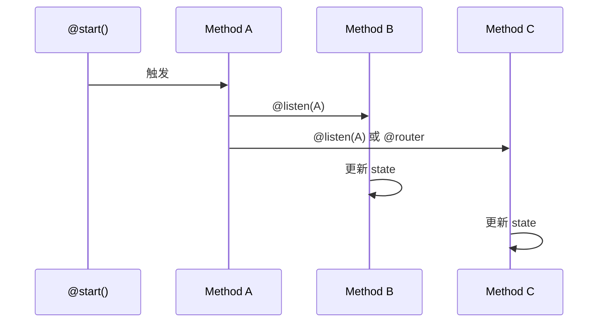

# CrewAI 深度调研

## 1. 概述

CrewAI 是一个多智能体协作框架，采用 **Flow-First 架构** 作为生产环境推荐方案。该架构将 Flow 作为 AI 应用的入口点，将 Crew 和 Agent 封装在 Flow 内部，提供可观测性、控制流和状态管理能力。

### 1.1 Flow-First 架构

Flow-First 的核心思想：

- **Flow 为入口**：应用以 Flow 为顶层编排单元，而非直接运行 Crew 或 Agent
- **Crew 作为工作单元**：将复杂任务委托给专注的 Crew，在组件间显式传递状态
- **状态管理**：使用 Pydantic 模型确保类型安全，清晰定义每步可用数据

### 1.2 四层概念模型



---

## 2. 智能体间通信

### 2.1 Task 输出为媒介

CrewAI 中智能体不直接通信，而是通过 **Task 的输出** 作为信息媒介：

- **Task 输出**：每个 Task 的 `output` 作为下一个 Task 的 `context`
- **context 参数**：在 Task 定义中通过 `context=[task1, task2]` 指定依赖
- **顺序传递**：Sequential 模式下按 Task 列表顺序执行，上游输出自动注入下游

### 2.2 Manager 协调

在 **Hierarchical Process** 中：

- **Manager Agent**：负责规划、委派和验证
- **任务分配**：Manager 根据 Agent 能力动态分配 Task，而非预定义
- **结果审核**：Manager 审核输出并判断任务是否完成

### 2.3 结构化输出

支持 Pydantic 模型定义 Task 输出格式，确保类型安全和结构化数据流：

```python
from pydantic import BaseModel, Field

class MarketAnalysis(BaseModel):
    key_trends: list[str] = Field(description="市场趋势列表")
    market_size: str = Field(description="市场规模估计")
    competitors: list[str] = Field(description="主要竞争对手")

result = await analyst.kickoff_async(query, response_format=MarketAnalysis)
```

### 2.4 通信序列图



---

## 3. 子智能体机制

### 3.1 层级进程 (Hierarchical Process)

- **Manager 角色**：自动创建或显式指定 `manager_agent` / `manager_llm`
- **委派控制**：Manager 决定将任务委派给哪个 Agent
- **迭代限制**：支持 `max_iter`、`max_rpm` 等配置
- **结果验证**：Manager 审核 Agent 输出并决定是否继续

### 3.2 Flow 中 Crew 嵌套

在 Flow 中可将多个 Crew 串联或并联：

```python
class PoemFlow(Flow[PoemState]):
    @start()
    def generate_sentence_count(self):
        self.state.sentence_count = randint(1, 5)

    @listen(generate_sentence_count)
    def generate_poem(self):
        result = PoemCrew().crew().kickoff(
            inputs={"sentence_count": self.state.sentence_count}
        )
        self.state.poem = result.raw

    @listen(generate_poem)
    def save_poem(self):
        with open("poem.txt", "w") as f:
            f.write(self.state.poem)
```

---

## 4. 会话共享

### 4.1 Pydantic State

Flow 支持两种状态管理方式：

| 方式 | 说明 | 适用场景 |
|------|------|----------|
| **结构化状态** | 使用 Pydantic BaseModel 定义 | 类型安全、IDE 友好、复杂工作流 |
| **非结构化状态** | 使用 `dict` 存储 | 快速原型、动态结构 |

```python
from pydantic import BaseModel

class ExampleState(BaseModel):
    counter: int = 0
    message: str = ""

class StateExampleFlow(Flow[ExampleState]):
    @start()
    def first_method(self):
        self.state.message = "Hello"
        self.state.counter += 1
```

### 4.2 @persist 持久化

`@persist` 装饰器支持跨重启或多次执行保持状态：

- **类级别**：`@persist` 装饰 Flow 类，所有方法状态自动持久化
- **方法级别**：仅持久化特定方法的状态
- **默认后端**：SQLiteFlowPersistence
- **自定义**：可实现 FlowPersistence 接口接入其他存储

```python
@persist  # 类级别，默认 SQLite
class MyFlow(Flow[MyState]):
    @start()
    def initialize_flow(self):
        self.state.counter = 1

    @listen(initialize_flow)
    def next_step(self):
        self.state.counter += 1  # 状态自动从持久化恢复
```

---

## 5. 任务管理

### 5.1 Sequential / Hierarchical

```python
from crewai import Crew, Process

# 顺序执行
crew = Crew(
    agents=[researcher, writer],
    tasks=[research_task, writing_task],
    process=Process.sequential,
)

# 层级执行（需指定 manager_llm 或 manager_agent）
crew = Crew(
    agents=[researcher, writer],
    tasks=[research_task, writing_task],
    process=Process.hierarchical,
    manager_llm="gpt-4o",
)
```

### 5.2 Task 依赖

通过 `context` 参数指定 Task 依赖：

```python
research_task = Task(
    description="调研 AI 聊天机器人市场",
    expected_output="市场分析报告",
    agent=researcher,
)

writing_task = Task(
    description="根据调研结果撰写报告",
    expected_output="完整报告",
    agent=writer,
    context=[research_task],  # 依赖 research_task 的输出
)
```

### 5.3 Guardrails

CrewAI 支持对 Task 输出进行验证和约束，确保符合预期格式和质量要求。

### 5.4 Flow 控制流



**装饰器说明**：

- `@start()`：入口点，可带条件或依赖
- `@listen(method)`：监听某方法输出后执行
- `@router(method)`：根据输出路由到不同分支
- `or_(a, b)`：任一完成即触发
- `and_(a, b)`：全部完成才触发

### 5.5 代码示例

```python
from crewai.flow.flow import Flow, listen, router, start
from pydantic import BaseModel

class ExampleState(BaseModel):
    success_flag: bool = False

class RouterFlow(Flow[ExampleState]):
    @start()
    def start_method(self):
        self.state.success_flag = random.choice([True, False])

    @router(start_method)
    def second_method(self):
        return "success" if self.state.success_flag else "failed"

    @listen("success")
    def on_success(self):
        print("成功分支")

    @listen("failed")
    def on_failed(self):
        print("失败分支")
```

---

## 6. 内存存储

### 6.1 统一 Memory 类

CrewAI 提供统一的 `Memory` 类，替代原有的短期、长期、实体、外部等多种记忆类型：

- **LLM 分析**：保存时由 LLM 推断 scope、categories、importance
- **自适应召回**：结合语义相似度、时效性、重要性的复合评分
- **Scope 层级**：类似文件系统的路径结构（如 `/project/alpha`）

### 6.2 Scope / Slice

| 概念 | 说明 | 用途 |
|------|------|------|
| **Scope** | 单棵子树视图 | Agent 私有上下文、项目隔离 |
| **Slice** | 多棵子树联合视图 | 跨分支检索、只读共享知识 |

```python
# Agent 私有 scope
researcher_memory = memory.scope("/agent/researcher")

# 多 scope 只读视图
writer_view = memory.slice(
    scopes=["/agent/writer", "/company/knowledge"],
    read_only=True,
)
```

### 6.3 复合评分

召回结果按加权公式排序：

```
composite = semantic_weight * similarity + recency_weight * decay + importance_weight * importance
```

可针对场景调参：

```python
# 快速迭代项目：偏重近期
memory = Memory(recency_weight=0.5, recency_half_life_days=7)

# 架构知识库：偏重重要性
memory = Memory(importance_weight=0.4, recency_half_life_days=180)
```

### 6.4 与 Flow 集成

Flow 内置 memory，可在方法内使用 `self.remember()`、`self.recall()`、`self.extract_memories()`：

```python
class ResearchFlow(Flow):
    @start()
    def gather_data(self):
        findings = "PostgreSQL 支持 10k 并发连接"
        self.remember(findings, scope="/research/databases")
        return findings

    @listen(gather_data)
    def write_report(self, findings):
        past = self.recall("数据库性能基准")
        context = "\n".join(f"- {m.record.content}" for m in past)
        return f"报告:\n新发现: {findings}\n历史: {context}"
```

---

## 7. 优缺点总结

| 维度 | 优点 | 缺点 |
|------|------|------|
| **架构** | Flow-First 清晰，适合生产；Pydantic State 类型安全 | 概念较多，需理解 Flow/Crew/Agent/Task 关系 |
| **通信** | Task 输出为媒介，依赖明确；结构化输出支持好 | 无直接消息机制，协作模式相对固定 |
| **子智能体** | Hierarchical Process 支持 Manager 委派；Flow 中 Crew 嵌套灵活 | 委派逻辑由 Manager LLM 决定，可预测性一般 |
| **会话** | @persist 支持 SQLite 等持久化；Pydantic State 易序列化 | 自定义 Pydantic 模型与 @persist 存在序列化兼容问题 |
| **任务管理** | Sequential/Hierarchical 简单；Flow 支持 or_/and_/router 等控制流 | 复杂条件分支需组合多种装饰器 |
| **内存** | 统一 Memory，LLM 分析、Scope/Slice、复合评分完善 | 依赖 LLM 和 Embedder，有延迟和成本；隐私数据需注意 |
| **生态** | 文档完善，YAML 配置、CLI 工具齐全；CrewAI Tools 丰富 | 部分高级特性（如 Consensual Process）尚未实现 |
