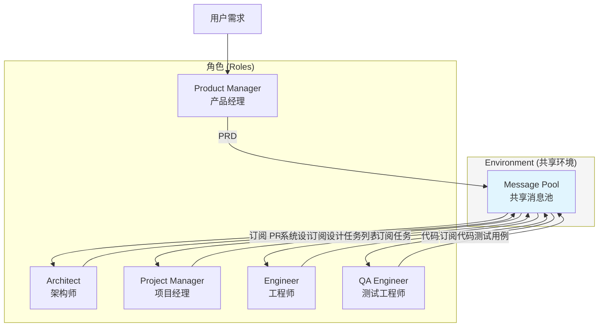
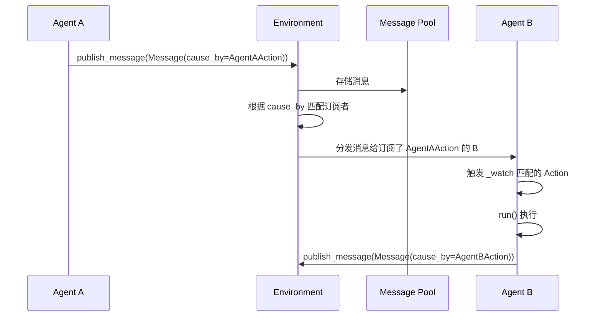
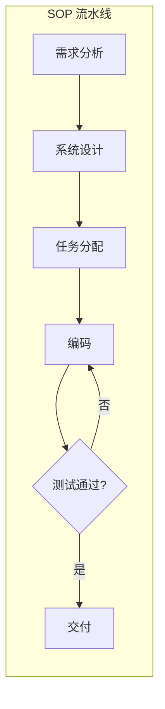

# MetaGPT 深度调研

## 1. 概述

MetaGPT 是一个基于 **标准化操作流程（SOPs）** 的元编程框架，将人类软件工程工作流编码到 LLM 多智能体协作中。其核心哲学是 **`Code = SOP(Team)`**，即通过 SOP 将复杂任务分解为可执行的子任务，分配给具有专业角色的智能体团队。

### 1.1 SOP 驱动

- **SOP（Standard Operating Procedure）**：标准化操作流程，将软件开发的各阶段编码为可执行的流水线
- **Code = SOP(Team)**：代码生成等同于 SOP 驱动的团队协作，每个角色按既定流程产出结构化交付物

### 1.2 角色体系

MetaGPT 模拟真实软件公司的角色分工：

| 角色 | 英文 | 职责 | 输出产物 |
|------|------|------|----------|
| 产品经理 | Product Manager (PM) | 需求分析、竞品分析、用户故事 | PRD（产品需求文档） |
| 架构师 | Architect | 系统设计、模块划分 | 系统设计文档、流程图、接口定义 |
| 项目经理 | Project Manager | 任务分配、进度管理 | 任务列表 |
| 工程师 | Engineer | 代码实现 | 可执行代码 |
| 测试工程师 | QA Engineer | 测试用例编写、质量保证 | 测试用例 |

### 1.3 角色与消息池架构图



### 1.4 基础使用示例

```python
from metagpt.software_company import SoftwareCompany
from metagpt.roles import ProductManager, Architect, ProjectManager, Engineer, QaEngineer

# 创建软件公司团队
company = SoftwareCompany()
company.hire([ProductManager(), Architect(), ProjectManager(), Engineer(), QaEngineer()])

# 启动项目
company.start_project("设计一个在线待办事项应用")
company.run()
```

---

## 2. 智能体间通信

### 2.1 Environment + Message Pool

MetaGPT 使用 **Environment** 对象作为消息总线，采用 **发布-订阅（Publish-Subscribe）** 模式：

- **Environment**：负责根据订阅规则将消息广播给各智能体
- **Message Pool（共享消息池）**：所有智能体将结构化消息发布到全局池，任何智能体可直接从池中获取所需信息
- **cause_by**：智能体通过此属性订阅感兴趣的消息类型，实现按需接收

### 2.2 Message 数据结构

```python
from metagpt.schema import Message

# Message 核心字段
class Message(BaseModel):
    id: str = Field(default="", validate_default=True)
    content: str                          # 消息内容
    instruct_content: Optional[BaseModel] = None  # 结构化数据（如 PRD 解析结果）
    role: str = "user"                    # system / user / assistant
    cause_by: str = ""                    # 订阅标签，决定谁接收此消息
    sent_from: str = ""                   # 发送者标识
    send_to: set[str] = {MESSAGE_ROUTE_TO_ALL}  # 接收者（默认广播给所有）
```

### 2.3 发布-订阅通信流程



### 2.4 通信代码示例

```python
from metagpt.environment import Environment
from metagpt.schema import Message

# 发布消息到环境
async def publish_from_agent(env: Environment, content: str, cause_by: str):
    msg = Message(content=content, cause_by=cause_by, sent_from="AgentA")
    await env.publish_message(msg)

# 订阅者通过 _watch 声明感兴趣的消息类型
class SubscriberAgent(Role):
    def __init__(self, **kwargs):
        super().__init__(**kwargs)
        self.set_actions([ProcessAction])
        self._watch({AgentAAction})  # 订阅 cause_by=AgentAAction 的消息
```

---

## 3. 角色机制

### 3.1 Role + Action

- **Role**：继承自基类，定义角色的 profile（name、goal、constraints）、技能和订阅关系
- **Action**：角色的具体行为，每个 Action 有 `run()` 方法执行逻辑
- **ReAct 循环**：所有智能体遵循 Observe-Think-Act-React 循环

### 3.2 _watch 订阅机制

```python
from metagpt.roles import Role
from metagpt.actions import Action

class WritePRDAction(Action):
    name: str = "WritePRD"
    
    async def run(self, *args, **kwargs) -> str:
        # 执行 PRD 编写逻辑
        return prd_content

class ProductManager(Role):
    def __init__(self, **kwargs):
        super().__init__(**kwargs)
        self.set_actions([WritePRDAction])
        self._watch({UserRequirement})  # 订阅用户需求，触发 PRD 编写

class Architect(Role):
    def __init__(self, **kwargs):
        super().__init__(**kwargs)
        self.set_actions([DesignAction])
        self._watch({WritePRDAction})  # 订阅 PRD，触发设计
```

### 3.3 ReAct 循环

```python
# MetaGPT 内部 ReAct 风格执行
async def _react(self) -> Message:
    """Observe -> Think -> Act -> React 循环"""
    while True:
        # Observe: 从 environment 获取新消息
        msgs = self._observe()
        if not msgs:
            break
        # Think: 更新 todo，决定下一步
        self._set_state(0)
        # Act: 执行当前 Action
        response = await self._act()
        # React: 发布结果，可能触发其他智能体
        if response.send_to != MESSAGE_ROUTE_TO_NONE:
            self._publish_message(response)
    return self._last_response
```

---

## 4. 会话共享

### 4.1 全局消息池

- **全局可见**：所有智能体将结构化消息发布到共享池
- **按需订阅**：通过 `_watch` 指定 `cause_by`，只接收相关消息
- **依赖触发**：智能体仅在收到所有前置依赖消息后才激活

### 4.2 结构化文档替代自然语言

为避免"传话游戏"效应和幻觉传播，MetaGPT 使用**结构化文档**作为主要通信媒介：

| 通信形式 | 说明 |
|----------|------|
| PRD | 产品需求文档，JSON/结构化格式 |
| 系统设计 | 架构图、接口定义、模块划分 |
| 任务列表 | 可追踪的子任务项 |
| 代码 | 可直接执行的代码文件 |

### 4.3 会话共享代码示例

```python
# 所有角色共享同一 Environment，消息池全局可见
context = Context()
env = Environment(context=context)
env.add_roles([ProductManager(), Architect(), Engineer()])

# 发布初始需求，触发整个流水线
env.publish_message(Message(
    content="开发一个博客系统",
    cause_by=UserRequirement,
    send_to=MESSAGE_ROUTE_TO_ALL
))

# 轮询执行直到所有角色空闲
while not env.is_idle:
    await env.run()
```

---

## 5. 任务管理

### 5.1 SOP 流水线

```
用户需求 → PM(PRD) → Architect(设计) → PM(任务分配) → Engineer(编码) → QA(测试) → 交付
```

### 5.2 可执行反馈机制

Engineer 在生成代码后执行以下流程：

1. **运行**：执行生成的代码并检查错误
2. **调试**：若失败，从 memory 中检索 PRD、设计、代码进行对比
3. **重试**：调试并重新生成，最多重试 3 次

### 5.3 任务管理流程图



### 5.4 可执行反馈代码示例

```python
class Engineer(Role):
    async def _act(self) -> Message:
        code = await self._write_code()
        # 可执行反馈：运行并验证
        for attempt in range(3):
            result = await self._run_code(code)
            if result.success:
                return Message(content=code, cause_by=WriteCodeAction)
            # 从 memory 检索上下文进行调试
            context = self.rc.memory.get_memories(k=5)
            code = await self._debug(code, result.error, context)
        return Message(content=code, cause_by=WriteCodeAction)
```

---

## 6. 内存存储

### 6.1 rc.memory 消息列表

- **Role Memory**：每个 Role 拥有 `self._rc.memory`，存储该角色观察到的所有 `Message`
- **存储形式**：`Message` 对象列表
- **添加**：`self._rc.memory.add(msg)`
- **检索**：`get_memories(k=0)` — k>0 返回最近 k 条，k=0 返回全部

### 6.2 内存使用示例

```python
class MyRole(Role):
    async def _act(self) -> Message:
        # 添加消息到 memory
        self.rc.memory.add(Message(content="重要上下文", cause_by=SomeAction))
        
        # 检索最近 5 条消息
        recent = self.rc.memory.get_memories(k=5)
        
        # 检索全部消息
        all_msgs = self.rc.memory.get_memories(k=0)
        
        # rc.history 用于 Action 输入
        response = await self.rc.todo.run(self.rc.history)
        return response
```

### 6.3 无跨会话持久化

- **进程内**：Memory 为进程内列表，不持久化到磁盘
- **会话结束**：进程退出后所有 memory 丢失
- **跨会话**：需自行实现持久化（如写入数据库、向量存储）

---

## 7. 优缺点总结

| 维度 | 优点 | 缺点 |
|------|------|------|
| **架构设计** | SOP 结构化，减少 LLM 幻觉级联；发布-订阅解耦，智能体无需直接通信 | SOP 刚性，工作流固定，难以动态调整或条件分支 |
| **领域适用** | 软件工程 SOP 成熟，HumanEval 85.9%、MBPP 87.7% Pass@1 | 默认角色面向软件开发，其他领域需重构 |
| **通信方式** | 结构化文档（PRD、设计、代码）可验证，信息失真低 | 无自然语言对话灵活性 |
| **任务执行** | 可执行反馈（运行/调试/重试）提升代码可执行性 | 同步编排，`env.run()` 轮询式，无显式 DAG/图编排 |
| **扩展性** | 通过 Role + Action + _watch 可自定义工作流 | 大规模智能体时消息池可能成为瓶颈 |
| **持久化** | 实现简单，无外部依赖 | 无原生跨会话持久化，Memory 为进程内列表 |

---

## 参考资源

- [MetaGPT GitHub](https://github.com/geekan/MetaGPT)
- [MetaGPT 文档](https://docs.deepwisdom.ai/)
