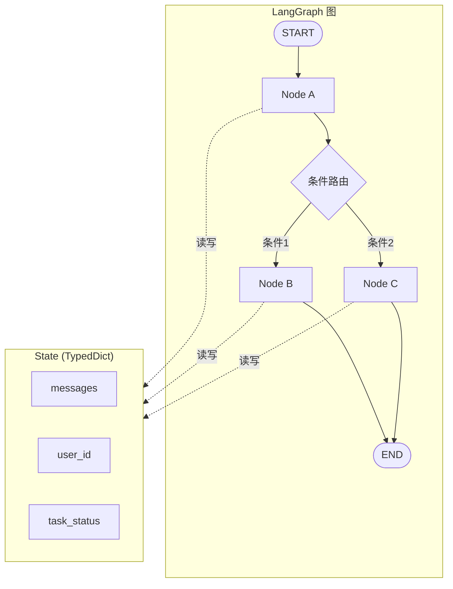
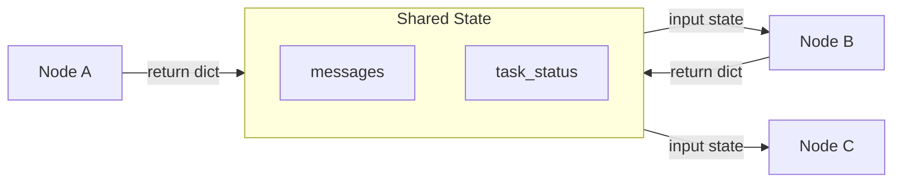
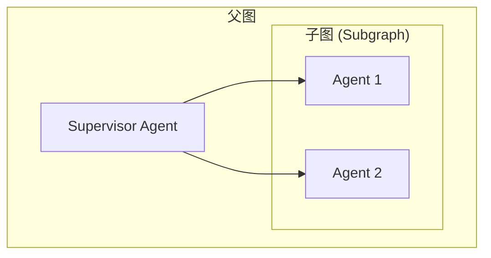
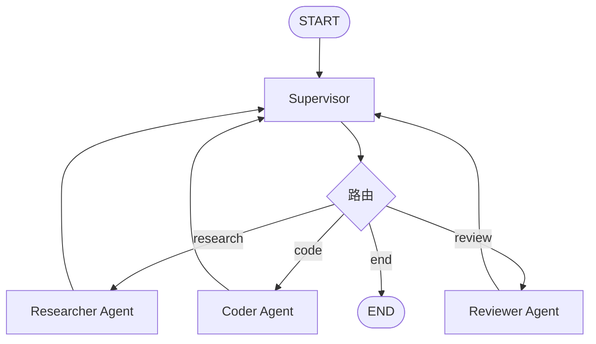

# LangGraph 深度调研

## 1. 概述

LangGraph 是 LangChain 生态下的**低层级编排框架**，基于**图状态机**设计，用于构建长期运行、有状态的 AI Agent。与仅支持 DAG 的传统编排不同，LangGraph 支持**有环图**，适合 Agent 的循环推理与工具调用。

### 1.1 图状态机模型

- **节点（Nodes）**：处理单元，通常是函数或 Agent，接收并更新状态
- **边（Edges）**：节点间的连接，控制流转
- **状态（State）**：TypedDict 定义的数据结构，在图中流动并在每步更新
- **条件边（Conditional Edges）**：根据状态动态决定下一节点
- **有环图支持**：可建模 Agent 的循环推理、多轮工具调用

### 1.2 架构图



### 1.3 基础使用示例

```python
from typing import TypedDict
from langgraph.graph import StateGraph, START, END

class AgentState(TypedDict):
    messages: list

def node_a(state: AgentState) -> dict:
    return {"messages": state["messages"] + [{"role": "assistant", "content": "Hello"}]}

graph = StateGraph(AgentState)
graph.add_node("node_a", node_a)
graph.add_edge(START, "node_a")
graph.add_edge("node_a", END)
app = graph.compile()

result = app.invoke({"messages": [{"role": "user", "content": "Hi"}]})
```

---

## 2. 智能体间通信

### 2.1 State 即通信媒介

智能体不直接发消息，而是通过**更新共享 State** 进行通信：

- 每个节点接收 `state`，返回 `dict` 形式的**增量更新**
- LangGraph 将增量合并到 State（通过 Reducer 如 `add_messages` 对 messages 做 append）

### 2.2 增量更新与 add_messages Reducer

```python
from typing import TypedDict, Annotated
from langgraph.graph.message import add_messages

class AgentState(TypedDict):
    messages: Annotated[list, add_messages]  # 消息列表，支持追加
    user_id: str
    task_status: str

def agent_node(state: AgentState) -> dict:
    # 返回增量更新，add_messages 会将新消息 append 到现有列表
    return {"messages": [{"role": "assistant", "content": "处理完成"}]}

def tool_node(state: AgentState) -> dict:
    return {"task_status": "completed"}
```

### 2.3 通信流程图



### 2.4 多智能体通信示例

```python
def researcher(state: AgentState) -> dict:
    # 研究者将结果写入 state
    return {"messages": [{"role": "assistant", "content": "调研结果..."}], "research_done": True}

def writer(state: AgentState) -> dict:
    # 写作者读取 state 中的 messages，追加自己的输出
    return {"messages": [{"role": "assistant", "content": "文章草稿..."}]}

graph.add_node("researcher", researcher)
graph.add_node("writer", writer)
graph.add_edge("researcher", "writer")  # State 自动在节点间传递
```

---

## 3. 子图机制

### 3.1 子图作为节点

可将**已编译的子图**作为父图的节点：

```python
from langgraph.graph import StateGraph, START, END

# 子图定义
subgraph = StateGraph(SharedState)
subgraph.add_node("sub_agent", sub_agent_fn)
subgraph.add_edge(START, "sub_agent")
subgraph.add_edge("sub_agent", END)
compiled_subgraph = subgraph.compile()

# 父图：子图作为节点
builder = StateGraph(SharedState)
builder.add_node("scheduler_assistant", compiled_subgraph)
builder.add_edge("enter", "scheduler_assistant")
builder.add_edge("scheduler_assistant", "next_node")
graph = builder.compile()
```

### 3.2 Supervisor 模式

一个路由 Agent 将任务分配给多个子 Agent：

```python
def supervisor(state: AgentState) -> dict:
    # 根据任务类型决定路由
    next_agent = "researcher" if "调研" in state["task"] else "coder"
    return {"next": next_agent}

graph.add_conditional_edges("supervisor", supervisor, {
    "researcher": "researcher",
    "coder": "coder",
    "reviewer": "reviewer"
})
```

### 3.3 Hierarchical Teams 层级结构



### 3.4 子图集成代码示例

```python
# 子图：研究团队
research_graph = StateGraph(AgentState)
research_graph.add_node("researcher", researcher_fn)
research_graph.add_edge(START, "researcher")
research_graph.add_edge("researcher", END)
research_team = research_graph.compile()

# 父图：Supervisor 调度
main_graph = StateGraph(AgentState)
main_graph.add_node("supervisor", supervisor_fn)
main_graph.add_node("research_team", research_team)  # 子图作为节点
main_graph.add_node("code_team", code_team)
main_graph.add_conditional_edges("supervisor", route_fn, {"research": "research_team", "code": "code_team"})
```

---

## 4. 会话共享

### 4.1 thread_id 与 Checkpoint

- **thread_id**：每个会话/任务的唯一标识，作为 checkpoint 的主键
- **Checkpoint**：每个 super-step 执行后保存的状态快照
- **时间旅行**：不覆盖历史，支持回放和分支

### 4.2 配置示例

```python
from langgraph.checkpoint.memory import MemorySaver

memory = MemorySaver()
app = graph.compile(checkpointer=memory)

# 同一会话复用 thread_id，状态在多次 invoke 间累积
config = {"configurable": {"thread_id": "user-123-session-1"}}
result = app.invoke({"messages": [{"role": "user", "content": "Hello"}]}, config)

# 继续对话，state 会从 checkpoint 恢复
result2 = app.invoke({"messages": [{"role": "user", "content": "继续"}]}, config)
```

### 4.3 时间旅行

```python
# 获取历史状态
history = app.get_state_history(config)
for state in history:
    print(state.values)  # 可回放任意步骤的 state

# 从特定 checkpoint 分支
app.update_state(config, {"messages": [{"role": "user", "content": "修改"}]})
```

---

## 5. 任务管理

### 5.1 条件边

```python
def router(state: AgentState) -> str:
    if state["task_status"] == "pending":
        return "process"
    elif state["task_status"] == "need_review":
        return "review"
    return "end"

graph.add_conditional_edges("evaluate", router, {
    "process": "processor",
    "review": "reviewer",
    "end": END
})
```

### 5.2 tools_condition

```python
from langgraph.prebuilt import tools_condition

# 根据 LLM 是否调用工具动态路由
graph.add_conditional_edges("chatbot", tools_condition, {"tools": "tools", "__end__": END})
```

### 5.3 协作模式

| 模式 | 特点 |
|------|------|
| **Collaboration** | 共享 scratchpad，所有步骤对彼此可见 |
| **Supervisor** | 各 Agent 独立 scratchpad，仅最终结果写入全局 |
| **Hierarchical** | 子图为 LangGraph，支持更复杂层级 |

### 5.4 任务管理流程图



### 5.5 完整任务编排示例

```python
from langgraph.graph import StateGraph, START, END
from langgraph.prebuilt import create_react_agent

# 定义状态
class TeamState(TypedDict):
    messages: Annotated[list, add_messages]
    next_agent: str

# 条件路由函数
def route_after_supervisor(state: TeamState) -> str:
    return state.get("next_agent", "researcher")

# 构建图
graph = StateGraph(TeamState)
graph.add_node("supervisor", supervisor_node)
graph.add_node("researcher", researcher_node)
graph.add_node("coder", coder_node)
graph.add_node("reviewer", reviewer_node)

graph.add_edge(START, "supervisor")
graph.add_conditional_edges("supervisor", route_after_supervisor, {
    "researcher": "researcher",
    "coder": "coder",
    "reviewer": "reviewer",
    "__end__": END
})
graph.add_edge("researcher", "supervisor")
graph.add_edge("coder", "supervisor")
graph.add_edge("reviewer", "supervisor")
```

---

## 6. 内存存储

### 6.1 Checkpointer 机制

- **Read-Execute-Write**：读取最新 checkpoint → 加载 state → 执行节点 → 序列化并保存新 state
- **Checkpointer**：实现 `BaseCheckpointSaver` 的存储后端

### 6.2 存储后端

| 类型 | 实现 | 适用场景 |
|------|------|----------|
| **MemorySaver** | 内存存储 | 开发、测试 |
| **SqliteSaver** | SQLite 文件 | 单机部署 |
| **PostgresSaver** | PostgreSQL | 生产环境 |
| **RedisSaver** | Redis | 分布式、高并发 |

### 6.3 短期 + 长期记忆

| 类型 | 作用域 | 实现 |
|------|--------|------|
| **短期记忆** | Thread 内 | State + Checkpoint，会话历史 |
| **长期记忆** | 跨会话、跨 Thread | Store，用户级数据 |

### 6.4 内存使用示例

```python
from langgraph.checkpoint.memory import MemorySaver
from langgraph.checkpoint.postgres import PostgresSaver

# 开发环境：内存
memory = MemorySaver()
app = graph.compile(checkpointer=memory)

# 生产环境：PostgreSQL
# checkpointer = PostgresSaver.from_conn_string("postgresql://...")
# app = graph.compile(checkpointer=checkpointer)

# 带 checkpoint 的调用
config = {"configurable": {"thread_id": "session-001"}}
result = app.invoke({"messages": [...]}, config)
```

### 6.5 Store 长期记忆

```python
from langgraph.store import InMemoryStore

store = InMemoryStore()
app = graph.compile(checkpointer=memory, store=store)

# 在节点中读写长期记忆
async def agent_with_memory(state, config):
    user_id = config["configurable"]["user_id"]
    # 读取用户历史偏好
    prefs = await store.aget(user_id, "preferences")
    # 更新记忆
    await store.aput(user_id, "last_topic", state["topic"])
    return {"messages": [...]}
```

---

## 7. 优缺点总结

| 维度 | 优点 | 缺点 |
|------|------|------|
| **架构设计** | 图显式编排，节点、边、条件路由一目了然；支持有环图，适合 Agent 循环 | 低层级，需手动定义图结构，无内置 SOP 模板 |
| **通信方式** | State 即通信媒介，增量更新，Reducer 灵活 | 状态 schema 设计复杂，父子图共享 key 时易产生静默数据丢失 |
| **子图机制** | 子图作为节点，Supervisor/Hierarchical 模式清晰 | 需理解嵌套图的 state 传递规则 |
| **持久化** | Checkpoint 每步保存，thread_id 支持时间旅行；多后端（Memory/PostgreSQL/Redis） | 依赖外部存储配置 |
| **任务管理** | 条件边、tools_condition 灵活；Collaboration/Supervisor/Hierarchical 模式完善 | 学习曲线陡峭，State、Reducer、条件边等概念需理解 |
| **生态** | LangChain 工具、模型、LangSmith 可观测性；Human-in-the-loop 支持 | 与 LangChain 强绑定 |

---

## 参考资源

- [LangGraph 官方文档](https://langchain-ai.github.io/langgraph/)
- [LangGraph GitHub](https://github.com/langchain-ai/langgraph)
- [LangChain 参考](https://python.langchain.com/docs/langgraph)
