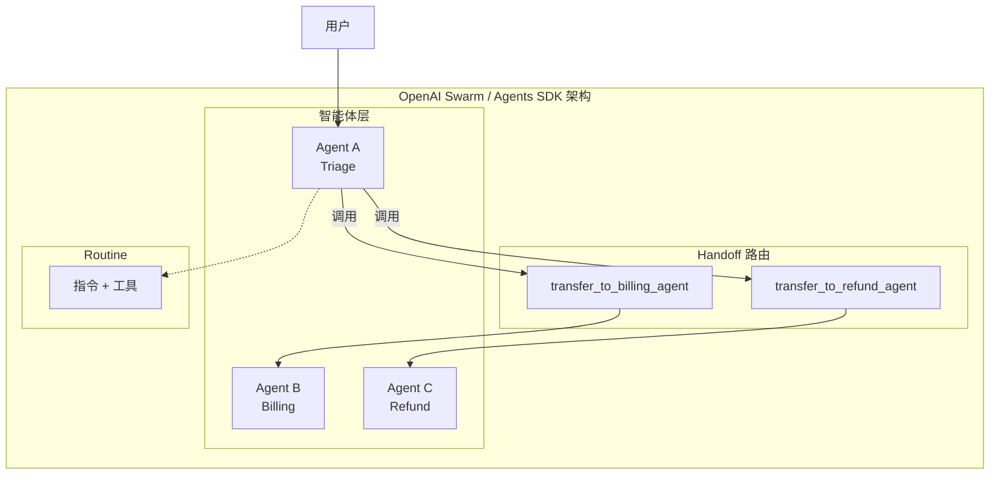
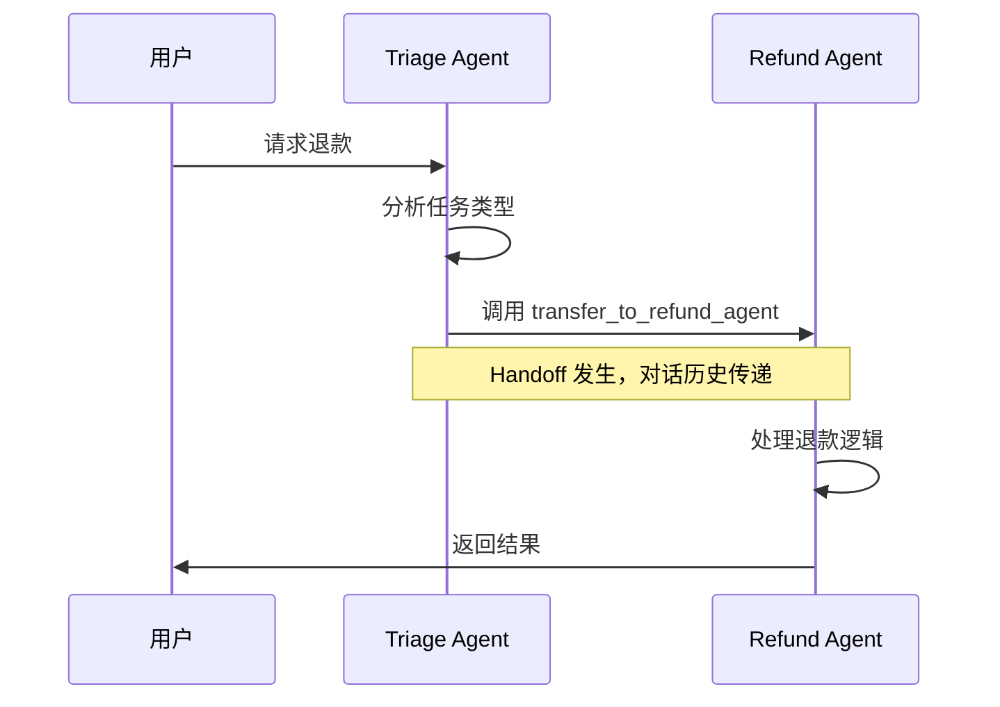
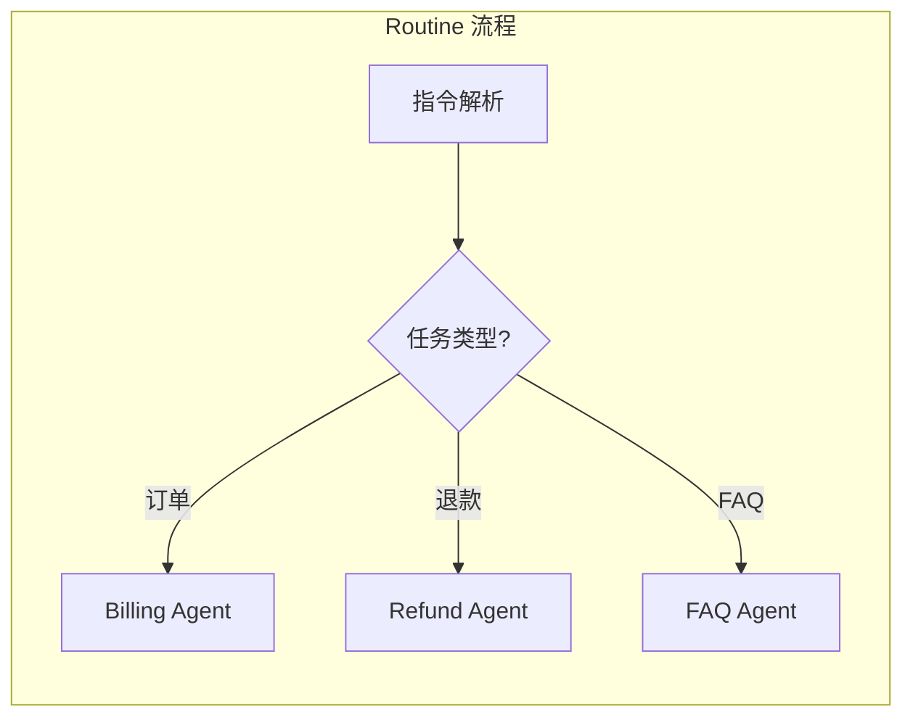

# OpenAI Swarm 深度调研

## 1. 概述

OpenAI Swarm 是 OpenAI 于 2024 年发布的**轻量级多智能体编排框架**，核心设计理念为「轻量 Agent + Handoff（移交）」模式。其通过 `transfer_to` 风格的函数实现智能体间的任务委派，无需复杂的编排逻辑。

**重要说明**：Swarm 为实验性框架，已被 **OpenAI Agents SDK** 取代。Agents SDK 是生产就绪版本，延续了 Swarm 的 Handoff 设计并进行了增强。本文档同时涵盖 Swarm 原始设计与 Agents SDK 中的 Handoff 实现。

### 1.1 核心抽象

- **Agent**：包含指令（instructions）和工具（tools）的执行单元
- **Handoff（移交）**：智能体将对话控制权转移给另一智能体的机制
- **Routine**：指令 + 工具的组合，相当于状态机式的多步工作流

### 1.2 架构图



---

## 2. 通信

### 2.1 transfer_to 与 Handoff

Handoff 是 Swarm/Agents SDK 的核心通信原语。智能体通过**函数调用**将对话移交给另一智能体，该函数对 LLM 表现为可调用的工具。

**Swarm 原始设计**（函数返回目标 Agent）：

```python
def transfer_to_agent_b():
    return agent_b
```

**Agents SDK 中的 Handoff**（工具化表示）：

- 若存在对名为 "Refund Agent" 的智能体的 Handoff，则工具名为 `transfer_to_refund_agent`
- LLM 通过调用该工具完成移交

### 2.2 基于函数路由

Handoff 基于**函数路由**：每个 Handoff 对应一个工具，LLM 根据任务类型选择调用哪个 Handoff 工具，从而路由到对应专家智能体。

```python
from agents import Agent, handoff

billing_agent = Agent(name="Billing agent")
refund_agent = Agent(name="Refund agent")

# 方式1：直接传入 Agent
# 方式2：使用 handoff() 进行定制
triage_agent = Agent(
    name="Triage agent",
    handoffs=[billing_agent, handoff(refund_agent)]
)
```

### 2.3 通信流程图



---

## 3. 上下文

### 3.1 对话历史传递

默认情况下，Handoff 发生时**接收方智能体可见完整对话历史**。这保证了上下文连续性，接收方无需重新收集信息。

### 3.2 input_filter

当需要控制传递给下一智能体的内容时，可使用 `input_filter`：

- **作用**：过滤或转换 Handoff 时传递的输入
- **输入**：`HandoffInputData`（含 `run_context`、`input_items`、`new_items`、`pre_handoff_items`、`input_history`）
- **输出**：新的 `HandoffInputData`，决定接收方看到的内容

```python
from agents import Agent, handoff
from agents.extensions import handoff_filters

agent = Agent(name="FAQ agent")

handoff_obj = handoff(
    agent=agent,
    input_filter=handoff_filters.remove_all_tools,  # 移除历史中的工具调用
)
```

### 3.3 嵌套 Handoff 历史（可选）

Agents SDK 支持 `nest_handoff_history`：将多次 Handoff 前的对话压缩为摘要消息，减少上下文长度。可通过 `RunConfig.handoff_history_mapper` 自定义摘要逻辑。

---

## 4. 任务管理

### 4.1 Routine = 指令 + 工具

**Routine** 是 Swarm 中的任务执行单元，由以下组成：

- **指令**：自然语言形式的系统提示，描述步骤与决策逻辑
- **工具**：可供调用的函数，包括 Handoff 工具

Routine 类似**状态机**，通过 "if"、"ONLY if" 等条件控制流程。

### 4.2 无显式任务分解

Swarm 不提供显式的任务分解（Task Decomposition）机制。任务分配依赖：

1. **LLM 理解**：根据指令判断何时移交
2. **Handoff 工具选择**：LLM 选择调用哪个 `transfer_to_*` 工具
3. **专家智能体**：每个智能体专注特定领域（如订单、退款、FAQ）

### 4.3 工作流示意



---

## 5. 内存

### 5.1 无状态设计

Swarm 采用**无状态**设计：

- 单次 Run 内的对话历史在 Handoff 链中传递
- 无跨会话的持久化记忆

### 5.2 无持久化

- 无内置向量存储、知识库或长期记忆
- 若需跨会话记忆，需在应用层自行实现（如结合 Agents SDK 的 `RunContextWrapper.context`）

---

## 6. 优缺点

| 维度 | 优点 | 缺点 |
|------|------|------|
| **架构** | 轻量、概念简单；Agent + Handoff 易理解 | 无显式任务分解，复杂任务依赖 LLM 判断 |
| **通信** | 基于函数路由，LLM 自然选择 Handoff；支持 input_filter 控制上下文 | 无广播、发布-订阅等高级模式 |
| **上下文** | 默认传递完整历史；input_filter 可定制 | 长对话可能导致上下文膨胀 |
| **任务管理** | Routine 灵活，可编码多步逻辑 | 无 DAG/图编排，无显式子任务分解 |
| **内存** | 实现简单，无额外存储依赖 | 无持久化，无长期记忆 |
| **生态** | 已被 Agents SDK 取代，生产可用 | Swarm 本身已停止维护 |

---

## 7. 代码示例

### 7.1 基础 Handoff 示例（Agents SDK）

```python
from agents import Agent, handoff

billing_agent = Agent(name="Billing agent")
refund_agent = Agent(name="Refund agent")

triage_agent = Agent(
    name="Triage agent",
    handoffs=[billing_agent, handoff(refund_agent)],
)

# 运行
result = await triage_agent.run("我想申请退款")
```

### 7.2 带 input_filter 的 Handoff

```python
from agents import Agent, handoff
from agents.extensions import handoff_filters

faq_agent = Agent(name="FAQ agent")

handoff_obj = handoff(
    agent=faq_agent,
    input_filter=handoff_filters.remove_all_tools,
)
```

### 7.3 带 on_handoff 回调的 Handoff

```python
from agents import Agent, handoff, RunContextWrapper

def on_handoff(ctx: RunContextWrapper[None]):
    print("Handoff 已触发")

handoff_obj = handoff(
    agent=some_agent,
    on_handoff=on_handoff,
    tool_name_override="custom_handoff",
    tool_description_override="自定义描述",
)
```

---

## 8. 总结

OpenAI Swarm 及其后继者 Agents SDK 以**轻量 Handoff** 为核心，适合客服路由、专家委派等场景。其优势在于简单、易集成，劣势在于无显式任务分解与持久化记忆。对于需要复杂编排、长期记忆或分布式部署的场景，需结合其他框架或自建组件。
