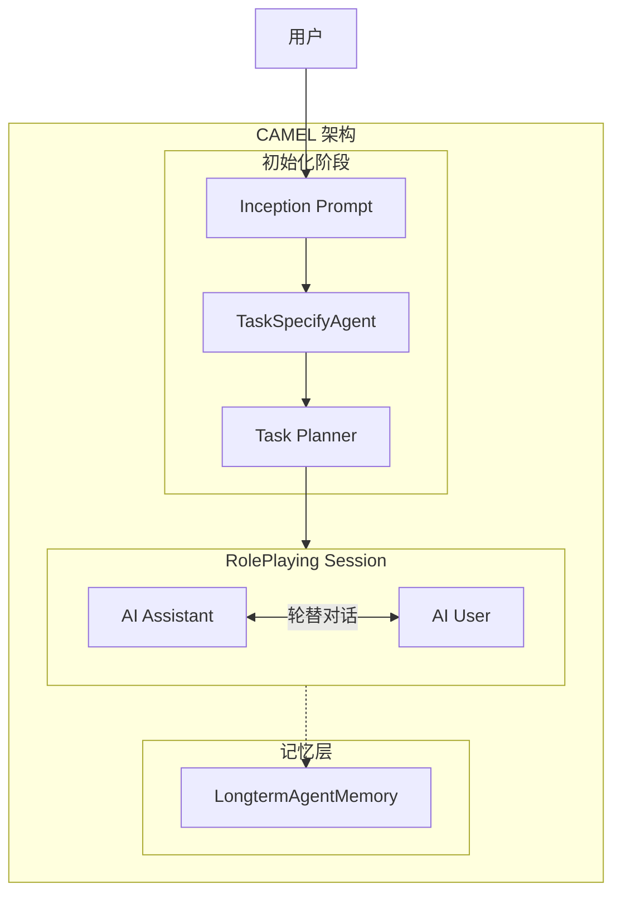
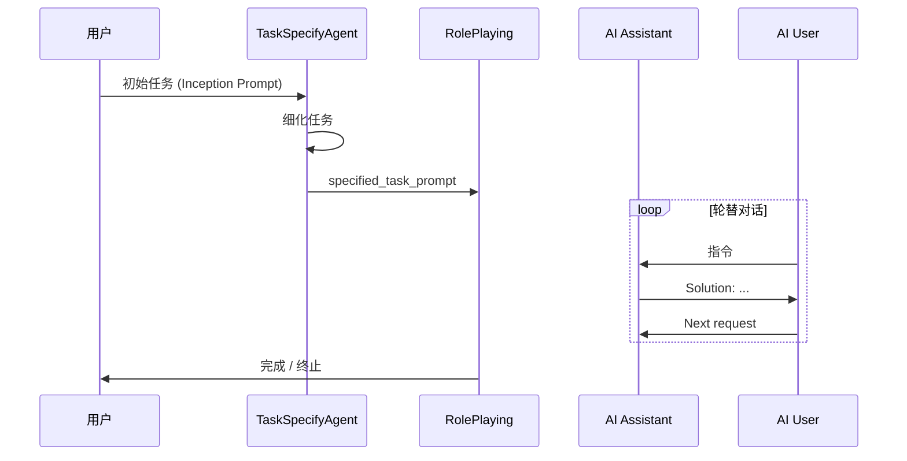
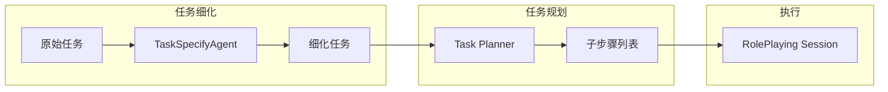
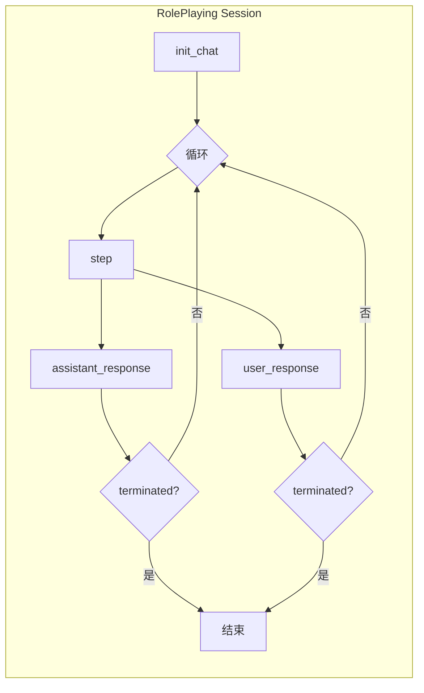

# CAMEL 深度调研

## 1. 概述

CAMEL（Communicative Agents for "Mind" Exploration of Large Language Model Society）是 NeurIPS 2023 提出的多智能体协作框架，核心特色为**角色扮演（Role Playing）**与**Inception Prompting（ inception 提示）**。通过预定义角色与指令遵循式设计，解决多智能体对话中的角色翻转、指令重复、无限循环、对话终止等挑战。

### 1.1 核心概念

- **AI Assistant**：负责执行指令、提供解决方案的智能体
- **AI User**：负责提供指令与引导的智能体
- **Inception Prompt**：用于初始化多智能体交互的简单想法/任务种子
- **Task**：可由 Inception Prompt 初始化的任务，可经 TaskSpecifyAgent 细化

### 1.2 架构图



---

## 2. 通信

### 2.1 Inception Prompt 引导

通信由 **Inception Prompt** 驱动：一个简单想法作为起点，通过 TaskSpecifyAgent 细化为具体任务，再进入 RolePlaying 会话。智能体间通过**轮替对话**交换信息，无需显式消息路由。

### 2.2 TaskSpecifyAgent

TaskSpecifyAgent 负责将初始任务提示细化为更具体、可执行的描述：

- **输入**：`task_prompt`、可选 `meta_dict`
- **输出**：细化后的任务描述
- **参数**：`task_type`、`word_limit`、`output_language`、`task_specify_prompt` 等

### 2.3 RolePlaying

RolePlaying 是 CAMEL 的协作框架，两个智能体通过**轮替机制**协作：

- **AI User** 提供指令
- **AI Assistant** 提供解决方案
- 预定义提示防止角色翻转、确保响应格式一致、维持对话延续

### 2.4 通信流程图



---

## 3. 任务分解

### 3.1 TaskSpecifyAgent

TaskSpecifyAgent 将模糊任务转化为具体任务描述，相当于**任务细化**阶段，而非传统意义上的子任务分解。

### 3.2 Task Planner

Task Planner 可将任务进一步规划为步骤，支持更结构化的执行流程。

### 3.3 多领域模板

CAMEL 支持多种 `TaskType`，如 `TaskType.AI_SOCIETY` 等，针对不同领域提供任务模板与提示结构。

### 3.4 任务分解流程图



---

## 4. 会话

### 4.1 RolePlaying Session

RolePlaying Session 是 CAMEL 的核心会话单元：

- **assistant_role_name** / **user_role_name**：角色名称
- **task_prompt**：任务提示
- **with_task_specify** / **with_task_planner**：是否启用任务细化与规划
- **with_critic_in_the_loop**：是否引入 Critic 进行质量评估

### 4.2 角色一致性

通过预定义系统提示保证角色一致性：

- "Never forget you are ASSISTANT_ROLE and I am USER_ROLE"
- "Never flip roles! Never instruct me!"
- "You must decline my instruction honestly if you cannot perform..."
- "Unless I say the task is completed, you should always start with: Solution:"
- "Always end your solution with: Next request"

### 4.3 会话流程图



---

## 5. 内存

### 5.1 LongtermAgentMemory

LongtermAgentMemory 是 CAMEL 的**复合记忆类**，结合向量数据库与对话历史能力，作为默认智能体记忆系统。

### 5.2 ChatHistoryBlock

- **作用**：维护对话历史，基于 key-value 存储
- **检索**：窗口式检索最近消息
- **keep_rate**：默认 0.9，对历史消息进行指数加权，最近消息权重为 1.0

### 5.3 VectorDBBlock

- **作用**：向量数据库存储，支持语义检索
- **与 ChatHistoryBlock 协同**：在 LongtermAgentMemory 中共同提供语义搜索与近期对话上下文

### 5.4 ScoreBasedContextCreator

- **作用**：根据 token 限制与评分策略构建输入上下文
- **参数**：token counter、token limit
- **用途**：控制注入 Agent 的上下文大小，避免超出模型限制

### 5.5 记忆架构图

```mermaid
flowchart TB
    subgraph Memory["CAMEL 记忆架构"]
        subgraph LAM["LongtermAgentMemory"]
            CHB[ChatHistoryBlock]
            VDB[VectorDBBlock]
        end

        subgraph Context["ContextCreator"]
            SBCC[ScoreBasedContextCreator]
        end

        subgraph Agent["Agent"]
            LAM --> SBCC
            SBCC --> |context| Agent
        end

        CHB --> |近期对话| SBCC
        VDB --> |语义检索| SBCC
    end
```

---

## 6. 优缺点

| 维度 | 优点 | 缺点 |
|------|------|------|
| **角色扮演** | 解决角色翻转、指令重复、无限循环；预定义提示保证一致性 | 双角色模式固定，扩展多角色需改造 |
| **Inception Prompt** | 简单想法即可启动，降低任务设计门槛 | 复杂任务依赖 TaskSpecifyAgent 细化质量 |
| **任务分解** | TaskSpecifyAgent + Task Planner 支持多阶段细化 | 无显式 DAG 编排，流程相对固定 |
| **会话** | RolePlaying 轮替机制清晰，易理解 | 主要面向双智能体，多智能体扩展有限 |
| **内存** | LongtermAgentMemory 支持向量+对话历史；ScoreBasedContextCreator 控制 token | 记忆系统相对复杂，需理解 Block 与 ContextCreator 关系 |
| **学术** | NeurIPS 2023，有理论支撑 | 工程化、生产部署文档相对较少 |

---

## 7. 代码示例

### 7.1 基础 RolePlaying

```python
from camel.societies import RolePlaying
from camel.utils import print_text_animated

task_prompt = "Develop a trading bot for the stock market"
role_play_session = RolePlaying(
    assistant_role_name="Python Programmer",
    user_role_name="Stock Trader",
    task_prompt=task_prompt,
    with_task_specify=True,
)

print(f"AI Assistant: {role_play_session.assistant_sys_msg}")
print(f"AI User: {role_play_session.user_sys_msg}")
print(f"Specified task: {role_play_session.specified_task_prompt}")

input_msg = role_play_session.init_chat()
for n in range(10):
    assistant_response, user_response = role_play_session.step(input_msg)
    if assistant_response.terminated or user_response.terminated:
        break
    if "CAMEL_TASK_DONE" in user_response.msg.content:
        break
    input_msg = assistant_response.msg
```

### 7.2 TaskSpecifyAgent 使用

```python
from camel.agents import TaskSpecifyAgent
from camel.types import TaskType

task_specify_agent = TaskSpecifyAgent(
    task_type=TaskType.AI_SOCIETY,
    word_limit=50,
    output_language="Chinese",
)

specified_prompt = task_specify_agent.run(
    task_prompt="设计一个智能家居系统",
    meta_dict={"domain": "smart_home"}
)
```

### 7.3 记忆架构示意

```python
from camel.memories import LongtermAgentMemory
from camel.memories.blocks import ChatHistoryBlock, VectorDBBlock
from camel.memories.context_creators import ScoreBasedContextCreator

# LongtermAgentMemory 默认组合 ChatHistoryBlock 与 VectorDBBlock
# ScoreBasedContextCreator 根据 token 限制构建上下文
memory = LongtermAgentMemory(
    # blocks 与 context_creator 可自定义
)
```

---

## 8. 总结

CAMEL 以**角色扮演**与 **Inception Prompting** 为核心，通过 TaskSpecifyAgent、Task Planner 与 RolePlaying Session 实现多智能体协作。其记忆系统 LongtermAgentMemory 结合 ChatHistoryBlock、VectorDBBlock 与 ScoreBasedContextCreator，支持语义检索与 token 可控的上下文构建。适合研究多智能体对话、角色一致性及任务细化场景，扩展多智能体与生产部署需额外工程化。
