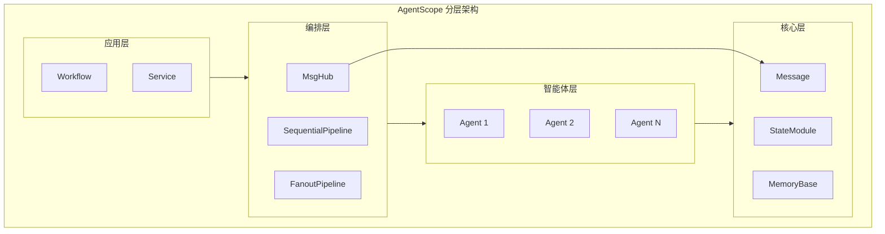
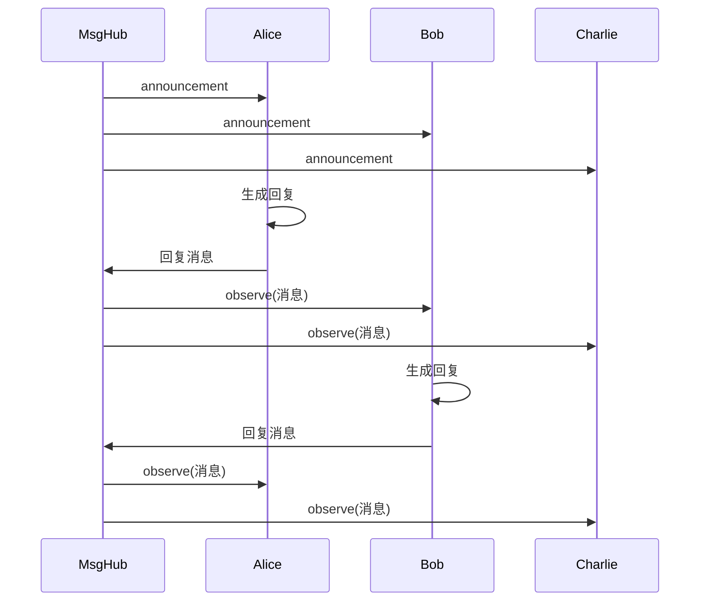
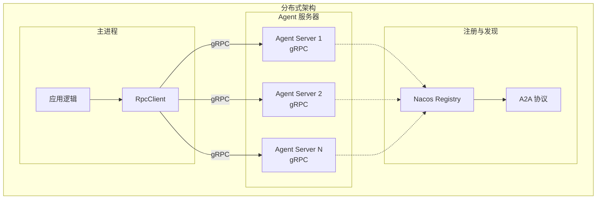
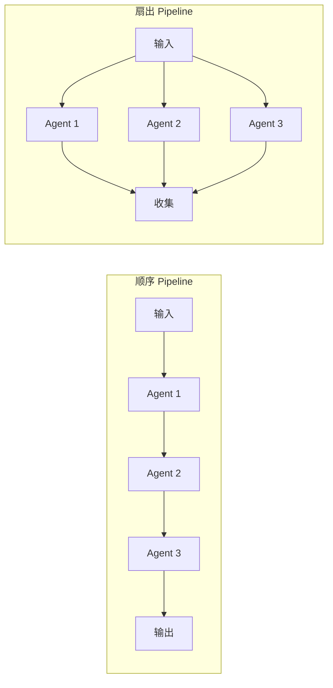
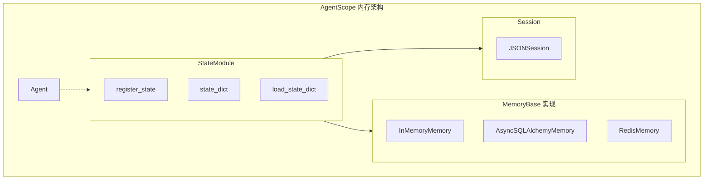
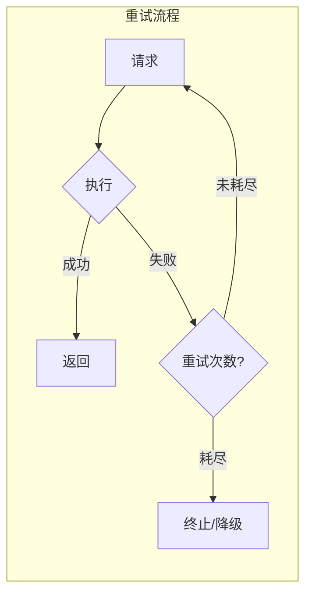

# AgentScope (阿里) 深度调研

## 1. 概述

AgentScope 是阿里巴巴 SysML 团队开源的**多智能体应用开发框架**，采用**分层架构**，以**消息交换**为核心。支持单机与分布式部署，提供 Pipeline、Service、Memory、State 等组件，适用于生产级多智能体应用。

### 1.1 核心设计

- **分层架构**：Agent、Pipeline、Service、Memory、State 等模块分层清晰
- **消息交换核心**：`Msg` 作为智能体间通信的基本数据结构
- **生产就绪**：支持分布式、实时通信、内存管理、可观测性

### 1.2 架构图



---

## 2. 通信

### 2.1 Message (Msg)

`Msg` 是 AgentScope 的**基础消息结构**，所有智能体通过 Msg 交换信息：

- **role**：user / assistant / system
- **content**：消息内容（支持多模态）
- **name**：发送者标识
- **metadata**：扩展元数据

### 2.2 Pipeline

Pipeline 是编排语法糖，提供多种执行模式：

- **sequential_pipeline**：顺序执行，前一智能体输出作为下一智能体输入
- **fanout_pipeline**：同一输入分发给多个智能体，可并行或顺序执行
- **stream_printing_messages**：将智能体打印消息转为异步生成器，支持流式输出

### 2.3 MsgHub 广播

MsgHub 是**消息广播中心**：

- **参与者**：接收 `participants` 列表
- **自动分发**：任一参与者生成回复时，通过 `observe` 方法广播给其他参与者
- **动态管理**：支持 `add`、`delete`、`broadcast` 动态增删参与者与广播消息

### 2.4 通信流程图



---

## 3. 分布式

### 3.1 Actor + gRPC

AgentScope 支持基于 **gRPC** 的分布式部署：

- **RpcClient**：管理到 Agent 服务器的连接
- **call_agent_func()**：远程调用智能体函数，支持超时配置（默认 300 秒）

### 3.2 to_dist

通过 `to_dist=True` 初始化智能体即可启用分布式模式，**主进程代码无需修改**：

- 智能体可部署在不同进程或机器
- 示例：5 智能体网页搜索场景，分布式模式可将耗时从 25 秒降至 5 秒

### 3.3 A2A 协议

AgentScope 支持 **A2A (Agent-to-Agent) 协议**，结合 **Nacos Registry** 实现：

- **跨语言**：Python、Java、Golang 等智能体可互相发现与调用
- **跨框架**：不同框架的智能体可互操作
- **无代码共享**：通过注册中心发现，无需紧耦合

### 3.4 分布式架构图



---

## 4. 任务管理

### 4.1 Workflow

Workflow 通过**消息驱动**协调智能体，消息是信息交换的基本单元，无显式 DAG 定义时依赖 Pipeline 与 MsgHub 组织流程。

### 4.2 Service

- **ServiceToolkit**：将服务函数转换为字符串提示格式，供智能体使用
- **ServiceResponse**：包装执行结果，带状态标识
- **NoteBookExecutor**：支持 Jupyter Notebook 交互式代码执行

### 4.3 ServiceToolkit

ServiceToolkit 将后端服务能力暴露给智能体，使智能体能够调用预定义服务函数。

### 4.4 任务编排图



---

## 5. 内存

### 5.1 StateModule

StateModule 是**状态管理基类**：

- **register_state()**：注册需持久化的状态
- **state_dict()**：导出状态快照
- **load_state_dict()**：加载状态
- **继承者**：AgentBase、MemoryBase、LongTermMemoryBase、Toolkit 等

### 5.2 MemoryBase

MemoryBase 是**记忆存储基类**：

- **InMemoryMemory**：内存存储
- **AsyncSQLAlchemyMemory**：异步 SQLAlchemy 存储
- **RedisMemory**：Redis 存储
- **marks**：字符串标签，用于分类与检索
- **持久化**：通过 `state_dict()` / `load_state_dict()` 支持跨会话持久化

### 5.3 Session

- **JSONSession**：基于 JSON 的会话级状态管理
- **自动注册**：与 StateModule 协同，支持应用级状态持久化

### 5.5 内存架构图



---

## 6. 故障容错

### 6.1 重试机制

AgentScope 通过 `retry_strategy` 模块支持重试：

- **RPC 客户端**：可配置重试策略
- **maxAttempts**：最大重试次数（如 2/2 表示最多 2 次）
- **注意**：部分场景下重试耗尽后可能直接终止，需结合业务设计恢复路径

### 6.2 规则修正

框架支持通过配置与规则进行错误修正，具体策略依赖业务场景与扩展实现。

### 6.3 容错流程图



---

## 7. 优缺点

| 维度 | 优点 | 缺点 |
|------|------|------|
| **架构** | 分层清晰；Msg 为核心，易于理解 | 概念较多，学习曲线略陡 |
| **通信** | MsgHub 自动广播；Pipeline 语法糖简化编排 | 无显式 DAG，复杂流程需自行设计 |
| **分布式** | gRPC + to_dist 易用；A2A 支持跨语言/跨框架 | 分布式调试与追踪仍有改进空间 |
| **任务管理** | Service、ServiceToolkit 支持服务封装 | Workflow 抽象相对轻量 |
| **内存** | StateModule + MemoryBase 支持多种存储与持久化 | 需理解 state_dict 与 Session 关系 |
| **容错** | 支持重试策略 | 重试耗尽后的行为与日志可进一步优化 |
| **生态** | 阿里维护，支持 Java 等多语言 | 文档与社区规模相对 LangChain 等略小 |

---

## 8. 代码示例

### 8.1 MsgHub 广播

```python
import asyncio
from agentscope.message import Msg
from agentscope.pipeline import MsgHub

async def example_broadcast():
    async with MsgHub(
        participants=[alice, bob, charlie],
        announcement=Msg("user", "Now introduce yourself.", "user"),
    ) as hub:
        await alice()
        await bob()
        await charlie()

asyncio.run(example_broadcast())
```

### 8.2 Sequential Pipeline

```python
from agentscope.pipeline import sequential_pipeline

msg = await sequential_pipeline(
    agents=[alice, bob, charlie, david],
    msg=None,
)
```

### 8.3 Fanout Pipeline

```python
from agentscope.pipeline import fanout_pipeline

msgs = await fanout_pipeline(
    agents=[alice, bob, charlie, david],
    msg=None,
    enable_gather=True,  # 并行执行
)
```

### 8.4 分布式初始化

```python
# 初始化时设置 to_dist=True 即可启用分布式
agent = ReActAgent(
    name="MyAgent",
    model=model,
    to_dist=True,
)
```

---

## 9. 总结

AgentScope 以**分层架构**与**消息交换**为核心，通过 Message、Pipeline、MsgHub 实现多智能体通信与编排。分布式方面支持 gRPC 与 A2A 协议，便于跨语言、跨框架部署。StateModule、MemoryBase 与 Session 提供状态与记忆管理，Service 与 ServiceToolkit 支持服务封装。适合需要生产级多智能体、分布式部署与可观测性的场景，故障容错与可观测性仍在持续完善中。
