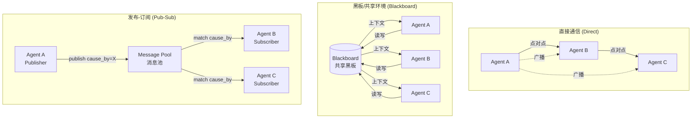
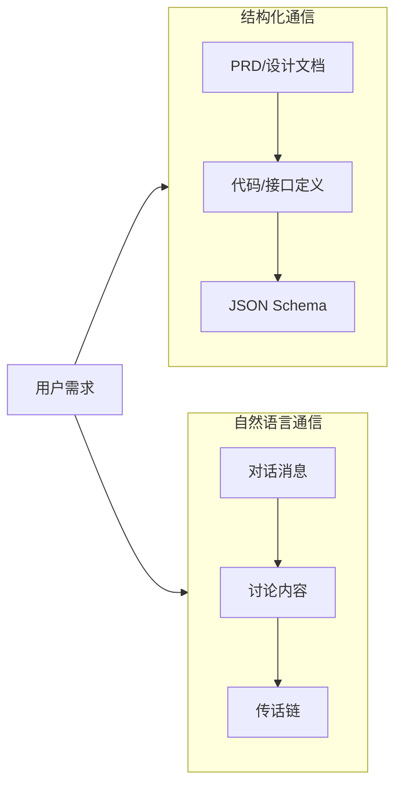

# 多智能体通信协议研究

## 1. 概述

多智能体系统的通信协议决定了智能体之间如何交换信息、协调行动。不同的通信范式在解耦程度、可扩展性、信息保真度等方面各有优劣。本文档系统分析 Direct、Blackboard/Shared Environment、Pub-Sub 等范式，以及 Structured vs Natural Language 的对比，并引用 ChatDev、CAMEL、LbMAS、RAPS 等代表性论文与框架。

---

## 2. 三大通信范式对比

### 2.1 范式架构图

### 2.2 范式对比表

| 维度 | 直接通信 (Direct) | 黑板/共享环境 (Blackboard) | 发布-订阅 (Pub-Sub) |
|------|-------------------|----------------------------|---------------------|
| **拓扑** | 点对点 / 广播 | 中心化共享存储 | 解耦的发布者-订阅者 |
| **耦合度** | 高（需知对方身份） | 低（通过黑板间接） | 低（通过 cause_by 匹配） |
| **扩展性** | 差（N² 连接） | 中（黑板可能成为瓶颈） | 好（按需订阅） |
| **信息保真** | 依赖传递链 | 高（结构化存储） | 中（取决于消息 schema） |
| **典型系统** | CAMEL、ChatDev 对话链 | LbMAS、RAPS | MetaGPT、ChatDev 部分机制 |

---

## 3. 结构化 vs 自然语言通信

### 3.1 对比图

### 3.2 结构化 vs 自然语言对比表

| 维度 | 结构化通信 | 自然语言通信 |
|------|------------|--------------|
| **信息失真** | 低（schema 约束） | 高（传话游戏效应） |
| **可验证性** | 高（可解析、校验） | 低（语义模糊） |
| **灵活性** | 中（需预定义格式） | 高（自由表达） |
| **适用场景** | 软件工程、数据流水线 | 创意讨论、角色扮演 |
| **典型系统** | MetaGPT、ChatDev 设计阶段 | CAMEL、ChatDev 对话链 |

---

## 4. 代表性论文与框架分析

### 4.1 ChatDev (ACL 2024)

**核心思想**：通过 **Chat Chain** 和 **Communicative Dehallucination** 指导智能体在软件开发各阶段（设计、编码、测试）进行统一语言通信。

| 特性 | 描述 |
|------|------|
| **通信形式** | 自然语言对话 + 编程语言（调试阶段） |
| **机制** | Chat Chain 定义「说什么」，Dehallucination 定义「怎么说」 |
| **优势** | 统一设计-编码-测试流程，减少阶段间技术断层 |
| **局限** | 自然语言易产生幻觉级联 |

### 4.2 CAMEL (NeurIPS 2023)

**核心思想**：**角色扮演 (Role-Playing)** + **Inception Prompting**，使多智能体通过对话自主协作，无需持续人工引导。

| 特性 | 描述 |
|------|------|
| **通信形式** | 纯自然语言对话 |
| **机制** | 角色设定 + 任务提示，引导对话走向目标 |
| **优势** | 可扩展、可生成多领域对话数据 |
| **局限** | 依赖提示工程，信息传递易失真 |

### 4.3 LbMAS (Blackboard Architecture)

**核心思想**：基于 **共享黑板** 的 LLM 多智能体系统，智能体通过读写黑板进行协调。

| 特性 | 描述 |
|------|------|
| **通信形式** | 黑板上的结构化/半结构化内容 |
| **机制** | 公共/私有空间、控制单元动态选择参与智能体 |
| **优势** | 集中式记忆、动态问题求解、无需预定义工作流 |
| **局限** | 黑板可能成为瓶颈，需控制单元设计 |

### 4.4 RAPS

**核心思想**：基于黑板架构的推理与规划系统，强调结构化推理链的共享与复用。

---

## 5. 三种范式优劣分析

### 5.1 直接通信 (Direct)

| 优势 | 劣势 |
|------|------|
| 实现简单，逻辑直观 | 智能体需知晓对方身份，耦合高 |
| 延迟低，无中间层 | 扩展时连接数呈 N² 增长 |
| 适合小规模、固定拓扑 | 难以动态调整通信对象 |

### 5.2 黑板/共享环境 (Blackboard)

| 优势 | 劣势 |
|------|------|
| 解耦智能体，无需直接引用 | 黑板可能成为单点瓶颈 |
| 支持动态问题求解 | 需设计控制单元与读写策略 |
| 集中式记忆，便于检索 | 大规模时上下文可能过长 |

### 5.3 发布-订阅 (Pub-Sub)

| 优势 | 劣势 |
|------|------|
| 解耦发布者与订阅者 | 需设计 cause_by 等订阅标签体系 |
| 按需订阅，减少信息过载 | 消息池可能膨胀 |
| 易于扩展新智能体 | 依赖消息格式与路由规则 |

---

## 6. 综合对比表

| 方法 | 范式 | 通信形式 | 论文/系统 | 适用场景 |
|------|------|----------|-----------|----------|
| ChatDev | 对话链 + 部分共享 | 自然语言 + 代码 | ACL 2024 | 软件开发全流程 |
| CAMEL | 直接对话 | 自然语言 | NeurIPS 2023 | 角色扮演、数据生成 |
| MetaGPT | Pub-Sub | 结构化文档 | - | 软件工程 SOP |
| LbMAS | Blackboard | 黑板读写 | - | 复杂推理、动态规划 |
| RAPS | Blackboard | 结构化推理链 | - | 规划与推理 |

---

## 7. 参考文献

- **ChatDev**: Communicative Agents for Software Development. ACL 2024.
- **CAMEL**: Communicative Agents for "Mind" Exploration of Large Language Model Society. NeurIPS 2023.
- **LbMAS**: Exploring Advanced LLM Multi-Agent Systems Based on Blackboard Architecture.
- **RAPS**: 基于黑板架构的推理与规划系统。
