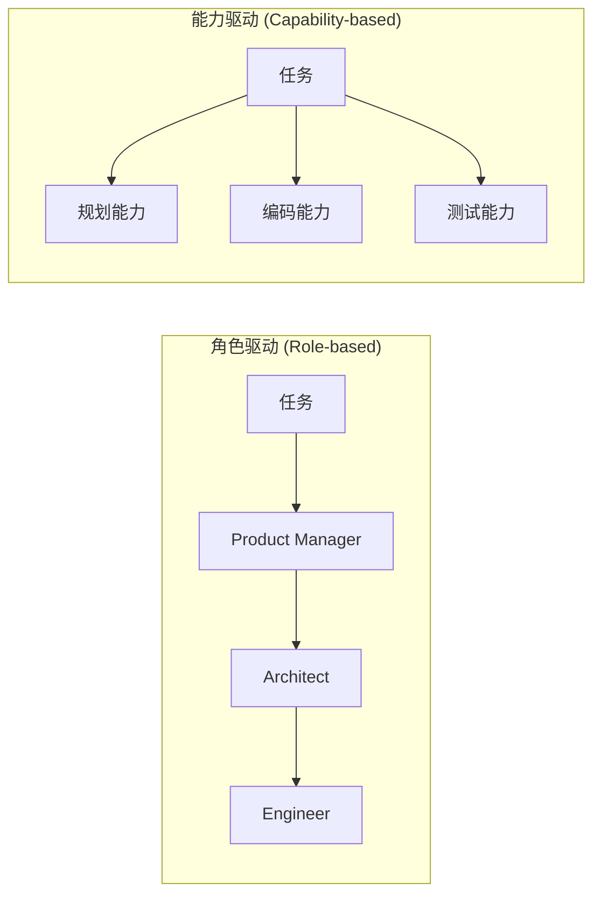

# 任务分解与编排研究

## 1. 概述

任务分解与编排是多智能体系统的核心能力，决定了复杂任务如何被拆解、分配与执行。本文档系统分析 **层级式 (Hierarchical)**、**动态 vs 静态 (Dynamic vs Static)**、**角色驱动 vs 能力驱动 (Role-based vs Capability-based)** 等编排范式，并引用 HALO、AgentOrchestra、DyLAN、MetaGPT、AgentVerse、AutoAgents 等代表性框架与论文。

---

## 2. 三种编排范式架构

### 2.1 范式架构图

### 2.2 范式对比表

| 维度 | 层级式 (Hierarchical) | 动态编排 (Dynamic) | 静态编排 (Static) |
|------|------------------------|---------------------|-------------------|
| **任务分解** | 高层规划逐层分解 | 按任务需求动态选择 | 预定义 SOP 顺序 |
| **Agent 选择** | 固定层级角色 | 推理时动态选择 | 固定角色集合 |
| **拓扑** | 树状层级 | 可变的图结构 | 流水线/链式 |
| **典型系统** | HALO、AgentOrchestra | DyLAN | MetaGPT、ChatDev |

---

## 3. 层级式编排 (Hierarchical)

### 3.1 HALO

**HALO** (Hierarchical Autonomous Logic-Oriented Orchestration) 采用三层推理结构：

| 层级 | 职责 | 输出 |
|------|------|------|
| **高层规划 Agent** | 分解复杂任务为子任务 | 子任务列表 |
| **中层角色设计 Agent** | 为子任务实例化专用 Agent | 角色配置 |
| **低层推理 Agent** | 执行具体子任务 | 推理结果 |

**关键技术**：
- **MCTS (Monte Carlo Tree Search)**：将子任务执行建模为结构化工作流搜索问题
- **自适应提示优化**：自动将原始查询转化为任务特定提示

**性能数据**：
- 平均提升 **14.4%** 优于 SOTA 基线
- MMLU 道德场景：**+13.3%**
- MATH 代数：**+19.6%**

### 3.2 AgentOrchestra

**AgentOrchestra** 采用层级多智能体框架，通过高层协调器将任务分配给不同专业子 Agent，形成树状执行结构。

---

## 4. 动态 vs 静态编排

### 4.1 DyLAN (Dynamic LLM-Agent Network)

**核心思想**：根据任务需求动态调整 Agent 组合、通信拓扑和交互策略。

| 特性 | 描述 |
|------|------|
| **Agent 重要性评分** | 无监督指标，自动选择最优 Agent 组合 |
| **推理时选择** | 非固定预定义架构 |
| **早停机制** | 优化性能与效率 |

**性能数据**：
- MATH 基准：**+13.0%**（GPT-3.5-turbo 单次执行对比）
- HumanEval：**+13.3%**
- MMLU 部分科目：最高 **+25.0%** 准确率

### 4.2 MetaGPT SOP

**核心思想**：固定 SOP 流水线，顺序执行 PM → Architect → PM(任务分配) → Engineer → QA。

| 特性 | 描述 |
|------|------|
| **预定义流程** | 软件工程 SOP 编码 |
| **静态编排** | 无动态分支 |
| **优势** | 可预测、减少幻觉级联 |

---

## 5. 角色驱动 vs 能力驱动

### 5.1 对比图

### 5.2 角色驱动 vs 能力驱动对比表

| 维度 | 角色驱动 (Role-based) | 能力驱动 (Capability-based) |
|------|------------------------|-----------------------------|
| **分配依据** | 智能体角色（PM、Architect 等） | 智能体能力匹配 |
| **典型系统** | MetaGPT、ChatDev、AgentVerse | AutoAgents、DyLAN |
| **灵活性** | 中（角色固定） | 高（按能力动态匹配） |
| **可解释性** | 高（角色语义清晰） | 中（需能力描述） |

### 5.3 AgentVerse

**AgentVerse** 支持多种角色预设，通过角色定义智能体的行为与协作方式，属于角色驱动范式。

### 5.4 AutoAgents

**AutoAgents** 强调按能力匹配任务，而非固定角色，支持更灵活的任务分解与分配。

---

## 6. 性能数据汇总

| 框架 | 基准 | 提升幅度 | 编排类型 |
|------|------|----------|----------|
| **DyLAN** | MATH | +13.0% | 动态 |
| **DyLAN** | HumanEval | +13.3% | 动态 |
| **DyLAN** | MMLU 部分 | 最高 +25.0% | 动态 |
| **HALO** | 平均 | +14.4% | 层级式 |
| **HALO** | MMLU 道德场景 | +13.3% | 层级式 |
| **HALO** | MATH 代数 | +19.6% | 层级式 |
| **MetaGPT** | HumanEval | 85.9% Pass@1 | 静态 SOP |
| **MetaGPT** | MBPP | 87.7% Pass@1 | 静态 SOP |

---

## 7. 优劣分析

### 7.1 层级式编排

| 优势 | 劣势 |
|------|------|
| 结构清晰，易于理解 | 层级固定，灵活性受限 |
| 支持复杂任务分解 | 高层规划可能成为瓶颈 |
| 可结合 MCTS 等搜索优化 | 计算开销较大 |

### 7.2 动态编排

| 优势 | 劣势 |
|------|------|
| 按任务自适应，泛化能力强 | 需设计 Agent 重要性等指标 |
| 推理时优化，效率更高 | 可解释性较差 |
| 可跨任务类型扩展 | 实现复杂度高 |

### 7.3 静态编排

| 优势 | 劣势 |
|------|------|
| 实现简单，可预测 | 难以应对动态任务 |
| 减少幻觉级联 | 工作流固定，难以动态调整 |
| 领域专精（如软件工程） | 其他领域需重构 |

---

## 8. 综合对比表

| 方法 | 编排类型 | 任务分解 | Agent 选择 | 典型系统 |
|------|----------|----------|-----------|----------|
| HALO | 层级式 | 高层规划逐层分解 | 中层角色设计 | HALO |
| AgentOrchestra | 层级式 | 协调器分配 | 固定子 Agent | AgentOrchestra |
| DyLAN | 动态 | 动态 | 推理时 Agent 重要性评分 | DyLAN |
| MetaGPT | 静态 | SOP 预定义 | 固定角色顺序 | MetaGPT |
| AgentVerse | 角色驱动 | 按角色分配 | 角色预设 | AgentVerse |
| AutoAgents | 能力驱动 | 按能力匹配 | 能力匹配 | AutoAgents |

---

## 9. 参考文献

- **HALO**: Hierarchical Autonomous Logic-Oriented Orchestration for Multi-Agent LLM Systems.
- **AgentOrchestra**: Hierarchical Multi-Agent Framework.
- **DyLAN**: Dynamic LLM-Agent Network: An LLM-agent Collaboration Framework with Agent Team Optimization.
- **MetaGPT**: Meta Programming for Multi-Agent Collaborative Framework.
