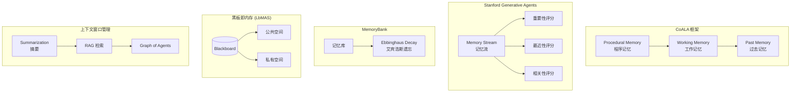
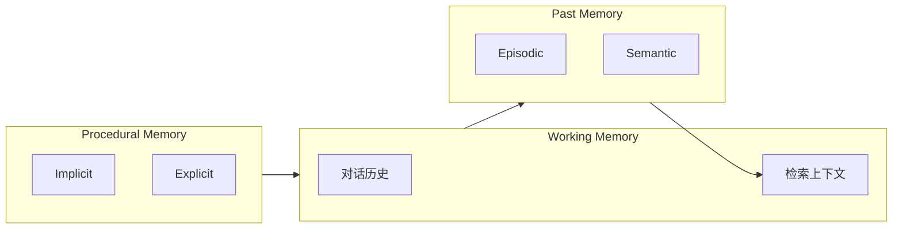
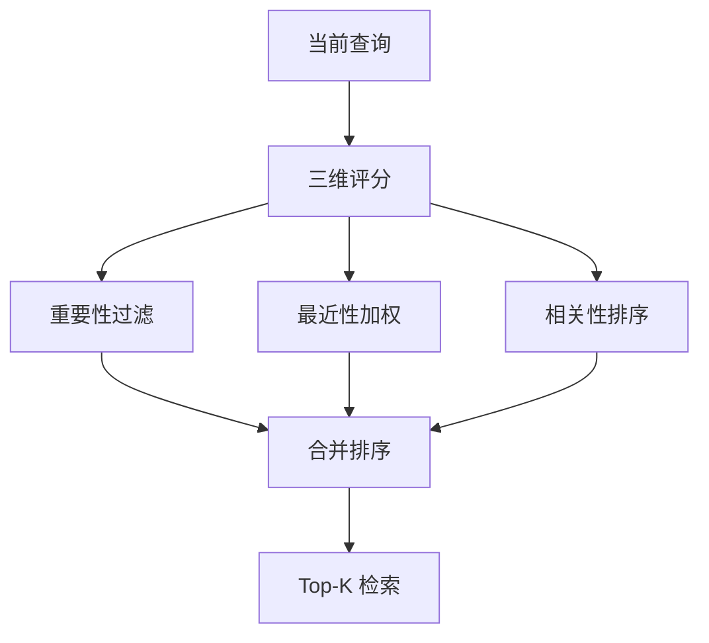
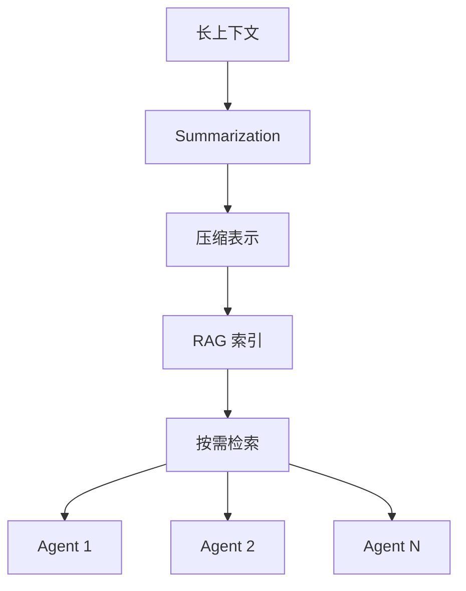

# 共享内存与上下文研究

## 1. 概述

共享内存与上下文管理是多智能体系统维持状态、支持长期推理的关键。本文档系统分析 **CoALA 框架**、**Stanford Generative Agents**（记忆流、三维评分）、**MemoryBank**（艾宾浩斯遗忘曲线）、**黑板即内存**（LbMAS）、以及 **上下文窗口管理**（摘要、RAG、Graph of Agents）等方案。

---

## 2. 内存架构总览

### 2.1 内存架构对比图

### 2.2 内存架构对比表

| 架构 | 核心机制 | 存储形式 | 典型系统 |
|------|----------|----------|----------|
| **CoALA** | 工作/过去/程序记忆分层 | 符号变量 + 向量/图库 | CoALA |
| **Stanford Generative Agents** | 记忆流 + 三维评分 | 时间线记忆流 | Generative Agents |
| **MemoryBank** | 艾宾浩斯遗忘曲线 | 记忆库 + 衰减更新 | MemoryBank |
| **LbMAS** | 黑板即共享内存 | 公共/私有空间 | LbMAS |
| **上下文管理** | 摘要、RAG、图分解 | 压缩/检索/分布式 | 多种系统 |

---

## 3. CoALA 框架

### 3.1 四类记忆组件

| 记忆类型 | 描述 | 实现方式 |
|----------|------|----------|
| **Working Memory** | 当前决策周期的活跃信息 | 对话历史、检索上下文 |
| **Past Memory** | 历史决策与事实 | Episodic（决策日志）+ Semantic（事实） |
| **Procedural Memory** | 行为与规则 | Implicit（模型权重）+ Explicit（提示、逻辑） |
| **决策循环** | 推理 → 检索 → 规划 → 执行 | 可修改世界与长期记忆 |

### 3.2 CoALA 架构图

---

## 4. Stanford Generative Agents

### 4.1 记忆流 (Memory Stream)

**Memory Stream** 将所有观察、反思、对话按时间顺序存储，形成连续记忆流。

### 4.2 三维评分机制

| 维度 | 描述 | 作用 |
|------|------|------|
| **重要性 (Importance)** | 记忆对智能体目标的价值 | 决定是否长期保留 |
| **最近性 (Recency)** | 距离当前时间 | 近期记忆优先检索 |
| **相关性 (Relevance)** | 与当前查询的语义相似度 | 检索时排序 |

### 4.3 检索流程

---

## 5. MemoryBank

### 5.1 艾宾浩斯遗忘曲线 (Ebbinghaus Decay)

**MemoryBank** 将记忆更新机制与艾宾浩斯遗忘曲线结合：

- **时间衰减**：记忆随时间衰减，需定期强化
- **显著性**：重要记忆衰减更慢，可选择性强化
- **拟人化**：模拟人类记忆，而非无限保留

### 5.2 记忆更新流程

### 5.3 应用场景

- 长期陪伴（如 SiliconFriend）
- 心理咨询（结合心理对话数据微调）
- 跨会话个性化

---

## 6. 黑板即内存 (LbMAS)

### 6.1 设计

在 LbMAS 中，**黑板 (Blackboard)** 同时承担通信媒介与共享内存的角色：

| 空间 | 描述 |
|------|------|
| **公共空间** | 所有智能体可读写的共享内容 |
| **私有空间** | 特定智能体的私有记忆 |

### 6.2 优势

- 集中式记忆，减少重复存储
- 控制单元可根据黑板内容动态选择参与智能体
- 支持迭代式问题求解

---

## 7. 上下文窗口管理

### 7.1 三种策略

| 策略 | 描述 | 适用场景 |
|------|------|----------|
| **Summarization** | 将长历史压缩为摘要 | 对话历史、任务日志 |
| **RAG** | 按需检索相关记忆 | 知识库、长期记忆 |
| **Graph of Agents** | 将上下文分布到多个 Agent 节点 | 大规模、分布式系统 |

### 7.2 上下文管理架构图

---

## 8. 优劣分析

### 8.1 CoALA

| 优势 | 劣势 |
|------|------|
| 系统化认知架构 | 需设计各记忆组件实现 |
| 与经典 AI 认知架构对齐 | 实现复杂度较高 |
| 模块化，易扩展 | 工作记忆容量有限 |

### 8.2 Stanford Generative Agents

| 优势 | 劣势 |
|------|------|
| 三维评分直观有效 | 评分权重需调优 |
| 支持长期、拟人化行为 | 记忆流可能膨胀 |
| 可解释性较好 | 计算开销随记忆增长 |

### 8.3 MemoryBank

| 优势 | 劣势 |
|------|------|
| 拟人化遗忘，更自然 | 衰减参数需设计 |
| 支持长期陪伴场景 | 可能遗忘重要信息 |
| 可结合心理对话微调 | 依赖领域数据 |

### 8.4 黑板即内存

| 优势 | 劣势 |
|------|------|
| 通信与记忆统一 | 黑板可能成为瓶颈 |
| 集中式，易检索 | 大规模时上下文过长 |
| 支持动态问题求解 | 需控制单元设计 |

### 8.5 上下文窗口管理

| 优势 | 劣势 |
|------|------|
| 应对长上下文限制 | 摘要可能丢失细节 |
| RAG 按需加载 | 检索质量依赖索引 |
| Graph of Agents 可扩展 | 分布式协调复杂 |

---

## 9. 综合对比表

| 方案 | 核心机制 | 持久化 | 适用场景 |
|------|----------|--------|----------|
| CoALA | 工作/过去/程序记忆 | 向量/图库 | 通用 Agent 架构 |
| Stanford Generative Agents | 记忆流 + 三维评分 | 时间线存储 | 模拟人生、社交 |
| MemoryBank | 艾宾浩斯衰减 | 记忆库 + 更新 | 长期陪伴、心理咨询 |
| LbMAS | 黑板公共/私有空间 | 黑板持久化 | 复杂推理、动态规划 |
| Summarization | 压缩摘要 | 摘要存储 | 对话历史 |
| RAG | 检索增强 | 向量库 | 知识密集型 |
| Graph of Agents | 分布式上下文 | 节点存储 | 大规模多 Agent |

---

## 10. 参考文献

- **CoALA**: Cognitive Architectures for Language Agents. Princeton University.
- **Stanford Generative Agents**: Generative Agents: Interactive Simulacra of Human Behavior.
- **MemoryBank**: MemoryBank: Enhancing Large Language Models with Long-Term Memory. AAAI 2024.
- **LbMAS**: Exploring Advanced LLM Multi-Agent Systems Based on Blackboard Architecture.
