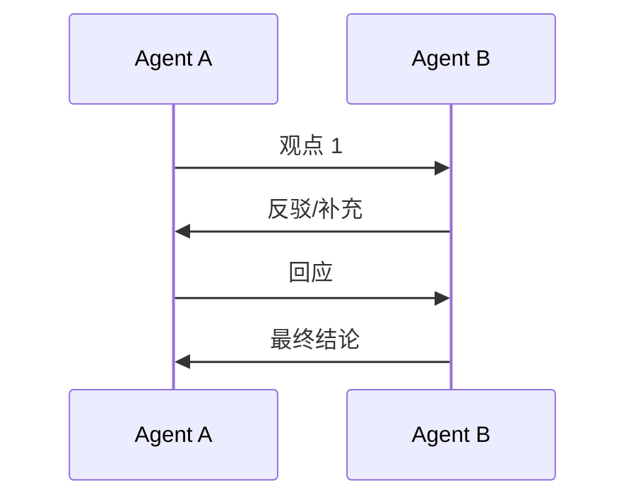
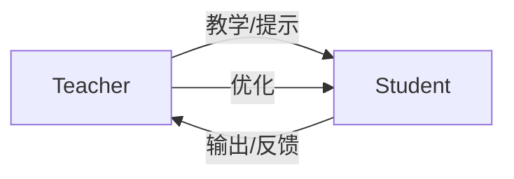
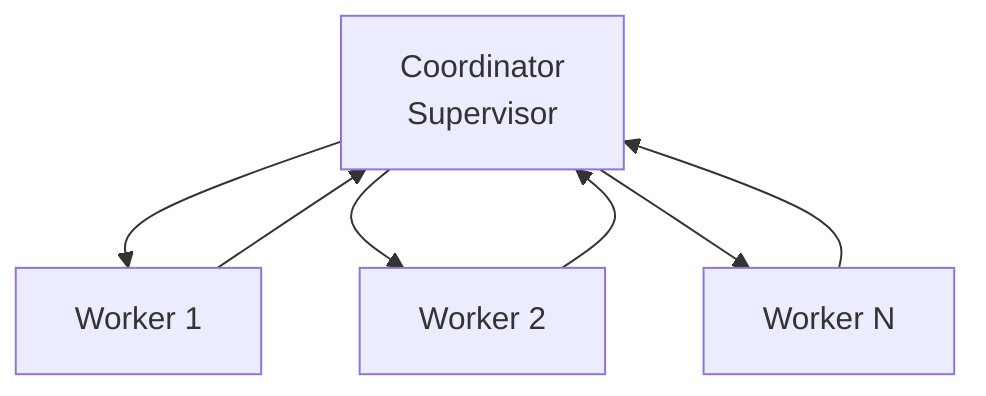
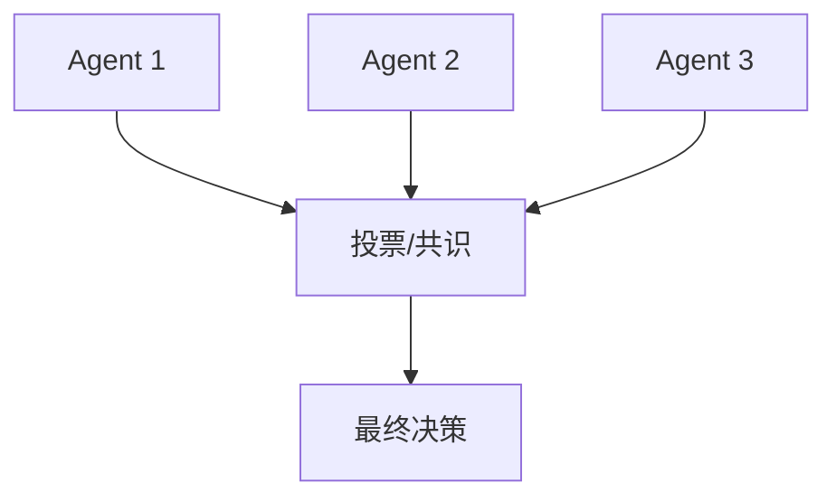
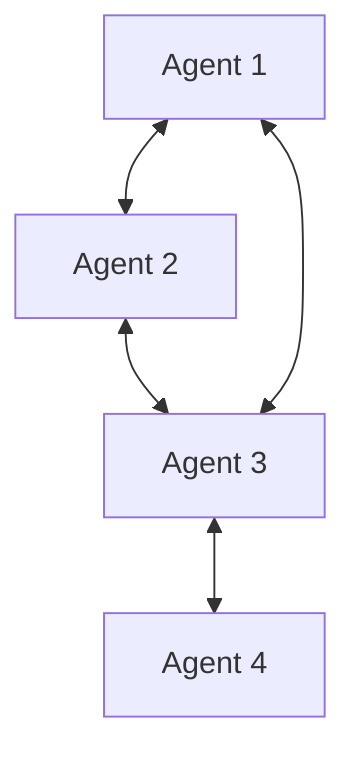
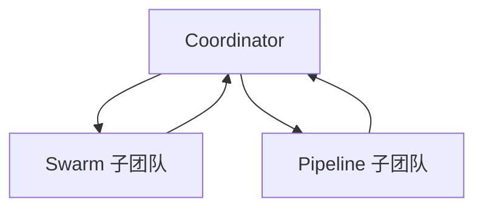
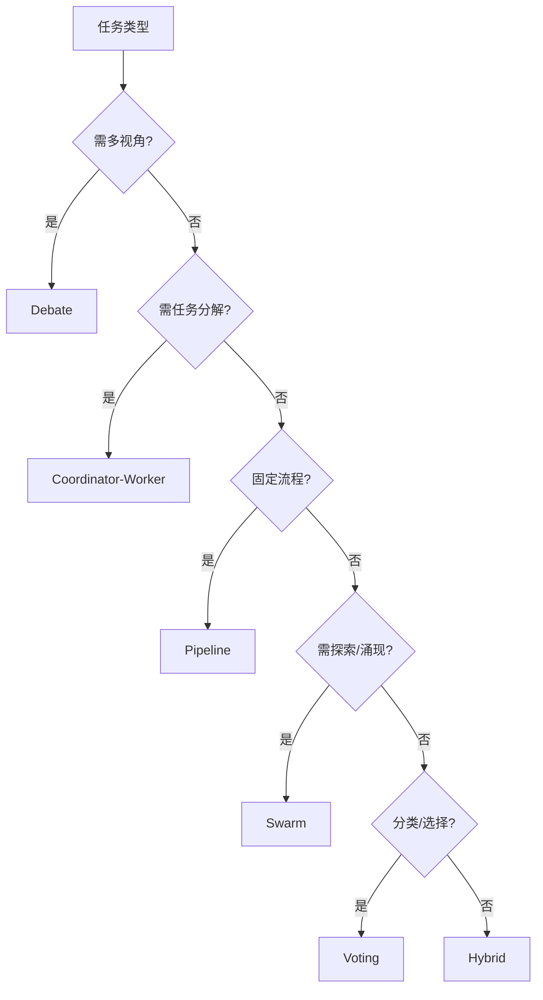

# 多智能体协作模式研究

## 1. 概述

多智能体协作模式定义了智能体之间的拓扑结构、交互方式与决策机制。本文档系统分析 **Debate/Discussion（辩论/讨论）**、**Teacher-Student（师生）**、**Coordinator-Worker（协调者-工作者）**、**Pipeline（流水线）**、**Voting/Consensus（投票/共识）**、**Swarm（蜂群）**、**Hybrid（混合）** 等七种核心模式。

---

## 2. 协作模式总览图

```mermaid
flowchart TB
    subgraph Debate["辩论/讨论 (Debate)"]
        D1[Agent A] <-->|辩论| D2[Agent B]
    end

    subgraph TeacherStudent["师生 (Teacher-Student)"]
        T[Teacher] -->|指导| S[Student]
        S -->|反馈| T
    end

    subgraph Coordinator["协调者-工作者 (Coordinator-Worker)"]
        C[Coordinator] --> W1[Worker 1]
        C --> W2[Worker 2]
        C --> W3[Worker N]
        W1 --> C
        W2 --> C
        W3 --> C
    end

    subgraph Pipeline["流水线 (Pipeline)"]
        P1[A1] --> P2[A2] --> P3[A3] --> P4[A4]
    end

    subgraph Voting["投票/共识 (Voting)"]
        V1[Agent 1] --> Vote[投票/共识]
        V2[Agent 2] --> Vote
        V3[Agent 3] --> Vote
        Vote --> Result[最终决策]
    end

    subgraph Swarm["蜂群 (Swarm)"]
        SW1[Agent 1] <--> SW2[Agent 2]
        SW2 <--> SW3[Agent 3]
        SW1 <--> SW3
    end

    subgraph Hybrid["混合 (Hybrid)"]
        H1[Coordinator] --> H2[Swarm]
        H1 --> H3[Pipeline]
    end
```

---

## 3. 各模式详解

### 3.1 Debate / Discussion（辩论/讨论）

**拓扑**：两方或多方轮流发言，相互反驳与补充。

| 维度 | 描述 |
|------|------|
| **拓扑** | 对等、轮流 |
| **适用场景** | 复杂推理、多视角决策、减少幻觉 |
| **典型系统** | Multi-Agent Debate、Swarms OneOnOneDebate |
| **性能** | 可提升推理准确率，减少单 Agent 偏见 |

**优劣**：

| 优势 | 劣势 |
|------|------|
| 多视角探索，减少盲点 | 轮次多时延迟高 |
| 可纠正单 Agent 错误 | 可能陷入无效争论 |
| 可解释性强 | Token 消耗大 |

---

### 3.2 Teacher-Student（师生）

**拓扑**：教师 Agent 指导学生 Agent，学生反馈后教师迭代优化。

| 维度 | 描述 |
|------|------|
| **拓扑** | 层级、单向主导 |
| **适用场景** | 知识蒸馏、提示优化、迭代学习 |
| **典型系统** | Swarms MentorshipSession、知识蒸馏框架 |

**优劣**：

| 优势 | 劣势 |
|------|------|
| 教师可提供高质量监督 | 教师能力决定上限 |
| 支持迭代改进 | 单向依赖，扩展性有限 |
| 适合少样本学习 | 需设计反馈机制 |

---

### 3.3 Coordinator-Worker（协调者-工作者 / Supervisor）

**拓扑**：中心协调者分解任务并分配给工作者，工作者将结果回传。

| 维度 | 描述 |
|------|------|
| **拓扑** | 星形、中心化 |
| **适用场景** | 任务分解、多专家协作、企业级编排 |
| **典型系统** | LangGraph Supervisor、MetaGPT 部分机制、AutoGen |

**优劣**：

| 优势 | 劣势 |
|------|------|
| 结构清晰，易管理 | 协调者可能成为瓶颈 |
| 符合人类团队协作习惯 | 单点故障风险 |
| 企业部署主流模式 | 协调者能力要求高 |

---

### 3.4 Pipeline（流水线）

**拓扑**：智能体按固定顺序依次处理，上游输出作为下游输入。

| 维度 | 描述 |
|------|------|
| **拓扑** | 链式、顺序 |
| **适用场景** | 内容生产、软件开发、标准化流程 |
| **典型系统** | MetaGPT、ChatDev、内容流水线 |

**优劣**：

| 优势 | 劣势 |
|------|------|
| 流程清晰，易调试 | 无法并行，延迟累积 |
| 中间产物可验证 | 上游错误会级联 |
| 适合 SOP 驱动 | 灵活性低 |

---

### 3.5 Voting / Consensus（投票/共识）

**拓扑**：多个智能体独立产生输出，通过投票或共识机制聚合。

| 维度 | 描述 |
|------|------|
| **拓扑** | 并行、聚合 |
| **适用场景** | 分类、选择题、减少随机性 |
| **典型系统** | Swarms CouncilMeeting、Ensemble 投票 |

**优劣**：

| 优势 | 劣势 |
|------|------|
| 可降低单 Agent 方差 | 多数投票可能压制少数正确意见 |
| 实现简单 | 需设计投票规则（多数、加权等） |
| 适合分类任务 | 创造性任务效果有限 |

---

### 3.6 Swarm（蜂群）

**拓扑**：对等智能体自主协作，无中心控制，最小化协调。

| 维度 | 描述 |
|------|------|
| **拓扑** | 对等、去中心化 |
| **适用场景** | 探索、优化、创意生成 |
| **典型系统** | Swarm、多 Agent 自主协作框架 |

**优劣**：

| 优势 | 劣势 |
|------|------|
| 无单点故障 | 协调困难，可能冗余 |
| 适合探索与涌现 | 可预测性低 |
| 可扩展性好 | 调试与监控复杂 |

---

### 3.7 Hybrid（混合）

**拓扑**：组合多种模式，如 Coordinator + Swarm、Delegator + Pipeline。

| 维度 | 描述 |
|------|------|
| **拓扑** | 复合、分层 |
| **适用场景** | 复杂业务、多阶段任务 |
| **典型系统** | 生产级多 Agent 系统 |

**性能数据**：生产数据表明，混合架构可处理 **3×** 于单模式系统的复杂度。

**优劣**：

| 优势 | 劣势 |
|------|------|
| 灵活应对复杂任务 | 设计复杂度高 |
| 可结合各模式优势 | 需清晰划分子模式边界 |
| 企业级扩展首选 | 运维与监控要求高 |

---

## 4. 综合对比表

| 模式 | 拓扑 | 适用场景 | 典型系统 | 性能特点 |
|------|------|----------|----------|----------|
| **Debate** | 对等、轮流 | 复杂推理、多视角 | Multi-Agent Debate、Swarms | 提升准确率，减少偏见 |
| **Teacher-Student** | 层级 | 知识蒸馏、迭代学习 | MentorshipSession | 依赖教师质量 |
| **Coordinator-Worker** | 星形 | 任务分解、企业编排 | LangGraph、AutoGen、MetaGPT | 企业主流 |
| **Pipeline** | 链式 | 内容生产、SOP | MetaGPT、ChatDev | 可预测、可验证 |
| **Voting** | 并行聚合 | 分类、选择题 | CouncilMeeting、Ensemble | 降低方差 |
| **Swarm** | 对等、去中心 | 探索、优化 | Swarm | 涌现、可扩展 |
| **Hybrid** | 复合 | 复杂业务 | 生产系统 | 3× 复杂度处理能力 |

---

## 5. 模式选择指南

---

## 6. 参考文献

- **Swarms**: Debate, ExpertPanelDiscussion, CouncilMeeting, MentorshipSession. Swarms Documentation.
- **LangGraph**: Supervisor Pattern, Hierarchical Teams.
- **MetaGPT**: Pipeline SOP for Software Development.
- **AutoGen**: Multi-Agent Conversation Framework.
- **Athenic Blog**: Agent Orchestration Patterns - Coordinator, Delegator, Swarm, Hybrid.
