# 基于 OpenClaw 的多 Agent 协作系统设计方案 V2

> V1 → V2 核心变更：明确三层职责边界、具体化飞书通信链路、逐一解决 3.1~3.9 共 9 个落地问题。

---

## 1. 三层职责边界

先把 **谁做什么** 定义清楚，三层之间只通过 HTTP API 和 OpenClaw 原生能力交互。

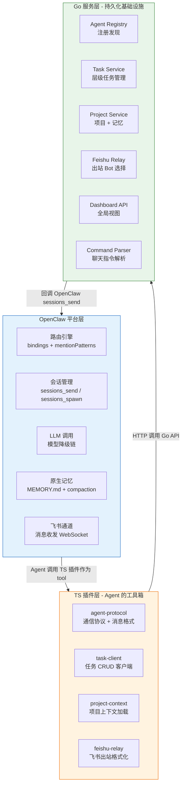

### 职责矩阵

| 能力 | OpenClaw | TS 插件 | Go 服务 |
|------|----------|---------|---------|
| LLM 推理 | **负责** | - | - |
| Agent 人格 / SOP | **负责** (md 文件) | - | - |
| 飞书消息收发 | **负责** (WebSocket) | 出站格式化 | Bot 选择逻辑 |
| Agent 间通信 | **负责** (sessions_send) | 协议封装 | - |
| Subagent 并发 | **负责** (sessions_spawn) | - | - |
| 任务持久化 | - | CRUD 客户端 | **负责** (PostgreSQL) |
| 项目管理 | - | 上下文加载 | **负责** (PostgreSQL) |
| Agent 注册发现 | - | 查询客户端 | **负责** (扫描 + 注册) |
| 长期记忆 | MEMORY.md (短期) | - | **负责** (向量存储) |
| 全局仪表盘 | - | - | **负责** (REST API) |
| 聊天指令解析 | - | - | **负责** (NLP 解析) |
| 异常上报 | - | 捕获 + 上报 | 聚合 + 通知 |
| 人工介入 | 接收消息 | 指令解析 | 任务状态更新 |

---

## 2. TS 插件详细设计

共 4 个插件，每个都是 OpenClaw 的 skill（Agent 可以 tool_call 调用）。

### 2.1 `@team/agent-protocol` — 通信协议

**定位**：定义 Agent 间通信的消息格式，封装 OpenClaw `sessions_send`，让 Agent 发消息时自动带上角色前缀、项目 ID、任务 ID。

```typescript
// 插件暴露给 Agent 的 tool

// tool: send_to_agent — 给另一个 Agent 发消息
interface SendToAgentParams {
  target_agent: string;     // "ARCHITECT" | "DEV_MANAGER" | ...
  project_id: string;       // 项目 ID，从上下文自动填充
  task_id?: string;         // 关联任务
  msg_type: "task_assign" | "task_report" | "help_request" | "info_share" | "review_request";
  content: string;          // 消息正文
  structured_data?: object; // 设计文档 / 代码引用等
  require_ack: boolean;     // 是否要求回复"收到"
}

// tool: broadcast — 向项目全员广播
interface BroadcastParams {
  project_id: string;
  msg_type: "announcement" | "progress_update" | "alert" | "milestone";
  content: string;
}

// tool: query_agents — 查询可用 Agent（调 Go Agent Registry）
interface QueryAgentsResult {
  agents: Array<{
    id: string;
    name: string;
    role: string;
    emoji: string;
    skills: string[];
    status: "idle" | "busy" | "offline";
    current_tasks: number;
  }>;
}
```

**工作流程**：

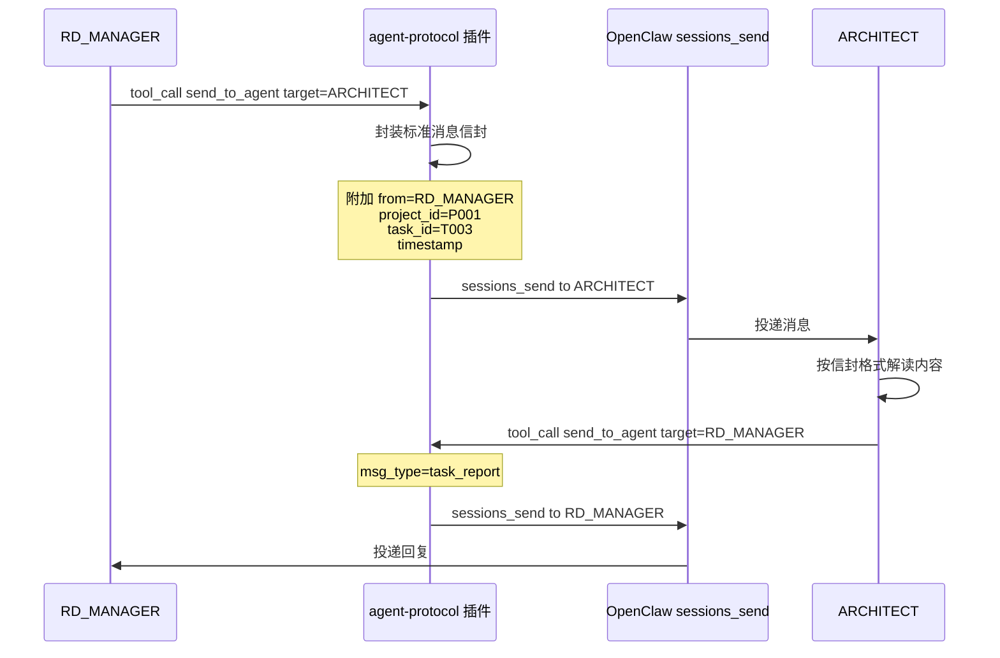

**消息信封格式**（所有 Agent 间通信统一）：

```json
{
  "envelope": {
    "id": "msg-uuid-001",
    "from": { "agent": "RD_MANAGER", "emoji": "🎯", "is_subagent": false, "parent": null },
    "to": { "agent": "ARCHITECT" },
    "project_id": "P001",
    "task_id": "T003",
    "msg_type": "task_assign",
    "timestamp": 1710000000000,
    "require_ack": true
  },
  "body": {
    "content": "请设计用户登录模块的架构方案",
    "structured_data": { "requirements": ["OAuth2", "JWT", "二维码登录"] },
    "deliverable": "设计文档 markdown + 架构 mermaid 图",
    "deadline": "2026-03-10T18:00:00+08:00"
  }
}
```

Agent 在 AGENTS.md 中约定：**收到信封格式的消息后，先解析 envelope 确定上下文，再处理 body**。Subagent 同理，`is_subagent=true` 时带上 `parent` 字段。

---

### 2.2 `@team/task-client` — 任务系统客户端

**定位**：Agent 的任务管理工具，封装 Go Task Service 的 HTTP API。

```typescript
// 暴露给 Agent 的 tool

// tool: create_task — 创建任务
interface CreateTaskParams {
  project_id: string;
  title: string;
  description: string;
  assignee: string;          // 目标 Agent ID
  priority: "P0" | "P1" | "P2" | "P3";
  parent_task_id?: string;   // 父任务（支持层级嵌套）
  deliverable: string;       // 交付物要求
  acceptance: string;        // 验收标准
  deadline?: string;
}
// 返回: { task_id: string, status: "created" }

// tool: update_task — 更新任务状态
interface UpdateTaskParams {
  task_id: string;
  status: "in_progress" | "blocked" | "review" | "completed";
  comment: string;           // 说明
  deliverable_url?: string;  // 交付物地址
  block_reason?: string;     // blocked 时必填
}

// tool: query_tasks — 查询任务
interface QueryTasksParams {
  project_id?: string;
  assignee?: string;         // 我的任务
  parent_task_id?: string;   // 查子任务
  status?: string;
  include_subtasks?: boolean; // 是否展开子任务树
}
// 返回: 任务树 (嵌套结构)

// tool: report_exception — 上报异常
interface ReportExceptionParams {
  task_id: string;
  error_type: "model_error" | "tool_error" | "timeout" | "quality_reject" | "dependency_blocked";
  description: string;
  severity: "critical" | "warning" | "info";
}
```

---

### 2.3 `@team/project-context` — 项目上下文加载

**定位**：Agent 开始处理某个项目的消息时，自动从 Go 服务加载该项目的上下文（项目信息、关键决策、团队约定），注入到当前对话中。

```typescript
// tool: load_project_context — 加载项目上下文
interface LoadProjectContextParams {
  project_id: string;
}
// 返回:
interface ProjectContext {
  project: {
    id: string;
    name: string;
    description: string;
    group_id: string;           // 飞书群 ID
    team: string[];             // 参与的 Agent
    current_iteration: string;  // 当前迭代
    key_decisions: string[];    // 关键决策（反失忆）
    tech_stack: string[];       // 技术栈
  };
  my_tasks: TaskSummary[];       // 当前 Agent 在此项目的任务
  recent_activities: Activity[]; // 最近动态
  pinned_memory: string[];       // 钉住的关键记忆
}

// tool: save_key_decision — 保存关键决策（反失忆）
interface SaveKeyDecisionParams {
  project_id: string;
  decision: string;
  reason: string;
  related_task_id?: string;
}

// tool: get_project_memory — 检索项目长期记忆
interface GetProjectMemoryParams {
  project_id: string;
  query: string;
  top_k: number;
}
```

---

### 2.4 `@team/feishu-relay` — 飞书出站格式化

**定位**：Agent 要发飞书消息时调用。不直接发消息，而是调 Go Feishu Relay 服务，由 Go 决定用哪个 Bot 发送。

```typescript
// tool: send_feishu_message — 发飞书消息
interface SendFeishuMessageParams {
  target: "current_group" | "dm" | string;  // 群/私聊/指定群 ID
  sender_identity: {
    agent: string;           // "ARCHITECT"
    emoji: string;           // "🏗️"
    is_subagent: boolean;
    subagent_name?: string;  // "API设计子任务"
  };
  content: string;
  format: "text" | "card" | "markdown";
  card_template?: string;    // 飞书卡片模板 ID
}
```

**Go 侧的 Bot 选择逻辑**（见第 3 节详述）由 Go 服务执行，插件只负责调接口。

---

### 插件与 Go 服务交互总览

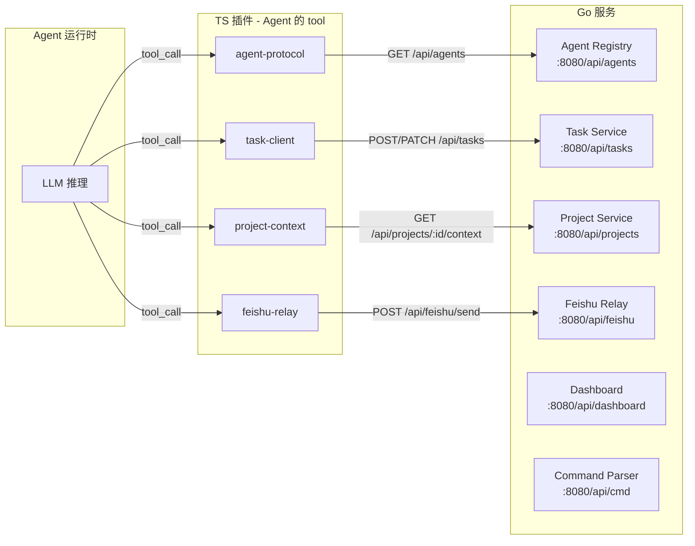

---

## 3. 飞书通信详细设计

### 3.1 完整消息流

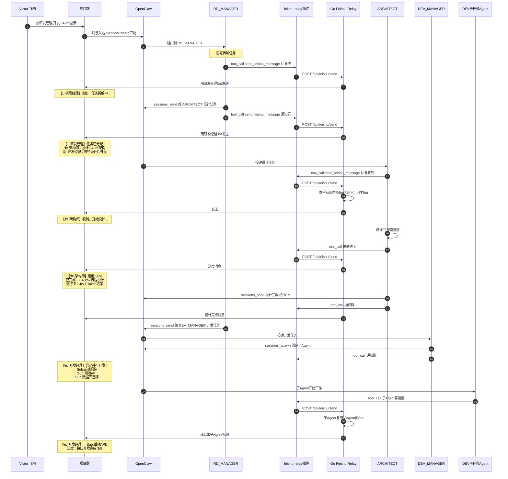

### 3.2 Bot 选择决策逻辑

Go Feishu Relay 收到发送请求后：

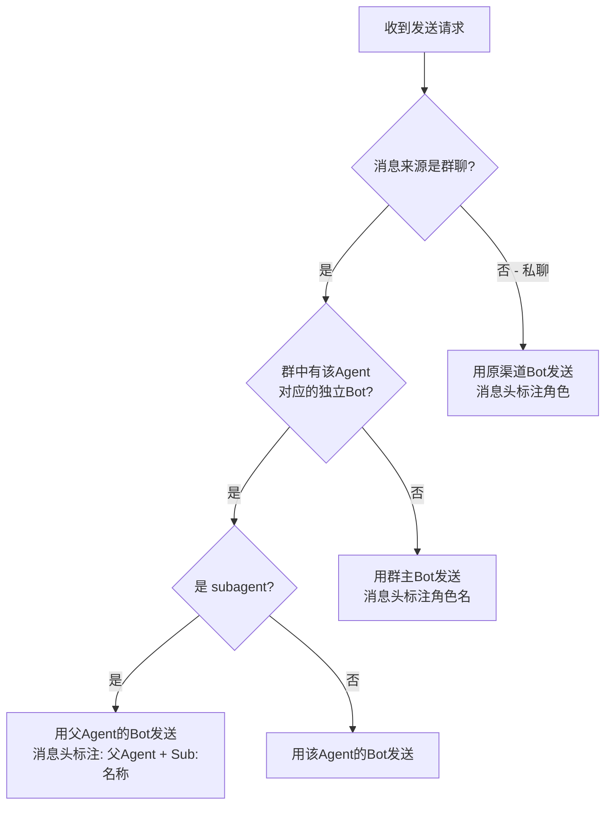

**消息头格式规范**：

| 场景 | Bot | 消息头 | 示例 |
|------|-----|--------|------|
| 群有对应Bot | Agent自己的Bot | `【emoji Agent名】` | `【🏗️ 架构师】` |
| 群无对应Bot | 群主Bot | `【emoji Agent名】` | `【🏗️ 架构师】` |
| Subagent | 父Agent的Bot | `【emoji 父Agent → Sub:子任务名】` | `【💻 开发经理 → Sub:后端API】` |
| 私聊 | 原渠道Bot | `【emoji Agent名】` | `【🎯 研发经理】` |

### 3.3 Go Feishu Relay 实现

```go
package feishu

type SendRequest struct {
    OriginChannel  string         `json:"origin_channel"`   // 来源渠道 ID（群/私聊）
    OriginIsGroup  bool           `json:"origin_is_group"`
    SenderIdentity SenderIdentity `json:"sender_identity"`
    Content        string         `json:"content"`
    Format         string         `json:"format"`           // text / card / markdown
}

type SenderIdentity struct {
    Agent        string `json:"agent"`          // "ARCHITECT"
    Emoji        string `json:"emoji"`          // "🏗️"
    IsSubagent   bool   `json:"is_subagent"`
    SubagentName string `json:"subagent_name"`  // "后端API"
    ParentAgent  string `json:"parent_agent"`   // "DEV_MANAGER"
}

type BotMapping struct {
    AgentID string `json:"agent_id"`
    BotID   string `json:"bot_id"`    // 飞书 Bot App ID
    GroupID string `json:"group_id"`  // 绑定的群 ID, 为空表示全局
}

func (s *RelayService) Send(req SendRequest) error {
    header := s.buildHeader(req.SenderIdentity)
    botID := s.selectBot(req)
    message := header + "\n" + req.Content
    return s.feishuClient.Send(botID, req.OriginChannel, message, req.Format)
}

func (s *RelayService) selectBot(req SendRequest) string {
    if !req.OriginIsGroup {
        return s.defaultBotID
    }
    agentToLookup := req.SenderIdentity.Agent
    if req.SenderIdentity.IsSubagent {
        agentToLookup = req.SenderIdentity.ParentAgent
    }
    if mapping, ok := s.botMappings[agentToLookup+":"+req.OriginChannel]; ok {
        return mapping.BotID
    }
    return s.defaultBotID
}

func (s *RelayService) buildHeader(id SenderIdentity) string {
    if id.IsSubagent {
        return fmt.Sprintf("【%s %s → Sub:%s】",
            id.Emoji, agentDisplayName(id.ParentAgent), id.SubagentName)
    }
    return fmt.Sprintf("【%s %s】", id.Emoji, agentDisplayName(id.Agent))
}
```

---

## 4. Go 服务详细设计（解决 3.1~3.9）

### 4.1 Agent 发现机制 (问题 3.1)

> Agent 怎么知道都有哪些 Agent 和 Subagent 可以调动？

**方案**：Go Agent Registry 服务，启动时扫描 OpenClaw workspace，运行时动态更新。

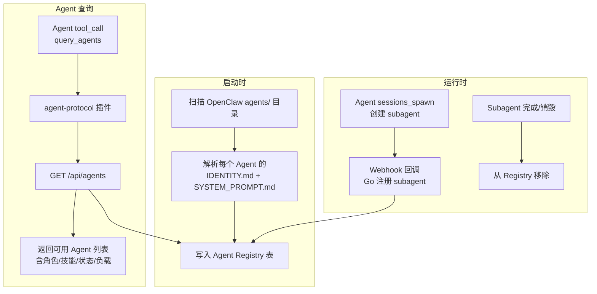

**Agent Registry 表结构**：

```go
type AgentRecord struct {
    ID           string   `json:"id"`             // "ARCHITECT"
    DisplayName  string   `json:"display_name"`   // "架构师"
    Emoji        string   `json:"emoji"`           // "🏗️"
    Role         string   `json:"role"`            // "方案设计 + 技术预研"
    Skills       []string `json:"skills"`          // ["opencode", "claude-code"]
    Status       string   `json:"status"`          // idle / busy / offline
    IsSubagent   bool     `json:"is_subagent"`
    ParentAgent  string   `json:"parent_agent"`    // subagent 的父 Agent
    SpawnedBy    string   `json:"spawned_by"`      // 谁创建的
    ProjectScope []string `json:"project_scope"`   // 关联项目（空=全局）
    CurrentLoad  int      `json:"current_load"`    // 当前处理的任务数
    RegisteredAt int64    `json:"registered_at"`
}
```

**Agent 获取方式**：
- **静态 Agent**（RD_MANAGER 等）：启动时扫描注册，永久存在
- **动态 Subagent**：sessions_spawn 后，通过 OpenClaw heartbeat 或 TS 插件主动注册到 Go；完成后注销
- **项目范围**：Agent 查询时传入 `project_id`，返回该项目可用的 Agent + 全局 Agent

---

### 4.2 层级任务系统 (问题 3.2)

> 任务的分派可能是层级叠加的，怎么管理？

**核心设计**：任务是一棵树。每个节点有 `parent_id`，支持无限嵌套。

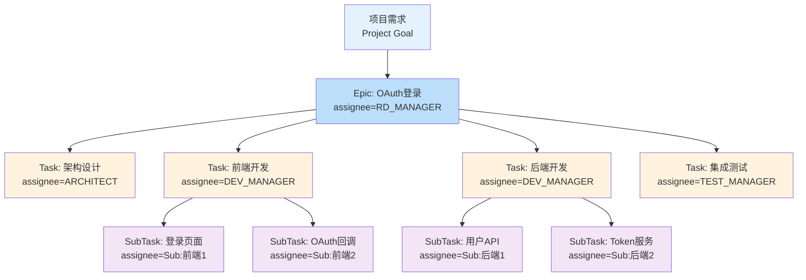

**任务数据模型**：

```go
type Task struct {
    ID            string     `json:"id" gorm:"primaryKey"`
    ProjectID     string     `json:"project_id" gorm:"index"`
    ParentID      *string    `json:"parent_id" gorm:"index"` // null = 顶级任务
    Level         int        `json:"level"`                   // 0=Epic, 1=Task, 2=SubTask, ...
    Path          string     `json:"path"`                    // "E001/T003/ST007" 物化路径
    Title         string     `json:"title"`
    Description   string     `json:"description"`
    Assignee      string     `json:"assignee" gorm:"index"`
    AssignedBy    string     `json:"assigned_by"`
    Status        TaskStatus `json:"status" gorm:"index"`
    Priority      string     `json:"priority"`
    Deliverable   string     `json:"deliverable"`
    Acceptance    string     `json:"acceptance"`
    Result        *string    `json:"result"`         // 完成时的交付物/结论
    BlockReason   *string    `json:"block_reason"`
    ErrorInfo     *string    `json:"error_info"`     // 异常信息
    Deadline      *time.Time `json:"deadline"`
    CompletedAt   *time.Time `json:"completed_at"`
    CreatedAt     time.Time  `json:"created_at"`
    UpdatedAt     time.Time  `json:"updated_at"`
}
```

**关键 API**：

```
POST   /api/tasks                      创建任务
PATCH  /api/tasks/:id                  更新状态/结果
GET    /api/tasks/:id                  获取单个任务（含子任务树）
GET    /api/tasks/:id/tree             获取完整子任务树
GET    /api/tasks?project_id=P001      按项目查询
GET    /api/tasks?assignee=ARCHITECT   按 Agent 查询
GET    /api/tasks?project_id=P001&status=blocked  查阻塞任务
GET    /api/tasks/:id/ancestors        获取所有上级任务（向上追溯）
POST   /api/tasks/:id/aggregate        汇总子任务结果到父任务
```

**状态传播规则**：
- 子任务全部 `completed` → 父任务自动变为 `review`
- 任一子任务 `blocked` → 父任务标记 `has_blocked_children`
- 任一子任务 `report_exception` → 向上冒泡通知 `assigned_by`

**Agent 怎么用**：Agent 通过 `task-client` 插件的 tool_call 操作任务。每个 Agent 处理消息时，先调 `query_tasks(assignee=me, project_id=当前项目)` 获取自己的任务列表做决策。协调者可调 `query_tasks(project_id=P001, include_subtasks=true)` 查看全局进度。

---

### 4.3 项目管理系统 (问题 3.3)

> 一个群一个项目，项目绑定群，通过项目管理长期记忆和迭代。

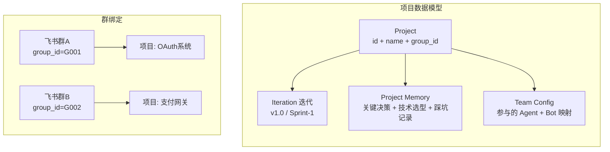

**Project 数据模型**：

```go
type Project struct {
    ID           string    `json:"id" gorm:"primaryKey"`     // "P001"
    Name         string    `json:"name"`                      // "OAuth系统"
    Description  string    `json:"description"`
    GroupID      string    `json:"group_id" gorm:"uniqueIndex"` // 飞书群 ID，1:1
    Status       string    `json:"status"`                    // active / paused / archived
    TeamAgents   []string  `json:"team_agents" gorm:"serializer:json"` // 参与的 Agent
    TechStack    []string  `json:"tech_stack" gorm:"serializer:json"`
    CreatedAt    time.Time `json:"created_at"`
    UpdatedAt    time.Time `json:"updated_at"`
}

type Iteration struct {
    ID        string    `json:"id"`
    ProjectID string    `json:"project_id" gorm:"index"`
    Name      string    `json:"name"`       // "Sprint-1" / "v1.0"
    Goal      string    `json:"goal"`
    Status    string    `json:"status"`     // planning / active / completed
    StartAt   time.Time `json:"start_at"`
    EndAt     time.Time `json:"end_at"`
}

type ProjectMemory struct {
    ID        string    `json:"id"`
    ProjectID string    `json:"project_id" gorm:"index"`
    Category  string    `json:"category"`  // decision / tech_choice / lesson / architecture
    Content   string    `json:"content"`
    CreatedBy string    `json:"created_by"` // Agent ID
    Pinned    bool      `json:"pinned"`     // 钉住=反失忆核心条目
    CreatedAt time.Time `json:"created_at"`
}
```

**关键 API**：

```
POST   /api/projects                         创建项目（关联群 ID）
GET    /api/projects/:id/context             获取项目上下文（任务+记忆+迭代）
GET    /api/projects/by-group/:group_id      通过群 ID 查项目
POST   /api/projects/:id/memory             添加项目记忆
GET    /api/projects/:id/memory?q=xxx        检索项目记忆
PATCH  /api/projects/:id/memory/:mid/pin    钉住/取消钉住
POST   /api/projects/:id/iterations          创建迭代
```

**工作流**：消息从飞书群进来 → OpenClaw 路由到 Agent → Agent 通过 `project-context` 插件调 `GET /api/projects/by-group/{群ID}` 获取项目 ID → 加载项目上下文 → 所有后续操作都关联这个 `project_id`。

---

### 4.4 多项目并发与消息隔离 (问题 3.4)

> 同一个团队 Agent 同时处理多个项目 + 私聊，怎么隔离？

**核心原理**：OpenClaw 的 `dmScope: per-channel-peer` 已经提供了会话级隔离。每个飞书群是一个独立的 channel，Agent 在不同 channel 中有独立的会话。关键是把 `project_id` 贯穿到所有操作中。

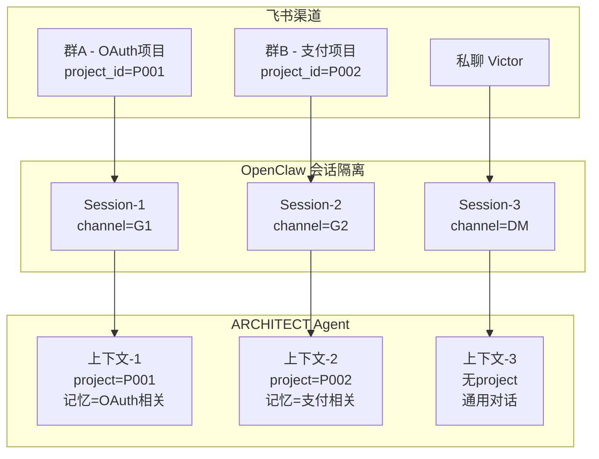

**隔离机制**：

| 层 | 隔离手段 | 说明 |
|----|---------|------|
| **OpenClaw** | `dmScope: per-channel-peer` | 每个群/私聊独立 session，对话历史不混 |
| **TS 插件** | 所有 API 调用带 `project_id` | 任务/记忆/上下文都按项目隔离 |
| **Go 服务** | 数据库 `project_id` 索引 | 查询时只返回当前项目的数据 |
| **Agent SOP** | AGENTS.md 约定 | 处理消息前先 `load_project_context` 确定项目 |

**Agent 处理能力提升**：
- OpenClaw 原生支持并发 session，不同群的消息异步处理互不阻塞
- Agent 的 LLM 调用是独立的，群 A 和群 B 的请求各自走各自的 session
- subagent 通过 `sessions_spawn` 并行处理，同一项目内任务也并行
- Go 服务是无状态 HTTP API，天然支持并发

**私聊场景**：私聊无 project_id，Agent 以通用模式工作。用户可以在私聊中说"查看 OAuth 项目的进度"，Agent 解析出 project_id 后调 Go API 查询。

---

### 4.5 异常上报机制 (问题 3.5)

> Agent/Subagent 异常了需要反馈，让上层协调者知道。

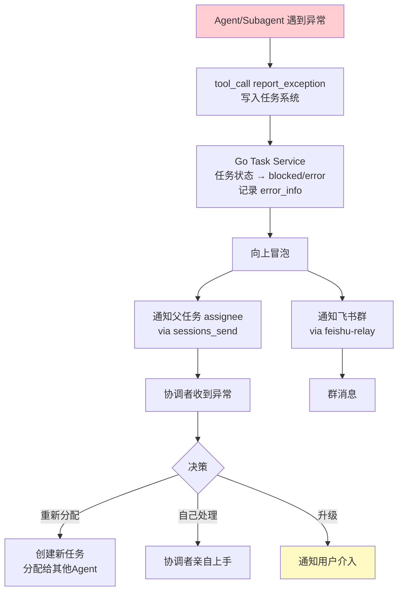

**异常处理规则**（在 AGENTS.md 中约定）：

```
异常分级：
- critical: 模型连续 3 次失败 / 工具不可用 / 死循环 → 立即停止，通知协调者 + 飞书群
- warning: 单次失败 / 质量不达标 / 依赖阻塞 → 重试 1 次，仍失败则上报
- info: 进度延迟 / 非关键问题 → 记录日志，定期汇总

上报格式：
【⚠️ 异常上报】
来源: 【💻 开发经理 → Sub:后端API】
任务: T003-ST002 Token服务开发
级别: warning
原因: opencode 执行超时，已重试 1 次仍失败
建议: 换用 claude-code 重试 或 人工检查代码环境
```

---

### 4.6 人工介入机制 (问题 3.6)

> 我在群聊中发现偏差，怎么随时接入调整方向？

**方案**：用户在群里发消息，如果包含指令关键词（或直接 @Agent），Go Command Parser 识别出是**方向调整指令**，更新任务状态并通知相关 Agent。

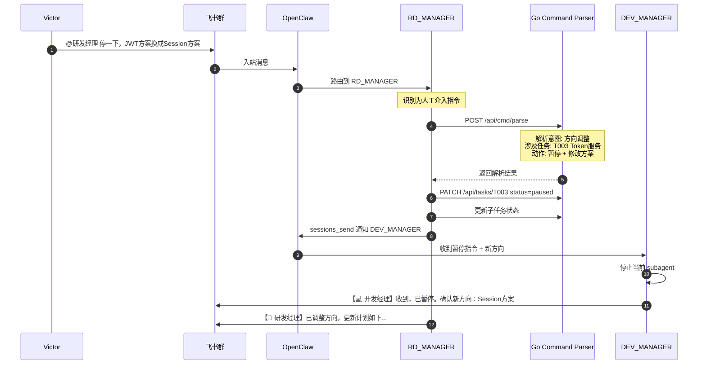

**用户介入的几种方式**：

| 方式 | 触发 | 效果 |
|------|------|------|
| `@Agent + 修改指令` | "@架构师 方案A不行换方案B" | 直接通知该 Agent 调整 |
| `@协调者 + 全局调整` | "@研发经理 整体暂停" | 协调者暂停所有子任务，通知全员 |
| `/pause` 命令 | 群里发 `/pause T003` | Go 直接暂停任务，通知 assignee |
| `/redirect` 命令 | 群里发 `/redirect T003 ARCHITECT` | Go 重新分配任务 |
| 自然对话 | "登录模块我觉得应该加二维码" | Agent 判断是否需要调整，主动确认 |

---

### 4.7 反失忆机制 (问题 3.7)

> 长时间项目因压缩导致的失忆问题。

**三层防线**：

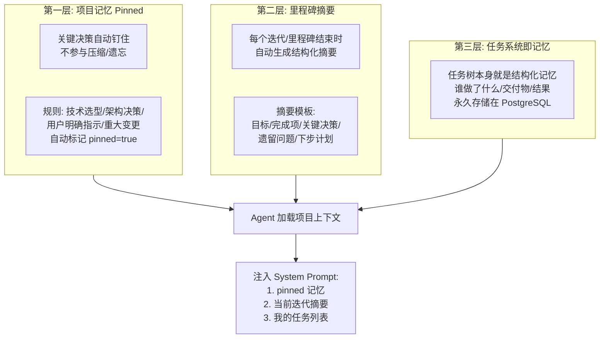

**具体实现**：

1. **Pinned Memory**：Agent 在 AGENTS.md 中被约定——做出重大决策后必须调用 `save_key_decision` 工具。Go 服务标记为 `pinned=true`，永不删除。下次 Agent 加载项目上下文时，pinned 记忆始终包含在内。

2. **里程碑摘要**：迭代结束时，RD_MANAGER 自动汇总该迭代的任务、决策、问题，生成结构化摘要存入 ProjectMemory。下个迭代开始时加载最近 N 个摘要。

3. **任务系统 = 结构化记忆**：任务树及其结果永久存在 PostgreSQL 中。Agent 随时可查。即使 OpenClaw 压缩了对话历史，任务数据仍可检索。

4. **project-context 插件的 context 加载策略**：

```
加载优先级:
1. pinned 记忆 (全部加载，不截断)
2. 当前迭代摘要
3. 我的进行中任务 + 父任务链
4. 最近 5 条团队动态
5. 最近 3 个相关 key_decision

总 token 预算: ~2000 tokens
超出时从第 5 项开始裁剪
```

---

### 4.8 全局仪表盘 (问题 3.8)

> 暴露全局能力，让我看到所有项目和任务的情况。

**两种入口**：

**入口 1: REST API（供 Web UI 或外部工具）**

```
GET  /api/dashboard/overview
返回: {
  projects: [
    { id, name, status, group_name, task_stats: {total, in_progress, blocked, completed} }
  ],
  agents: [
    { id, name, status, current_load, active_projects: [] }
  ],
  alerts: [
    { level, message, task_id, agent_id, timestamp }
  ]
}

GET  /api/dashboard/project/:id
返回: 项目详情 + 任务树 + 进度统计 + 风险项

GET  /api/dashboard/agent/:id
返回: Agent 状态 + 跨项目任务列表 + 历史表现
```

**入口 2: 飞书聊天指令（问题 3.9 联动）**

用户在任何渠道（私聊或群里）发送指令，Agent 解析后调 Dashboard API 返回格式化结果。

---

### 4.9 聊天指令系统 (问题 3.9)

> 只需聊天，就能指挥他们创建项目、任务、更新信息。

**设计**：不做硬编码命令解析，让 RD_MANAGER Agent 自身理解自然语言并调用 task-client / project-context 插件。

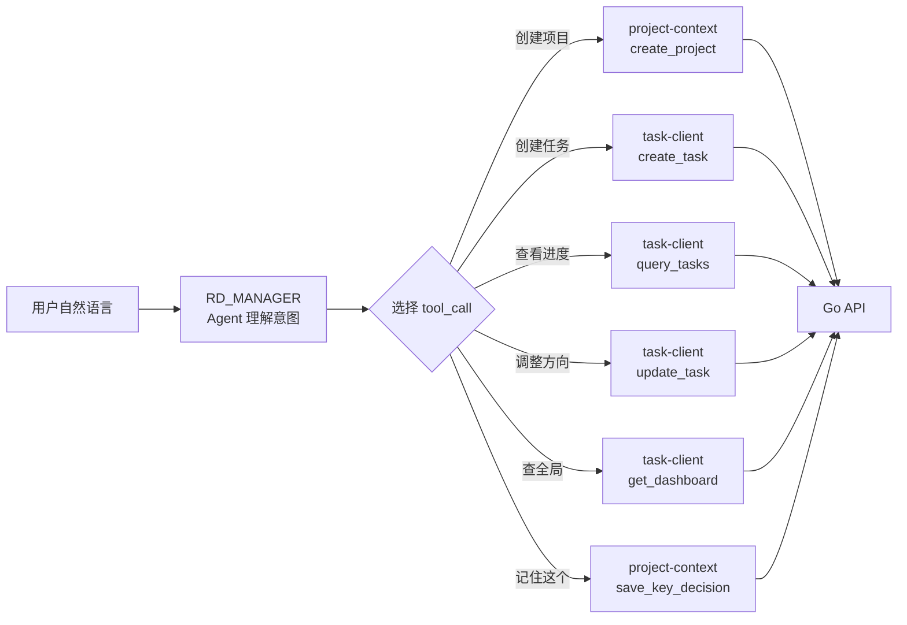

**自然语言示例**：

| 用户说 | Agent 理解 | 执行的 tool_call |
|--------|-----------|-----------------|
| "帮我创建一个 OAuth 项目" | 创建项目 | `create_project(name="OAuth系统", group_id=当前群)` |
| "把登录模块拆成前端后端两个任务" | 创建子任务 | `create_task x2` + `update_task(parent)` |
| "架构师的设计任务怎么样了" | 查询任务 | `query_tasks(assignee=ARCHITECT, project=当前)` |
| "后端 API 方案改用 gRPC" | 方向调整 | `update_task(task_id, comment="方案变更: REST→gRPC")` + `save_key_decision` + `send_to_agent(DEV_MANAGER)` |
| "所有项目情况汇总" | 全局视图 | `get_dashboard()` |
| "暂停支付项目，先搞 OAuth" | 项目优先级 | `update_project(P002, status=paused)` + 通知团队 |
| "记住：我们用 PostgreSQL 不用 MySQL" | 保存决策 | `save_key_decision(decision="数据库选型: PostgreSQL")` |

**关键**：不需要 Go 做 NLP 解析。RD_MANAGER 本身就是 LLM，天然理解自然语言。Go 只提供结构化 API，Agent 负责语义理解和 tool 选择。

---

## 5. 完整数据模型

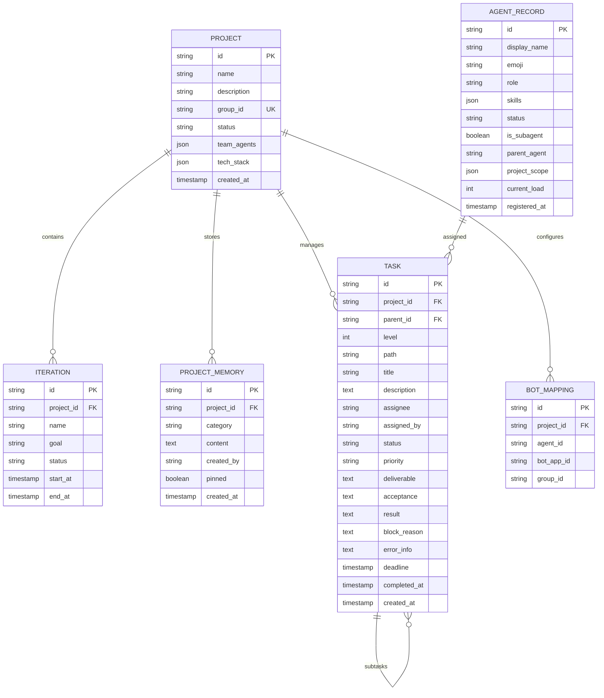

---

## 6. Go 服务架构

```
go-backend/
├── cmd/
│   └── server/main.go
├── internal/
│   ├── agent/                   # Agent Registry
│   │   ├── registry.go          # 扫描 + 注册 + 查询
│   │   ├── scanner.go           # 扫描 OpenClaw workspace
│   │   └── handler.go
│   ├── task/                    # Task Service
│   │   ├── service.go           # CRUD + 状态传播 + 汇总
│   │   ├── tree.go              # 任务树操作
│   │   └── handler.go
│   ├── project/                 # Project Service
│   │   ├── service.go           # 项目 + 迭代 + 记忆
│   │   ├── context.go           # 上下文加载（反失忆）
│   │   └── handler.go
│   ├── feishu/                  # Feishu Relay
│   │   ├── relay.go             # Bot 选择 + 消息发送
│   │   ├── bot_selector.go      # Bot 选择逻辑
│   │   └── handler.go
│   ├── dashboard/               # Dashboard
│   │   ├── service.go           # 聚合查询
│   │   └── handler.go
│   └── common/
│       ├── config.go
│       ├── database.go          # PostgreSQL + GORM
│       └── middleware.go
├── go.mod
└── Makefile
```

**技术选型**：

| 组件 | 选择 | 理由 |
|------|------|------|
| Web 框架 | Gin | 轻量高性能 |
| ORM | GORM | Go 生态主流 |
| 数据库 | PostgreSQL | JSON 支持好、稳定 |
| 缓存 | 暂不需要 | 数据量小，直接查 DB |
| 向量数据库 | 暂不需要 | 第一版用 pinned memory + 任务系统解决失忆 |

---

## 7. Agent AGENTS.md 中需要新增的约定

每个 Agent 的 AGENTS.md 需要新增以下协议，让 LLM 知道怎么用这些工具：

```markdown
## 协作协议

### 收到消息时的处理流程

1. 解析消息信封（envelope），提取 project_id、task_id、msg_type
2. 调用 `load_project_context(project_id)` 加载项目上下文
3. 调用 `query_tasks(assignee=我, project_id)` 获取我的任务
4. 结合上下文理解消息，执行操作
5. 操作完成后:
   - 调 `update_task` 更新任务状态
   - 调 `send_to_agent` 回复发送者
   - 调 `send_feishu_message` 推送群消息
   - 重大决策调 `save_key_decision` 保存

### 异常处理

- 工具调用失败: 重试 1 次，仍失败调 `report_exception`
- 模型降级后仍失败: 调 `report_exception(severity=critical)`
- 发现质量问题: 调 `update_task(status=rejected)` + 通知 assignee

### 消息格式

所有飞书输出必须以角色前缀开头: 【emoji 角色名】
Subagent 输出: 【emoji 父角色 → Sub:子任务名】
```

---

## 8. 实施路线图

### Phase 1: 核心骨架（2 周）

```
目标: Agent 能通过飞书群协作，消息带角色前缀

- [ ] Go 服务: Agent Registry（扫描 + 注册 API）
- [ ] Go 服务: Feishu Relay（Bot 选择 + 消息发送）
- [ ] TS 插件: agent-protocol（send_to_agent + broadcast）
- [ ] TS 插件: feishu-relay（send_feishu_message）
- [ ] 验证: 群 @研发经理 → 拆解 → 通知架构师 → 架构师回复群
```

### Phase 2: 任务系统（2 周）

```
目标: 层级任务管理 + 状态追踪

- [ ] Go 服务: Task Service（CRUD + 树操作 + 状态传播）
- [ ] Go 服务: Project Service（项目 + 迭代 + 群绑定）
- [ ] TS 插件: task-client（create/update/query tool）
- [ ] TS 插件: project-context（load_project_context tool）
- [ ] 更新 AGENTS.md: 新增协作协议约定
- [ ] 验证: 完整的任务拆解 → 分配 → 执行 → 汇总流程
```

### Phase 3: 反失忆 + 异常处理（1 周）

```
目标: 长期项目不失忆，异常有反馈

- [ ] Go 服务: ProjectMemory（pinned + 里程碑摘要）
- [ ] Go 服务: 异常冒泡 + 通知逻辑
- [ ] TS 插件: project-context 增加 save_key_decision
- [ ] TS 插件: task-client 增加 report_exception
- [ ] 验证: 模拟长对话后仍记得关键决策
```

### Phase 4: 仪表盘 + 聊天指令（1 周）

```
目标: 自然语言管理一切

- [ ] Go 服务: Dashboard API
- [ ] RD_MANAGER AGENTS.md: 补充聊天指令处理 SOP
- [ ] 验证: "所有项目情况汇总" → 格式化返回
- [ ] 验证: "创建支付项目" → 自动建项目 + 绑群
```
