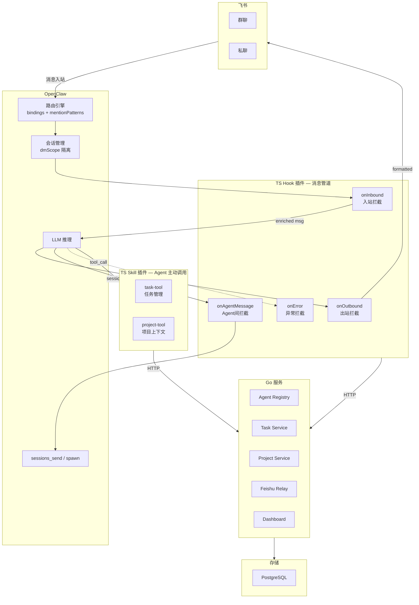
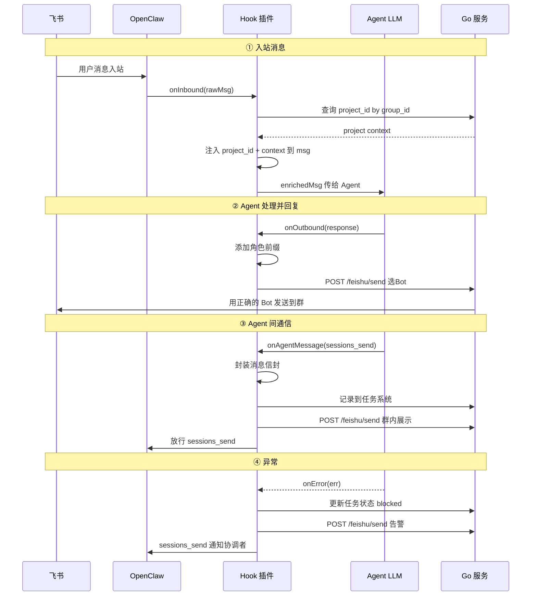
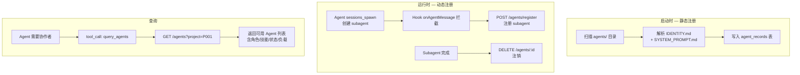
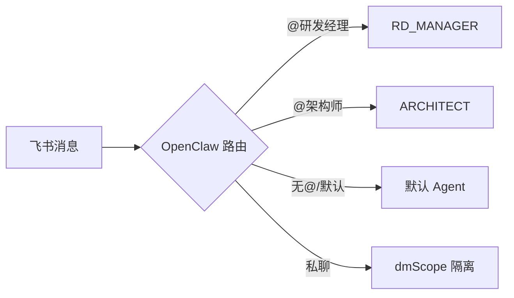
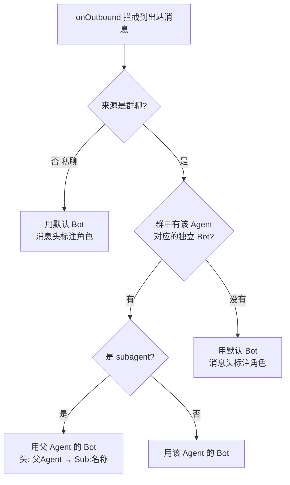
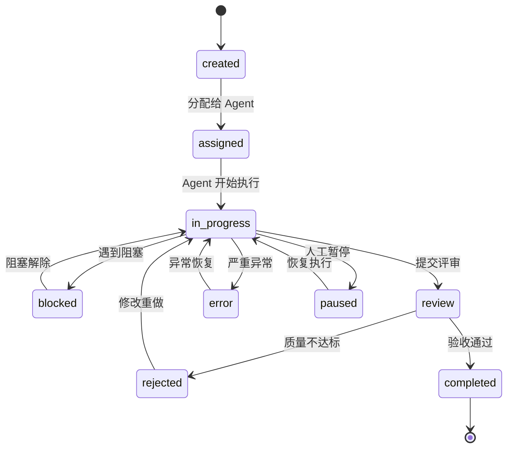
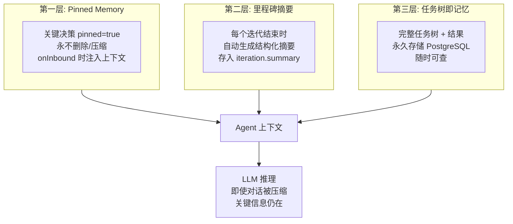
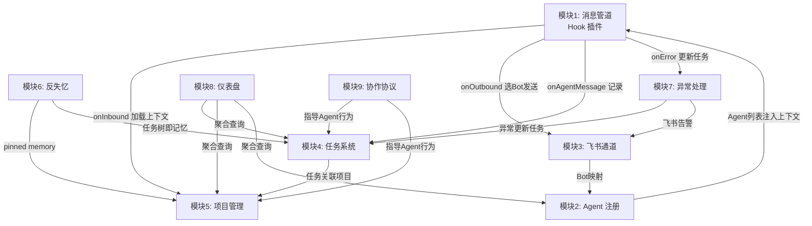

# 基于 OpenClaw 的多 Agent 协作系统设计方案 V3

> **V3 核心变更**：
> - 消息处理改为 **Hook 拦截模式**，在接口层做功能扩展，Agent 无感知
> - 全文按 **功能模块** 组织，每个模块独立可开发
> - 去掉 V2 的散乱问题导向结构

---

## 0. 架构总览

系统由 3 层组成，**Hook 插件**是核心枢纽——拦截所有消息流，在接口层完成格式化、路由、持久化等功能扩展，Agent 本身只关注业务逻辑。



### 层级职责

| 层 | 做什么 | 不做什么 |
|----|--------|---------|
| **OpenClaw** | LLM 推理、Agent 人格(md)、飞书 WebSocket、会话隔离、sessions_send/spawn | 任务持久化、消息格式化、Bot 选择 |
| **TS Hook 插件** | 拦截所有消息流，透明地做：入站 enrichment、出站格式化、Agent 间通信记录、异常捕获 | 业务逻辑、LLM 推理 |
| **TS Skill 插件** | Agent 主动 tool_call 调用：创建任务、查询项目、保存决策 | 消息路由、格式化 |
| **Go 服务** | 持久化：任务树、项目、Agent 注册、飞书 Bot 选择、Dashboard | LLM、消息路由 |

---

## 模块 1：消息管道 (Message Pipeline)

> **核心模块**。所有消息（入站/出站/Agent 间/异常）都经过 Hook 管道，在接口层做功能扩展。Agent 不需要关心格式化、Bot 选择、任务记录等——Hook 透明处理。

### 1.1 Hook 生命周期



### 1.2 四个 Hook 点

#### `onInbound` — 入站拦截

消息从飞书进入、到达 Agent 之前。

```typescript
interface InboundContext {
  channel: { type: "group" | "dm"; id: string };
  sender: { userId: string; name: string };
  raw: { text: string; mentions: string[]; messageId: string };
}

async function onInbound(ctx: InboundContext): Promise<EnrichedMessage> {
  // 1. 通过 group_id 查找绑定的项目
  const project = await goApi.getProjectByGroup(ctx.channel.id);

  // 2. 加载项目上下文 (关键决策 + 当前迭代 + Agent任务)
  const context = project
    ? await goApi.getProjectContext(project.id)
    : null;

  // 3. 检测是否是指令 (/pause /status /help)
  const command = parseCommand(ctx.raw.text);

  // 4. 注入到消息中，Agent 可以在 prompt 中看到
  return {
    ...ctx,
    project,
    projectContext: context,
    command,
    enrichedPrompt: buildContextPrompt(context),
  };
}
```

**Agent 感知**：Agent 收到的消息自动包含项目上下文，不需要自己调 tool 加载。

#### `onOutbound` — 出站拦截

Agent 回复消息、发送到飞书之前。

```typescript
interface OutboundContext {
  agent: { id: string; emoji: string; displayName: string };
  isSubagent: boolean;
  parentAgent?: { id: string; emoji: string; displayName: string };
  subagentName?: string;
  channel: { type: "group" | "dm"; id: string };
  response: string;
  projectId?: string;
  taskId?: string;
}

async function onOutbound(ctx: OutboundContext): Promise<FormattedMessage> {
  // 1. 构建角色前缀
  const header = ctx.isSubagent
    ? `【${ctx.parentAgent.emoji} ${ctx.parentAgent.displayName} → Sub:${ctx.subagentName}】`
    : `【${ctx.agent.emoji} ${ctx.agent.displayName}】`;

  // 2. 调 Go 选择 Bot
  const botId = await goApi.selectBot({
    agentId: ctx.agent.id,
    channelId: ctx.channel.id,
    isSubagent: ctx.isSubagent,
    parentAgentId: ctx.parentAgent?.id,
  });

  // 3. 发送
  return {
    botId,
    channelId: ctx.channel.id,
    content: header + "\n" + ctx.response,
  };
}
```

#### `onAgentMessage` — Agent 间通信拦截

Agent A 通过 sessions_send 给 Agent B 发消息时。

```typescript
interface AgentMessageContext {
  from: { id: string; emoji: string; isSubagent: boolean; parentId?: string };
  to: { id: string };
  content: string;
  projectId?: string;
  taskId?: string;
}

async function onAgentMessage(ctx: AgentMessageContext): Promise<void> {
  // 1. 封装标准信封
  const envelope: MessageEnvelope = {
    id: uuid(),
    from: ctx.from,
    to: ctx.to,
    projectId: ctx.projectId,
    taskId: ctx.taskId,
    timestamp: Date.now(),
  };

  // 2. 记录到 Go（可选：关联任务）
  if (ctx.taskId) {
    await goApi.addTaskActivity(ctx.taskId, {
      type: "agent_message",
      from: ctx.from.id,
      to: ctx.to.id,
      summary: ctx.content.substring(0, 200),
    });
  }

  // 3. 转发到飞书群展示（让用户看到 Agent 间的协作）
  if (ctx.projectId) {
    const project = await goApi.getProject(ctx.projectId);
    if (project?.groupId) {
      await goApi.feishuSend({
        agentId: ctx.from.id,
        channelId: project.groupId,
        content: `→ @${ctx.to.id}: ${ctx.content.substring(0, 500)}`,
        isSubagent: ctx.from.isSubagent,
        parentAgentId: ctx.from.parentId,
      });
    }
  }

  // 4. 在信封上附加 envelope，放行原始 sessions_send
  // OpenClaw 将 envelope + content 一起投递给目标 Agent
}
```

#### `onError` — 异常拦截

Agent 运行中发生异常时。

```typescript
interface ErrorContext {
  agent: { id: string; emoji: string };
  error: { type: string; message: string; stack?: string };
  taskId?: string;
  projectId?: string;
  severity: "critical" | "warning" | "info";
}

async function onError(ctx: ErrorContext): Promise<void> {
  // 1. 更新任务状态
  if (ctx.taskId) {
    await goApi.updateTask(ctx.taskId, {
      status: ctx.severity === "critical" ? "error" : "blocked",
      errorInfo: ctx.error.message,
    });
  }

  // 2. 向上冒泡：通知父任务的 assignee
  if (ctx.taskId) {
    const task = await goApi.getTask(ctx.taskId);
    if (task.parentId) {
      const parent = await goApi.getTask(task.parentId);
      // 通过 OpenClaw sessions_send 通知协调者
      await openclaw.sessionsSend(parent.assignee, {
        type: "error_report",
        from: ctx.agent.id,
        taskId: ctx.taskId,
        error: ctx.error.message,
        severity: ctx.severity,
      });
    }
  }

  // 3. 飞书群告警
  if (ctx.projectId && ctx.severity !== "info") {
    const project = await goApi.getProject(ctx.projectId);
    if (project?.groupId) {
      await goApi.feishuSend({
        agentId: ctx.agent.id,
        channelId: project.groupId,
        content: `⚠️ 异常 [${ctx.severity}]\n任务: ${ctx.taskId}\n原因: ${ctx.error.message}`,
      });
    }
  }
}
```

### 1.3 消息信封格式

所有 Agent 间通信经 Hook 自动附加信封，接收方 Agent 无需解析——Hook 在 onInbound 时已将信封信息注入上下文。

```typescript
interface MessageEnvelope {
  id: string;
  from: {
    agent: string;       // "ARCHITECT"
    emoji: string;       // "🏗️"
    displayName: string; // "架构师"
    isSubagent: boolean;
    parentAgent?: string;
    subagentName?: string;
  };
  to: {
    agent: string;
  };
  projectId: string;
  taskId?: string;
  timestamp: number;
}
```

---

## 模块 2：Agent 注册与发现 (Agent Registry)

> Agent 和 Subagent 的注册、发现、状态跟踪。解决"Agent 怎么知道能调动谁"。

### 2.1 数据模型

```go
type AgentRecord struct {
    ID           string   `json:"id" gorm:"primaryKey"`       // "ARCHITECT"
    DisplayName  string   `json:"display_name"`                // "架构师"
    Emoji        string   `json:"emoji"`                       // "🏗️"
    Role         string   `json:"role"`                        // "方案设计 + 技术预研"
    Skills       []string `json:"skills" gorm:"serializer:json"`
    Status       string   `json:"status"`                      // idle / busy / offline
    IsSubagent   bool     `json:"is_subagent"`
    ParentAgent  string   `json:"parent_agent"`
    SpawnedBy    string   `json:"spawned_by"`
    ProjectScope []string `json:"project_scope" gorm:"serializer:json"`
    CurrentLoad  int      `json:"current_load"`
    RegisteredAt int64    `json:"registered_at"`
    LastActiveAt int64    `json:"last_active_at"`
}
```

### 2.2 注册流程



### 2.3 API

```
GET    /api/agents                           全量查询
GET    /api/agents?project_id=P001           按项目筛选
GET    /api/agents?status=idle               按状态筛选
GET    /api/agents/:id                       单个详情
POST   /api/agents/register                  动态注册（subagent）
DELETE /api/agents/:id                       注销（subagent 完成）
PATCH  /api/agents/:id/status                更新状态
PATCH  /api/agents/:id/load                  更新负载
```

### 2.4 Hook 联动

- `onInbound`：查询当前项目的 Agent 列表，注入到 Agent 上下文，让 Agent 知道有谁可以调动
- `onAgentMessage`：检测到 sessions_spawn 创建 subagent 时，自动调 `/agents/register`
- `onError`：更新 Agent 状态为 `error`

---

## 模块 3：飞书通道 (Feishu Channel)

> 处理飞书消息的入站路由和出站 Bot 选择。入站靠 OpenClaw binding，出站靠 Hook + Go Relay。

### 3.1 入站流程



入站路由完全由 OpenClaw `bindings` + `mentionPatterns` 处理，不需要自己实现。

### 3.2 出站 Bot 选择



### 3.3 消息头格式

| 场景 | Bot 选择 | 消息头格式 | 示例 |
|------|---------|-----------|------|
| 群有对应 Bot | Agent Bot | `【emoji 角色名】` | `【🏗️ 架构师】` |
| 群无对应 Bot | 默认 Bot | `【emoji 角色名】` | `【🏗️ 架构师】` |
| Subagent | 父 Agent Bot | `【emoji 父角色 → Sub:名称】` | `【💻 开发经理 → Sub:后端API】` |
| 私聊 | 默认 Bot | `【emoji 角色名】` | `【🎯 研发经理】` |

### 3.4 数据模型

```go
type BotMapping struct {
    ID       string `json:"id" gorm:"primaryKey"`
    AgentID  string `json:"agent_id" gorm:"index"`
    BotAppID string `json:"bot_app_id"`   // 飞书 Bot App ID
    GroupID  string `json:"group_id"`     // 绑定的群, 空=全局
}
```

### 3.5 API

```
GET    /api/feishu/bot-mapping?agent=ARCHITECT&group=G001   查询 Bot
POST   /api/feishu/bot-mapping                              配置映射
POST   /api/feishu/send                                     发送消息（Hook 调用）
```

### 3.6 Go 实现

```go
type FeishuSendRequest struct {
    AgentID       string `json:"agent_id"`
    ChannelID     string `json:"channel_id"`      // 目标群/私聊 ID
    Content       string `json:"content"`
    IsSubagent    bool   `json:"is_subagent"`
    ParentAgentID string `json:"parent_agent_id"`
    SubagentName  string `json:"subagent_name"`
    Format        string `json:"format"`           // text / markdown / card
}

func (s *FeishuService) Send(req FeishuSendRequest) error {
    header := s.buildHeader(req)
    botID := s.selectBot(req)
    return s.feishuClient.SendMessage(botID, req.ChannelID, header+"\n"+req.Content)
}

func (s *FeishuService) selectBot(req FeishuSendRequest) string {
    agentToLookup := req.AgentID
    if req.IsSubagent {
        agentToLookup = req.ParentAgentID
    }
    if m, ok := s.findMapping(agentToLookup, req.ChannelID); ok {
        return m.BotAppID
    }
    return s.defaultBotID
}

func (s *FeishuService) buildHeader(req FeishuSendRequest) string {
    agent := s.registry.Get(req.AgentID)
    if req.IsSubagent {
        parent := s.registry.Get(req.ParentAgentID)
        return fmt.Sprintf("【%s %s → Sub:%s】", parent.Emoji, parent.DisplayName, req.SubagentName)
    }
    return fmt.Sprintf("【%s %s】", agent.Emoji, agent.DisplayName)
}
```

---

## 模块 4：任务系统 (Task System)

> 层级任务树，支持无限嵌套。Agent 通过 tool_call 操作，Hook 监听状态变更做联动。

### 4.1 任务树结构

```
项目目标 (Project Goal)
├── Epic: 用户登录 (assignee=RD_MANAGER)
│   ├── Task: 架构设计 (assignee=ARCHITECT)
│   ├── Task: 前端开发 (assignee=DEV_MANAGER)
│   │   ├── SubTask: 登录页 (assignee=Sub:前端1)
│   │   └── SubTask: OAuth回调 (assignee=Sub:前端2)
│   ├── Task: 后端开发 (assignee=DEV_MANAGER)
│   │   ├── SubTask: 用户API (assignee=Sub:后端1)
│   │   └── SubTask: Token服务 (assignee=Sub:后端2)
│   ├── Task: 代码审计 (assignee=CODE_AUDITOR)
│   └── Task: 集成测试 (assignee=TEST_MANAGER)
```

### 4.2 数据模型

```go
type Task struct {
    ID           string     `json:"id" gorm:"primaryKey"`
    ProjectID    string     `json:"project_id" gorm:"index"`
    ParentID     *string    `json:"parent_id" gorm:"index"`     // null=顶级
    Path         string     `json:"path" gorm:"index"`          // "E001/T003/ST007" 物化路径
    Level        int        `json:"level"`                      // 0=Epic 1=Task 2=SubTask
    Title        string     `json:"title"`
    Description  string     `json:"description" gorm:"type:text"`
    Assignee     string     `json:"assignee" gorm:"index"`
    AssignedBy   string     `json:"assigned_by"`
    Status       string     `json:"status" gorm:"index"`        // 见状态机
    Priority     string     `json:"priority"`                   // P0/P1/P2/P3
    Deliverable  string     `json:"deliverable" gorm:"type:text"`
    Acceptance   string     `json:"acceptance" gorm:"type:text"`
    Result       *string    `json:"result" gorm:"type:text"`
    BlockReason  *string    `json:"block_reason"`
    ErrorInfo    *string    `json:"error_info"`
    Deadline     *time.Time `json:"deadline"`
    CompletedAt  *time.Time `json:"completed_at"`
    CreatedAt    time.Time  `json:"created_at"`
    UpdatedAt    time.Time  `json:"updated_at"`
}
```

### 4.3 状态机



### 4.4 状态传播规则

```go
func (s *TaskService) UpdateStatus(id string, newStatus string) error {
    task := s.getTask(id)
    s.db.Update(task, newStatus)

    switch {
    // 子任务全部完成 → 父任务自动进入 review
    case newStatus == "completed":
        if allSiblingsCompleted(task.ParentID) {
            s.UpdateStatus(*task.ParentID, "review")
        }

    // 任一子任务 blocked/error → 通知父任务 assignee
    case newStatus == "blocked" || newStatus == "error":
        if task.ParentID != nil {
            parent := s.getTask(*task.ParentID)
            s.notifyAgent(parent.Assignee, TaskAlert{
                Type:    "child_" + newStatus,
                TaskID:  id,
                Message: task.BlockReason or task.ErrorInfo,
            })
        }

    // 人工暂停 → 级联暂停所有子任务
    case newStatus == "paused":
        for _, child := range s.getChildren(id) {
            if child.Status == "in_progress" || child.Status == "assigned" {
                s.UpdateStatus(child.ID, "paused")
            }
        }
    }
    return nil
}
```

### 4.5 Agent Tool 接口

```typescript
// Skill 插件 @team/task-tool 暴露的 tool

// create_task — Agent 创建任务
{
  name: "create_task",
  params: {
    project_id: string,
    title: string,
    description: string,
    assignee: string,
    priority: "P0" | "P1" | "P2" | "P3",
    parent_task_id?: string,
    deliverable: string,
    acceptance: string,
    deadline?: string
  },
  returns: { task_id: string }
}

// update_task — 更新任务
{
  name: "update_task",
  params: {
    task_id: string,
    status?: string,
    result?: string,
    comment?: string,
    block_reason?: string
  }
}

// query_tasks — 查询任务
{
  name: "query_tasks",
  params: {
    project_id?: string,
    assignee?: string,
    status?: string,
    parent_task_id?: string,
    include_subtree?: boolean
  },
  returns: { tasks: Task[] }  // 树形结构
}
```

### 4.6 API

```
POST   /api/tasks                        创建
PATCH  /api/tasks/:id                    更新（触发状态传播）
GET    /api/tasks/:id                    单个（含直接子任务）
GET    /api/tasks/:id/tree               完整子树
GET    /api/tasks/:id/ancestors          向上追溯
GET    /api/tasks?project_id=xxx         按项目
GET    /api/tasks?assignee=xxx           按 Agent
GET    /api/tasks?status=blocked         按状态
POST   /api/tasks/:id/activities         添加活动记录
```

---

## 模块 5：项目管理 (Project Management)

> 一个飞书群绑定一个项目。项目管理长期记忆、迭代、团队配置。

### 5.1 数据模型

```go
type Project struct {
    ID          string   `json:"id" gorm:"primaryKey"`
    Name        string   `json:"name"`
    Description string   `json:"description" gorm:"type:text"`
    GroupID     string   `json:"group_id" gorm:"uniqueIndex"` // 1:1 绑定飞书群
    Status      string   `json:"status"`                      // active / paused / archived
    TeamAgents  []string `json:"team_agents" gorm:"serializer:json"`
    TechStack   []string `json:"tech_stack" gorm:"serializer:json"`
    CreatedAt   time.Time
    UpdatedAt   time.Time
}

type Iteration struct {
    ID        string    `json:"id" gorm:"primaryKey"`
    ProjectID string    `json:"project_id" gorm:"index"`
    Name      string    `json:"name"`                    // "Sprint-1"
    Goal      string    `json:"goal" gorm:"type:text"`
    Status    string    `json:"status"`                  // planning / active / completed
    Summary   *string   `json:"summary" gorm:"type:text"` // 迭代结束时的摘要
    StartAt   time.Time `json:"start_at"`
    EndAt     time.Time `json:"end_at"`
}

type ProjectMemory struct {
    ID        string    `json:"id" gorm:"primaryKey"`
    ProjectID string    `json:"project_id" gorm:"index"`
    Category  string    `json:"category"`    // decision / tech_choice / lesson / architecture / user_directive
    Content   string    `json:"content" gorm:"type:text"`
    CreatedBy string    `json:"created_by"`
    Pinned    bool      `json:"pinned" gorm:"index"`
    CreatedAt time.Time
}
```

### 5.2 项目上下文加载

Hook `onInbound` 时自动调用，结果注入 Agent 上下文。

```go
type ProjectContext struct {
    Project          Project          `json:"project"`
    CurrentIteration *Iteration       `json:"current_iteration"`
    PinnedMemories   []ProjectMemory  `json:"pinned_memories"`   // 全部加载，不截断
    RecentDecisions  []ProjectMemory  `json:"recent_decisions"`  // 最近 5 条
    AgentTasks       []Task           `json:"agent_tasks"`       // 当前 Agent 的进行中任务
    TaskStats        TaskStats        `json:"task_stats"`        // 任务统计
}

type TaskStats struct {
    Total      int `json:"total"`
    InProgress int `json:"in_progress"`
    Blocked    int `json:"blocked"`
    Completed  int `json:"completed"`
}
```

**加载策略**（控制注入 token 量）：

```
优先级（从高到低，总预算 ~2000 tokens）:
1. pinned_memories   — 全部（关键决策，绝不截断）
2. agent_tasks       — 当前 Agent 的进行中任务
3. current_iteration — 当前迭代目标
4. task_stats        — 简单统计
5. recent_decisions  — 最近 5 条（超出预算时裁剪）
```

### 5.3 Agent Tool 接口

```typescript
// Skill 插件 @team/project-tool 暴露的 tool

// save_decision — 保存关键决策（Agent 在做出重大决策后调用）
{
  name: "save_decision",
  params: {
    project_id: string,
    category: "decision" | "tech_choice" | "lesson" | "architecture",
    content: string,
    pin: boolean    // true=钉住，反失忆核心
  }
}

// query_project_memory — 检索项目记忆
{
  name: "query_project_memory",
  params: {
    project_id: string,
    query: string,
    category?: string,
    limit?: number
  },
  returns: { memories: ProjectMemory[] }
}

// create_project — 创建项目（绑定当前群）
{
  name: "create_project",
  params: {
    name: string,
    description: string,
    group_id: string,
    team_agents: string[],
    tech_stack?: string[]
  },
  returns: { project_id: string }
}
```

### 5.4 API

```
POST   /api/projects                            创建项目
GET    /api/projects/:id                        项目详情
GET    /api/projects/by-group/:group_id         通过群 ID 查项目
GET    /api/projects/:id/context                加载完整上下文（Hook 调用）
PATCH  /api/projects/:id                        更新项目

POST   /api/projects/:id/iterations             创建迭代
PATCH  /api/projects/:id/iterations/:iid        更新迭代（含结束摘要）
GET    /api/projects/:id/iterations             迭代列表

POST   /api/projects/:id/memory                 添加记忆
GET    /api/projects/:id/memory                 查询记忆
PATCH  /api/projects/:id/memory/:mid            更新（pin/unpin）
```

---

## 模块 6：记忆与反失忆 (Memory & Anti-Amnesia)

> 解决长期项目中因 OpenClaw 对话压缩(compaction)导致的失忆问题。

### 6.1 三层防线



### 6.2 运作机制

**Pinned Memory 触发时机**（在 AGENTS.md 中约定 Agent 行为）：

```
Agent 必须在以下场景调用 save_decision(pin=true):
- 技术选型（数据库、框架、协议选择）
- 架构变更（模块拆分、接口变更）
- 用户明确指示（"用 PostgreSQL 不用 MySQL"）
- 方向调整（"JWT 方案换成 Session 方案"）
- 重大约束发现（"第三方 API 不支持批量查询"）
```

**里程碑摘要模板**：

```markdown
## 迭代 [Sprint-1] 摘要

### 目标
[迭代目标]

### 完成项
- [x] 任务1: 结果
- [x] 任务2: 结果

### 关键决策
- 选择 XXX 方案，因为 YYY

### 遗留问题
- 问题1: 状态

### 下步计划
- 计划1
```

**任务树查询**：Agent 随时可 `query_tasks(project_id=P001, include_subtree=true)` 获取完整任务历史。即使 OpenClaw 压缩了对话记录，任务数据仍在 PostgreSQL 中完整保存。

---

## 模块 7：异常处理与人工介入 (Exception & Intervention)

### 7.1 异常处理

异常由 Hook `onError` 自动捕获，无需 Agent 主动上报（但 Agent 也可以通过 `update_task(status=blocked)` 主动标记）。

**异常分级**：

| 级别 | 触发条件 | 处理 |
|------|---------|------|
| critical | 模型连续 3 次失败 / 工具不可用 | 暂停任务 + 通知协调者 + 飞书群告警 |
| warning | 单次失败 / 质量不达标 | 重试 1 次，仍失败标 blocked + 通知 |
| info | 进度延迟 / 非关键问题 | 记录日志 |

**冒泡链**：

```
SubTask 异常 → 通知 Task assignee → 通知 Epic assignee → 飞书群告警
```

### 7.2 人工介入

用户随时可以在群聊中插入指令调整方向。Hook `onInbound` 不做特殊处理——消息照常传递给 Agent（通常是 RD_MANAGER），由 Agent 自己理解意图并执行调整。

**Agent 处理人工介入的 SOP**（AGENTS.md 约定）：

```
收到用户的方向调整消息时：
1. 识别涉及的任务和 Agent
2. 调 update_task 暂停/修改相关任务
3. 调 save_decision(pin=true) 保存调整原因
4. 调 sessions_send 通知受影响的 Agent
5. 回复用户确认调整内容
```

**快捷命令**（可选，Hook onInbound 识别后直接调 Go API）：

| 命令 | 效果 |
|------|------|
| `/pause T003` | 暂停任务 T003 及其子任务 |
| `/resume T003` | 恢复任务 T003 |
| `/status` | 当前项目任务统计 |
| `/redirect T003 ARCHITECT` | 重新分配任务 |

---

## 模块 8：仪表盘 (Dashboard)

> 全局视图，查看所有项目、任务、Agent 状态。

### 8.1 API

```
GET /api/dashboard/overview
{
  "projects": [
    {
      "id": "P001", "name": "OAuth系统", "status": "active",
      "group_name": "OAuth项目群",
      "stats": { "total": 12, "in_progress": 5, "blocked": 1, "completed": 6 }
    }
  ],
  "agents": [
    {
      "id": "ARCHITECT", "display_name": "架构师", "status": "busy",
      "current_load": 3, "active_projects": ["P001", "P002"]
    }
  ],
  "alerts": [
    { "severity": "warning", "task_id": "T003", "agent": "DEV_MANAGER",
      "message": "opencode 执行超时", "timestamp": 1710000000 }
  ]
}

GET /api/dashboard/project/:id       项目详情 + 任务树 + 统计 + 风险
GET /api/dashboard/agent/:id         Agent 跨项目任务 + 历史
GET /api/dashboard/alerts            所有告警
```

### 8.2 飞书聊天入口

用户不需要打开 Web 界面，直接在飞书中问 RD_MANAGER：

```
用户: "所有项目什么情况"
RDM → tool_call query_tasks + 汇总 → 格式化回复

用户: "架构师现在在忙什么"
RDM → tool_call query_agents(id=ARCHITECT) + query_tasks(assignee=ARCHITECT) → 回复
```

---

## 模块 9：Agent 协作协议 (Collaboration Protocol)

> 写入每个 Agent 的 AGENTS.md，让 LLM 知道如何与系统协作。

### 9.1 统一协议模板

以下内容需要追加到**每个 Agent** 的 AGENTS.md 中：

```markdown
## 协作协议

### 消息处理流程

收到消息时，上下文中已包含（由 Hook 自动注入）：
- project: 当前项目信息（如果来自项目群）
- pinned_memories: 关键决策列表
- my_tasks: 我的进行中任务
- team_agents: 可调动的 Agent 列表

基于这些上下文理解消息并处理。

### 任务管理

- 收到任务分配 → 调 update_task(status=in_progress) 开始
- 完成任务 → 调 update_task(status=review, result=交付物)
- 遇到阻塞 → 调 update_task(status=blocked, block_reason=原因)
- 需要拆解 → 调 create_task(parent_task_id=当前任务) 创建子任务
- 需要协作 → 调 create_task(assignee=目标Agent) 分配

### 反失忆

以下场景必须调 save_decision(pin=true):
- 技术选型 / 架构决策 / 用户指示 / 方向变更 / 重大约束

### 飞书消息

不需要手动格式化消息头——Hook 会自动添加角色前缀。
直接输出内容即可。
```

### 9.2 协调者(RD_MANAGER)额外协议

```markdown
### 协调者职责

- 收到用户需求 → 拆解为 Epic + Task → 分配给团队
- 定期检查 blocked 任务 → 决策: 重分配/升级/自己处理
- 子任务全部完成 → 验收质量 → 标记 completed
- 收到异常通知 → 评估影响 → 决策处理方式
- 用户调整方向 → 暂停相关任务 → save_decision → 通知团队
- 迭代结束 → 生成里程碑摘要

### 自然语言指令

用户可能用自然语言发指令，识别意图后调用对应 tool:
- "创建XX项目" → create_project
- "把XX分给架构师" → create_task(assignee=ARCHITECT)
- "进度怎么样" → query_tasks → 汇总回复
- "暂停" → update_task(status=paused)
- "记住: XXX" → save_decision(pin=true)
```

---

## 10. 技术栈与目录结构

### 10.1 技术选型

| 组件 | 选择 | 理由 |
|------|------|------|
| Go Web 框架 | Gin | 轻量高性能 |
| Go ORM | GORM | 主流，PostgreSQL JSON 支持好 |
| 数据库 | PostgreSQL | 事务可靠、JSON 字段、物化路径查询 |
| TS 运行时 | OpenClaw Plugin SDK | 遵循 OpenClaw 原生插件规范 |
| 飞书 SDK | 飞书开放平台 Go SDK | 官方维护 |

### 10.2 Go 服务目录

```
go-collab-service/
├── cmd/server/main.go              # 入口
├── internal/
│   ├── registry/                    # 模块2: Agent Registry
│   │   ├── service.go
│   │   ├── scanner.go               # 扫描 OpenClaw workspace
│   │   └── handler.go
│   ├── task/                        # 模块4: Task System
│   │   ├── service.go
│   │   ├── tree.go                  # 任务树操作 + 状态传播
│   │   └── handler.go
│   ├── project/                     # 模块5: Project Management
│   │   ├── service.go
│   │   ├── context.go               # 上下文加载(反失忆)
│   │   ├── memory.go                # 项目记忆
│   │   └── handler.go
│   ├── feishu/                      # 模块3: Feishu Channel
│   │   ├── relay.go                 # 消息发送
│   │   ├── bot_selector.go          # Bot 选择逻辑
│   │   └── handler.go
│   ├── dashboard/                   # 模块8: Dashboard
│   │   ├── service.go
│   │   └── handler.go
│   └── common/
│       ├── config.go
│       ├── database.go
│       └── middleware.go
├── migrations/                      # 数据库迁移
│   ├── 001_agents.sql
│   ├── 002_projects.sql
│   ├── 003_tasks.sql
│   └── 004_bot_mappings.sql
├── go.mod
└── Makefile
```

### 10.3 TS 插件目录

```
ts-plugins/
├── message-hook/                    # 模块1: 消息管道 Hook
│   ├── src/
│   │   ├── index.ts                 # 插件入口，注册 4 个 hook
│   │   ├── hooks/
│   │   │   ├── onInbound.ts         # 入站拦截
│   │   │   ├── onOutbound.ts        # 出站拦截
│   │   │   ├── onAgentMessage.ts    # Agent间拦截
│   │   │   └── onError.ts           # 异常拦截
│   │   ├── go-client.ts             # Go API 调用封装
│   │   └── types.ts                 # 消息信封/上下文类型
│   ├── package.json
│   └── tsconfig.json
├── task-tool/                       # 模块4的Agent端: 任务 Skill
│   ├── src/
│   │   ├── index.ts                 # Skill 入口，注册 tool
│   │   ├── tools/
│   │   │   ├── createTask.ts
│   │   │   ├── updateTask.ts
│   │   │   └── queryTasks.ts
│   │   └── go-client.ts
│   ├── package.json
│   └── tsconfig.json
└── project-tool/                    # 模块5的Agent端: 项目 Skill
    ├── src/
    │   ├── index.ts
    │   ├── tools/
    │   │   ├── saveDecision.ts
    │   │   ├── queryMemory.ts
    │   │   └── createProject.ts
    │   └── go-client.ts
    ├── package.json
    └── tsconfig.json
```

---

## 11. 模块依赖关系



---

## 12. 开发计划

按依赖关系分 4 期，每期独立可验证。

### Phase 1: 基座（Go 框架 + 核心数据）

```
交付: Go 服务骨架 + DB + 基础 CRUD
耗时: 1 周

开发内容:
├── Go 项目初始化 (Gin + GORM + PostgreSQL)
├── 数据库迁移脚本 (agents / projects / tasks / bot_mappings)
├── 模块2 Agent Registry
│   ├── 扫描 OpenClaw workspace 注册 Agent
│   ├── CRUD API
│   └── 状态更新 API
├── 模块5 Project Service (基础)
│   ├── 项目 CRUD
│   ├── 群ID查项目 API
│   └── 项目记忆 CRUD
└── 模块4 Task Service (基础)
    ├── 任务 CRUD
    ├── 树形查询 (by project / by agent / subtree)
    └── 状态机 + 传播规则

验证: curl 测试所有 API
```

### Phase 2: Hook 管道 + 飞书通道

```
交付: 消息流走通，飞书群看到 Agent 协作
耗时: 1.5 周

开发内容:
├── 模块3 Feishu Relay
│   ├── Bot 选择逻辑
│   ├── 消息头构建
│   └── 发送 API
├── 模块1 message-hook TS 插件
│   ├── onInbound: 查项目 + 加载上下文 + 注入
│   ├── onOutbound: 构建角色头 + 调 Feishu Relay
│   ├── onAgentMessage: 封信封 + 记录活动 + 群展示
│   └── onError: 更新任务 + 告警
├── OpenClaw 配置
│   ├── openclaw.json 5个Agent + bindings
│   └── 安装 message-hook 插件
└── 模块2 补充: subagent 动态注册/注销

验证:
  1. 群 @研发经理 → RDM 回复带前缀
  2. RDM sessions_send 给 ARCHITECT → 群里展示协作过程
  3. Subagent 消息带 "→ Sub:名称" 前缀
```

### Phase 3: Skill 插件 + 协作协议

```
交付: Agent 能管理任务和项目，完整协作流
耗时: 1 周

开发内容:
├── task-tool TS Skill 插件
│   ├── create_task / update_task / query_tasks tool
│   └── 注册为 OpenClaw skill
├── project-tool TS Skill 插件
│   ├── save_decision / query_memory / create_project tool
│   └── 注册为 OpenClaw skill
├── 模块9 协作协议
│   ├── 更新 5 个 Agent 的 AGENTS.md
│   └── RD_MANAGER 自然语言指令 SOP
└── 模块6 反失忆
    ├── onInbound 注入 pinned memory
    ├── 迭代摘要生成
    └── 上下文 token 预算控制

验证:
  1. 群 @研发经理 "开发OAuth登录" → 自动创建项目+Epic+Task → 分配Agent → 飞书群展示全过程
  2. Agent 完成任务 → 自动更新状态 → 父任务进入 review
  3. 用户 "记住用PostgreSQL" → save_decision(pinned) → 后续对话仍记得
```

### Phase 4: 异常 + 仪表盘 + 打磨

```
交付: 生产可用
耗时: 1 周

开发内容:
├── 模块7 异常处理完善
│   ├── onError 冒泡链
│   ├── 快捷命令 (/pause /resume /status)
│   └── 人工介入流程
├── 模块8 Dashboard API
│   ├── overview / project / agent / alerts
│   └── RD_MANAGER "所有项目情况" → 格式化汇总
└── 整体打磨
    ├── 错误处理 + 日志
    ├── API 认证
    └── 部署文档

验证:
  1. Agent 异常 → 飞书群告警 → 协调者介入
  2. 用户 "/pause T003" → 任务暂停 → 子任务级联暂停
  3. 用户 "所有项目情况" → 格式化全局汇总
```

---

## 附录: 完整 API 清单

```
# Agent Registry
GET    /api/agents
GET    /api/agents/:id
POST   /api/agents/register
DELETE /api/agents/:id
PATCH  /api/agents/:id/status

# Task
POST   /api/tasks
PATCH  /api/tasks/:id
GET    /api/tasks/:id
GET    /api/tasks/:id/tree
GET    /api/tasks/:id/ancestors
GET    /api/tasks
POST   /api/tasks/:id/activities

# Project
POST   /api/projects
GET    /api/projects/:id
GET    /api/projects/by-group/:group_id
GET    /api/projects/:id/context
PATCH  /api/projects/:id

# Iteration
POST   /api/projects/:id/iterations
PATCH  /api/projects/:id/iterations/:iid
GET    /api/projects/:id/iterations

# Project Memory
POST   /api/projects/:id/memory
GET    /api/projects/:id/memory
PATCH  /api/projects/:id/memory/:mid

# Feishu
POST   /api/feishu/send
GET    /api/feishu/bot-mapping
POST   /api/feishu/bot-mapping

# Dashboard
GET    /api/dashboard/overview
GET    /api/dashboard/project/:id
GET    /api/dashboard/agent/:id
GET    /api/dashboard/alerts
```
