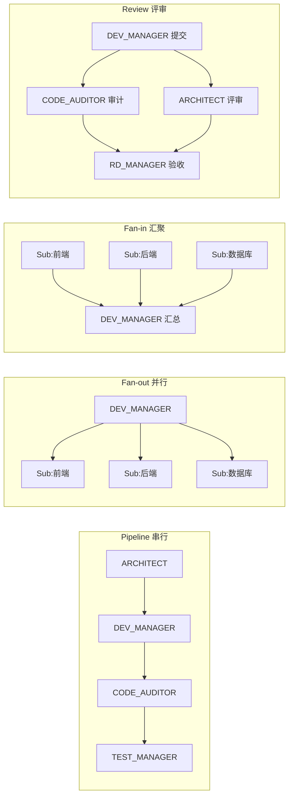
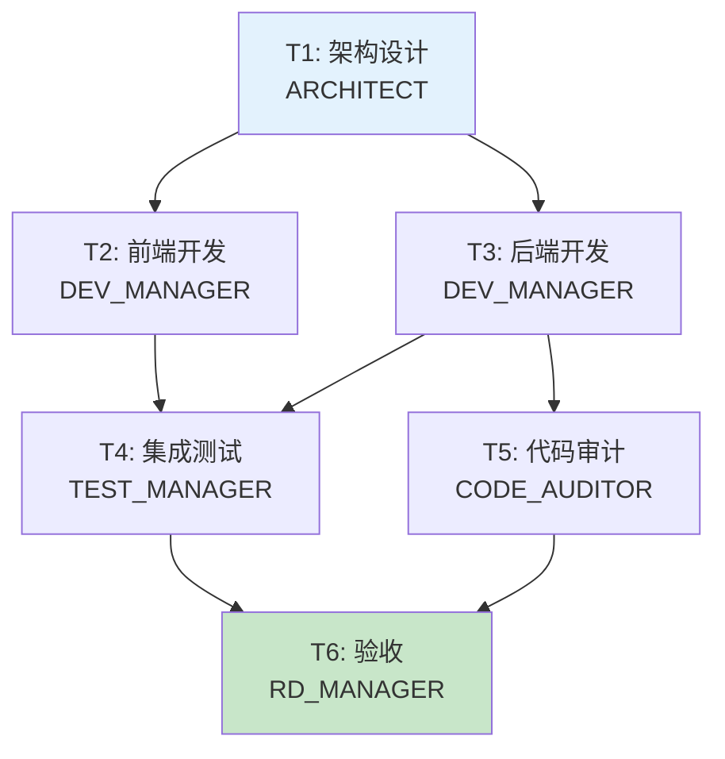
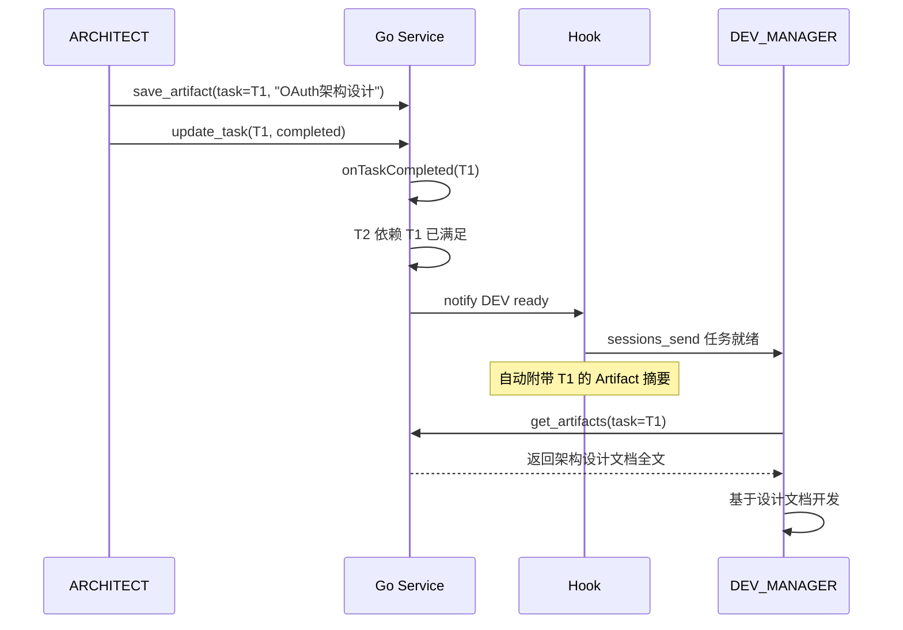
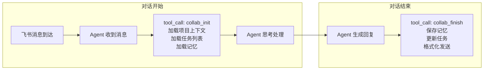
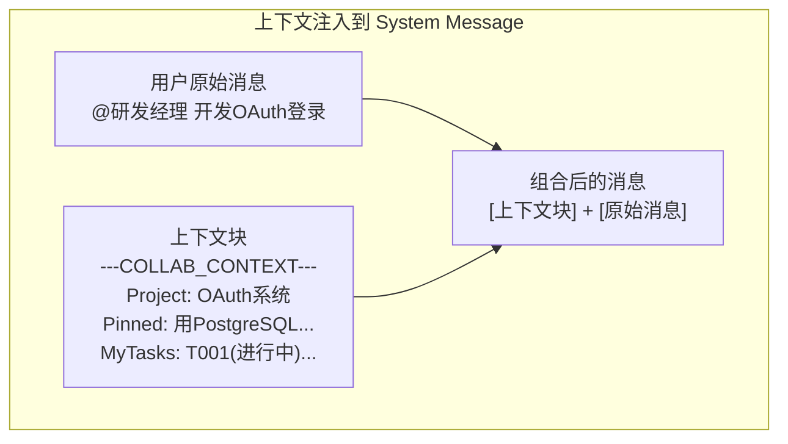
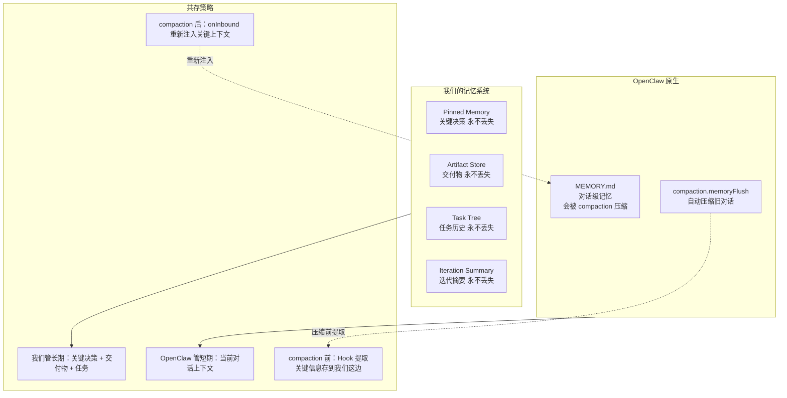
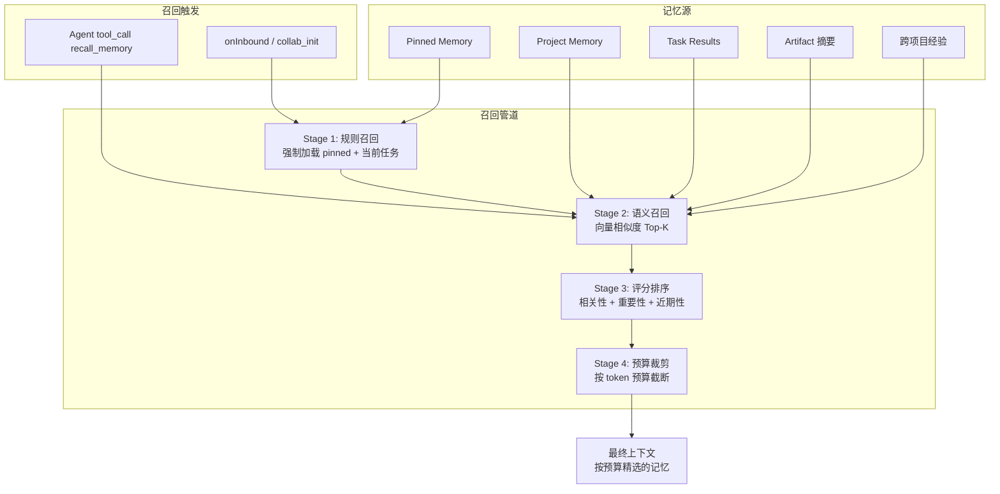
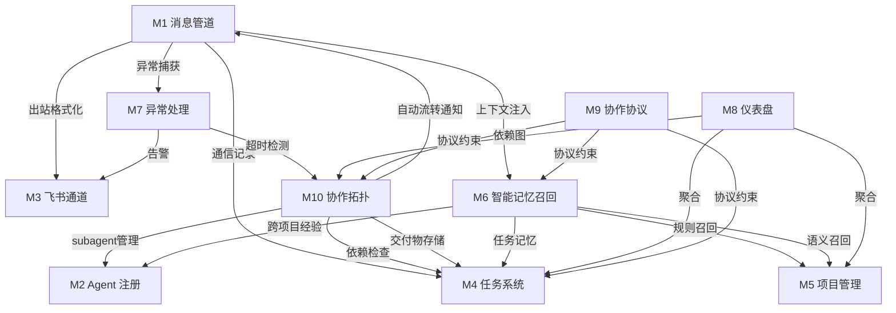

# 基于 OpenClaw 的多 Agent 协作系统设计方案 V4

> **V4 = V3 的模块化基座 + 三项增强**
>
> V3 的 9 个模块作为基座保留，V4 聚焦三个方向的深度优化：
> - **增强 A**：多 Agent 协作拓扑（V3 缺乏结构化协作模式）
> - **增强 B**：OpenClaw 深度集成（V3 的 Hook 假设需要落地验证）
> - **增强 C**：智能记忆召回（V3 的 pinned memory 是蛮力方案）

---

## 0. V3 问题诊断

### 0.1 多 Agent 协作的 5 个缺陷

| # | 问题 | V3 现状 | 影响 |
|---|------|---------|------|
| A1 | **无协作拓扑** | Agent 间全是扁平 sessions_send | 不知道何时该串行（设计→开发）何时该并行（前端+后端）何时该汇聚（审计+测试→验收） |
| A2 | **无交付物共享** | 内容只在 sessions_send 中传递，是瞬时的 | 架构师的设计文档发给开发经理后，测试经理要看得再发一次 |
| A3 | **任务只有树，无依赖** | parent-child 关系 | "后端开发"依赖"架构设计"完成，但它们是兄弟节点，V3 没法表达这种依赖 |
| A4 | **无交接协议** | Agent A 完成后通知 Agent B 靠自由文本 | 交接时丢失上下文、交付物找不到、验收标准不明 |
| A5 | **Subagent 生命周期粗糙** | 只有注册/注销 | 无超时、无孤儿检测、无结果聚合模式 |

### 0.2 OpenClaw 集成的 4 个缺陷

| # | 问题 | V3 现状 | 影响 |
|---|------|---------|------|
| B1 | **Hook 点是假设** | 假设 OpenClaw 有 onInbound/onOutbound 等 Hook | 如果不存在，整个消息管道方案不成立 |
| B2 | **上下文注入方式不明** | "注入到 Agent 上下文"但没说怎么注入 | Agent 可能根本看不到注入的内容 |
| B3 | **MEMORY.md 冲突** | V3 的项目记忆和 OpenClaw 原生 MEMORY.md 是两套系统 | compaction 时可能冲掉关键记忆，两边不同步 |
| B4 | **HEARTBEAT.md 未利用** | 忽略了 OpenClaw 的定时任务能力 | 缺少：超时检测、进度催促、记忆整理的定时触发 |

### 0.3 记忆召回的 5 个缺陷

| # | 问题 | V3 现状 | 影响 |
|---|------|---------|------|
| C1 | **Pinned 全量加载** | 所有 pinned memory 无条件注入 | 50 条 pinned = 5000+ tokens 浪费，很多和当前任务无关 |
| C2 | **无语义检索** | 只有分类(category)过滤 | "我们之前讨论的数据库方案"查不出"选择 PostgreSQL 而非 MySQL" |
| C3 | **项目间记忆隔离** | 完全按 project_id 隔离 | 架构师在 P001 踩的坑，P002 遇到同样问题时无法召回 |
| C4 | **无重要性评分** | 非 pinned 记忆全部平等 | 高频访问的记忆和从未访问的记忆排名一样 |
| C5 | **上下文预算固定** | 固定 ~2000 tokens | 简单查进度不需要上下文，复杂设计任务 2000 不够 |

---

## 增强 A：协作拓扑引擎

> **新增模块 M10**，影响 M1(Hook)、M4(任务)、M9(协议)。
>
> 让系统知道多个 Agent 之间该怎么协作——串行、并行、汇聚、评审——而不是全靠 Agent 自己猜。

### A1. 协作模式定义



### A2. 任务依赖 — 从树到 DAG

V3 的任务只有 parent-child 关系。V4 增加 **兄弟依赖（depends_on）**，把任务树升级为 DAG。

```go
type Task struct {
    // ... V3 全部字段保留 ...

    // V4 新增
    DependsOn    []string `json:"depends_on" gorm:"serializer:json"`  // 前置任务 ID 列表
    Artifacts    []string `json:"artifacts" gorm:"serializer:json"`   // 交付物 ID 列表
    Topology     string   `json:"topology"`  // pipeline / fanout / fanin / review / free
}
```

**依赖检查**：当 Agent 调 `update_task(status=in_progress)` 时，Go 服务校验 `depends_on` 中的任务是否全部 completed。若未满足，返回错误并告知哪些前置任务未完成。



**API 变更**：

```
POST   /api/tasks                          创建时可指定 depends_on[]
GET    /api/tasks/:id/ready                检查前置依赖是否满足
GET    /api/tasks?project_id=P001&ready=true   查询可以开始的任务
POST   /api/tasks/:id/check-dependencies   触发依赖检查，自动启动就绪任务
```

**自动流转**：当任务 A completed 时，Go 服务检查所有 `depends_on` 包含 A 的任务，如果其所有依赖都满足，自动通知 assignee 可以开始。

```go
func (s *TaskService) onTaskCompleted(taskID string) {
    dependents := s.findDependents(taskID) // 找到所有依赖此任务的下游
    for _, dep := range dependents {
        if s.allDependenciesMet(dep.ID) {
            s.notifyAgent(dep.Assignee, ReadyToStart{
                TaskID:    dep.ID,
                Title:     dep.Title,
                Artifacts: s.gatherUpstreamArtifacts(dep.ID), // 收集前置任务的交付物
            })
        }
    }
}
```

### A3. 交付物存储

交付物(Artifact) 绑定到任务，所有 Agent 可以按任务 ID 获取。

```go
type Artifact struct {
    ID        string    `json:"id" gorm:"primaryKey"`
    TaskID    string    `json:"task_id" gorm:"index"`
    ProjectID string    `json:"project_id" gorm:"index"`
    Name      string    `json:"name"`                      // "OAuth架构设计文档"
    Type      string    `json:"type"`                      // markdown / code / image / file
    Content   string    `json:"content" gorm:"type:text"`  // 内容或文件路径
    CreatedBy string    `json:"created_by"`
    Version   int       `json:"version"`                   // 支持多版本
    CreatedAt time.Time `json:"created_at"`
}
```

**Agent Tool**：

```typescript
// task-tool 新增 tool

// save_artifact — 保存交付物
{
  name: "save_artifact",
  params: {
    task_id: string,
    name: string,
    type: "markdown" | "code" | "file",
    content: string
  },
  returns: { artifact_id: string }
}

// get_artifacts — 获取交付物（可查某个任务、某个项目）
{
  name: "get_artifacts",
  params: {
    task_id?: string,
    project_id?: string,
    name?: string
  },
  returns: { artifacts: Artifact[] }
}
```

**交接协议**：当 Agent 完成任务时，交付物已存在 Artifact 表。下游 Agent 开始时，Hook 自动把前置任务的 Artifact 注入上下文。



### A4. Subagent 生命周期管理

```go
type SubagentRecord struct {
    // AgentRecord 全部字段 ...

    SpawnedAt    time.Time  `json:"spawned_at"`
    TimeoutAt    *time.Time `json:"timeout_at"`       // 超时时间
    TaskID       string     `json:"task_id"`           // 关联的子任务
    ResultStatus string     `json:"result_status"`     // pending / success / failed / timeout
    Result       *string    `json:"result"`            // 执行结果
}
```

**超时检测**（利用 HEARTBEAT.md）：

```
Go 服务定时任务（每 5 分钟）:
1. 查询 spawned_at + timeout 已超时的 subagent
2. 标记 result_status=timeout
3. 更新关联 task 状态 = blocked
4. 通知父 Agent 处理
```

**结果聚合**（Fan-in 模式）：

```go
func (s *TaskService) AggregateSubtasks(parentTaskID string) (*AggregateResult, error) {
    children := s.getChildren(parentTaskID)
    result := &AggregateResult{
        Total:     len(children),
        Completed: 0,
        Failed:    0,
        Results:   make([]SubResult, 0),
    }
    for _, child := range children {
        switch child.Status {
        case "completed":
            result.Completed++
            result.Results = append(result.Results, SubResult{
                TaskID:    child.ID,
                Title:     child.Title,
                Status:    "success",
                Result:    child.Result,
                Artifacts: s.getArtifacts(child.ID),
            })
        case "error", "blocked":
            result.Failed++
            result.Results = append(result.Results, SubResult{
                TaskID: child.ID,
                Title:  child.Title,
                Status: "failed",
                Error:  child.ErrorInfo,
            })
        }
    }
    return result, nil
}
```

---

## 增强 B：OpenClaw 深度集成

> 把 V3 假设的 Hook 机制落地为 **两种可选实现**，并解决 MEMORY.md 冲突和 HEARTBEAT.md 利用问题。

### B1. Hook 实现的两个方案

OpenClaw 的扩展机制可能不直接支持 V3 假设的 4 个 Hook 点。因此 V4 设计两个方案，按 OpenClaw 实际能力选择。

#### 方案一：OpenClaw 原生 Hook（如果支持）

如果 OpenClaw 的 plugin SDK 支持消息生命周期 Hook，直接用 V3 设计。

```typescript
// openclaw plugin 入口
export default {
  hooks: {
    'message:pre-process': onInbound,    // 消息到 Agent 前
    'message:post-process': onOutbound,  // Agent 回复后
    'session:send': onAgentMessage,      // Agent 间通信时
    'agent:error': onError,              // 异常时
  }
};
```

#### 方案二：Skill 封装（如果不支持原生 Hook）

如果 OpenClaw 只支持 Skill（tool），则把 Hook 逻辑转化为 **Agent 必须在每次对话开始/结束时调用的 Skill**，通过 AGENTS.md 协议强制约定。



**Skill 实现**：

```typescript
// collab_init — Agent 每次收到消息时第一个调用的 tool
{
  name: "collab_init",
  description: "每次收到消息后首先调用此工具，加载协作上下文",
  params: {
    channel_id: string,       // 当前渠道
    channel_type: "group" | "dm",
    message_text: string      // 原始消息（用于判断项目）
  },
  returns: {
    project?: ProjectContext,  // 项目上下文
    my_tasks: Task[],         // 我的任务
    team_agents: AgentRecord[], // 团队成员
    relevant_memories: Memory[], // 相关记忆
    pending_notifications: Notification[] // 待处理通知
  }
}

// collab_finish — Agent 完成处理后最后调用的 tool
{
  name: "collab_finish",
  description: "处理完成后调用，保存记忆并发送格式化消息",
  params: {
    reply_content: string,    // 要发送的回复
    memories_to_save?: Array<{content: string, category: string, pin: boolean}>,
    task_updates?: Array<{task_id: string, status: string, result?: string}>,
    messages_to_agents?: Array<{target: string, content: string, task_id?: string}>
  }
}
```

**AGENTS.md 协议约束**：

```markdown
## 协作协议 — 必须遵守

### 消息处理模板

收到任何消息后，严格按以下顺序执行：

1. **第一步**：调用 `collab_init` 加载上下文（不可跳过）
2. **第二步**：基于返回的上下文理解消息、执行业务逻辑
3. **第三步**：调用 `collab_finish` 完成处理（不可跳过）

违反此顺序将导致：上下文丢失、消息格式错误、记忆无法保存。
```

**方案选择建议**：先尝试方案一，如果 OpenClaw 不支持原生 Hook，降级到方案二。方案二的劣势是依赖 Agent 遵守 AGENTS.md 约定（LLM 可能偶尔不遵守），但通过强约束 prompt 可以达到 >95% 的遵守率。

### B2. 上下文注入机制

不管用方案一还是方案二，上下文注入最终都是**修改发送给 LLM 的消息**。具体操作：



**注入位置选择**：

| 方式 | 实现 | 优点 | 缺点 |
|------|------|------|------|
| **prepend 到 user message** | 在用户消息前面加一段上下文 | 最简单、最可靠 | 占用上下文窗口 |
| 写入 MEMORY.md | 动态更新 OpenClaw 的 MEMORY.md | 原生集成 | 和原有记忆混在一起 |
| 独立 context 文件 | 创建 COLLAB_CONTEXT.md 让 OpenClaw 加载 | 隔离清晰 | 需要 OpenClaw 支持动态文件 |

**推荐：prepend 到 user message**。这是最可靠的方式，不依赖 OpenClaw 的任何特殊能力。

**格式**：

```
---COLLAB_CONTEXT---
[项目] OAuth系统 (P001) | 迭代 Sprint-1 | 状态 active
[关键决策]
- 数据库选型: PostgreSQL (pinned)
- 认证方案: OAuth2 + JWT (pinned)
[我的任务]
- T003 架构设计 (in_progress) | 交付: 设计文档
- T007 API预研 (assigned) | 依赖: T003
[团队] 🎯RD_MANAGER 🏗️ARCHITECT 💻DEV_MANAGER ✅TEST_MANAGER 🔒CODE_AUDITOR
---END_CONTEXT---

以下是用户消息：
@研发经理 开发OAuth登录
```

### B3. MEMORY.md 共存策略

OpenClaw 原生 MEMORY.md + compaction.memoryFlush 和我们的项目记忆需要共存。



**具体规则**：

1. **OpenClaw MEMORY.md 只负责短期对话记忆**，让 compaction 自由压缩
2. **关键信息一旦产生，立刻写入 Go 服务**（通过 save_decision / save_artifact）
3. **每次对话开始（onInbound / collab_init），从 Go 服务拉取关键上下文注入**
4. **不修改 OpenClaw MEMORY.md**——让 OpenClaw 自行管理，我们在注入层补充

### B4. HEARTBEAT.md 利用

每个 Agent 的 HEARTBEAT.md 增加定时任务：

```markdown
## 定时任务

### 每 10 分钟
- 检查我的任务是否有超时/阻塞（调 query_tasks status=blocked）
- 如果有，主动向协调者汇报

### 每 30 分钟
- 检查 subagent 是否超时（调 query_agents is_subagent=true timeout）
- 超时的 subagent 标记失败，回收

### 每天 09:00
- 生成昨日工作摘要
- 汇报进度给协调者

### 迭代结束时（由协调者触发）
- 生成迭代摘要 → 存入 iteration.summary
```

Go 服务对应增加定时任务 API：

```
GET  /api/tasks/check-timeouts         检查超时任务
GET  /api/agents/check-orphans         检查孤儿 subagent
POST /api/projects/:id/daily-summary   生成每日摘要
```

---

## 增强 C：智能记忆召回

> 升级 V3 模块 6 的蛮力 pinned memory 为**多策略智能召回**。引入轻量向量检索，但不需要独立向量数据库——直接用 PostgreSQL pgvector 扩展。

### C1. 记忆召回架构



### C2. 四阶段召回管道

#### Stage 1: 规则召回（必选，无条件加载）

```go
type RuleRecallResult struct {
    PinnedMemories []ProjectMemory // 与当前任务相关的 pinned（不是全部）
    CurrentTasks   []Task          // Agent 的进行中任务
    IterationGoal  string          // 当前迭代目标
}

func ruleRecall(agentID, projectID, taskID string) RuleRecallResult {
    var result RuleRecallResult

    // 不再全量加载 pinned，而是按当前任务的关键词过滤
    if taskID != "" {
        task := getTask(taskID)
        keywords := extractKeywords(task.Title + " " + task.Description)
        result.PinnedMemories = queryPinnedByKeywords(projectID, keywords)
    } else {
        // 无任务上下文时，加载最近 10 条 pinned
        result.PinnedMemories = getRecentPinned(projectID, 10)
    }

    result.CurrentTasks = getAgentTasks(agentID, projectID, "in_progress")
    result.IterationGoal = getCurrentIterationGoal(projectID)
    return result
}
```

#### Stage 2: 语义召回（向量相似度检索）

使用 **PostgreSQL pgvector 扩展**，不需要独立向量数据库。

```sql
-- 数据库迁移：给 project_memory 加向量列
CREATE EXTENSION IF NOT EXISTS vector;

ALTER TABLE project_memories ADD COLUMN embedding vector(1024);
CREATE INDEX ON project_memories USING ivfflat (embedding vector_cosine_ops) WITH (lists = 50);
```

```go
type MemoryWithEmbedding struct {
    ProjectMemory
    Embedding pgvector.Vector `json:"-" gorm:"type:vector(1024)"`
}

func semanticRecall(projectID string, query string, topK int) []ProjectMemory {
    queryEmbedding := embed(query)  // 调用百炼 embedding API

    var results []MemoryWithEmbedding
    db.Raw(`
        SELECT *, 1 - (embedding <=> ?) AS similarity
        FROM project_memories
        WHERE project_id = ?
        AND pinned = false
        ORDER BY similarity DESC
        LIMIT ?
    `, queryEmbedding, projectID, topK).Scan(&results)

    return toProjectMemories(results)
}
```

**Embedding 模型选择**（百炼免费额度）：

| 模型 | 维度 | 免费额度 | 适用 |
|------|------|---------|------|
| text-embedding-v3 (百炼) | 1024 | Coding Plan 包含 | 首选 |
| bge-large-zh (SiliconFlow) | 1024 | 免费 Tier | 备选 |

#### Stage 3: 评分排序

```go
type ScoredMemory struct {
    Memory     ProjectMemory
    Similarity float64  // Stage 2 的语义相似度 (0~1)
    Importance float64  // 重要性 (0~1)
    Recency    float64  // 近期性 (0~1)
    FinalScore float64  // 综合得分
}

func scoreAndRank(memories []ScoredMemory) []ScoredMemory {
    now := time.Now()
    for i := range memories {
        m := &memories[i]

        // 重要性: pinned=1.0, 被引用次数越多越高
        m.Importance = calcImportance(m.Memory)

        // 近期性: 指数衰减, 半衰期 7 天
        days := now.Sub(m.Memory.CreatedAt).Hours() / 24
        m.Recency = math.Exp(-0.1 * days)

        // 综合评分: 可调权重
        m.FinalScore = 0.5*m.Similarity + 0.3*m.Importance + 0.2*m.Recency
    }

    sort.Slice(memories, func(i, j int) bool {
        return memories[i].FinalScore > memories[j].FinalScore
    })
    return memories
}
```

#### Stage 4: 预算裁剪

```go
type BudgetConfig struct {
    BaseTokens    int     // 基础预算 1000 tokens
    TaskComplexity float64 // 任务复杂度系数 (1.0~3.0)
    MaxTokens     int     // 上限 4000 tokens
}

func budgetTrim(memories []ScoredMemory, config BudgetConfig) []ScoredMemory {
    budget := int(float64(config.BaseTokens) * config.TaskComplexity)
    if budget > config.MaxTokens {
        budget = config.MaxTokens
    }

    var selected []ScoredMemory
    usedTokens := 0

    for _, m := range memories {
        tokens := estimateTokens(m.Memory.Content)
        if usedTokens+tokens > budget {
            break
        }
        selected = append(selected, m)
        usedTokens += tokens
    }
    return selected
}
```

**任务复杂度判断**：

```go
func calcTaskComplexity(task *Task, message string) float64 {
    // 简单查询（"进度怎么样"）→ 1.0
    // 一般任务（开发某功能）→ 1.5
    // 复杂任务（架构设计、方案预研）→ 2.5
    // 方向调整（用户修改需求）→ 3.0

    if containsAny(message, []string{"进度", "状态", "怎么样"}) {
        return 1.0
    }
    if task != nil && task.Level == 0 { // Epic 级别
        return 2.5
    }
    if containsAny(message, []string{"调整", "修改", "方案", "设计"}) {
        return 2.5
    }
    return 1.5
}
```

### C3. 跨项目知识迁移

Agent 在 P001 的经验，当 P002 遇到相关问题时也应该能召回。

```go
type AgentExperience struct {
    ID        string    `json:"id" gorm:"primaryKey"`
    AgentID   string    `json:"agent_id" gorm:"index"`
    ProjectID string    `json:"project_id"`
    Category  string    `json:"category"`   // lesson / pattern / pitfall
    Content   string    `json:"content" gorm:"type:text"`
    Embedding pgvector.Vector `gorm:"type:vector(1024)"`
    UseCount  int       `json:"use_count"`  // 被召回使用的次数
    CreatedAt time.Time
}
```

**召回逻辑**：

```go
func crossProjectRecall(agentID, query string, topK int) []AgentExperience {
    queryEmbed := embed(query)
    var results []AgentExperience
    db.Raw(`
        SELECT *, 1 - (embedding <=> ?) AS similarity
        FROM agent_experiences
        WHERE agent_id = ?
        ORDER BY similarity DESC
        LIMIT ?
    `, queryEmbed, agentID, topK).Scan(&results)
    return results
}
```

**写入时机**：Agent 在 AGENTS.md 中被约定——遇到以下情况时调 `save_experience` tool：
- 解决了一个有挑战的问题
- 发现了一个常见陷阱
- 找到了一个有效的模式/方案

### C4. 记忆整合（去重 + 合并）

定时任务，合并相似记忆避免膨胀。

```go
func consolidateMemories(projectID string) {
    memories := getAllMemories(projectID)

    // 按 embedding 余弦相似度聚类
    clusters := clusterBySimilarity(memories, threshold: 0.9)

    for _, cluster := range clusters {
        if len(cluster) <= 1 {
            continue
        }
        // 选最新的作为主条目，合并旧条目的内容
        primary := cluster[0] // 最新
        for _, dup := range cluster[1:] {
            primary.Content += "\n[合并自 " + dup.CreatedAt.Format("2006-01-02") + "]: " + dup.Content
            db.Delete(&dup)
        }
        db.Save(&primary)
    }
}
```

---

## 受影响模块修订一览

| V3 模块 | V4 变更 | 变更内容 |
|---------|---------|---------|
| M1 消息管道 | **修订** | 增加方案二（Skill 降级方案）；onInbound 改用智能召回替代全量 pinned |
| M2 Agent 注册 | **修订** | 新增 subagent 超时/孤儿管理字段 |
| M3 飞书通道 | 不变 | — |
| M4 任务系统 | **修订** | Task 新增 depends_on / artifacts / topology 字段；新增依赖自动流转；新增 Artifact 表 |
| M5 项目管理 | **修订** | ProjectMemory 新增 embedding 列；上下文加载改用智能召回管道 |
| M6 反失忆 | **重构** | 从三层防线升级为四阶段智能召回管道 |
| M7 异常处理 | **修订** | 利用 HEARTBEAT.md 做定时超时检测 |
| M8 仪表盘 | **修订** | 增加 artifact 查看、依赖图可视化 |
| M9 协作协议 | **修订** | 增加 collab_init/collab_finish 协议（方案二）；增加交付物保存约定 |
| **M10 协作拓扑** | **新增** | 任务依赖 DAG、交付物存储、Subagent 生命周期、自动流转 |

---

## 更新后的模块依赖关系



---

## 更新后的技术栈

| 组件 | V3 | V4 | 变更原因 |
|------|----|----|---------|
| 数据库 | PostgreSQL | PostgreSQL + **pgvector 扩展** | 语义召回需要向量检索 |
| Embedding | 无 | **百炼 text-embedding-v3** | 向量化记忆内容 |
| 定时任务 | 无 | **Go cron + HEARTBEAT.md** | 超时检测、记忆整合、每日摘要 |
| 其余 | 同 V3 | 同 V3 | — |

---

## 更新后的目录结构（增量）

```
go-collab-service/internal/
├── ... (V3 全部保留)
├── topology/                      # 新增: M10 协作拓扑
│   ├── dependency.go              # 任务依赖检查 + 自动流转
│   ├── artifact.go                # 交付物 CRUD
│   ├── subagent_lifecycle.go      # Subagent 超时/孤儿管理
│   └── handler.go
├── memory/                        # 新增: M6 智能记忆
│   ├── recall_pipeline.go         # 四阶段召回管道
│   ├── rule_recall.go             # Stage 1
│   ├── semantic_recall.go         # Stage 2 (pgvector)
│   ├── scoring.go                 # Stage 3
│   ├── budget.go                  # Stage 4
│   ├── consolidation.go           # 记忆整合
│   ├── cross_project.go           # 跨项目经验
│   ├── embedding.go               # Embedding API 调用
│   └── handler.go
└── scheduler/                     # 新增: 定时任务
    ├── cron.go                    # 定时任务注册
    ├── timeout_checker.go         # 超时检测
    ├── orphan_cleaner.go          # 孤儿 subagent 清理
    └── memory_consolidator.go     # 记忆整合

ts-plugins/
├── ... (V3 全部保留)
├── task-tool/src/tools/
│   ├── ... (V3 保留)
│   ├── saveArtifact.ts            # 新增: 保存交付物
│   └── getArtifacts.ts            # 新增: 获取交付物
└── project-tool/src/tools/
    ├── ... (V3 保留)
    ├── recallMemory.ts            # 新增: 智能记忆召回
    └── saveExperience.ts          # 新增: 保存跨项目经验
```

---

## 更新后的 API 清单（增量）

```
# M10 协作拓扑
POST   /api/tasks/:id/dependencies        设置依赖
GET    /api/tasks/:id/ready               依赖检查
GET    /api/tasks?project_id=xxx&ready=true  查可启动任务
POST   /api/tasks/:id/check-dependencies  触发自动流转

# M10 交付物
POST   /api/artifacts                     保存
GET    /api/artifacts?task_id=xxx         按任务查
GET    /api/artifacts?project_id=xxx      按项目查

# M10 Subagent 生命周期
GET    /api/agents/subagents/timeout      查超时 subagent
POST   /api/agents/subagents/cleanup      清理孤儿

# M6 智能记忆
POST   /api/memory/recall                 智能召回（四阶段管道）
POST   /api/memory/embed                  生成 embedding
POST   /api/memory/consolidate            触发整合
POST   /api/memory/experience             保存跨项目经验
GET    /api/memory/experience?agent=xxx   查 Agent 经验

# 定时任务
POST   /api/scheduler/check-timeouts      手动触发超时检查
POST   /api/scheduler/consolidate         手动触发记忆整合
GET    /api/scheduler/status              定时任务状态
```

---

## 更新后的开发计划

```
Phase 1 (1周): V3 Phase 1 不变 — Go 基座 + CRUD
Phase 2 (1.5周): V3 Phase 2 不变 — Hook/Skill + 飞书
Phase 3 (1周): V3 Phase 3 不变 — Skill 插件 + 协议

Phase 4 (1周): 协作拓扑
├── 任务依赖 DAG (depends_on + 自动流转)
├── 交付物存储 (Artifact)
└── Subagent 生命周期 (超时 + 孤儿 + 聚合)

Phase 5 (1周): 智能记忆
├── pgvector 安装 + embedding 列迁移
├── 四阶段召回管道
├── 跨项目经验
└── 记忆整合定时任务

Phase 6 (持续): 调优
├── 召回权重调参
├── 预算系数优化
├── 协作模式效果评估
```
