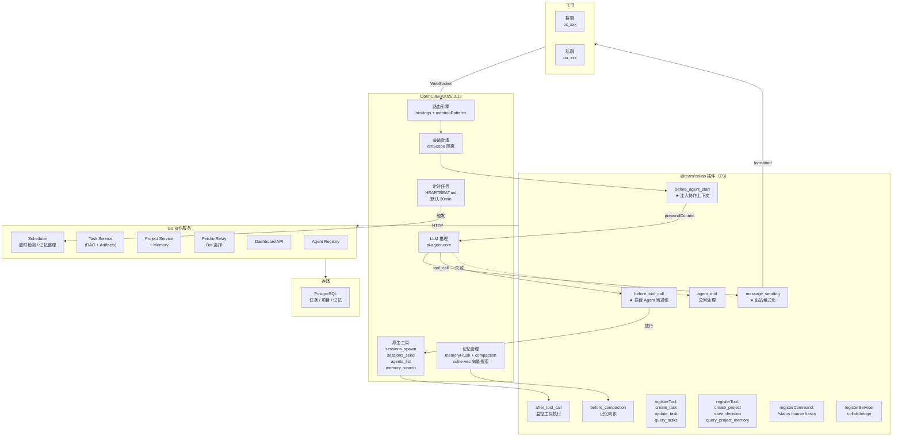
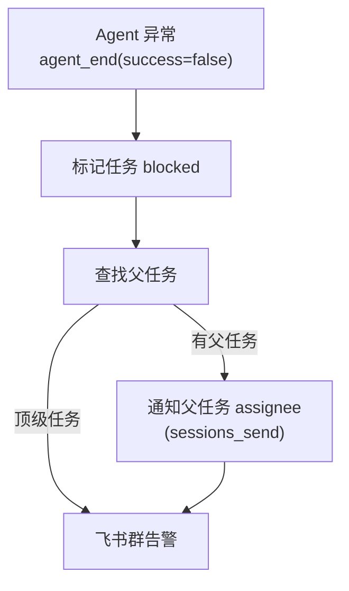
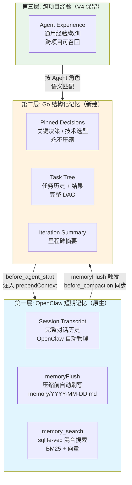
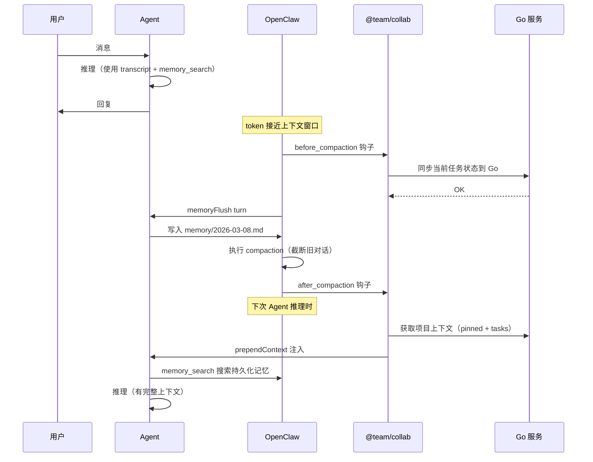
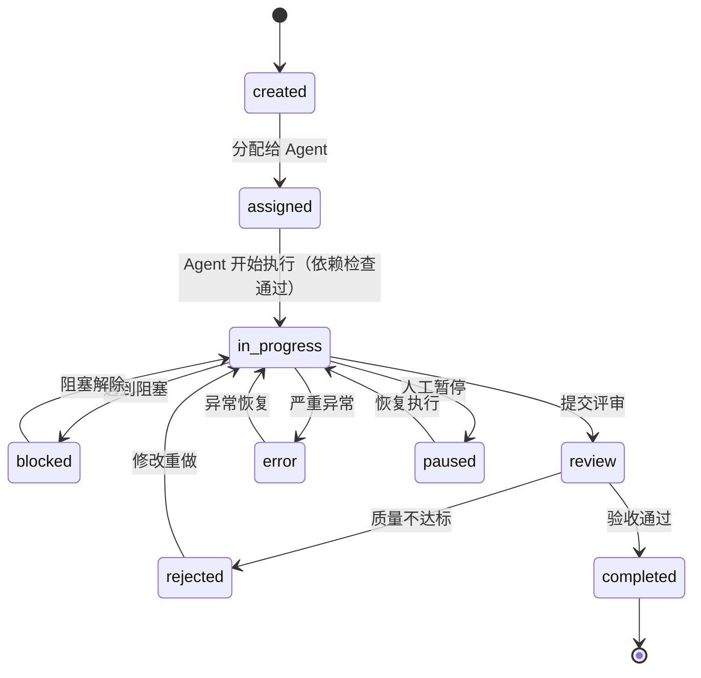
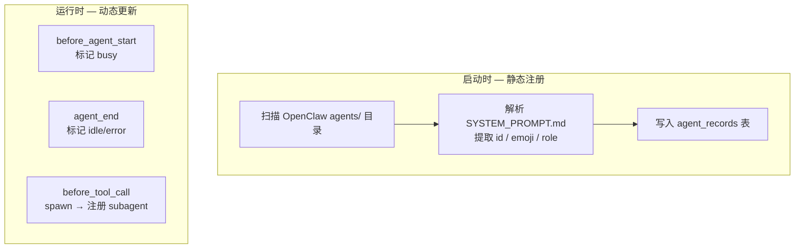
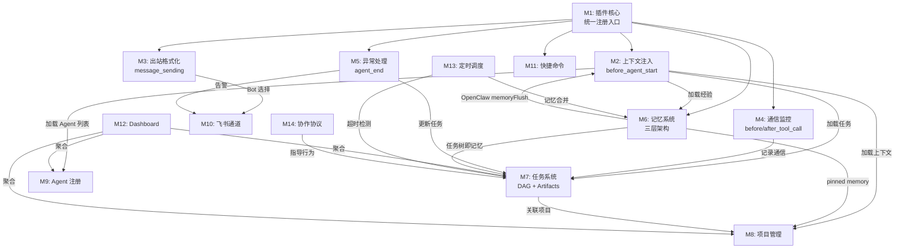

# 基于 OpenClaw 的多 Agent 协作系统设计方案 V5

> **V5 = V3 模块化基座 + V4 协作增强 + 源码验证修正 + 短期记忆整合**
>
> V5 是面向**交付研发**的版本。每个模块包含：
> - 精确到 OpenClaw 源码的 Hook/API 映射
> - 可直接实现的 TypeScript / Go 代码
> - 数据模型 + API 规格 + 错误处理
>
> **V5 核心变更（相比 V3+V4）**:
> 1. **Hook 系统落地**: V3 假设的 4 个 Hook → 映射到 OpenClaw 实际的 15 个生命周期钩子
> 2. **记忆架构重构**: 去掉 pgvector，复用 OpenClaw 原生 sqlite-vec 混合搜索 + memoryFlush
> 3. **短期记忆整合**: 正确利用 OpenClaw 的 session transcript + compaction + memoryFlush 机制
> 4. **Subagent 复用**: 复用 `sessions_spawn`/`sessions_send` 原生能力，不重复造轮子
> 5. **单插件架构**: 一个 `@team/collab` 插件统一注册所有 Hook、Tool、Service、Command
> 6. **开发细节**: 每个模块含 TypeScript 实现代码 + Go struct + API spec

---

## 0. 架构总览

### 0.1 三层架构（源码验证版）



### 0.2 层级职责

| 层 | 做什么 | 不做什么 |
|----|--------|---------|
| **OpenClaw** | LLM 推理、Agent 人格(md)、飞书 WebSocket、会话隔离、sessions_send/spawn、**短期记忆管理(transcript+compaction+memoryFlush)**、向量搜索(sqlite-vec) | 任务持久化、项目管理、飞书 Bot 选择 |
| **@team/collab 插件** | 6 个钩子（上下文注入、出站格式化、通信监控、异常处理、压缩同步）+ 协作工具注册 + 快捷命令 + Go 桥接 | LLM、消息路由 |
| **Go 服务** | 持久化：任务 DAG、项目、结构化记忆、Agent 注册、飞书 Bot 选择、Dashboard、定时调度 | LLM、消息路由、短期记忆 |

### 0.3 与 V3/V4 的关键差异

| 方面 | V3 | V4 | **V5** |
|------|----|----|--------|
| Hook | 4 个假设性 Hook | 两方案待验证 | **6 个已验证的 OpenClaw 原生 Hook** |
| 上下文注入 | "注入到 Agent 上下文" | prependContext 建议 | **`before_agent_start.prependContext` 源码确认** |
| 向量搜索 | 无 | pgvector | **OpenClaw 原生 sqlite-vec（去掉 pgvector）** |
| 短期记忆 | 忽略 | 忽略 | **整合 session transcript + memoryFlush + compaction hooks** |
| 插件数量 | message-hook + task-tool + project-tool | 同 V3 + 增强 | **单插件 @team/collab 统一注册** |
| 协作拓扑 | 无 | DAG + Artifacts | **保留 V4 的 DAG + Artifacts** |
| Subagent | 自建 | 增强生命周期 | **复用 sessions_spawn + after_tool_call 监控** |

---

## 模块 M1：协作插件核心 (Plugin Core)

> 一个插件统一注册所有能力。这是整个系统的 TS 层入口。

### M1.1 插件入口

```typescript
// ts-plugins/collab/src/index.ts
import type { OpenClawPluginDefinition, OpenClawPluginApi } from "openclaw/plugin-sdk";
import { createGoBridge, type GoBridge } from "./go-bridge.js";
import { injectCollabContext } from "./hooks/before-agent-start.js";
import { formatOutbound } from "./hooks/message-sending.js";
import { interceptToolCall } from "./hooks/before-tool-call.js";
import { monitorToolResult } from "./hooks/after-tool-call.js";
import { handleAgentEnd } from "./hooks/agent-end.js";
import { syncBeforeCompaction } from "./hooks/before-compaction.js";
import { registerCollabTools } from "./tools/index.js";
import { registerCollabCommands } from "./commands/index.js";

let bridge: GoBridge;

const plugin: OpenClawPluginDefinition = {
  id: "@team/collab",
  name: "Multi-Agent Collaboration",
  version: "1.0.0",
  description: "Multi-agent task management, project context, and Feishu formatting",

  async register(api: OpenClawPluginApi) {
    const goUrl = api.pluginConfig?.goServiceUrl as string ?? "http://localhost:8090";
    bridge = createGoBridge(goUrl, api.logger);

    // ═══ 钩子注册（按优先级） ═══

    // before_agent_start: 注入项目上下文 + Agent 列表 + 任务状态
    api.on("before_agent_start", (event, ctx) =>
      injectCollabContext(event, ctx, bridge), { priority: 100 });

    // message_sending: 添加角色前缀 + Bot 选择
    api.on("message_sending", (event, ctx) =>
      formatOutbound(event, ctx, bridge), { priority: 50 });

    // before_tool_call: 拦截 sessions_send/spawn 记录通信
    api.on("before_tool_call", (event, ctx) =>
      interceptToolCall(event, ctx, bridge), { priority: 50 });

    // after_tool_call: 监控工具执行结果
    api.on("after_tool_call", (event, ctx) =>
      monitorToolResult(event, ctx, bridge), { priority: 50 });

    // agent_end: 异常处理 + 状态更新
    api.on("agent_end", (event, ctx) =>
      handleAgentEnd(event, ctx, bridge), { priority: 50 });

    // before_compaction: 压缩前同步关键记忆到 Go
    api.on("before_compaction", (event, ctx) =>
      syncBeforeCompaction(event, ctx, bridge), { priority: 100 });

    // ═══ 工具注册 ═══
    registerCollabTools(api, bridge);

    // ═══ 命令注册 ═══
    registerCollabCommands(api, bridge);

    // ═══ 后台服务 ═══
    api.registerService({
      id: "collab-bridge",
      async start(ctx) {
        await bridge.healthCheck();
        api.logger.info("[collab] Go bridge connected");
      },
      async stop() {
        bridge.close();
      },
    });
  },
};

export default plugin;
```

### M1.2 Go Bridge 客户端

```typescript
// ts-plugins/collab/src/go-bridge.ts
import type { PluginLogger } from "openclaw/plugin-sdk";

export interface GoBridge {
  // Agent Registry
  getAgentBySessionKey(sessionKey: string): Promise<AgentInfo | null>;
  listAgents(projectId?: string): Promise<AgentInfo[]>;

  // Project
  getProjectByGroup(groupId: string): Promise<ProjectInfo | null>;
  getProjectContext(projectId: string, agentId: string): Promise<CollabContext>;

  // Task
  recordTaskActivity(taskId: string, activity: TaskActivity): Promise<void>;
  getAgentTasks(agentId: string, projectId?: string): Promise<TaskInfo[]>;

  // Feishu
  selectBot(params: BotSelectParams): Promise<string>;
  sendFeishu(params: FeishuSendParams): Promise<void>;

  // Memory sync
  syncMemories(agentId: string, projectId: string, memories: MemoryEntry[]): Promise<void>;

  healthCheck(): Promise<void>;
  close(): void;
}

export function createGoBridge(baseUrl: string, logger: PluginLogger): GoBridge {
  const request = async <T>(method: string, path: string, body?: unknown): Promise<T> => {
    const res = await fetch(`${baseUrl}${path}`, {
      method,
      headers: { "Content-Type": "application/json" },
      body: body ? JSON.stringify(body) : undefined,
    });
    if (!res.ok) {
      logger.warn(`[collab] Go API ${method} ${path}: ${res.status}`);
      throw new Error(`Go API error: ${res.status}`);
    }
    return res.json() as T;
  };

  return {
    getAgentBySessionKey: (key) => request("GET", `/api/agents/by-session?key=${encodeURIComponent(key)}`),
    listAgents: (projectId) => request("GET", `/api/agents${projectId ? `?project_id=${projectId}` : ""}`),
    getProjectByGroup: (gid) => request("GET", `/api/projects/by-group/${gid}`),
    getProjectContext: (pid, aid) => request("GET", `/api/projects/${pid}/context?agent_id=${aid}`),
    recordTaskActivity: (tid, act) => request("POST", `/api/tasks/${tid}/activities`, act),
    getAgentTasks: (aid, pid) => request("GET", `/api/tasks?assignee=${aid}${pid ? `&project_id=${pid}` : ""}&status=in_progress`),
    selectBot: (params) => request("POST", "/api/feishu/select-bot", params),
    sendFeishu: (params) => request("POST", "/api/feishu/send", params),
    syncMemories: (aid, pid, mems) => request("POST", `/api/projects/${pid}/memory/sync`, { agent_id: aid, memories: mems }),
    healthCheck: () => request("GET", "/api/health"),
    close: () => {},
  };
}
```

### M1.3 插件配置

```json5
// openclaw.plugin.json
{
  "id": "@team/collab",
  "kind": null,
  "configSchema": {
    "jsonSchema": {
      "type": "object",
      "properties": {
        "goServiceUrl": {
          "type": "string",
          "default": "http://localhost:8090",
          "description": "Go collaboration service URL"
        },
        "contextBudgetTokens": {
          "type": "number",
          "default": 2000,
          "description": "Max tokens for injected collaboration context"
        },
        "enableFeishuRelay": {
          "type": "boolean",
          "default": true,
          "description": "Enable Feishu message formatting and bot selection"
        }
      }
    }
  }
}
```

---

## 模块 M2：上下文注入 (Context Injection)

> 利用 `before_agent_start` 钩子在每次 Agent 推理前注入协作上下文。
> **这是整个系统的核心驱动力** — Agent 无需主动调工具就能感知项目、任务、团队。

### M2.1 Hook 实现

```typescript
// ts-plugins/collab/src/hooks/before-agent-start.ts
import type {
  PluginHookBeforeAgentStartEvent,
  PluginHookBeforeAgentStartResult,
  PluginHookAgentContext,
} from "openclaw/plugin-sdk";
import type { GoBridge } from "../go-bridge.js";

export async function injectCollabContext(
  event: PluginHookBeforeAgentStartEvent,
  ctx: PluginHookAgentContext,
  bridge: GoBridge,
): Promise<PluginHookBeforeAgentStartResult | void> {
  if (!ctx.agentId || !ctx.sessionKey) return;

  try {
    // 1. 从 session key 解析信息
    const isSubagent = ctx.sessionKey.includes(":subagent:");
    const channelId = ctx.messageProvider; // "feishu" / "telegram" 等

    // 2. 查询 Agent 信息
    const agent = await bridge.getAgentBySessionKey(ctx.sessionKey);
    if (!agent) return;

    // 3. 尝试获取项目上下文
    let projectContext: CollabContext | null = null;
    if (agent.currentProjectId) {
      projectContext = await bridge.getProjectContext(agent.currentProjectId, agent.id);
    }

    // 4. 构建注入内容
    const contextBlock = buildContextBlock(agent, projectContext, isSubagent);
    if (!contextBlock) return;

    return { prependContext: contextBlock };
  } catch (err) {
    // 静默失败 — 不影响 Agent 正常推理
    return;
  }
}

function buildContextBlock(
  agent: AgentInfo,
  project: CollabContext | null,
  isSubagent: boolean,
): string | null {
  const lines: string[] = ["---COLLAB_CONTEXT---"];

  // 身份
  lines.push(`[身份] ${agent.emoji} ${agent.displayName} (${agent.id})`);
  if (isSubagent) {
    lines.push(`[模式] Subagent — 完成后自动汇报父 Agent`);
  }

  // 项目
  if (project) {
    lines.push(`[项目] ${project.project.name} (${project.project.id})`);

    // 当前迭代
    if (project.currentIteration) {
      lines.push(`[迭代] ${project.currentIteration.name}: ${project.currentIteration.goal}`);
    }

    // 我的任务
    if (project.myTasks.length > 0) {
      lines.push(`[我的任务]`);
      for (const task of project.myTasks.slice(0, 5)) {
        const deps = task.dependsOn?.length
          ? ` (等待: ${task.dependsOn.join(", ")})`
          : "";
        lines.push(`  - ${task.id}: ${task.title} [${task.status}]${deps}`);
      }
    }

    // 关键决策（按重要性排序，控制 token）
    if (project.pinnedMemories.length > 0) {
      lines.push(`[关键决策]`);
      for (const mem of project.pinnedMemories.slice(0, 8)) {
        lines.push(`  - [${mem.category}] ${mem.content}`);
      }
    }

    // 团队 Agent
    if (project.teamAgents.length > 0) {
      lines.push(`[团队] ${project.teamAgents.map(a => `${a.emoji}${a.displayName}`).join(" | ")}`);
    }

    // 任务统计
    lines.push(`[统计] 总${project.stats.total} 进行中${project.stats.inProgress} 阻塞${project.stats.blocked} 完成${project.stats.completed}`);
  }

  lines.push("---END_COLLAB_CONTEXT---");
  return lines.join("\n");
}
```

### M2.2 上下文格式示例

Agent 收到的 `prependContext` 内容（在用户消息之前）：

```
---COLLAB_CONTEXT---
[身份] 🏗️ 架构师 (ARCHITECT)
[项目] OAuth 登录系统 (P001)
[迭代] Sprint-1: 完成用户认证核心流程
[我的任务]
  - T001: 架构设计 [in_progress]
  - T005: API 安全方案预研 [assigned]
[关键决策]
  - [tech_choice] 使用 PostgreSQL 而非 MySQL，理由: JSON 支持 + 事务可靠性
  - [architecture] 前后端分离，前端 React + 后端 Gin
  - [user_directive] JWT Token 有效期 2 小时，Refresh Token 7 天
[团队] 🎯研发经理 | 🏗️架构师 | 💻开发经理 | 🔍代码审计 | 🧪测试经理
[统计] 总12 进行中5 阻塞1 完成6
---END_COLLAB_CONTEXT---
```

### M2.3 Token 预算控制

```typescript
// 动态调整上下文大小
function trimContext(context: CollabContext, budgetTokens: number): CollabContext {
  const CHARS_PER_TOKEN = 3; // 中文约 1.5 字/token，英文约 4 字/token，取平均
  const budgetChars = budgetTokens * CHARS_PER_TOKEN;

  let currentChars = estimateChars(context);

  // 优先级裁剪（从低到高）
  if (currentChars > budgetChars) {
    context.teamAgents = []; // 裁掉团队列表
    currentChars = estimateChars(context);
  }
  if (currentChars > budgetChars) {
    context.pinnedMemories = context.pinnedMemories.slice(0, 5); // 减少决策
    currentChars = estimateChars(context);
  }
  if (currentChars > budgetChars) {
    context.myTasks = context.myTasks.slice(0, 3); // 减少任务
  }

  return context;
}
```

---

## 模块 M3：出站消息格式化 (Outbound Formatting)

> 利用 `message_sending` 钩子在消息发送前添加角色前缀。

### M3.1 Hook 实现

```typescript
// ts-plugins/collab/src/hooks/message-sending.ts
import type {
  PluginHookMessageSendingEvent,
  PluginHookMessageSendingResult,
  PluginHookMessageContext,
} from "openclaw/plugin-sdk";
import type { GoBridge } from "../go-bridge.js";

export async function formatOutbound(
  event: PluginHookMessageSendingEvent,
  ctx: PluginHookMessageContext,
  bridge: GoBridge,
): Promise<PluginHookMessageSendingResult | void> {
  // 跳过非飞书渠道
  if (!ctx.channelId?.startsWith("feishu")) return;

  try {
    // 从 accountId 推断 agent 信息
    const agent = ctx.accountId
      ? await bridge.getAgentBySessionKey(`agent:${ctx.accountId}`)
      : null;

    if (!agent) return;

    // 构建角色前缀
    const prefix = agent.isSubagent
      ? `【${agent.parentEmoji} ${agent.parentDisplayName} → Sub:${agent.subagentName}】`
      : `【${agent.emoji} ${agent.displayName}】`;

    return {
      content: `${prefix}\n${event.content}`,
    };
  } catch {
    return; // 静默失败
  }
}
```

### M3.2 消息头规范

| 场景 | 格式 | 示例 |
|------|------|------|
| 群有对应 Bot | `【emoji 角色名】` | `【🏗️ 架构师】` |
| 群无对应 Bot | `【emoji 角色名】` | `【🏗️ 架构师】` |
| Subagent | `【emoji 父角色 → Sub:名称】` | `【💻 开发经理 → Sub:后端API】` |
| 私聊 | `【emoji 角色名】` | `【🎯 研发经理】` |

---

## 模块 M4：Agent 间通信监控 (Inter-Agent Communication)

> 利用 `before_tool_call` 和 `after_tool_call` 拦截和监控 Agent 间通信。

### M4.1 通信拦截

```typescript
// ts-plugins/collab/src/hooks/before-tool-call.ts
import type {
  PluginHookBeforeToolCallEvent,
  PluginHookBeforeToolCallResult,
  PluginHookToolContext,
} from "openclaw/plugin-sdk";
import type { GoBridge } from "../go-bridge.js";

const TRACKED_TOOLS = new Set(["sessions_send", "sessions_spawn", "sessions_yield"]);

export async function interceptToolCall(
  event: PluginHookBeforeToolCallEvent,
  ctx: PluginHookToolContext,
  bridge: GoBridge,
): Promise<PluginHookBeforeToolCallResult | void> {
  if (!TRACKED_TOOLS.has(event.toolName)) return;

  const fromAgent = ctx.agentId ?? "unknown";

  try {
    switch (event.toolName) {
      case "sessions_spawn": {
        const targetAgent = (event.params.agentId as string) ?? fromAgent;
        const task = event.params.task as string;
        const label = event.params.label as string | undefined;

        // 记录 spawn 事件到 Go（用于 subagent 生命周期跟踪）
        await bridge.recordTaskActivity("_spawn", {
          type: "subagent_spawn",
          from: fromAgent,
          to: targetAgent,
          label,
          summary: task.substring(0, 200),
        });
        break;
      }

      case "sessions_send": {
        const targetKey = event.params.sessionKey as string | undefined;
        const targetAgent = event.params.agentId as string | undefined;
        const message = event.params.message as string;

        // 记录 Agent 间消息到 Go + 飞书群展示
        if (targetAgent || targetKey) {
          await bridge.recordTaskActivity("_a2a", {
            type: "agent_message",
            from: fromAgent,
            to: targetAgent ?? targetKey ?? "unknown",
            summary: message.substring(0, 200),
          });
        }
        break;
      }
    }
  } catch {
    // 静默 — 不阻塞原始工具调用
  }

  return; // 不修改参数，放行
}
```

### M4.2 工具结果监控

```typescript
// ts-plugins/collab/src/hooks/after-tool-call.ts
import type {
  PluginHookAfterToolCallEvent,
  PluginHookToolContext,
} from "openclaw/plugin-sdk";
import type { GoBridge } from "../go-bridge.js";

export async function monitorToolResult(
  event: PluginHookAfterToolCallEvent,
  ctx: PluginHookToolContext,
  bridge: GoBridge,
): Promise<void> {
  // 监控 sessions_spawn 结果 — 用于 subagent 生命周期管理
  if (event.toolName === "sessions_spawn") {
    if (event.error) {
      await bridge.recordTaskActivity("_spawn", {
        type: "subagent_spawn_failed",
        from: ctx.agentId ?? "unknown",
        error: event.error,
      }).catch(() => {});
    }
  }

  // 监控自定义协作工具的错误
  if (event.toolName.startsWith("create_task") || event.toolName.startsWith("update_task")) {
    if (event.error) {
      await bridge.recordTaskActivity("_tool_error", {
        type: "tool_error",
        tool: event.toolName,
        agent: ctx.agentId ?? "unknown",
        error: event.error,
      }).catch(() => {});
    }
  }
}
```

---

## 模块 M5：异常处理 (Error Handling)

### M5.1 agent_end Hook

```typescript
// ts-plugins/collab/src/hooks/agent-end.ts
import type {
  PluginHookAgentEndEvent,
  PluginHookAgentContext,
} from "openclaw/plugin-sdk";
import type { GoBridge } from "../go-bridge.js";

export async function handleAgentEnd(
  event: PluginHookAgentEndEvent,
  ctx: PluginHookAgentContext,
  bridge: GoBridge,
): Promise<void> {
  if (event.success) {
    // 成功完成 — 更新 Agent 状态
    await bridge.updateAgentStatus(ctx.agentId ?? "", "idle").catch(() => {});
    return;
  }

  // 失败处理
  const agentId = ctx.agentId ?? "unknown";
  const error = event.error ?? "unknown error";

  try {
    // 1. 更新 Agent 状态
    await bridge.updateAgentStatus(agentId, "error");

    // 2. 查找当前 Agent 的进行中任务
    const tasks = await bridge.getAgentTasks(agentId);
    for (const task of tasks) {
      // 标记任务阻塞
      await bridge.updateTaskStatus(task.id, "blocked", error);
    }

    // 3. 飞书群告警
    const agent = await bridge.getAgentBySessionKey(ctx.sessionKey ?? "");
    if (agent?.currentProjectId) {
      const project = await bridge.getProject(agent.currentProjectId);
      if (project?.groupId) {
        await bridge.sendFeishu({
          agentId,
          channelId: project.groupId,
          content: `⚠️ Agent 异常\n角色: ${agent.emoji} ${agent.displayName}\n错误: ${error}\n受影响任务: ${tasks.map(t => t.id).join(", ")}`,
          format: "text",
        });
      }
    }
  } catch {
    // 异常处理本身的异常，只能忽略
  }
}
```

### M5.2 异常冒泡



---

## 模块 M6：记忆系统 (Memory Architecture)

> **V5 核心修正**: 不再忽略 OpenClaw 短期记忆。建立清晰的三层记忆架构。

### M6.1 三层记忆架构



### M6.2 各层职责

| 层 | 管理者 | 存储 | 生命周期 | 搜索方式 |
|----|--------|------|---------|---------|
| **短期记忆** | OpenClaw | 会话 transcript + memory/*.md | 自动 compaction + memoryFlush | `memory_search`（sqlite-vec 混合搜索） |
| **结构化记忆** | Go 服务 | PostgreSQL | 永久 | Go API 查询 + `before_agent_start` 注入 |
| **跨项目经验** | Go 服务 | PostgreSQL | 永久，定期合并 | Go API 语义匹配 |

### M6.3 短期记忆整合（V5 新增）

**OpenClaw 的短期记忆流程**:



**关键点**: 
- OpenClaw 负责对话历史的 **滑动窗口管理**
- `memoryFlush` 在压缩前给 Agent 机会将重要信息持久化
- Go 服务存储的是 **结构化数据**（任务、决策），通过 `before_agent_start` 每次注入
- Agent 可以用 `memory_search` 搜索 OpenClaw 持久化的 `memory/*.md` 文件
- **两套系统互补，不冲突**: OpenClaw 管对话记忆，Go 管业务记忆

### M6.4 压缩同步 Hook

```typescript
// ts-plugins/collab/src/hooks/before-compaction.ts
import type {
  PluginHookBeforeCompactionEvent,
  PluginHookAgentContext,
} from "openclaw/plugin-sdk";
import type { GoBridge } from "../go-bridge.js";

export async function syncBeforeCompaction(
  event: PluginHookBeforeCompactionEvent,
  ctx: PluginHookAgentContext,
  bridge: GoBridge,
): Promise<void> {
  if (!ctx.agentId) return;

  try {
    // 压缩前同步当前任务状态
    // 确保即使 compaction 截断了对话，Go 侧的任务数据是最新的
    const tasks = await bridge.getAgentTasks(ctx.agentId);
    for (const task of tasks) {
      if (task.status === "in_progress") {
        await bridge.recordTaskActivity(task.id, {
          type: "compaction_sync",
          agent: ctx.agentId,
          summary: `Session compaction at ${event.tokenCount ?? 0} tokens, ${event.messageCount} messages`,
        });
      }
    }
  } catch {
    // 静默
  }
}
```

### M6.5 跨项目经验（保留 V4）

```go
type AgentExperience struct {
    ID        string    `json:"id" gorm:"primaryKey"`
    AgentID   string    `json:"agent_id" gorm:"index"`
    Category  string    `json:"category"`   // pitfall / best_practice / tool_tip
    Content   string    `json:"content" gorm:"type:text"`
    Tags      []string  `json:"tags" gorm:"serializer:json"`
    UsedCount int       `json:"used_count"` // 被召回次数
    CreatedAt time.Time
}
```

在 `before_agent_start` 中，根据当前任务关键词从 `agent_experiences` 表中匹配相关经验：

```go
func (s *MemoryService) RecallExperience(agentID string, taskKeywords []string, limit int) []AgentExperience {
    var results []AgentExperience
    query := s.db.Where("agent_id = ?", agentID)

    // 简单关键词匹配（不需要向量搜索 — 经验数量有限）
    for _, kw := range taskKeywords {
        query = query.Or("content ILIKE ?", "%"+kw+"%")
        query = query.Or("tags @> ?", fmt.Sprintf(`["%s"]`, kw))
    }

    query.Order("used_count DESC, created_at DESC").Limit(limit).Find(&results)
    return results
}
```

---

## 模块 M7：任务系统 (Task System)

> 保留 V3 的层级任务树 + V4 的 DAG 依赖和交付物。

### M7.1 数据模型（V3 + V4 合并）

```go
type Task struct {
    ID           string     `json:"id" gorm:"primaryKey"`
    ProjectID    string     `json:"project_id" gorm:"index"`
    ParentID     *string    `json:"parent_id" gorm:"index"`
    Path         string     `json:"path" gorm:"index"`           // 物化路径 "E001/T003/ST007"
    Level        int        `json:"level"`                       // 0=Epic 1=Task 2=SubTask
    Title        string     `json:"title"`
    Description  string     `json:"description" gorm:"type:text"`
    Assignee     string     `json:"assignee" gorm:"index"`
    AssignedBy   string     `json:"assigned_by"`
    Status       string     `json:"status" gorm:"index"`
    Priority     string     `json:"priority"`                    // P0/P1/P2/P3
    Deliverable  string     `json:"deliverable" gorm:"type:text"`
    Acceptance   string     `json:"acceptance" gorm:"type:text"`
    Result       *string    `json:"result" gorm:"type:text"`
    BlockReason  *string    `json:"block_reason"`
    ErrorInfo    *string    `json:"error_info"`
    DependsOn    []string   `json:"depends_on" gorm:"serializer:json"`   // V4: DAG 前置依赖
    Artifacts    []string   `json:"artifacts" gorm:"serializer:json"`    // V4: 交付物 ID
    Topology     string     `json:"topology"`                            // V4: pipeline/fanout/fanin/review/free
    Deadline     *time.Time `json:"deadline"`
    CompletedAt  *time.Time `json:"completed_at"`
    CreatedAt    time.Time  `json:"created_at"`
    UpdatedAt    time.Time  `json:"updated_at"`
}

// V4: 交付物存储
type Artifact struct {
    ID        string    `json:"id" gorm:"primaryKey"`
    TaskID    string    `json:"task_id" gorm:"index"`
    ProjectID string    `json:"project_id" gorm:"index"`
    Name      string    `json:"name"`
    Type      string    `json:"type"`              // document / code / config / test_report
    Content   string    `json:"content" gorm:"type:text"`
    CreatedBy string    `json:"created_by"`
    CreatedAt time.Time
}
```

### M7.2 状态机



### M7.3 依赖检查（V4 DAG）

```go
func (s *TaskService) UpdateStatus(id string, newStatus string) error {
    task := s.getTask(id)

    // DAG 依赖检查: in_progress 需要所有前置任务完成
    if newStatus == "in_progress" && len(task.DependsOn) > 0 {
        for _, depID := range task.DependsOn {
            dep := s.getTask(depID)
            if dep.Status != "completed" {
                return fmt.Errorf("dependency %s not completed (status: %s)", depID, dep.Status)
            }
        }
    }

    s.db.Model(task).Update("status", newStatus)

    // 状态传播
    switch {
    case newStatus == "completed":
        // 子任务全部完成 → 父任务自动进入 review
        if task.ParentID != nil && s.allSiblingsCompleted(*task.ParentID) {
            s.UpdateStatus(*task.ParentID, "review")
        }
        // DAG: 通知下游依赖者
        s.notifyDependents(id)

    case newStatus == "blocked" || newStatus == "error":
        // 通知父任务 assignee
        if task.ParentID != nil {
            parent := s.getTask(*task.ParentID)
            s.notifyAgent(parent.Assignee, TaskAlert{
                Type:    "child_" + newStatus,
                TaskID:  id,
                Message: stringOrDefault(task.BlockReason, task.ErrorInfo),
            })
        }

    case newStatus == "paused":
        // 级联暂停子任务
        children := s.getChildren(id)
        for _, child := range children {
            if child.Status == "in_progress" || child.Status == "assigned" {
                s.UpdateStatus(child.ID, "paused")
            }
        }
    }
    return nil
}

// DAG: 当任务完成时，检查下游任务是否所有依赖已满足
func (s *TaskService) notifyDependents(completedTaskID string) {
    var dependents []Task
    s.db.Where("depends_on @> ?", fmt.Sprintf(`["%s"]`, completedTaskID)).Find(&dependents)

    for _, dep := range dependents {
        allReady := true
        for _, reqID := range dep.DependsOn {
            req := s.getTask(reqID)
            if req.Status != "completed" {
                allReady = false
                break
            }
        }
        if allReady && dep.Status == "assigned" {
            s.notifyAgent(dep.Assignee, TaskAlert{
                Type:    "dependencies_ready",
                TaskID:  dep.ID,
                Message: fmt.Sprintf("All dependencies for '%s' are completed, you can start", dep.Title),
            })
        }
    }
}
```

### M7.4 Agent Tool 接口

```typescript
// ts-plugins/collab/src/tools/task.ts
import type { OpenClawPluginApi } from "openclaw/plugin-sdk";
import type { GoBridge } from "../go-bridge.js";
import { Type } from "@sinclair/typebox";

export function registerTaskTools(api: OpenClawPluginApi, bridge: GoBridge) {
  // create_task
  api.registerTool({
    name: "create_task",
    label: "Task",
    description: "Create a new task in the project task tree",
    parameters: Type.Object({
      project_id: Type.String(),
      title: Type.String(),
      description: Type.String(),
      assignee: Type.String(),
      priority: Type.Optional(Type.String()),
      parent_task_id: Type.Optional(Type.String()),
      depends_on: Type.Optional(Type.Array(Type.String())),
      deliverable: Type.Optional(Type.String()),
      acceptance: Type.Optional(Type.String()),
      deadline: Type.Optional(Type.String()),
    }),
    execute: async (_id, args) => {
      const result = await bridge.createTask(args as any);
      return JSON.stringify(result);
    },
  });

  // update_task
  api.registerTool({
    name: "update_task",
    label: "Task",
    description: "Update task status, result, or mark as blocked",
    parameters: Type.Object({
      task_id: Type.String(),
      status: Type.Optional(Type.String()),
      result: Type.Optional(Type.String()),
      block_reason: Type.Optional(Type.String()),
      comment: Type.Optional(Type.String()),
    }),
    execute: async (_id, args) => {
      const result = await bridge.updateTask(args as any);
      return JSON.stringify(result);
    },
  });

  // query_tasks
  api.registerTool({
    name: "query_tasks",
    label: "Task",
    description: "Query tasks by project, assignee, status, or subtree",
    parameters: Type.Object({
      project_id: Type.Optional(Type.String()),
      assignee: Type.Optional(Type.String()),
      status: Type.Optional(Type.String()),
      parent_task_id: Type.Optional(Type.String()),
      include_subtree: Type.Optional(Type.Boolean()),
    }),
    execute: async (_id, args) => {
      const result = await bridge.queryTasks(args as any);
      return JSON.stringify(result);
    },
  });

  // save_artifact (V4)
  api.registerTool({
    name: "save_artifact",
    label: "Task",
    description: "Save a deliverable artifact for a task",
    parameters: Type.Object({
      task_id: Type.String(),
      name: Type.String(),
      type: Type.String(),
      content: Type.String(),
    }),
    execute: async (_id, args) => {
      const result = await bridge.saveArtifact(args as any);
      return JSON.stringify(result);
    },
  });
}
```

### M7.5 API

```
POST   /api/tasks                        创建（含 depends_on / topology）
PATCH  /api/tasks/:id                    更新（触发状态传播 + 依赖通知）
GET    /api/tasks/:id                    单个（含直接子任务）
GET    /api/tasks/:id/tree               完整子树
GET    /api/tasks/:id/ancestors          向上追溯
GET    /api/tasks?project_id=xxx         按项目
GET    /api/tasks?assignee=xxx           按 Agent
GET    /api/tasks?status=blocked         按状态
POST   /api/tasks/:id/activities         添加活动记录
POST   /api/tasks/:id/artifacts          保存交付物
GET    /api/tasks/:id/artifacts          获取交付物
```

---

## 模块 M8：项目管理 (Project Management)

> 一个飞书群 = 一个项目。保留 V3 结构 + V4 迭代管理。

### M8.1 数据模型

```go
type Project struct {
    ID          string   `json:"id" gorm:"primaryKey"`
    Name        string   `json:"name"`
    Description string   `json:"description" gorm:"type:text"`
    GroupID     string   `json:"group_id" gorm:"uniqueIndex"`
    Status      string   `json:"status"`                        // active / paused / archived
    TeamAgents  []string `json:"team_agents" gorm:"serializer:json"`
    TechStack   []string `json:"tech_stack" gorm:"serializer:json"`
    CreatedAt   time.Time
    UpdatedAt   time.Time
}

type Iteration struct {
    ID        string    `json:"id" gorm:"primaryKey"`
    ProjectID string    `json:"project_id" gorm:"index"`
    Name      string    `json:"name"`
    Goal      string    `json:"goal" gorm:"type:text"`
    Status    string    `json:"status"`
    Summary   *string   `json:"summary" gorm:"type:text"`
    StartAt   time.Time `json:"start_at"`
    EndAt     time.Time `json:"end_at"`
}

type ProjectMemory struct {
    ID        string    `json:"id" gorm:"primaryKey"`
    ProjectID string    `json:"project_id" gorm:"index"`
    Category  string    `json:"category"`     // decision / tech_choice / lesson / architecture / user_directive
    Content   string    `json:"content" gorm:"type:text"`
    CreatedBy string    `json:"created_by"`
    Pinned    bool      `json:"pinned" gorm:"index"`
    UsedCount int       `json:"used_count"`   // 被召回次数
    CreatedAt time.Time
}
```

### M8.2 上下文加载 API

```go
// GET /api/projects/:id/context?agent_id=ARCHITECT
type CollabContext struct {
    Project          Project         `json:"project"`
    CurrentIteration *Iteration      `json:"current_iteration"`
    PinnedMemories   []ProjectMemory `json:"pinned_memories"`
    MyTasks          []Task          `json:"my_tasks"`
    TeamAgents       []AgentInfo     `json:"team_agents"`
    Stats            TaskStats       `json:"stats"`
    Experiences      []AgentExperience `json:"experiences"` // 跨项目经验
}
```

### M8.3 API

```
POST   /api/projects                            创建项目
GET    /api/projects/:id                        项目详情
GET    /api/projects/by-group/:group_id         通过群 ID 查项目
GET    /api/projects/:id/context?agent_id=xxx   加载完整上下文
PATCH  /api/projects/:id                        更新项目

POST   /api/projects/:id/iterations             创建迭代
PATCH  /api/projects/:id/iterations/:iid        更新迭代
GET    /api/projects/:id/iterations             迭代列表

POST   /api/projects/:id/memory                 添加记忆
GET    /api/projects/:id/memory                 查询记忆
PATCH  /api/projects/:id/memory/:mid            更新（pin/unpin）
POST   /api/projects/:id/memory/sync            批量同步记忆
```

---

## 模块 M9：Agent 注册与发现 (Agent Registry)

### M9.1 数据模型

```go
type AgentRecord struct {
    ID              string   `json:"id" gorm:"primaryKey"`
    DisplayName     string   `json:"display_name"`
    Emoji           string   `json:"emoji"`
    Role            string   `json:"role"`
    Skills          []string `json:"skills" gorm:"serializer:json"`
    Status          string   `json:"status"`    // idle / busy / error / offline
    IsSubagent      bool     `json:"is_subagent"`
    ParentAgent     string   `json:"parent_agent"`
    CurrentProjectID string  `json:"current_project_id"`
    CurrentLoad     int      `json:"current_load"`
    RegisteredAt    int64    `json:"registered_at"`
    LastActiveAt    int64    `json:"last_active_at"`
}
```

### M9.2 注册流程



### M9.3 与 OpenClaw 原生 agents_list 的关系

OpenClaw 原生 `agents_list` 工具返回基于 `subagents.allowAgents` 配置的可调用列表。Go Registry 是它的**超集**，额外提供：
- Agent 当前状态 (idle/busy/error)
- 当前负载
- 所属项目
- Subagent 关系

Agent 在需要了解 "谁可以调" 时用 OpenClaw 原生 `agents_list`，在需要了解 "谁在忙什么" 时用 `before_agent_start` 注入的上下文。

---

## 模块 M10：飞书通道 (Feishu Channel)

### M10.1 入站路由

完全由 OpenClaw 原生处理：

```json5
// openclaw.json
{
  agents: {
    list: [
      { id: "RD_MANAGER", workspace: "...", agentDir: "..." },
      { id: "ARCHITECT", workspace: "...", agentDir: "..." },
      // ...
    ]
  },
  bindings: [
    { agentId: "RD_MANAGER", match: { channel: "feishu", peer: { kind: "group", id: "oc_project1" } } },
    { agentId: "ARCHITECT", match: { channel: "feishu", peer: { kind: "dm", id: "ou_xxx" } } },
  ],
  tools: {
    agentToAgent: { enabled: true, allow: ["*"] }
  }
}
```

### M10.2 出站 Bot 选择

```go
type BotMapping struct {
    ID       string `json:"id" gorm:"primaryKey"`
    AgentID  string `json:"agent_id" gorm:"index"`
    BotAppID string `json:"bot_app_id"`
    GroupID  string `json:"group_id"`
}

func (s *FeishuService) SelectBot(agentID, groupID string, isSubagent bool, parentAgentID string) string {
    lookupAgent := agentID
    if isSubagent {
        lookupAgent = parentAgentID
    }
    if m, ok := s.findMapping(lookupAgent, groupID); ok {
        return m.BotAppID
    }
    return s.defaultBotID
}
```

---

## 模块 M11：快捷命令 (Commands)

> 利用 `registerCommand` 注册斜杠命令，绕过 LLM 直接执行。

```typescript
// ts-plugins/collab/src/commands/index.ts
export function registerCollabCommands(api: OpenClawPluginApi, bridge: GoBridge) {
  api.registerCommand({
    name: "status",
    description: "Show current project and task status",
    handler: async (ctx) => {
      const project = await bridge.getProjectByGroup(ctx.channel);
      if (!project) return { text: "当前不在项目群中" };
      const context = await bridge.getProjectContext(project.id, "");
      return {
        text: [
          `📊 项目: ${project.name}`,
          `迭代: ${context.currentIteration?.name ?? "无"}`,
          `任务: 总${context.stats.total} 进行中${context.stats.inProgress} 阻塞${context.stats.blocked} 完成${context.stats.completed}`,
        ].join("\n"),
      };
    },
  });

  api.registerCommand({
    name: "pause",
    description: "Pause a task: /pause T003",
    acceptsArgs: true,
    handler: async (ctx) => {
      const taskId = ctx.args?.trim();
      if (!taskId) return { text: "用法: /pause <task_id>" };
      await bridge.updateTaskStatus(taskId, "paused");
      return { text: `⏸️ 任务 ${taskId} 已暂停` };
    },
  });

  api.registerCommand({
    name: "tasks",
    description: "List tasks for current project",
    handler: async (ctx) => {
      const project = await bridge.getProjectByGroup(ctx.channel);
      if (!project) return { text: "当前不在项目群中" };
      const tasks = await bridge.queryTasks({ project_id: project.id, status: "in_progress" });
      const lines = tasks.map(t => `- ${t.id}: ${t.title} [${t.assignee}]`);
      return { text: lines.length > 0 ? lines.join("\n") : "没有进行中的任务" };
    },
  });
}
```

---

## 模块 M12：Dashboard API

```
GET /api/dashboard/overview
{
  "projects": [
    {
      "id": "P001", "name": "OAuth系统", "status": "active",
      "group_name": "OAuth项目群",
      "stats": { "total": 12, "in_progress": 5, "blocked": 1, "completed": 6 }
    }
  ],
  "agents": [
    {
      "id": "ARCHITECT", "display_name": "架构师", "status": "busy",
      "current_load": 3, "active_projects": ["P001", "P002"]
    }
  ],
  "alerts": [
    { "severity": "warning", "task_id": "T003", "agent": "DEV_MANAGER",
      "message": "opencode 执行超时", "timestamp": 1710000000 }
  ]
}

GET /api/dashboard/project/:id    项目详情 + 任务树 + 风险
GET /api/dashboard/agent/:id      Agent 跨项目任务
GET /api/dashboard/alerts         所有告警
```

---

## 模块 M13：定时调度 (Scheduler)

> 利用 Go 的定时任务 + OpenClaw HEARTBEAT.md 实现周期性检查。

### M13.1 Go 侧定时任务

```go
// internal/scheduler/scheduler.go
func StartScheduler(taskSvc *task.Service, memorySvc *memory.Service) {
    // 每 5 分钟: subagent 超时检测
    go runEvery(5*time.Minute, func() {
        tasks := taskSvc.FindStuckTasks(30 * time.Minute) // 超过 30 分钟未更新
        for _, t := range tasks {
            taskSvc.UpdateStatus(t.ID, "blocked", "Timeout: no update for 30 minutes")
        }
    })

    // 每天凌晨: 记忆合并
    go runDaily("03:00", func() {
        memorySvc.ConsolidateSimilarMemories(0.9) // 合并相似度 > 90% 的记忆
    })
}
```

### M13.2 HEARTBEAT.md 配置

```markdown
# HEARTBEAT

## 定期检查任务
检查我的进行中任务，如果有超过 1 小时没有更新的，提醒相关 Agent。

## 定期汇总
如果有项目的迭代即将结束（3 天内），生成进度汇总报告。
```

---

## 模块 M14：协作协议 (Collaboration Protocol)

> 写入每个 Agent 的 AGENTS.md 和 SYSTEM_PROMPT.md。

### M14.1 统一协作段落

追加到**每个 Agent** 的 AGENTS.md：

```markdown
## 协作协议

### 上下文感知
每次收到消息时，上下文中已包含（由系统自动注入，标记为 `---COLLAB_CONTEXT---`）：
- 当前项目信息、迭代目标
- 我的进行中任务列表
- 关键决策（pinned decisions）
- 可调动的团队 Agent 列表
- 任务统计

基于这些上下文理解消息并处理。如果上下文中没有项目信息，说明当前不在项目群中。

### 任务管理
- 收到任务 → 调 update_task(status=in_progress) 表示开始
- 完成任务 → 调 update_task(status=review, result=交付物) + save_artifact
- 遇到阻塞 → 调 update_task(status=blocked, block_reason=原因)
- 需要拆分 → 调 create_task(parent_task_id=当前任务)
- 需要协作 → 调 create_task(assignee=目标Agent) 或 sessions_send

### 反失忆
以下场景**必须**调 save_decision(pin=true)：
- 技术选型、架构决策、用户指示、方向变更、重大约束发现

### 短期记忆
- 日常对话中的信息由 OpenClaw 自动管理（transcript + compaction）
- 压缩前系统会自动让你保存重要信息到 memory/
- 使用 memory_search 搜索历史持久化的记忆

### 消息格式
不需要手动添加角色前缀 — 系统自动添加。直接输出内容。
```

---

## 技术栈与目录结构

### 技术选型

| 组件 | 选择 | 理由 |
|------|------|------|
| Go Web | Gin | 轻量高性能 |
| Go ORM | GORM | PostgreSQL JSON 支持好 |
| 数据库 | PostgreSQL | 事务可靠、JSON 字段、物化路径 |
| TS 运行时 | OpenClaw Plugin SDK (`openclaw/plugin-sdk`) | 源码验证的原生插件规范 |
| 向量搜索 | OpenClaw 原生 sqlite-vec | 无需额外组件 |
| 飞书 SDK | 飞书开放平台 Go SDK | 官方维护 |

### Go 服务目录

```
go-collab-service/
├── cmd/server/main.go
├── internal/
│   ├── registry/                    # M9: Agent Registry
│   │   ├── service.go
│   │   ├── scanner.go
│   │   └── handler.go
│   ├── task/                        # M7: Task System (DAG + Artifacts)
│   │   ├── service.go
│   │   ├── tree.go                  # 任务树 + 状态传播 + 依赖检查
│   │   ├── artifact.go
│   │   └── handler.go
│   ├── project/                     # M8: Project Management
│   │   ├── service.go
│   │   ├── context.go               # 上下文加载
│   │   ├── memory.go                # 项目记忆 + 经验
│   │   └── handler.go
│   ├── feishu/                      # M10: Feishu Channel
│   │   ├── relay.go
│   │   ├── bot_selector.go
│   │   └── handler.go
│   ├── dashboard/                   # M12: Dashboard
│   │   ├── service.go
│   │   └── handler.go
│   ├── scheduler/                   # M13: Scheduler
│   │   └── scheduler.go
│   └── common/
│       ├── config.go
│       ├── database.go
│       └── middleware.go
├── migrations/
│   ├── 001_agents.sql
│   ├── 002_projects.sql
│   ├── 003_tasks.sql
│   ├── 004_artifacts.sql
│   ├── 005_bot_mappings.sql
│   └── 006_experiences.sql
├── go.mod
└── Makefile
```

### TS 插件目录

```
ts-plugins/collab/
├── src/
│   ├── index.ts                     # M1: 插件入口
│   ├── go-bridge.ts                 # Go API 客户端
│   ├── types.ts                     # 共享类型
│   ├── hooks/
│   │   ├── before-agent-start.ts    # M2: 上下文注入
│   │   ├── message-sending.ts       # M3: 出站格式化
│   │   ├── before-tool-call.ts      # M4: 通信拦截
│   │   ├── after-tool-call.ts       # M4: 结果监控
│   │   ├── agent-end.ts             # M5: 异常处理
│   │   └── before-compaction.ts     # M6: 压缩同步
│   ├── tools/
│   │   ├── index.ts                 # 工具注册入口
│   │   ├── task.ts                  # M7: 任务工具
│   │   └── project.ts              # M8: 项目工具
│   └── commands/
│       └── index.ts                 # M11: 快捷命令
├── openclaw.plugin.json
├── package.json
└── tsconfig.json
```

---

## OpenClaw 配置参考

```json5
// openclaw.json
{
  agents: {
    defaults: {
      model: { primary: "alibaba/qwen3.5-plus", fallbacks: ["alibaba/kimi-k2.5", "glm-5"] },
      subagents: {
        maxConcurrent: 3,
        model: "alibaba/qwen3.5-plus",
        archiveAfterMinutes: 120
      },
      compaction: {
        memoryFlush: { enabled: true, softThresholdTokens: 4000 }
      },
      memorySearch: {
        enabled: true,
        provider: "openai",  // 或 "local" 使用本地嵌入
        query: { hybrid: { enabled: true, vectorWeight: 0.7, textWeight: 0.3 } }
      },
      heartbeat: { every: "30m" },
      maxConcurrent: 2,
    },
    list: [
      {
        id: "RD_MANAGER",
        name: "研发经理",
        workspace: "/path/to/workspace",
        agentDir: "/path/to/agents/rd-manager/agent",
        subagents: { allowAgents: ["*"] },
      },
      {
        id: "ARCHITECT",
        name: "架构师",
        agentDir: "/path/to/agents/architect/agent",
        subagents: { allowAgents: ["RD_MANAGER", "DEV_MANAGER"] },
      },
      // ... 其他 Agent
    ],
  },
  tools: {
    agentToAgent: { enabled: true, allow: ["*"] },
  },
  bindings: [
    { agentId: "RD_MANAGER", match: { channel: "feishu", peer: { kind: "group", id: "oc_project1" } } },
  ],
  channels: {
    feishu: {
      enabled: true,
      dmPolicy: "pairing",
      streaming: true,
      blockStreaming: true,
    },
  },
}
```

---

## 模块依赖关系



---

## 开发计划

### Phase 1: 基座（2 周）

```
交付: Go 服务 + 数据库 + 核心 CRUD
模块: M9(Agent Registry) + M7(Task, 基础) + M8(Project, 基础)
验证: curl 测试所有 API

详细:
├── Go 项目初始化 (Gin + GORM + PostgreSQL)
├── 数据库迁移 (agents / projects / tasks / artifacts / memories / experiences)
├── M9: Agent Registry CRUD + workspace 扫描
├── M8: Project CRUD + 群ID查项目 + 记忆 CRUD
├── M7: Task CRUD + 树形查询 + 状态机 + DAG 依赖检查
└── M12: Dashboard overview API
```

### Phase 2: 插件核心（1.5 周）

```
交付: @team/collab 插件 + 消息流走通
模块: M1(插件核心) + M2(上下文注入) + M3(出站格式化) + M4(通信监控)
验证: 飞书群 @Agent → 带前缀回复 + 上下文注入可见

详细:
├── M1: 插件脚手架 + Go Bridge
├── M2: before_agent_start → prependContext 注入
├── M3: message_sending → 角色前缀
├── M4: before_tool_call → sessions_send/spawn 记录
├── M10: Feishu Relay + Bot 选择
└── OpenClaw 配置 (openclaw.json 5+ Agent + bindings)
```

### Phase 3: 协作工具（1 周）

```
交付: Agent 能管理任务和项目
模块: M7(Task tools) + M8(Project tools) + M11(Commands) + M14(Protocol)
验证: 端到端协作流 — @研发经理 "开发OAuth" → 自动创建项目+任务+分配

详细:
├── Task/Project registerTool 注册
├── M11: /status /pause /tasks 命令
├── M14: 更新所有 Agent 的 AGENTS.md
└── M6: before_compaction 同步
```

### Phase 4: 打磨（1 周）

```
交付: 生产可用
模块: M5(异常处理) + M6(记忆完善) + M13(调度) + M12(Dashboard完善)
验证: 异常告警 + 记忆持久 + 定时检查

详细:
├── M5: agent_end 异常处理 + 冒泡链
├── M6: 跨项目经验 + 记忆合并
├── M13: 超时检测 + 每日整理
├── 错误处理 + 日志 + API 认证
└── 部署文档
```

---

## 完整 API 清单

```
# Agent Registry (M9)
GET    /api/agents
GET    /api/agents/:id
GET    /api/agents/by-session?key=xxx
POST   /api/agents/register
DELETE /api/agents/:id
PATCH  /api/agents/:id/status
PATCH  /api/agents/:id/load

# Task (M7)
POST   /api/tasks
PATCH  /api/tasks/:id
GET    /api/tasks/:id
GET    /api/tasks/:id/tree
GET    /api/tasks/:id/ancestors
GET    /api/tasks
POST   /api/tasks/:id/activities
POST   /api/tasks/:id/artifacts
GET    /api/tasks/:id/artifacts

# Project (M8)
POST   /api/projects
GET    /api/projects/:id
GET    /api/projects/by-group/:group_id
GET    /api/projects/:id/context?agent_id=xxx
PATCH  /api/projects/:id

# Iteration
POST   /api/projects/:id/iterations
PATCH  /api/projects/:id/iterations/:iid
GET    /api/projects/:id/iterations

# Project Memory
POST   /api/projects/:id/memory
GET    /api/projects/:id/memory
PATCH  /api/projects/:id/memory/:mid
POST   /api/projects/:id/memory/sync

# Agent Experience (M6)
POST   /api/agents/:id/experiences
GET    /api/agents/:id/experiences?keywords=xxx

# Feishu (M10)
POST   /api/feishu/send
POST   /api/feishu/select-bot
GET    /api/feishu/bot-mapping
POST   /api/feishu/bot-mapping

# Dashboard (M12)
GET    /api/dashboard/overview
GET    /api/dashboard/project/:id
GET    /api/dashboard/agent/:id
GET    /api/dashboard/alerts

# Health
GET    /api/health
```
