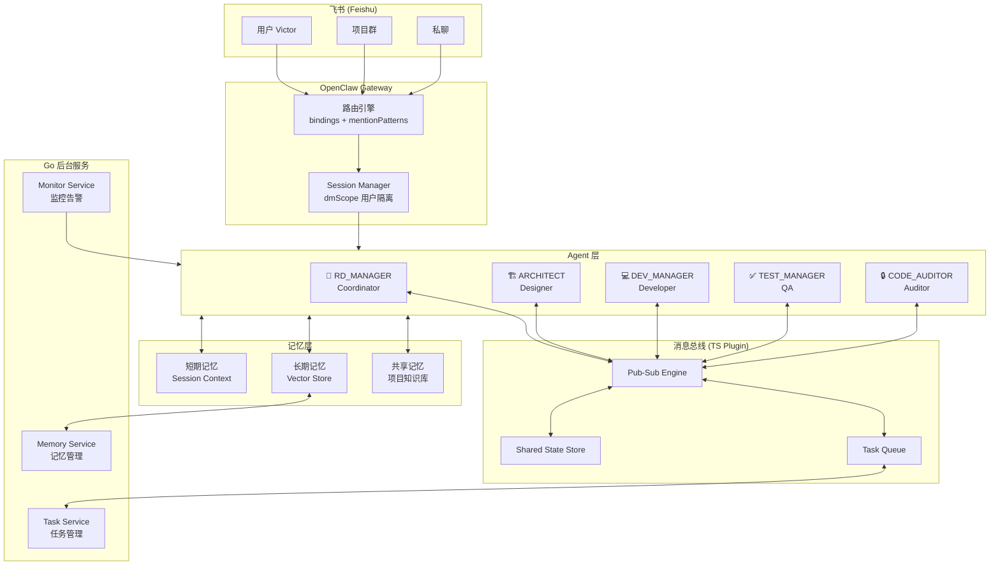
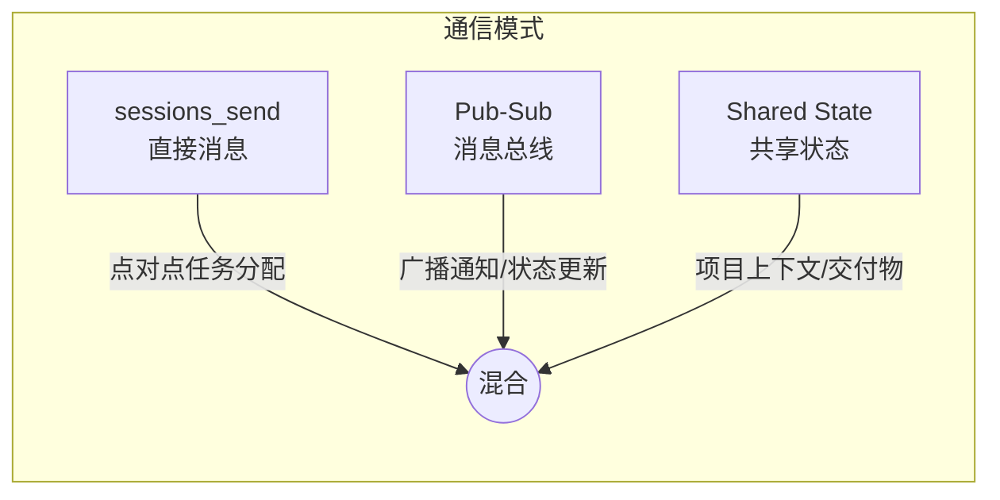
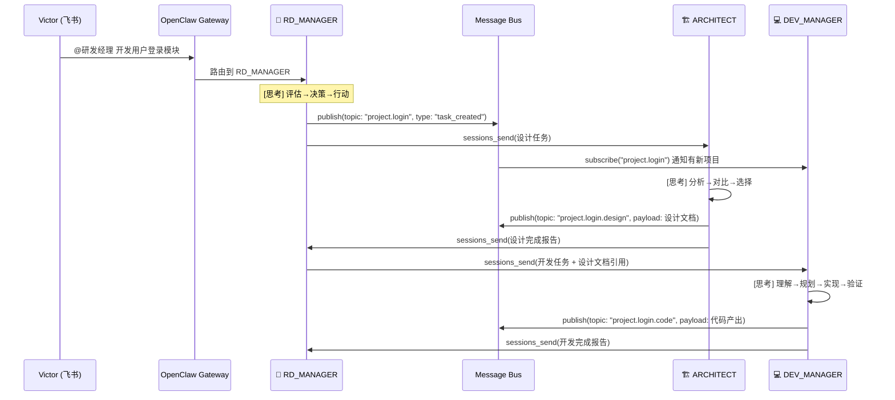
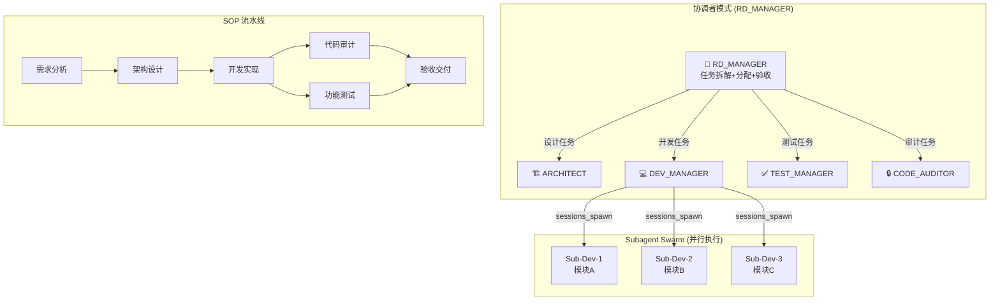
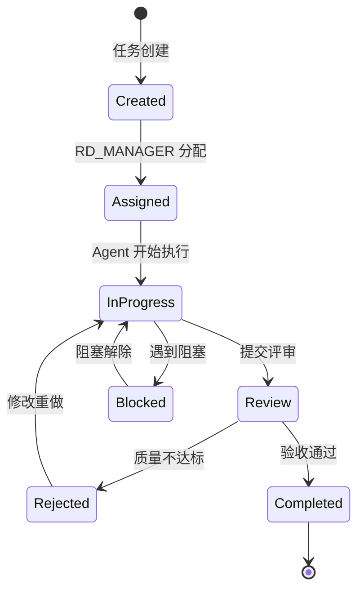
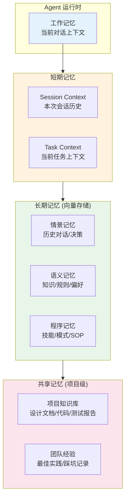
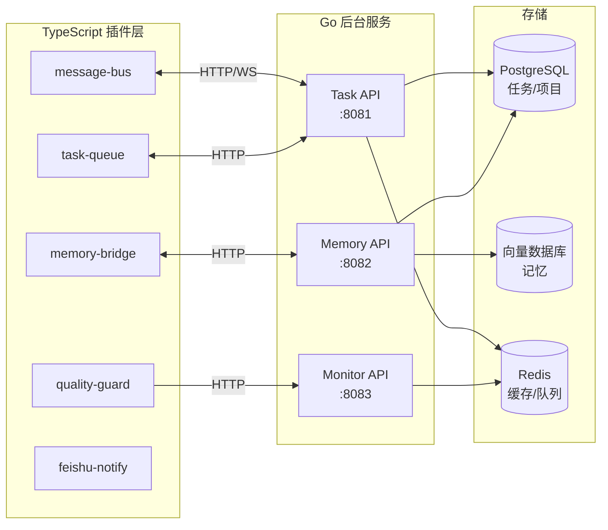
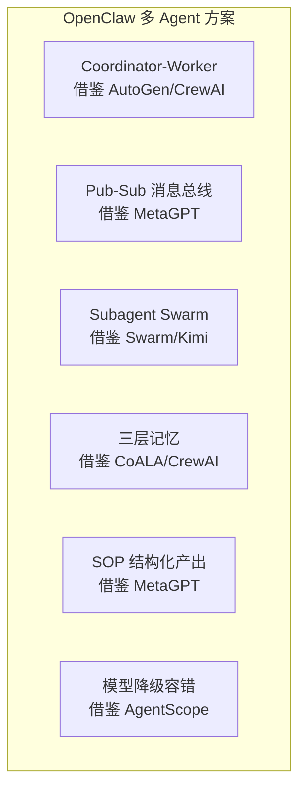

# 基于 OpenClaw 的多 Agent 协作系统设计方案

## 1. 设计目标

基于对 AutoGen / CrewAI / MetaGPT / LangGraph / Swarm / CAMEL / AgentScope 7 大框架和 4 个学术专题的调研，设计一套在 OpenClaw 平台上运行、通过飞书交互的多 Agent 协作系统。

### 核心目标

- **Agent 间高效通信**：借鉴 MetaGPT 的 Pub-Sub + AutoGen 的 Actor 模型
- **并行任务处理**：借鉴 Swarm 的 Handoff + Kimi Agent Swarm 的并发 subagent
- **统一记忆系统**：借鉴 CrewAI 的统一 Memory + CAMEL 的 LongtermMemory
- **SOP 驱动质量**：借鉴 MetaGPT 的结构化产出 + 可执行反馈
- **飞书原生集成**：利用 OpenClaw 飞书 binding 机制实现路由和隔离
- **Go + TS 技术栈**：后台服务用 Golang，OpenClaw 插件用 TypeScript

### 设计原则

| 原则 | 说明 | 借鉴来源 |
|------|------|---------|
| 松耦合通信 | Agent 间通过消息总线通信，非直接引用 | MetaGPT Pub-Sub |
| 结构化产出 | 所有交付物有明确 schema，非自然语言闲聊 | MetaGPT SOP |
| 并行优先 | 无依赖任务默认并行执行 | Swarm / AgentScope |
| 渐进增强 | 核心能力用 OpenClaw 原生，高级能力用插件扩展 | AgentScope 分层 |
| 故障降级 | 模型/API 不可用时自动降级，不影响整体 | AgentScope 容错 |

---

## 2. 整体架构



### 架构分层说明

| 层 | 技术 | 职责 |
|----|------|------|
| **飞书接入层** | OpenClaw Feishu Plugin | 接收消息、路由到 Agent、回复结果 |
| **Agent 层** | OpenClaw Agent Workspaces | 5 个独立 Agent，各有 SYSTEM_PROMPT + SOUL + AGENTS |
| **消息总线** | TS Plugin (`@team/message-bus`) | Agent 间 Pub-Sub 通信 + 共享状态 + 任务队列 |
| **记忆层** | TS Plugin (`@team/memory-store`) + Go Service | 短期/长期/共享三层记忆 |
| **Go 后台** | Golang 微服务 | 任务持久化、向量存储、监控告警 |

---

## 3. 通信机制设计

### 3.1 通信模式选择

借鉴调研结论，采用**混合通信模式**：



| 模式 | 适用场景 | 实现方式 | 借鉴来源 |
|------|---------|---------|---------|
| **直接消息** | 任务分配、进度汇报、Bug 反馈 | `sessions_send` (OpenClaw 原生) | AutoGen Direct |
| **Pub-Sub** | 状态变更广播、全员通知、事件驱动 | TS Plugin `message-bus` | MetaGPT / AutoGen |
| **共享状态** | 项目文档、设计稿、代码产出 | TS Plugin `shared-state` | LangGraph State |

### 3.2 消息协议

```typescript
// message-bus TS Plugin 消息格式
interface AgentMessage {
  id: string;                    // UUID
  timestamp: number;             // Unix ms
  from: AgentId;                 // 发送者 {name, emoji, prefix}
  to: AgentId | 'broadcast';    // 接收者或广播
  type: MessageType;             // 'task' | 'report' | 'alert' | 'handoff' | 'query'
  topic: string;                 // Pub-Sub topic (e.g., 'project.alpha.design')
  payload: {
    content: string;             // 消息正文
    structured?: object;         // 结构化数据 (如设计文档JSON)
    attachments?: string[];      // 附件路径
    priority: 'P0' | 'P1' | 'P2' | 'P3';
    replyTo?: string;            // 回复的消息 ID
  };
  metadata: {
    sessionId: string;           // 会话隔离
    projectId: string;           // 项目标识
    taskId?: string;             // 关联任务
  };
}
```

### 3.3 通信流程



---

## 4. 任务编排设计

### 4.1 编排模式

借鉴调研，采用 **Coordinator-Worker + Subagent Swarm** 混合模式：



### 4.2 任务状态机



### 4.3 Go 后台 — Task Service

```go
// task_service.go

package task

import (
    "context"
    "time"
)

type TaskStatus string

const (
    StatusCreated    TaskStatus = "created"
    StatusAssigned   TaskStatus = "assigned"
    StatusInProgress TaskStatus = "in_progress"
    StatusBlocked    TaskStatus = "blocked"
    StatusReview     TaskStatus = "review"
    StatusRejected   TaskStatus = "rejected"
    StatusCompleted  TaskStatus = "completed"
)

type Task struct {
    ID          string            `json:"id"`
    ProjectID   string            `json:"project_id"`
    Title       string            `json:"title"`
    Description string            `json:"description"`
    Assignee    string            `json:"assignee"`     // Agent ID
    AssignedBy  string            `json:"assigned_by"`  // Coordinator Agent ID
    Status      TaskStatus        `json:"status"`
    Priority    string            `json:"priority"`     // P0-P3
    Deliverable string            `json:"deliverable"`  // 交付物要求
    Acceptance  string            `json:"acceptance"`   // 验收标准
    ParentID    *string           `json:"parent_id"`    // 父任务 (Swarm 场景)
    SubTasks    []string          `json:"sub_tasks"`    // 子任务 IDs
    Checkpoint  time.Time         `json:"checkpoint"`   // 检查点时间
    CreatedAt   time.Time         `json:"created_at"`
    UpdatedAt   time.Time         `json:"updated_at"`
    Metadata    map[string]string `json:"metadata"`
}

type TaskService interface {
    Create(ctx context.Context, task *Task) error
    UpdateStatus(ctx context.Context, id string, status TaskStatus, comment string) error
    GetByProject(ctx context.Context, projectID string) ([]*Task, error)
    GetByAssignee(ctx context.Context, agentID string) ([]*Task, error)
    GetOverdue(ctx context.Context) ([]*Task, error) // 超期未完成
    Decompose(ctx context.Context, parentID string, subTasks []*Task) error // 拆解子任务
    Aggregate(ctx context.Context, parentID string) (*TaskResult, error)    // 汇总子任务结果
}

type TaskResult struct {
    TaskID      string        `json:"task_id"`
    Status      TaskStatus    `json:"status"`
    Deliverables []string     `json:"deliverables"`
    SubResults  []*TaskResult `json:"sub_results"` // Swarm 子任务结果
    Duration    time.Duration `json:"duration"`
    QualityScore float64      `json:"quality_score"`
}
```

### 4.4 TS Plugin — Task Queue

```typescript
// @team/task-queue plugin

import { OpenClawPlugin, PluginContext } from '@openclaw/sdk';

interface TaskEvent {
  type: 'created' | 'assigned' | 'completed' | 'blocked' | 'overdue';
  taskId: string;
  agentId: string;
  payload: any;
}

export default class TaskQueuePlugin implements OpenClawPlugin {
  private queue: TaskEvent[] = [];
  private subscribers: Map<string, ((event: TaskEvent) => void)[]> = new Map();

  async onMessage(ctx: PluginContext, message: any) {
    // 监听任务相关消息，维护队列
    if (message.type === 'task') {
      const event: TaskEvent = {
        type: 'created',
        taskId: message.payload.taskId,
        agentId: message.from.name,
        payload: message.payload,
      };
      this.queue.push(event);
      this.notify(event);
    }
  }

  subscribe(agentId: string, callback: (event: TaskEvent) => void) {
    if (!this.subscribers.has(agentId)) {
      this.subscribers.set(agentId, []);
    }
    this.subscribers.get(agentId)!.push(callback);
  }

  private notify(event: TaskEvent) {
    for (const [agentId, callbacks] of this.subscribers) {
      callbacks.forEach(cb => cb(event));
    }
  }
}
```

---

## 5. 记忆系统设计

### 5.1 三层记忆架构

借鉴 CoALA + CrewAI + CAMEL 的记忆设计：



### 5.2 Go 后台 — Memory Service

```go
// memory_service.go

package memory

import (
    "context"
)

type MemoryType string

const (
    Episodic   MemoryType = "episodic"   // 情景记忆
    Semantic   MemoryType = "semantic"   // 语义记忆
    Procedural MemoryType = "procedural" // 程序记忆
    Shared     MemoryType = "shared"     // 共享记忆
)

type MemoryEntry struct {
    ID        string            `json:"id"`
    AgentID   string            `json:"agent_id"`
    Type      MemoryType        `json:"type"`
    Content   string            `json:"content"`
    Embedding []float64         `json:"embedding"`   // 向量
    Score     float64           `json:"score"`        // 重要性评分
    Recency   float64           `json:"recency"`      // 近期性 (衰减)
    Tags      []string          `json:"tags"`
    ProjectID string            `json:"project_id"`   // 共享记忆关联
    Metadata  map[string]string `json:"metadata"`
}

type MemoryService interface {
    // 存储
    Remember(ctx context.Context, entry *MemoryEntry) error

    // 检索 (语义相似度 + 近期性 + 重要性 综合评分)
    Recall(ctx context.Context, agentID string, query string, topK int) ([]*MemoryEntry, error)

    // 共享记忆 (项目级, 所有 Agent 可访问)
    ShareToProject(ctx context.Context, entry *MemoryEntry, projectID string) error
    GetProjectMemory(ctx context.Context, projectID string, query string, topK int) ([]*MemoryEntry, error)

    // 衰减 (艾宾浩斯遗忘, 定期执行)
    Decay(ctx context.Context, agentID string) error

    // 整合 (去重+合并相似记忆)
    Consolidate(ctx context.Context, agentID string) error
}
```

### 5.3 TS Plugin — Memory Bridge

```typescript
// @team/memory-bridge plugin
// 桥接 OpenClaw 的 memory-tools 与 Go 后台 Memory Service

import { OpenClawPlugin, PluginContext } from '@openclaw/sdk';

interface MemoryConfig {
  backendUrl: string;  // Go Memory Service 地址
  embedModel: string;  // 向量模型
}

export default class MemoryBridgePlugin implements OpenClawPlugin {
  private config: MemoryConfig;

  async remember(ctx: PluginContext, content: string, tags: string[]) {
    // 1. 调用 OpenClaw 原生 memory-tools 写入短期记忆
    await ctx.tools.invoke('memory-tools', 'memory_set', { content });

    // 2. 生成向量, 发送到 Go 后台写入长期记忆
    const embedding = await this.embed(content);
    await fetch(`${this.config.backendUrl}/api/memory`, {
      method: 'POST',
      body: JSON.stringify({
        agent_id: ctx.agentId,
        content,
        embedding,
        tags,
        type: 'episodic',
      }),
    });
  }

  async recall(ctx: PluginContext, query: string, topK: number = 5) {
    // 从 Go 后台检索长期记忆 (语义+近期+重要性综合)
    const res = await fetch(
      `${this.config.backendUrl}/api/memory/recall?agent=${ctx.agentId}&q=${query}&k=${topK}`
    );
    return res.json();
  }

  async shareToProject(ctx: PluginContext, content: string, projectId: string) {
    // 写入项目级共享记忆
    const embedding = await this.embed(content);
    await fetch(`${this.config.backendUrl}/api/memory/shared`, {
      method: 'POST',
      body: JSON.stringify({
        agent_id: ctx.agentId,
        project_id: projectId,
        content,
        embedding,
        type: 'shared',
      }),
    });
  }

  private async embed(text: string): Promise<number[]> {
    // 调用向量模型 (SiliconFlow / Bailian)
  }
}
```

---

## 6. 飞书集成设计

### 6.1 路由架构

```mermaid
graph TB
    subgraph Feishu["飞书"]
        DM[私聊消息]
        Group[群聊消息]
        Mention[@提及消息]
    end

    subgraph OpenClaw["OpenClaw 路由"]
        DMRouter[DM Router<br/>dmScope=per-channel-peer]
        BindRouter[Binding Router<br/>peer.kind=group]
        MentionRouter[Mention Router<br/>mentionPatterns]
    end

    subgraph Agents["Agent 层"]
        RDM[🎯 RD_MANAGER]
        ARCH[🏗️ ARCHITECT]
        DEV[💻 DEV_MANAGER]
        TEST[✅ TEST_MANAGER]
        AUDIT[🔒 CODE_AUDITOR]
    end

    DM --> DMRouter
    Group --> BindRouter
    Mention --> MentionRouter

    DMRouter -->|默认| RDM
    BindRouter -->|项目群绑定| RDM
    MentionRouter -->|@研发经理/@RD| RDM
    MentionRouter -->|@架构师/@ARCH| ARCH
    MentionRouter -->|@开发经理/@DEV| DEV
    MentionRouter -->|@测试经理/@QA| TEST
    MentionRouter -->|@代码审计/@AUDITOR| AUDIT
```

### 6.2 openclaw.json 配置

```json
{
  "agents": {
    "list": [
      {
        "id": "RD_MANAGER",
        "workspace": "./agents/RD_MANAGER",
        "default": true,
        "groupChat": {
          "mentionPatterns": ["@?RD_MANAGER", "@?研发经理", "@?项目经理", "@?RD"]
        }
      },
      {
        "id": "ARCHITECT",
        "workspace": "./agents/ARCHITECT",
        "groupChat": {
          "mentionPatterns": ["@?ARCHITECT", "@?架构师", "@?ARCH"]
        }
      },
      {
        "id": "DEV_MANAGER",
        "workspace": "./agents/DEV_MANAGER",
        "groupChat": {
          "mentionPatterns": ["@?DEV_MANAGER", "@?开发经理", "@?DEV"]
        }
      },
      {
        "id": "TEST_MANAGER",
        "workspace": "./agents/TEST_MANAGER",
        "groupChat": {
          "mentionPatterns": ["@?TEST_MANAGER", "@?测试经理", "@?QA"]
        }
      },
      {
        "id": "CODE_AUDITOR",
        "workspace": "./agents/CODE_AUDITOR",
        "groupChat": {
          "mentionPatterns": ["@?CODE_AUDITOR", "@?代码审计", "@?AUDITOR"]
        }
      }
    ]
  },
  "channels": {
    "feishu": {
      "enabled": true,
      "dmPolicy": "pairing",
      "accounts": {
        "main": {
          "appId": "${FEISHU_APP_ID}",
          "appSecret": "${FEISHU_APP_SECRET}"
        }
      }
    }
  },
  "bindings": [
    {
      "agentId": "RD_MANAGER",
      "match": { "channel": "feishu", "peer": { "kind": "group", "id": "${PROJECT_GROUP_ID}" } }
    }
  ],
  "skills": [
    "@team/message-bus",
    "@team/memory-bridge",
    "@team/task-queue",
    "memory-tools",
    "opencode"
  ]
}
```

---

## 7. 自定义 TS 插件清单

### 需要开发的插件

| 插件名 | 功能 | 核心接口 |
|--------|------|---------|
| `@team/message-bus` | Agent 间 Pub-Sub 通信 | `publish(topic, msg)` / `subscribe(topic, handler)` |
| `@team/memory-bridge` | 桥接 OpenClaw memory 与 Go 向量存储 | `remember()` / `recall()` / `shareToProject()` |
| `@team/task-queue` | 任务生命周期管理 | `createTask()` / `updateStatus()` / `getOverdue()` |
| `@team/quality-guard` | 代码质量自动检测 | `scanTodo()` / `scanEmptyFunctions()` / `report()` |
| `@team/feishu-notify` | 飞书消息格式化输出 | `sendCard()` / `sendReport()` / `sendAlert()` |

### 插件架构



---

## 8. Go 后台服务设计

### 8.1 服务结构

```
go-backend/
├── cmd/
│   └── server/
│       └── main.go          # 入口
├── internal/
│   ├── task/
│   │   ├── service.go       # TaskService 实现
│   │   ├── handler.go       # HTTP Handler
│   │   └── model.go         # Task Model
│   ├── memory/
│   │   ├── service.go       # MemoryService 实现
│   │   ├── handler.go       # HTTP Handler
│   │   ├── embedding.go     # 向量生成
│   │   └── decay.go         # 艾宾浩斯衰减
│   ├── monitor/
│   │   ├── service.go       # 监控服务
│   │   └── handler.go       # 告警 Handler
│   └── shared/
│       ├── config.go         # 配置
│       └── middleware.go     # 中间件
├── pkg/
│   └── vectordb/
│       ├── client.go         # 向量数据库客户端
│       └── milvus.go         # Milvus 实现 (或 FAISS)
├── go.mod
├── go.sum
└── Makefile
```

### 8.2 核心 API

```
POST   /api/tasks                     # 创建任务
PATCH  /api/tasks/:id/status          # 更新状态
GET    /api/tasks?project=xxx         # 按项目查询
GET    /api/tasks?assignee=xxx        # 按 Agent 查询
GET    /api/tasks/overdue             # 超期任务
POST   /api/tasks/:id/decompose       # 拆解子任务
POST   /api/tasks/:id/aggregate       # 汇总结果

POST   /api/memory                    # 存储记忆
GET    /api/memory/recall             # 检索记忆
POST   /api/memory/shared             # 共享记忆
POST   /api/memory/decay              # 触发衰减
POST   /api/memory/consolidate        # 触发整合

GET    /api/monitor/health            # 健康检查
GET    /api/monitor/agents            # Agent 状态
POST   /api/monitor/alert             # 告警
```

---

## 9. 与业界方案对比



| 维度 | AutoGen | CrewAI | MetaGPT | LangGraph | 我们的方案 |
|------|---------|--------|---------|-----------|-----------|
| 通信 | Direct + Pub-Sub | Task 输出 | 共享消息池 | 共享 State | **混合：Direct + Pub-Sub + Shared** |
| 编排 | GroupChat 轮转 | Flow-First | SOP 流水线 | 图状态机 | **Coordinator + Swarm + SOP** |
| 记忆 | 无内置 | 统一 Memory | 进程内列表 | Checkpoint | **三层记忆（向量+衰减+共享）** |
| 容错 | 无 | Guardrails | 可执行反馈 | 无 | **模型降级 + 质量巡检 + 重试** |
| 分布式 | 支持 | 无 | 无 | 无 | **Go 微服务 + TS 插件** |
| 飞书 | 无 | 无 | 无 | 无 | **原生支持（binding + mentionPatterns）** |
| 技术栈 | Python | Python | Python | Python | **Go 后台 + TS 插件** |

---

## 10. 实施路线图

### Phase 1: 基础通信（1-2 周）

- [ ] 开发 `@team/message-bus` TS 插件（Pub-Sub + 消息格式）
- [ ] 配置 openclaw.json（5 Agent + 飞书 bindings）
- [ ] 验证飞书 → Agent 路由 + Agent 间 sessions_send

### Phase 2: 任务管理（2-3 周）

- [ ] 开发 Go Task Service（CRUD + 状态机 + 拆解/汇总）
- [ ] 开发 `@team/task-queue` TS 插件（桥接 Agent ↔ Task Service）
- [ ] 验证 RD_MANAGER 拆解任务 → 分配 → 跟踪 → 验收流程

### Phase 3: 记忆系统（2-3 周）

- [ ] 部署向量数据库（Milvus / FAISS）
- [ ] 开发 Go Memory Service（存储 + 检索 + 衰减 + 整合）
- [ ] 开发 `@team/memory-bridge` TS 插件
- [ ] 验证跨 Agent 记忆共享 + 项目知识库

### Phase 4: 质量与监控（1-2 周）

- [ ] 开发 `@team/quality-guard` TS 插件（TODO/空函数/存根检测）
- [ ] 开发 Go Monitor Service（Agent 状态 + 超期告警）
- [ ] 开发 `@team/feishu-notify` TS 插件（卡片/报告/告警格式）

### Phase 5: 优化与演进（持续）

- [ ] 基于使用数据优化模型降级策略
- [ ] 基于记忆积累优化 Agent 行为
- [ ] 探索动态编排（根据任务类型自动选择协作模式）
