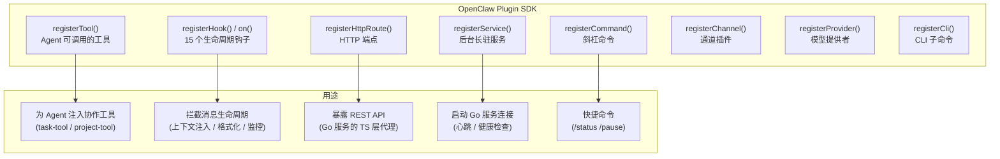
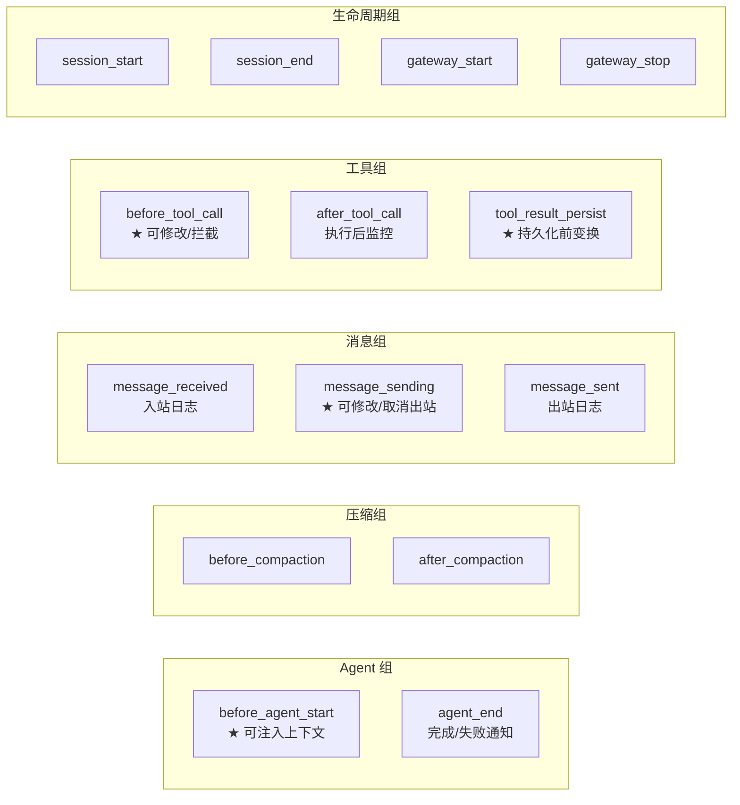

# OpenClaw 扩展能力分析 + 版本建议 + 升级指南

> 基于 OpenClaw 源码 (commit 2026.2.6-3 本地 + v2026.3.13 released) 的深度分析

---

## 1. 扩展能力全景

### 1.1 Plugin SDK 架构

OpenClaw 的插件系统是一个**完备的扩展框架**，通过 `openclaw/plugin-sdk` 导出，支持 8 种注册能力：



### 1.2 插件入口定义

源码路径: `src/plugins/types.ts`

```typescript
type OpenClawPluginDefinition = {
  id?: string;
  name?: string;
  description?: string;
  version?: string;
  kind?: PluginKind;          // "memory" | undefined
  configSchema?: OpenClawPluginConfigSchema;
  register?: (api: OpenClawPluginApi) => void | Promise<void>;
  activate?: (api: OpenClawPluginApi) => void | Promise<void>;
};
```

`OpenClawPluginApi` 提供完整的上下文访问：

| 属性 | 说明 |
|------|------|
| `api.config` | 当前 OpenClaw 全局配置 |
| `api.pluginConfig` | 插件私有配置 |
| `api.runtime` | 运行时 API (内存/媒体/通道/工具) |
| `api.logger` | 日志记录器 |
| `api.resolvePath()` | 路径解析 |

---

## 2. 生命周期钩子（核心扩展点）

### 2.1 完整钩子清单

源码路径: `src/plugins/types.ts` L287-301, `src/plugins/hooks.ts`

OpenClaw 原生支持 **15 个生命周期钩子**，分为 5 组：



### 2.2 关键钩子详解

#### `before_agent_start` — 上下文注入（最关键）

**执行方式**: 顺序执行，结果合并

```typescript
// 源码: src/plugins/hooks.ts L183-199
type PluginHookBeforeAgentStartEvent = {
  prompt: string;         // 用户发送的消息
  messages?: unknown[];   // 历史消息
};

type PluginHookBeforeAgentStartResult = {
  systemPrompt?: string;     // 覆盖系统提示词
  prependContext?: string;   // ★ 在用户消息前注入上下文
};
```

**合并策略**: 多个插件的 `prependContext` 会用 `\n\n` 连接；`systemPrompt` 后者覆盖前者。

**这是我们注入协作上下文（项目、任务、Agent 列表）的最佳切入点。**

#### `message_sending` — 出站消息修改

**执行方式**: 顺序执行，可修改内容或取消

```typescript
type PluginHookMessageSendingEvent = {
  to: string;
  content: string;
  metadata?: Record<string, unknown>;
};

type PluginHookMessageSendingResult = {
  content?: string;   // 修改消息内容（添加角色前缀）
  cancel?: boolean;   // 取消发送
};
```

**用途**: 在出站消息中添加 `【🏗️ 架构师】` 角色前缀。

#### `before_tool_call` — 工具调用拦截

**执行方式**: 顺序执行，可修改参数或拦截

```typescript
type PluginHookBeforeToolCallEvent = {
  toolName: string;           // "sessions_send" / "sessions_spawn" 等
  params: Record<string, unknown>;
};

type PluginHookBeforeToolCallResult = {
  params?: Record<string, unknown>;   // 修改参数
  block?: boolean;                     // 拦截
  blockReason?: string;
};
```

**用途**: 拦截 `sessions_send`/`sessions_spawn`，记录 Agent 间通信到 Go 服务。

#### `after_tool_call` — 工具执行监控

**执行方式**: 并行 fire-and-forget

```typescript
type PluginHookAfterToolCallEvent = {
  toolName: string;
  params: Record<string, unknown>;
  result?: unknown;
  error?: string;
  durationMs?: number;
};
```

**用途**: 监控 `sessions_send` 完成后更新任务状态，或记录工具执行异常。

#### `agent_end` — Agent 完成/失败通知

**执行方式**: 并行 fire-and-forget

```typescript
type PluginHookAgentEndEvent = {
  messages: unknown[];
  success: boolean;
  error?: string;
  durationMs?: number;
};
```

**用途**: Agent 失败时触发异常处理流程。

#### `tool_result_persist` — 工具结果变换

**执行方式**: 同步顺序执行

```typescript
type PluginHookToolResultPersistEvent = {
  toolName?: string;
  toolCallId?: string;
  message: AgentMessage;  // 即将写入会话记录的工具结果
  isSynthetic?: boolean;
};
```

**用途**: 精简 `query_tasks` 等大量返回的工具结果，减少 token 消耗。

### 2.3 钩子上下文信息

每个钩子组有独立的上下文类型，提供运行时信息：

| 上下文 | 提供信息 | 适用钩子 |
|--------|---------|----------|
| `PluginHookAgentContext` | `agentId`, `sessionKey`, `workspaceDir`, `messageProvider` | before_agent_start, agent_end, compaction |
| `PluginHookMessageContext` | `channelId`, `accountId`, `conversationId` | message_received/sending/sent |
| `PluginHookToolContext` | `agentId`, `sessionKey`, `toolName` | before_tool_call, after_tool_call |

---

## 3. Agent 间通信能力

### 3.1 sessions_spawn — 后台子代理

源码: `src/agents/tools/sessions-spawn-tool.ts`

```typescript
{
  name: "sessions_spawn",
  params: {
    task: string,             // 任务描述
    label?: string,           // 标签
    agentId?: string,         // 目标 Agent（跨 Agent 需要 allowAgents 配置）
    model?: string,           // 模型覆盖
    thinking?: string,        // 思考级别
    runTimeoutSeconds?: number, // 超时
    cleanup?: "delete" | "keep"
  }
}
```

**关键发现**:
- 子代理会话 key 格式: `agent:{targetAgentId}:subagent:{uuid}`
- 禁止从 subagent 会话再次 spawn（防止无限嵌套）
- 跨 Agent spawn 需在 `openclaw.json` 配置 `subagents.allowAgents`
- 原生支持模型覆盖和思考级别

### 3.2 sessions_send — Agent 间消息

源码: `src/agents/tools/sessions-send-tool.ts`

- 支持 Agent-to-Agent (A2A) 消息，需配置 `tools.agentToAgent.enabled=true`
- 支持 **ping-pong 多轮对话**（`maxPingPongTurns`）
- 发送后可等待回复或异步处理

### 3.3 agents_list — Agent 发现

源码: `src/agents/tools/agents-list-tool.ts`

- 基于 `subagents.allowAgents` 配置返回可调用的 Agent 列表
- 返回 `id`, `name`, `configured` 字段

---

## 4. 记忆系统

### 4.1 短期记忆 — 会话转录

OpenClaw 管理每个 Agent 的会话转录（session transcript），包含完整的用户/Agent 对话历史。当 token 接近上下文窗口限制时，触发 **compaction（压缩）**。

### 4.2 记忆冲刷（memoryFlush）

源码: `src/auto-reply/reply/memory-flush.ts`

**触发条件**: `totalTokens >= contextWindow - reserveTokensFloor - softThresholdTokens`

**流程**:
1. 压缩前，OpenClaw 自动触发一个特殊 turn
2. Agent 被要求将重要信息写入 `memory/YYYY-MM-DD.md`
3. 写入完成后执行 compaction，截断旧对话

**配置**:
```json5
{
  agents: {
    defaults: {
      compaction: {
        memoryFlush: {
          enabled: true,
          softThresholdTokens: 4000,
          systemPrompt: "Pre-compaction memory flush...",
          prompt: "Store durable memories now..."
        }
      }
    }
  }
}
```

### 4.3 向量记忆搜索（memory_search）

源码: `src/config/types.tools.ts` L224-324

OpenClaw 原生支持 **混合 BM25 + 向量搜索**，使用 **sqlite-vec** 扩展：

| 配置项 | 说明 | 默认值 |
|--------|------|--------|
| `memorySearch.enabled` | 启用向量搜索 | true |
| `memorySearch.provider` | 嵌入提供者 | openai / gemini / local / voyage |
| `memorySearch.fallback` | 降级提供者 | openai |
| `memorySearch.query.hybrid.enabled` | 混合搜索 | true |
| `memorySearch.query.hybrid.vectorWeight` | 向量权重 | 配置 |
| `memorySearch.query.hybrid.textWeight` | 文本权重 | 配置 |
| `memorySearch.sources` | 索引来源 | ["memory"] |

**重要发现**: V4 设计中引入 pgvector 是**不必要的**。OpenClaw 原生 sqlite-vec 已经提供了混合向量搜索能力。

### 4.4 Compaction 钩子

```
before_compaction → memoryFlush turn → after_compaction
```

插件可以在 `before_compaction` 中做额外的记忆保存（比如将任务状态同步到 Go 服务），在 `after_compaction` 后做清理。

---

## 5. 其他扩展能力

### 5.1 自定义 HTTP 端点

```typescript
api.registerHttpRoute({
  path: "/collab/status",
  handler: async (req, res) => { ... }
});
```

### 5.2 后台服务

```typescript
api.registerService({
  id: "collab-bridge",
  start: async (ctx) => {
    // 启动与 Go 服务的长连接
  },
  stop: async (ctx) => {
    // 清理连接
  }
});
```

### 5.3 自定义命令

```typescript
api.registerCommand({
  name: "status",
  description: "Show project task status",
  handler: async (ctx) => ({
    text: "Project P001: 5/12 tasks completed"
  })
});
```

### 5.4 HEARTBEAT.md

支持定时任务（默认 30 分钟），可用于：
- 检查 subagent 超时
- 催促进度
- 记忆整理

---

## 6. V3/V4 设计验证

### 6.1 Hook 映射对照表

| V3/V4 假设 | 实际 OpenClaw Hook | 验证结论 |
|------------|-------------------|---------|
| `onInbound` — 入站拦截，注入上下文 | `before_agent_start` 返回 `prependContext` | **✅ 完全可行**，且比假设更强（可修改 systemPrompt） |
| `onOutbound` — 出站格式化 | `message_sending` 修改 `content` | **✅ 完全可行**，还支持 `cancel` |
| `onAgentMessage` — Agent 间通信拦截 | `before_tool_call` 拦截 `sessions_send`/`sessions_spawn` | **✅ 可行**，需按 `toolName` 过滤 |
| `onError` — 异常捕获 | `agent_end` (success=false) + `after_tool_call` (error) | **⚠️ 部分可行**，不如假设的精细，需组合使用 |
| 自定义消息信封 | `before_agent_start.prependContext` + `message_sending.content` | **✅ 可行** |
| 上下文注入 | `before_agent_start.prependContext` | **✅ 源码确认** (hooks.ts L191-196) |
| pgvector 向量搜索 | OpenClaw 原生 sqlite-vec 混合搜索 | **❌ 不需要**，用原生即可 |

### 6.2 V4 疑问解决

| V4 疑问 | 源码验证结论 |
|---------|-------------|
| "Hook 点是假设" (B1) | **已验证**: 15 个原生钩子，API 类型完备 |
| "上下文注入方式不明" (B2) | **已验证**: `prependContext` 字符串拼接注入，多插件用 `\n\n` 合并 |
| "MEMORY.md 冲突" (B3) | **已澄清**: OpenClaw 管理短期会话 + memoryFlush，Go 管理结构化长期记忆，分工明确 |
| "HEARTBEAT.md 未利用" (B4) | **已确认**: 可配置定时触发，适合超时检测和记忆整理 |
| "需要 pgvector" (C) | **已否定**: sqlite-vec 已够用，无需引入额外组件 |

---

## 7. 版本建议

### 7.1 版本对比

| 版本 | 发布日期 | 关键特性 | 多 Agent 协作相关 |
|------|---------|---------|-----------------|
| 2026.2.6 | 早期 | 基础功能 | 缺少 A2A、sessions_yield |
| 2026.2.22 | 2 月 | 多语言记忆、40+ 安全修复 | 记忆系统改进 |
| 2026.2.26 | 2 月 | ACP thread-bound agents | Agent 隔离增强 |
| 2026.3.2 | 3 月 | SecretRef、出站适配器、memory/Ollama 嵌入 | 本地嵌入支持 |
| 2026.3.8 | 3 月 | - | ⚠️ sessions_spawn ACP 回归 Bug |
| **2026.3.12** | **3 月** | **sessions_yield、provider 插件、Dashboard v2、fast mode** | **编排增强** |
| **2026.3.13** | **3/14** | **浏览器自动化、安全修复、时区支持** | **最新稳定** |

### 7.2 推荐版本

**推荐: `v2026.3.13`（最新稳定版，你当前正在使用的版本）**

理由：
1. **`sessions_yield`** (3.12 引入): 编排器可立即结束当前 turn，携带 payload 到下一轮，对协调者 Agent 非常有用
2. **Provider 插件架构** (3.12): Ollama/vLLM 模块化，方便本地模型扩展
3. **Dashboard v2** (3.12): 原生 Web 管理界面，减少自建 Dashboard 的工作量
4. **plugin-sdk 构建修复** (3.13): 插件 SDK 不再重复打包共享 chunk，避免内存膨胀
5. **40+ 安全修复**: exec approval 全面加固
6. **sessions_spawn ACP 回归已修复**: 3.8 的 bug 在后续版本已修

**不推荐降级到更早版本**: 2026.3.12 之前缺少 `sessions_yield` 和 Dashboard v2，对多 Agent 编排不利。

### 7.3 升级指南

#### 从 2026.2.x 升级到 2026.3.13

```bash
# 1. 备份（必须！）
cp -r ~/.openclaw ~/.openclaw.backup.$(date +%Y%m%d)
cp ~/.openclaw/openclaw.json ~/.openclaw/openclaw.json.backup

# 2. 停止网关
openclaw gateway stop

# 3. 升级
npm install -g openclaw@2026.3.13

# 4. 验证版本
openclaw --version

# 5. 启动
openclaw gateway
```

#### 升级注意事项

| 注意点 | 说明 |
|--------|------|
| **Node.js 版本** | v2026.3.13 要求 Node >= 22.16.0，macOS 运行时发现会自动校验 |
| **breaking: sessions_spawn** | 3.8 曾有回归 `spawnedBy is only supported for subagent:*`，3.13 已修复。升级后需测试子代理功能 |
| **SecretRef** | 3.2 起支持 `$ref:secret:xxx` 引用，如使用了旧的明文密钥，建议迁移 |
| **A2A 配置** | 需确认 `tools.agentToAgent.enabled: true`（默认 false） |
| **plugin-sdk** | 3.13 修复了 plugin-sdk 打包问题。自定义插件需要重新 `npm install` 依赖 |
| **Feishu streaming** | 默认开启流式卡片输出。如有问题可设置 `channels.feishu.streaming: false` |

#### 升级后验证清单

```bash
# 基本功能
openclaw gateway status
openclaw --version

# 插件加载
openclaw plugins list

# 飞书连接
# 在飞书发消息测试

# 子代理功能
# 触发 sessions_spawn 测试
```

---

## 8. 对 V5 设计的启示

### 8.1 架构调整

| 方面 | V3/V4 方案 | 基于源码的正确方案 |
|------|-----------|-----------------|
| 消息管道 | 假设性 Hook | 使用 `before_agent_start` + `message_sending` + `before_tool_call` + `agent_end` |
| 上下文注入 | "注入到 Agent 上下文" | 使用 `before_agent_start` 返回 `prependContext` 字符串 |
| 向量搜索 | 引入 pgvector | 使用 OpenClaw 原生 sqlite-vec 混合搜索 |
| 短期记忆 | 忽略 | 利用 OpenClaw session transcript + memoryFlush + compaction 钩子 |
| Agent 发现 | 自建 | 复用 `agents_list` 工具 + Go 服务补充 |
| Subagent 管理 | 自建 | 复用 `sessions_spawn` 原生能力 + `after_tool_call` 监控 |

### 8.2 插件实现范式

```typescript
// 正确的插件开发模式
import type { OpenClawPluginDefinition } from "openclaw/plugin-sdk";

const plugin: OpenClawPluginDefinition = {
  id: "@team/collab",
  name: "Multi-Agent Collaboration",
  version: "1.0.0",

  register(api) {
    // 1. 注册协作工具
    api.registerTool(createTaskTool(api), { name: "create_task" });
    api.registerTool(updateTaskTool(api), { name: "update_task" });

    // 2. 注册生命周期钩子
    api.on("before_agent_start", injectCollabContext, { priority: 10 });
    api.on("message_sending", formatOutboundMessage, { priority: 10 });
    api.on("before_tool_call", interceptAgentComm, { priority: 10 });
    api.on("agent_end", handleAgentEnd, { priority: 10 });
    api.on("before_compaction", syncMemoryToGo, { priority: 10 });

    // 3. 注册快捷命令
    api.registerCommand({
      name: "status",
      description: "Project & task status",
      handler: statusCommandHandler,
    });

    // 4. 启动 Go 服务桥接
    api.registerService({
      id: "collab-bridge",
      start: (ctx) => startGoBridge(ctx),
    });
  }
};

export default plugin;
```
