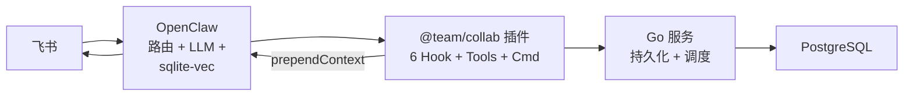
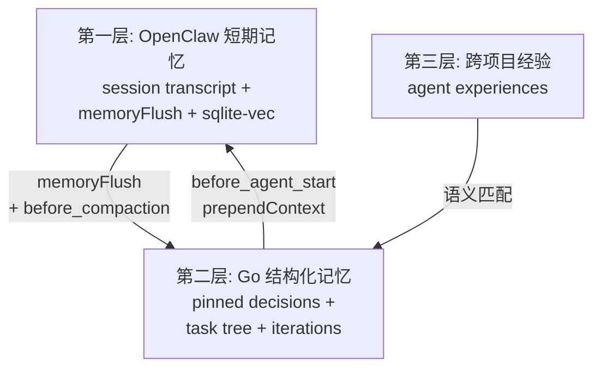
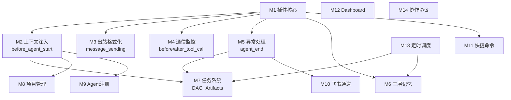
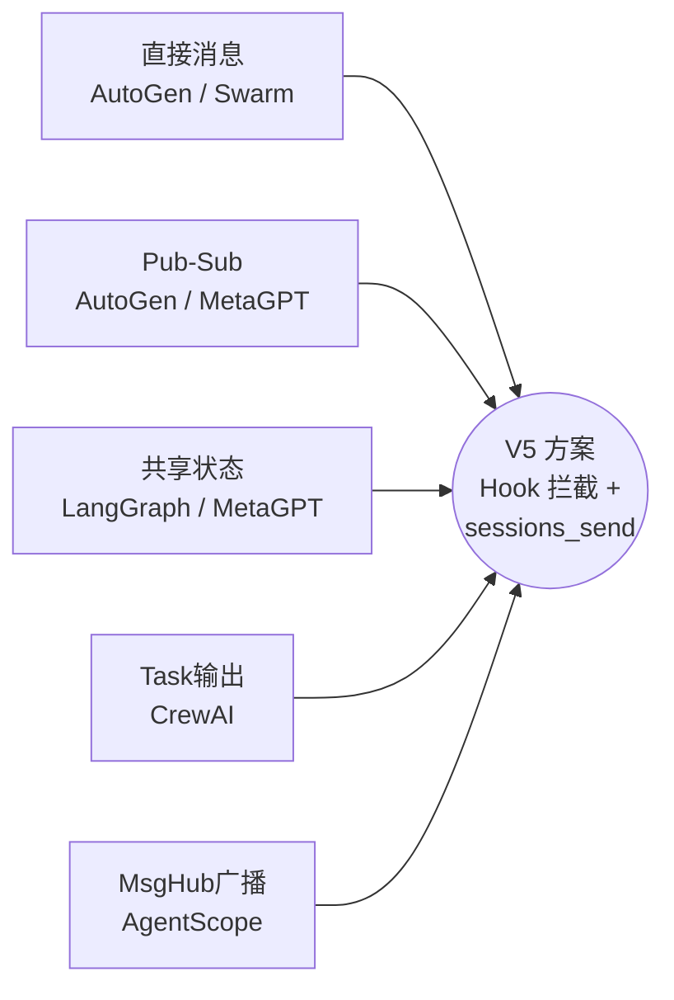
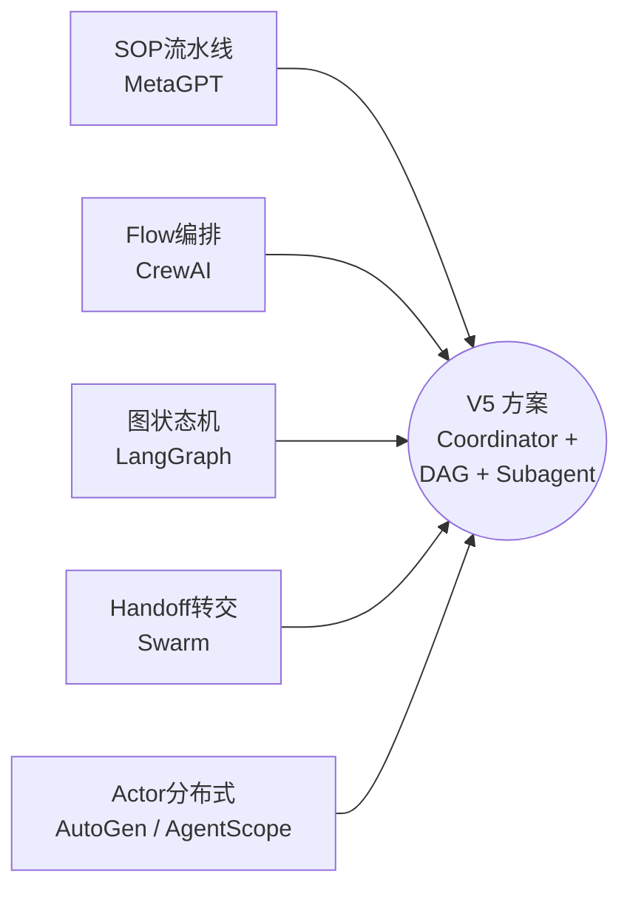
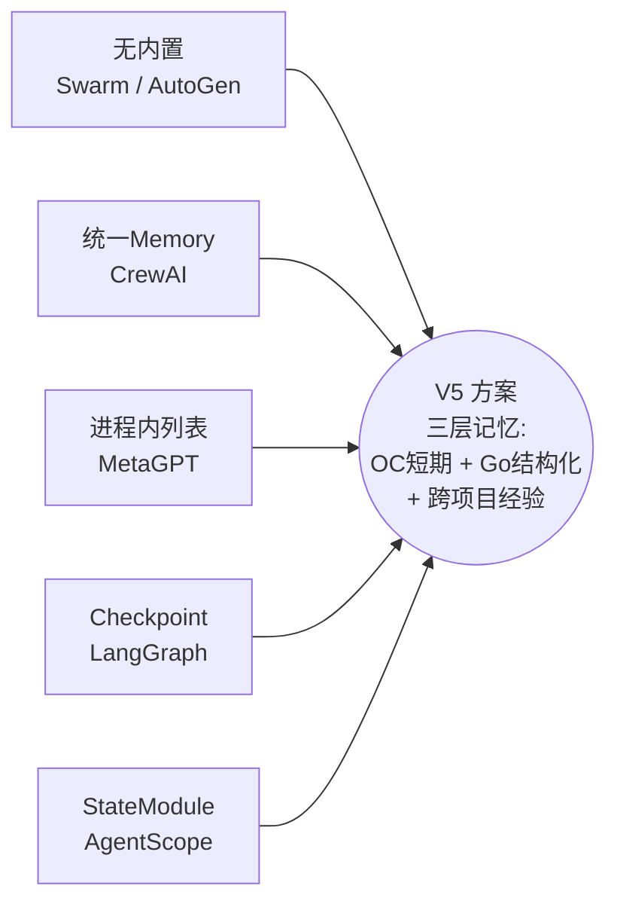

# 多 Agent 协作系统调研与设计 — 索引

## 概述

本目录包含对业界多 Agent 协作方案的全面调研（产品、开源框架、学术论文），以及基于 OpenClaw 的多 Agent 协作系统设计方案。

---

## 一、产品 & 开源框架调研

| # | 文件 | 框架 | 核心特点 | 定位 |
|---|------|------|---------|------|
| 1 | [01-autogen.md](./01-autogen.md) | Microsoft AutoGen v0.4+ | Actor 模型 + Pub-Sub + 跨语言 | 通用框架 |
| 2 | [02-crewai.md](./02-crewai.md) | CrewAI | Flow-First + 统一 Memory + 类型安全 | 生产级 |
| 3 | [03-metagpt.md](./03-metagpt.md) | MetaGPT | SOP 驱动 + 共享消息池 + 角色体系 | 软件工程 |
| 4 | [04-langgraph.md](./04-langgraph.md) | LangGraph | 图状态机 + Checkpoint + 有环图 | 底层编排 |
| 5 | [05-swarm.md](./05-swarm.md) | OpenAI Swarm | 轻量 Handoff + 函数路由 | 教育示例 |
| 6 | [06-camel.md](./06-camel.md) | CAMEL | 角色扮演 + Inception Prompting | 研究/数据 |
| 7 | [07-agentscope.md](./07-agentscope.md) | AgentScope (阿里) | Actor 分布式 + MsgHub + A2A 协议 | 企业级 |

## 二、学术研究专题

| # | 文件 | 主题 | 关键发现 |
|---|------|------|---------|
| 8 | [08-communication-protocols.md](./08-communication-protocols.md) | 通信协议 | 直接消息 vs 黑板 vs Pub-Sub |
| 9 | [09-task-orchestration.md](./09-task-orchestration.md) | 任务编排 | 层次化 vs 动态 vs 静态 |
| 10 | [10-shared-memory.md](./10-shared-memory.md) | 共享内存 | CoALA / Generative Agents / MemoryBank |
| 11 | [11-collaboration-patterns.md](./11-collaboration-patterns.md) | 协作模式 | 辩论 / 协调者-工作者 / 流水线 / Swarm |

## 三、设计方案

| # | 文件 | 版本 | 说明 |
|---|------|------|------|
| 12 | [12-openclaw-multi-agent-design.md](./12-openclaw-multi-agent-design.md) | V1 | 初版框架设计（已归档） |
| 13 | [12-openclaw-multi-agent-design-v2.md](./12-openclaw-multi-agent-design-v2.md) | V2 | 问题导向设计（已归档） |
| 14 | [12-openclaw-multi-agent-design-v3.md](./12-openclaw-multi-agent-design-v3.md) | V3 | 模块化基座方案（已归档） |
| 15 | [12-openclaw-multi-agent-design-v4.md](./12-openclaw-multi-agent-design-v4.md) | V4 | V3 + 协作拓扑 + 智能记忆（已归档） |
| **16** | **[12-openclaw-multi-agent-design-v5.md](./12-openclaw-multi-agent-design-v5.md)** | **V5** | **源码验证版：V3+V4 + Hook 落地 + 短期记忆整合 + 单插件架构（当前版本）** |

## 四、源码分析

| # | 文件 | 主题 |
|---|------|------|
| **17** | **[13-openclaw-extension-analysis.md](./13-openclaw-extension-analysis.md)** | **OpenClaw 扩展能力分析 + 版本建议 + 升级指南** |

---

## V5 方案要点速览

### 核心变更（相比 V3+V4）

| 变更项 | V3/V4 | V5 |
|--------|-------|-----|
| Hook 系统 | 4 个假设性 Hook | 6 个 OpenClaw 原生 Hook（源码验证） |
| 上下文注入 | "注入到上下文" | `before_agent_start.prependContext`（源码确认） |
| 向量搜索 | pgvector（额外组件） | OpenClaw 原生 sqlite-vec（去掉 pgvector） |
| 短期记忆 | 忽略 | 整合 session transcript + memoryFlush + compaction hooks |
| 插件架构 | 3 个独立插件 | 1 个统一插件 `@team/collab` |
| 协作拓扑 | V4 DAG + Artifacts | 保留 |

### 架构总览

### 三层记忆架构

### 14 个功能模块

---

## 横向对比速览

### 通信机制

### 编排模式

### 记忆系统

