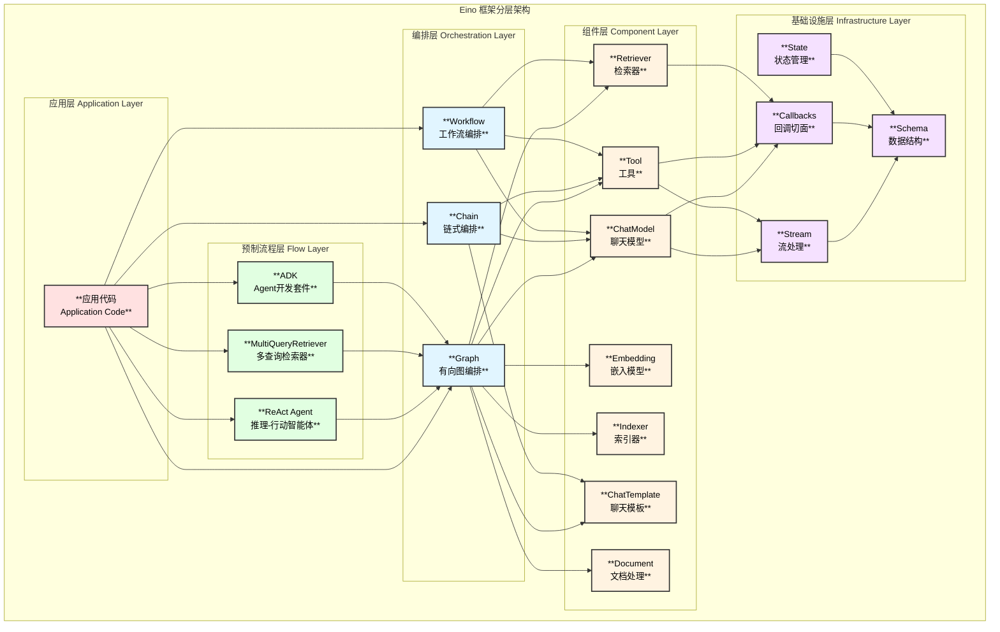
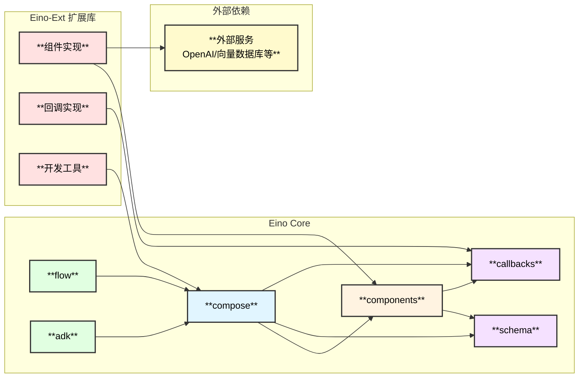

# Eino 框架架构总览

## 1. 框架简介

**Eino**（发音类似 "I know"）是字节跳动 CloudWeGo 团队开源的 Go 语言 LLM 应用开发框架。它借鉴了 LangChain、LlamaIndex 等优秀框架的设计理念，结合 Go 语言特性，提供了一套简洁、可扩展、可靠且高效的 LLM 应用开发解决方案。

### 核心价值

| 特性 | 描述 |
|------|------|
| **组件抽象** | 精心设计的组件接口，支持多种实现，易于复用和组合 |
| **强大编排** | 支持 Graph/Chain/Workflow 三种编排模式，自动处理类型检查、流处理、并发管理 |
| **流式处理** | 完整的流式处理能力，支持自动拼接、转换、合并、复制 |
| **切面机制** | 灵活的回调系统，支持日志、追踪、指标等横切关注点 |

## 2. 整体架构图



## 3. 核心模块说明

### 3.1 目录结构

```
eino/
├── components/          # 组件抽象层
│   ├── model/          # ChatModel 接口
│   ├── tool/           # Tool 接口
│   ├── retriever/      # Retriever 接口
│   ├── embedding/      # Embedding 接口
│   ├── indexer/        # Indexer 接口
│   ├── prompt/         # ChatTemplate 接口
│   └── document/       # Document Loader/Transformer 接口
├── compose/            # 编排层
│   ├── graph.go        # Graph 有向图编排
│   ├── chain.go        # Chain 链式编排
│   ├── workflow.go     # Workflow 工作流编排
│   ├── runnable.go     # Runnable 运行接口
│   ├── tool_node.go    # ToolsNode 工具节点
│   └── ...
├── schema/             # 数据结构定义
│   ├── message.go      # Message 消息结构
│   ├── stream.go       # Stream 流处理
│   ├── document.go     # Document 文档结构
│   └── tool.go         # Tool 工具结构
├── callbacks/          # 回调/切面机制
│   ├── interface.go    # 回调接口定义
│   └── handler_builder.go
├── adk/                # Agent Development Kit
│   ├── react.go        # ReAct 智能体
│   ├── flow.go         # 流程控制
│   └── ...
├── flow/               # 预制流程
│   ├── agent/          # 智能体实现
│   │   └── react/      # ReAct Agent
│   └── retriever/      # 检索器实现
└── internal/           # 内部实现
```

### 3.2 模块职责

| 模块 | 路径 | 职责 |
|------|------|------|
| **组件层** | `components/` | 定义 LLM 应用的基础组件接口，包括模型、工具、检索器等 |
| **编排层** | `compose/` | 提供 Graph/Chain/Workflow 三种编排方式，处理组件间的数据流和控制流 |
| **数据结构** | `schema/` | 定义核心数据结构，如 Message、Document、Stream 等 |
| **回调系统** | `callbacks/` | 提供切面机制，支持日志、追踪、监控等横切关注点 |
| **ADK** | `adk/` | Agent 开发套件，提供高级智能体构建能力 |
| **预制流程** | `flow/` | 提供开箱即用的 ReAct Agent、Retriever 等实现 |

## 4. 设计理念

### 4.1 组件透明性

Eino 采用接口抽象设计，组件实现对编排层透明：

```go
// 组件接口示例 - ChatModel
type BaseChatModel interface {
    Generate(ctx context.Context, input []*schema.Message, opts ...Option) (*schema.Message, error)
    Stream(ctx context.Context, input []*schema.Message, opts ...Option) (*schema.StreamReader[*schema.Message], error)
}

// 在编排中使用时，只关心接口，不关心具体实现
graph.AddChatModelNode("model", chatModel)
```

### 4.2 流式原生

框架原生支持流式处理，四种运行模式自动转换：

| 模式 | 输入 | 输出 | 说明 |
|------|------|------|------|
| **Invoke** | 非流 I | 非流 O | 同步调用 |
| **Stream** | 非流 I | 流 StreamReader[O] | 流式输出 |
| **Collect** | 流 StreamReader[I] | 非流 O | 流式输入 |
| **Transform** | 流 StreamReader[I] | 流 StreamReader[O] | 流式双向 |

### 4.3 类型安全

编译时类型检查，确保组件间的输入输出类型匹配：

```go
// 泛型 Graph，编译时检查类型
graph := compose.NewGraph[map[string]any, *schema.Message]()

// 类型不匹配会在编译时报错
```

## 5. 与其他框架对比

| 特性 | Eino | LangChain (Python) | LlamaIndex |
|------|------|-------------------|------------|
| **语言** | Go | Python | Python |
| **类型安全** | ✅ 编译时检查 | ❌ 运行时 | ❌ 运行时 |
| **流处理** | ✅ 原生支持 | ⚠️ 部分支持 | ⚠️ 部分支持 |
| **并发** | ✅ Goroutine原生 | ⚠️ 需要asyncio | ⚠️ 需要asyncio |
| **编排模式** | Graph/Chain/Workflow | Chain/Graph | Pipeline |
| **切面机制** | ✅ 完整支持 | ⚠️ 部分支持 | ⚠️ 部分支持 |

## 6. 依赖关系图



## 7. 快速开始示例

```go
package main

import (
    "context"
    "github.com/cloudwego/eino/compose"
    "github.com/cloudwego/eino/schema"
)

func main() {
    ctx := context.Background()
    
    // 1. 创建组件实例
    model, _ := openai.NewChatModel(ctx, config)
    
    // 2. 创建编排
    chain, _ := compose.NewChain[map[string]any, *schema.Message]().
        AppendChatTemplate(prompt).
        AppendChatModel(model).
        Compile(ctx)
    
    // 3. 执行
    result, _ := chain.Invoke(ctx, map[string]any{"query": "Hello!"})
}
```

---

> 📖 详细文档请参考各模块专题文档
