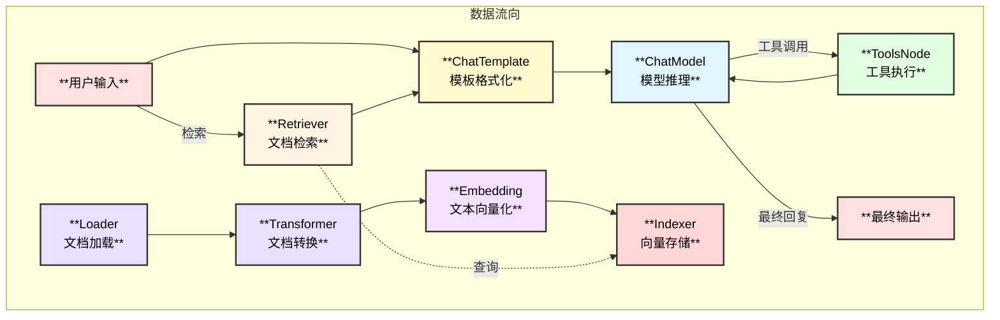

# Eino 组件系统详解

## 1. 组件系统概述

Eino 的组件系统是框架的基础层，提供了一套精心设计的接口抽象，将 LLM 应用开发中的常见构建块标准化。每个组件类型都有明确定义的输入输出类型、选项类型和流处理范式。

### 核心设计原则

- **接口抽象**：组件以接口形式定义，实现细节对编排层透明
- **可组合性**：组件可以自由组合，构建复杂的 LLM 应用
- **流式支持**：原生支持流式处理，适应 LLM 的实时输出特性
- **可扩展性**：易于添加新的组件实现

## 2. 组件类图

```mermaid
classDiagram
    class BaseChatModel {
        <<interface>>
        +Generate(ctx, messages, opts) Message, error
        +Stream(ctx, messages, opts) StreamReader~Message~, error
    }
    
    class ToolCallingChatModel {
        <<interface>>
        +WithTools(tools) ToolCallingChatModel, error
    }
    
    class ChatModel {
        <<interface>>
        +BindTools(tools) error
    }
    
    class BaseTool {
        <<interface>>
        +Info(ctx) ToolInfo, error
    }
    
    class InvokableTool {
        <<interface>>
        +InvokableRun(ctx, args, opts) string, error
    }
    
    class StreamableTool {
        <<interface>>
        +StreamableRun(ctx, args, opts) StreamReader~string~, error
    }
    
    class Retriever {
        <<interface>>
        +Retrieve(ctx, query, opts) Documents, error
    }
    
    class Embedder {
        <<interface>>
        +EmbedStrings(ctx, texts, opts) Embeddings, error
    }
    
    class Indexer {
        <<interface>>
        +Store(ctx, docs, opts) IDs, error
    }
    
    class ChatTemplate {
        <<interface>>
        +Format(ctx, data, opts) Messages, error
    }
    
    class Loader {
        <<interface>>
        +Load(ctx, opts) Documents, error
    }
    
    class Transformer {
        <<interface>>
        +Transform(ctx, docs, opts) Documents, error
    }
    
    BaseChatModel <|-- ToolCallingChatModel
    BaseChatModel <|-- ChatModel
    BaseTool <|-- InvokableTool
    BaseTool <|-- StreamableTool

    style BaseChatModel fill:#ffe1e1,stroke:#333,stroke-width:2px,color:#000
    style ToolCallingChatModel fill:#ffe1e1,stroke:#333,stroke-width:2px,color:#000
    style ChatModel fill:#ffe1e1,stroke:#333,stroke-width:2px,color:#000
    style BaseTool fill:#e1ffe1,stroke:#333,stroke-width:2px,color:#000
    style InvokableTool fill:#e1ffe1,stroke:#333,stroke-width:2px,color:#000
    style StreamableTool fill:#e1ffe1,stroke:#333,stroke-width:2px,color:#000
    style Retriever fill:#e1f5ff,stroke:#333,stroke-width:2px,color:#000
    style Embedder fill:#fff3e1,stroke:#333,stroke-width:2px,color:#000
    style Indexer fill:#f5e1ff,stroke:#333,stroke-width:2px,color:#000
    style ChatTemplate fill:#fffacd,stroke:#333,stroke-width:2px,color:#000
    style Loader fill:#ffd7d7,stroke:#333,stroke-width:2px,color:#000
    style Transformer fill:#ffd7d7,stroke:#333,stroke-width:2px,color:#000
```



## 3. 核心组件详解

### 3.1 ChatModel - 聊天模型

ChatModel 是 Eino 最核心的组件，用于与大语言模型交互。

#### 接口定义

```go
// 位置: components/model/interface.go

// BaseChatModel 基础聊天模型接口
type BaseChatModel interface {
    // Generate 同步生成响应
    Generate(ctx context.Context, input []*schema.Message, opts ...Option) (*schema.Message, error)
    
    // Stream 流式生成响应
    Stream(ctx context.Context, input []*schema.Message, opts ...Option) (
        *schema.StreamReader[*schema.Message], error)
}

// ToolCallingChatModel 支持工具调用的聊天模型（推荐）
type ToolCallingChatModel interface {
    BaseChatModel
    
    // WithTools 返回绑定工具后的新实例，线程安全
    WithTools(tools []*schema.ToolInfo) (ToolCallingChatModel, error)
}
```

#### 输入输出类型

| 方向 | 类型 | 说明 |
|------|------|------|
| **输入** | `[]*schema.Message` | 消息历史列表 |
| **输出** | `*schema.Message` 或 `*StreamReader[*schema.Message]` | 模型响应 |

#### 使用示例

```go
// 创建模型（来自 eino-ext）
model, err := openai.NewChatModel(ctx, &openai.ChatModelConfig{
    Model: "gpt-4o",
})

// 直接使用
message, err := model.Generate(ctx, []*schema.Message{
    schema.SystemMessage("You are a helpful assistant."),
    schema.UserMessage("Hello!"),
})

// 流式使用
stream, err := model.Stream(ctx, messages)
for {
    chunk, err := stream.Recv()
    if errors.Is(err, io.EOF) {
        break
    }
    fmt.Print(chunk.Content)
}
```

### 3.2 Tool - 工具组件

Tool 组件允许 LLM 调用外部工具/函数来扩展能力。

#### 接口定义

```go
// 位置: components/tool/interface.go

// BaseTool 工具基础接口
type BaseTool interface {
    // Info 返回工具信息，用于 LLM 意图识别
    Info(ctx context.Context) (*schema.ToolInfo, error)
}

// InvokableTool 可调用工具
type InvokableTool interface {
    BaseTool
    // InvokableRun 执行工具，参数为 JSON 格式
    InvokableRun(ctx context.Context, argumentsInJSON string, opts ...Option) (string, error)
}

// StreamableTool 流式工具
type StreamableTool interface {
    BaseTool
    // StreamableRun 流式执行工具
    StreamableRun(ctx context.Context, argumentsInJSON string, opts ...Option) (*schema.StreamReader[string], error)
}
```

#### 工具信息结构

```go
// schema/tool.go
type ToolInfo struct {
    Name        string                 // 工具名称
    Desc        string                 // 工具描述
    ParamsOneOf []ParameterInfo        // 参数定义
}

type ParameterInfo struct {
    Type       string                  // 参数类型
    Desc       string                  // 参数描述
    Required   bool                    // 是否必需
    Properties map[string]*ParameterInfo
}
```

#### 使用示例

```go
// 定义工具
type WeatherTool struct{}

func (t *WeatherTool) Info(ctx context.Context) (*schema.ToolInfo, error) {
    return &schema.ToolInfo{
        Name: "get_weather",
        Desc: "Get current weather for a city",
        ParamsOneOf: []schema.ParameterInfo{{
            Type: "object",
            Properties: map[string]*schema.ParameterInfo{
                "city": {Type: "string", Desc: "City name", Required: true},
            },
        }},
    }, nil
}

func (t *WeatherTool) InvokableRun(ctx context.Context, args string, opts ...tool.Option) (string, error) {
    var params struct{ City string }
    json.Unmarshal([]byte(args), &params)
    return fmt.Sprintf("Weather in %s: Sunny, 25°C", params.City), nil
}
```

### 3.3 Retriever - 检索器

Retriever 用于从向量数据库或其他数据源检索相关文档。

#### 接口定义

```go
// 位置: components/retriever/interface.go

type Retriever interface {
    // Retrieve 根据查询检索相关文档
    Retrieve(ctx context.Context, query string, opts ...Option) ([]*schema.Document, error)
}
```

#### 常用选项

```go
// 设置返回文档数量
retriever.Retrieve(ctx, query, retriever.WithTopK(5))

// 设置相似度阈值
retriever.Retrieve(ctx, query, retriever.WithScoreThreshold(0.8))
```

### 3.4 Embedding - 嵌入模型

Embedding 将文本转换为向量表示，用于语义搜索。

#### 接口定义

```go
// 位置: components/embedding/interface.go

type Embedder interface {
    // EmbedStrings 将文本列表转换为向量
    EmbedStrings(ctx context.Context, texts []string, opts ...Option) ([][]float64, error)
}
```

### 3.5 ChatTemplate - 聊天模板

ChatTemplate 用于格式化 prompt，支持变量替换。

#### 接口定义

```go
// 位置: components/prompt/interface.go

type ChatTemplate interface {
    // Format 格式化模板，生成消息列表
    Format(ctx context.Context, vs map[string]any, opts ...Option) ([]*schema.Message, error)
}
```

#### 使用示例

```go
// 创建模板
tpl, _ := prompt.FromMessages(schema.FString, 
    schema.SystemMessage("You are a {role}."),
    schema.UserMessage("{query}"),
)

// 格式化
messages, _ := tpl.Format(ctx, map[string]any{
    "role":  "helpful assistant",
    "query": "Hello!",
})
```

### 3.6 Document 组件

#### Loader - 文档加载器

```go
// 位置: components/document/interface.go

type Loader interface {
    // Load 加载文档
    Load(ctx context.Context, opts ...Option) ([]*schema.Document, error)
}
```

#### Transformer - 文档转换器

```go
type Transformer interface {
    // Transform 转换文档（如分割、清洗）
    Transform(ctx context.Context, docs []*schema.Document, opts ...Option) ([]*schema.Document, error)
}
```

### 3.7 Indexer - 索引器

```go
// 位置: components/indexer/interface.go

type Indexer interface {
    // Store 将文档存储到索引
    Store(ctx context.Context, docs []*schema.Document, opts ...Option) ([]string, error)
}
```

## 4. 组件关系图



## 5. 组件选项机制

每个组件都支持选项模式进行配置：

```go
// 组件选项定义示例
type Option func(*Options)

type Options struct {
    Temperature float64
    MaxTokens   int
    TopK        int
}

// 创建选项
func WithTemperature(t float64) Option {
    return func(o *Options) {
        o.Temperature = t
    }
}

// 使用选项
model.Generate(ctx, messages, 
    model.WithTemperature(0.7),
    model.WithMaxTokens(1000),
)
```

## 6. 回调集成

组件可以集成回调机制，支持生命周期钩子：

```go
// 组件回调输入/输出结构
type CallbackInput struct {
    Messages []*schema.Message
    Config   *Config
    Extra    map[string]any
}

type CallbackOutput struct {
    Message *schema.Message
    Config  *Config
    Extra   map[string]any
}
```

## 7. 组件实现指南

### 实现 InvokableTool 示例

```go
type MyTool struct {
    config *Config
}

func NewMyTool(config *Config) *MyTool {
    return &MyTool{config: config}
}

func (t *MyTool) Info(ctx context.Context) (*schema.ToolInfo, error) {
    return &schema.ToolInfo{
        Name: "my_tool",
        Desc: "A custom tool",
        ParamsOneOf: []schema.ParameterInfo{...},
    }, nil
}

func (t *MyTool) InvokableRun(ctx context.Context, args string, opts ...tool.Option) (string, error) {
    // 解析参数
    var params MyParams
    if err := json.Unmarshal([]byte(args), &params); err != nil {
        return "", err
    }
    
    // 执行逻辑
    result := doSomething(params)
    
    return result, nil
}
```

## 8. 组件类型汇总

| 组件 | 输入类型 | 输出类型 | 支持流式 | 主要用途 |
|------|---------|---------|---------|---------|
| **ChatModel** | `[]*Message` | `*Message` | ✅ | LLM 交互 |
| **Tool** | `string (JSON)` | `string` | ✅ | 功能扩展 |
| **Retriever** | `string` | `[]*Document` | ❌ | 文档检索 |
| **Embedding** | `[]string` | `[][]float64` | ❌ | 文本向量化 |
| **ChatTemplate** | `map[string]any` | `[]*Message` | ❌ | Prompt 格式化 |
| **Loader** | `-` | `[]*Document` | ❌ | 文档加载 |
| **Transformer** | `[]*Document` | `[]*Document` | ❌ | 文档转换 |
| **Indexer** | `[]*Document` | `[]string` | ❌ | 向量存储 |

---

> 📖 组件实现详见 [eino-ext](https://github.com/cloudwego/eino-ext) 仓库
