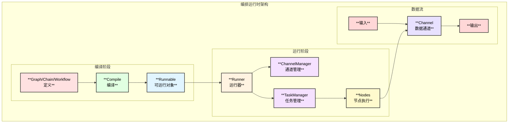
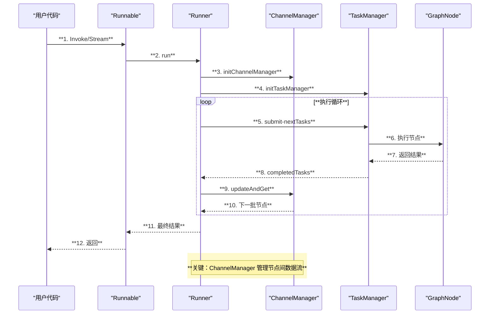
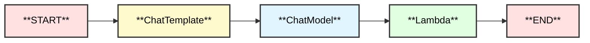
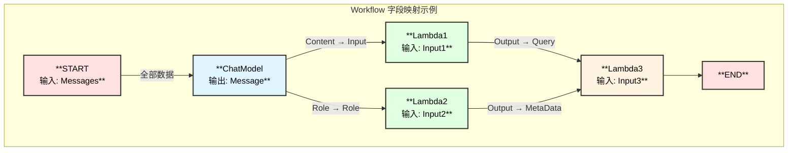

# Eino 编排系统详解

## 1. 编排系统概述

Eino 的编排系统是框架的核心能力之一，提供了三种编排方式来组合组件：

| API | 特性 | 适用场景 |
|-----|------|---------|
| **Chain** | 简单链式有向图，只能向前 | 线性处理流程 |
| **Graph** | 循环或非循环有向图，功能强大灵活 | 复杂业务逻辑，如 ReAct Agent |
| **Workflow** | 非循环图，支持字段级数据映射 | 需要精细数据控制的场景 |

### 核心能力

- **类型检查**：编译时确保节点间输入输出类型匹配
- **流处理**：自动处理流的拼接、转换、合并、复制
- **并发管理**：状态处理器线程安全，支持并发执行
- **切面注入**：自动注入回调切面
- **选项分配**：灵活的选项路由机制

## 2. 运行时架构



## 3. Graph 编排详解

### 3.1 基本概念

Graph 是最灵活的编排方式，支持循环和非循环有向图。

```go
// 创建 Graph
graph := compose.NewGraph[InputType, OutputType]()

// 添加节点
graph.AddChatModelNode("model", chatModel)
graph.AddToolsNode("tools", toolsNode)

// 添加边
graph.AddEdge(compose.START, "model")
graph.AddEdge("model", compose.END)

// 编译
runnable, err := graph.Compile(ctx)
```

### 3.2 Graph 执行时序图



### 3.3 Graph 核心结构

```go
// compose/graph.go
type graph struct {
    nodes        map[string]*graphNode     // 节点映射
    controlEdges map[string][]string       // 控制边（执行依赖）
    dataEdges    map[string][]string       // 数据边（数据流向）
    branches     map[string][]*GraphBranch // 分支条件
    startNodes   []string                  // 起始节点
    endNodes     []string                  // 结束节点
    
    stateType      reflect.Type            // 状态类型
    stateGenerator func(ctx context.Context) any // 状态生成器
    
    expectedInputType, expectedOutputType reflect.Type
}
```

### 3.4 添加节点方法

| 方法 | 组件类型 | 输入类型 | 输出类型 |
|------|---------|---------|---------|
| `AddChatModelNode` | ChatModel | `[]*Message` | `*Message` |
| `AddToolsNode` | ToolsNode | `*Message` | `[]*Message` |
| `AddChatTemplateNode` | ChatTemplate | `map[string]any` | `[]*Message` |
| `AddRetrieverNode` | Retriever | `string` | `[]*Document` |
| `AddEmbeddingNode` | Embedder | `[]string` | `[][]float64` |
| `AddLambdaNode` | Lambda | 自定义 | 自定义 |
| `AddGraphNode` | 子图 | 自定义 | 自定义 |
| `AddPassthroughNode` | 透传 | any | any |

### 3.5 分支控制

```go
// 创建分支条件
condition := func(ctx context.Context, msg *schema.Message) (string, error) {
    if len(msg.ToolCalls) > 0 {
        return "tools", nil  // 有工具调用，走工具节点
    }
    return compose.END, nil  // 直接结束
}

// 创建分支
branch := compose.NewGraphBranch(condition, map[string]bool{
    "tools":       true,
    compose.END:   true,
})

// 添加分支
graph.AddBranch("model", branch)
```

### 3.6 状态管理

```go
// 定义状态结构
type AgentState struct {
    Messages []Message
    Counter  int
}

// 创建带状态的 Graph
graph := compose.NewGraph[[]Message, Message](
    compose.WithGenLocalState(func(ctx context.Context) *AgentState {
        return &AgentState{Messages: make([]Message, 0)}
    }),
)

// 使用状态处理器
graph.AddChatModelNode("model", chatModel,
    compose.WithStatePreHandler(func(ctx context.Context, input []Message, state *AgentState) ([]Message, error) {
        state.Messages = append(state.Messages, input...)
        state.Counter++
        return state.Messages, nil
    }),
)
```

## 4. Chain 编排详解

### 4.1 Chain 概述

Chain 是简化版的 Graph，采用链式 API，适合线性处理流程。

```go
// 创建 Chain
chain := compose.NewChain[map[string]any, *schema.Message]()

// 链式添加节点
chain.AppendChatTemplate(chatTemplate).
      AppendChatModel(chatModel).
      AppendLambda(postProcess)

// 编译
runnable, err := chain.Compile(ctx)
```

### 4.2 Chain 结构



### 4.3 Chain 并行和分支

```go
// 并行执行
parallel := compose.NewParallel()
parallel.AddChatModel("openai", model1)
parallel.AddChatModel("claude", model2)
chain.AppendParallel(parallel)

// 条件分支
branch := compose.NewChainBranch(conditionFunc)
branch.AddChatTemplate("template1", tpl1)
branch.AddChatTemplate("template2", tpl2)
chain.AppendBranch(branch)
```

## 5. Workflow 编排详解

### 5.1 Workflow 概述

Workflow 支持字段级别的数据映射，适合复杂数据流控制。

```go
// 创建 Workflow
wf := compose.NewWorkflow[[]*schema.Message, *schema.Message]()

// 添加节点并指定输入映射
wf.AddChatModelNode("model", chatModel).AddInput(compose.START)

wf.AddLambdaNode("extract", extractLambda).
    AddInput("model", compose.MapFields("Content", "Input"))

wf.End().AddInput("extract")

// 编译
runnable, err := wf.Compile(ctx)
```

### 5.2 字段映射



## 6. Runnable 接口

编译后的 Graph/Chain/Workflow 都实现 Runnable 接口：

```go
type Runnable[I, O any] interface {
    // Invoke 同步调用：输入 I → 输出 O
    Invoke(ctx context.Context, input I, opts ...Option) (output O, err error)
    
    // Stream 流式输出：输入 I → 流输出 StreamReader[O]
    Stream(ctx context.Context, input I, opts ...Option) (output *schema.StreamReader[O], err error)
    
    // Collect 流式输入：流输入 StreamReader[I] → 输出 O
    Collect(ctx context.Context, input *schema.StreamReader[I], opts ...Option) (output O, err error)
    
    // Transform 双向流：流输入 StreamReader[I] → 流输出 StreamReader[O]
    Transform(ctx context.Context, input *schema.StreamReader[I], opts ...Option) (output *schema.StreamReader[O], err error)
}
```

## 7. 函数调用链

### 7.1 Graph.Compile 调用链

```
Graph.Compile - compose/generic_graph.go:123
├── compileAnyGraph - compose/generic_graph.go:127
│   ├── newGraphCompileOptions - compose/graph_compile_options.go
│   │   └── 处理编译选项
│   ├── graph.compile - compose/graph.go:639
│   │   ├── 验证图结构
│   │   │   └── validateDAG - compose/graph.go:1042
│   │   ├── 初始化通道
│   │   │   └── chanBuilder - compose/channel.go
│   │   ├── 编译节点
│   │   │   └── graphNode.compileIfNeeded - compose/graph_node.go
│   │   └── 创建 Runner
│   │       └── runner.toComposableRunnable - compose/graph_run.go:992
│   └── toGenericRunnable - compose/runnable.go:402
│       └── newRunnablePacker - compose/runnable.go:336
└── 返回 Runnable
```

### 7.2 Runnable.Invoke 调用链

```
Runnable.Invoke
├── runnablePacker.Invoke - compose/runnable.go:158
│   └── composableRunnable.i - compose/runnable.go:111
│       └── runner.invoke - compose/graph_run.go:86
│           └── runner.run - compose/graph_run.go:109
│               ├── initChannelManager - compose/graph_run.go:946
│               │   └── 创建节点通道
│               ├── initTaskManager - compose/graph_run.go:931
│               │   └── 创建任务管理器
│               └── **执行循环**
│                   ├── tm.submit - compose/runner.go
│                   │   └── 提交任务到协程池
│                   ├── tm.wait - compose/runner.go
│                   │   └── 等待任务完成
│                   ├── resolveCompletedTasks - compose/graph_run.go:826
│                   │   ├── 处理分支条件
│                   │   │   └── calculateBranch - compose/graph_run.go:864
│                   │   └── 更新通道值
│                   ├── cm.updateAndGet - compose/channel.go
│                   │   └── 计算下一批可执行节点
│                   └── createTasks - compose/graph_run.go:733
│                       └── 创建新任务
└── 返回结果
```

### 7.3 节点执行调用链

```
taskManager.submit
├── task.run - compose/runner.go
│   ├── preProcessor.handle - compose/graph_node.go
│   │   └── statePreHandler 执行
│   ├── composableRunnable.i/t - compose/runnable.go
│   │   └── **组件实际执行**
│   │       ├── ChatModel.Generate/Stream
│   │       ├── ToolsNode.Invoke/Stream
│   │       ├── Retriever.Retrieve
│   │       └── Lambda.Invoke/Transform
│   └── postProcessor.handle - compose/graph_node.go
│       └── statePostHandler 执行
└── 结果写入 done channel
```

## 8. 编译选项

```go
// 编译选项
runnable, err := graph.Compile(ctx,
    // 设置图名称
    compose.WithGraphName("my_graph"),
    
    // 设置最大运行步数（防止无限循环）
    compose.WithMaxRunSteps(20),
    
    // 设置节点触发模式
    compose.WithNodeTriggerMode(compose.AnyPredecessor),
    
    // 设置检查点存储
    compose.WithCheckpointStore(store),
    
    // 设置中断点
    compose.WithInterruptBefore("model"),
    compose.WithInterruptAfter("tools"),
)
```

## 9. 运行选项

```go
// 运行选项
result, err := runnable.Invoke(ctx, input,
    // 添加回调处理器
    compose.WithCallbacks(handler),
    
    // 设置特定组件选项
    compose.WithChatModelOption(model.WithTemperature(0.7)),
    
    // 设置特定节点选项
    compose.WithCallbacks(handler).DesignateNode("model"),
    
    // 设置检查点 ID
    compose.WithCheckpointID("session-123"),
)
```

## 10. 运行模式

### 10.1 Pregel 模式（默认）

- 支持循环图
- 节点可被多次执行
- 适合 ReAct Agent 等迭代场景

### 10.2 DAG 模式

- 仅支持有向无环图
- 每个节点只执行一次
- 适合 Workflow 等确定性流程

```go
// DAG 模式
runnable, err := graph.Compile(ctx,
    compose.WithNodeTriggerMode(compose.AllPredecessor),
)
```

## 11. 最佳实践

### 11.1 选择编排方式

| 场景 | 推荐方式 |
|------|---------|
| 简单线性流程 | Chain |
| 有条件分支/循环 | Graph |
| 需要字段映射 | Workflow |
| ReAct Agent | Graph + 状态管理 |

### 11.2 状态管理建议

```go
// ✅ 推荐：使用状态处理器
graph.AddChatModelNode("model", chatModel,
    compose.WithStatePreHandler(preHandler),
    compose.WithStatePostHandler(postHandler),
)

// ❌ 避免：直接操作外部状态
// 可能导致并发问题
```

### 11.3 错误处理

```go
runnable, err := graph.Compile(ctx)
if err != nil {
    // 编译时错误：类型不匹配、循环检测等
    log.Fatalf("compile error: %v", err)
}

result, err := runnable.Invoke(ctx, input)
if err != nil {
    // 运行时错误：组件执行失败等
    log.Errorf("invoke error: %v", err)
}
```

---

> 📖 更多示例请参考 [eino-examples](https://github.com/cloudwego/eino-examples)
