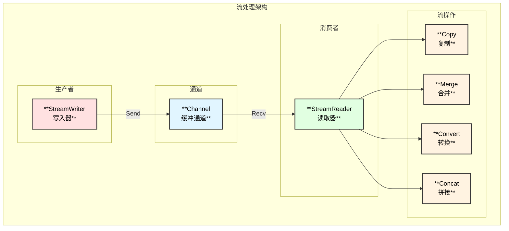
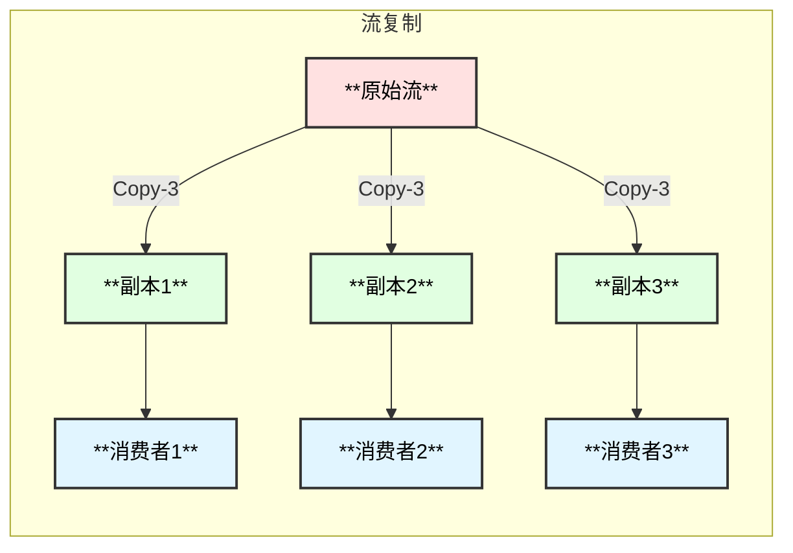
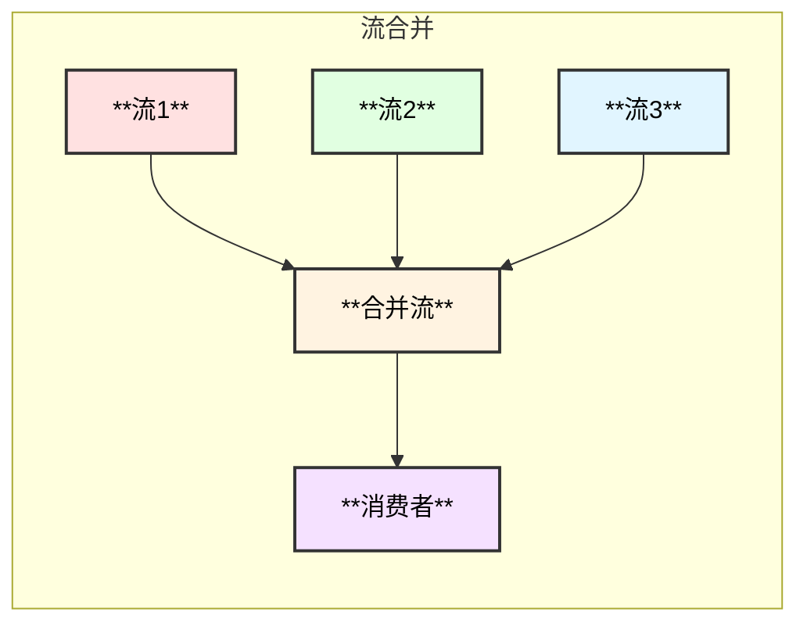
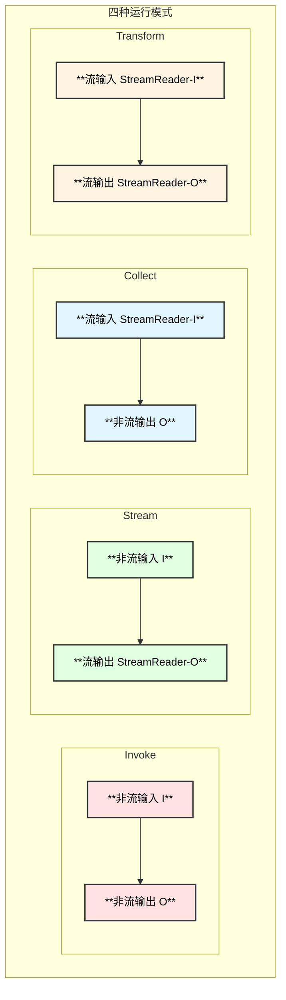
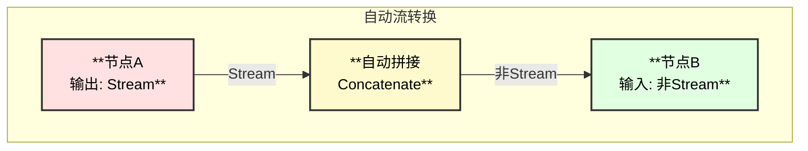
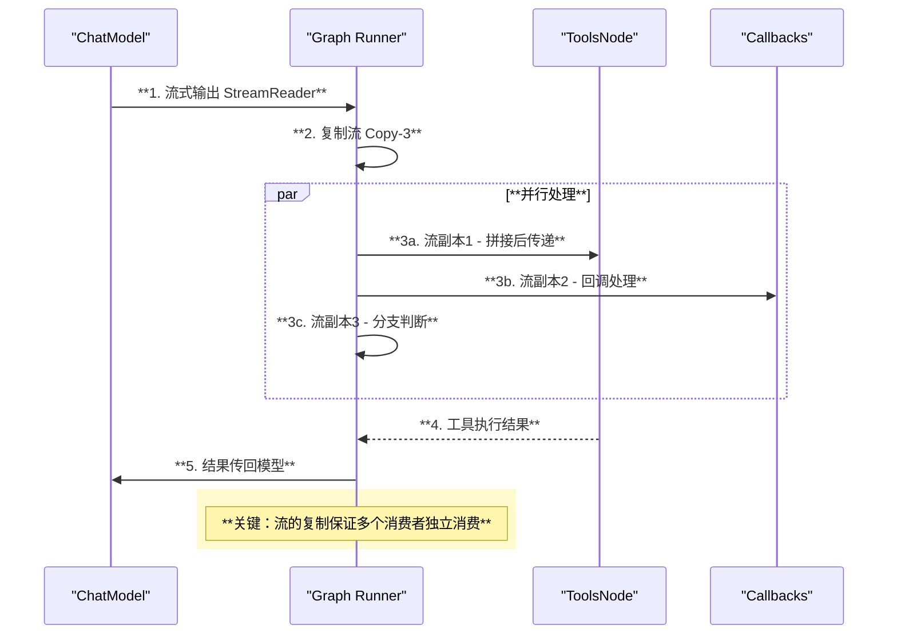

# Eino 流处理机制详解

## 1. 流处理概述

流处理是 Eino 框架的核心能力之一。由于大语言模型在生成响应时是逐 token 输出的，流式处理可以：

- **降低首字延迟**：用户能更快看到响应开始
- **提升用户体验**：实时显示生成内容
- **减少内存占用**：无需等待完整响应

Eino 提供了完整的流处理抽象，使得流式数据在组件间的传递变得透明和简单。

## 2. 核心概念

### 2.1 StreamReader 和 StreamWriter

```go
// 创建流管道
sr, sw := schema.Pipe[string](capacity)

// 发送数据
sw.Send("chunk1", nil)
sw.Send("chunk2", nil)
sw.Close()  // 必须关闭

// 接收数据
for {
    chunk, err := sr.Recv()
    if errors.Is(err, io.EOF) {
        break
    }
    process(chunk)
}
sr.Close()  // 必须关闭
```

### 2.2 流处理架构



## 3. StreamReader 详解

### 3.1 接口定义

```go
// schema/stream.go

type StreamReader[T any] struct {
    // 内部实现类型
    typ readerType
    
    // 不同实现
    st  *stream[T]           // 标准流
    ar  *arrayReader[T]      // 数组流
    msr *multiStreamReader[T] // 多流合并
    srw *streamReaderWithConvert[T] // 转换流
    csr *childStreamReader[T] // 复制子流
}

// 接收数据
func (sr *StreamReader[T]) Recv() (T, error)

// 关闭流
func (sr *StreamReader[T]) Close()

// 复制流
func (sr *StreamReader[T]) Copy(n int) []*StreamReader[T]

// 设置自动关闭
func (sr *StreamReader[T]) SetAutomaticClose()
```

### 3.2 StreamReader 类型

| 类型 | 说明 | 创建方式 |
|------|------|---------|
| **stream** | 标准流，基于 channel | `Pipe[T](cap)` |
| **arrayReader** | 数组流，内存中的数组 | `StreamReaderFromArray(arr)` |
| **multiStreamReader** | 多流合并 | `MergeStreamReaders(srs)` |
| **streamReaderWithConvert** | 类型转换流 | `StreamReaderWithConvert(sr, fn)` |
| **childStreamReader** | 复制流的子流 | `sr.Copy(n)` |

## 4. 流操作详解

### 4.1 流创建

```go
// 方式1：创建管道
sr, sw := schema.Pipe[string](3)
go func() {
    defer sw.Close()
    sw.Send("hello", nil)
    sw.Send("world", nil)
}()

// 方式2：从数组创建
sr := schema.StreamReaderFromArray([]string{"a", "b", "c"})
```

### 4.2 流复制 (Copy)

当需要将同一个流发送给多个消费者时，使用 Copy：



```go
// 复制流
sr := schema.StreamReaderFromArray([]int{1, 2, 3})
copies := sr.Copy(3)

// 每个副本独立消费
for _, copy := range copies {
    go func(s *schema.StreamReader[int]) {
        defer s.Close()
        for {
            v, err := s.Recv()
            if errors.Is(err, io.EOF) {
                break
            }
            process(v)
        }
    }(copy)
}
```

### 4.3 流合并 (Merge)

将多个流合并为一个流：



```go
// 合并多个流
sr1 := schema.StreamReaderFromArray([]string{"a", "b"})
sr2 := schema.StreamReaderFromArray([]string{"c", "d"})

merged := schema.MergeStreamReaders([]*schema.StreamReader[string]{sr1, sr2})
defer merged.Close()

// 注意：合并后的顺序不确定
for {
    v, err := merged.Recv()
    if errors.Is(err, io.EOF) {
        break
    }
    fmt.Println(v)  // 可能是 a, c, b, d 等任意顺序
}
```

### 4.4 流转换 (Convert)

将流中的元素类型转换：

```go
// 类型转换
intStream := schema.StreamReaderFromArray([]int{1, 2, 3})
stringStream := schema.StreamReaderWithConvert(intStream, func(i int) (string, error) {
    return fmt.Sprintf("num_%d", i), nil
})

// 过滤元素：返回 ErrNoValue 跳过该元素
filteredStream := schema.StreamReaderWithConvert(stream, func(s string) (string, error) {
    if len(s) == 0 {
        return "", schema.ErrNoValue  // 跳过空字符串
    }
    return s, nil
})
```

### 4.5 流拼接 (Concat)

将流中的所有元素拼接为单个值（在编排中自动处理）：

```go
// 框架内部实现
func concatStreamReader[T any](sr *StreamReader[T]) (T, error) {
    var result T
    for {
        chunk, err := sr.Recv()
        if errors.Is(err, io.EOF) {
            break
        }
        if err != nil {
            return result, err
        }
        result = concat(result, chunk)  // 根据类型拼接
    }
    return result, nil
}
```

## 5. 编排中的流处理

### 5.1 四种运行模式



### 5.2 自动流转换

编排系统会自动处理流的转换：



### 5.3 流处理场景

| 场景 | 自动处理 |
|------|---------|
| 流输出 → 非流输入 | 自动**拼接** |
| 非流输出 → 流输入 | 自动**装箱** |
| 多流汇聚到单节点 | 自动**合并** |
| 单流分散到多节点 | 自动**复制** |
| 流输出到回调 | 自动**复制** |

## 6. Lambda 节点的流处理

### 6.1 创建流式 Lambda

```go
// InvokableLambda - 非流输入，非流输出
lambda := compose.InvokableLambda(func(ctx context.Context, in string) (string, error) {
    return process(in), nil
})

// StreamableLambda - 非流输入，流输出
lambda := compose.StreamableLambda(func(ctx context.Context, in string) (*schema.StreamReader[string], error) {
    sr, sw := schema.Pipe[string](1)
    go func() {
        defer sw.Close()
        for _, chunk := range generateChunks(in) {
            sw.Send(chunk, nil)
        }
    }()
    return sr, nil
})

// CollectableLambda - 流输入，非流输出
lambda := compose.CollectableLambda(func(ctx context.Context, in *schema.StreamReader[string]) (string, error) {
    var result strings.Builder
    for {
        chunk, err := in.Recv()
        if errors.Is(err, io.EOF) {
            break
        }
        result.WriteString(chunk)
    }
    return result.String(), nil
})

// TransformableLambda - 流输入，流输出
lambda := compose.TransformableLambda(func(ctx context.Context, in *schema.StreamReader[string]) (*schema.StreamReader[string], error) {
    return schema.StreamReaderWithConvert(in, func(s string) (string, error) {
        return strings.ToUpper(s), nil
    }), nil
})
```

### 6.2 AnyLambda - 组合多种模式

```go
lambda := compose.AnyLambda(
    invokeFn,    // 可选
    streamFn,    // 可选
    collectFn,   // 可选
    transformFn, // 可选
)
```

## 7. 流处理时序图



## 8. 最佳实践

### 8.1 流的关闭

```go
// ✅ 推荐：使用 defer 确保关闭
sr, sw := schema.Pipe[string](1)

go func() {
    defer sw.Close()  // 生产者关闭写入
    sw.Send("data", nil)
}()

defer sr.Close()  // 消费者关闭读取
for {
    v, err := sr.Recv()
    if errors.Is(err, io.EOF) {
        break
    }
    process(v)
}
```

### 8.2 错误处理

```go
for {
    chunk, err := sr.Recv()
    if errors.Is(err, io.EOF) {
        break  // 正常结束
    }
    if err != nil {
        log.Errorf("stream error: %v", err)
        return err  // 处理错误
    }
    process(chunk)
}
```

### 8.3 避免内存泄漏

```go
// ✅ 使用 SetAutomaticClose 防止泄漏
sr.SetAutomaticClose()

// ❌ 避免：忘记关闭流
// sr := getStream()
// ... 使用后忘记关闭
```

### 8.4 流的并发安全

```go
// ✅ 流本身是并发安全的
// 但要注意复制后的独立消费

copies := sr.Copy(2)

go func() {
    defer copies[0].Close()
    // 独立消费副本0
}()

go func() {
    defer copies[1].Close()
    // 独立消费副本1
}()
```

## 9. 流处理内部实现

### 9.1 stream 结构

```go
// schema/stream.go
type stream[T any] struct {
    items  chan streamItem[T]  // 数据通道
    closed chan struct{}       // 关闭信号
    
    automaticClose bool        // 自动关闭标记
    closedFlag     *uint32     // 关闭状态原子量
}

type streamItem[T any] struct {
    chunk T
    err   error
}
```

### 9.2 复制实现

```go
// 复制流时创建共享的链表结构
type cpStreamElement[T any] struct {
    once sync.Once
    next *cpStreamElement[T]
    item streamItem[T]
}

// 每个子流独立维护读取位置
type childStreamReader[T any] struct {
    parent *parentStreamReader[T]
    index  int
}
```

---

> 📖 更多流处理示例请参考 `schema/stream_test.go`
