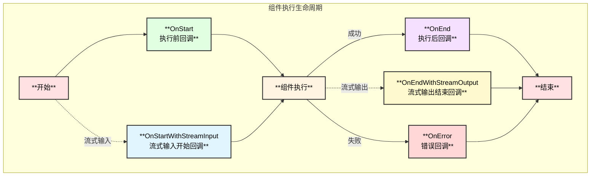
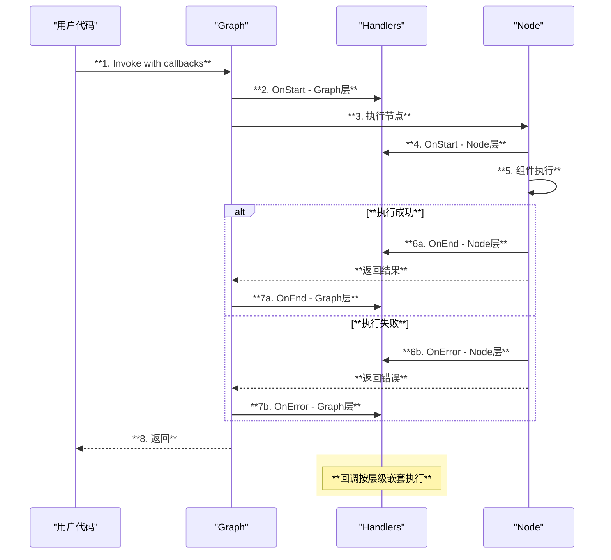
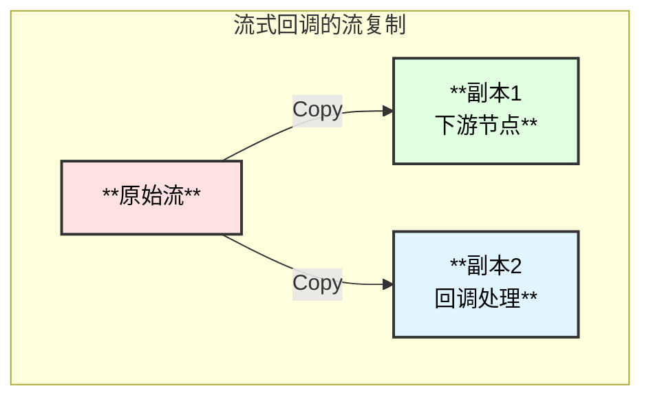

# Eino 回调/切面系统详解

## 1. 回调系统概述

Eino 的回调（Callback）系统提供了强大的切面编程能力，用于处理横切关注点：

- **日志记录**：记录组件执行过程
- **链路追踪**：分布式追踪支持
- **指标监控**：性能指标收集
- **调试分析**：开发调试辅助
- **内部细节暴露**：组件实现细节透出

## 2. 回调时机

### 2.1 五种切面时机



### 2.2 时机说明

| 时机 | 触发条件 | 用途 |
|------|---------|------|
| **OnStart** | 组件执行前（非流输入） | 记录输入、开始计时 |
| **OnStartWithStreamInput** | 组件执行前（流输入） | 处理流式输入 |
| **OnEnd** | 组件执行后（非流输出） | 记录输出、结束计时 |
| **OnEndWithStreamOutput** | 组件执行后（流输出） | 处理流式输出 |
| **OnError** | 组件执行出错 | 错误记录、告警 |

## 3. 核心接口

### 3.1 Handler 接口

```go
// callbacks/interface.go

// Handler 回调处理器接口
type Handler interface {
    OnStart(ctx context.Context, info *RunInfo, input CallbackInput) context.Context
    OnEnd(ctx context.Context, info *RunInfo, output CallbackOutput) context.Context
    OnError(ctx context.Context, info *RunInfo, err error) context.Context
    OnStartWithStreamInput(ctx context.Context, info *RunInfo, input *schema.StreamReader[CallbackInput]) context.Context
    OnEndWithStreamOutput(ctx context.Context, info *RunInfo, output *schema.StreamReader[CallbackOutput]) context.Context
}
```

### 3.2 RunInfo 结构

```go
// RunInfo 运行信息
type RunInfo struct {
    Name      string       // 节点/组件名称
    Type      string       // 组件实现类型
    Component string       // 组件类型
    Extra     map[string]any // 额外信息
}
```

### 3.3 CallbackInput/Output

```go
// 通用回调输入/输出类型
type CallbackInput = any
type CallbackOutput = any

// 组件特定的回调类型（示例：ChatModel）
// components/model/callback_extra.go
type CallbackInput struct {
    Messages []*schema.Message
    Config   *Config
    Extra    map[string]any
}

type CallbackOutput struct {
    Message *schema.Message
    Config  *Config
    Extra   map[string]any
}
```

## 4. 创建回调处理器

### 4.1 使用 HandlerBuilder

```go
handler := callbacks.NewHandlerBuilder().
    OnStartFn(func(ctx context.Context, info *callbacks.RunInfo, input callbacks.CallbackInput) context.Context {
        log.Printf("[%s] Start: input=%v", info.Name, input)
        return ctx
    }).
    OnEndFn(func(ctx context.Context, info *callbacks.RunInfo, output callbacks.CallbackOutput) context.Context {
        log.Printf("[%s] End: output=%v", info.Name, output)
        return ctx
    }).
    OnErrorFn(func(ctx context.Context, info *callbacks.RunInfo, err error) context.Context {
        log.Printf("[%s] Error: %v", info.Name, err)
        return ctx
    }).
    Build()
```

### 4.2 实现 Handler 接口

```go
type MyHandler struct{}

func (h *MyHandler) OnStart(ctx context.Context, info *callbacks.RunInfo, input callbacks.CallbackInput) context.Context {
    // 开始处理
    return ctx
}

func (h *MyHandler) OnEnd(ctx context.Context, info *callbacks.RunInfo, output callbacks.CallbackOutput) context.Context {
    // 结束处理
    return ctx
}

func (h *MyHandler) OnError(ctx context.Context, info *callbacks.RunInfo, err error) context.Context {
    // 错误处理
    return ctx
}

func (h *MyHandler) OnStartWithStreamInput(ctx context.Context, info *callbacks.RunInfo, input *schema.StreamReader[callbacks.CallbackInput]) context.Context {
    // 流输入处理
    return ctx
}

func (h *MyHandler) OnEndWithStreamOutput(ctx context.Context, info *callbacks.RunInfo, output *schema.StreamReader[callbacks.CallbackOutput]) context.Context {
    // 流输出处理
    return ctx
}
```

## 5. 使用回调

### 5.1 运行时添加回调

```go
// 创建回调处理器
handler := callbacks.NewHandlerBuilder().
    OnStartFn(onStart).
    OnEndFn(onEnd).
    Build()

// 运行时添加
result, err := runnable.Invoke(ctx, input, compose.WithCallbacks(handler))
```

### 5.2 指定节点回调

```go
// 只对特定节点添加回调
result, err := runnable.Invoke(ctx, input,
    compose.WithCallbacks(handler).DesignateNode("model"),
)

// 只对特定组件类型添加回调
result, err := runnable.Invoke(ctx, input,
    compose.WithChatModelOption(model.WithCallbacks(modelHandler)),
)
```

### 5.3 全局回调

```go
// 初始化全局回调
callbacks.AppendGlobalHandlers(
    loggingHandler,
    tracingHandler,
)
```

## 6. 回调流程图



## 7. 回调与流处理

### 7.1 流式回调处理

```go
handler := callbacks.NewHandlerBuilder().
    OnEndWithStreamOutputFn(func(ctx context.Context, info *callbacks.RunInfo, output *schema.StreamReader[callbacks.CallbackOutput]) context.Context {
        // 注意：流会被自动复制，回调获得独立副本
        go func() {
            defer output.Close()
            for {
                chunk, err := output.Recv()
                if errors.Is(err, io.EOF) {
                    break
                }
                // 处理流式输出
                processChunk(chunk)
            }
        }()
        return ctx
    }).
    Build()
```

### 7.2 流复制机制



## 8. TimingChecker 优化

### 8.1 接口定义

```go
// TimingChecker 检查处理器是否需要特定时机
type TimingChecker interface {
    Needed(timing CallbackTiming) bool
}

// CallbackTiming 回调时机枚举
const (
    TimingOnStart CallbackTiming = iota
    TimingOnEnd
    TimingOnError
    TimingOnStartWithStreamInput
    TimingOnEndWithStreamOutput
)
```

### 8.2 优化效果

实现 `TimingChecker` 可以跳过不需要的回调调用：

```go
type OptimizedHandler struct {
    needOnStart bool
    needOnEnd   bool
}

func (h *OptimizedHandler) Needed(timing callbacks.CallbackTiming) bool {
    switch timing {
    case callbacks.TimingOnStart:
        return h.needOnStart
    case callbacks.TimingOnEnd:
        return h.needOnEnd
    default:
        return false
    }
}
```

## 9. 组件特定回调类型

### 9.1 ChatModel 回调

```go
// 转换回调输入
modelInput := model.ConvCallbackInput(input)
if modelInput != nil {
    // 处理 ChatModel 输入
    messages := modelInput.Messages
    config := modelInput.Config
}

// 转换回调输出
modelOutput := model.ConvCallbackOutput(output)
if modelOutput != nil {
    // 处理 ChatModel 输出
    message := modelOutput.Message
}
```

### 9.2 Retriever 回调

```go
// 转换回调输入
retrieverInput := retriever.ConvCallbackInput(input)
if retrieverInput != nil {
    query := retrieverInput.Query
}

// 转换回调输出
retrieverOutput := retriever.ConvCallbackOutput(output)
if retrieverOutput != nil {
    docs := retrieverOutput.Documents
}
```

## 10. 实践示例

### 10.1 日志记录

```go
loggingHandler := callbacks.NewHandlerBuilder().
    OnStartFn(func(ctx context.Context, info *callbacks.RunInfo, input callbacks.CallbackInput) context.Context {
        log.Printf("[%s][%s] Start", info.Component, info.Name)
        return context.WithValue(ctx, "startTime", time.Now())
    }).
    OnEndFn(func(ctx context.Context, info *callbacks.RunInfo, output callbacks.CallbackOutput) context.Context {
        startTime := ctx.Value("startTime").(time.Time)
        duration := time.Since(startTime)
        log.Printf("[%s][%s] End, duration=%v", info.Component, info.Name, duration)
        return ctx
    }).
    OnErrorFn(func(ctx context.Context, info *callbacks.RunInfo, err error) context.Context {
        log.Printf("[%s][%s] Error: %v", info.Component, info.Name, err)
        return ctx
    }).
    Build()
```

### 10.2 OpenTelemetry 追踪

```go
tracingHandler := callbacks.NewHandlerBuilder().
    OnStartFn(func(ctx context.Context, info *callbacks.RunInfo, input callbacks.CallbackInput) context.Context {
        ctx, span := tracer.Start(ctx, info.Name,
            trace.WithAttributes(
                attribute.String("component", info.Component),
                attribute.String("type", info.Type),
            ),
        )
        return context.WithValue(ctx, "span", span)
    }).
    OnEndFn(func(ctx context.Context, info *callbacks.RunInfo, output callbacks.CallbackOutput) context.Context {
        if span, ok := ctx.Value("span").(trace.Span); ok {
            span.End()
        }
        return ctx
    }).
    OnErrorFn(func(ctx context.Context, info *callbacks.RunInfo, err error) context.Context {
        if span, ok := ctx.Value("span").(trace.Span); ok {
            span.RecordError(err)
            span.SetStatus(codes.Error, err.Error())
            span.End()
        }
        return ctx
    }).
    Build()
```

### 10.3 Token 计数

```go
tokenCountHandler := callbacks.NewHandlerBuilder().
    OnEndFn(func(ctx context.Context, info *callbacks.RunInfo, output callbacks.CallbackOutput) context.Context {
        if info.Component == "ChatModel" {
            if modelOutput := model.ConvCallbackOutput(output); modelOutput != nil {
                if usage, ok := modelOutput.Extra["usage"].(map[string]int); ok {
                    metrics.RecordTokenUsage(
                        usage["prompt_tokens"],
                        usage["completion_tokens"],
                    )
                }
            }
        }
        return ctx
    }).
    Build()
```

## 11. 最佳实践

### 11.1 回调性能

```go
// ✅ 推荐：实现 TimingChecker
type MyHandler struct{}

func (h *MyHandler) Needed(timing callbacks.CallbackTiming) bool {
    return timing == callbacks.TimingOnEnd  // 只需要 OnEnd
}

// ✅ 推荐：异步处理耗时操作
func (h *MyHandler) OnEnd(ctx context.Context, info *callbacks.RunInfo, output callbacks.CallbackOutput) context.Context {
    go func() {
        // 异步记录日志
        writeToLogStorage(info, output)
    }()
    return ctx
}
```

### 11.2 上下文传递

```go
// ✅ 推荐：通过 context 传递数据
func onStart(ctx context.Context, info *callbacks.RunInfo, input callbacks.CallbackInput) context.Context {
    return context.WithValue(ctx, "requestID", uuid.New().String())
}

func onEnd(ctx context.Context, info *callbacks.RunInfo, output callbacks.CallbackOutput) context.Context {
    requestID := ctx.Value("requestID").(string)
    log.Printf("Request %s completed", requestID)
    return ctx
}
```

### 11.3 错误处理

```go
// ✅ 推荐：回调中不要 panic
func onError(ctx context.Context, info *callbacks.RunInfo, err error) context.Context {
    defer func() {
        if r := recover(); r != nil {
            log.Printf("Callback panic recovered: %v", r)
        }
    }()
    
    // 安全的错误处理
    recordError(err)
    return ctx
}
```

---

> 📖 回调实现示例请参考 [eino-ext/callbacks](https://github.com/cloudwego/eino-ext/tree/main/callbacks)
