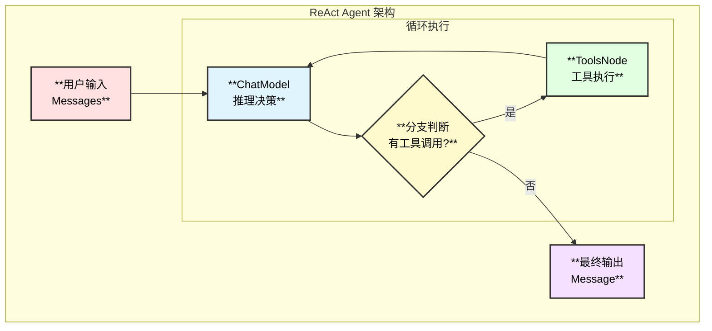
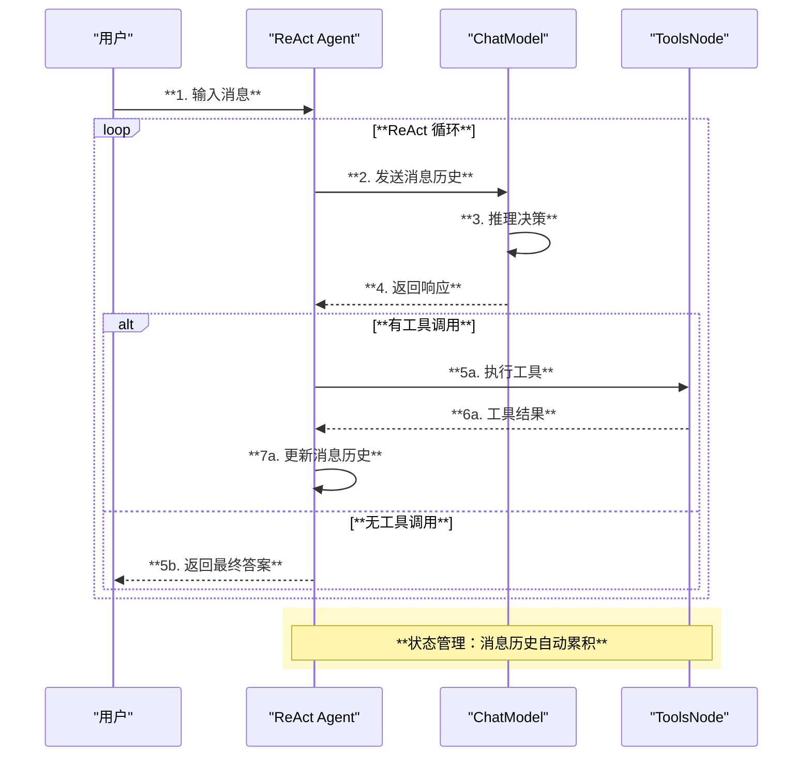
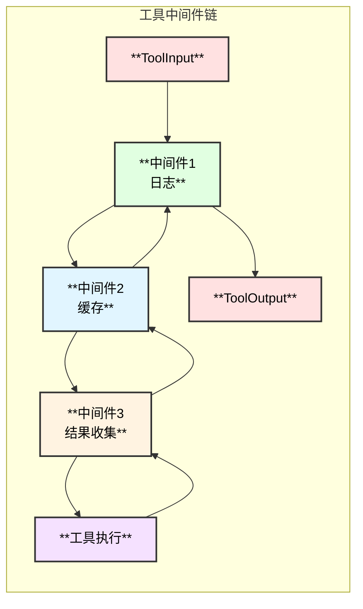
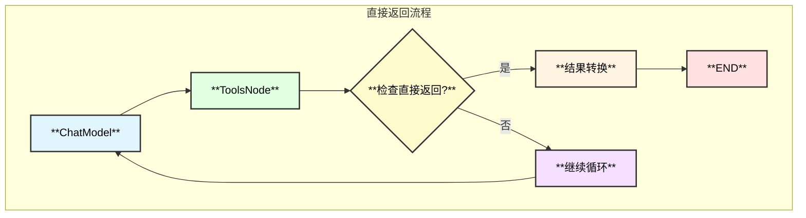

# Eino ADK 与 ReAct Agent 详解

## 1. ADK 概述

ADK（Agent Development Kit）是 Eino 提供的智能体开发套件，基于框架的编排能力构建，提供了高级抽象来简化 Agent 的开发。

### 核心能力

- **ReAct Agent**：推理-行动智能体实现
- **状态管理**：Agent 运行时状态管理
- **工具调用**：工具中间件和结果收集
- **中断恢复**：支持 Human-in-the-loop

## 2. ReAct Agent 架构

### 2.1 ReAct 模式

ReAct（Reasoning + Acting）是一种 LLM Agent 设计模式：

1. **推理（Reasoning）**：LLM 分析输入，决定下一步行动
2. **行动（Acting）**：执行工具调用
3. **观察（Observation）**：将工具结果反馈给 LLM
4. **循环**：重复直到 LLM 给出最终答案

### 2.2 架构图



### 2.3 执行时序图



## 3. flow/agent/react 实现

### 3.1 AgentConfig 配置

```go
// flow/agent/react/react.go

type AgentConfig struct {
    // ToolCallingModel 支持工具调用的聊天模型（推荐）
    ToolCallingModel model.ToolCallingChatModel
    
    // Model 旧版聊天模型接口（已废弃）
    Model model.ChatModel
    
    // ToolsConfig 工具配置
    ToolsConfig compose.ToolsNodeConfig
    
    // MessageModifier 消息修改器，在模型调用前修改输入
    MessageModifier MessageModifier
    
    // MessageRewriter 消息重写器，修改状态中的消息
    MessageRewriter MessageModifier
    
    // MaxStep 最大步数，默认 12
    MaxStep int
    
    // ToolReturnDirectly 直接返回的工具列表
    ToolReturnDirectly map[string]struct{}
    
    // StreamToolCallChecker 流式工具调用检查器
    StreamToolCallChecker func(ctx context.Context, modelOutput *schema.StreamReader[*schema.Message]) (bool, error)
    
    // 节点命名配置
    GraphName     string
    ModelNodeName string
    ToolsNodeName string
}
```

### 3.2 创建 Agent

```go
// 创建 ReAct Agent
agent, err := react.NewAgent(ctx, &react.AgentConfig{
    ToolCallingModel: chatModel,
    ToolsConfig: compose.ToolsNodeConfig{
        Tools: []tool.BaseTool{
            weatherTool,
            calculatorTool,
        },
    },
    MessageModifier: react.NewPersonaModifier("You are a helpful assistant."),
    MaxStep: 20,
})
if err != nil {
    return err
}

// 使用 Agent
response, err := agent.Generate(ctx, []*schema.Message{
    schema.UserMessage("What's the weather in Beijing?"),
})
```

### 3.3 核心实现函数调用链

```
react.NewAgent - flow/agent/react/react.go:250
├── genToolInfos - flow/agent/react/react.go:417
│   └── 获取所有工具信息
├── agent.ChatModelWithTools - flow/agent/agent.go
│   └── 将工具绑定到模型
├── compose.NewToolNode - compose/tool_node.go:169
│   └── 创建工具节点
├── compose.NewGraph - compose/generic_graph.go:72
│   ├── WithGenLocalState - 创建状态生成器
│   │   └── state{Messages, ReturnDirectlyToolCallID}
│   └── 初始化图结构
├── graph.AddChatModelNode - compose/graph.go:350
│   └── WithStatePreHandler - 消息历史处理
├── graph.AddToolsNode - compose/graph.go:375
│   └── WithStatePreHandler - 工具调用处理
├── graph.AddEdge - 添加边
│   └── START -> model
├── graph.AddBranch - 添加分支
│   └── model -> tools/END
├── buildReturnDirectly - 构建直接返回逻辑
│   └── 处理 ToolReturnDirectly
└── graph.Compile - 编译图
    └── 返回 Runnable
```

### 3.4 状态结构

```go
// 内部状态
type state struct {
    // Messages 消息历史
    Messages []*schema.Message
    
    // ReturnDirectlyToolCallID 直接返回的工具调用 ID
    ReturnDirectlyToolCallID string
}
```

## 4. adk 模块实现

### 4.1 ADK State

```go
// adk/react.go

type State struct {
    // Messages 消息历史
    Messages []Message
    
    // HasReturnDirectly 是否有直接返回
    HasReturnDirectly bool
    
    // ReturnDirectlyToolCallID 直接返回的工具调用 ID
    ReturnDirectlyToolCallID string
    
    // ToolGenActions 工具生成的 Action
    ToolGenActions map[string]*AgentAction
    
    // AgentName Agent 名称
    AgentName string
    
    // RemainingIterations 剩余迭代次数
    RemainingIterations int
}
```

### 4.2 工具结果收集中间件

```go
// adk/react.go

func newAdkToolResultCollectorMiddleware() compose.ToolMiddleware {
    return compose.ToolMiddleware{
        Invokable: func(next compose.InvokableToolEndpoint) compose.InvokableToolEndpoint {
            return func(ctx context.Context, input *compose.ToolInput) (*compose.ToolOutput, error) {
                // 获取 sender
                senders := getToolResultSendersFromCtx(ctx)
                
                // 执行工具
                output, err := next(ctx, input)
                if err != nil {
                    return nil, err
                }
                
                // 收集结果
                prePopAction := popToolGenAction(ctx, input.Name)
                if senders != nil {
                    senders.sender(ctx, input.Name, input.CallID, output.Result, prePopAction)
                }
                
                return output, nil
            }
        },
        // Streamable 类似实现...
    }
}
```

### 4.3 模型重试机制

```go
// adk/retry_chatmodel.go

type ModelRetryConfig struct {
    // MaxRetries 最大重试次数
    MaxRetries int
    
    // RetryDelay 重试延迟
    RetryDelay time.Duration
    
    // RetryCondition 重试条件
    RetryCondition func(error) bool
}

func newRetryChatModel(model model.ToolCallingChatModel, config *ModelRetryConfig) model.ToolCallingChatModel {
    // 包装模型，添加重试逻辑
}
```

## 5. 工具中间件

### 5.1 中间件机制



### 5.2 自定义中间件

```go
// 日志中间件
loggingMiddleware := compose.ToolMiddleware{
    Invokable: func(next compose.InvokableToolEndpoint) compose.InvokableToolEndpoint {
        return func(ctx context.Context, input *compose.ToolInput) (*compose.ToolOutput, error) {
            log.Printf("Tool %s called with args: %s", input.Name, input.Arguments)
            
            start := time.Now()
            output, err := next(ctx, input)
            duration := time.Since(start)
            
            if err != nil {
                log.Printf("Tool %s failed after %v: %v", input.Name, duration, err)
            } else {
                log.Printf("Tool %s completed in %v", input.Name, duration)
            }
            
            return output, err
        }
    },
}

// 使用中间件
config := &react.AgentConfig{
    ToolsConfig: compose.ToolsNodeConfig{
        Tools: tools,
        ToolCallMiddlewares: []compose.ToolMiddleware{loggingMiddleware},
    },
}
```

## 6. 直接返回工具

### 6.1 配置方式

```go
// 方式1：通过配置
config := &react.AgentConfig{
    ToolReturnDirectly: map[string]struct{}{
        "final_answer": {},  // 工具名
    },
}

// 方式2：工具内部调用
func (t *MyTool) InvokableRun(ctx context.Context, args string, opts ...tool.Option) (string, error) {
    result := doWork(args)
    
    // 设置直接返回
    react.SetReturnDirectly(ctx)
    
    return result, nil
}
```

### 6.2 直接返回流程



## 7. 流式处理

### 7.1 流式生成

```go
// 流式调用
stream, err := agent.Stream(ctx, messages)
if err != nil {
    return err
}
defer stream.Close()

for {
    chunk, err := stream.Recv()
    if errors.Is(err, io.EOF) {
        break
    }
    if err != nil {
        return err
    }
    
    // 处理流式输出
    fmt.Print(chunk.Content)
}
```

### 7.2 StreamToolCallChecker

```go
// 自定义流式工具调用检查器
config := &react.AgentConfig{
    StreamToolCallChecker: func(ctx context.Context, sr *schema.StreamReader[*schema.Message]) (bool, error) {
        defer sr.Close()
        
        var hasToolCall bool
        for {
            msg, err := sr.Recv()
            if err == io.EOF {
                break
            }
            if err != nil {
                return false, err
            }
            
            if len(msg.ToolCalls) > 0 {
                hasToolCall = true
                // 注意：某些模型（如 Claude）可能在内容后输出工具调用
                // 需要消费完整个流才能确定
            }
        }
        
        return hasToolCall, nil
    },
}
```

## 8. 完整示例

### 8.1 天气查询 Agent

```go
package main

import (
    "context"
    "encoding/json"
    "fmt"
    
    "github.com/cloudwego/eino/compose"
    "github.com/cloudwego/eino/flow/agent/react"
    "github.com/cloudwego/eino/schema"
)

// 天气工具
type WeatherTool struct{}

func (t *WeatherTool) Info(ctx context.Context) (*schema.ToolInfo, error) {
    return &schema.ToolInfo{
        Name: "get_weather",
        Desc: "Get current weather for a city",
        ParamsOneOf: []schema.ParameterInfo{{
            Type: "object",
            Properties: map[string]*schema.ParameterInfo{
                "city": {Type: "string", Desc: "City name", Required: true},
            },
        }},
    }, nil
}

func (t *WeatherTool) InvokableRun(ctx context.Context, args string, opts ...tool.Option) (string, error) {
    var params struct{ City string }
    json.Unmarshal([]byte(args), &params)
    return fmt.Sprintf("Weather in %s: Sunny, 25°C", params.City), nil
}

func main() {
    ctx := context.Background()
    
    // 创建模型
    model, _ := openai.NewChatModel(ctx, &openai.ChatModelConfig{
        Model: "gpt-4o",
    })
    
    // 创建 Agent
    agent, _ := react.NewAgent(ctx, &react.AgentConfig{
        ToolCallingModel: model,
        ToolsConfig: compose.ToolsNodeConfig{
            Tools: []tool.BaseTool{&WeatherTool{}},
        },
        MessageModifier: react.NewPersonaModifier("You are a weather assistant."),
    })
    
    // 调用
    response, _ := agent.Generate(ctx, []*schema.Message{
        schema.UserMessage("What's the weather in Beijing?"),
    })
    
    fmt.Println(response.Content)
}
```

## 9. 最佳实践

### 9.1 工具设计

```go
// ✅ 推荐：清晰的工具描述
func (t *Tool) Info(ctx context.Context) (*schema.ToolInfo, error) {
    return &schema.ToolInfo{
        Name: "search_database",
        Desc: "Search the product database. Returns up to 10 matching products.",
        ParamsOneOf: []schema.ParameterInfo{{
            Type: "object",
            Properties: map[string]*schema.ParameterInfo{
                "query": {
                    Type: "string",
                    Desc: "Search query, e.g. 'red shoes'",
                    Required: true,
                },
                "max_results": {
                    Type: "integer",
                    Desc: "Maximum number of results (1-10, default 5)",
                },
            },
        }},
    }, nil
}
```

### 9.2 错误处理

```go
// ✅ 推荐：工具返回有意义的错误信息
func (t *Tool) InvokableRun(ctx context.Context, args string, opts ...tool.Option) (string, error) {
    var params Params
    if err := json.Unmarshal([]byte(args), &params); err != nil {
        return "", fmt.Errorf("invalid arguments: %w", err)
    }
    
    result, err := doWork(params)
    if err != nil {
        // 返回错误信息让 LLM 理解并重试
        return fmt.Sprintf("Error: %s. Please try again with valid input.", err), nil
    }
    
    return result, nil
}
```

### 9.3 MaxStep 配置

```go
// ✅ 推荐：根据任务复杂度设置
config := &react.AgentConfig{
    MaxStep: 20,  // 复杂任务可能需要多轮
}

// ❌ 避免：设置过小导致任务未完成
config := &react.AgentConfig{
    MaxStep: 3,  // 可能不够
}
```

---

> 📖 更多 Agent 示例请参考 [eino-examples](https://github.com/cloudwego/eino-examples)
