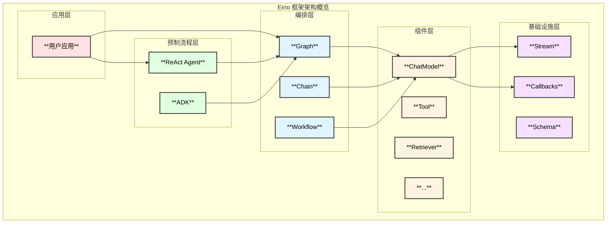

# Eino 框架技术文档

本目录包含 Eino 框架的详细技术文档，帮助您深入理解框架的架构设计和实现原理。

## 文档目录

| 文档 | 内容 | 包含图表 |
|------|------|---------|
| [01_architecture_overview.md](./01_architecture_overview.md) | 框架整体架构总览 | 架构图、依赖关系图 |
| [02_component_system.md](./02_component_system.md) | 组件系统详解 | 类图、组件关系图 |
| [03_orchestration_system.md](./03_orchestration_system.md) | 编排系统详解 | 时序图、函数调用链 |
| [04_stream_processing.md](./04_stream_processing.md) | 流处理机制详解 | 流程图 |
| [05_callback_system.md](./05_callback_system.md) | 回调/切面系统详解 | 回调流程图 |
| [06_adk_and_react.md](./06_adk_and_react.md) | ADK与ReAct Agent | 架构图、时序图、调用链 |
| [07_usage_guide.md](./07_usage_guide.md) | 使用指南 | 示例代码 |

## 框架概览

## 核心概念速查

### 组件类型

| 组件 | 接口 | 用途 |
|------|------|------|
| ChatModel | `Generate/Stream` | LLM 交互 |
| Tool | `InvokableRun/StreamableRun` | 功能扩展 |
| Retriever | `Retrieve` | 文档检索 |
| Embedding | `EmbedStrings` | 文本向量化 |
| ChatTemplate | `Format` | Prompt 格式化 |

### 编排方式

| 方式 | 特点 | 适用场景 |
|------|------|---------|
| Chain | 链式、简单 | 线性流程 |
| Graph | 有向图、灵活 | 复杂逻辑、循环 |
| Workflow | 字段映射 | 精细数据控制 |

### 流处理模式

| 模式 | 输入 | 输出 |
|------|------|------|
| Invoke | 非流 | 非流 |
| Stream | 非流 | 流 |
| Collect | 流 | 非流 |
| Transform | 流 | 流 |

## 快速链接

- **官方文档**: [https://www.cloudwego.io/zh/docs/eino/](https://www.cloudwego.io/zh/docs/eino/)
- **示例代码**: [https://github.com/cloudwego/eino-examples](https://github.com/cloudwego/eino-examples)
- **扩展组件**: [https://github.com/cloudwego/eino-ext](https://github.com/cloudwego/eino-ext)

---

> 📝 文档生成时间: 2026-01-26
