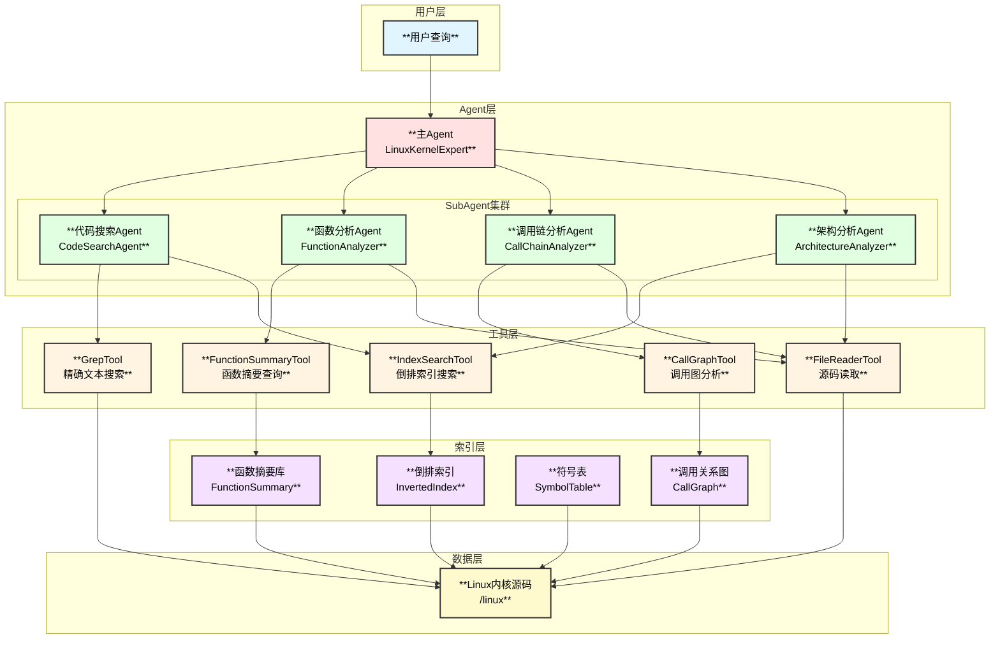
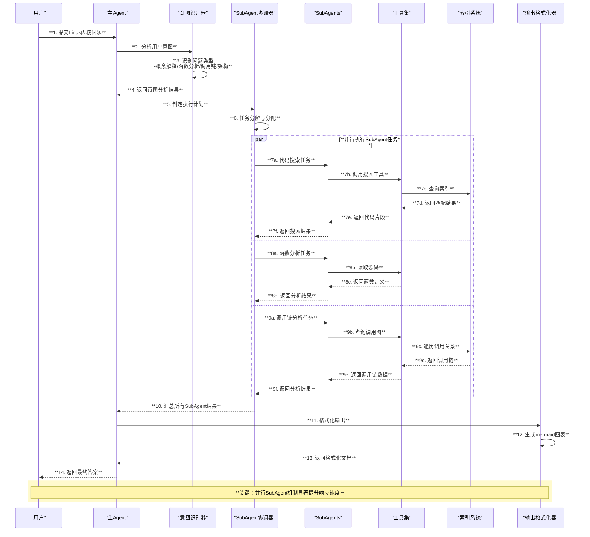

# Linux内核专家Agent - 整体架构设计

## 1. 项目概述

### 1.1 目标
构建一个基于eino框架的Linux内核专家Agent，能够：
- 以Linux内核源码为依据，从源码角度解答用户的Linux内核问题
- 支持高效的代码搜索（grep、倒排索引、函数摘要）
- 使用SubAgent机制并发加快问题分析
- 输出高质量的技术文档（包含mermaid图表、函数调用链、架构图等）

### 1.2 核心能力
| 能力 | 描述 |
|------|------|
| **源码分析** | 深入分析Linux内核源码，提供代码级别的解答 |
| **智能搜索** | 结合grep精确搜索和语义搜索，快速定位代码 |
| **并发分析** | 多SubAgent协作，并发执行不同分析任务 |
| **文档生成** | 生成带有mermaid图表的专业技术文档 |

## 2. 整体架构



## 3. 数据流架构



## 4. 核心组件说明

### 4.1 主Agent (LinuxKernelExpert)
- **职责**：接收用户问题，协调SubAgent，汇总结果
- **实现**：基于eino的`ChatModelAgent`
- **特性**：
  - 意图识别与任务规划
  - SubAgent任务分配与协调
  - 结果汇总与输出格式化

### 4.2 SubAgent集群
| SubAgent | 职责 | 核心工具 |
|----------|------|----------|
| CodeSearchAgent | 代码搜索定位 | GrepTool, IndexSearchTool |
| FunctionAnalyzer | 函数深度分析 | FunctionSummaryTool, FileReaderTool |
| CallChainAnalyzer | 调用链追踪 | CallGraphTool, FileReaderTool |
| ArchitectureAnalyzer | 架构分析 | IndexSearchTool, FileReaderTool |

### 4.3 工具层
- **GrepTool**：基于ripgrep的精确文本搜索
- **IndexSearchTool**：基于倒排索引的快速搜索
- **FunctionSummaryTool**：函数摘要快速查询
- **CallGraphTool**：函数调用关系图查询
- **FileReaderTool**：源码文件读取

### 4.4 索引层
- **InvertedIndex**：倒排索引，支持关键词快速定位
- **FunctionSummary**：函数摘要库，包含签名、参数、简介
- **SymbolTable**：符号表，记录宏定义、类型定义等
- **CallGraph**：调用关系图，记录函数间调用关系

## 5. 技术栈

| 层次 | 技术选型 |
|------|----------|
| Agent框架 | eino adk |
| 编程语言 | Go 1.18+ |
| 文本搜索 | ripgrep (rg) |
| 索引存储 | 内存 + 磁盘持久化 |
| 序列化 | gob / JSON |
| 并发控制 | Go goroutine + channel |

## 6. 目录结构

```
vdocs/
├── design/                    # 设计文档
│   ├── 01_architecture.md     # 整体架构设计
│   ├── 02_modules.md          # 模块设计
│   ├── 03_tech_selection.md   # 技术选型
│   └── 04_thinking_tools.md   # 思维工具使用方案
├── kernel_expert/             # 源代码
│   ├── agent/                 # Agent实现
│   │   ├── main_agent.go      # 主Agent
│   │   ├── code_search.go     # 代码搜索Agent
│   │   ├── function_analyzer.go # 函数分析Agent
│   │   ├── call_chain.go      # 调用链分析Agent
│   │   └── architecture.go    # 架构分析Agent
│   ├── tools/                 # 工具实现
│   │   ├── grep.go            # Grep工具
│   │   ├── index_search.go    # 索引搜索工具
│   │   ├── function_summary.go # 函数摘要工具
│   │   ├── call_graph.go      # 调用图工具
│   │   └── file_reader.go     # 文件读取工具
│   ├── indexer/               # 索引系统
│   │   ├── inverted_index.go  # 倒排索引
│   │   ├── function_summary.go # 函数摘要
│   │   ├── symbol_table.go    # 符号表
│   │   └── call_graph.go      # 调用关系图
│   ├── output/                # 输出格式化
│   │   ├── formatter.go       # 格式化器
│   │   ├── mermaid.go         # Mermaid生成
│   │   └── markdown.go        # Markdown生成
│   └── main.go                # 入口文件
└── output/                    # 生成的文档输出
```

## 7. 扩展性设计

### 7.1 工具插件化
- 工具实现`tool.BaseTool`接口
- 支持动态注册新工具
- 工具配置化管理

### 7.2 SubAgent可扩展
- SubAgent继承基础Agent能力
- 支持新增专业化SubAgent
- 任务分配策略可配置

### 7.3 索引可更新
- 支持增量索引更新
- 索引版本管理
- 自动检测源码变更
