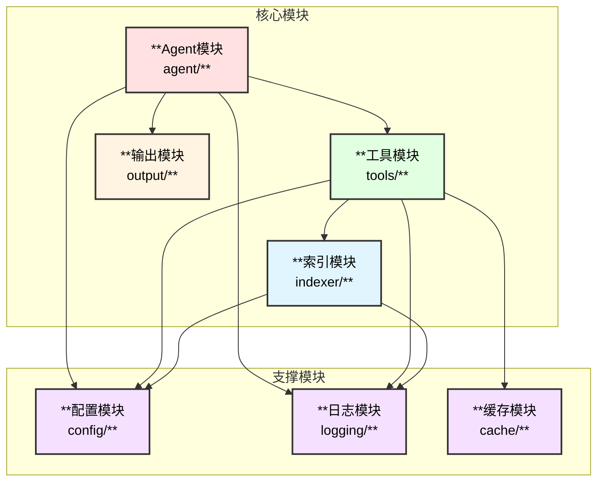
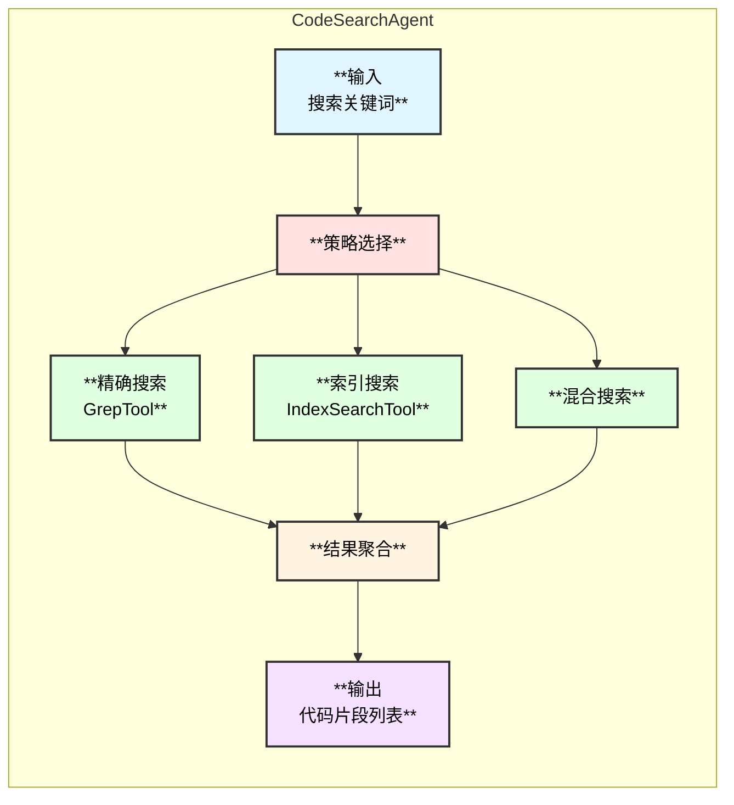
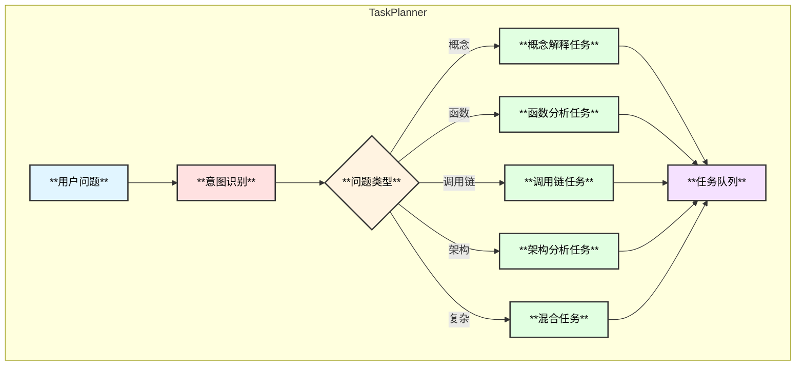
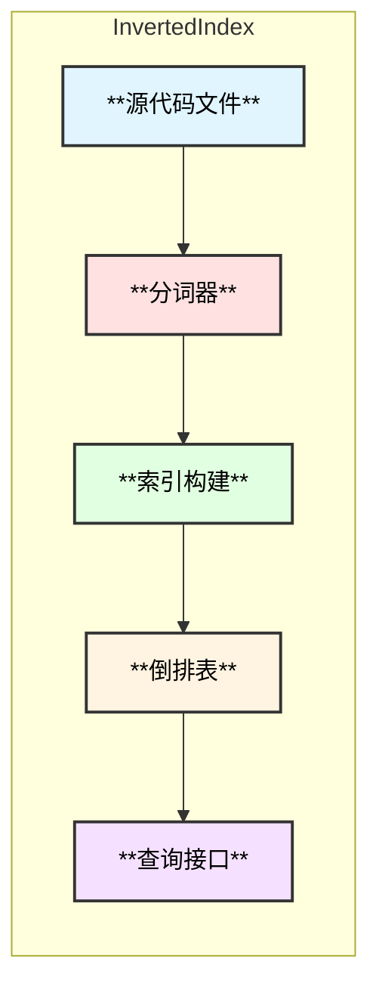
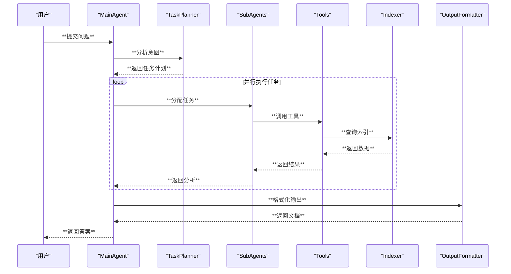

# Linux内核专家Agent - 模块设计

## 1. 模块总览



## 2. Agent模块设计

### 2.1 模块结构

```
agent/
├── main_agent.go           # 主Agent实现
├── sub_agents/
│   ├── code_search.go      # 代码搜索Agent
│   ├── function_analyzer.go # 函数分析Agent
│   ├── call_chain.go       # 调用链分析Agent
│   └── architecture.go     # 架构分析Agent
├── planner/
│   ├── intent.go           # 意图识别
│   ├── task_planner.go     # 任务规划
│   └── coordinator.go      # SubAgent协调
└── types.go                # 类型定义
```

### 2.2 主Agent设计

```go
// LinuxKernelExpertConfig 主Agent配置
type LinuxKernelExpertConfig struct {
    Name        string                      // Agent名称
    Model       model.ToolCallingChatModel  // 底层模型
    SourcePath  string                      // Linux源码路径
    IndexPath   string                      // 索引存储路径
    SubAgents   []adk.Agent                 // SubAgent列表
    MaxWorkers  int                         // 最大并发数
}

// LinuxKernelExpert 主Agent
type LinuxKernelExpert struct {
    *adk.ChatModelAgent
    
    planner     *TaskPlanner       // 任务规划器
    coordinator *SubAgentCoordinator // SubAgent协调器
    outputFmt   *OutputFormatter   // 输出格式化器
    
    indexer     *Indexer           // 索引管理器
    cache       *ResultCache       // 结果缓存
}
```

### 2.3 SubAgent设计

#### 2.3.1 代码搜索Agent



```go
// CodeSearchAgent 代码搜索Agent
type CodeSearchAgent struct {
    *adk.ChatModelAgent
    
    grepTool    *GrepTool
    indexTool   *IndexSearchTool
}

// SearchStrategy 搜索策略
type SearchStrategy int

const (
    StrategyExact    SearchStrategy = iota // 精确匹配
    StrategyFuzzy                          // 模糊匹配
    StrategyHybrid                         // 混合策略
)
```

#### 2.3.2 函数分析Agent

```go
// FunctionAnalyzerAgent 函数分析Agent
type FunctionAnalyzerAgent struct {
    *adk.ChatModelAgent
    
    summaryTool  *FunctionSummaryTool
    readerTool   *FileReaderTool
}

// FunctionAnalysis 函数分析结果
type FunctionAnalysis struct {
    Name        string              // 函数名
    File        string              // 所在文件
    Line        int                 // 行号
    Signature   string              // 函数签名
    Parameters  []ParameterInfo     // 参数列表
    ReturnType  string              // 返回类型
    Description string              // 功能描述
    Complexity  string              // 复杂度评估
    KeyLogic    []string            // 关键逻辑点
}
```

#### 2.3.3 调用链分析Agent

```go
// CallChainAnalyzerAgent 调用链分析Agent
type CallChainAnalyzerAgent struct {
    *adk.ChatModelAgent
    
    callGraphTool *CallGraphTool
    readerTool    *FileReaderTool
}

// CallChain 调用链
type CallChain struct {
    Root     *CallNode           // 根节点
    MaxDepth int                 // 最大深度
    TotalNodes int              // 总节点数
}

// CallNode 调用节点
type CallNode struct {
    Function  string             // 函数名
    File      string             // 文件路径
    Line      int                // 行号
    Children  []*CallNode        // 子调用
    Metadata  map[string]string  // 元数据
}
```

#### 2.3.4 架构分析Agent

```go
// ArchitectureAnalyzerAgent 架构分析Agent
type ArchitectureAnalyzerAgent struct {
    *adk.ChatModelAgent
    
    indexTool  *IndexSearchTool
    readerTool *FileReaderTool
}

// ArchitectureAnalysis 架构分析结果
type ArchitectureAnalysis struct {
    Subsystem    string              // 子系统名称
    Components   []Component         // 组件列表
    Dependencies []Dependency        // 依赖关系
    DataFlows    []DataFlow          // 数据流
}
```

### 2.4 任务规划器



```go
// TaskPlanner 任务规划器
type TaskPlanner struct {
    classifier *IntentClassifier
}

// IntentType 意图类型
type IntentType int

const (
    IntentConcept      IntentType = iota // 概念解释
    IntentFunction                        // 函数分析
    IntentCallChain                       // 调用链分析
    IntentArchitecture                    // 架构分析
    IntentComparison                      // 对比分析
    IntentDebug                           // 调试分析
)

// Task 任务定义
type Task struct {
    ID          string
    Type        IntentType
    Priority    int
    Agent       string       // 目标Agent
    Input       interface{}
    Dependencies []string    // 依赖任务
}
```

## 3. 工具模块设计

### 3.1 模块结构

```
tools/
├── grep.go              # Grep搜索工具
├── index_search.go      # 索引搜索工具
├── function_summary.go  # 函数摘要工具
├── call_graph.go        # 调用图工具
├── file_reader.go       # 文件读取工具
├── skill_loader.go      # Skill加载器
└── registry.go          # 工具注册中心
```

### 3.2 GrepTool

```go
// GrepTool 基于ripgrep的精确搜索工具
type GrepTool struct {
    sourcePath string
    maxResults int
    timeout    time.Duration
}

// GrepInput 搜索输入
type GrepInput struct {
    Pattern      string   `json:"pattern"`       // 搜索模式
    FileTypes    []string `json:"file_types"`    // 文件类型过滤
    Directories  []string `json:"directories"`   // 目录过滤
    CaseSensitive bool    `json:"case_sensitive"` // 大小写敏感
    Context      int      `json:"context"`       // 上下文行数
    MaxResults   int      `json:"max_results"`   // 最大结果数
}

// GrepResult 搜索结果
type GrepResult struct {
    Matches []GrepMatch `json:"matches"`
    Total   int         `json:"total"`
}

// GrepMatch 单个匹配
type GrepMatch struct {
    File       string `json:"file"`
    Line       int    `json:"line"`
    Content    string `json:"content"`
    Context    string `json:"context"`
}
```

### 3.3 IndexSearchTool

```go
// IndexSearchTool 基于倒排索引的搜索工具
type IndexSearchTool struct {
    index *InvertedIndex
}

// IndexSearchInput 索引搜索输入
type IndexSearchInput struct {
    Keywords  []string `json:"keywords"`   // 关键词列表
    Operator  string   `json:"operator"`   // AND/OR
    FileTypes []string `json:"file_types"` // 文件类型
    Limit     int      `json:"limit"`      // 结果限制
}

// IndexSearchResult 索引搜索结果
type IndexSearchResult struct {
    Documents []DocumentMatch `json:"documents"`
    Total     int             `json:"total"`
}
```

### 3.4 FunctionSummaryTool

```go
// FunctionSummaryTool 函数摘要查询工具
type FunctionSummaryTool struct {
    summaryDB *FunctionSummaryDB
}

// FunctionSummaryInput 函数摘要输入
type FunctionSummaryInput struct {
    FunctionName string `json:"function_name"` // 函数名
    FileName     string `json:"file_name"`     // 可选文件名
}

// FunctionSummary 函数摘要
type FunctionSummary struct {
    Name        string   `json:"name"`
    File        string   `json:"file"`
    Line        int      `json:"line"`
    Signature   string   `json:"signature"`
    Description string   `json:"description"`
    Parameters  []Param  `json:"parameters"`
    ReturnType  string   `json:"return_type"`
    Callers     []string `json:"callers"`
    Callees     []string `json:"callees"`
}
```

### 3.5 CallGraphTool

```go
// CallGraphTool 调用图查询工具
type CallGraphTool struct {
    callGraph *CallGraph
}

// CallGraphInput 调用图输入
type CallGraphInput struct {
    Function  string `json:"function"`    // 起始函数
    Direction string `json:"direction"`   // callers/callees/both
    MaxDepth  int    `json:"max_depth"`   // 最大深度
}

// CallGraphResult 调用图结果
type CallGraphResult struct {
    Root  *CallGraphNode   `json:"root"`
    Nodes int              `json:"nodes"`
    Edges int              `json:"edges"`
}
```

### 3.6 FileReaderTool

```go
// FileReaderTool 源码文件读取工具
type FileReaderTool struct {
    sourcePath string
    maxLines   int
}

// FileReaderInput 文件读取输入
type FileReaderInput struct {
    FilePath   string `json:"file_path"`   // 文件路径
    StartLine  int    `json:"start_line"`  // 起始行
    EndLine    int    `json:"end_line"`    // 结束行
    ContextLines int  `json:"context_lines"` // 上下文行数
}

// FileContent 文件内容
type FileContent struct {
    Path      string   `json:"path"`
    StartLine int      `json:"start_line"`
    EndLine   int      `json:"end_line"`
    Lines     []string `json:"lines"`
    Total     int      `json:"total_lines"`
}
```

## 4. 索引模块设计

### 4.1 模块结构

```
indexer/
├── inverted_index.go    # 倒排索引
├── function_summary.go  # 函数摘要库
├── symbol_table.go      # 符号表
├── call_graph.go        # 调用关系图
├── builder.go           # 索引构建器
├── persistence.go       # 持久化
└── updater.go           # 增量更新
```

### 4.2 倒排索引



```go
// InvertedIndex 倒排索引
type InvertedIndex struct {
    terms     map[string]*PostingList // 词项 -> 倒排表
    documents map[int]*Document       // 文档ID -> 文档
    docCount  int
    mu        sync.RWMutex
}

// PostingList 倒排表
type PostingList struct {
    Term      string
    DocFreq   int           // 文档频率
    Postings  []*Posting    // 倒排项列表
}

// Posting 倒排项
type Posting struct {
    DocID      int
    Frequency  int           // 词频
    Positions  []int         // 位置列表
}

// Document 文档
type Document struct {
    ID       int
    Path     string
    Size     int64
    ModTime  time.Time
    Terms    map[string]int // 词项频率
}
```

### 4.3 函数摘要库

```go
// FunctionSummaryDB 函数摘要数据库
type FunctionSummaryDB struct {
    functions  map[string][]*FunctionInfo // 函数名 -> 函数列表
    byFile     map[string][]*FunctionInfo // 文件 -> 函数列表
    mu         sync.RWMutex
}

// FunctionInfo 函数信息
type FunctionInfo struct {
    Name        string
    File        string
    StartLine   int
    EndLine     int
    Signature   string
    Parameters  []ParameterInfo
    ReturnType  string
    Comments    string
    Complexity  int          // 圈复杂度
    LOC         int          // 代码行数
}

// ParameterInfo 参数信息
type ParameterInfo struct {
    Name string
    Type string
    Desc string
}
```

### 4.4 调用关系图

```go
// CallGraph 调用关系图
type CallGraph struct {
    nodes    map[string]*CGNode     // 函数名 -> 节点
    callers  map[string][]string    // 被调用者 -> 调用者列表
    callees  map[string][]string    // 调用者 -> 被调用者列表
    mu       sync.RWMutex
}

// CGNode 调用图节点
type CGNode struct {
    Function string
    File     string
    Line     int
    InDegree int          // 入度
    OutDegree int         // 出度
}
```

## 5. 输出模块设计

### 5.1 模块结构

```
output/
├── formatter.go         # 输出格式化器
├── summary.go           # 摘要生成
├── document.go          # 文档生成
├── mermaid/
│   ├── flowchart.go     # 流程图
│   ├── sequence.go      # 时序图
│   ├── class.go         # 类图
│   └── call_tree.go     # 调用树
├── markdown.go          # Markdown生成
└── templates/           # 模板文件
```

### 5.2 输出格式化器

```go
// OutputFormatter 输出格式化器
type OutputFormatter struct {
    templateEngine *TemplateEngine
    mermaidGen     *MermaidGenerator
}

// OutputType 输出类型
type OutputType int

const (
    OutputSummary   OutputType = iota // 简短摘要
    OutputDocument                     // 详细文档
)

// FormatOptions 格式化选项
type FormatOptions struct {
    Type           OutputType
    IncludeDiagrams bool
    IncludeCallChain bool
    IncludeTable    bool
    MaxDepth        int
}

// FormattedOutput 格式化输出
type FormattedOutput struct {
    Type     OutputType
    Content  string
    Diagrams []Diagram
}
```

### 5.3 Mermaid生成器

```go
// MermaidGenerator Mermaid图表生成器
type MermaidGenerator struct{}

// GenerateFlowchart 生成流程图
func (g *MermaidGenerator) GenerateFlowchart(nodes []FlowNode, edges []FlowEdge) string

// GenerateSequence 生成时序图
func (g *MermaidGenerator) GenerateSequence(participants []string, messages []SeqMessage) string

// GenerateCallTree 生成调用树
func (g *MermaidGenerator) GenerateCallTree(root *CallNode, maxDepth int) string

// FlowNode 流程图节点
type FlowNode struct {
    ID      string
    Label   string
    Type    string // box/diamond/circle
    Style   NodeStyle
}

// NodeStyle 节点样式
type NodeStyle struct {
    Fill       string
    Stroke     string
    StrokeWidth string
    Color      string
}
```

## 6. Skill模块设计

### 6.1 Skill定义

```yaml
# skills/kernel_search.yaml
name: kernel_search
description: Linux内核代码搜索技能

parameters:
  - name: keyword
    type: string
    required: true
    description: 搜索关键词
  - name: subsystem
    type: string
    required: false
    description: 子系统名称

steps:
  - action: grep
    params:
      pattern: "{{keyword}}"
      directories:
        - "kernel/"
        - "mm/"
        - "fs/"
  - action: filter_results
    params:
      max_results: 20
```

### 6.2 Skill加载器

```go
// SkillLoader Skill加载器
type SkillLoader struct {
    skillPath string
    skills    map[string]*Skill
}

// Skill 技能定义
type Skill struct {
    Name        string
    Description string
    Parameters  []SkillParam
    Steps       []SkillStep
}

// SkillParam 技能参数
type SkillParam struct {
    Name        string
    Type        string
    Required    bool
    Default     interface{}
    Description string
}

// SkillStep 技能步骤
type SkillStep struct {
    Action string
    Params map[string]interface{}
}
```

## 7. 模块间交互


