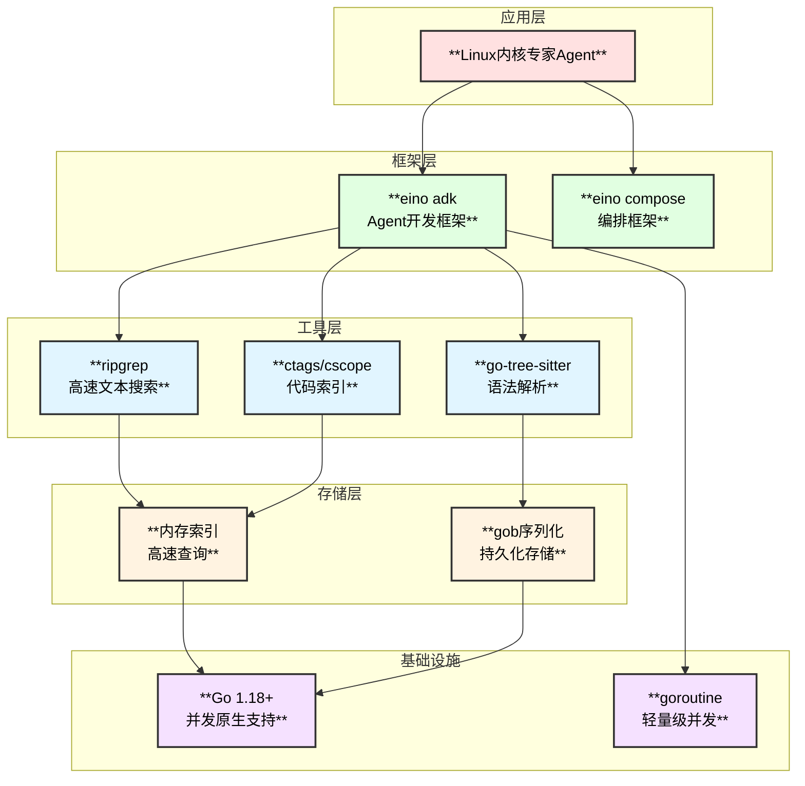
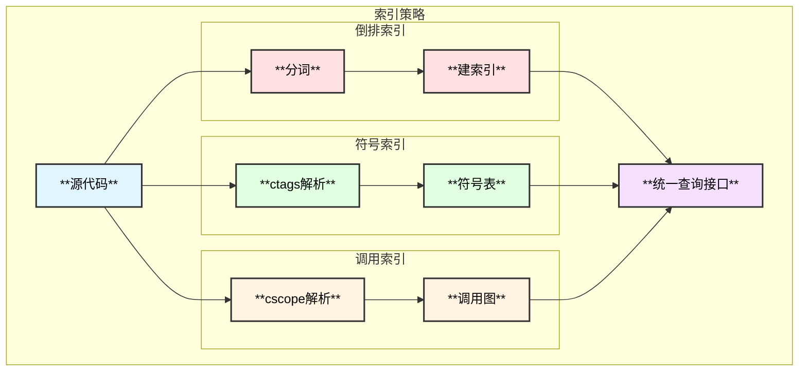
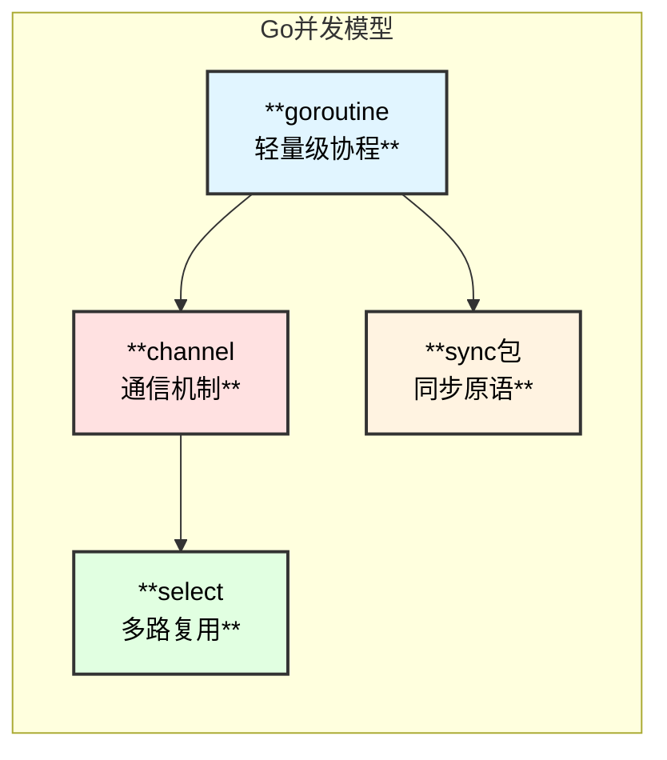

# Linux内核专家Agent - 技术选型

## 1. 技术栈总览



## 2. Agent框架选型

### 2.1 eino框架优势

| 特性 | 说明 | 优势 |
|------|------|------|
| **组件抽象** | ChatModel、Tool、Retriever等 | 标准化接口，易于扩展 |
| **编排能力** | Graph、Chain、Workflow | 灵活的流程控制 |
| **流式处理** | StreamReader自动处理 | 实时响应，用户体验好 |
| **并发管理** | 内置并发安全 | 无需手动管理锁 |
| **回调机制** | OnStart/OnEnd/OnError | 可观测性强 |

### 2.2 ADK组件选择

```go
// 主要使用的ADK组件
import (
    "github.com/cloudwego/eino/adk"
    "github.com/cloudwego/eino/compose"
    "github.com/cloudwego/eino/components/tool"
    "github.com/cloudwego/eino/components/model"
)

// ChatModelAgent - 基于聊天模型的Agent
// 特点：
// - 支持工具调用
// - 内置ReAct循环
// - 支持SubAgent协作
type ChatModelAgent = adk.ChatModelAgent

// AgentMiddleware - Agent中间件
// 用途：
// - 添加额外指令
// - 注入额外工具
// - 前后处理钩子
type AgentMiddleware = adk.AgentMiddleware
```

### 2.3 工具接口实现

```go
// 所有工具实现 tool.BaseTool 接口
type BaseTool interface {
    Info(ctx context.Context) (*schema.ToolInfo, error)
}

// 可调用工具实现 tool.InvokableTool 接口
type InvokableTool interface {
    BaseTool
    InvokableRun(ctx context.Context, argumentsInJSON string, opts ...Option) (string, error)
}

// 流式工具实现 tool.StreamableTool 接口
type StreamableTool interface {
    BaseTool
    StreamableRun(ctx context.Context, argumentsInJSON string, opts ...Option) (*schema.StreamReader[string], error)
}
```

## 3. 文本搜索选型

### 3.1 ripgrep vs grep vs ag

| 工具 | 速度 | 特性 | 选择理由 |
|------|------|------|----------|
| **ripgrep** | ⭐⭐⭐⭐⭐ | 并行、Unicode、.gitignore | ✅ 选用 |
| ag | ⭐⭐⭐⭐ | 快速、简洁 | 功能稍弱 |
| grep | ⭐⭐ | 通用、稳定 | 大文件性能差 |

### 3.2 ripgrep集成

```go
// GrepTool 封装ripgrep
type GrepTool struct {
    rgPath     string        // ripgrep路径
    sourcePath string        // 源码路径
    timeout    time.Duration // 超时时间
}

// 调用示例
func (t *GrepTool) Search(ctx context.Context, input *GrepInput) (*GrepResult, error) {
    args := []string{
        "--json",           // JSON输出
        "--max-count", strconv.Itoa(input.MaxResults),
        "-C", strconv.Itoa(input.Context), // 上下文
    }
    
    if !input.CaseSensitive {
        args = append(args, "-i")
    }
    
    for _, ft := range input.FileTypes {
        args = append(args, "-t", ft)
    }
    
    args = append(args, input.Pattern, t.sourcePath)
    
    cmd := exec.CommandContext(ctx, t.rgPath, args...)
    // ...
}
```

## 4. 代码索引选型

### 4.1 索引方案对比

| 方案 | 优点 | 缺点 | 适用场景 |
|------|------|------|----------|
| **自建倒排索引** | 定制化强 | 开发成本高 | ✅ 关键词搜索 |
| ctags | 符号索引准确 | 不支持语义 | ✅ 函数定位 |
| cscope | 调用关系 | C语言限定 | ✅ 调用分析 |
| tree-sitter | AST解析准确 | 内存占用大 | ✅ 语法分析 |

### 4.2 混合索引策略



### 4.3 倒排索引实现

```go
// 自建倒排索引
// 优点：可针对C代码优化分词，支持增量更新

// CTokenizer C语言分词器
type CTokenizer struct {
    stopWords map[string]bool
}

// Tokenize 分词
func (t *CTokenizer) Tokenize(content string) []Token {
    tokens := make([]Token, 0)
    
    // 1. 提取标识符（函数名、变量名）
    identifierRe := regexp.MustCompile(`[a-zA-Z_][a-zA-Z0-9_]*`)
    // 2. 提取宏定义
    macroRe := regexp.MustCompile(`#define\s+(\w+)`)
    // 3. 提取结构体名
    structRe := regexp.MustCompile(`struct\s+(\w+)`)
    
    // ... 分词逻辑
    return tokens
}
```

### 4.4 ctags集成

```go
// 使用Universal Ctags生成符号表
// 命令: ctags -R --fields=+Kn --c-kinds=+pxdm -o tags linux/

// SymbolTable 符号表
type SymbolTable struct {
    symbols map[string][]*Symbol
}

// Symbol 符号信息
type Symbol struct {
    Name     string
    File     string
    Line     int
    Kind     string // function, struct, macro, typedef
    Pattern  string // 匹配模式
    Extras   map[string]string
}

// ParseTagsFile 解析tags文件
func ParseTagsFile(path string) (*SymbolTable, error) {
    // 解析ctags输出格式
    // name<TAB>file<TAB>pattern;"<TAB>kind<TAB>extras
}
```

### 4.5 cscope调用分析

```go
// 使用cscope分析函数调用关系
// 命令: cscope -b -R -k

// CallGraphBuilder 调用图构建器
type CallGraphBuilder struct {
    cscopePath string
}

// FindCallers 查找调用者
func (b *CallGraphBuilder) FindCallers(function string) ([]string, error) {
    // cscope -d -L3 function_name
    cmd := exec.Command(b.cscopePath, "-d", "-L3", function)
    // ...
}

// FindCallees 查找被调用者
func (b *CallGraphBuilder) FindCallees(function string) ([]string, error) {
    // cscope -d -L2 function_name
    cmd := exec.Command(b.cscopePath, "-d", "-L2", function)
    // ...
}
```

## 5. 并发模型选型

### 5.1 Go并发优势



### 5.2 SubAgent并发执行

```go
// SubAgentCoordinator 并发协调器
type SubAgentCoordinator struct {
    maxWorkers int
    semaphore  chan struct{}
}

// ExecuteParallel 并行执行多个SubAgent任务
func (c *SubAgentCoordinator) ExecuteParallel(
    ctx context.Context,
    tasks []Task,
) ([]TaskResult, error) {
    
    results := make([]TaskResult, len(tasks))
    var wg sync.WaitGroup
    errCh := make(chan error, len(tasks))
    
    for i, task := range tasks {
        wg.Add(1)
        go func(idx int, t Task) {
            defer wg.Done()
            
            // 获取信号量
            c.semaphore <- struct{}{}
            defer func() { <-c.semaphore }()
            
            result, err := t.Execute(ctx)
            if err != nil {
                errCh <- err
                return
            }
            results[idx] = result
        }(i, task)
    }
    
    wg.Wait()
    close(errCh)
    
    // 收集错误
    var errs []error
    for err := range errCh {
        errs = append(errs, err)
    }
    
    if len(errs) > 0 {
        return results, errors.Join(errs...)
    }
    
    return results, nil
}
```

## 6. 存储选型

### 6.1 索引存储

| 方案 | 读性能 | 写性能 | 持久化 | 选择 |
|------|--------|--------|--------|------|
| **内存Map** | ⭐⭐⭐⭐⭐ | ⭐⭐⭐⭐⭐ | ❌ | ✅ 运行时 |
| **gob文件** | ⭐⭐⭐⭐ | ⭐⭐⭐ | ✅ | ✅ 持久化 |
| BoltDB | ⭐⭐⭐ | ⭐⭐⭐ | ✅ | 过重 |
| SQLite | ⭐⭐⭐ | ⭐⭐ | ✅ | 不适合 |

### 6.2 混合存储策略

```go
// IndexStore 索引存储
type IndexStore struct {
    memory    *MemoryIndex    // 内存索引
    persister *IndexPersister // 持久化器
}

// MemoryIndex 内存索引
type MemoryIndex struct {
    inverted    *InvertedIndex
    symbols     *SymbolTable
    callGraph   *CallGraph
    summaries   *FunctionSummaryDB
    mu          sync.RWMutex
}

// IndexPersister 索引持久化
type IndexPersister struct {
    basePath string
}

// Save 保存索引到磁盘
func (p *IndexPersister) Save(index *MemoryIndex) error {
    // 使用gob序列化
    f, err := os.Create(filepath.Join(p.basePath, "index.gob"))
    if err != nil {
        return err
    }
    defer f.Close()
    
    encoder := gob.NewEncoder(f)
    return encoder.Encode(index)
}

// Load 从磁盘加载索引
func (p *IndexPersister) Load() (*MemoryIndex, error) {
    f, err := os.Open(filepath.Join(p.basePath, "index.gob"))
    if err != nil {
        return nil, err
    }
    defer f.Close()
    
    var index MemoryIndex
    decoder := gob.NewDecoder(f)
    if err := decoder.Decode(&index); err != nil {
        return nil, err
    }
    
    return &index, nil
}
```

## 7. 模型选型

### 7.1 LLM要求

| 要求 | 说明 |
|------|------|
| **Function Calling** | 必须支持工具调用 |
| **长上下文** | 建议32K+，处理大代码块 |
| **代码理解** | 代码生成和分析能力强 |
| **推理能力** | 复杂问题分步推理 |

### 7.2 推荐模型

```go
// 模型配置
type ModelConfig struct {
    Provider    string // openai, anthropic, etc.
    Model       string // gpt-4, claude-3, etc.
    Temperature float64
    MaxTokens   int
}

// 推荐配置
var RecommendedConfigs = map[string]ModelConfig{
    "high_quality": {
        Provider:    "anthropic",
        Model:       "claude-3-opus",
        Temperature: 0.1,
        MaxTokens:   4096,
    },
    "balanced": {
        Provider:    "openai", 
        Model:       "gpt-4-turbo",
        Temperature: 0.2,
        MaxTokens:   4096,
    },
    "fast": {
        Provider:    "openai",
        Model:       "gpt-4o-mini",
        Temperature: 0.2,
        MaxTokens:   2048,
    },
}
```

## 8. 依赖管理

### 8.1 Go模块依赖

```go
// go.mod
module github.com/cloudwego/eino/vdocs/kernel_expert

go 1.21

require (
    github.com/cloudwego/eino v0.x.x
    github.com/bytedance/sonic v1.x.x
)

// 可选依赖
require (
    github.com/smacker/go-tree-sitter v0.x.x // AST解析
)
```

### 8.2 外部工具依赖

```bash
# 必需工具
brew install ripgrep    # 文本搜索
brew install universal-ctags  # 符号索引
brew install cscope     # 调用分析

# 可选工具
brew install tree-sitter  # AST解析
```

## 9. 性能优化策略

### 9.1 索引优化

```go
// 1. 分片索引 - 按目录分片
type ShardedIndex struct {
    shards map[string]*InvertedIndex // 目录 -> 索引
}

// 2. 增量更新 - 只更新变化文件
type IncrementalUpdater struct {
    lastUpdateTime time.Time
    fileHashes     map[string]string
}

// 3. 压缩存储 - 倒排表压缩
type CompressedPostingList struct {
    data []byte // 压缩的docID差值
}
```

### 9.2 查询优化

```go
// 1. 缓存热点查询
type QueryCache struct {
    lru *lru.Cache
}

// 2. 查询结果预取
type PrefetchManager struct {
    prefetchQueue chan string
}

// 3. 并行查询合并
type QueryMerger struct {
    pending map[string][]chan Result
}
```

## 10. 技术选型总结

| 领域 | 选型 | 理由 |
|------|------|------|
| Agent框架 | eino adk | Go原生、功能完整、易于扩展 |
| 文本搜索 | ripgrep | 性能最优、功能丰富 |
| 符号索引 | Universal Ctags | 准确、支持多语言 |
| 调用分析 | cscope | C代码专用、调用链完整 |
| 倒排索引 | 自建 | 可定制、增量更新 |
| 持久化 | gob | Go原生、序列化简单 |
| 并发模型 | goroutine | 轻量、高效 |
| LLM | GPT-4/Claude | 代码理解能力强 |
