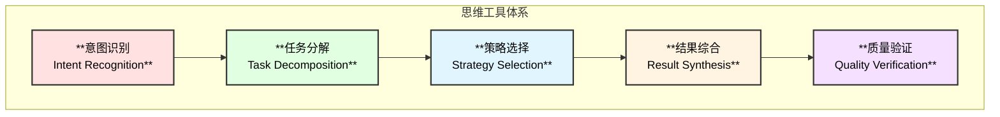
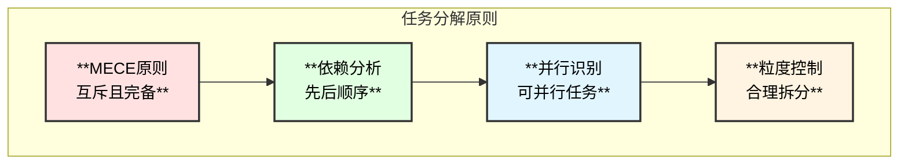
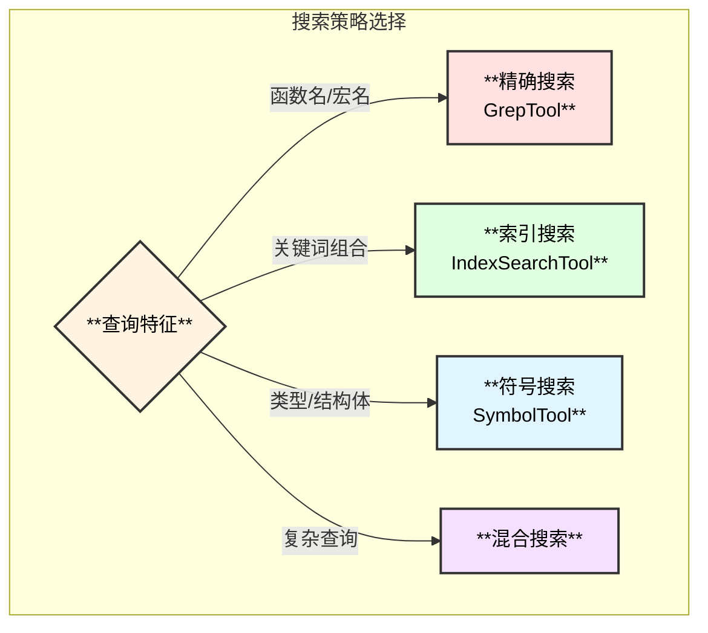
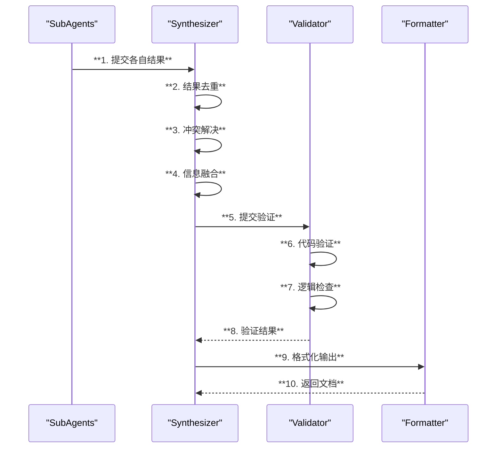
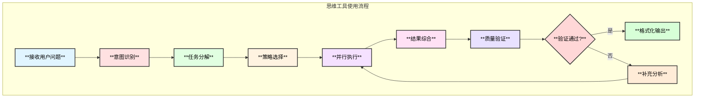

# Linux内核专家Agent - 思维工具使用方案

## 1. 思维工具概述

### 1.1 什么是思维工具

思维工具是Agent在解决问题时使用的认知策略和决策方法，帮助Agent：
- 理解用户意图
- 规划执行步骤
- 选择合适的工具
- 组织输出结果

### 1.2 思维工具体系



## 2. 意图识别策略

### 2.1 问题类型分类

| 问题类型 | 关键词特征 | 典型问题 | 处理策略 |
|----------|------------|----------|----------|
| **概念解释** | 什么是、解释、介绍 | "什么是内核态？" | 搜索文档+代码示例 |
| **函数分析** | 函数、实现、参数、返回值 | "fork函数怎么实现的？" | 定位+分析+调用链 |
| **调用链分析** | 调用、流程、过程、路径 | "系统调用的完整流程？" | 调用图+时序图 |
| **架构分析** | 架构、模块、子系统、关系 | "VFS的整体架构？" | 模块分析+关系图 |
| **对比分析** | 区别、比较、异同、差异 | "spin_lock和mutex的区别？" | 多点对比+表格 |
| **调试分析** | 为什么、原因、问题、错误 | "为什么会死锁？" | 条件分析+案例 |

### 2.2 意图识别实现

```go
// IntentClassifier 意图分类器
type IntentClassifier struct {
    patterns map[IntentType][]string
}

// IntentType 意图类型
type IntentType int

const (
    IntentConcept      IntentType = iota // 概念解释
    IntentFunction                        // 函数分析
    IntentCallChain                       // 调用链
    IntentArchitecture                    // 架构分析
    IntentComparison                      // 对比分析
    IntentDebug                           // 调试分析
)

// ClassifyIntent 分类用户意图
func (c *IntentClassifier) ClassifyIntent(query string) IntentType {
    // 1. 关键词匹配
    patterns := map[IntentType][]string{
        IntentConcept:      {"什么是", "解释", "介绍", "概念"},
        IntentFunction:     {"函数", "实现", "怎么", "如何"},
        IntentCallChain:    {"调用", "流程", "过程", "路径"},
        IntentArchitecture: {"架构", "模块", "子系统", "组成"},
        IntentComparison:   {"区别", "比较", "差异", "异同"},
        IntentDebug:        {"为什么", "原因", "问题", "错误"},
    }
    
    // 2. 计算匹配得分
    scores := make(map[IntentType]int)
    for intent, keywords := range patterns {
        for _, kw := range keywords {
            if strings.Contains(query, kw) {
                scores[intent]++
            }
        }
    }
    
    // 3. 返回最高得分的意图
    return c.getMaxScoreIntent(scores)
}
```

### 2.3 意图识别提示词

```text
# 意图识别System Prompt

你是一个Linux内核问题分析专家。请分析用户的问题，识别其核心意图。

## 意图类型

1. **概念解释**: 用户想了解某个概念的定义和原理
2. **函数分析**: 用户想了解某个函数的实现细节
3. **调用链分析**: 用户想了解某个操作的完整调用流程
4. **架构分析**: 用户想了解某个子系统的整体架构
5. **对比分析**: 用户想比较两个或多个概念/实现的异同
6. **调试分析**: 用户想了解某个问题的原因或解决方案

## 输出格式

请以JSON格式输出：
{
    "primary_intent": "意图类型",
    "secondary_intents": ["次要意图"],
    "key_entities": ["关键实体"],
    "search_keywords": ["搜索关键词"],
    "confidence": 0.9
}
```

## 3. 任务分解策略

### 3.1 分解原则



### 3.2 分解模板

#### 3.2.1 函数分析任务分解

```yaml
# 函数分析任务模板
task_template: function_analysis
subtasks:
  - name: locate_function
    description: 定位函数定义位置
    agent: CodeSearchAgent
    parallel_group: 1
    
  - name: read_source
    description: 读取函数源码
    agent: CodeSearchAgent
    depends_on: [locate_function]
    parallel_group: 2
    
  - name: analyze_params
    description: 分析函数参数
    agent: FunctionAnalyzerAgent
    depends_on: [read_source]
    parallel_group: 3
    
  - name: analyze_logic
    description: 分析核心逻辑
    agent: FunctionAnalyzerAgent
    depends_on: [read_source]
    parallel_group: 3
    
  - name: trace_callers
    description: 追踪调用者
    agent: CallChainAnalyzerAgent
    depends_on: [locate_function]
    parallel_group: 2
    
  - name: trace_callees
    description: 追踪被调用函数
    agent: CallChainAnalyzerAgent
    depends_on: [locate_function]
    parallel_group: 2
```

#### 3.2.2 调用链分析任务分解

```yaml
# 调用链分析任务模板
task_template: call_chain_analysis
subtasks:
  - name: identify_entry
    description: 识别入口点
    agent: CodeSearchAgent
    parallel_group: 1
    
  - name: build_forward_chain
    description: 构建正向调用链
    agent: CallChainAnalyzerAgent
    depends_on: [identify_entry]
    parallel_group: 2
    
  - name: build_backward_chain
    description: 构建反向调用链
    agent: CallChainAnalyzerAgent
    depends_on: [identify_entry]
    parallel_group: 2
    
  - name: analyze_key_nodes
    description: 分析关键节点
    agent: FunctionAnalyzerAgent
    depends_on: [build_forward_chain]
    parallel_group: 3
    
  - name: generate_sequence
    description: 生成时序图
    agent: ArchitectureAnalyzerAgent
    depends_on: [build_forward_chain, build_backward_chain]
    parallel_group: 4
```

### 3.3 任务分解实现

```go
// TaskDecomposer 任务分解器
type TaskDecomposer struct {
    templates map[string]*TaskTemplate
}

// TaskTemplate 任务模板
type TaskTemplate struct {
    Name     string
    Subtasks []*SubtaskDef
}

// SubtaskDef 子任务定义
type SubtaskDef struct {
    Name          string
    Description   string
    Agent         string
    DependsOn     []string
    ParallelGroup int
}

// Decompose 分解任务
func (d *TaskDecomposer) Decompose(intent IntentType, query string) (*TaskPlan, error) {
    // 1. 选择模板
    template := d.selectTemplate(intent)
    
    // 2. 参数化子任务
    subtasks := d.parameterize(template.Subtasks, query)
    
    // 3. 构建执行计划
    plan := &TaskPlan{
        Tasks:     subtasks,
        DependsGraph: d.buildDependencyGraph(subtasks),
        ParallelGroups: d.groupByParallel(subtasks),
    }
    
    return plan, nil
}

// TaskPlan 任务执行计划
type TaskPlan struct {
    Tasks          []*Task
    DependsGraph   map[string][]string
    ParallelGroups map[int][]*Task
}
```

## 4. 策略选择机制

### 4.1 搜索策略



### 4.2 策略选择规则

```go
// StrategySelector 策略选择器
type StrategySelector struct{}

// SearchStrategy 搜索策略
type SearchStrategy struct {
    Tools     []string
    Order     string // sequential/parallel
    Fallback  string
}

// SelectSearchStrategy 选择搜索策略
func (s *StrategySelector) SelectSearchStrategy(query string) *SearchStrategy {
    // 规则1: 函数名模式 - 精确搜索优先
    if s.isFunctionPattern(query) {
        return &SearchStrategy{
            Tools:    []string{"GrepTool"},
            Order:    "sequential",
            Fallback: "IndexSearchTool",
        }
    }
    
    // 规则2: 多关键词 - 索引搜索
    if s.hasMultipleKeywords(query) {
        return &SearchStrategy{
            Tools:    []string{"IndexSearchTool"},
            Order:    "sequential",
            Fallback: "GrepTool",
        }
    }
    
    // 规则3: 结构体/类型 - 符号搜索
    if s.isTypePattern(query) {
        return &SearchStrategy{
            Tools:    []string{"SymbolTool", "GrepTool"},
            Order:    "parallel",
            Fallback: "IndexSearchTool",
        }
    }
    
    // 默认: 混合策略
    return &SearchStrategy{
        Tools:    []string{"IndexSearchTool", "GrepTool"},
        Order:    "parallel",
        Fallback: nil,
    }
}
```

### 4.3 分析深度策略

```go
// DepthStrategy 分析深度策略
type DepthStrategy struct {
    MaxCallDepth    int  // 调用链最大深度
    IncludeInline   bool // 是否包含内联函数
    AnalyzeAssembly bool // 是否分析汇编
    CrossSubsystem  bool // 是否跨子系统
}

// SelectDepthStrategy 选择深度策略
func (s *StrategySelector) SelectDepthStrategy(intent IntentType, complexity string) *DepthStrategy {
    switch complexity {
    case "simple":
        return &DepthStrategy{
            MaxCallDepth:    3,
            IncludeInline:   false,
            AnalyzeAssembly: false,
            CrossSubsystem:  false,
        }
    case "moderate":
        return &DepthStrategy{
            MaxCallDepth:    5,
            IncludeInline:   true,
            AnalyzeAssembly: false,
            CrossSubsystem:  true,
        }
    case "deep":
        return &DepthStrategy{
            MaxCallDepth:    10,
            IncludeInline:   true,
            AnalyzeAssembly: true,
            CrossSubsystem:  true,
        }
    default:
        return &DepthStrategy{MaxCallDepth: 5}
    }
}
```

## 5. 结果综合策略

### 5.1 综合流程



### 5.2 结果融合规则

```go
// ResultSynthesizer 结果综合器
type ResultSynthesizer struct{}

// SynthesizeResults 综合多个SubAgent结果
func (s *ResultSynthesizer) SynthesizeResults(results []SubAgentResult) (*SynthesizedResult, error) {
    // 1. 按类型分组
    grouped := s.groupByType(results)
    
    // 2. 去重
    deduped := s.deduplicate(grouped)
    
    // 3. 解决冲突
    resolved := s.resolveConflicts(deduped)
    
    // 4. 构建完整图景
    synthesized := s.buildCompletePicture(resolved)
    
    return synthesized, nil
}

// resolveConflicts 解决冲突
func (s *ResultSynthesizer) resolveConflicts(results map[string][]SubAgentResult) map[string]SubAgentResult {
    resolved := make(map[string]SubAgentResult)
    
    for key, candidates := range results {
        if len(candidates) == 1 {
            resolved[key] = candidates[0]
            continue
        }
        
        // 冲突解决策略:
        // 1. 优先选择有源码引用的结果
        // 2. 优先选择更详细的结果
        // 3. 优先选择置信度高的结果
        resolved[key] = s.selectBestCandidate(candidates)
    }
    
    return resolved
}
```

### 5.3 输出格式策略

```go
// OutputStrategy 输出策略
type OutputStrategy struct {
    Type        OutputType
    Sections    []string
    Diagrams    []DiagramType
    CodeBlocks  bool
    Tables      bool
}

// SelectOutputStrategy 选择输出策略
func SelectOutputStrategy(intent IntentType, outputType OutputType) *OutputStrategy {
    if outputType == OutputSummary {
        return &OutputStrategy{
            Type:       OutputSummary,
            Sections:   []string{"answer", "key_points"},
            Diagrams:   nil,
            CodeBlocks: false,
            Tables:     false,
        }
    }
    
    // 详细文档策略
    switch intent {
    case IntentFunction:
        return &OutputStrategy{
            Type:       OutputDocument,
            Sections:   []string{"overview", "signature", "parameters", "implementation", "call_chain"},
            Diagrams:   []DiagramType{DiagramCallTree, DiagramSequence},
            CodeBlocks: true,
            Tables:     true,
        }
    case IntentCallChain:
        return &OutputStrategy{
            Type:       OutputDocument,
            Sections:   []string{"overview", "entry_point", "call_flow", "key_functions"},
            Diagrams:   []DiagramType{DiagramSequence, DiagramFlowchart},
            CodeBlocks: true,
            Tables:     true,
        }
    case IntentArchitecture:
        return &OutputStrategy{
            Type:       OutputDocument,
            Sections:   []string{"overview", "components", "relationships", "data_flow"},
            Diagrams:   []DiagramType{DiagramArchitecture, DiagramClass},
            CodeBlocks: false,
            Tables:     true,
        }
    default:
        return &OutputStrategy{
            Type:       OutputDocument,
            Sections:   []string{"overview", "details", "examples"},
            Diagrams:   []DiagramType{DiagramFlowchart},
            CodeBlocks: true,
            Tables:     false,
        }
    }
}
```

## 6. 质量验证策略

### 6.1 验证维度

| 维度 | 验证内容 | 验证方法 |
|------|----------|----------|
| **代码准确性** | 引用的代码是否存在 | grep验证 |
| **行号准确性** | 行号是否正确 | 文件读取验证 |
| **调用关系** | 调用链是否正确 | cscope验证 |
| **逻辑完整性** | 分析是否完整 | 覆盖度检查 |
| **一致性** | 前后描述是否一致 | 交叉验证 |

### 6.2 验证实现

```go
// QualityValidator 质量验证器
type QualityValidator struct {
    grepTool   *GrepTool
    fileTool   *FileReaderTool
    callGraph  *CallGraphTool
}

// ValidationResult 验证结果
type ValidationResult struct {
    Valid    bool
    Issues   []ValidationIssue
    Score    float64
}

// ValidationIssue 验证问题
type ValidationIssue struct {
    Type     string
    Severity string // error/warning/info
    Message  string
    Location string
}

// Validate 验证结果质量
func (v *QualityValidator) Validate(result *SynthesizedResult) *ValidationResult {
    issues := make([]ValidationIssue, 0)
    
    // 1. 验证代码引用
    for _, codeRef := range result.CodeReferences {
        if !v.verifyCodeExists(codeRef) {
            issues = append(issues, ValidationIssue{
                Type:     "code_reference",
                Severity: "error",
                Message:  fmt.Sprintf("Code reference not found: %s", codeRef.Path),
                Location: codeRef.Path,
            })
        }
    }
    
    // 2. 验证行号
    for _, lineRef := range result.LineReferences {
        if !v.verifyLineNumber(lineRef) {
            issues = append(issues, ValidationIssue{
                Type:     "line_number",
                Severity: "warning",
                Message:  fmt.Sprintf("Line number mismatch at %s:%d", lineRef.File, lineRef.Line),
                Location: lineRef.File,
            })
        }
    }
    
    // 3. 验证调用关系
    for _, callRef := range result.CallReferences {
        if !v.verifyCallRelation(callRef) {
            issues = append(issues, ValidationIssue{
                Type:     "call_relation",
                Severity: "warning",
                Message:  fmt.Sprintf("Call relation not verified: %s -> %s", callRef.Caller, callRef.Callee),
            })
        }
    }
    
    // 计算得分
    score := v.calculateScore(issues)
    
    return &ValidationResult{
        Valid:  len(issues) == 0 || score >= 0.8,
        Issues: issues,
        Score:  score,
    }
}
```

## 7. Skill集成

### 7.1 Skill定义

```yaml
# skills/kernel_function_analysis.md
---
name: kernel_function_analysis
description: 分析Linux内核函数的完整技能
---

# 内核函数分析技能

当需要分析一个内核函数时，请按以下步骤执行：

## 步骤1: 定位函数

使用GrepTool搜索函数定义：
- 搜索模式: `^(static\s+)?[\w\s\*]+\s+{function_name}\s*\(`
- 目录范围: 根据函数名推断可能的子系统

## 步骤2: 读取源码

定位到函数后，使用FileReaderTool读取：
- 函数完整实现
- 上下文50行

## 步骤3: 分析参数

提取并分析：
- 参数名称和类型
- 参数用途说明
- 参数校验逻辑

## 步骤4: 分析核心逻辑

识别并解释：
- 主要控制流
- 关键数据结构
- 锁和同步机制
- 错误处理

## 步骤5: 追踪调用

使用CallGraphTool：
- 找出所有调用者
- 找出所有被调用函数
- 构建调用树
```

### 7.2 Skill加载

```go
// SkillMiddleware Skill中间件
func NewSkillMiddleware(skillPath string) (adk.AgentMiddleware, error) {
    backend := skill.NewLocalBackend(skillPath)
    
    return skill.New(context.Background(), &skill.Config{
        Backend:    backend,
        UseChinese: true,
    })
}
```

## 8. 思维工具使用流程

### 8.1 完整流程



### 8.2 示例：分析fork系统调用

```text
用户问题: "请分析Linux内核中fork系统调用的实现"

1. 意图识别:
   - 类型: 函数分析 + 调用链分析
   - 关键实体: fork, sys_fork, do_fork, copy_process
   - 搜索关键词: fork, SYSCALL_DEFINE, clone

2. 任务分解:
   [并行组1]
   - 搜索fork系统调用入口点
   - 搜索do_fork实现
   
   [并行组2]
   - 分析copy_process函数
   - 追踪内存复制流程
   - 追踪文件描述符复制
   
   [并行组3]
   - 构建完整调用链
   - 生成时序图

3. 策略选择:
   - 搜索策略: 精确搜索(grep) + 索引搜索
   - 深度策略: 中等深度(5层调用)
   - 输出策略: 详细文档 + 时序图 + 调用树

4. 执行结果综合:
   - 合并各SubAgent的分析结果
   - 构建完整的fork流程图
   - 生成代码调用链表格

5. 质量验证:
   - 验证所有代码引用存在
   - 验证调用关系正确
   - 验证逻辑完整性

6. 格式化输出:
   - 生成Markdown文档
   - 包含mermaid时序图
   - 包含函数调用树
```

## 9. 最佳实践

### 9.1 意图识别最佳实践

1. **多维度识别**: 结合关键词、句式、上下文
2. **置信度阈值**: 低置信度时请求澄清
3. **意图组合**: 支持复合意图识别

### 9.2 任务分解最佳实践

1. **合理粒度**: 子任务不宜过细或过粗
2. **依赖最小化**: 减少串行依赖
3. **容错设计**: 单个子任务失败不影响整体

### 9.3 策略选择最佳实践

1. **渐进搜索**: 从精确到模糊
2. **缓存复用**: 相似查询复用结果
3. **回退机制**: 主策略失败时自动回退

### 9.4 结果综合最佳实践

1. **去重优先**: 避免重复信息
2. **冲突处理**: 有明确的冲突解决规则
3. **完整性检查**: 确保覆盖所有关键点

### 9.5 质量验证最佳实践

1. **强制验证**: 所有代码引用必须验证
2. **分级处理**: 错误vs警告vs信息
3. **迭代修正**: 验证不通过时自动补充
