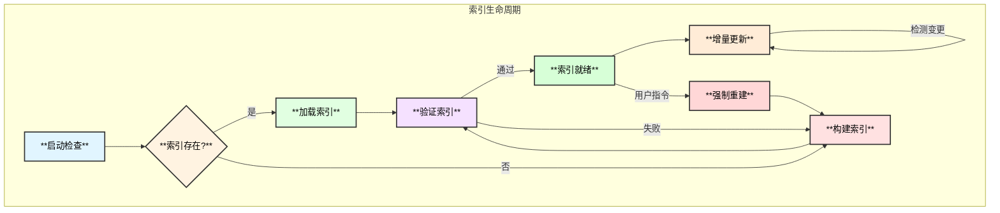
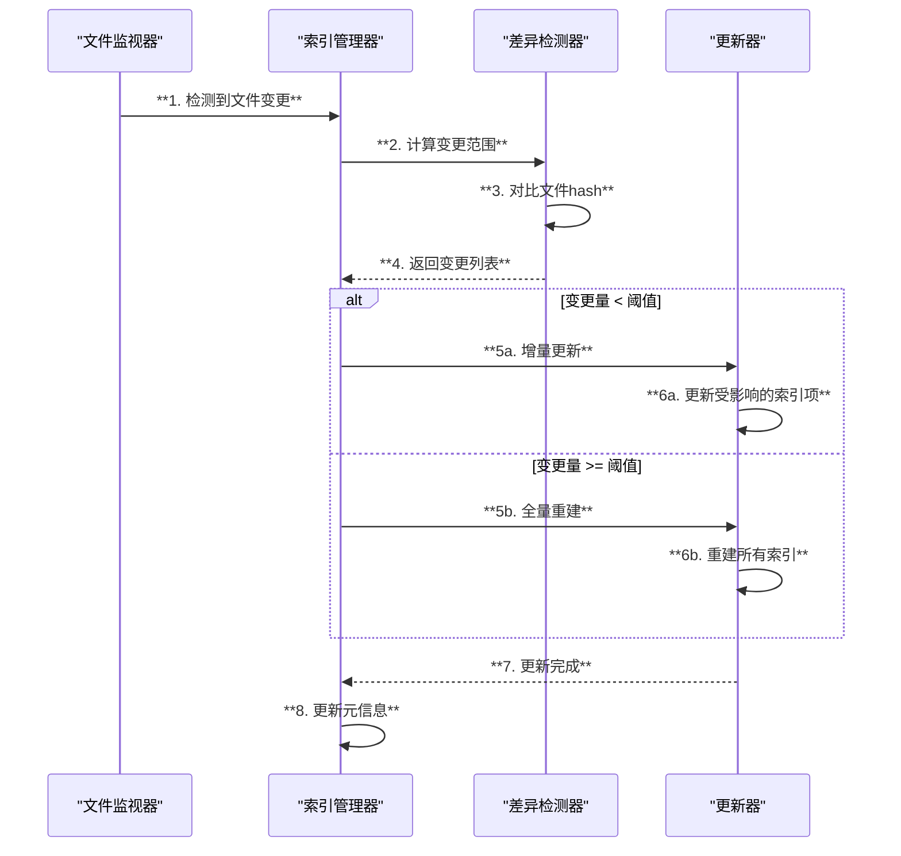
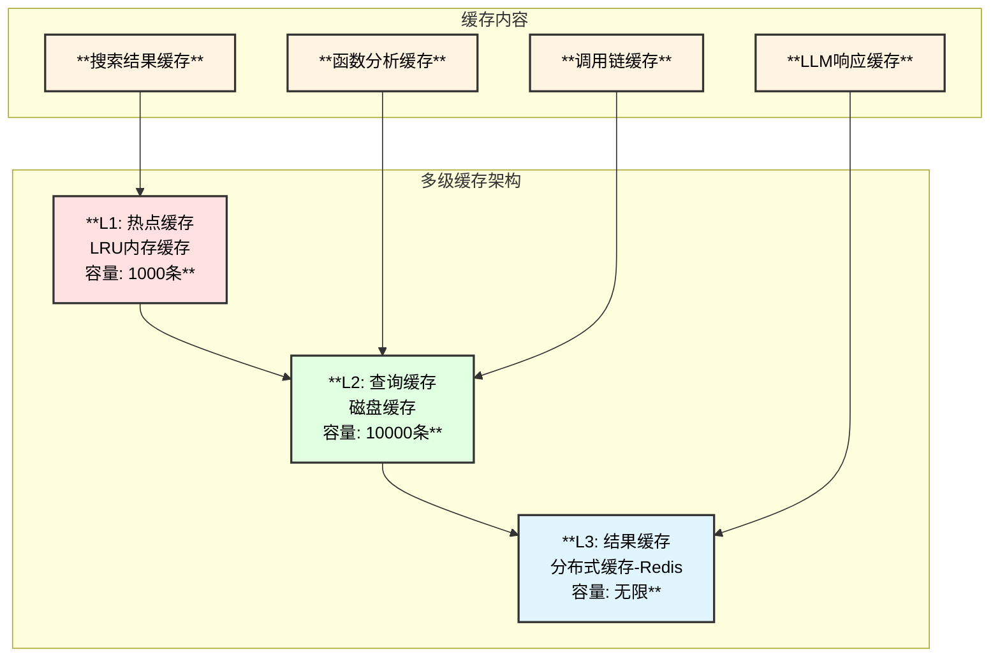
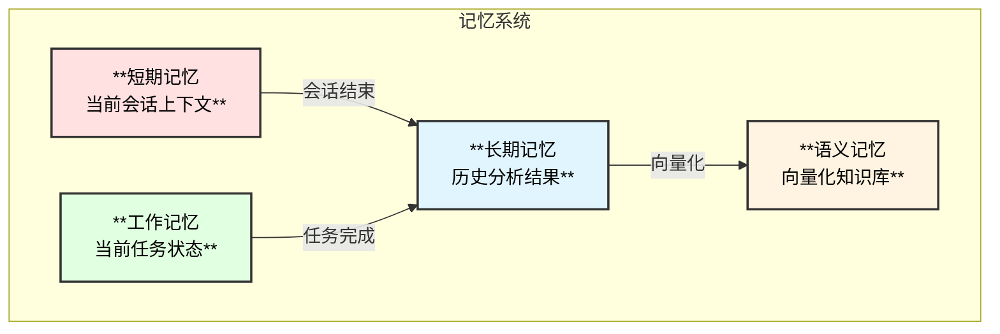
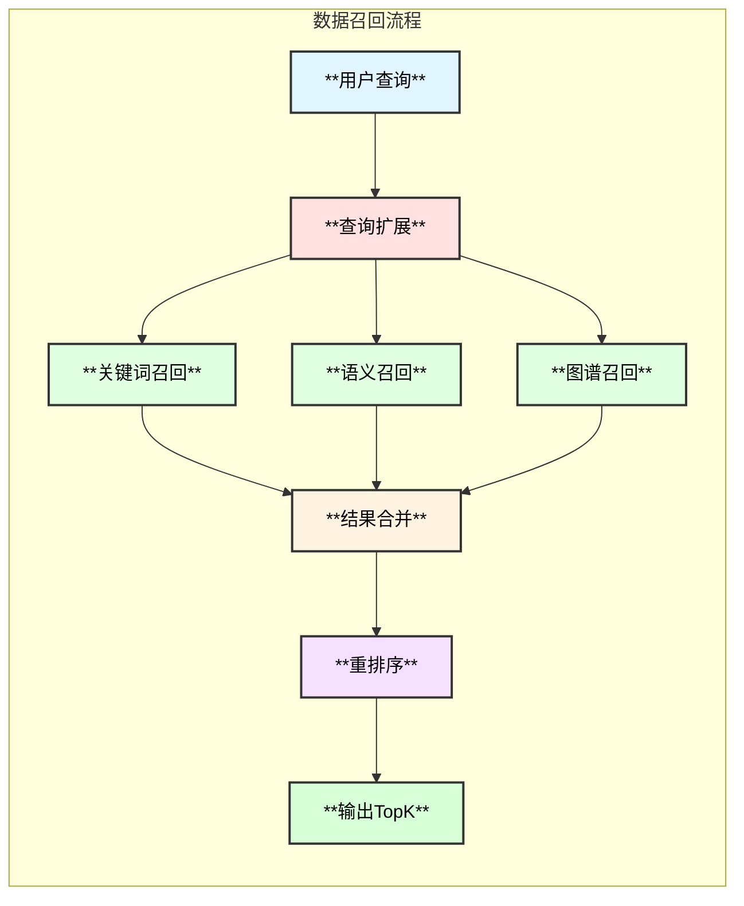

# Linux内核专家Agent - 索引与缓存系统设计

## 1. 索引系统设计

### 1.1 索引生命周期



### 1.2 索引持久化

| 索引类型 | 文件名 | 格式 | 大小估计 |
|---------|--------|------|----------|
| 倒排索引 | `inverted.idx` | gob压缩 | ~100MB |
| 函数摘要 | `functions.idx` | gob压缩 | ~50MB |
| 符号表 | `symbols.idx` | gob压缩 | ~30MB |
| 调用图 | `callgraph.idx` | gob压缩 | ~80MB |
| 元信息 | `meta.json` | JSON | ~1KB |

### 1.3 索引版本管理

```go
// IndexMeta 索引元信息
type IndexMeta struct {
    Version       string    `json:"version"`        // 索引版本
    SourceHash    string    `json:"source_hash"`    // 源码目录hash
    CreatedAt     time.Time `json:"created_at"`     // 创建时间
    LastUpdated   time.Time `json:"last_updated"`   // 最后更新
    FileCount     int       `json:"file_count"`     // 文件数量
    TotalSize     int64     `json:"total_size"`     // 总大小
    IndexerVersion string   `json:"indexer_version"` // 索引器版本
}
```

### 1.4 增量更新策略



## 2. 缓存系统设计

### 2.1 多级缓存架构



### 2.2 缓存键设计

```go
// CacheKey 缓存键生成
type CacheKeyGenerator struct{}

// 搜索缓存键: search:{hash(pattern+options)}
func (g *CacheKeyGenerator) SearchKey(pattern string, opts SearchOptions) string

// 函数分析缓存键: func:{function_name}:{file_hash}
func (g *CacheKeyGenerator) FunctionKey(name, fileHash string) string

// 调用链缓存键: callchain:{function}:{direction}:{depth}
func (g *CacheKeyGenerator) CallChainKey(function, direction string, depth int) string

// LLM响应缓存键: llm:{hash(prompt)}:{model}
func (g *CacheKeyGenerator) LLMResponseKey(prompt, model string) string
```

### 2.3 缓存策略

| 缓存类型 | 过期策略 | TTL | 淘汰策略 |
|---------|---------|-----|---------|
| 搜索结果 | 源码变更失效 | 24h | LRU |
| 函数分析 | 文件变更失效 | 7d | LFU |
| 调用链 | 依赖变更失效 | 7d | LFU |
| LLM响应 | 固定过期 | 1h | LRU |

### 2.4 缓存失效机制

```go
// CacheInvalidator 缓存失效器
type CacheInvalidator struct {
    cache CacheManager
    index IndexManager
}

// InvalidateOnFileChange 文件变更时失效
func (i *CacheInvalidator) InvalidateOnFileChange(files []string) error {
    // 1. 获取受影响的函数
    affectedFuncs := i.index.GetFunctionsInFiles(files)
    
    // 2. 失效函数相关缓存
    for _, f := range affectedFuncs {
        i.cache.Delete(CacheKeyFunction(f))
        i.cache.DeletePattern(CacheKeyCallChainPrefix(f))
    }
    
    // 3. 失效搜索缓存（涉及这些文件的）
    i.cache.DeleteByTag("search", files...)
    
    return nil
}
```

## 3. 记忆系统设计

### 3.1 记忆类型



### 3.2 记忆存储结构

```go
// Memory 记忆条目
type Memory struct {
    ID        string    `json:"id"`
    Type      MemoryType `json:"type"`
    Content   string    `json:"content"`
    Summary   string    `json:"summary"`
    Embedding []float32 `json:"embedding,omitempty"`
    Metadata  map[string]interface{} `json:"metadata"`
    CreatedAt time.Time `json:"created_at"`
    AccessedAt time.Time `json:"accessed_at"`
    AccessCount int      `json:"access_count"`
}

// MemoryType 记忆类型
type MemoryType string

const (
    MemoryShortTerm  MemoryType = "short_term"
    MemoryWorking    MemoryType = "working"
    MemoryLongTerm   MemoryType = "long_term"
    MemorySemantic   MemoryType = "semantic"
)
```

### 3.3 记忆召回

```go
// MemoryRecaller 记忆召回器
type MemoryRecaller struct {
    store     MemoryStore
    embedder  Embedder
    ranker    Ranker
}

// Recall 召回相关记忆
func (r *MemoryRecaller) Recall(ctx context.Context, query string, opts RecallOptions) ([]*Memory, error) {
    // 1. 关键词匹配召回
    keywordResults := r.recallByKeyword(query, opts.Limit)
    
    // 2. 语义相似召回
    embedding := r.embedder.Embed(query)
    semanticResults := r.recallBySemantic(embedding, opts.Limit)
    
    // 3. 混合排序
    merged := r.ranker.Rank(keywordResults, semanticResults, opts)
    
    // 4. 更新访问统计
    r.updateAccessStats(merged)
    
    return merged[:opts.TopK], nil
}
```

## 4. 数据召回优化

### 4.1 召回策略



### 4.2 Token优化策略

| 策略 | 描述 | 节省比例 |
|------|------|----------|
| 结果裁剪 | 只返回最相关的代码片段 | ~40% |
| 摘要替代 | 用函数摘要替代完整代码 | ~60% |
| 缓存命中 | 使用缓存的LLM响应 | ~100% |
| 增量上下文 | 只发送新增上下文 | ~30% |
| 压缩编码 | 压缩代码块格式 | ~20% |

### 4.3 智能裁剪

```go
// ContentTrimmer 内容裁剪器
type ContentTrimmer struct {
    tokenizer Tokenizer
    maxTokens int
}

// Trim 智能裁剪内容
func (t *ContentTrimmer) Trim(contents []Content, budget int) []Content {
    // 1. 计算每个内容的重要性分数
    scored := t.scoreContents(contents)
    
    // 2. 按重要性排序
    sort.Slice(scored, func(i, j int) bool {
        return scored[i].Score > scored[j].Score
    })
    
    // 3. 贪心选择直到预算用尽
    result := make([]Content, 0)
    usedTokens := 0
    
    for _, c := range scored {
        tokens := t.tokenizer.Count(c.Text)
        if usedTokens + tokens <= budget {
            result = append(result, c.Content)
            usedTokens += tokens
        }
    }
    
    return result
}
```

## 5. 配置项

```yaml
# 索引配置
index:
  storage_path: "/data/index"
  auto_build: true
  incremental_threshold: 100  # 增量更新阈值
  rebuild_cron: "0 3 * * 0"   # 每周日凌晨3点重建
  compression: true
  
# 缓存配置
cache:
  l1:
    type: "memory"
    max_size: 1000
    ttl: "1h"
  l2:
    type: "disk"
    path: "/data/cache"
    max_size: "1GB"
    ttl: "24h"
  l3:
    type: "redis"
    url: "${REDIS_URL}"
    ttl: "7d"

# 记忆配置
memory:
  short_term_limit: 20
  working_memory_limit: 50
  long_term_storage: "sqlite"
  embedding_model: "text-embedding-3-small"
  similarity_threshold: 0.7

# Token优化
token_optimization:
  max_context_tokens: 8000
  max_output_tokens: 4000
  enable_trimming: true
  enable_caching: true
```
