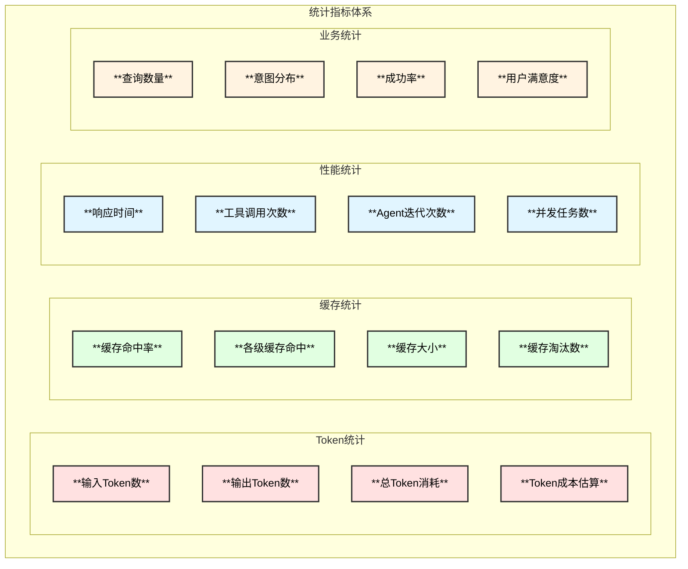

# Linux内核专家Agent - 统计模块设计

## 1. 统计指标总览



## 2. Token统计

### 2.1 Token计数器

```go
// TokenCounter Token计数器
type TokenCounter struct {
    mu        sync.RWMutex
    counters  map[string]*ModelTokenStats
    pricing   map[string]TokenPricing
}

// ModelTokenStats 模型Token统计
type ModelTokenStats struct {
    Model         string    `json:"model"`
    InputTokens   int64     `json:"input_tokens"`
    OutputTokens  int64     `json:"output_tokens"`
    TotalTokens   int64     `json:"total_tokens"`
    TotalCost     float64   `json:"total_cost"`
    RequestCount  int64     `json:"request_count"`
    LastUpdated   time.Time `json:"last_updated"`
}

// TokenPricing Token定价
type TokenPricing struct {
    InputPricePerK  float64 `json:"input_price_per_k"`
    OutputPricePerK float64 `json:"output_price_per_k"`
}

// DefaultPricing 默认定价表
var DefaultPricing = map[string]TokenPricing{
    "gpt-4-turbo":        {InputPricePerK: 0.01, OutputPricePerK: 0.03},
    "gpt-4o":             {InputPricePerK: 0.005, OutputPricePerK: 0.015},
    "gpt-4o-mini":        {InputPricePerK: 0.00015, OutputPricePerK: 0.0006},
    "claude-3-opus":      {InputPricePerK: 0.015, OutputPricePerK: 0.075},
    "claude-3-sonnet":    {InputPricePerK: 0.003, OutputPricePerK: 0.015},
    "claude-3-haiku":     {InputPricePerK: 0.00025, OutputPricePerK: 0.00125},
    "qwen-turbo":         {InputPricePerK: 0.001, OutputPricePerK: 0.002},
    "qwen-plus":          {InputPricePerK: 0.004, OutputPricePerK: 0.012},
    "qwen-max":           {InputPricePerK: 0.02, OutputPricePerK: 0.06},
    "glm-4":              {InputPricePerK: 0.01, OutputPricePerK: 0.01},
    "moonshot-v1-8k":     {InputPricePerK: 0.012, OutputPricePerK: 0.012},
    "deepseek-chat":      {InputPricePerK: 0.001, OutputPricePerK: 0.002},
    "local":              {InputPricePerK: 0, OutputPricePerK: 0},
}
```

### 2.2 Token使用报告

```go
// TokenUsageReport Token使用报告
type TokenUsageReport struct {
    Period        string                      `json:"period"`
    StartTime     time.Time                   `json:"start_time"`
    EndTime       time.Time                   `json:"end_time"`
    ByModel       map[string]*ModelTokenStats `json:"by_model"`
    ByIntent      map[string]*IntentTokenStats `json:"by_intent"`
    TotalInput    int64                       `json:"total_input"`
    TotalOutput   int64                       `json:"total_output"`
    TotalCost     float64                     `json:"total_cost"`
    CacheSavings  int64                       `json:"cache_savings"`
}

// IntentTokenStats 按意图统计
type IntentTokenStats struct {
    Intent        string  `json:"intent"`
    TokenCount    int64   `json:"token_count"`
    AvgPerRequest float64 `json:"avg_per_request"`
    RequestCount  int64   `json:"request_count"`
}
```

## 3. 缓存统计

### 3.1 缓存统计器

```go
// CacheStats 缓存统计
type CacheStats struct {
    mu sync.RWMutex
    
    // 总体统计
    Hits      int64 `json:"hits"`
    Misses    int64 `json:"misses"`
    Sets      int64 `json:"sets"`
    Deletes   int64 `json:"deletes"`
    Evictions int64 `json:"evictions"`
    
    // 分级统计
    L1Stats   *LevelStats `json:"l1_stats"`
    L2Stats   *LevelStats `json:"l2_stats"`
    L3Stats   *LevelStats `json:"l3_stats"`
    
    // 分类统计
    ByType    map[string]*TypeStats `json:"by_type"`
}

// LevelStats 缓存级别统计
type LevelStats struct {
    Level     string  `json:"level"`
    Hits      int64   `json:"hits"`
    Misses    int64   `json:"misses"`
    HitRate   float64 `json:"hit_rate"`
    Size      int64   `json:"size"`
    MaxSize   int64   `json:"max_size"`
    ItemCount int64   `json:"item_count"`
}

// TypeStats 缓存类型统计
type TypeStats struct {
    Type      string  `json:"type"`
    Hits      int64   `json:"hits"`
    Misses    int64   `json:"misses"`
    HitRate   float64 `json:"hit_rate"`
    AvgTTL    float64 `json:"avg_ttl"`
}

// HitRate 计算命中率
func (s *CacheStats) HitRate() float64 {
    total := s.Hits + s.Misses
    if total == 0 {
        return 0
    }
    return float64(s.Hits) / float64(total)
}
```

### 3.2 缓存监控

```go
// CacheMonitor 缓存监控
type CacheMonitor struct {
    stats     *CacheStats
    alerter   Alerter
    thresholds CacheThresholds
}

// CacheThresholds 缓存阈值
type CacheThresholds struct {
    MinHitRate    float64 `json:"min_hit_rate"`    // 最低命中率告警
    MaxMemoryUsage float64 `json:"max_memory_usage"` // 最大内存使用率
    MaxEvictionRate float64 `json:"max_eviction_rate"` // 最大淘汰率
}

// Check 检查并告警
func (m *CacheMonitor) Check() []Alert {
    alerts := make([]Alert, 0)
    
    if m.stats.HitRate() < m.thresholds.MinHitRate {
        alerts = append(alerts, Alert{
            Level:   "warning",
            Message: fmt.Sprintf("Cache hit rate %.2f%% below threshold %.2f%%", 
                m.stats.HitRate()*100, m.thresholds.MinHitRate*100),
        })
    }
    
    return alerts
}
```

## 4. 性能统计

### 4.1 性能指标

```go
// PerformanceStats 性能统计
type PerformanceStats struct {
    mu sync.RWMutex
    
    // 响应时间统计
    ResponseTimes *LatencyStats `json:"response_times"`
    
    // 工具调用统计
    ToolCalls     map[string]*ToolCallStats `json:"tool_calls"`
    
    // Agent统计
    AgentStats    *AgentPerformanceStats `json:"agent_stats"`
    
    // 并发统计
    Concurrency   *ConcurrencyStats `json:"concurrency"`
}

// LatencyStats 延迟统计
type LatencyStats struct {
    Count   int64   `json:"count"`
    Sum     float64 `json:"sum"`
    Min     float64 `json:"min"`
    Max     float64 `json:"max"`
    Avg     float64 `json:"avg"`
    P50     float64 `json:"p50"`
    P90     float64 `json:"p90"`
    P99     float64 `json:"p99"`
    buckets []float64 // 用于计算百分位
}

// ToolCallStats 工具调用统计
type ToolCallStats struct {
    Tool        string  `json:"tool"`
    CallCount   int64   `json:"call_count"`
    SuccessRate float64 `json:"success_rate"`
    AvgLatency  float64 `json:"avg_latency"`
    ErrorCount  int64   `json:"error_count"`
}

// AgentPerformanceStats Agent性能统计
type AgentPerformanceStats struct {
    TotalIterations int64   `json:"total_iterations"`
    AvgIterations   float64 `json:"avg_iterations"`
    MaxIterations   int64   `json:"max_iterations"`
    TimeoutCount    int64   `json:"timeout_count"`
}
```

### 4.2 性能追踪

```go
// PerformanceTracer 性能追踪器
type PerformanceTracer struct {
    stats    *PerformanceStats
    spans    map[string]*Span
    mu       sync.Mutex
}

// Span 追踪跨度
type Span struct {
    ID        string
    Name      string
    StartTime time.Time
    EndTime   time.Time
    Duration  time.Duration
    Tags      map[string]string
    Children  []*Span
}

// StartSpan 开始追踪
func (t *PerformanceTracer) StartSpan(name string) *Span {
    span := &Span{
        ID:        uuid.New().String(),
        Name:      name,
        StartTime: time.Now(),
        Tags:      make(map[string]string),
    }
    t.mu.Lock()
    t.spans[span.ID] = span
    t.mu.Unlock()
    return span
}

// EndSpan 结束追踪
func (t *PerformanceTracer) EndSpan(span *Span) {
    span.EndTime = time.Now()
    span.Duration = span.EndTime.Sub(span.StartTime)
    t.stats.ResponseTimes.Add(span.Duration.Seconds())
}
```

## 5. 业务统计

### 5.1 业务指标

```go
// BusinessStats 业务统计
type BusinessStats struct {
    mu sync.RWMutex
    
    // 查询统计
    QueryCount      int64                    `json:"query_count"`
    SuccessCount    int64                    `json:"success_count"`
    FailureCount    int64                    `json:"failure_count"`
    
    // 意图分布
    IntentDist      map[string]int64         `json:"intent_distribution"`
    
    // 时间分布
    HourlyDist      [24]int64                `json:"hourly_distribution"`
    DailyDist       map[string]int64         `json:"daily_distribution"`
    
    // 用户统计
    UniqueUsers     int64                    `json:"unique_users"`
    UserQueryDist   map[string]int64         `json:"user_query_distribution"`
}

// SuccessRate 成功率
func (s *BusinessStats) SuccessRate() float64 {
    total := s.SuccessCount + s.FailureCount
    if total == 0 {
        return 0
    }
    return float64(s.SuccessCount) / float64(total)
}
```

## 6. 统计报告

### 6.1 报告生成

```go
// ReportGenerator 报告生成器
type ReportGenerator struct {
    tokenStats *TokenCounter
    cacheStats *CacheStats
    perfStats  *PerformanceStats
    bizStats   *BusinessStats
}

// GenerateReport 生成综合报告
func (g *ReportGenerator) GenerateReport(period string) *Report {
    return &Report{
        Period:    period,
        Generated: time.Now(),
        Token:     g.tokenStats.GetReport(period),
        Cache:     g.cacheStats.GetReport(),
        Performance: g.perfStats.GetReport(),
        Business:  g.bizStats.GetReport(),
        Summary:   g.generateSummary(),
    }
}

// Report 综合报告
type Report struct {
    Period      string            `json:"period"`
    Generated   time.Time         `json:"generated"`
    Token       *TokenUsageReport `json:"token"`
    Cache       *CacheReport      `json:"cache"`
    Performance *PerformanceReport `json:"performance"`
    Business    *BusinessReport   `json:"business"`
    Summary     *ReportSummary    `json:"summary"`
}

// ReportSummary 报告摘要
type ReportSummary struct {
    TotalQueries      int64   `json:"total_queries"`
    SuccessRate       float64 `json:"success_rate"`
    AvgResponseTime   float64 `json:"avg_response_time"`
    TotalTokenCost    float64 `json:"total_token_cost"`
    CacheHitRate      float64 `json:"cache_hit_rate"`
    TokenSavings      int64   `json:"token_savings"`
    CostSavings       float64 `json:"cost_savings"`
    TopIntents        []string `json:"top_intents"`
    TopTools          []string `json:"top_tools"`
}
```

### 6.2 报告输出格式

```go
// ReportFormat 报告格式
type ReportFormat string

const (
    FormatJSON     ReportFormat = "json"
    FormatMarkdown ReportFormat = "markdown"
    FormatHTML     ReportFormat = "html"
    FormatPrometheus ReportFormat = "prometheus"
)

// Export 导出报告
func (r *Report) Export(format ReportFormat) ([]byte, error) {
    switch format {
    case FormatJSON:
        return json.MarshalIndent(r, "", "  ")
    case FormatMarkdown:
        return r.toMarkdown()
    case FormatHTML:
        return r.toHTML()
    case FormatPrometheus:
        return r.toPrometheus()
    default:
        return nil, fmt.Errorf("unsupported format: %s", format)
    }
}
```

## 7. 监控集成

### 7.1 Prometheus指标

```go
// PrometheusMetrics Prometheus指标
var (
    tokenInputTotal = prometheus.NewCounterVec(
        prometheus.CounterOpts{
            Name: "kernel_expert_token_input_total",
            Help: "Total input tokens",
        },
        []string{"model"},
    )
    
    tokenOutputTotal = prometheus.NewCounterVec(
        prometheus.CounterOpts{
            Name: "kernel_expert_token_output_total",
            Help: "Total output tokens",
        },
        []string{"model"},
    )
    
    cacheHitTotal = prometheus.NewCounterVec(
        prometheus.CounterOpts{
            Name: "kernel_expert_cache_hit_total",
            Help: "Total cache hits",
        },
        []string{"level", "type"},
    )
    
    requestLatency = prometheus.NewHistogramVec(
        prometheus.HistogramOpts{
            Name:    "kernel_expert_request_latency_seconds",
            Help:    "Request latency distribution",
            Buckets: []float64{0.1, 0.5, 1, 2, 5, 10, 30},
        },
        []string{"intent"},
    )
)
```

### 7.2 统计仪表板

```yaml
# Grafana Dashboard 配置示例
dashboard:
  title: "Linux Kernel Expert Agent"
  panels:
    - title: "Token Usage"
      type: "graph"
      queries:
        - "sum(rate(kernel_expert_token_input_total[5m])) by (model)"
        - "sum(rate(kernel_expert_token_output_total[5m])) by (model)"
    
    - title: "Cache Hit Rate"
      type: "gauge"
      query: "sum(kernel_expert_cache_hit_total) / sum(kernel_expert_cache_hit_total + kernel_expert_cache_miss_total)"
    
    - title: "Request Latency"
      type: "heatmap"
      query: "kernel_expert_request_latency_seconds_bucket"
    
    - title: "Token Cost"
      type: "stat"
      query: "sum(kernel_expert_token_cost_total)"
```

## 8. 配置

```yaml
statistics:
  enabled: true
  
  # Token统计配置
  token:
    enabled: true
    track_by_model: true
    track_by_intent: true
    pricing_update_interval: "24h"
  
  # 缓存统计配置
  cache:
    enabled: true
    track_by_level: true
    track_by_type: true
    alert_min_hit_rate: 0.5
  
  # 性能统计配置
  performance:
    enabled: true
    percentiles: [50, 90, 99]
    histogram_buckets: [0.1, 0.5, 1, 2, 5, 10, 30]
  
  # 报告配置
  report:
    auto_generate: true
    schedule: "0 0 * * *"  # 每天生成
    formats: ["json", "markdown"]
    retention: "30d"
  
  # 监控集成
  monitoring:
    prometheus:
      enabled: true
      endpoint: "/metrics"
    grafana:
      enabled: true
```
