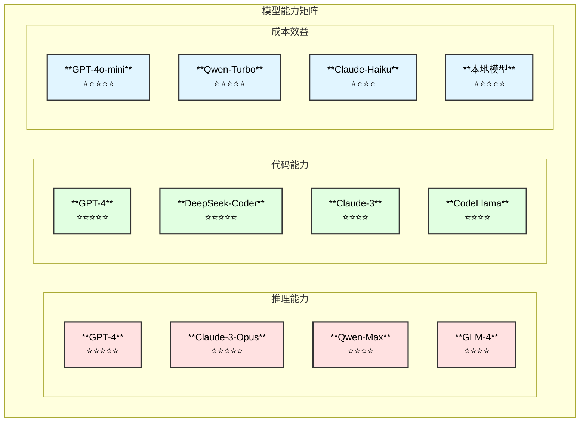
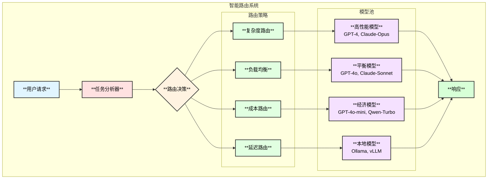

# Linux内核专家Agent - 多模型支持与路由设计

## 1. 支持的模型

### 1.1 模型清单

| 类别 | 提供商 | 模型 | 特点 |
|------|--------|------|------|
| **海外模型** | OpenAI | gpt-4-turbo, gpt-4o, gpt-4o-mini | 综合能力强 |
| | Anthropic | claude-3-opus, claude-3-sonnet, claude-3-haiku | 长上下文，推理强 |
| | Google | gemini-1.5-pro, gemini-1.5-flash | 多模态 |
| **国内模型** | 阿里 | qwen-turbo, qwen-plus, qwen-max | 中文优化 |
| | 百度 | ernie-4.0, ernie-3.5 | 中文优化 |
| | 智谱 | glm-4, glm-4v | 代码能力强 |
| | Moonshot | moonshot-v1-8k/32k/128k | 长上下文 |
| | DeepSeek | deepseek-chat, deepseek-coder | 代码专用 |
| | 百川 | baichuan-turbo | 中文优化 |
| **本地模型** | Ollama | llama3, codellama, qwen2 | 本地部署 |
| | vLLM | 自定义模型 | 高性能推理 |

### 1.2 模型能力矩阵



## 2. 模型适配器

### 2.1 统一接口

```go
// ModelProvider 模型提供商
type ModelProvider interface {
    Name() string
    Models() []string
    CreateModel(ctx context.Context, config *ModelConfig) (model.ToolCallingChatModel, error)
}

// ModelConfig 模型配置
type ModelConfig struct {
    Provider    string            `json:"provider"`
    Model       string            `json:"model"`
    APIKey      string            `json:"api_key"`
    BaseURL     string            `json:"base_url,omitempty"`
    Temperature float64           `json:"temperature"`
    MaxTokens   int               `json:"max_tokens"`
    Timeout     time.Duration     `json:"timeout"`
    Extra       map[string]string `json:"extra,omitempty"`
}

// ModelRegistry 模型注册中心
type ModelRegistry struct {
    providers map[string]ModelProvider
    mu        sync.RWMutex
}

// Register 注册提供商
func (r *ModelRegistry) Register(provider ModelProvider) {
    r.mu.Lock()
    defer r.mu.Unlock()
    r.providers[provider.Name()] = provider
}

// CreateModel 创建模型实例
func (r *ModelRegistry) CreateModel(ctx context.Context, config *ModelConfig) (model.ToolCallingChatModel, error) {
    r.mu.RLock()
    provider, ok := r.providers[config.Provider]
    r.mu.RUnlock()
    
    if !ok {
        return nil, fmt.Errorf("unknown provider: %s", config.Provider)
    }
    
    return provider.CreateModel(ctx, config)
}
```

### 2.2 提供商实现

```go
// OpenAIProvider OpenAI提供商
type OpenAIProvider struct{}

func (p *OpenAIProvider) Name() string { return "openai" }

func (p *OpenAIProvider) Models() []string {
    return []string{"gpt-4-turbo", "gpt-4o", "gpt-4o-mini", "gpt-3.5-turbo"}
}

func (p *OpenAIProvider) CreateModel(ctx context.Context, config *ModelConfig) (model.ToolCallingChatModel, error) {
    // 使用eino-ext的openai实现
    return nil, nil // 实际实现调用openai.NewChatModel
}

// QwenProvider 通义千问提供商
type QwenProvider struct{}

func (p *QwenProvider) Name() string { return "qwen" }

func (p *QwenProvider) Models() []string {
    return []string{"qwen-turbo", "qwen-plus", "qwen-max", "qwen-long"}
}

// AnthropicProvider Anthropic提供商
type AnthropicProvider struct{}

// ZhipuProvider 智谱提供商
type ZhipuProvider struct{}

// MoonshotProvider Moonshot提供商
type MoonshotProvider struct{}

// DeepSeekProvider DeepSeek提供商
type DeepSeekProvider struct{}

// OllamaProvider 本地Ollama提供商
type OllamaProvider struct{}

func (p *OllamaProvider) Name() string { return "ollama" }

func (p *OllamaProvider) Models() []string {
    // 动态获取本地可用模型
    return []string{"llama3", "codellama", "qwen2", "deepseek-coder"}
}
```

## 3. 智能路由

### 3.1 路由架构



### 3.2 路由策略

```go
// RouterStrategy 路由策略接口
type RouterStrategy interface {
    Name() string
    Route(ctx context.Context, task *Task, models []ModelInfo) (*ModelInfo, error)
}

// Task 任务信息
type Task struct {
    Intent      IntentType
    Complexity  TaskComplexity
    InputTokens int
    Priority    Priority
    Constraints *Constraints
}

// TaskComplexity 任务复杂度
type TaskComplexity int

const (
    ComplexitySimple   TaskComplexity = iota // 简单查询
    ComplexityModerate                        // 中等分析
    ComplexityComplex                         // 复杂推理
    ComplexityExpert                          // 专家级
)

// Constraints 约束条件
type Constraints struct {
    MaxLatency  time.Duration
    MaxCost     float64
    PreferLocal bool
    Models      []string // 指定模型列表
}

// ComplexityRouter 复杂度路由
type ComplexityRouter struct {
    modelMapping map[TaskComplexity][]string
}

func (r *ComplexityRouter) Route(ctx context.Context, task *Task, models []ModelInfo) (*ModelInfo, error) {
    // 根据复杂度选择模型
    preferred := r.modelMapping[task.Complexity]
    for _, p := range preferred {
        for _, m := range models {
            if m.Name == p && m.Available {
                return &m, nil
            }
        }
    }
    return nil, fmt.Errorf("no available model for complexity %d", task.Complexity)
}

// DefaultComplexityMapping 默认复杂度映射
var DefaultComplexityMapping = map[TaskComplexity][]string{
    ComplexitySimple:   {"gpt-4o-mini", "qwen-turbo", "claude-3-haiku"},
    ComplexityModerate: {"gpt-4o", "qwen-plus", "claude-3-sonnet", "glm-4"},
    ComplexityComplex:  {"gpt-4-turbo", "qwen-max", "claude-3-sonnet"},
    ComplexityExpert:   {"gpt-4-turbo", "claude-3-opus", "qwen-max"},
}

// CostRouter 成本优先路由
type CostRouter struct {
    pricing map[string]float64
}

func (r *CostRouter) Route(ctx context.Context, task *Task, models []ModelInfo) (*ModelInfo, error) {
    // 选择满足条件的最低成本模型
    var best *ModelInfo
    var bestCost float64 = math.MaxFloat64
    
    for _, m := range models {
        if !m.Available {
            continue
        }
        cost := r.estimateCost(task, m)
        if cost < bestCost && r.meetsRequirements(task, m) {
            best = &m
            bestCost = cost
        }
    }
    
    if best == nil {
        return nil, fmt.Errorf("no suitable model found")
    }
    return best, nil
}

// LatencyRouter 延迟优先路由
type LatencyRouter struct {
    latencyStats map[string]*LatencyStats
}

// LoadBalanceRouter 负载均衡路由
type LoadBalanceRouter struct {
    weights map[string]int
    current map[string]int
    mu      sync.Mutex
}
```

### 3.3 任务复杂度评估

```go
// ComplexityEvaluator 复杂度评估器
type ComplexityEvaluator struct{}

// Evaluate 评估任务复杂度
func (e *ComplexityEvaluator) Evaluate(query string, intent IntentType) TaskComplexity {
    score := 0
    
    // 基于意图
    intentScores := map[IntentType]int{
        IntentConcept:      1,
        IntentFunction:     2,
        IntentCallChain:    3,
        IntentArchitecture: 4,
        IntentComparison:   3,
        IntentDebug:        4,
    }
    score += intentScores[intent]
    
    // 基于查询长度
    if len(query) > 200 {
        score += 1
    }
    if len(query) > 500 {
        score += 1
    }
    
    // 基于关键词
    complexKeywords := []string{"为什么", "深入", "详细", "完整", "所有"}
    for _, kw := range complexKeywords {
        if strings.Contains(query, kw) {
            score += 1
        }
    }
    
    // 映射到复杂度级别
    switch {
    case score <= 2:
        return ComplexitySimple
    case score <= 4:
        return ComplexityModerate
    case score <= 6:
        return ComplexityComplex
    default:
        return ComplexityExpert
    }
}
```

## 4. 模型管理器

### 4.1 模型池

```go
// ModelPool 模型池
type ModelPool struct {
    models    map[string]*ModelInstance
    router    Router
    stats     *ModelStats
    mu        sync.RWMutex
}

// ModelInstance 模型实例
type ModelInstance struct {
    Info      ModelInfo
    Client    model.ToolCallingChatModel
    Status    ModelStatus
    LastUsed  time.Time
    UseCount  int64
    ErrorCount int64
}

// ModelStatus 模型状态
type ModelStatus int

const (
    ModelStatusReady ModelStatus = iota
    ModelStatusBusy
    ModelStatusError
    ModelStatusDisabled
)

// Acquire 获取模型实例
func (p *ModelPool) Acquire(ctx context.Context, task *Task) (*ModelInstance, error) {
    p.mu.Lock()
    defer p.mu.Unlock()
    
    // 获取可用模型列表
    available := p.getAvailableModels()
    
    // 路由选择
    selected, err := p.router.Route(ctx, task, available)
    if err != nil {
        return nil, err
    }
    
    instance := p.models[selected.Name]
    instance.Status = ModelStatusBusy
    instance.UseCount++
    
    return instance, nil
}

// Release 释放模型实例
func (p *ModelPool) Release(instance *ModelInstance, err error) {
    p.mu.Lock()
    defer p.mu.Unlock()
    
    instance.Status = ModelStatusReady
    instance.LastUsed = time.Now()
    
    if err != nil {
        instance.ErrorCount++
        if instance.ErrorCount > 3 {
            instance.Status = ModelStatusError
        }
    }
}
```

### 4.2 健康检查

```go
// HealthChecker 健康检查器
type HealthChecker struct {
    pool     *ModelPool
    interval time.Duration
    timeout  time.Duration
}

// Start 启动健康检查
func (c *HealthChecker) Start(ctx context.Context) {
    ticker := time.NewTicker(c.interval)
    defer ticker.Stop()
    
    for {
        select {
        case <-ctx.Done():
            return
        case <-ticker.C:
            c.checkAll()
        }
    }
}

// checkAll 检查所有模型
func (c *HealthChecker) checkAll() {
    for name, instance := range c.pool.models {
        go func(n string, inst *ModelInstance) {
            ctx, cancel := context.WithTimeout(context.Background(), c.timeout)
            defer cancel()
            
            if err := c.ping(ctx, inst); err != nil {
                log.Printf("Model %s health check failed: %v", n, err)
                inst.Status = ModelStatusError
            } else if inst.Status == ModelStatusError {
                inst.Status = ModelStatusReady
                inst.ErrorCount = 0
            }
        }(name, instance)
    }
}
```

## 5. 配置

### 5.1 模型配置

```yaml
models:
  # OpenAI模型
  openai:
    enabled: true
    api_key: "${OPENAI_API_KEY}"
    base_url: "https://api.openai.com/v1"
    models:
      - name: "gpt-4-turbo"
        max_tokens: 4096
        temperature: 0.1
      - name: "gpt-4o"
        max_tokens: 4096
        temperature: 0.2
      - name: "gpt-4o-mini"
        max_tokens: 4096
        temperature: 0.2
  
  # Anthropic模型
  anthropic:
    enabled: true
    api_key: "${ANTHROPIC_API_KEY}"
    models:
      - name: "claude-3-opus"
        max_tokens: 4096
      - name: "claude-3-sonnet"
        max_tokens: 4096
      - name: "claude-3-haiku"
        max_tokens: 4096
  
  # 通义千问
  qwen:
    enabled: true
    api_key: "${DASHSCOPE_API_KEY}"
    base_url: "https://dashscope.aliyuncs.com/api/v1"
    models:
      - name: "qwen-turbo"
      - name: "qwen-plus"
      - name: "qwen-max"
  
  # 智谱AI
  zhipu:
    enabled: true
    api_key: "${ZHIPU_API_KEY}"
    models:
      - name: "glm-4"
      - name: "glm-4v"
  
  # Moonshot
  moonshot:
    enabled: true
    api_key: "${MOONSHOT_API_KEY}"
    base_url: "https://api.moonshot.cn/v1"
    models:
      - name: "moonshot-v1-8k"
      - name: "moonshot-v1-32k"
      - name: "moonshot-v1-128k"
  
  # DeepSeek
  deepseek:
    enabled: true
    api_key: "${DEEPSEEK_API_KEY}"
    models:
      - name: "deepseek-chat"
      - name: "deepseek-coder"
  
  # 本地Ollama
  ollama:
    enabled: true
    base_url: "http://localhost:11434"
    models:
      - name: "llama3"
      - name: "codellama"
      - name: "qwen2"

# 路由配置
routing:
  default_strategy: "complexity"
  
  strategies:
    complexity:
      enabled: true
      mapping:
        simple: ["gpt-4o-mini", "qwen-turbo", "claude-3-haiku"]
        moderate: ["gpt-4o", "qwen-plus", "claude-3-sonnet"]
        complex: ["gpt-4-turbo", "qwen-max", "claude-3-opus"]
        expert: ["gpt-4-turbo", "claude-3-opus"]
    
    cost:
      enabled: true
      budget_limit: 10.0  # 每日预算
    
    latency:
      enabled: false
      max_latency: "5s"
    
    load_balance:
      enabled: false
      weights:
        gpt-4o: 30
        qwen-plus: 30
        claude-3-sonnet: 20
        ollama: 20

# 健康检查
health_check:
  enabled: true
  interval: "30s"
  timeout: "5s"
  retry_count: 3
```
