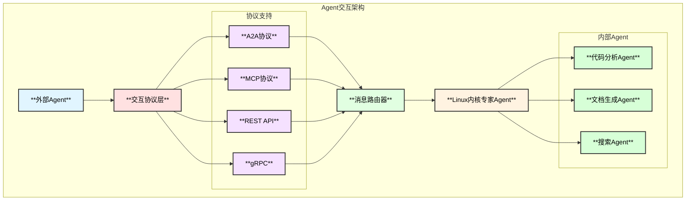
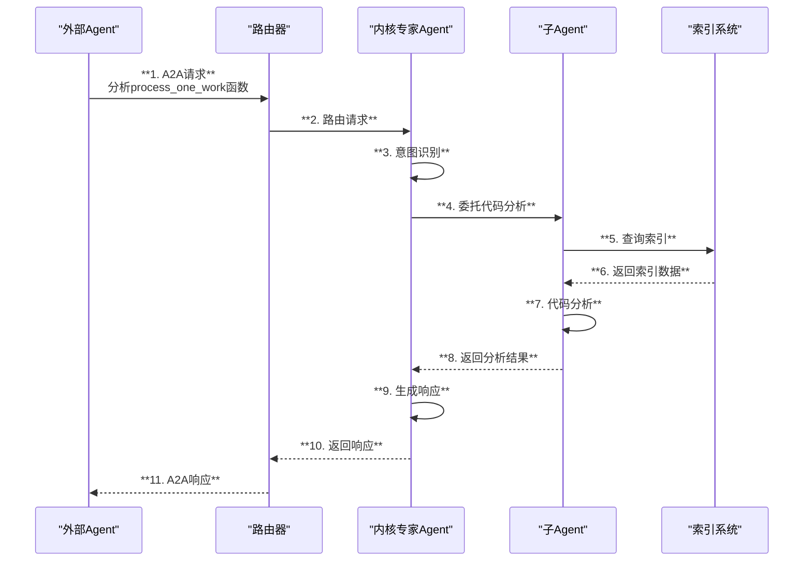
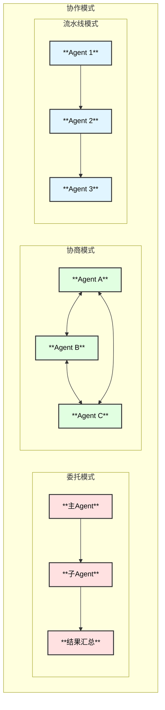

# Linux内核专家Agent - Agent交互协议设计

## 1. 交互协议概述

### 1.1 业界标准参考

| 协议/标准 | 提供者 | 特点 |
|-----------|--------|------|
| **A2A (Agent-to-Agent)** | Google | 跨Agent通信，支持任务委托 |
| **MCP (Model Context Protocol)** | Anthropic | 标准化工具和上下文接口 |
| **OpenAI Function Calling** | OpenAI | 工具调用标准 |
| **LangGraph** | LangChain | 多Agent工作流 |
| **AutoGen** | Microsoft | Agent协作框架 |

### 1.2 交互架构



## 2. A2A协议实现

### 2.1 Agent Card定义

```go
// AgentCard Agent身份卡片
type AgentCard struct {
    ID           string          `json:"id"`
    Name         string          `json:"name"`
    Description  string          `json:"description"`
    Version      string          `json:"version"`
    Capabilities []Capability    `json:"capabilities"`
    Endpoints    []Endpoint      `json:"endpoints"`
    Auth         *AuthConfig     `json:"auth,omitempty"`
    Metadata     map[string]any  `json:"metadata,omitempty"`
}

// Capability Agent能力
type Capability struct {
    Name        string            `json:"name"`
    Description string            `json:"description"`
    InputSchema  map[string]any   `json:"input_schema"`
    OutputSchema map[string]any   `json:"output_schema"`
    Examples    []Example         `json:"examples,omitempty"`
}

// Endpoint 通信端点
type Endpoint struct {
    Protocol string `json:"protocol"` // a2a, mcp, rest, grpc
    URL      string `json:"url"`
    Priority int    `json:"priority"`
}

// LinuxKernelExpertCard 内核专家Agent卡片
var LinuxKernelExpertCard = AgentCard{
    ID:          "linux-kernel-expert",
    Name:        "Linux Kernel Expert Agent",
    Description: "专业的Linux内核源码分析专家，基于源码提供权威解答",
    Version:     "1.0.0",
    Capabilities: []Capability{
        {
            Name:        "analyze_function",
            Description: "分析内核函数的实现和调用链",
            InputSchema: map[string]any{
                "type": "object",
                "properties": map[string]any{
                    "function_name": map[string]any{"type": "string"},
                    "depth":         map[string]any{"type": "integer"},
                },
                "required": []string{"function_name"},
            },
        },
        {
            Name:        "explain_subsystem",
            Description: "解释内核子系统的架构和工作原理",
            InputSchema: map[string]any{
                "type": "object",
                "properties": map[string]any{
                    "subsystem": map[string]any{"type": "string"},
                },
                "required": []string{"subsystem"},
            },
        },
        {
            Name:        "search_code",
            Description: "搜索内核源码",
            InputSchema: map[string]any{
                "type": "object",
                "properties": map[string]any{
                    "query":   map[string]any{"type": "string"},
                    "filters": map[string]any{"type": "object"},
                },
                "required": []string{"query"},
            },
        },
    },
    Endpoints: []Endpoint{
        {Protocol: "a2a", URL: "https://api.kernel-expert.com/a2a", Priority: 1},
        {Protocol: "mcp", URL: "https://api.kernel-expert.com/mcp", Priority: 2},
        {Protocol: "rest", URL: "https://api.kernel-expert.com/v1", Priority: 3},
    },
}
```

### 2.2 A2A消息格式

```go
// A2AMessage A2A消息
type A2AMessage struct {
    ID        string         `json:"id"`
    Type      A2AMessageType `json:"type"`
    From      string         `json:"from"`
    To        string         `json:"to"`
    Timestamp time.Time      `json:"timestamp"`
    Payload   any            `json:"payload"`
    Context   *A2AContext    `json:"context,omitempty"`
}

// A2AMessageType 消息类型
type A2AMessageType string

const (
    A2AMessageRequest    A2AMessageType = "request"
    A2AMessageResponse   A2AMessageType = "response"
    A2AMessageStream     A2AMessageType = "stream"
    A2AMessageError      A2AMessageType = "error"
    A2AMessageCancel     A2AMessageType = "cancel"
    A2AMessageHeartbeat  A2AMessageType = "heartbeat"
)

// A2AContext 上下文
type A2AContext struct {
    ConversationID string            `json:"conversation_id"`
    ParentID       string            `json:"parent_id,omitempty"`
    Metadata       map[string]string `json:"metadata,omitempty"`
    MaxTokens      int               `json:"max_tokens,omitempty"`
    Timeout        int               `json:"timeout_seconds,omitempty"`
}

// A2ARequest 请求
type A2ARequest struct {
    Capability string         `json:"capability"`
    Input      map[string]any `json:"input"`
    Streaming  bool           `json:"streaming"`
}

// A2AResponse 响应
type A2AResponse struct {
    Success bool           `json:"success"`
    Output  map[string]any `json:"output,omitempty"`
    Error   *A2AError      `json:"error,omitempty"`
    Usage   *Usage         `json:"usage,omitempty"`
}

// A2AError 错误
type A2AError struct {
    Code    string `json:"code"`
    Message string `json:"message"`
    Details any    `json:"details,omitempty"`
}
```

### 2.3 A2A服务实现

```go
// A2AServer A2A服务器
type A2AServer struct {
    card     *AgentCard
    agent    Agent
    handlers map[string]CapabilityHandler
}

// CapabilityHandler 能力处理器
type CapabilityHandler func(ctx context.Context, input map[string]any) (*A2AResponse, error)

// NewA2AServer 创建A2A服务器
func NewA2AServer(card *AgentCard, agent Agent) *A2AServer {
    server := &A2AServer{
        card:     card,
        agent:    agent,
        handlers: make(map[string]CapabilityHandler),
    }
    server.registerDefaultHandlers()
    return server
}

// HandleRequest 处理请求
func (s *A2AServer) HandleRequest(ctx context.Context, msg *A2AMessage) (*A2AMessage, error) {
    req, ok := msg.Payload.(*A2ARequest)
    if !ok {
        return s.errorResponse(msg, "invalid_request", "Invalid request payload")
    }
    
    handler, ok := s.handlers[req.Capability]
    if !ok {
        return s.errorResponse(msg, "capability_not_found", "Capability not found: "+req.Capability)
    }
    
    resp, err := handler(ctx, req.Input)
    if err != nil {
        return s.errorResponse(msg, "handler_error", err.Error())
    }
    
    return &A2AMessage{
        ID:        uuid.New().String(),
        Type:      A2AMessageResponse,
        From:      s.card.ID,
        To:        msg.From,
        Timestamp: time.Now(),
        Payload:   resp,
        Context:   msg.Context,
    }, nil
}
```

## 3. MCP协议实现

### 3.1 MCP工具定义

```go
// MCPTool MCP工具定义
type MCPTool struct {
    Name        string         `json:"name"`
    Description string         `json:"description"`
    InputSchema map[string]any `json:"inputSchema"`
}

// MCPServer MCP服务器
type MCPServer struct {
    name    string
    version string
    tools   []*MCPTool
    agent   Agent
}

// GetTools 获取工具列表
func (s *MCPServer) GetTools() []*MCPTool {
    return []*MCPTool{
        {
            Name:        "analyze_kernel_function",
            Description: "分析Linux内核函数",
            InputSchema: map[string]any{
                "type": "object",
                "properties": map[string]any{
                    "function_name": map[string]any{
                        "type":        "string",
                        "description": "要分析的函数名",
                    },
                    "include_callers": map[string]any{
                        "type":        "boolean",
                        "description": "是否包含调用者",
                    },
                    "include_callees": map[string]any{
                        "type":        "boolean",
                        "description": "是否包含被调用函数",
                    },
                },
                "required": []string{"function_name"},
            },
        },
        {
            Name:        "search_kernel_code",
            Description: "搜索Linux内核源码",
            InputSchema: map[string]any{
                "type": "object",
                "properties": map[string]any{
                    "query": map[string]any{
                        "type":        "string",
                        "description": "搜索关键词或正则表达式",
                    },
                    "file_pattern": map[string]any{
                        "type":        "string",
                        "description": "文件名模式",
                    },
                    "max_results": map[string]any{
                        "type":        "integer",
                        "description": "最大结果数",
                    },
                },
                "required": []string{"query"},
            },
        },
        {
            Name:        "get_kernel_doc",
            Description: "获取内核文档",
            InputSchema: map[string]any{
                "type": "object",
                "properties": map[string]any{
                    "topic": map[string]any{
                        "type":        "string",
                        "description": "文档主题",
                    },
                    "format": map[string]any{
                        "type":        "string",
                        "enum":        []string{"summary", "full", "markdown"},
                        "description": "输出格式",
                    },
                },
                "required": []string{"topic"},
            },
        },
    }
}

// CallTool 调用工具
func (s *MCPServer) CallTool(ctx context.Context, name string, args map[string]any) (any, error) {
    switch name {
    case "analyze_kernel_function":
        return s.analyzeFunction(ctx, args)
    case "search_kernel_code":
        return s.searchCode(ctx, args)
    case "get_kernel_doc":
        return s.getDoc(ctx, args)
    default:
        return nil, fmt.Errorf("unknown tool: %s", name)
    }
}
```

### 3.2 MCP资源定义

```go
// MCPResource MCP资源
type MCPResource struct {
    URI         string `json:"uri"`
    Name        string `json:"name"`
    Description string `json:"description,omitempty"`
    MimeType    string `json:"mimeType,omitempty"`
}

// GetResources 获取资源列表
func (s *MCPServer) GetResources() []*MCPResource {
    return []*MCPResource{
        {
            URI:         "kernel://source",
            Name:        "Linux Kernel Source",
            Description: "Linux内核源代码",
            MimeType:    "text/plain",
        },
        {
            URI:         "kernel://docs",
            Name:        "Kernel Documentation",
            Description: "内核官方文档",
            MimeType:    "text/markdown",
        },
        {
            URI:         "kernel://index",
            Name:        "Code Index",
            Description: "代码索引数据",
            MimeType:    "application/json",
        },
    }
}

// ReadResource 读取资源
func (s *MCPServer) ReadResource(ctx context.Context, uri string) ([]byte, error) {
    // 根据URI读取对应资源
    switch {
    case strings.HasPrefix(uri, "kernel://source/"):
        path := strings.TrimPrefix(uri, "kernel://source/")
        return s.readSourceFile(path)
    case strings.HasPrefix(uri, "kernel://docs/"):
        topic := strings.TrimPrefix(uri, "kernel://docs/")
        return s.readDoc(topic)
    default:
        return nil, fmt.Errorf("unknown resource: %s", uri)
    }
}
```

## 4. 消息路由

### 4.1 路由器

```go
// MessageRouter 消息路由器
type MessageRouter struct {
    protocols map[string]ProtocolHandler
    agents    map[string]*AgentCard
    mu        sync.RWMutex
}

// ProtocolHandler 协议处理器
type ProtocolHandler interface {
    Protocol() string
    Handle(ctx context.Context, req []byte) ([]byte, error)
}

// Route 路由消息
func (r *MessageRouter) Route(ctx context.Context, protocol string, req []byte) ([]byte, error) {
    r.mu.RLock()
    handler, ok := r.protocols[protocol]
    r.mu.RUnlock()
    
    if !ok {
        return nil, fmt.Errorf("unsupported protocol: %s", protocol)
    }
    
    return handler.Handle(ctx, req)
}

// RegisterAgent 注册外部Agent
func (r *MessageRouter) RegisterAgent(card *AgentCard) error {
    r.mu.Lock()
    defer r.mu.Unlock()
    
    r.agents[card.ID] = card
    return nil
}

// DiscoverAgents 发现可用Agent
func (r *MessageRouter) DiscoverAgents(capability string) []*AgentCard {
    r.mu.RLock()
    defer r.mu.RUnlock()
    
    var result []*AgentCard
    for _, card := range r.agents {
        for _, cap := range card.Capabilities {
            if cap.Name == capability {
                result = append(result, card)
                break
            }
        }
    }
    return result
}
```

### 4.2 跨Agent通信

```go
// AgentClient Agent客户端
type AgentClient struct {
    httpClient *http.Client
    cards      map[string]*AgentCard
}

// Call 调用外部Agent
func (c *AgentClient) Call(ctx context.Context, agentID string, capability string, input map[string]any) (*A2AResponse, error) {
    card, ok := c.cards[agentID]
    if !ok {
        return nil, fmt.Errorf("unknown agent: %s", agentID)
    }
    
    // 选择最佳端点
    endpoint := c.selectEndpoint(card.Endpoints)
    
    // 构造请求
    msg := &A2AMessage{
        ID:        uuid.New().String(),
        Type:      A2AMessageRequest,
        From:      "linux-kernel-expert",
        To:        agentID,
        Timestamp: time.Now(),
        Payload: &A2ARequest{
            Capability: capability,
            Input:      input,
        },
    }
    
    // 发送请求
    return c.sendRequest(ctx, endpoint, msg)
}

// DelegateTask 委托任务给其他Agent
func (c *AgentClient) DelegateTask(ctx context.Context, task *Task) (*TaskResult, error) {
    // 1. 发现合适的Agent
    agents := c.discoverAgents(task.RequiredCapability)
    if len(agents) == 0 {
        return nil, fmt.Errorf("no agent found for capability: %s", task.RequiredCapability)
    }
    
    // 2. 选择最佳Agent
    selected := c.selectBestAgent(agents, task)
    
    // 3. 调用Agent
    resp, err := c.Call(ctx, selected.ID, task.RequiredCapability, task.Input)
    if err != nil {
        return nil, err
    }
    
    return &TaskResult{
        AgentID: selected.ID,
        Output:  resp.Output,
    }, nil
}
```

## 5. 交互流程

### 5.1 时序图



### 5.2 协作模式



## 6. 安全与认证

### 6.1 认证机制

```go
// AuthConfig 认证配置
type AuthConfig struct {
    Type      AuthType `json:"type"`
    APIKey    string   `json:"api_key,omitempty"`
    JWTSecret string   `json:"jwt_secret,omitempty"`
    OAuth     *OAuthConfig `json:"oauth,omitempty"`
}

// AuthType 认证类型
type AuthType string

const (
    AuthNone   AuthType = "none"
    AuthAPIKey AuthType = "api_key"
    AuthJWT    AuthType = "jwt"
    AuthOAuth  AuthType = "oauth"
)

// Authenticator 认证器
type Authenticator struct {
    config *AuthConfig
}

// Authenticate 认证请求
func (a *Authenticator) Authenticate(ctx context.Context, token string) (*Identity, error) {
    switch a.config.Type {
    case AuthAPIKey:
        return a.authenticateAPIKey(token)
    case AuthJWT:
        return a.authenticateJWT(token)
    case AuthOAuth:
        return a.authenticateOAuth(ctx, token)
    default:
        return &Identity{Anonymous: true}, nil
    }
}

// Identity 身份信息
type Identity struct {
    ID        string   `json:"id"`
    Name      string   `json:"name"`
    Roles     []string `json:"roles"`
    Anonymous bool     `json:"anonymous"`
}
```

### 6.2 权限控制

```go
// PermissionChecker 权限检查器
type PermissionChecker struct {
    rules []PermissionRule
}

// PermissionRule 权限规则
type PermissionRule struct {
    Role        string   `json:"role"`
    Capabilities []string `json:"capabilities"`
    RateLimit   int      `json:"rate_limit"` // 每分钟请求数
}

// Check 检查权限
func (c *PermissionChecker) Check(identity *Identity, capability string) error {
    for _, role := range identity.Roles {
        for _, rule := range c.rules {
            if rule.Role == role {
                for _, cap := range rule.Capabilities {
                    if cap == capability || cap == "*" {
                        return nil
                    }
                }
            }
        }
    }
    return fmt.Errorf("permission denied for capability: %s", capability)
}
```

## 7. 配置

```yaml
interaction:
  # Agent身份
  agent_card:
    id: "linux-kernel-expert"
    name: "Linux Kernel Expert Agent"
    version: "1.0.0"
  
  # 协议支持
  protocols:
    a2a:
      enabled: true
      endpoint: "/a2a"
    mcp:
      enabled: true
      endpoint: "/mcp"
    rest:
      enabled: true
      endpoint: "/api/v1"
    grpc:
      enabled: false
      port: 50051
  
  # 认证配置
  auth:
    type: "api_key"
    api_keys:
      - key: "${AGENT_API_KEY_1}"
        name: "agent1"
        roles: ["admin"]
      - key: "${AGENT_API_KEY_2}"
        name: "agent2"
        roles: ["user"]
  
  # 权限配置
  permissions:
    - role: "admin"
      capabilities: ["*"]
      rate_limit: 1000
    - role: "user"
      capabilities: ["search_code", "analyze_function"]
      rate_limit: 100
  
  # 外部Agent
  external_agents:
    - id: "doc-agent"
      name: "Documentation Agent"
      endpoint: "https://doc-agent.example.com/a2a"
      capabilities: ["generate_doc", "format_doc"]
    - id: "review-agent"
      name: "Code Review Agent"
      endpoint: "https://review-agent.example.com/a2a"
      capabilities: ["review_code", "suggest_fix"]
```
