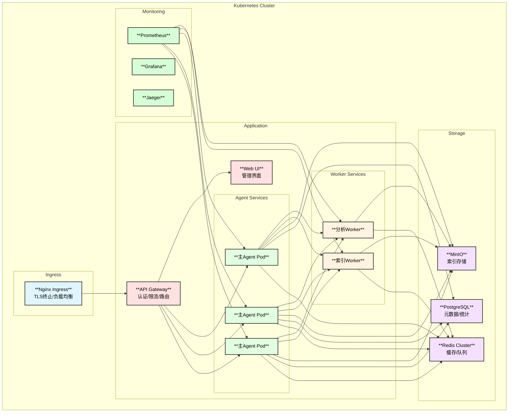

# Linux内核专家Agent - K8S部署方案

## 1. 部署架构

### 1.1 整体架构



### 1.2 命名空间规划

| Namespace | 用途 | 资源 |
|-----------|------|------|
| `kernel-expert` | 应用命名空间 | Agent, Worker, API |
| `kernel-expert-storage` | 存储服务 | Redis, PostgreSQL, MinIO |
| `kernel-expert-monitor` | 监控服务 | Prometheus, Grafana, Jaeger |

## 2. Helm Chart结构

```
kernel-expert-chart/
├── Chart.yaml
├── values.yaml
├── values-dev.yaml
├── values-staging.yaml
├── values-prod.yaml
├── templates/
│   ├── _helpers.tpl
│   ├── namespace.yaml
│   ├── configmap.yaml
│   ├── secret.yaml
│   ├── deployment-agent.yaml
│   ├── deployment-worker.yaml
│   ├── deployment-api.yaml
│   ├── service.yaml
│   ├── ingress.yaml
│   ├── hpa.yaml
│   ├── pdb.yaml
│   ├── serviceaccount.yaml
│   ├── rbac.yaml
│   └── servicemonitor.yaml
└── charts/
    ├── redis/
    ├── postgresql/
    └── minio/
```

## 3. 核心配置

### 3.1 ConfigMap

```yaml
# templates/configmap.yaml
apiVersion: v1
kind: ConfigMap
metadata:
  name: {{ include "kernel-expert.fullname" . }}-config
  namespace: {{ .Release.Namespace }}
data:
  config.yaml: |
    server:
      port: {{ .Values.server.port }}
      mode: {{ .Values.server.mode }}
      
    index:
      storage_path: {{ .Values.index.storagePath }}
      auto_build: {{ .Values.index.autoBuild }}
      incremental_threshold: {{ .Values.index.incrementalThreshold }}
      rebuild_cron: {{ .Values.index.rebuildCron | quote }}
      
    cache:
      l1:
        type: "memory"
        max_size: {{ .Values.cache.l1.maxSize }}
        ttl: {{ .Values.cache.l1.ttl | quote }}
      l2:
        type: "disk"
        path: "/data/cache"
        max_size: {{ .Values.cache.l2.maxSize | quote }}
        ttl: {{ .Values.cache.l2.ttl | quote }}
      l3:
        type: "redis"
        url: "redis://{{ .Release.Name }}-redis-master:6379"
        ttl: {{ .Values.cache.l3.ttl | quote }}
        
    memory:
      short_term_limit: {{ .Values.memory.shortTermLimit }}
      working_memory_limit: {{ .Values.memory.workingMemoryLimit }}
      long_term_storage: "postgresql"
      
    statistics:
      enabled: {{ .Values.statistics.enabled }}
      prometheus:
        enabled: true
        endpoint: "/metrics"
        
    routing:
      default_strategy: {{ .Values.routing.defaultStrategy | quote }}
      
    interaction:
      protocols:
        a2a:
          enabled: {{ .Values.interaction.a2a.enabled }}
        mcp:
          enabled: {{ .Values.interaction.mcp.enabled }}
        rest:
          enabled: true
```

### 3.2 Secret

```yaml
# templates/secret.yaml
apiVersion: v1
kind: Secret
metadata:
  name: {{ include "kernel-expert.fullname" . }}-secrets
  namespace: {{ .Release.Namespace }}
type: Opaque
stringData:
  # OpenAI
  OPENAI_API_KEY: {{ .Values.secrets.openaiApiKey | quote }}
  
  # Anthropic
  ANTHROPIC_API_KEY: {{ .Values.secrets.anthropicApiKey | quote }}
  
  # 国内模型
  DASHSCOPE_API_KEY: {{ .Values.secrets.dashscopeApiKey | quote }}
  ZHIPU_API_KEY: {{ .Values.secrets.zhipuApiKey | quote }}
  MOONSHOT_API_KEY: {{ .Values.secrets.moonshotApiKey | quote }}
  DEEPSEEK_API_KEY: {{ .Values.secrets.deepseekApiKey | quote }}
  BAICHUAN_API_KEY: {{ .Values.secrets.baichuanApiKey | quote }}
  ERNIE_API_KEY: {{ .Values.secrets.ernieApiKey | quote }}
  ERNIE_SECRET_KEY: {{ .Values.secrets.ernieSecretKey | quote }}
  
  # 数据库
  POSTGRES_URL: {{ .Values.secrets.postgresUrl | quote }}
  REDIS_URL: {{ .Values.secrets.redisUrl | quote }}
  
  # Agent认证
  AGENT_API_KEY: {{ .Values.secrets.agentApiKey | quote }}
  JWT_SECRET: {{ .Values.secrets.jwtSecret | quote }}
```

### 3.3 Deployment

```yaml
# templates/deployment-agent.yaml
apiVersion: apps/v1
kind: Deployment
metadata:
  name: {{ include "kernel-expert.fullname" . }}-agent
  namespace: {{ .Release.Namespace }}
  labels:
    {{- include "kernel-expert.labels" . | nindent 4 }}
    app.kubernetes.io/component: agent
spec:
  replicas: {{ .Values.agent.replicas }}
  selector:
    matchLabels:
      {{- include "kernel-expert.selectorLabels" . | nindent 6 }}
      app.kubernetes.io/component: agent
  template:
    metadata:
      labels:
        {{- include "kernel-expert.selectorLabels" . | nindent 8 }}
        app.kubernetes.io/component: agent
      annotations:
        prometheus.io/scrape: "true"
        prometheus.io/port: {{ .Values.server.port | quote }}
        prometheus.io/path: "/metrics"
    spec:
      serviceAccountName: {{ include "kernel-expert.serviceAccountName" . }}
      containers:
        - name: agent
          image: "{{ .Values.image.repository }}:{{ .Values.image.tag }}"
          imagePullPolicy: {{ .Values.image.pullPolicy }}
          ports:
            - name: http
              containerPort: {{ .Values.server.port }}
              protocol: TCP
          env:
            - name: POD_NAME
              valueFrom:
                fieldRef:
                  fieldPath: metadata.name
            - name: POD_NAMESPACE
              valueFrom:
                fieldRef:
                  fieldPath: metadata.namespace
          envFrom:
            - secretRef:
                name: {{ include "kernel-expert.fullname" . }}-secrets
          volumeMounts:
            - name: config
              mountPath: /app/config
            - name: index-data
              mountPath: /data/index
            - name: cache-data
              mountPath: /data/cache
            - name: kernel-source
              mountPath: /data/linux
              readOnly: true
          resources:
            {{- toYaml .Values.agent.resources | nindent 12 }}
          livenessProbe:
            httpGet:
              path: /health
              port: http
            initialDelaySeconds: 30
            periodSeconds: 10
          readinessProbe:
            httpGet:
              path: /ready
              port: http
            initialDelaySeconds: 10
            periodSeconds: 5
      volumes:
        - name: config
          configMap:
            name: {{ include "kernel-expert.fullname" . }}-config
        - name: index-data
          persistentVolumeClaim:
            claimName: {{ include "kernel-expert.fullname" . }}-index
        - name: cache-data
          emptyDir:
            sizeLimit: {{ .Values.cache.l2.maxSize }}
        - name: kernel-source
          persistentVolumeClaim:
            claimName: {{ include "kernel-expert.fullname" . }}-source
      {{- with .Values.agent.nodeSelector }}
      nodeSelector:
        {{- toYaml . | nindent 8 }}
      {{- end }}
      {{- with .Values.agent.affinity }}
      affinity:
        {{- toYaml . | nindent 8 }}
      {{- end }}
      {{- with .Values.agent.tolerations }}
      tolerations:
        {{- toYaml . | nindent 8 }}
      {{- end }}
```

### 3.4 HPA

```yaml
# templates/hpa.yaml
{{- if .Values.autoscaling.enabled }}
apiVersion: autoscaling/v2
kind: HorizontalPodAutoscaler
metadata:
  name: {{ include "kernel-expert.fullname" . }}-agent
  namespace: {{ .Release.Namespace }}
spec:
  scaleTargetRef:
    apiVersion: apps/v1
    kind: Deployment
    name: {{ include "kernel-expert.fullname" . }}-agent
  minReplicas: {{ .Values.autoscaling.minReplicas }}
  maxReplicas: {{ .Values.autoscaling.maxReplicas }}
  metrics:
    - type: Resource
      resource:
        name: cpu
        target:
          type: Utilization
          averageUtilization: {{ .Values.autoscaling.targetCPUUtilization }}
    - type: Resource
      resource:
        name: memory
        target:
          type: Utilization
          averageUtilization: {{ .Values.autoscaling.targetMemoryUtilization }}
    {{- if .Values.autoscaling.customMetrics }}
    - type: Pods
      pods:
        metric:
          name: kernel_expert_request_rate
        target:
          type: AverageValue
          averageValue: {{ .Values.autoscaling.targetRequestRate }}
    {{- end }}
  behavior:
    scaleDown:
      stabilizationWindowSeconds: 300
      policies:
        - type: Percent
          value: 10
          periodSeconds: 60
    scaleUp:
      stabilizationWindowSeconds: 0
      policies:
        - type: Percent
          value: 100
          periodSeconds: 15
        - type: Pods
          value: 4
          periodSeconds: 15
      selectPolicy: Max
{{- end }}
```

## 4. Values文件

### 4.1 默认配置

```yaml
# values.yaml
nameOverride: ""
fullnameOverride: ""

image:
  repository: registry.example.com/kernel-expert
  tag: "latest"
  pullPolicy: IfNotPresent

server:
  port: 8080
  mode: "production"

# Agent配置
agent:
  replicas: 3
  resources:
    requests:
      cpu: "500m"
      memory: "1Gi"
    limits:
      cpu: "2000m"
      memory: "4Gi"
  nodeSelector: {}
  affinity: {}
  tolerations: []

# Worker配置
worker:
  replicas: 2
  resources:
    requests:
      cpu: "250m"
      memory: "512Mi"
    limits:
      cpu: "1000m"
      memory: "2Gi"

# 自动伸缩
autoscaling:
  enabled: true
  minReplicas: 2
  maxReplicas: 10
  targetCPUUtilization: 70
  targetMemoryUtilization: 80
  customMetrics: true
  targetRequestRate: "100"

# 索引配置
index:
  storagePath: "/data/index"
  autoBuild: true
  incrementalThreshold: 100
  rebuildCron: "0 3 * * 0"

# 缓存配置
cache:
  l1:
    maxSize: 1000
    ttl: "1h"
  l2:
    maxSize: "1Gi"
    ttl: "24h"
  l3:
    ttl: "7d"

# 记忆配置
memory:
  shortTermLimit: 20
  workingMemoryLimit: 50

# 统计配置
statistics:
  enabled: true

# 路由配置
routing:
  defaultStrategy: "complexity"

# 交互配置
interaction:
  a2a:
    enabled: true
  mcp:
    enabled: true

# 模型配置开关
models:
  openai:
    enabled: true
  anthropic:
    enabled: true
  qwen:
    enabled: true
  zhipu:
    enabled: true
  moonshot:
    enabled: true
  deepseek:
    enabled: true
  baichuan:
    enabled: false
  ernie:
    enabled: false
  ollama:
    enabled: false
    endpoint: "http://ollama:11434"

# Secrets (需要在部署时覆盖)
secrets:
  openaiApiKey: ""
  anthropicApiKey: ""
  dashscopeApiKey: ""
  zhipuApiKey: ""
  moonshotApiKey: ""
  deepseekApiKey: ""
  baichuanApiKey: ""
  ernieApiKey: ""
  ernieSecretKey: ""
  postgresUrl: ""
  redisUrl: ""
  agentApiKey: ""
  jwtSecret: ""

# Ingress配置
ingress:
  enabled: true
  className: "nginx"
  annotations:
    cert-manager.io/cluster-issuer: letsencrypt-prod
    nginx.ingress.kubernetes.io/proxy-body-size: "50m"
    nginx.ingress.kubernetes.io/proxy-read-timeout: "300"
  hosts:
    - host: kernel-expert.example.com
      paths:
        - path: /
          pathType: Prefix
  tls:
    - secretName: kernel-expert-tls
      hosts:
        - kernel-expert.example.com

# PVC配置
persistence:
  index:
    enabled: true
    storageClass: "standard"
    size: "50Gi"
  source:
    enabled: true
    storageClass: "standard"
    size: "10Gi"

# Redis子chart配置
redis:
  enabled: true
  architecture: replication
  auth:
    enabled: true
    password: ""
  master:
    resources:
      requests:
        cpu: "100m"
        memory: "128Mi"
  replica:
    replicaCount: 2
    resources:
      requests:
        cpu: "100m"
        memory: "128Mi"

# PostgreSQL子chart配置
postgresql:
  enabled: true
  auth:
    postgresPassword: ""
    database: "kernel_expert"
  primary:
    resources:
      requests:
        cpu: "100m"
        memory: "256Mi"
    persistence:
      size: "10Gi"

# MinIO子chart配置
minio:
  enabled: true
  mode: standalone
  resources:
    requests:
      cpu: "100m"
      memory: "256Mi"
  persistence:
    size: "50Gi"
  rootUser: ""
  rootPassword: ""
```

### 4.2 生产环境配置

```yaml
# values-prod.yaml
image:
  tag: "v1.0.0"

agent:
  replicas: 5
  resources:
    requests:
      cpu: "1000m"
      memory: "2Gi"
    limits:
      cpu: "4000m"
      memory: "8Gi"
  affinity:
    podAntiAffinity:
      requiredDuringSchedulingIgnoredDuringExecution:
        - labelSelector:
            matchLabels:
              app.kubernetes.io/component: agent
          topologyKey: kubernetes.io/hostname

autoscaling:
  minReplicas: 5
  maxReplicas: 20

cache:
  l2:
    maxSize: "5Gi"

persistence:
  index:
    storageClass: "ssd"
    size: "100Gi"
  source:
    storageClass: "ssd"
    size: "20Gi"

redis:
  replica:
    replicaCount: 3
  master:
    resources:
      requests:
        cpu: "500m"
        memory: "512Mi"

postgresql:
  primary:
    resources:
      requests:
        cpu: "500m"
        memory: "1Gi"
    persistence:
      size: "50Gi"
```

## 5. 一键部署脚本

### 5.1 部署脚本

```bash
#!/bin/bash
# deploy.sh - 一键部署脚本

set -e

# 颜色定义
RED='\033[0;31m'
GREEN='\033[0;32m'
YELLOW='\033[1;33m'
NC='\033[0m'

# 配置
NAMESPACE=${NAMESPACE:-"kernel-expert"}
RELEASE_NAME=${RELEASE_NAME:-"kernel-expert"}
CHART_PATH=${CHART_PATH:-"./kernel-expert-chart"}
VALUES_FILE=${VALUES_FILE:-"values.yaml"}
ENV=${ENV:-"dev"}

log_info() { echo -e "${GREEN}[INFO]${NC} $1"; }
log_warn() { echo -e "${YELLOW}[WARN]${NC} $1"; }
log_error() { echo -e "${RED}[ERROR]${NC} $1"; }

# 检查依赖
check_dependencies() {
    log_info "检查依赖..."
    
    for cmd in kubectl helm; do
        if ! command -v $cmd &> /dev/null; then
            log_error "$cmd 未安装"
            exit 1
        fi
    done
    
    log_info "依赖检查通过"
}

# 创建命名空间
create_namespace() {
    log_info "创建命名空间: $NAMESPACE"
    kubectl create namespace $NAMESPACE --dry-run=client -o yaml | kubectl apply -f -
}

# 创建Secrets (从环境变量)
create_secrets() {
    log_info "创建Secrets..."
    
    # 检查必要的环境变量
    required_vars=(
        "OPENAI_API_KEY"
        "POSTGRES_PASSWORD"
        "REDIS_PASSWORD"
        "JWT_SECRET"
    )
    
    for var in "${required_vars[@]}"; do
        if [ -z "${!var}" ]; then
            log_warn "环境变量 $var 未设置"
        fi
    done
}

# 部署依赖服务
deploy_dependencies() {
    log_info "部署依赖服务..."
    
    # 添加Helm仓库
    helm repo add bitnami https://charts.bitnami.com/bitnami
    helm repo update
    
    log_info "依赖服务将通过子chart部署"
}

# 部署应用
deploy_app() {
    log_info "部署应用: $RELEASE_NAME"
    
    # 选择values文件
    local values_files="-f $CHART_PATH/values.yaml"
    if [ -f "$CHART_PATH/values-$ENV.yaml" ]; then
        values_files="$values_files -f $CHART_PATH/values-$ENV.yaml"
    fi
    
    # 添加secrets覆盖
    local set_values=""
    [ -n "$OPENAI_API_KEY" ] && set_values="$set_values --set secrets.openaiApiKey=$OPENAI_API_KEY"
    [ -n "$ANTHROPIC_API_KEY" ] && set_values="$set_values --set secrets.anthropicApiKey=$ANTHROPIC_API_KEY"
    [ -n "$DASHSCOPE_API_KEY" ] && set_values="$set_values --set secrets.dashscopeApiKey=$DASHSCOPE_API_KEY"
    [ -n "$ZHIPU_API_KEY" ] && set_values="$set_values --set secrets.zhipuApiKey=$ZHIPU_API_KEY"
    [ -n "$MOONSHOT_API_KEY" ] && set_values="$set_values --set secrets.moonshotApiKey=$MOONSHOT_API_KEY"
    [ -n "$DEEPSEEK_API_KEY" ] && set_values="$set_values --set secrets.deepseekApiKey=$DEEPSEEK_API_KEY"
    [ -n "$POSTGRES_PASSWORD" ] && set_values="$set_values --set postgresql.auth.postgresPassword=$POSTGRES_PASSWORD"
    [ -n "$REDIS_PASSWORD" ] && set_values="$set_values --set redis.auth.password=$REDIS_PASSWORD"
    [ -n "$JWT_SECRET" ] && set_values="$set_values --set secrets.jwtSecret=$JWT_SECRET"
    
    # 执行部署
    helm upgrade --install $RELEASE_NAME $CHART_PATH \
        --namespace $NAMESPACE \
        $values_files \
        $set_values \
        --wait \
        --timeout 10m
    
    log_info "部署完成"
}

# 验证部署
verify_deployment() {
    log_info "验证部署..."
    
    # 等待Pod就绪
    kubectl wait --for=condition=ready pod \
        -l app.kubernetes.io/name=kernel-expert \
        -n $NAMESPACE \
        --timeout=300s
    
    # 获取服务信息
    log_info "服务状态:"
    kubectl get pods -n $NAMESPACE
    kubectl get svc -n $NAMESPACE
    
    log_info "部署验证完成"
}

# 显示访问信息
show_access_info() {
    log_info "访问信息:"
    
    # 获取Ingress地址
    local ingress_ip=$(kubectl get ingress -n $NAMESPACE -o jsonpath='{.items[0].status.loadBalancer.ingress[0].ip}')
    local ingress_host=$(kubectl get ingress -n $NAMESPACE -o jsonpath='{.items[0].spec.rules[0].host}')
    
    echo ""
    echo "API地址: https://$ingress_host"
    echo "健康检查: https://$ingress_host/health"
    echo "Metrics: https://$ingress_host/metrics"
    echo ""
}

# 主函数
main() {
    log_info "开始部署 Linux内核专家Agent"
    log_info "环境: $ENV"
    log_info "命名空间: $NAMESPACE"
    
    check_dependencies
    create_namespace
    create_secrets
    deploy_dependencies
    deploy_app
    verify_deployment
    show_access_info
    
    log_info "部署成功完成!"
}

# 执行
main "$@"
```

### 5.2 卸载脚本

```bash
#!/bin/bash
# uninstall.sh - 卸载脚本

NAMESPACE=${NAMESPACE:-"kernel-expert"}
RELEASE_NAME=${RELEASE_NAME:-"kernel-expert"}

echo "卸载 $RELEASE_NAME..."

# 卸载Helm release
helm uninstall $RELEASE_NAME -n $NAMESPACE

# 删除PVC (可选)
read -p "是否删除持久化数据? (y/N) " -n 1 -r
echo
if [[ $REPLY =~ ^[Yy]$ ]]; then
    kubectl delete pvc -l app.kubernetes.io/name=kernel-expert -n $NAMESPACE
fi

# 删除命名空间 (可选)
read -p "是否删除命名空间? (y/N) " -n 1 -r
echo
if [[ $REPLY =~ ^[Yy]$ ]]; then
    kubectl delete namespace $NAMESPACE
fi

echo "卸载完成"
```

## 6. 监控配置

### 6.1 ServiceMonitor

```yaml
# templates/servicemonitor.yaml
{{- if .Values.serviceMonitor.enabled }}
apiVersion: monitoring.coreos.com/v1
kind: ServiceMonitor
metadata:
  name: {{ include "kernel-expert.fullname" . }}
  namespace: {{ .Release.Namespace }}
  labels:
    {{- include "kernel-expert.labels" . | nindent 4 }}
spec:
  selector:
    matchLabels:
      {{- include "kernel-expert.selectorLabels" . | nindent 6 }}
  endpoints:
    - port: http
      path: /metrics
      interval: 30s
      scrapeTimeout: 10s
  namespaceSelector:
    matchNames:
      - {{ .Release.Namespace }}
{{- end }}
```

### 6.2 告警规则

```yaml
# templates/prometheusrule.yaml
{{- if .Values.alerts.enabled }}
apiVersion: monitoring.coreos.com/v1
kind: PrometheusRule
metadata:
  name: {{ include "kernel-expert.fullname" . }}
  namespace: {{ .Release.Namespace }}
spec:
  groups:
    - name: kernel-expert.rules
      rules:
        - alert: KernelExpertHighErrorRate
          expr: |
            sum(rate(kernel_expert_request_errors_total[5m])) 
            / sum(rate(kernel_expert_request_total[5m])) > 0.05
          for: 5m
          labels:
            severity: warning
          annotations:
            summary: "High error rate detected"
            description: "Error rate is above 5%"
            
        - alert: KernelExpertHighLatency
          expr: |
            histogram_quantile(0.95, 
              sum(rate(kernel_expert_request_latency_seconds_bucket[5m])) by (le)
            ) > 5
          for: 5m
          labels:
            severity: warning
          annotations:
            summary: "High latency detected"
            description: "P95 latency is above 5 seconds"
            
        - alert: KernelExpertLowCacheHitRate
          expr: |
            sum(kernel_expert_cache_hit_total) 
            / (sum(kernel_expert_cache_hit_total) + sum(kernel_expert_cache_miss_total)) < 0.5
          for: 10m
          labels:
            severity: warning
          annotations:
            summary: "Low cache hit rate"
            description: "Cache hit rate is below 50%"
{{- end }}
```

## 7. 配置清单

| 配置项 | 环境变量 | Helm值 | 描述 |
|--------|----------|--------|------|
| OpenAI API Key | `OPENAI_API_KEY` | `secrets.openaiApiKey` | OpenAI接口密钥 |
| Anthropic API Key | `ANTHROPIC_API_KEY` | `secrets.anthropicApiKey` | Anthropic接口密钥 |
| 通义千问API Key | `DASHSCOPE_API_KEY` | `secrets.dashscopeApiKey` | 阿里云灵积密钥 |
| 智谱API Key | `ZHIPU_API_KEY` | `secrets.zhipuApiKey` | 智谱AI密钥 |
| Moonshot API Key | `MOONSHOT_API_KEY` | `secrets.moonshotApiKey` | Moonshot密钥 |
| DeepSeek API Key | `DEEPSEEK_API_KEY` | `secrets.deepseekApiKey` | DeepSeek密钥 |
| PostgreSQL密码 | `POSTGRES_PASSWORD` | `postgresql.auth.postgresPassword` | 数据库密码 |
| Redis密码 | `REDIS_PASSWORD` | `redis.auth.password` | Redis密码 |
| JWT密钥 | `JWT_SECRET` | `secrets.jwtSecret` | JWT签名密钥 |
| Agent副本数 | - | `agent.replicas` | Agent Pod数量 |
| 启用自动伸缩 | - | `autoscaling.enabled` | 是否启用HPA |
| 模型路由策略 | - | `routing.defaultStrategy` | 默认路由策略 |
| 启用A2A协议 | - | `interaction.a2a.enabled` | 是否启用A2A |
| 启用MCP协议 | - | `interaction.mcp.enabled` | 是否启用MCP |
