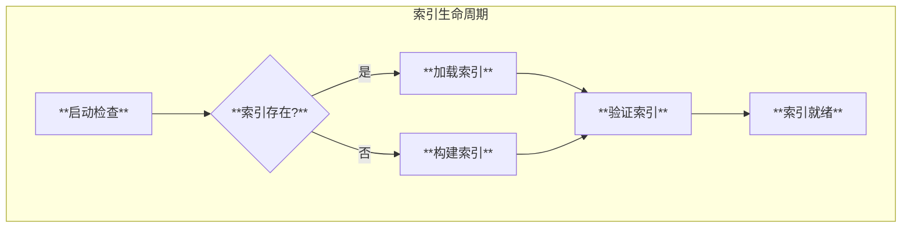

# Linux内核专家Agent

基于Eino框架开发的Linux内核源码分析专家Agent，能够以源码为依据解答Linux相关问题。

## 功能特性

### 核心功能

- **源码分析**: 基于Linux内核源码进行深度分析
- **多级缓存**: L1内存缓存 + L2磁盘缓存 + L3分布式缓存
- **智能路由**: 根据任务复杂度自动选择最优模型
- **统计监控**: Token使用、缓存命中、性能指标全方位监控
- **多协议支持**: 支持A2A、MCP、REST等多种交互协议

### 索引系统



- 一次性创建，持久化存储
- 支持增量更新和强制重建
- 倒排索引、函数摘要、调用图

### 多模型支持

| 类别 | 提供商 | 支持模型 |
|------|--------|----------|
| 海外模型 | OpenAI | GPT-4-Turbo, GPT-4o, GPT-4o-mini |
| | Anthropic | Claude-3-Opus, Claude-3-Sonnet, Claude-3-Haiku |
| 国内模型 | 阿里 | 通义千问(qwen-turbo/plus/max/long) |
| | 智谱 | GLM-4, GLM-4V |
| | Moonshot | Moonshot-v1(8k/32k/128k) |
| | DeepSeek | DeepSeek-Chat, DeepSeek-Coder |
| | 百川 | Baichuan-Turbo |
| | 百度 | ERNIE-4.0, ERNIE-3.5 |
| 本地模型 | Ollama | Llama3, CodeLlama, Qwen2 |

### 智能路由策略

- **复杂度路由**: 根据问题复杂度选择模型
- **成本路由**: 在预算内选择最优模型
- **延迟路由**: 优先选择响应快的模型
- **负载均衡**: 分散请求压力

## 快速开始

### 本地运行

```bash
# 克隆仓库
git clone https://github.com/cloudwego/eino.git
cd eino/vdocs/kernel_expert

# 安装依赖
go mod download

# 设置环境变量
export OPENAI_API_KEY="your-api-key"
export LINUX_SOURCE_PATH="/path/to/linux"

# 运行
go run main.go
```

### K8S部署

```bash
# 设置环境变量
export OPENAI_API_KEY="your-api-key"
export POSTGRES_PASSWORD="your-password"
export REDIS_PASSWORD="your-password"

# 一键部署
cd deployment
./deploy.sh -e prod -n kernel-expert
```

## 配置说明

### 环境变量

| 变量名 | 说明 | 必需 |
|--------|------|------|
| `OPENAI_API_KEY` | OpenAI API密钥 | 否 |
| `ANTHROPIC_API_KEY` | Anthropic API密钥 | 否 |
| `DASHSCOPE_API_KEY` | 通义千问API密钥 | 否 |
| `ZHIPU_API_KEY` | 智谱API密钥 | 否 |
| `MOONSHOT_API_KEY` | Moonshot API密钥 | 否 |
| `DEEPSEEK_API_KEY` | DeepSeek API密钥 | 否 |
| `LINUX_SOURCE_PATH` | Linux内核源码路径 | 是 |
| `INDEX_STORAGE_PATH` | 索引存储路径 | 否 |

### 配置文件

```yaml
server:
  port: 8080
  mode: "production"

index:
  storage_path: "/data/index"
  auto_build: true
  incremental_threshold: 100
  rebuild_cron: "0 3 * * 0"

cache:
  l1:
    max_size: 1000
    ttl: "1h"
  l2:
    max_size: "1Gi"
    ttl: "24h"
  l3:
    type: "redis"
    ttl: "7d"

routing:
  default_strategy: "complexity"
```

## API接口

### REST API

```bash
# 查询分析
POST /api/v1/query
Content-Type: application/json

{
  "query": "解释fork系统调用的实现",
  "output_format": "markdown"
}

# 获取统计
GET /api/v1/stats

# 重建索引
POST /api/v1/index/rebuild
```

### A2A协议

```bash
POST /a2a
Content-Type: application/json

{
  "id": "msg-001",
  "type": "request",
  "from": "client-agent",
  "to": "kernel-expert",
  "payload": {
    "capability": "analyze_function",
    "input": {
      "function_name": "do_fork"
    }
  }
}
```

### MCP协议

```bash
POST /mcp
Content-Type: application/json

{
  "jsonrpc": "2.0",
  "id": 1,
  "method": "tools/call",
  "params": {
    "name": "search_code",
    "arguments": {
      "query": "schedule"
    }
  }
}
```

## 项目结构

```
kernel_expert/
├── agent/          # Agent实现
├── cache/          # 缓存系统
├── config/         # 配置管理
├── deployment/     # K8S部署
│   └── helm/       # Helm Chart
├── indexer/        # 索引系统
├── interaction/    # 交互协议
├── memory/         # 记忆系统
├── models/         # 模型管理
├── output/         # 输出格式化
├── skills/         # 技能定义
├── statistics/     # 统计模块
├── tools/          # 工具实现
├── main.go         # 入口文件
└── README.md
```

## 测试

```bash
# 运行单元测试
go test ./...

# 运行集成测试
go test -v -run Integration

# 运行基准测试
go test -bench=. ./...
```

## 监控

### Prometheus指标

- `kernel_expert_token_input_total`: 输入Token总数
- `kernel_expert_token_output_total`: 输出Token总数
- `kernel_expert_cache_hit_total`: 缓存命中次数
- `kernel_expert_request_latency_seconds`: 请求延迟分布

### Grafana仪表板

导入 `deployment/grafana/dashboard.json` 获取预配置的仪表板。

## 设计文档

- [整体架构设计](design/01_architecture.md)
- [模块设计](design/02_modules.md)
- [技术选型](design/03_tech_selection.md)
- [思维工具使用](design/04_thinking_tools.md)
- [索引与缓存系统](design/05_index_cache_system.md)
- [统计模块](design/06_statistics_module.md)
- [多模型支持与路由](design/07_model_routing.md)
- [Agent交互协议](design/08_agent_interaction.md)
- [K8S部署方案](design/09_k8s_deployment.md)

## License

Apache-2.0
