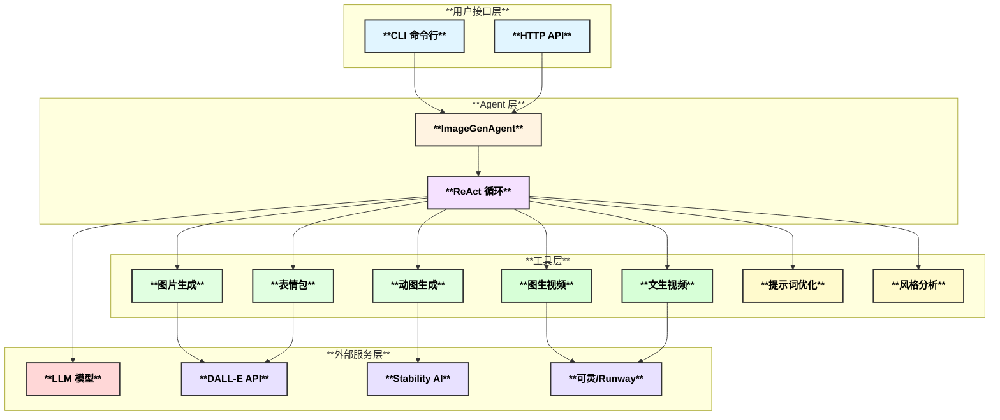

# 🎨 文生图/视频 Agent (Image & Video Generation Agent)

基于 [Eino](https://github.com/cloudwego/eino) 框架开发的智能图像和视频生成 Agent，支持生成静态图片、动态 GIF、表情包和短视频。

## ✨ 功能特性

- 🖼️ **静态图片生成** - 根据文字描述生成高质量图片
- 🎬 **动图 GIF 生成** - 生成动态图片
- 😀 **表情包生成** - 生成带文字的表情包
- 📹 **图生视频** - 将静态图片转换为动态视频
- 🎥 **文生视频** - 直接从文字描述生成短视频
- 🔧 **提示词优化** - 自动优化用户输入的描述
- 🎨 **风格分析** - 智能推荐最佳风格和参数

## 📊 架构设计



## 🚀 快速开始

### 环境要求

- Go 1.21+
- Docker (可选)
- Kubernetes (可选)

### 安装

```bash
# 克隆项目
git clone https://github.com/cloudwego/eino.git
cd eino/vdocsMap

# 安装依赖
go mod download

# 构建
make build
```

### 配置

1. 复制配置文件：
```bash
cp config/config-dev.yaml config/config.yaml
```

2. 设置 API Keys：
```bash
export OPENAI_API_KEY="your-openai-api-key"
export STABILITY_API_KEY="your-stability-api-key"  # 可选
export KLING_API_KEY="your-kling-api-key"          # 视频生成（可选）
export RUNWAY_API_KEY="your-runway-api-key"        # 视频生成（可选）
```

### 运行

```bash
# CLI 交互模式
make run

# 服务器模式
make run-server

# Docker 运行
make docker-run
```

## 📝 使用示例

### CLI 模式

```bash
$ ./bin/image-gen-agent -mode cli

🎨 请输入需求 > 生成一张卡通风格的可爱猫咪图片
⏳ 正在处理您的请求...

📝 处理结果:
已为您生成一张卡通风格的可爱猫咪图片！

🖼️ 生成的图片:
  1. ./output/image_abc123_1706745600.png
```

### API 调用

```bash
curl -X POST http://localhost:8080/api/generate \
  -H "Content-Type: application/json" \
  -d '{"prompt": "一只可爱的卡通猫咪"}'
```

## 🛠️ 工具说明

### 图像生成工具

| 工具名称 | 功能 | 参数 |
|---------|------|-----|
| **generate_image** | 生成静态图片 | prompt, size, quality, style |
| **generate_gif** | 生成动态 GIF | prompt, duration, fps, size |
| **generate_sticker** | 生成表情包 | prompt, text, style, emotion |

### 视频生成工具

| 工具名称 | 功能 | 参数 |
|---------|------|-----|
| **generate_video** | 图生视频 | init_image, prompt, duration, fps, resolution, motion_strength |
| **text_to_video** | 文生视频 | prompt, duration, aspect_ratio, style, motion_mode |

### 辅助工具

| 工具名称 | 功能 | 参数 |
|---------|------|-----|
| **optimize_prompt** | 优化提示词 | prompt, image_type, style |
| **analyze_style** | 分析风格 | description, image_type |

## 🐳 Docker 部署

```bash
# 构建镜像
make docker-build

# 运行
docker-compose up -d

# 查看日志
docker-compose logs -f
```

## ☸️ Kubernetes 部署

### 使用 kubectl

```bash
# 部署
make k8s-deploy

# 查看状态
kubectl -n image-gen-agent get pods

# 删除
make k8s-delete
```

### 使用 Helm

```bash
# 安装
helm upgrade --install image-gen-agent ./deploy/helm/image-gen-agent \
  --namespace image-gen-agent \
  --create-namespace \
  --set secrets.openaiApiKey=$OPENAI_API_KEY

# 查看状态
helm status image-gen-agent -n image-gen-agent

# 卸载
helm uninstall image-gen-agent -n image-gen-agent
```

## 🧪 测试

```bash
# 单元测试
make test

# 测试覆盖率
make test-coverage

# 集成测试
make test-integration
```

## 📁 项目结构

```
vdocsMap/
├── agent/                 # Agent 实现
│   ├── image_agent.go     # 主 Agent 逻辑
│   └── image_agent_test.go
├── cmd/                   # 入口程序
│   ├── main.go           # CLI/Server 入口
│   └── test_integration/ # 集成测试
├── config/               # 配置文件
│   ├── config.go         # 配置结构
│   └── config-dev.yaml   # 开发配置
├── deploy/               # 部署配置
│   ├── helm/             # Helm Chart
│   └── k8s/              # K8s 清单
├── llm/                  # LLM 适配层
│   ├── interface.go      # 接口定义
│   ├── openai.go         # OpenAI 实现
│   └── chinese_providers.go
├── tools/                # 工具集
│   ├── toolset.go        # 工具管理
│   ├── image_generate.go # 图片生成
│   ├── gif_generate.go   # 动图生成
│   ├── sticker_generate.go # 表情包生成
│   ├── video_generate.go # 图生视频
│   ├── text_to_video.go  # 文生视频
│   ├── prompt_optimize.go # 提示词优化
│   └── style_analyze.go  # 风格分析
├── Dockerfile
├── docker-compose.yml
├── Makefile
└── README.md
```

## 🔧 配置说明

| 配置项 | 说明 | 默认值 |
|-------|------|-------|
| `server.port` | 服务端口 | 8080 |
| `llm.provider` | LLM 提供商 | openai |
| `llm.model` | LLM 模型 | gpt-4o |
| `image.static_image.provider` | 图片生成提供商 | dalle |
| `video.provider` | 视频生成提供商 | kling |
| `video.default_duration` | 默认视频时长（秒） | 4 |
| `video.max_duration` | 最大视频时长（秒） | 10 |
| `agent.max_iterations` | 最大迭代次数 | 10 |

## 📹 视频生成使用示例

### 图生视频（让图片动起来）

```bash
$ ./bin/image-gen-agent -mode cli

🎨 请输入需求 > 把这张猫咪图片变成视频，让它动起来
⏳ 正在处理您的请求...

📝 处理结果:
已将猫咪图片转换为4秒的动态视频！

📹 生成的视频:
  1. ./output/video_xyz789_1706745600.mp4
```

### 文生视频（从文字直接生成视频）

```bash
🎨 请输入需求 > 生成一段日落海边的短视频，风格电影感
⏳ 正在处理您的请求...

📝 处理结果:
已为您生成一段电影风格的日落海边视频！

📹 生成的视频:
  1. ./output/t2v_abc123_1706745600.mp4
```

### API 调用示例

```bash
# 图生视频
curl -X POST http://localhost:8080/api/video/i2v \
  -H "Content-Type: application/json" \
  -d '{
    "image": "base64_encoded_image_data",
    "prompt": "镜头缓慢推进",
    "duration": 4
  }'

# 文生视频
curl -X POST http://localhost:8080/api/video/t2v \
  -H "Content-Type: application/json" \
  -d '{
    "prompt": "一只可爱的猫咪在花园里玩耍",
    "style": "cinematic",
    "duration": 5
  }'
```

## 📄 许可证

Apache License 2.0

## 🤝 贡献

欢迎提交 Issue 和 Pull Request！

---

**Powered by [Eino](https://github.com/cloudwego/eino) - 字节跳动大模型应用 Go 开发框架**
