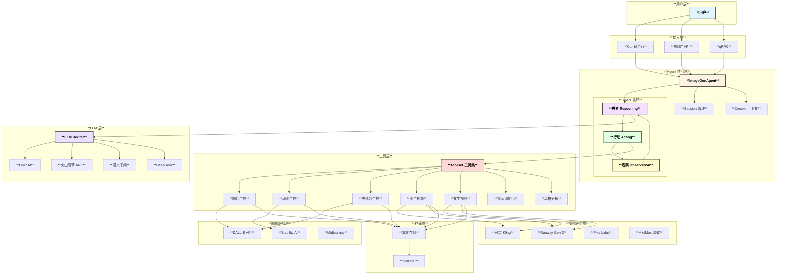
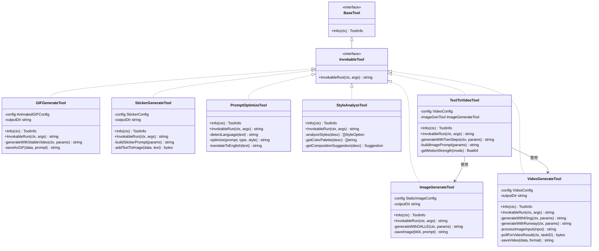
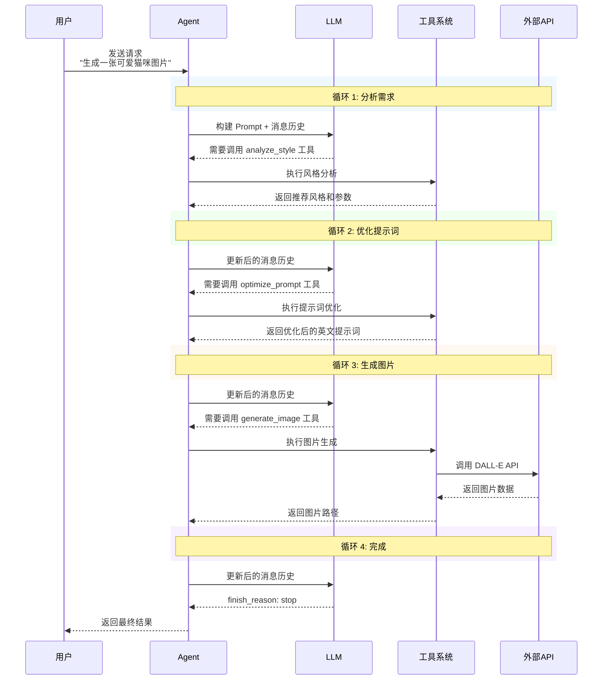
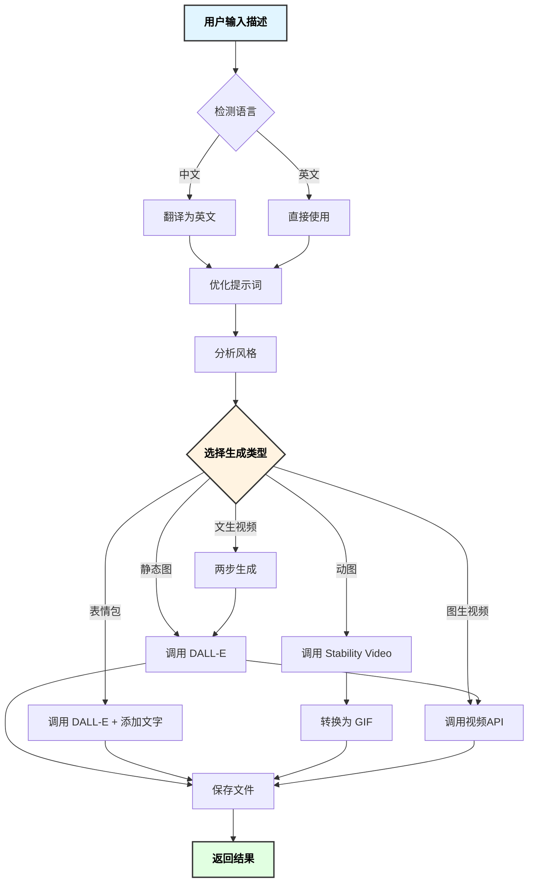
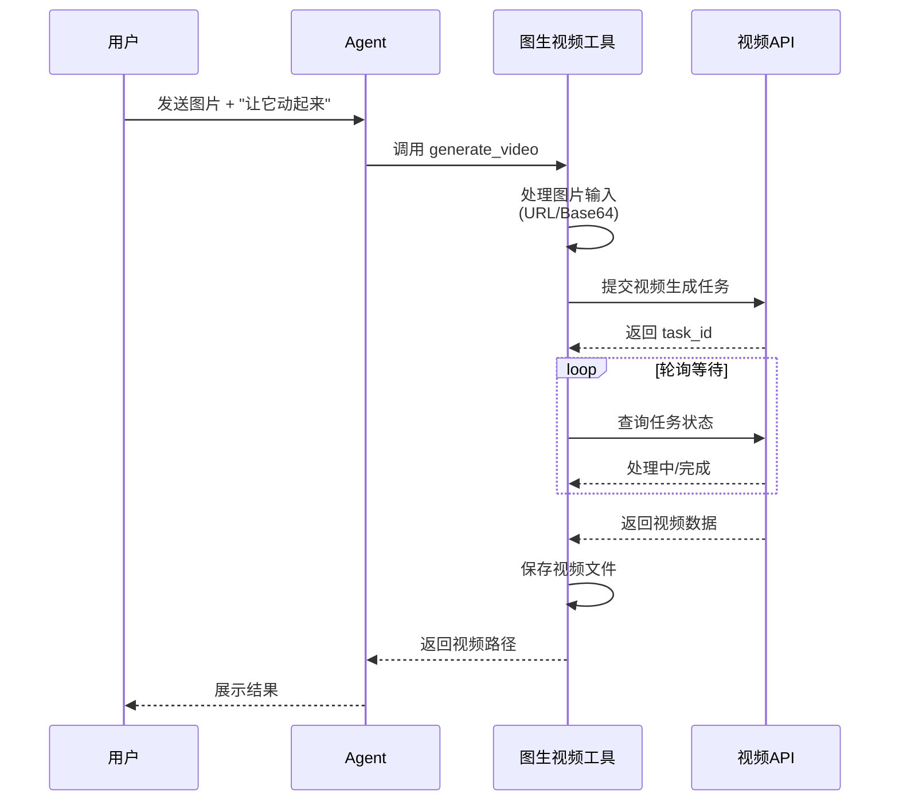
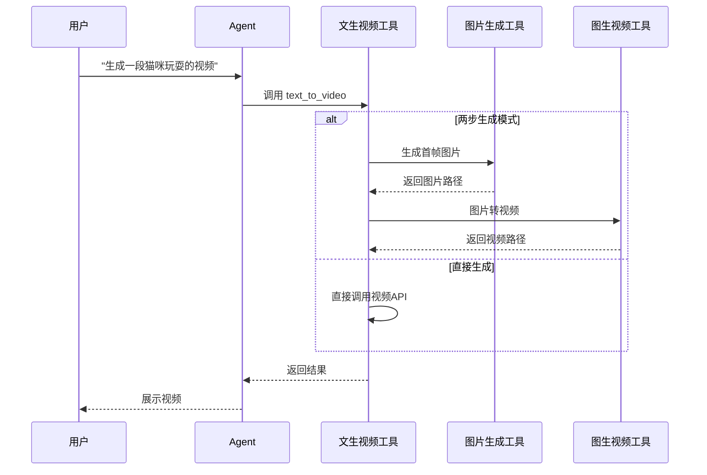
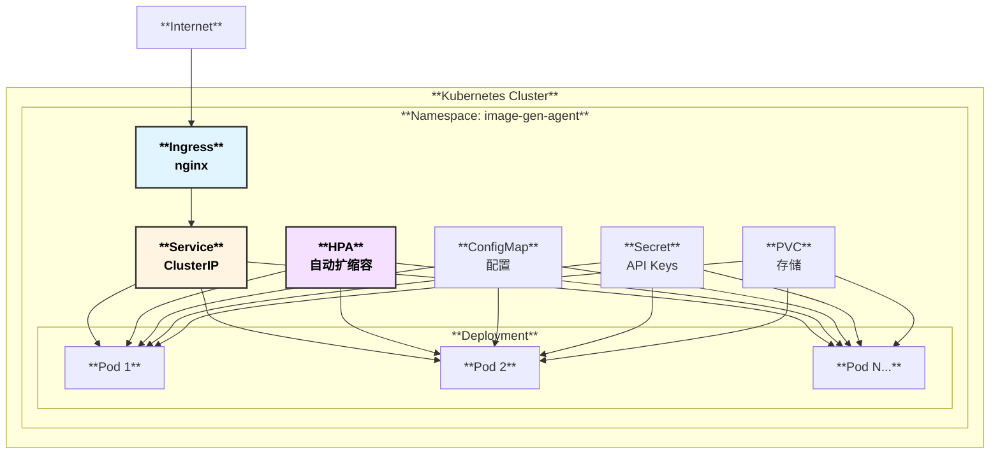

# 🎨 文生图/视频 Agent 架构设计文档

## 1. 系统概述

文生图/视频 Agent 是一个基于 Eino 框架开发的智能图像和视频生成系统，采用 ReAct（Reasoning + Acting）模式实现 LLM 驱动的多媒体内容生成工作流。

### 1.1 核心能力

- **图像生成**：静态图片、动态 GIF、表情包
- **视频生成**：图生视频（Image-to-Video）、文生视频（Text-to-Video）
- **智能优化**：提示词优化、风格分析

## 2. 整体架构



## 3. 核心组件

### 3.1 Agent 核心

| 组件 | 职责 | 技术实现 |
|-----|------|---------|
| **ImageGenAgent** | 主控制器，协调各组件 | Eino ADK ChatModelAgent |
| **ReAct Loop** | 推理-行动循环 | 基于 finish_reason 判断 |
| **Session** | 会话生命周期管理 | 消息历史、状态持久化 |
| **Context** | 上下文管理 | 环境信息、配置参数 |

### 3.2 工具系统



## 4. 工作流程

### 4.1 ReAct 循环



### 4.2 图片生成流程



## 5. 数据流

### 5.1 消息格式

```go
type Message struct {
    Role      RoleType        // user, assistant, system, tool
    Content   string          // 文本内容
    ToolCalls []ToolCall      // 工具调用
    ToolCallID string         // 工具响应ID
}

type ToolCall struct {
    ID       string
    Type     string
    Function FunctionCall
}

type FunctionCall struct {
    Name      string
    Arguments string  // JSON 格式
}
```

### 5.2 工具参数与结果

| 工具 | 输入参数 | 输出结果 |
|-----|---------|---------|
| generate_image | prompt, size, quality, style | image_path, success |
| generate_gif | prompt, duration, fps, motion_scale | gif_path, success |
| generate_sticker | prompt, text, style, emotion | sticker_path, success |
| generate_video | init_image, prompt, duration, fps, resolution, motion_strength | video_path, success, file_size |
| text_to_video | prompt, duration, aspect_ratio, style, motion_mode | video_path, first_frame_path, success |
| optimize_prompt | prompt, image_type, language | optimized_prompt, english_prompt |
| analyze_style | description, image_type | style, size, quality, palette |

## 5.3 视频生成流程

### 图生视频（Image-to-Video）



### 文生视频（Text-to-Video）



### 视频提供商对比

| 提供商 | 支持功能 | 最大时长 | 特点 |
|-------|---------|---------|-----|
| **可灵 Kling** | I2V, T2V | 10秒 | 国产首选，效果好 |
| **Runway Gen-3** | I2V, T2V | 10秒 | 高质量，创意视频 |
| **Pika Labs** | I2V, T2V | 4秒 | 创意动画 |
| **MiniMax 海螺** | I2V, T2V | 6秒 | 国产，成本低 |
| **Stable Video** | I2V | 4秒 | 开源基础 |

## 6. 扩展点

### 6.1 添加新工具

```go
// 1. 实现 InvokableTool 接口
type NewTool struct {
    config *config.Config
}

func (t *NewTool) Info(ctx context.Context) (*schema.ToolInfo, error) {
    return &schema.ToolInfo{
        Name:        "new_tool",
        Description: "工具描述",
        Parameters:  map[string]*schema.ParameterInfo{...},
    }, nil
}

func (t *NewTool) InvokableRun(ctx context.Context, args string, opts ...tool.Option) (string, error) {
    // 实现逻辑
    return result, nil
}

// 2. 注册到 ToolSet
func (ts *ToolSet) initTools() error {
    ts.newTool = NewNewTool(ts.config)
    ts.tools = append(ts.tools, ts.newTool)
    return nil
}
```

### 6.2 添加新的 LLM 提供商

```go
// 1. 实现 Provider 接口
type NewProvider struct {
    config *config.LLMConfig
    client *http.Client
}

func (p *NewProvider) GetChatModel(ctx context.Context) (model.ToolCallingChatModel, error) {
    return &NewChatModel{provider: p}, nil
}

func (p *NewProvider) Name() string { return "new_provider" }
func (p *NewProvider) Close() error { return nil }

// 2. 注册到工厂
func NewProvider(cfg *config.LLMConfig) (Provider, error) {
    switch cfg.Provider {
    case "new_provider":
        return NewNewProvider(cfg)
    // ...
    }
}
```

## 7. 部署架构

### 7.1 Kubernetes 部署



### 7.2 资源配置建议

| 环境 | CPU | 内存 | 副本数 | 存储 |
|-----|-----|------|-------|-----|
| 开发 | 100m-500m | 256Mi-512Mi | 1 | 10Gi |
| 测试 | 200m-1000m | 512Mi-1Gi | 2 | 20Gi |
| 生产 | 500m-2000m | 1Gi-4Gi | 3-10 | 100Gi |

## 8. 监控与可观测性

### 8.1 指标

- **请求指标**: QPS, 延迟, 错误率
- **业务指标**: 图片生成成功率, 平均生成时间
- **资源指标**: CPU, 内存, 磁盘使用率
- **LLM 指标**: Token 使用量, API 调用次数

### 8.2 日志

```json
{
  "timestamp": "2025-01-31T12:00:00Z",
  "level": "info",
  "message": "Image generated successfully",
  "session_id": "sess_123",
  "tool": "generate_image",
  "duration_ms": 5000,
  "image_path": "/output/image_xxx.png"
}
```

## 9. 安全考虑

1. **API Key 管理**: 使用 K8s Secret 或外部密钥管理服务
2. **输入验证**: 对用户输入进行过滤和验证
3. **内容审核**: 可集成内容安全审核服务
4. **访问控制**: 实现认证和授权机制
5. **速率限制**: 防止 API 滥用

## 10. 视频生成最佳实践

### 10.1 图生视频（I2V）

1. **图片质量**：输入图片应清晰、分辨率适中（建议 1280x720 以上）
2. **运动描述**：提供清晰的运动描述，如"镜头缓慢推进"、"人物微笑"
3. **运动强度**：根据内容调整 motion_strength（0.3-0.7 通常效果最好）
4. **时长选择**：短视频（2-4秒）更容易保持质量

### 10.2 文生视频（T2V）

1. **两步生成**：推荐使用两步生成模式（先图后视频），可以预览首帧并调整
2. **提示词要素**：
   - 场景描述：地点、环境、光线
   - 主体描述：人物/物体、姿态、表情
   - 动作描述：具体动作、运动方向
   - 风格描述：写实/动漫、电影感、色调
3. **宽高比选择**：
   - 横屏（16:9）：风景、电影
   - 竖屏（9:16）：人像、短视频平台
   - 方形（1:1）：社交媒体

### 10.3 性能优化

| 优化项 | 建议 |
|-------|-----|
| 并发控制 | 限制同时生成的视频数量 |
| 超时设置 | 设置合理的超时时间（5-10分钟） |
| 缓存复用 | 相同首帧可复用 |
| 异步处理 | 长任务使用异步回调 |

---

*文档版本: 2.0.0 | 最后更新: 2026-02-01*
