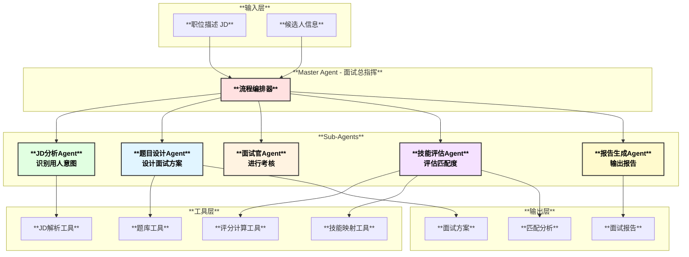
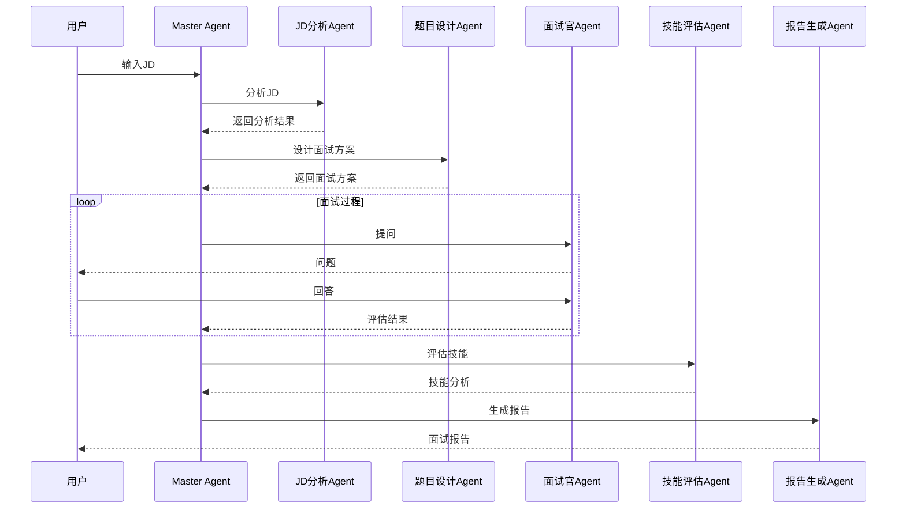

# 🎯 Interview Expert Agent - 专业面试官智能助手

基于 Eino 框架开发的专业面试官 Agent 系统，支持自动分析 JD、设计面试方案、进行技术考核、评估技能匹配度并生成面试报告。

## 🏗️ 系统架构



## ✨ 核心功能

| 功能模块 | 描述 | 实现状态 |
|---------|------|---------|
| **JD 分析** | 解析职位描述，提取技能要求，识别用人意图 | ✅ |
| **方案设计** | 自动生成面试方案，设计题目和评估标准 | ✅ |
| **面试考核** | 交互式面试，支持追问和自适应难度 | ✅ |
| **技能评估** | 评估候选人技能水平和岗位匹配度 | ✅ |
| **报告生成** | 生成专业面试报告，包含图表分析 | ✅ |

## 🚀 快速开始

### 环境要求

- Go 1.21+
- Docker (可选，用于容器化部署)
- Kubernetes (可选，用于生产部署)

### 安装

```bash
# 克隆项目
cd eino/vdocsMianshi

# 安装依赖
go mod download

# 构建
make build
```

### 配置

1. 复制配置文件模板：
```bash
cp config/config.yaml.example config/config.yaml
```

2. 设置 LLM API Key（选择其一）：
```bash
export ZHIPU_API_KEY=your-api-key
# 或
export DEEPSEEK_API_KEY=your-api-key
# 或
export OPENAI_API_KEY=your-api-key
```

### 运行

```bash
# 运行演示模式
./bin/interview-expert demo

# 启动交互式面试
./bin/interview-expert interview

# 分析 JD 文件
./bin/interview-expert analyze jd.txt

# 启动 API 服务器
./bin/interview-expert serve
```

## 📖 使用指南

### 1. JD 分析

输入职位描述，系统自动分析：

```json
{
  "title": "高级Go开发工程师",
  "level": "senior",
  "required_skills": [
    {"name": "Go", "priority": 1, "expected_level": "advanced"},
    {"name": "MySQL", "priority": 1, "expected_level": "intermediate"},
    {"name": "Redis", "priority": 2, "expected_level": "intermediate"}
  ],
  "hiring_intent": {
    "primary_focus": "technical",
    "team_role": "individual_contributor",
    "key_competencies": ["分布式系统", "高并发处理"]
  }
}
```

### 2. 面试方案

系统自动生成面试方案：

```
=== 面试方案 ===
总时长: 60分钟

轮次1: 技术筛选 (15分钟)
  - Go语言基础
  - 并发编程

轮次2: 深度技术 (30分钟)
  - 系统设计
  - 数据库优化

轮次3: 行为面试 (15分钟)
  - 项目经验
  - 团队协作
```

### 3. 面试报告

生成的面试报告包含：

- 执行摘要
- 各轮次表现
- 技能评估图表
- 岗位匹配度分析
- 录用建议

## 🔧 API 接口

### 分析 JD
```bash
POST /api/v1/interview/analyze-jd
{
  "jd_content": "职位描述内容..."
}
```

### 设计方案
```bash
POST /api/v1/interview/design-plan
{
  "session_id": "xxx"
}
```

### 开始面试
```bash
POST /api/v1/interview/start
{
  "session_id": "xxx",
  "candidate_name": "张三"
}
```

### 提交答案
```bash
POST /api/v1/interview/answer
{
  "session_id": "xxx",
  "question_id": "xxx",
  "answer": "候选人回答..."
}
```

### 生成报告
```bash
POST /api/v1/interview/report
{
  "session_id": "xxx",
  "format": "markdown"
}
```

## 🐳 Docker 部署

```bash
# 构建镜像
make docker-build

# 运行容器
make docker-run
```

## ☸️ Kubernetes 部署

```bash
# 部署到 K8S
make k8s-deploy

# 检查状态
make k8s-status

# 查看日志
make k8s-logs
```

## 🧪 测试

```bash
# 运行单元测试
make test

# 运行集成测试
make test-integration

# 生成覆盖率报告
make test-coverage
```

## 📁 项目结构

```
vdocsMianshi/
├── agent/                 # Agent 实现
│   ├── interface.go       # 接口定义
│   ├── factory.go         # Agent 工厂
│   ├── master.go          # Master Agent
│   ├── jd_analyzer.go     # JD 分析 Agent
│   ├── question_designer.go # 题目设计 Agent
│   ├── interviewer.go     # 面试官 Agent
│   ├── skill_evaluator.go # 技能评估 Agent
│   └── report_generator.go # 报告生成 Agent
├── tools/                 # 工具实现
│   ├── jd_parser.go       # JD 解析工具
│   ├── question_bank.go   # 题库工具
│   ├── score_calculator.go # 评分计算
│   └── skill_mapper.go    # 技能映射
├── config/                # 配置管理
├── interaction/           # HTTP 接口
├── cmd/                   # 主程序入口
├── k8s/                   # K8S 部署配置
├── Dockerfile
├── Makefile
└── README.md
```

## 🔄 工作流程



## 📝 配置说明

| 配置项 | 说明 | 默认值 |
|--------|------|--------|
| `llm.default_provider` | 默认 LLM 提供商 | zhipu |
| `interview.default_duration` | 默认面试时长 | 60分钟 |
| `interview.max_questions` | 最大题目数 | 20 |
| `interview.enable_adaptive` | 启用自适应难度 | true |
| `scoring.pass_threshold` | 通过阈值 | 0.6 |

## 🤝 贡献

欢迎提交 Issue 和 Pull Request！

## 📄 许可证

Apache License 2.0
