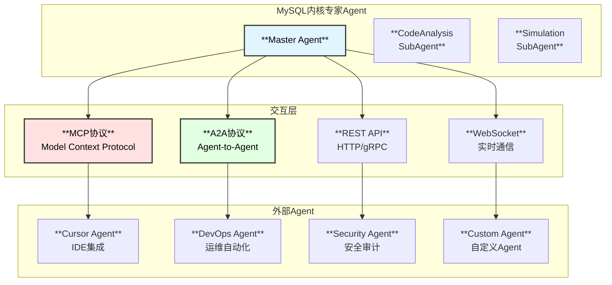

# MySQL内核专家Agent - Agent交互方案设计

## 1. Agent交互概述

支持与外部Agent系统进行交互，包括MCP协议、A2A协议、以及自定义API交互方式。



## 2. MCP协议支持

### 2.1 MCP服务器实现

```go
// MCPServerConfig MCP服务器配置
type MCPServerConfig struct {
    Enabled         bool              `yaml:"enabled"`
    Name            string            `yaml:"name"`
    Version         string            `yaml:"version"`
    Description     string            `yaml:"description"`
    
    // 传输层配置
    Transport       MCPTransport      `yaml:"transport"`
    
    // 能力配置
    Capabilities    MCPCapabilities   `yaml:"capabilities"`
    
    // 安全配置
    Auth            *MCPAuthConfig    `yaml:"auth"`
}

type MCPTransport struct {
    Type    string `yaml:"type"`    // "stdio" | "sse" | "websocket"
    Address string `yaml:"address"` // WebSocket地址
    Path    string `yaml:"path"`    // SSE路径
}

type MCPCapabilities struct {
    Tools       bool `yaml:"tools"`
    Resources   bool `yaml:"resources"`
    Prompts     bool `yaml:"prompts"`
    Sampling    bool `yaml:"sampling"`
}

type MCPAuthConfig struct {
    Required    bool     `yaml:"required"`
    Type        string   `yaml:"type"`  // "api_key" | "oauth" | "none"
    ValidKeys   []string `yaml:"valid_keys"`
}

// MCPServer MCP服务器
type MCPServer struct {
    config      *MCPServerConfig
    agent       *MasterAgent
    tools       map[string]*MCPTool
    resources   map[string]*MCPResource
    prompts     map[string]*MCPPrompt
    sessions    map[string]*MCPSession
    mu          sync.RWMutex
}

// MCPTool MCP工具定义
type MCPTool struct {
    Name        string                 `json:"name"`
    Description string                 `json:"description"`
    InputSchema map[string]interface{} `json:"inputSchema"`
    Handler     MCPToolHandler         `json:"-"`
}

type MCPToolHandler func(ctx context.Context, args map[string]interface{}) (*MCPToolResult, error)

type MCPToolResult struct {
    Content []MCPContent `json:"content"`
    IsError bool         `json:"isError,omitempty"`
}

type MCPContent struct {
    Type     string `json:"type"`     // "text" | "image" | "resource"
    Text     string `json:"text,omitempty"`
    MimeType string `json:"mimeType,omitempty"`
    Data     string `json:"data,omitempty"`
}

func NewMCPServer(config *MCPServerConfig, agent *MasterAgent) *MCPServer {
    server := &MCPServer{
        config:    config,
        agent:     agent,
        tools:     make(map[string]*MCPTool),
        resources: make(map[string]*MCPResource),
        prompts:   make(map[string]*MCPPrompt),
        sessions:  make(map[string]*MCPSession),
    }
    
    // 注册内置工具
    server.registerBuiltinTools()
    
    return server
}

func (s *MCPServer) registerBuiltinTools() {
    // 代码搜索工具
    s.RegisterTool(&MCPTool{
        Name:        "search_code",
        Description: "Search MySQL kernel source code by keywords or patterns",
        InputSchema: map[string]interface{}{
            "type": "object",
            "properties": map[string]interface{}{
                "query": map[string]interface{}{
                    "type":        "string",
                    "description": "Search query (keywords or regex pattern)",
                },
                "file_type": map[string]interface{}{
                    "type":        "string",
                    "description": "File type filter (e.g., 'cc', 'h')",
                },
                "module": map[string]interface{}{
                    "type":        "string",
                    "description": "Module filter (e.g., 'innodb', 'sql')",
                },
                "limit": map[string]interface{}{
                    "type":        "integer",
                    "description": "Maximum number of results",
                    "default":     20,
                },
            },
            "required": []string{"query"},
        },
        Handler: s.handleSearchCode,
    })
    
    // 函数分析工具
    s.RegisterTool(&MCPTool{
        Name:        "analyze_function",
        Description: "Analyze a MySQL kernel function, including call graph, complexity, etc.",
        InputSchema: map[string]interface{}{
            "type": "object",
            "properties": map[string]interface{}{
                "function_name": map[string]interface{}{
                    "type":        "string",
                    "description": "Name of the function to analyze",
                },
                "depth": map[string]interface{}{
                    "type":        "integer",
                    "description": "Call graph traversal depth",
                    "default":     3,
                },
                "include_callers": map[string]interface{}{
                    "type":        "boolean",
                    "description": "Include caller analysis",
                    "default":     true,
                },
            },
            "required": []string{"function_name"},
        },
        Handler: s.handleAnalyzeFunction,
    })
    
    // 性能模拟工具
    s.RegisterTool(&MCPTool{
        Name:        "simulate_load",
        Description: "Simulate MySQL kernel behavior under specific workload",
        InputSchema: map[string]interface{}{
            "type": "object",
            "properties": map[string]interface{}{
                "workload_type": map[string]interface{}{
                    "type":        "string",
                    "description": "Type of workload (e.g., 'oltp', 'olap', 'mixed')",
                },
                "qps": map[string]interface{}{
                    "type":        "integer",
                    "description": "Queries per second",
                },
                "connection_count": map[string]interface{}{
                    "type":        "integer",
                    "description": "Number of concurrent connections",
                },
            },
            "required": []string{"workload_type"},
        },
        Handler: s.handleSimulateLoad,
    })
}

// RegisterTool 注册工具
func (s *MCPServer) RegisterTool(tool *MCPTool) {
    s.mu.Lock()
    defer s.mu.Unlock()
    s.tools[tool.Name] = tool
}

// HandleRequest 处理MCP请求
func (s *MCPServer) HandleRequest(ctx context.Context, req *MCPRequest) (*MCPResponse, error) {
    switch req.Method {
    case "initialize":
        return s.handleInitialize(ctx, req)
    case "tools/list":
        return s.handleToolsList(ctx, req)
    case "tools/call":
        return s.handleToolsCall(ctx, req)
    case "resources/list":
        return s.handleResourcesList(ctx, req)
    case "resources/read":
        return s.handleResourcesRead(ctx, req)
    case "prompts/list":
        return s.handlePromptsList(ctx, req)
    case "prompts/get":
        return s.handlePromptsGet(ctx, req)
    default:
        return nil, fmt.Errorf("unknown method: %s", req.Method)
    }
}

func (s *MCPServer) handleInitialize(ctx context.Context, req *MCPRequest) (*MCPResponse, error) {
    return &MCPResponse{
        Result: map[string]interface{}{
            "protocolVersion": "2024-11-05",
            "capabilities": map[string]interface{}{
                "tools":     s.config.Capabilities.Tools,
                "resources": s.config.Capabilities.Resources,
                "prompts":   s.config.Capabilities.Prompts,
            },
            "serverInfo": map[string]interface{}{
                "name":    s.config.Name,
                "version": s.config.Version,
            },
        },
    }, nil
}

func (s *MCPServer) handleToolsList(ctx context.Context, req *MCPRequest) (*MCPResponse, error) {
    s.mu.RLock()
    defer s.mu.RUnlock()
    
    tools := make([]map[string]interface{}, 0, len(s.tools))
    for _, tool := range s.tools {
        tools = append(tools, map[string]interface{}{
            "name":        tool.Name,
            "description": tool.Description,
            "inputSchema": tool.InputSchema,
        })
    }
    
    return &MCPResponse{
        Result: map[string]interface{}{
            "tools": tools,
        },
    }, nil
}

func (s *MCPServer) handleToolsCall(ctx context.Context, req *MCPRequest) (*MCPResponse, error) {
    params := req.Params
    toolName, _ := params["name"].(string)
    args, _ := params["arguments"].(map[string]interface{})
    
    s.mu.RLock()
    tool, ok := s.tools[toolName]
    s.mu.RUnlock()
    
    if !ok {
        return nil, fmt.Errorf("unknown tool: %s", toolName)
    }
    
    result, err := tool.Handler(ctx, args)
    if err != nil {
        return &MCPResponse{
            Result: map[string]interface{}{
                "content": []map[string]interface{}{
                    {"type": "text", "text": fmt.Sprintf("Error: %v", err)},
                },
                "isError": true,
            },
        }, nil
    }
    
    return &MCPResponse{
        Result: map[string]interface{}{
            "content": result.Content,
            "isError": result.IsError,
        },
    }, nil
}

// MCPRequest MCP请求
type MCPRequest struct {
    JSONRPC string                 `json:"jsonrpc"`
    ID      interface{}            `json:"id"`
    Method  string                 `json:"method"`
    Params  map[string]interface{} `json:"params,omitempty"`
}

// MCPResponse MCP响应
type MCPResponse struct {
    JSONRPC string                 `json:"jsonrpc"`
    ID      interface{}            `json:"id,omitempty"`
    Result  map[string]interface{} `json:"result,omitempty"`
    Error   *MCPError              `json:"error,omitempty"`
}

type MCPError struct {
    Code    int    `json:"code"`
    Message string `json:"message"`
}
```

### 2.2 MCP客户端实现

```go
// MCPClientConfig MCP客户端配置
type MCPClientConfig struct {
    Servers map[string]*MCPServerEndpoint `yaml:"servers"`
}

type MCPServerEndpoint struct {
    Name        string            `yaml:"name"`
    Transport   string            `yaml:"transport"`  // "stdio" | "sse" | "websocket"
    Command     string            `yaml:"command"`    // stdio命令
    Args        []string          `yaml:"args"`
    URL         string            `yaml:"url"`        // WebSocket/SSE URL
    Headers     map[string]string `yaml:"headers"`
    Timeout     time.Duration     `yaml:"timeout"`
}

// MCPClient MCP客户端
type MCPClient struct {
    config   *MCPClientConfig
    clients  map[string]*MCPServerClient
    mu       sync.RWMutex
}

type MCPServerClient struct {
    name       string
    config     *MCPServerEndpoint
    transport  MCPTransport
    tools      map[string]*MCPTool
    resources  map[string]*MCPResource
    connected  atomic.Bool
}

func NewMCPClient(config *MCPClientConfig) *MCPClient {
    return &MCPClient{
        config:  config,
        clients: make(map[string]*MCPServerClient),
    }
}

// Connect 连接到所有配置的MCP服务器
func (c *MCPClient) Connect(ctx context.Context) error {
    for name, endpoint := range c.config.Servers {
        client, err := c.connectServer(ctx, name, endpoint)
        if err != nil {
            log.Warn("Failed to connect to MCP server", "name", name, "error", err)
            continue
        }
        
        c.mu.Lock()
        c.clients[name] = client
        c.mu.Unlock()
        
        log.Info("Connected to MCP server", "name", name)
    }
    
    return nil
}

func (c *MCPClient) connectServer(ctx context.Context, name string, endpoint *MCPServerEndpoint) (*MCPServerClient, error) {
    client := &MCPServerClient{
        name:      name,
        config:    endpoint,
        tools:     make(map[string]*MCPTool),
        resources: make(map[string]*MCPResource),
    }
    
    // 建立连接
    switch endpoint.Transport {
    case "stdio":
        client.transport = NewStdioTransport(endpoint.Command, endpoint.Args)
    case "sse":
        client.transport = NewSSETransport(endpoint.URL, endpoint.Headers)
    case "websocket":
        client.transport = NewWebSocketTransport(endpoint.URL, endpoint.Headers)
    default:
        return nil, fmt.Errorf("unsupported transport: %s", endpoint.Transport)
    }
    
    if err := client.transport.Connect(ctx); err != nil {
        return nil, err
    }
    
    // 初始化
    initResp, err := client.sendRequest(ctx, "initialize", map[string]interface{}{
        "protocolVersion": "2024-11-05",
        "capabilities":    map[string]interface{}{},
        "clientInfo": map[string]interface{}{
            "name":    "mysql-expert-agent",
            "version": "1.0.0",
        },
    })
    if err != nil {
        return nil, fmt.Errorf("initialization failed: %w", err)
    }
    
    log.Debug("MCP server initialized", "name", name, "response", initResp)
    
    // 获取工具列表
    if err := client.refreshTools(ctx); err != nil {
        log.Warn("Failed to refresh tools", "name", name, "error", err)
    }
    
    client.connected.Store(true)
    return client, nil
}

// CallTool 调用MCP工具
func (c *MCPClient) CallTool(ctx context.Context, serverName, toolName string, args map[string]interface{}) (*MCPToolResult, error) {
    c.mu.RLock()
    client, ok := c.clients[serverName]
    c.mu.RUnlock()
    
    if !ok || !client.connected.Load() {
        return nil, fmt.Errorf("server not connected: %s", serverName)
    }
    
    resp, err := client.sendRequest(ctx, "tools/call", map[string]interface{}{
        "name":      toolName,
        "arguments": args,
    })
    if err != nil {
        return nil, err
    }
    
    result := &MCPToolResult{}
    if content, ok := resp["content"].([]interface{}); ok {
        for _, c := range content {
            if cm, ok := c.(map[string]interface{}); ok {
                result.Content = append(result.Content, MCPContent{
                    Type: cm["type"].(string),
                    Text: cm["text"].(string),
                })
            }
        }
    }
    if isError, ok := resp["isError"].(bool); ok {
        result.IsError = isError
    }
    
    return result, nil
}

// GetAvailableTools 获取所有可用工具
func (c *MCPClient) GetAvailableTools() map[string][]*MCPTool {
    c.mu.RLock()
    defer c.mu.RUnlock()
    
    result := make(map[string][]*MCPTool)
    for name, client := range c.clients {
        if !client.connected.Load() {
            continue
        }
        tools := make([]*MCPTool, 0, len(client.tools))
        for _, tool := range client.tools {
            tools = append(tools, tool)
        }
        result[name] = tools
    }
    
    return result
}
```

## 3. A2A协议支持

### 3.1 A2A服务器

```go
// A2AServerConfig A2A服务器配置
type A2AServerConfig struct {
    Enabled     bool          `yaml:"enabled"`
    Address     string        `yaml:"address"`
    TLS         *TLSConfig    `yaml:"tls"`
    Auth        *A2AAuthConfig `yaml:"auth"`
    
    // Agent卡片信息
    AgentCard   *AgentCard    `yaml:"agent_card"`
}

type A2AAuthConfig struct {
    Required bool     `yaml:"required"`
    Type     string   `yaml:"type"`  // "api_key" | "jwt" | "mtls"
    APIKeys  []string `yaml:"api_keys"`
    JWTSecret string  `yaml:"jwt_secret"`
}

// AgentCard A2A Agent卡片
type AgentCard struct {
    Name            string            `json:"name"`
    Description     string            `json:"description"`
    URL             string            `json:"url"`
    Version         string            `json:"version"`
    Capabilities    []string          `json:"capabilities"`
    DefaultInputModes []string        `json:"defaultInputModes"`
    DefaultOutputModes []string       `json:"defaultOutputModes"`
    Skills          []*AgentSkill     `json:"skills"`
    Provider        *AgentProvider    `json:"provider,omitempty"`
}

type AgentSkill struct {
    ID          string   `json:"id"`
    Name        string   `json:"name"`
    Description string   `json:"description"`
    Tags        []string `json:"tags"`
    Examples    []string `json:"examples,omitempty"`
}

type AgentProvider struct {
    Organization string `json:"organization"`
    URL          string `json:"url"`
}

// A2AServer A2A服务器
type A2AServer struct {
    config    *A2AServerConfig
    agent     *MasterAgent
    router    *gin.Engine
}

func NewA2AServer(config *A2AServerConfig, agent *MasterAgent) *A2AServer {
    server := &A2AServer{
        config: config,
        agent:  agent,
        router: gin.New(),
    }
    
    server.setupRoutes()
    return server
}

func (s *A2AServer) setupRoutes() {
    // 中间件
    s.router.Use(gin.Recovery())
    s.router.Use(s.authMiddleware())
    
    // A2A标准端点
    s.router.GET("/.well-known/agent.json", s.handleAgentCard)
    s.router.POST("/a2a/tasks", s.handleCreateTask)
    s.router.GET("/a2a/tasks/:task_id", s.handleGetTask)
    s.router.POST("/a2a/tasks/:task_id/send", s.handleSendMessage)
    s.router.DELETE("/a2a/tasks/:task_id", s.handleCancelTask)
    
    // SSE端点用于流式响应
    s.router.GET("/a2a/tasks/:task_id/events", s.handleTaskEvents)
}

func (s *A2AServer) handleAgentCard(c *gin.Context) {
    c.JSON(http.StatusOK, s.config.AgentCard)
}

func (s *A2AServer) handleCreateTask(c *gin.Context) {
    var req CreateTaskRequest
    if err := c.ShouldBindJSON(&req); err != nil {
        c.JSON(http.StatusBadRequest, gin.H{"error": err.Error()})
        return
    }
    
    // 创建任务
    task := &A2ATask{
        ID:        uuid.New().String(),
        Status:    "pending",
        CreatedAt: time.Now(),
        Input:     req.Message,
    }
    
    // 异步处理
    go s.processTask(task)
    
    c.JSON(http.StatusCreated, task)
}

type CreateTaskRequest struct {
    Message *A2AMessage `json:"message"`
}

type A2ATask struct {
    ID        string       `json:"id"`
    Status    string       `json:"status"`
    CreatedAt time.Time    `json:"createdAt"`
    UpdatedAt time.Time    `json:"updatedAt,omitempty"`
    Input     *A2AMessage  `json:"input"`
    Output    *A2AMessage  `json:"output,omitempty"`
    Error     string       `json:"error,omitempty"`
}

type A2AMessage struct {
    Role    string       `json:"role"`
    Content []A2AContent `json:"content"`
}

type A2AContent struct {
    Type string `json:"type"`
    Text string `json:"text,omitempty"`
    Data string `json:"data,omitempty"`
}

func (s *A2AServer) processTask(task *A2ATask) {
    ctx := context.Background()
    
    // 提取用户消息
    var userMessage string
    for _, content := range task.Input.Content {
        if content.Type == "text" {
            userMessage = content.Text
            break
        }
    }
    
    // 调用Agent处理
    result, err := s.agent.Run(ctx, userMessage)
    if err != nil {
        task.Status = "failed"
        task.Error = err.Error()
        return
    }
    
    // 构建响应
    task.Status = "completed"
    task.UpdatedAt = time.Now()
    task.Output = &A2AMessage{
        Role: "agent",
        Content: []A2AContent{
            {Type: "text", Text: result},
        },
    }
}

// Start 启动A2A服务器
func (s *A2AServer) Start() error {
    addr := s.config.Address
    if s.config.TLS != nil && s.config.TLS.Enabled {
        return s.router.RunTLS(addr, s.config.TLS.CertFile, s.config.TLS.KeyFile)
    }
    return s.router.Run(addr)
}
```

### 3.2 A2A客户端

```go
// A2AClientConfig A2A客户端配置
type A2AClientConfig struct {
    Agents map[string]*A2AAgentEndpoint `yaml:"agents"`
}

type A2AAgentEndpoint struct {
    URL       string            `yaml:"url"`
    APIKey    string            `yaml:"api_key"`
    Timeout   time.Duration     `yaml:"timeout"`
    Headers   map[string]string `yaml:"headers"`
}

// A2AClient A2A客户端
type A2AClient struct {
    config     *A2AClientConfig
    httpClient *http.Client
    agentCards map[string]*AgentCard
    mu         sync.RWMutex
}

func NewA2AClient(config *A2AClientConfig) *A2AClient {
    return &A2AClient{
        config: config,
        httpClient: &http.Client{
            Timeout: 30 * time.Second,
        },
        agentCards: make(map[string]*AgentCard),
    }
}

// DiscoverAgents 发现所有配置的Agent
func (c *A2AClient) DiscoverAgents(ctx context.Context) error {
    for name, endpoint := range c.config.Agents {
        card, err := c.fetchAgentCard(ctx, endpoint)
        if err != nil {
            log.Warn("Failed to fetch agent card", "agent", name, "error", err)
            continue
        }
        
        c.mu.Lock()
        c.agentCards[name] = card
        c.mu.Unlock()
        
        log.Info("Discovered agent", "name", name, "skills", len(card.Skills))
    }
    
    return nil
}

func (c *A2AClient) fetchAgentCard(ctx context.Context, endpoint *A2AAgentEndpoint) (*AgentCard, error) {
    req, err := http.NewRequestWithContext(ctx, "GET", 
        endpoint.URL+"/.well-known/agent.json", nil)
    if err != nil {
        return nil, err
    }
    
    if endpoint.APIKey != "" {
        req.Header.Set("Authorization", "Bearer "+endpoint.APIKey)
    }
    
    resp, err := c.httpClient.Do(req)
    if err != nil {
        return nil, err
    }
    defer resp.Body.Close()
    
    var card AgentCard
    if err := json.NewDecoder(resp.Body).Decode(&card); err != nil {
        return nil, err
    }
    
    return &card, nil
}

// SendTask 发送任务到外部Agent
func (c *A2AClient) SendTask(ctx context.Context, agentName string, message string) (*A2ATask, error) {
    c.mu.RLock()
    endpoint, ok := c.config.Agents[agentName]
    c.mu.RUnlock()
    
    if !ok {
        return nil, fmt.Errorf("unknown agent: %s", agentName)
    }
    
    reqBody := CreateTaskRequest{
        Message: &A2AMessage{
            Role: "user",
            Content: []A2AContent{
                {Type: "text", Text: message},
            },
        },
    }
    
    body, err := json.Marshal(reqBody)
    if err != nil {
        return nil, err
    }
    
    req, err := http.NewRequestWithContext(ctx, "POST",
        endpoint.URL+"/a2a/tasks", bytes.NewReader(body))
    if err != nil {
        return nil, err
    }
    
    req.Header.Set("Content-Type", "application/json")
    if endpoint.APIKey != "" {
        req.Header.Set("Authorization", "Bearer "+endpoint.APIKey)
    }
    
    resp, err := c.httpClient.Do(req)
    if err != nil {
        return nil, err
    }
    defer resp.Body.Close()
    
    var task A2ATask
    if err := json.NewDecoder(resp.Body).Decode(&task); err != nil {
        return nil, err
    }
    
    return &task, nil
}

// WaitForTaskCompletion 等待任务完成
func (c *A2AClient) WaitForTaskCompletion(ctx context.Context, agentName, taskID string) (*A2ATask, error) {
    endpoint := c.config.Agents[agentName]
    
    ticker := time.NewTicker(time.Second)
    defer ticker.Stop()
    
    for {
        select {
        case <-ctx.Done():
            return nil, ctx.Err()
        case <-ticker.C:
            task, err := c.getTask(ctx, endpoint, taskID)
            if err != nil {
                return nil, err
            }
            
            if task.Status == "completed" || task.Status == "failed" {
                return task, nil
            }
        }
    }
}
```

## 4. REST API交互

### 4.1 REST服务器

```go
// RESTServerConfig REST服务器配置
type RESTServerConfig struct {
    Enabled         bool          `yaml:"enabled"`
    Address         string        `yaml:"address"`
    BasePath        string        `yaml:"base_path"`
    TLS             *TLSConfig    `yaml:"tls"`
    Auth            *RESTAuthConfig `yaml:"auth"`
    
    // CORS配置
    CORS            *CORSConfig   `yaml:"cors"`
    
    // 限流配置
    RateLimit       *RateLimitConfig `yaml:"rate_limit"`
}

type RESTAuthConfig struct {
    Enabled     bool     `yaml:"enabled"`
    Type        string   `yaml:"type"`  // "api_key" | "jwt" | "basic"
    APIKeys     []string `yaml:"api_keys"`
    JWTSecret   string   `yaml:"jwt_secret"`
}

type CORSConfig struct {
    Enabled          bool     `yaml:"enabled"`
    AllowOrigins     []string `yaml:"allow_origins"`
    AllowMethods     []string `yaml:"allow_methods"`
    AllowHeaders     []string `yaml:"allow_headers"`
    ExposeHeaders    []string `yaml:"expose_headers"`
    AllowCredentials bool     `yaml:"allow_credentials"`
    MaxAge           int      `yaml:"max_age"`
}

// RESTServer REST API服务器
type RESTServer struct {
    config *RESTServerConfig
    agent  *MasterAgent
    router *gin.Engine
}

func NewRESTServer(config *RESTServerConfig, agent *MasterAgent) *RESTServer {
    gin.SetMode(gin.ReleaseMode)
    
    server := &RESTServer{
        config: config,
        agent:  agent,
        router: gin.New(),
    }
    
    server.setupMiddleware()
    server.setupRoutes()
    
    return server
}

func (s *RESTServer) setupMiddleware() {
    s.router.Use(gin.Recovery())
    s.router.Use(gin.Logger())
    
    // CORS
    if s.config.CORS != nil && s.config.CORS.Enabled {
        s.router.Use(cors.New(cors.Config{
            AllowOrigins:     s.config.CORS.AllowOrigins,
            AllowMethods:     s.config.CORS.AllowMethods,
            AllowHeaders:     s.config.CORS.AllowHeaders,
            ExposeHeaders:    s.config.CORS.ExposeHeaders,
            AllowCredentials: s.config.CORS.AllowCredentials,
            MaxAge:           time.Duration(s.config.CORS.MaxAge) * time.Second,
        }))
    }
    
    // 认证
    if s.config.Auth != nil && s.config.Auth.Enabled {
        s.router.Use(s.authMiddleware())
    }
    
    // 限流
    if s.config.RateLimit != nil && s.config.RateLimit.Enabled {
        s.router.Use(s.rateLimitMiddleware())
    }
}

func (s *RESTServer) setupRoutes() {
    api := s.router.Group(s.config.BasePath)
    
    // 健康检查
    api.GET("/health", s.handleHealth)
    
    // 会话管理
    api.POST("/sessions", s.handleCreateSession)
    api.DELETE("/sessions/:session_id", s.handleDeleteSession)
    
    // 聊天接口
    api.POST("/chat", s.handleChat)
    api.POST("/chat/stream", s.handleChatStream)
    
    // 代码分析接口
    api.POST("/analyze/function", s.handleAnalyzeFunction)
    api.POST("/analyze/callgraph", s.handleAnalyzeCallGraph)
    api.POST("/search/code", s.handleSearchCode)
    
    // 模拟接口
    api.POST("/simulate", s.handleSimulate)
    api.GET("/simulate/:job_id", s.handleGetSimulateResult)
    
    // 统计接口
    api.GET("/stats", s.handleGetStats)
    api.GET("/stats/token", s.handleGetTokenStats)
    api.GET("/stats/cache", s.handleGetCacheStats)
}

// ChatRequest 聊天请求
type ChatRequest struct {
    SessionID string `json:"session_id,omitempty"`
    Message   string `json:"message"`
    Stream    bool   `json:"stream,omitempty"`
}

// ChatResponse 聊天响应
type ChatResponse struct {
    SessionID string `json:"session_id"`
    Message   string `json:"message"`
    Tokens    struct {
        Input  int `json:"input"`
        Output int `json:"output"`
    } `json:"tokens"`
}

func (s *RESTServer) handleChat(c *gin.Context) {
    var req ChatRequest
    if err := c.ShouldBindJSON(&req); err != nil {
        c.JSON(http.StatusBadRequest, gin.H{"error": err.Error()})
        return
    }
    
    // 调用Agent
    ctx := c.Request.Context()
    result, err := s.agent.Run(ctx, req.Message)
    if err != nil {
        c.JSON(http.StatusInternalServerError, gin.H{"error": err.Error()})
        return
    }
    
    c.JSON(http.StatusOK, ChatResponse{
        SessionID: req.SessionID,
        Message:   result,
    })
}

func (s *RESTServer) handleChatStream(c *gin.Context) {
    var req ChatRequest
    if err := c.ShouldBindJSON(&req); err != nil {
        c.JSON(http.StatusBadRequest, gin.H{"error": err.Error()})
        return
    }
    
    c.Header("Content-Type", "text/event-stream")
    c.Header("Cache-Control", "no-cache")
    c.Header("Connection", "keep-alive")
    
    ctx := c.Request.Context()
    
    // 流式处理
    eventCh, err := s.agent.RunStream(ctx, req.Message)
    if err != nil {
        c.SSEvent("error", err.Error())
        return
    }
    
    c.Stream(func(w io.Writer) bool {
        select {
        case event, ok := <-eventCh:
            if !ok {
                c.SSEvent("done", "")
                return false
            }
            c.SSEvent("message", event.Content)
            return true
        case <-ctx.Done():
            return false
        }
    })
}

// Start 启动REST服务器
func (s *RESTServer) Start() error {
    addr := s.config.Address
    if s.config.TLS != nil && s.config.TLS.Enabled {
        return s.router.RunTLS(addr, s.config.TLS.CertFile, s.config.TLS.KeyFile)
    }
    return s.router.Run(addr)
}
```

## 5. WebSocket实时通信

### 5.1 WebSocket服务器

```go
// WebSocketServerConfig WebSocket服务器配置
type WebSocketServerConfig struct {
    Enabled         bool          `yaml:"enabled"`
    Address         string        `yaml:"address"`
    Path            string        `yaml:"path"`
    
    // 心跳配置
    PingInterval    time.Duration `yaml:"ping_interval"`
    PongWait        time.Duration `yaml:"pong_wait"`
    
    // 消息配置
    MaxMessageSize  int64         `yaml:"max_message_size"`
    WriteBufferSize int           `yaml:"write_buffer_size"`
    ReadBufferSize  int           `yaml:"read_buffer_size"`
}

// WebSocketServer WebSocket服务器
type WebSocketServer struct {
    config   *WebSocketServerConfig
    agent    *MasterAgent
    upgrader websocket.Upgrader
    clients  map[string]*WebSocketClient
    mu       sync.RWMutex
}

type WebSocketClient struct {
    ID        string
    Conn      *websocket.Conn
    SessionID string
    Send      chan []byte
}

func NewWebSocketServer(config *WebSocketServerConfig, agent *MasterAgent) *WebSocketServer {
    return &WebSocketServer{
        config: config,
        agent:  agent,
        upgrader: websocket.Upgrader{
            ReadBufferSize:  config.ReadBufferSize,
            WriteBufferSize: config.WriteBufferSize,
            CheckOrigin: func(r *http.Request) bool {
                return true // TODO: 实现origin检查
            },
        },
        clients: make(map[string]*WebSocketClient),
    }
}

// HandleConnection 处理WebSocket连接
func (s *WebSocketServer) HandleConnection(w http.ResponseWriter, r *http.Request) {
    conn, err := s.upgrader.Upgrade(w, r, nil)
    if err != nil {
        log.Error("WebSocket upgrade failed", "error", err)
        return
    }
    
    client := &WebSocketClient{
        ID:        uuid.New().String(),
        Conn:      conn,
        SessionID: r.URL.Query().Get("session_id"),
        Send:      make(chan []byte, 256),
    }
    
    s.mu.Lock()
    s.clients[client.ID] = client
    s.mu.Unlock()
    
    // 启动读写goroutine
    go s.readPump(client)
    go s.writePump(client)
}

func (s *WebSocketServer) readPump(client *WebSocketClient) {
    defer func() {
        s.mu.Lock()
        delete(s.clients, client.ID)
        s.mu.Unlock()
        client.Conn.Close()
    }()
    
    client.Conn.SetReadLimit(s.config.MaxMessageSize)
    client.Conn.SetReadDeadline(time.Now().Add(s.config.PongWait))
    client.Conn.SetPongHandler(func(string) error {
        client.Conn.SetReadDeadline(time.Now().Add(s.config.PongWait))
        return nil
    })
    
    for {
        _, message, err := client.Conn.ReadMessage()
        if err != nil {
            break
        }
        
        // 处理消息
        go s.handleMessage(client, message)
    }
}

func (s *WebSocketServer) writePump(client *WebSocketClient) {
    ticker := time.NewTicker(s.config.PingInterval)
    defer func() {
        ticker.Stop()
        client.Conn.Close()
    }()
    
    for {
        select {
        case message, ok := <-client.Send:
            if !ok {
                client.Conn.WriteMessage(websocket.CloseMessage, []byte{})
                return
            }
            
            client.Conn.SetWriteDeadline(time.Now().Add(10 * time.Second))
            if err := client.Conn.WriteMessage(websocket.TextMessage, message); err != nil {
                return
            }
            
        case <-ticker.C:
            client.Conn.SetWriteDeadline(time.Now().Add(10 * time.Second))
            if err := client.Conn.WriteMessage(websocket.PingMessage, nil); err != nil {
                return
            }
        }
    }
}

type WSMessage struct {
    Type    string          `json:"type"`
    Payload json.RawMessage `json:"payload"`
}

type WSChatPayload struct {
    Message string `json:"message"`
}

type WSResponsePayload struct {
    Message string `json:"message"`
    Done    bool   `json:"done"`
}

func (s *WebSocketServer) handleMessage(client *WebSocketClient, data []byte) {
    var msg WSMessage
    if err := json.Unmarshal(data, &msg); err != nil {
        s.sendError(client, "invalid message format")
        return
    }
    
    switch msg.Type {
    case "chat":
        var payload WSChatPayload
        if err := json.Unmarshal(msg.Payload, &payload); err != nil {
            s.sendError(client, "invalid payload")
            return
        }
        s.handleChat(client, payload.Message)
        
    case "ping":
        s.sendMessage(client, "pong", nil)
        
    default:
        s.sendError(client, "unknown message type")
    }
}

func (s *WebSocketServer) handleChat(client *WebSocketClient, message string) {
    ctx := context.Background()
    
    // 流式处理
    eventCh, err := s.agent.RunStream(ctx, message)
    if err != nil {
        s.sendError(client, err.Error())
        return
    }
    
    for event := range eventCh {
        s.sendMessage(client, "chat_response", WSResponsePayload{
            Message: event.Content,
            Done:    false,
        })
    }
    
    s.sendMessage(client, "chat_response", WSResponsePayload{
        Done: true,
    })
}

func (s *WebSocketServer) sendMessage(client *WebSocketClient, msgType string, payload interface{}) {
    payloadData, _ := json.Marshal(payload)
    msg := WSMessage{
        Type:    msgType,
        Payload: payloadData,
    }
    data, _ := json.Marshal(msg)
    client.Send <- data
}

func (s *WebSocketServer) sendError(client *WebSocketClient, errMsg string) {
    s.sendMessage(client, "error", map[string]string{"message": errMsg})
}
```

## 6. 集成配置

```yaml
# agent-interaction.yaml
agent_interaction:
  # MCP服务器配置
  mcp_server:
    enabled: true
    name: "mysql-kernel-expert"
    version: "1.0.0"
    description: "MySQL Kernel Expert Agent - Analyze MySQL source code"
    transport:
      type: "websocket"
      address: ":8081"
    capabilities:
      tools: true
      resources: true
      prompts: true
    auth:
      required: true
      type: "api_key"
      valid_keys:
        - "${MCP_API_KEY}"
  
  # MCP客户端配置
  mcp_client:
    servers:
      cursor:
        name: "Cursor IDE"
        transport: "stdio"
        command: "cursor-mcp"
        args: ["--mode", "server"]
      
      devops:
        name: "DevOps Agent"
        transport: "websocket"
        url: "ws://devops-agent:8080/mcp"
        headers:
          Authorization: "Bearer ${DEVOPS_AGENT_TOKEN}"
  
  # A2A服务器配置
  a2a_server:
    enabled: true
    address: ":8082"
    agent_card:
      name: "MySQL Kernel Expert"
      description: "Analyze MySQL/Percona Server source code"
      url: "https://mysql-expert.example.com"
      version: "1.0.0"
      capabilities:
        - "code_analysis"
        - "performance_simulation"
        - "architecture_explanation"
      default_input_modes: ["text"]
      default_output_modes: ["text", "markdown"]
      skills:
        - id: "code_search"
          name: "Code Search"
          description: "Search MySQL kernel source code"
          tags: ["search", "code"]
        - id: "function_analysis"
          name: "Function Analysis"
          description: "Analyze function call graph and complexity"
          tags: ["analysis", "function"]
        - id: "performance_simulation"
          name: "Performance Simulation"
          description: "Simulate MySQL behavior under workload"
          tags: ["simulation", "performance"]
  
  # A2A客户端配置
  a2a_client:
    agents:
      security_agent:
        url: "https://security-agent.example.com"
        api_key: "${SECURITY_AGENT_API_KEY}"
        timeout: 60s
      
      doc_agent:
        url: "https://doc-agent.example.com"
        api_key: "${DOC_AGENT_API_KEY}"
        timeout: 30s
  
  # REST API配置
  rest_server:
    enabled: true
    address: ":8080"
    base_path: "/api/v1"
    cors:
      enabled: true
      allow_origins: ["*"]
      allow_methods: ["GET", "POST", "PUT", "DELETE"]
      allow_headers: ["Content-Type", "Authorization"]
    auth:
      enabled: true
      type: "api_key"
      api_keys:
        - "${REST_API_KEY}"
    rate_limit:
      enabled: true
      requests_per_second: 10
      burst: 20
  
  # WebSocket配置
  websocket_server:
    enabled: true
    address: ":8083"
    path: "/ws"
    ping_interval: 30s
    pong_wait: 60s
    max_message_size: 65536
```
