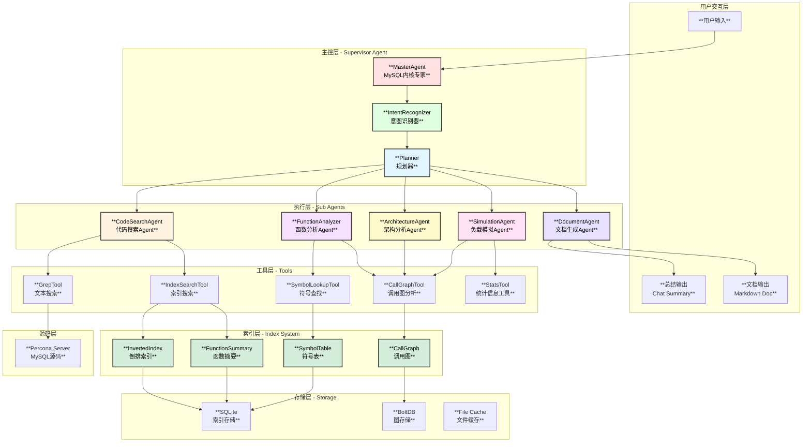
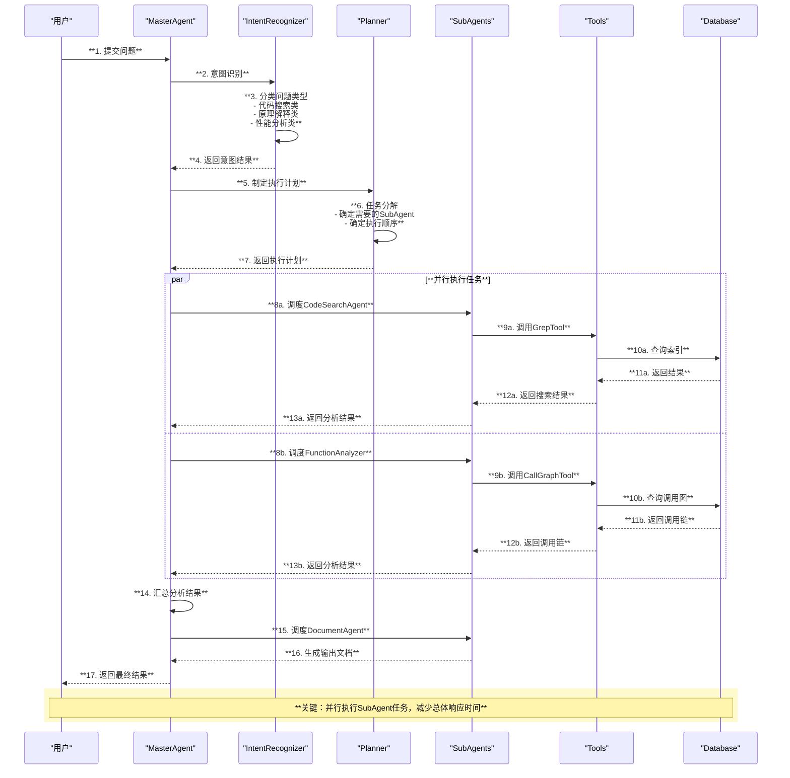
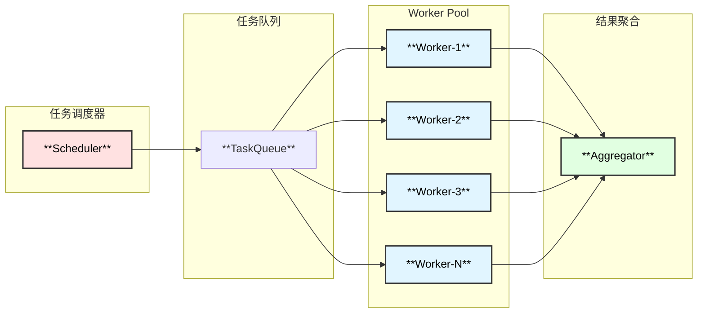
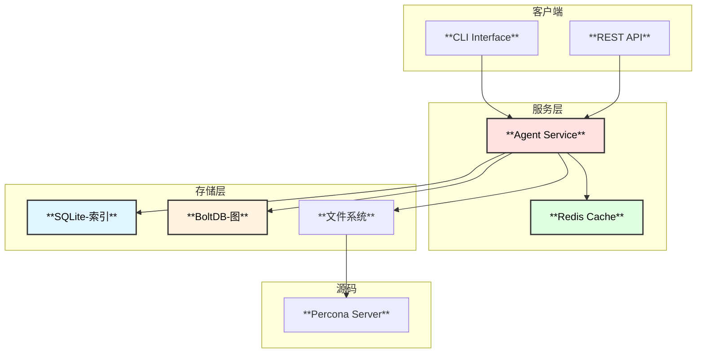

# MySQL内核专家Agent - 整体架构设计

## 1. 系统概述

MySQL内核专家Agent是一个基于eino框架开发的智能代码分析系统，专门用于从Percona Server源码角度解答MySQL内核相关问题。系统采用多Agent协作架构，结合代码索引、并发搜索、负载模拟等技术，提供深度的源码级分析能力。

## 2. 整体架构图



## 3. 核心组件说明

### 3.1 主控层 (Supervisor Agent)

| 组件 | 功能 | 技术实现 |
|------|------|----------|
| **MasterAgent** | 协调所有子Agent，管理对话上下文 | `adk.ChatModelAgent` + `supervisor.New` |
| **IntentRecognizer** | 识别用户意图，分类问题类型 | LLM + 规则引擎 |
| **Planner** | 制定执行计划，分配任务 | `adk.prebuilt.deep` 任务规划 |

### 3.2 执行层 (Sub Agents)

| Agent | 职责 | 并发支持 |
|-------|------|----------|
| **CodeSearchAgent** | 代码搜索、关键词匹配 | ✅ 并发grep |
| **FunctionAnalyzer** | 函数分析、调用链追踪 | ✅ 并发分析 |
| **ArchitectureAgent** | 架构理解、模块关系 | ✅ 并发查询 |
| **SimulationAgent** | 负载模拟、瓶颈分析 | ✅ 并发计算 |
| **DocumentAgent** | 文档生成、图表渲染 | - |

### 3.3 工具层 (Tools)

```go
// 工具接口定义
type Tool interface {
    Info(ctx context.Context) (*schema.ToolInfo, error)
    InvokableRun(ctx context.Context, args string, opts ...tool.Option) (string, error)
}
```

| 工具 | 功能 | 性能优化 |
|------|------|----------|
| **GrepTool** | 正则搜索、文本匹配 | ripgrep加速 |
| **IndexSearchTool** | 索引查询、语义搜索 | 倒排索引 |
| **SymbolLookupTool** | 符号定位、定义跳转 | 符号表缓存 |
| **CallGraphTool** | 调用图查询、路径分析 | 图数据库 |
| **StatsTool** | 统计信息收集、性能指标 | 增量更新 |

## 4. 数据流架构



## 5. 并发执行架构

### 5.1 并发模型



### 5.2 并发策略

| 场景 | 并发策略 | 实现方式 |
|------|----------|----------|
| 多文件grep | Fan-out/Fan-in | `errgroup.Group` |
| 多函数分析 | Pipeline | Channel + Goroutine |
| 调用图遍历 | BFS/DFS并行 | WorkerPool |
| 索引构建 | MapReduce | 分片处理 |

## 6. 输出格式设计

### 6.1 总结输出 (Summary Mode)

```
【问题】: 用户问题简述
【结论】: 1-2句核心结论
【关键代码】: 关键函数/文件位置
【参考】: 相关源码链接
```

### 6.2 文档输出 (Document Mode)

```markdown
# 主题标题

## 1. 概述
简要说明...

## 2. 架构图
[mermaid架构图]

## 3. 核心函数分析
### 3.1 函数调用链
[函数调用链树状图]

### 3.2 关键代码
[代码片段及分析]

## 4. 时序图
[mermaid时序图]

## 5. 总结
结论及建议...
```

## 7. 扩展性设计

### 7.1 插件机制

- **新Agent注册**: 通过 `adk.SetSubAgents` 动态添加
- **新Tool注册**: 通过 `ToolsConfig.Tools` 扩展
- **新Skill注册**: 通过 `skill.Backend` 接口扩展

### 7.2 配置化

```yaml
mysql_expert:
  source_path: "/path/to/percona-server"
  index_path: "/path/to/index"
  max_concurrent: 10
  output_mode: "document"  # summary | document
  agents:
    - code_search
    - function_analyzer
    - architecture_agent
    - simulation_agent
```

## 8. 部署架构


