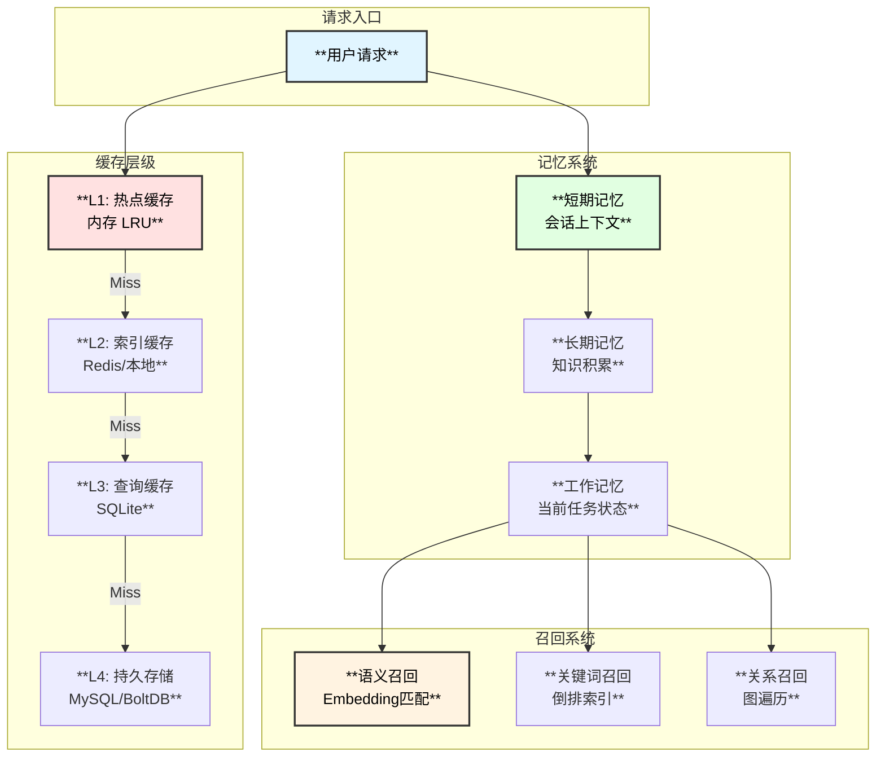
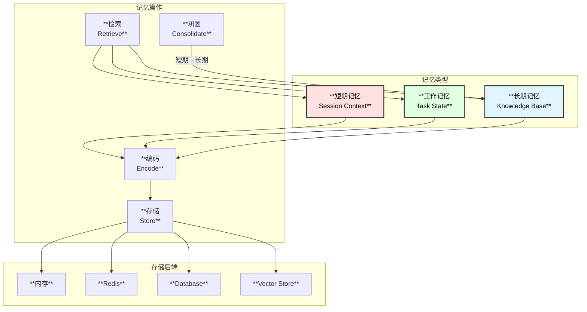
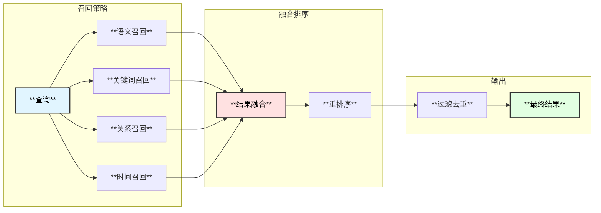

# MySQL内核专家Agent - 缓存与记忆系统设计

## 1. 缓存系统概述

缓存系统是降低Token消耗和提升响应速度的关键组件，包括多层缓存架构、记忆系统和智能召回机制。



## 2. 多层缓存架构

### 2.1 缓存层级设计

```go
// CacheConfig 缓存配置
type CacheConfig struct {
    // L1 热点缓存 (内存)
    L1 L1CacheConfig `yaml:"l1"`
    
    // L2 索引缓存 (Redis/内存)
    L2 L2CacheConfig `yaml:"l2"`
    
    // L3 查询缓存 (SQLite)
    L3 L3CacheConfig `yaml:"l3"`
    
    // 缓存策略
    Strategy CacheStrategy `yaml:"strategy"`
    
    // 预热配置
    Warmup WarmupConfig `yaml:"warmup"`
}

type L1CacheConfig struct {
    Enabled     bool          `yaml:"enabled"`
    MaxSize     int           `yaml:"max_size"`       // 最大条目数
    MaxMemory   int64         `yaml:"max_memory"`     // 最大内存 (bytes)
    TTL         time.Duration `yaml:"ttl"`
    ShardCount  int           `yaml:"shard_count"`    // 分片数量
}

type L2CacheConfig struct {
    Enabled     bool          `yaml:"enabled"`
    Backend     string        `yaml:"backend"`        // "redis" | "local"
    TTL         time.Duration `yaml:"ttl"`
    
    // Redis 配置
    Redis       *RedisConfig  `yaml:"redis"`
    
    // 本地文件缓存配置
    LocalPath   string        `yaml:"local_path"`
}

type L3CacheConfig struct {
    Enabled     bool          `yaml:"enabled"`
    DBPath      string        `yaml:"db_path"`
    TTL         time.Duration `yaml:"ttl"`
    MaxSize     int64         `yaml:"max_size_bytes"` // 最大存储大小
    Compression bool          `yaml:"compression"`    // 是否压缩
}

type CacheStrategy struct {
    // 缓存写入策略
    WriteMode       WriteMode     `yaml:"write_mode"`      // write_through | write_back
    WriteBackDelay  time.Duration `yaml:"write_back_delay"`
    
    // 缓存淘汰策略
    EvictionPolicy  EvictionPolicy `yaml:"eviction_policy"` // lru | lfu | ttl
    
    // 缓存预取策略
    PrefetchEnabled bool          `yaml:"prefetch_enabled"`
    PrefetchDepth   int           `yaml:"prefetch_depth"`
}

type WriteMode string
const (
    WriteModeThrough WriteMode = "write_through"
    WriteModeBack    WriteMode = "write_back"
)

type EvictionPolicy string
const (
    EvictionPolicyLRU EvictionPolicy = "lru"
    EvictionPolicyLFU EvictionPolicy = "lfu"
    EvictionPolicyTTL EvictionPolicy = "ttl"
)
```

### 2.2 多层缓存实现

```go
// MultiLayerCache 多层缓存
type MultiLayerCache struct {
    l1     *L1Cache
    l2     *L2Cache
    l3     *L3Cache
    stats  *CacheStats
    config *CacheConfig
}

// Get 获取缓存
func (c *MultiLayerCache) Get(ctx context.Context, key string) ([]byte, error) {
    // L1查找
    if c.l1.Enabled() {
        if val, ok := c.l1.Get(key); ok {
            c.stats.L1Hits.Add(1)
            return val, nil
        }
        c.stats.L1Misses.Add(1)
    }
    
    // L2查找
    if c.l2.Enabled() {
        if val, err := c.l2.Get(ctx, key); err == nil && val != nil {
            c.stats.L2Hits.Add(1)
            // 回填L1
            c.l1.Set(key, val)
            return val, nil
        }
        c.stats.L2Misses.Add(1)
    }
    
    // L3查找
    if c.l3.Enabled() {
        if val, err := c.l3.Get(ctx, key); err == nil && val != nil {
            c.stats.L3Hits.Add(1)
            // 回填上层
            c.l2.Set(ctx, key, val)
            c.l1.Set(key, val)
            return val, nil
        }
        c.stats.L3Misses.Add(1)
    }
    
    return nil, ErrCacheMiss
}

// Set 设置缓存
func (c *MultiLayerCache) Set(ctx context.Context, key string, value []byte) error {
    switch c.config.Strategy.WriteMode {
    case WriteModeThrough:
        return c.writeThrough(ctx, key, value)
    case WriteModeBack:
        return c.writeBack(ctx, key, value)
    default:
        return c.writeThrough(ctx, key, value)
    }
}

func (c *MultiLayerCache) writeThrough(ctx context.Context, key string, value []byte) error {
    // 同步写入所有层
    if c.l1.Enabled() {
        c.l1.Set(key, value)
    }
    if c.l2.Enabled() {
        if err := c.l2.Set(ctx, key, value); err != nil {
            return err
        }
    }
    if c.l3.Enabled() {
        if err := c.l3.Set(ctx, key, value); err != nil {
            return err
        }
    }
    return nil
}
```

### 2.3 L1内存缓存实现

```go
// L1Cache 一级内存缓存 (分片LRU)
type L1Cache struct {
    shards  []*cacheShard
    config  *L1CacheConfig
    hash    func(string) uint32
}

type cacheShard struct {
    items   map[string]*cacheItem
    lru     *list.List
    mu      sync.RWMutex
    maxSize int
}

type cacheItem struct {
    key       string
    value     []byte
    element   *list.Element
    expireAt  time.Time
    size      int64
}

func NewL1Cache(config *L1CacheConfig) *L1Cache {
    shards := make([]*cacheShard, config.ShardCount)
    shardSize := config.MaxSize / config.ShardCount
    
    for i := 0; i < config.ShardCount; i++ {
        shards[i] = &cacheShard{
            items:   make(map[string]*cacheItem),
            lru:     list.New(),
            maxSize: shardSize,
        }
    }
    
    return &L1Cache{
        shards: shards,
        config: config,
        hash:   fnv32,
    }
}

func (c *L1Cache) getShard(key string) *cacheShard {
    return c.shards[c.hash(key)%uint32(len(c.shards))]
}

func (c *L1Cache) Get(key string) ([]byte, bool) {
    shard := c.getShard(key)
    shard.mu.RLock()
    defer shard.mu.RUnlock()
    
    item, ok := shard.items[key]
    if !ok {
        return nil, false
    }
    
    // 检查过期
    if !item.expireAt.IsZero() && time.Now().After(item.expireAt) {
        return nil, false
    }
    
    // 更新LRU
    shard.lru.MoveToFront(item.element)
    
    return item.value, true
}

func (c *L1Cache) Set(key string, value []byte) {
    shard := c.getShard(key)
    shard.mu.Lock()
    defer shard.mu.Unlock()
    
    // 检查是否存在
    if item, ok := shard.items[key]; ok {
        item.value = value
        item.expireAt = time.Now().Add(c.config.TTL)
        shard.lru.MoveToFront(item.element)
        return
    }
    
    // 淘汰过期或过多的项
    for len(shard.items) >= shard.maxSize {
        c.evictOldest(shard)
    }
    
    // 添加新项
    item := &cacheItem{
        key:      key,
        value:    value,
        expireAt: time.Now().Add(c.config.TTL),
        size:     int64(len(value)),
    }
    item.element = shard.lru.PushFront(item)
    shard.items[key] = item
}

func (c *L1Cache) evictOldest(shard *cacheShard) {
    elem := shard.lru.Back()
    if elem != nil {
        item := elem.Value.(*cacheItem)
        shard.lru.Remove(elem)
        delete(shard.items, item.key)
    }
}
```

## 3. 记忆系统设计

### 3.1 记忆系统架构



### 3.2 记忆接口定义

```go
// MemoryConfig 记忆系统配置
type MemoryConfig struct {
    // 短期记忆
    ShortTerm ShortTermMemoryConfig `yaml:"short_term"`
    
    // 工作记忆
    Working WorkingMemoryConfig `yaml:"working"`
    
    // 长期记忆
    LongTerm LongTermMemoryConfig `yaml:"long_term"`
    
    // 记忆巩固
    Consolidation ConsolidationConfig `yaml:"consolidation"`
}

type ShortTermMemoryConfig struct {
    Enabled         bool          `yaml:"enabled"`
    MaxMessages     int           `yaml:"max_messages"`      // 最大消息数
    MaxTokens       int           `yaml:"max_tokens"`        // 最大Token数
    TTL             time.Duration `yaml:"ttl"`
    SummarizeThreshold int        `yaml:"summarize_threshold"` // 触发总结的阈值
}

type WorkingMemoryConfig struct {
    Enabled         bool          `yaml:"enabled"`
    MaxTasks        int           `yaml:"max_tasks"`
    TaskTTL         time.Duration `yaml:"task_ttl"`
    PersistOnComplete bool        `yaml:"persist_on_complete"`
}

type LongTermMemoryConfig struct {
    Enabled         bool          `yaml:"enabled"`
    Backend         string        `yaml:"backend"`           // "sqlite" | "mysql" | "redis"
    VectorEnabled   bool          `yaml:"vector_enabled"`    // 是否启用向量存储
    VectorBackend   string        `yaml:"vector_backend"`    // "milvus" | "qdrant" | "local"
    MaxCapacity     int           `yaml:"max_capacity"`
}

type ConsolidationConfig struct {
    Enabled         bool          `yaml:"enabled"`
    Interval        time.Duration `yaml:"interval"`          // 巩固间隔
    ScoreThreshold  float64       `yaml:"score_threshold"`   // 重要性分数阈值
    BatchSize       int           `yaml:"batch_size"`
}

// Memory 记忆接口
type Memory interface {
    // 存储记忆
    Store(ctx context.Context, entry *MemoryEntry) error
    
    // 检索记忆
    Retrieve(ctx context.Context, query *MemoryQuery) ([]*MemoryEntry, error)
    
    // 更新记忆
    Update(ctx context.Context, id string, entry *MemoryEntry) error
    
    // 删除记忆
    Delete(ctx context.Context, id string) error
    
    // 获取上下文
    GetContext(ctx context.Context, sessionID string) (*SessionContext, error)
    
    // 清理过期记忆
    Cleanup(ctx context.Context) error
}

// MemoryEntry 记忆条目
type MemoryEntry struct {
    ID          string                 `json:"id"`
    SessionID   string                 `json:"session_id"`
    Type        MemoryType             `json:"type"`
    Content     string                 `json:"content"`
    Summary     string                 `json:"summary,omitempty"`
    Embedding   []float32              `json:"embedding,omitempty"`
    Metadata    map[string]interface{} `json:"metadata"`
    Score       float64                `json:"score"`          // 重要性分数
    AccessCount int                    `json:"access_count"`
    CreatedAt   time.Time              `json:"created_at"`
    ExpiresAt   time.Time              `json:"expires_at,omitempty"`
}

type MemoryType string
const (
    MemoryTypeMessage      MemoryType = "message"
    MemoryTypeTask         MemoryType = "task"
    MemoryTypeKnowledge    MemoryType = "knowledge"
    MemoryTypeConversation MemoryType = "conversation"
    MemoryTypeCodeAnalysis MemoryType = "code_analysis"
)

// MemoryQuery 记忆查询
type MemoryQuery struct {
    SessionID    string       `json:"session_id,omitempty"`
    Types        []MemoryType `json:"types,omitempty"`
    Keywords     []string     `json:"keywords,omitempty"`
    Query        string       `json:"query,omitempty"`         // 语义查询
    TopK         int          `json:"top_k"`
    MinScore     float64      `json:"min_score,omitempty"`
    TimeRange    *TimeRange   `json:"time_range,omitempty"`
    UseVector    bool         `json:"use_vector"`              // 是否使用向量检索
}

type TimeRange struct {
    Start time.Time `json:"start"`
    End   time.Time `json:"end"`
}
```

### 3.3 短期记忆实现

```go
// ShortTermMemory 短期记忆
type ShortTermMemory struct {
    sessions map[string]*SessionMemory
    config   *ShortTermMemoryConfig
    mu       sync.RWMutex
}

type SessionMemory struct {
    ID          string
    Messages    []*MemoryEntry
    TotalTokens int
    Summary     string
    CreatedAt   time.Time
    UpdatedAt   time.Time
}

func NewShortTermMemory(config *ShortTermMemoryConfig) *ShortTermMemory {
    return &ShortTermMemory{
        sessions: make(map[string]*SessionMemory),
        config:   config,
    }
}

func (m *ShortTermMemory) Store(ctx context.Context, entry *MemoryEntry) error {
    m.mu.Lock()
    defer m.mu.Unlock()
    
    session, ok := m.sessions[entry.SessionID]
    if !ok {
        session = &SessionMemory{
            ID:        entry.SessionID,
            Messages:  make([]*MemoryEntry, 0),
            CreatedAt: time.Now(),
        }
        m.sessions[entry.SessionID] = session
    }
    
    session.Messages = append(session.Messages, entry)
    session.UpdatedAt = time.Now()
    
    // 估算Token数
    tokenCount := estimateTokens(entry.Content)
    session.TotalTokens += tokenCount
    
    // 检查是否需要压缩
    if session.TotalTokens > m.config.MaxTokens || 
       len(session.Messages) > m.config.SummarizeThreshold {
        return m.compressSession(ctx, session)
    }
    
    return nil
}

func (m *ShortTermMemory) compressSession(ctx context.Context, session *SessionMemory) error {
    // 保留最近的消息
    keepCount := m.config.MaxMessages / 2
    if len(session.Messages) <= keepCount {
        return nil
    }
    
    // 需要总结的消息
    toSummarize := session.Messages[:len(session.Messages)-keepCount]
    
    // 调用LLM生成摘要
    summary, err := m.summarize(ctx, toSummarize)
    if err != nil {
        return err
    }
    
    // 更新会话
    session.Summary = summary
    session.Messages = session.Messages[len(session.Messages)-keepCount:]
    session.TotalTokens = m.recalculateTokens(session)
    
    return nil
}

func (m *ShortTermMemory) GetContext(ctx context.Context, sessionID string) (*SessionContext, error) {
    m.mu.RLock()
    defer m.mu.RUnlock()
    
    session, ok := m.sessions[sessionID]
    if !ok {
        return nil, ErrSessionNotFound
    }
    
    context := &SessionContext{
        SessionID:   sessionID,
        Summary:     session.Summary,
        Messages:    make([]*MemoryEntry, len(session.Messages)),
        TotalTokens: session.TotalTokens,
    }
    
    copy(context.Messages, session.Messages)
    
    return context, nil
}
```

### 3.4 长期记忆实现

```go
// LongTermMemory 长期记忆
type LongTermMemory struct {
    storage     MemoryStorage
    vectorStore VectorStore
    config      *LongTermMemoryConfig
}

// MemoryStorage 记忆存储接口
type MemoryStorage interface {
    Save(ctx context.Context, entry *MemoryEntry) error
    Get(ctx context.Context, id string) (*MemoryEntry, error)
    Search(ctx context.Context, query *MemoryQuery) ([]*MemoryEntry, error)
    Update(ctx context.Context, entry *MemoryEntry) error
    Delete(ctx context.Context, id string) error
}

// VectorStore 向量存储接口
type VectorStore interface {
    Upsert(ctx context.Context, id string, embedding []float32, metadata map[string]interface{}) error
    Search(ctx context.Context, embedding []float32, topK int) ([]VectorSearchResult, error)
    Delete(ctx context.Context, id string) error
}

type VectorSearchResult struct {
    ID       string
    Score    float32
    Metadata map[string]interface{}
}

func NewLongTermMemory(config *LongTermMemoryConfig) (*LongTermMemory, error) {
    // 创建存储后端
    var storage MemoryStorage
    var err error
    
    switch config.Backend {
    case "sqlite":
        storage, err = NewSQLiteMemoryStorage(config)
    case "mysql":
        storage, err = NewMySQLMemoryStorage(config)
    case "redis":
        storage, err = NewRedisMemoryStorage(config)
    default:
        return nil, fmt.Errorf("unsupported memory backend: %s", config.Backend)
    }
    
    if err != nil {
        return nil, err
    }
    
    // 创建向量存储
    var vectorStore VectorStore
    if config.VectorEnabled {
        switch config.VectorBackend {
        case "local":
            vectorStore = NewLocalVectorStore()
        case "milvus":
            vectorStore, err = NewMilvusVectorStore(config)
        case "qdrant":
            vectorStore, err = NewQdrantVectorStore(config)
        }
        if err != nil {
            return nil, err
        }
    }
    
    return &LongTermMemory{
        storage:     storage,
        vectorStore: vectorStore,
        config:      config,
    }, nil
}

func (m *LongTermMemory) Store(ctx context.Context, entry *MemoryEntry) error {
    // 存储到数据库
    if err := m.storage.Save(ctx, entry); err != nil {
        return err
    }
    
    // 如果启用向量存储，生成embedding并存储
    if m.vectorStore != nil && len(entry.Embedding) > 0 {
        metadata := map[string]interface{}{
            "type":       entry.Type,
            "session_id": entry.SessionID,
            "created_at": entry.CreatedAt,
        }
        return m.vectorStore.Upsert(ctx, entry.ID, entry.Embedding, metadata)
    }
    
    return nil
}

func (m *LongTermMemory) Retrieve(ctx context.Context, query *MemoryQuery) ([]*MemoryEntry, error) {
    if query.UseVector && m.vectorStore != nil && query.Query != "" {
        // 向量检索
        return m.vectorRetrieve(ctx, query)
    }
    
    // 关键词检索
    return m.storage.Search(ctx, query)
}

func (m *LongTermMemory) vectorRetrieve(ctx context.Context, query *MemoryQuery) ([]*MemoryEntry, error) {
    // 生成查询向量
    embedding, err := generateEmbedding(query.Query)
    if err != nil {
        return nil, err
    }
    
    // 向量搜索
    results, err := m.vectorStore.Search(ctx, embedding, query.TopK)
    if err != nil {
        return nil, err
    }
    
    // 获取完整记忆
    entries := make([]*MemoryEntry, 0, len(results))
    for _, r := range results {
        if query.MinScore > 0 && float64(r.Score) < query.MinScore {
            continue
        }
        
        entry, err := m.storage.Get(ctx, r.ID)
        if err != nil {
            continue
        }
        entries = append(entries, entry)
    }
    
    return entries, nil
}
```

## 4. 智能召回系统

### 4.1 召回策略



### 4.2 召回系统实现

```go
// RecallConfig 召回配置
type RecallConfig struct {
    // 语义召回
    SemanticEnabled  bool    `yaml:"semantic_enabled"`
    SemanticWeight   float64 `yaml:"semantic_weight"`
    SemanticTopK     int     `yaml:"semantic_top_k"`
    
    // 关键词召回
    KeywordEnabled   bool    `yaml:"keyword_enabled"`
    KeywordWeight    float64 `yaml:"keyword_weight"`
    KeywordTopK      int     `yaml:"keyword_top_k"`
    
    // 关系召回
    RelationEnabled  bool    `yaml:"relation_enabled"`
    RelationWeight   float64 `yaml:"relation_weight"`
    RelationDepth    int     `yaml:"relation_depth"`
    
    // 时间召回
    TimeEnabled      bool    `yaml:"time_enabled"`
    TimeWeight       float64 `yaml:"time_weight"`
    TimeDecayFactor  float64 `yaml:"time_decay_factor"`
    
    // 融合配置
    FinalTopK        int     `yaml:"final_top_k"`
    MinScore         float64 `yaml:"min_score"`
}

// RecallSystem 召回系统
type RecallSystem struct {
    semantic   *SemanticRecaller
    keyword    *KeywordRecaller
    relation   *RelationRecaller
    time       *TimeRecaller
    config     *RecallConfig
}

// RecallResult 召回结果
type RecallResult struct {
    ID       string
    Score    float64
    Source   string   // 来源: semantic, keyword, relation, time
    Entry    *MemoryEntry
}

func (r *RecallSystem) Recall(ctx context.Context, query string, context *RecallContext) ([]*RecallResult, error) {
    var wg sync.WaitGroup
    results := make(chan []*RecallResult, 4)
    
    // 并行执行各召回策略
    if r.config.SemanticEnabled {
        wg.Add(1)
        go func() {
            defer wg.Done()
            res, _ := r.semantic.Recall(ctx, query, r.config.SemanticTopK)
            for i := range res {
                res[i].Score *= r.config.SemanticWeight
                res[i].Source = "semantic"
            }
            results <- res
        }()
    }
    
    if r.config.KeywordEnabled {
        wg.Add(1)
        go func() {
            defer wg.Done()
            res, _ := r.keyword.Recall(ctx, query, r.config.KeywordTopK)
            for i := range res {
                res[i].Score *= r.config.KeywordWeight
                res[i].Source = "keyword"
            }
            results <- res
        }()
    }
    
    if r.config.RelationEnabled && context.CurrentFunction != "" {
        wg.Add(1)
        go func() {
            defer wg.Done()
            res, _ := r.relation.Recall(ctx, context.CurrentFunction, r.config.RelationDepth)
            for i := range res {
                res[i].Score *= r.config.RelationWeight
                res[i].Source = "relation"
            }
            results <- res
        }()
    }
    
    if r.config.TimeEnabled {
        wg.Add(1)
        go func() {
            defer wg.Done()
            res, _ := r.time.Recall(ctx, context.SessionID, r.config.TimeDecayFactor)
            for i := range res {
                res[i].Score *= r.config.TimeWeight
                res[i].Source = "time"
            }
            results <- res
        }()
    }
    
    go func() {
        wg.Wait()
        close(results)
    }()
    
    // 收集所有结果
    allResults := make([]*RecallResult, 0)
    for res := range results {
        allResults = append(allResults, res...)
    }
    
    // 融合和排序
    return r.mergeAndRank(allResults)
}

func (r *RecallSystem) mergeAndRank(results []*RecallResult) ([]*RecallResult, error) {
    // 按ID合并，分数相加
    merged := make(map[string]*RecallResult)
    for _, res := range results {
        if existing, ok := merged[res.ID]; ok {
            existing.Score += res.Score
        } else {
            merged[res.ID] = res
        }
    }
    
    // 转为切片并排序
    final := make([]*RecallResult, 0, len(merged))
    for _, res := range merged {
        if res.Score >= r.config.MinScore {
            final = append(final, res)
        }
    }
    
    sort.Slice(final, func(i, j int) bool {
        return final[i].Score > final[j].Score
    })
    
    // 截取TopK
    if len(final) > r.config.FinalTopK {
        final = final[:r.config.FinalTopK]
    }
    
    return final, nil
}
```

## 5. 索引缓存优化

### 5.1 索引查询缓存

```go
// IndexCache 索引缓存
type IndexCacheConfig struct {
    // 查询缓存
    QueryCacheEnabled  bool          `yaml:"query_cache_enabled"`
    QueryCacheSize     int           `yaml:"query_cache_size"`
    QueryCacheTTL      time.Duration `yaml:"query_cache_ttl"`
    
    // 结果缓存
    ResultCacheEnabled bool          `yaml:"result_cache_enabled"`
    ResultCacheSize    int           `yaml:"result_cache_size"`
    ResultCacheTTL     time.Duration `yaml:"result_cache_ttl"`
    
    // 预热配置
    WarmupEnabled      bool          `yaml:"warmup_enabled"`
    WarmupQueries      []string      `yaml:"warmup_queries"`
    WarmupOnStart      bool          `yaml:"warmup_on_start"`
}

// IndexCache 索引缓存
type IndexCache struct {
    queryCache  *lru.Cache
    resultCache *lru.Cache
    config      *IndexCacheConfig
    stats       *IndexCacheStats
}

type IndexCacheStats struct {
    QueryHits      atomic.Int64
    QueryMisses    atomic.Int64
    ResultHits     atomic.Int64
    ResultMisses   atomic.Int64
}

// CacheKey 生成缓存键
func (c *IndexCache) CacheKey(query *SearchQuery) string {
    h := sha256.New()
    h.Write([]byte(fmt.Sprintf("%v", query)))
    return hex.EncodeToString(h.Sum(nil))[:16]
}

// GetOrCompute 获取或计算
func (c *IndexCache) GetOrCompute(
    ctx context.Context,
    query *SearchQuery,
    compute func() ([]*SearchResult, error),
) ([]*SearchResult, error) {
    if !c.config.QueryCacheEnabled {
        return compute()
    }
    
    key := c.CacheKey(query)
    
    // 查询缓存
    if cached, ok := c.queryCache.Get(key); ok {
        c.stats.QueryHits.Add(1)
        return cached.([]*SearchResult), nil
    }
    c.stats.QueryMisses.Add(1)
    
    // 计算结果
    results, err := compute()
    if err != nil {
        return nil, err
    }
    
    // 写入缓存
    c.queryCache.Add(key, results)
    
    return results, nil
}

// Warmup 预热缓存
func (c *IndexCache) Warmup(ctx context.Context, searcher IndexSearcher) error {
    if !c.config.WarmupEnabled {
        return nil
    }
    
    for _, q := range c.config.WarmupQueries {
        query := &SearchQuery{
            Terms:    strings.Split(q, " "),
            Operator: QueryAND,
            Limit:    100,
        }
        
        _, _ = c.GetOrCompute(ctx, query, func() ([]*SearchResult, error) {
            return searcher.Search(ctx, *query)
        })
    }
    
    return nil
}
```

## 6. 缓存统计与监控

### 6.1 统计指标

```go
// CacheStats 缓存统计
type CacheStats struct {
    L1Hits      atomic.Int64 `json:"l1_hits"`
    L1Misses    atomic.Int64 `json:"l1_misses"`
    L2Hits      atomic.Int64 `json:"l2_hits"`
    L2Misses    atomic.Int64 `json:"l2_misses"`
    L3Hits      atomic.Int64 `json:"l3_hits"`
    L3Misses    atomic.Int64 `json:"l3_misses"`
    
    MemoryHits   atomic.Int64 `json:"memory_hits"`
    MemoryMisses atomic.Int64 `json:"memory_misses"`
    
    TotalRequests atomic.Int64 `json:"total_requests"`
    TotalLatency  atomic.Int64 `json:"total_latency_ns"`
}

// GetHitRate 获取命中率
func (s *CacheStats) GetHitRate() map[string]float64 {
    return map[string]float64{
        "l1_hit_rate": float64(s.L1Hits.Load()) / float64(s.L1Hits.Load()+s.L1Misses.Load()+1),
        "l2_hit_rate": float64(s.L2Hits.Load()) / float64(s.L2Hits.Load()+s.L2Misses.Load()+1),
        "l3_hit_rate": float64(s.L3Hits.Load()) / float64(s.L3Hits.Load()+s.L3Misses.Load()+1),
        "overall_hit_rate": float64(s.L1Hits.Load()+s.L2Hits.Load()+s.L3Hits.Load()) / 
            float64(s.TotalRequests.Load()+1),
        "memory_hit_rate": float64(s.MemoryHits.Load()) / 
            float64(s.MemoryHits.Load()+s.MemoryMisses.Load()+1),
    }
}

// GetAvgLatency 获取平均延迟
func (s *CacheStats) GetAvgLatency() time.Duration {
    total := s.TotalRequests.Load()
    if total == 0 {
        return 0
    }
    return time.Duration(s.TotalLatency.Load() / total)
}

// Report 生成报告
func (s *CacheStats) Report() *CacheReport {
    hitRates := s.GetHitRate()
    return &CacheReport{
        TotalRequests:   s.TotalRequests.Load(),
        L1HitRate:       hitRates["l1_hit_rate"],
        L2HitRate:       hitRates["l2_hit_rate"],
        L3HitRate:       hitRates["l3_hit_rate"],
        OverallHitRate:  hitRates["overall_hit_rate"],
        MemoryHitRate:   hitRates["memory_hit_rate"],
        AvgLatency:      s.GetAvgLatency(),
        GeneratedAt:     time.Now(),
    }
}

type CacheReport struct {
    TotalRequests   int64         `json:"total_requests"`
    L1HitRate       float64       `json:"l1_hit_rate"`
    L2HitRate       float64       `json:"l2_hit_rate"`
    L3HitRate       float64       `json:"l3_hit_rate"`
    OverallHitRate  float64       `json:"overall_hit_rate"`
    MemoryHitRate   float64       `json:"memory_hit_rate"`
    AvgLatency      time.Duration `json:"avg_latency"`
    GeneratedAt     time.Time     `json:"generated_at"`
}
```

### 6.2 Prometheus指标导出

```go
// CacheMetrics Prometheus指标
type CacheMetrics struct {
    hitTotal     *prometheus.CounterVec
    missTotal    *prometheus.CounterVec
    latency      *prometheus.HistogramVec
    size         *prometheus.GaugeVec
    evictions    *prometheus.CounterVec
}

func NewCacheMetrics(reg prometheus.Registerer) *CacheMetrics {
    m := &CacheMetrics{
        hitTotal: prometheus.NewCounterVec(
            prometheus.CounterOpts{
                Name: "cache_hits_total",
                Help: "Total number of cache hits",
            },
            []string{"layer"},
        ),
        missTotal: prometheus.NewCounterVec(
            prometheus.CounterOpts{
                Name: "cache_misses_total",
                Help: "Total number of cache misses",
            },
            []string{"layer"},
        ),
        latency: prometheus.NewHistogramVec(
            prometheus.HistogramOpts{
                Name:    "cache_operation_duration_seconds",
                Help:    "Cache operation duration in seconds",
                Buckets: prometheus.ExponentialBuckets(0.0001, 2, 15),
            },
            []string{"operation", "layer"},
        ),
        size: prometheus.NewGaugeVec(
            prometheus.GaugeOpts{
                Name: "cache_size_bytes",
                Help: "Current cache size in bytes",
            },
            []string{"layer"},
        ),
        evictions: prometheus.NewCounterVec(
            prometheus.CounterOpts{
                Name: "cache_evictions_total",
                Help: "Total number of cache evictions",
            },
            []string{"layer", "reason"},
        ),
    }
    
    reg.MustRegister(m.hitTotal, m.missTotal, m.latency, m.size, m.evictions)
    return m
}
```
