# MySQL内核专家Agent - CI/CD设计

## 1. CI/CD概述

参考rds-backend的CI/CD最佳实践，构建完整的持续集成和持续部署流水线。

```mermaid
graph LR
    subgraph "代码提交"
        PR[**Pull Request**]
    end
    
    subgraph "CI Pipeline"
        LINT[**Lint检查**]
        TEST[**单元测试**]
        COV[**覆盖率检查**]
        BUILD[**构建**]
        SCAN[**安全扫描**]
    end
    
    subgraph "CD Pipeline"
        IMG[**镜像构建**]
        PUSH[**推送仓库**]
        DEV[**部署Dev**]
        STG[**部署Staging**]
        PROD[**部署Prod**]
    end
    
    PR --> LINT
    LINT --> TEST
    TEST --> COV
    COV --> BUILD
    BUILD --> SCAN
    SCAN --> IMG
    IMG --> PUSH
    PUSH --> DEV
    DEV --> STG
    STG --> PROD
    
    style LINT fill:#ffe1e1,stroke:#333,stroke-width:2px,color:#000
    style TEST fill:#e1ffe1,stroke:#333,stroke-width:2px,color:#000
    style IMG fill:#e1f5ff,stroke:#333,stroke-width:2px,color:#000
```



## 2. GitLab CI/CD配置

### 2.1 .gitlab-ci.yml

```yaml
# .gitlab-ci.yml
# MySQL Expert Agent CI/CD Pipeline

variables:
  # Go版本
  GO_VERSION: "1.22"
  # Docker镜像
  DOCKER_REGISTRY: "harbor.example.com"
  DOCKER_IMAGE: "${DOCKER_REGISTRY}/mysql-expert/mysql-expert-agent"
  # 测试配置
  TEST_PARALLEL_NUM: "4"
  TEST_PROGRAMS_NUM: "4"
  GOCOVERDIR: "${CI_PROJECT_DIR}/coveragebin"
  # 覆盖率阈值
  DIFF_COVER_FAIL_UNDER: "70"

# 默认配置
default:
  image: golang:${GO_VERSION}-bullseye
  before_script:
    - echo "Setting up Go environment..."
    - go env -w GONOSUMDB="git.garena.com,github.com/cloudwego"
    - go env -w GONOPROXY="git.garena.com,github.com/cloudwego"
    - go env -w GOPRIVATE="git.garena.com,github.com/cloudwego"
    - go mod download

# 缓存配置
cache:
  key: ${CI_COMMIT_REF_SLUG}
  paths:
    - .go/pkg/mod/
  policy: pull-push

# 阶段定义
stages:
  - lint
  - test
  - build
  - security
  - deploy

# =====================================================
# Lint阶段
# =====================================================
lint:
  stage: lint
  image: golangci/golangci-lint:v1.59.1
  script:
    - echo "Running lint checks..."
    - go vet ./...
    - go fmt ./...
    - golangci-lint run --concurrency=2 --max-issues-per-linter=50 --max-same-issues=5
  rules:
    - if: '$CI_PIPELINE_SOURCE == "merge_request_event"'
    - if: '$CI_COMMIT_BRANCH == "main" || $CI_COMMIT_BRANCH == "master"'
  tags:
    - docker

# =====================================================
# 测试阶段
# =====================================================
unit-test:
  stage: test
  script:
    - echo "Running unit tests..."
    - mkdir -p ${GOCOVERDIR}
    - |
      go test -v \
        -timeout=0 \
        -parallel=${TEST_PARALLEL_NUM} \
        -p=${TEST_PROGRAMS_NUM} \
        -count=1 \
        -race \
        -cover \
        -coverprofile=coverage.out \
        -gcflags=all=-l \
        $(go list ./... | grep -v /vendor/ | grep -v /mock | grep -v _test)
  artifacts:
    paths:
      - coverage.out
      - ${GOCOVERDIR}/
    expire_in: 1 week
  rules:
    - if: '$CI_PIPELINE_SOURCE == "merge_request_event"'
    - if: '$CI_COMMIT_BRANCH == "main" || $CI_COMMIT_BRANCH == "master"'
  tags:
    - docker

integration-test:
  stage: test
  services:
    - name: redis:7-alpine
      alias: redis
    - name: mysql:8.0
      alias: mysql
      variables:
        MYSQL_ROOT_PASSWORD: test_password
        MYSQL_DATABASE: mysql_expert_test
  variables:
    REDIS_HOST: redis
    MYSQL_HOST: mysql
    MYSQL_PASSWORD: test_password
  script:
    - echo "Running integration tests..."
    - |
      go test -v \
        -timeout=300s \
        -tags=integration \
        -coverprofile=coverage-integration.out \
        ./tests/integration/...
  artifacts:
    paths:
      - coverage-integration.out
    expire_in: 1 week
  rules:
    - if: '$CI_PIPELINE_SOURCE == "merge_request_event"'
  tags:
    - docker
  allow_failure: true

coverage:
  stage: test
  needs:
    - unit-test
  script:
    - echo "Generating coverage report..."
    - apt-get -qq update && apt-get -qq install -y python3-pip git
    - pip3 install diff_cover --quiet
    - go install github.com/axw/gocov/gocov@latest
    - go install github.com/AlekSi/gocov-xml@latest
    - go install github.com/matm/gocov-html/cmd/gocov-html@latest
    
    # 生成覆盖率报告
    - gocov convert coverage.out | gocov-xml > coverage.xml
    - gocov convert coverage.out | gocov-html > coverage.html
    
    # 总覆盖率
    - echo "Total test coverage:"
    - go tool cover -func=coverage.out | tail -n 1
    
    # 增量覆盖率检查
    - |
      if [ "$CI_MERGE_REQUEST_TARGET_BRANCH_NAME" != "" ]; then
        DIFF_COVER_BRANCH="${CI_MERGE_REQUEST_TARGET_BRANCH_NAME}"
      else
        DIFF_COVER_BRANCH="main"
      fi
      echo "Diff coverage with branch: origin/${DIFF_COVER_BRANCH}"
      git fetch origin ${DIFF_COVER_BRANCH}
      diff-cover coverage.xml \
        --compare-branch origin/${DIFF_COVER_BRANCH} \
        --html-report diff_coverage.html \
        --json-report diff_coverage.json \
        --diff-range-notation '..' \
        --show-uncovered \
        --fail-under=${DIFF_COVER_FAIL_UNDER}
  artifacts:
    paths:
      - coverage.xml
      - coverage.html
      - diff_coverage.html
      - diff_coverage.json
    reports:
      coverage_report:
        coverage_format: cobertura
        path: coverage.xml
    expire_in: 1 week
  coverage: '/total:\s+\(statements\)\s+(\d+\.\d+)%/'
  rules:
    - if: '$CI_PIPELINE_SOURCE == "merge_request_event"'
  tags:
    - docker

# =====================================================
# 构建阶段
# =====================================================
build:
  stage: build
  variables:
    CGO_ENABLED: "0"
    GOOS: "linux"
    GOARCH: "amd64"
  script:
    - echo "Building binary..."
    - |
      VERSION=$(git describe --tags --always --dirty 2>/dev/null || echo "dev")
      COMMIT=$(git rev-parse --short HEAD)
      BUILD_TIME=$(date -u '+%Y-%m-%d_%H:%M:%S')
      
      go build -v \
        -ldflags "-s -w \
          -X main.Version=${VERSION} \
          -X main.Commit=${COMMIT} \
          -X main.BuildTime=${BUILD_TIME}" \
        -o bin/mysql-expert-agent \
        ./cmd/main.go
    - ls -la bin/
  artifacts:
    paths:
      - bin/mysql-expert-agent
    expire_in: 1 week
  rules:
    - if: '$CI_COMMIT_BRANCH == "main" || $CI_COMMIT_BRANCH == "master"'
    - if: '$CI_COMMIT_TAG'
  tags:
    - docker

build-dry-run:
  stage: build
  script:
    - echo "Build dry run..."
    - go build -v ./...
  rules:
    - if: '$CI_PIPELINE_SOURCE == "merge_request_event"'
  tags:
    - docker

# =====================================================
# 安全扫描阶段
# =====================================================
security-scan:
  stage: security
  image: 
    name: aquasec/trivy:latest
    entrypoint: [""]
  script:
    - echo "Running security scan..."
    - trivy fs --exit-code 1 --severity HIGH,CRITICAL --no-progress .
  rules:
    - if: '$CI_COMMIT_BRANCH == "main" || $CI_COMMIT_BRANCH == "master"'
  tags:
    - docker
  allow_failure: true

dependency-scan:
  stage: security
  script:
    - echo "Scanning dependencies..."
    - go list -json -m all > go.list
    - go install golang.org/x/vuln/cmd/govulncheck@latest
    - govulncheck ./...
  rules:
    - if: '$CI_PIPELINE_SOURCE == "merge_request_event"'
    - if: '$CI_COMMIT_BRANCH == "main" || $CI_COMMIT_BRANCH == "master"'
  tags:
    - docker
  allow_failure: true

# =====================================================
# 部署阶段 - 镜像构建
# =====================================================
docker-build:
  stage: deploy
  image: docker:24-dind
  services:
    - docker:24-dind
  needs:
    - build
  variables:
    DOCKER_HOST: tcp://docker:2376
    DOCKER_TLS_CERTDIR: "/certs"
    DOCKER_TLS_VERIFY: 1
    DOCKER_CERT_PATH: "$DOCKER_TLS_CERTDIR/client"
  before_script:
    - echo "Logging into Docker registry..."
    - echo ${DOCKER_PASSWORD} | docker login --username ${DOCKER_USERNAME} --password-stdin ${DOCKER_REGISTRY}
  script:
    - echo "Building Docker image..."
    - |
      if [ -n "$CI_COMMIT_TAG" ]; then
        IMAGE_TAG="${CI_COMMIT_TAG}"
      else
        IMAGE_TAG="${CI_COMMIT_SHORT_SHA}"
      fi
      
      docker build \
        --build-arg VERSION=${IMAGE_TAG} \
        --build-arg COMMIT=${CI_COMMIT_SHA} \
        --build-arg BUILD_TIME=$(date -u '+%Y-%m-%d_%H:%M:%S') \
        -t ${DOCKER_IMAGE}:${IMAGE_TAG} \
        -t ${DOCKER_IMAGE}:latest \
        .
      
      docker push ${DOCKER_IMAGE}:${IMAGE_TAG}
      docker push ${DOCKER_IMAGE}:latest
      
      echo "Image built and pushed: ${DOCKER_IMAGE}:${IMAGE_TAG}"
  rules:
    - if: '$CI_COMMIT_BRANCH == "main" || $CI_COMMIT_BRANCH == "master"'
    - if: '$CI_COMMIT_TAG'
  tags:
    - docker.sock
    - share-dind

# =====================================================
# 部署阶段 - 环境部署
# =====================================================
deploy-dev:
  stage: deploy
  image: bitnami/kubectl:latest
  needs:
    - docker-build
  script:
    - echo "Deploying to development environment..."
    - |
      helm upgrade --install mysql-expert-agent ./helm/mysql-expert-agent \
        --namespace mysql-expert-dev \
        --create-namespace \
        -f ./helm/mysql-expert-agent/values-dev.yaml \
        --set image.tag=${CI_COMMIT_SHORT_SHA}
  environment:
    name: development
    url: https://mysql-expert-dev.example.com
  rules:
    - if: '$CI_COMMIT_BRANCH == "main" || $CI_COMMIT_BRANCH == "master"'
  tags:
    - k8s

deploy-staging:
  stage: deploy
  image: bitnami/kubectl:latest
  needs:
    - deploy-dev
  script:
    - echo "Deploying to staging environment..."
    - |
      helm upgrade --install mysql-expert-agent ./helm/mysql-expert-agent \
        --namespace mysql-expert-staging \
        --create-namespace \
        -f ./helm/mysql-expert-agent/values-staging.yaml \
        --set image.tag=${CI_COMMIT_SHORT_SHA}
  environment:
    name: staging
    url: https://mysql-expert-staging.example.com
  when: manual
  rules:
    - if: '$CI_COMMIT_BRANCH == "main" || $CI_COMMIT_BRANCH == "master"'
  tags:
    - k8s

deploy-prod:
  stage: deploy
  image: bitnami/kubectl:latest
  needs:
    - deploy-staging
  script:
    - echo "Deploying to production environment..."
    - |
      helm upgrade --install mysql-expert-agent ./helm/mysql-expert-agent \
        --namespace mysql-expert-prod \
        --create-namespace \
        -f ./helm/mysql-expert-agent/values-prod.yaml \
        --set image.tag=${CI_COMMIT_TAG:-${CI_COMMIT_SHORT_SHA}}
  environment:
    name: production
    url: https://mysql-expert.example.com
  when: manual
  rules:
    - if: '$CI_COMMIT_TAG'
  tags:
    - k8s
```

## 3. Makefile

```makefile
# Makefile for MySQL Expert Agent

SHELL := /bin/bash
PROJECT := mysql-expert-agent
GO := go
GOFLAGS := -v
LDFLAGS := -s -w

# 版本信息
VERSION := $(shell git describe --tags --always --dirty 2>/dev/null || echo "dev")
COMMIT := $(shell git rev-parse --short HEAD 2>/dev/null || echo "unknown")
BUILD_TIME := $(shell date -u '+%Y-%m-%d_%H:%M:%S')

# 路径
BIN_DIR := bin
CMD_DIR := cmd
PKG_DIR := pkg
COVERAGE_DIR := coverage

# 测试配置
TEST_PARALLEL_NUM ?= 4
TEST_PROGRAMS_NUM ?= 4
TEST_TIMEOUT ?= 300s
COVERAGE_THRESHOLD ?= 70

# Docker配置
DOCKER_REGISTRY ?= harbor.example.com
DOCKER_IMAGE ?= $(DOCKER_REGISTRY)/mysql-expert/$(PROJECT)

# Go编译标志
GO_LDFLAGS := -ldflags "-s -w \
	-X main.Version=$(VERSION) \
	-X main.Commit=$(COMMIT) \
	-X main.BuildTime=$(BUILD_TIME)"

.PHONY: all build test lint clean docker help

# 默认目标
all: lint test build

# 帮助
help:
	@echo "MySQL Expert Agent Makefile"
	@echo ""
	@echo "Usage:"
	@echo "  make [target]"
	@echo ""
	@echo "Targets:"
	@echo "  all          Run lint, test, and build"
	@echo "  build        Build the binary"
	@echo "  test         Run unit tests"
	@echo "  test-all     Run all tests (unit + integration)"
	@echo "  lint         Run linters"
	@echo "  fmt          Format code"
	@echo "  vet          Run go vet"
	@echo "  coverage     Generate coverage report"
	@echo "  clean        Clean build artifacts"
	@echo "  docker       Build Docker image"
	@echo "  docker-push  Push Docker image"
	@echo "  deps         Download dependencies"
	@echo "  help         Show this help"

# 依赖下载
deps:
	@echo "Downloading dependencies..."
	$(GO) mod download
	$(GO) mod verify

# 代码格式化
fmt:
	@echo "Formatting code..."
	$(GO) fmt ./...
	goimports -w .

# Go vet
vet:
	@echo "Running go vet..."
	$(GO) vet ./...

# Lint检查
lint: vet
	@echo "Running golangci-lint..."
	golangci-lint run --concurrency=2 --max-issues-per-linter=50

# 构建
build:
	@echo "Building $(PROJECT)..."
	@mkdir -p $(BIN_DIR)
	CGO_ENABLED=0 GOOS=linux GOARCH=amd64 \
		$(GO) build $(GOFLAGS) $(GO_LDFLAGS) \
		-o $(BIN_DIR)/$(PROJECT) \
		./$(CMD_DIR)/main.go
	@echo "Binary built: $(BIN_DIR)/$(PROJECT)"

# macOS构建
build-darwin:
	@echo "Building for macOS..."
	@mkdir -p $(BIN_DIR)
	CGO_ENABLED=0 GOOS=darwin GOARCH=amd64 \
		$(GO) build $(GOFLAGS) $(GO_LDFLAGS) \
		-o $(BIN_DIR)/$(PROJECT)-darwin \
		./$(CMD_DIR)/main.go

# Windows构建
build-windows:
	@echo "Building for Windows..."
	@mkdir -p $(BIN_DIR)
	CGO_ENABLED=0 GOOS=windows GOARCH=amd64 \
		$(GO) build $(GOFLAGS) $(GO_LDFLAGS) \
		-o $(BIN_DIR)/$(PROJECT).exe \
		./$(CMD_DIR)/main.go

# 单元测试
test:
	@echo "Running unit tests..."
	@mkdir -p $(COVERAGE_DIR)
	$(GO) test \
		-v \
		-timeout=$(TEST_TIMEOUT) \
		-parallel=$(TEST_PARALLEL_NUM) \
		-p=$(TEST_PROGRAMS_NUM) \
		-count=1 \
		-race \
		-cover \
		-coverprofile=$(COVERAGE_DIR)/coverage.out \
		$$($(GO) list ./... | grep -v /vendor/ | grep -v /mock | grep -v /tests/integration)
	@echo ""
	@echo "Coverage summary:"
	@$(GO) tool cover -func=$(COVERAGE_DIR)/coverage.out | tail -n 1

# 集成测试
test-integration:
	@echo "Running integration tests..."
	$(GO) test \
		-v \
		-timeout=600s \
		-tags=integration \
		-coverprofile=$(COVERAGE_DIR)/coverage-integration.out \
		./tests/integration/...

# 所有测试
test-all: test test-integration

# 覆盖率报告
coverage: test
	@echo "Generating coverage report..."
	$(GO) tool cover -html=$(COVERAGE_DIR)/coverage.out -o $(COVERAGE_DIR)/coverage.html
	@echo "Coverage report: $(COVERAGE_DIR)/coverage.html"
	@echo ""
	@echo "Checking coverage threshold..."
	@COVERAGE=$$($(GO) tool cover -func=$(COVERAGE_DIR)/coverage.out | tail -n 1 | awk '{print $$3}' | sed 's/%//'); \
	if [ $$(echo "$$COVERAGE < $(COVERAGE_THRESHOLD)" | bc) -eq 1 ]; then \
		echo "Coverage $$COVERAGE% is below threshold $(COVERAGE_THRESHOLD)%"; \
		exit 1; \
	else \
		echo "Coverage $$COVERAGE% meets threshold $(COVERAGE_THRESHOLD)%"; \
	fi

# 基准测试
benchmark:
	@echo "Running benchmarks..."
	$(GO) test -bench=. -benchmem ./...

# 清理
clean:
	@echo "Cleaning..."
	rm -rf $(BIN_DIR)
	rm -rf $(COVERAGE_DIR)
	$(GO) clean -cache -testcache

# Docker构建
docker:
	@echo "Building Docker image..."
	docker build \
		--build-arg VERSION=$(VERSION) \
		--build-arg COMMIT=$(COMMIT) \
		--build-arg BUILD_TIME=$(BUILD_TIME) \
		-t $(DOCKER_IMAGE):$(VERSION) \
		-t $(DOCKER_IMAGE):latest \
		.
	@echo "Image built: $(DOCKER_IMAGE):$(VERSION)"

# Docker推送
docker-push: docker
	@echo "Pushing Docker image..."
	docker push $(DOCKER_IMAGE):$(VERSION)
	docker push $(DOCKER_IMAGE):latest

# 生成Mock
generate-mocks:
	@echo "Generating mocks..."
	$(GO) generate ./...

# 安装开发工具
install-tools:
	@echo "Installing development tools..."
	$(GO) install github.com/golangci/golangci-lint/cmd/golangci-lint@latest
	$(GO) install golang.org/x/tools/cmd/goimports@latest
	$(GO) install github.com/golang/mock/mockgen@latest
	$(GO) install golang.org/x/vuln/cmd/govulncheck@latest

# 安全扫描
security-scan:
	@echo "Running security scan..."
	govulncheck ./...

# 运行开发服务器
run:
	@echo "Starting development server..."
	$(GO) run ./$(CMD_DIR)/main.go --config=config/config-dev.yaml
```

## 4. Dockerfile

```dockerfile
# Dockerfile
# Multi-stage build for MySQL Expert Agent

# =====================================================
# Build Stage
# =====================================================
FROM golang:1.22-bullseye AS builder

# 构建参数
ARG VERSION=dev
ARG COMMIT=unknown
ARG BUILD_TIME=unknown

WORKDIR /app

# 复制依赖文件
COPY go.mod go.sum ./
RUN go mod download

# 复制源代码
COPY . .

# 构建
RUN CGO_ENABLED=0 GOOS=linux GOARCH=amd64 go build \
    -ldflags "-s -w \
        -X main.Version=${VERSION} \
        -X main.Commit=${COMMIT} \
        -X main.BuildTime=${BUILD_TIME}" \
    -o /app/mysql-expert-agent \
    ./cmd/main.go

# =====================================================
# Runtime Stage
# =====================================================
FROM debian:bullseye-slim

# 安装运行时依赖
RUN apt-get update && apt-get install -y --no-install-recommends \
    ca-certificates \
    git \
    universal-ctags \
    && rm -rf /var/lib/apt/lists/*

# 创建非root用户
RUN groupadd -r mysql-expert && useradd -r -g mysql-expert mysql-expert

# 创建必要的目录
RUN mkdir -p /data/index /data/cache /data/logs /data/output /data/source \
    && chown -R mysql-expert:mysql-expert /data

WORKDIR /app

# 从构建阶段复制二进制
COPY --from=builder /app/mysql-expert-agent /app/mysql-expert-agent

# 复制配置文件模板
COPY config/config.yaml.template /app/config/

# 切换到非root用户
USER mysql-expert

# 暴露端口
EXPOSE 8080 8081 8082 8083 9090

# 健康检查
HEALTHCHECK --interval=30s --timeout=5s --start-period=10s --retries=3 \
    CMD ["/app/mysql-expert-agent", "healthcheck"]

# 入口点
ENTRYPOINT ["/app/mysql-expert-agent"]
CMD ["serve", "--config=/etc/mysql-expert/config.yaml"]
```

## 5. golangci-lint配置

```yaml
# .golangci.yml
run:
  timeout: 5m
  issues-exit-code: 1
  tests: true
  skip-dirs:
    - vendor
    - mock
    - mocks
    - testdata

output:
  format: colored-line-number
  print-issued-lines: true
  print-linter-name: true

linters-settings:
  errcheck:
    check-type-assertions: true
    check-blank: true
  
  govet:
    check-shadowing: true
  
  gofmt:
    simplify: true
  
  goimports:
    local-prefixes: github.com/yourorg/mysql-expert-agent
  
  gocyclo:
    min-complexity: 15
  
  dupl:
    threshold: 150
  
  goconst:
    min-len: 3
    min-occurrences: 3
  
  misspell:
    locale: US
  
  lll:
    line-length: 140
    tab-width: 4
  
  funlen:
    lines: 100
    statements: 50
  
  gocritic:
    enabled-tags:
      - diagnostic
      - performance
      - style
    disabled-checks:
      - dupImport
      - ifElseChain
      - octalLiteral
  
  revive:
    rules:
      - name: blank-imports
      - name: context-as-argument
      - name: context-keys-type
      - name: dot-imports
      - name: error-return
      - name: error-strings
      - name: error-naming
      - name: exported
      - name: if-return
      - name: increment-decrement
      - name: var-naming
      - name: var-declaration
      - name: package-comments
      - name: range
      - name: receiver-naming
      - name: time-naming
      - name: unexported-return
      - name: indent-error-flow
      - name: errorf
      - name: empty-block
      - name: superfluous-else
      - name: unused-parameter
      - name: unreachable-code
      - name: redefines-builtin-id

linters:
  disable-all: true
  enable:
    - errcheck
    - gosimple
    - govet
    - ineffassign
    - staticcheck
    - typecheck
    - unused
    - gofmt
    - goimports
    - misspell
    - lll
    - goconst
    - gocyclo
    - dupl
    - funlen
    - gocritic
    - revive
    - unconvert
    - unparam
    - nakedret
    - prealloc
    - exportloopref
    - whitespace
    - wsl

issues:
  exclude-rules:
    - path: _test\.go
      linters:
        - dupl
        - funlen
        - lll
    
    - path: mock
      linters:
        - dupl
        - funlen
    
    - linters:
        - lll
      source: "^//go:generate "
  
  max-issues-per-linter: 50
  max-same-issues: 5
  new: false
```

## 6. 测试结构设计

### 6.1 测试目录结构

```
tests/
├── unit/                     # 单元测试
│   ├── index/
│   │   ├── inverted_test.go
│   │   ├── summary_test.go
│   │   └── callgraph_test.go
│   ├── cache/
│   │   ├── l1_test.go
│   │   ├── l2_test.go
│   │   └── memory_test.go
│   ├── llm/
│   │   ├── router_test.go
│   │   └── provider_test.go
│   └── agent/
│       ├── master_test.go
│       └── tools_test.go
│
├── integration/              # 集成测试
│   ├── api_test.go
│   ├── mcp_test.go
│   ├── a2a_test.go
│   └── websocket_test.go
│
├── e2e/                      # 端到端测试
│   ├── scenario_test.go
│   └── performance_test.go
│
├── fixtures/                 # 测试数据
│   ├── source_code/
│   └── expected/
│
└── mocks/                    # Mock生成
    ├── llm_mock.go
    ├── storage_mock.go
    └── cache_mock.go
```

### 6.2 测试示例

```go
// tests/unit/cache/l1_test.go
package cache_test

import (
    "testing"
    "time"
    
    "github.com/stretchr/testify/assert"
    "github.com/stretchr/testify/require"
    
    "github.com/yourorg/mysql-expert-agent/pkg/cache"
)

func TestL1Cache_SetAndGet(t *testing.T) {
    config := &cache.L1CacheConfig{
        Enabled:    true,
        MaxSize:    100,
        TTL:        5 * time.Minute,
        ShardCount: 4,
    }
    
    c := cache.NewL1Cache(config)
    
    // 测试设置和获取
    key := "test-key"
    value := []byte("test-value")
    
    c.Set(key, value)
    
    got, ok := c.Get(key)
    require.True(t, ok)
    assert.Equal(t, value, got)
}

func TestL1Cache_Expiration(t *testing.T) {
    config := &cache.L1CacheConfig{
        Enabled:    true,
        MaxSize:    100,
        TTL:        100 * time.Millisecond,
        ShardCount: 4,
    }
    
    c := cache.NewL1Cache(config)
    
    key := "test-key"
    value := []byte("test-value")
    
    c.Set(key, value)
    
    // 等待过期
    time.Sleep(150 * time.Millisecond)
    
    _, ok := c.Get(key)
    assert.False(t, ok, "Expected key to be expired")
}

func TestL1Cache_Eviction(t *testing.T) {
    config := &cache.L1CacheConfig{
        Enabled:    true,
        MaxSize:    5,  // 小容量触发淘汰
        TTL:        5 * time.Minute,
        ShardCount: 1,
    }
    
    c := cache.NewL1Cache(config)
    
    // 写入超过容量的数据
    for i := 0; i < 10; i++ {
        key := fmt.Sprintf("key-%d", i)
        value := []byte(fmt.Sprintf("value-%d", i))
        c.Set(key, value)
    }
    
    // 验证最早的key被淘汰
    _, ok := c.Get("key-0")
    assert.False(t, ok, "Expected oldest key to be evicted")
    
    // 验证最新的key存在
    _, ok = c.Get("key-9")
    assert.True(t, ok, "Expected newest key to exist")
}

func BenchmarkL1Cache_Set(b *testing.B) {
    config := &cache.L1CacheConfig{
        Enabled:    true,
        MaxSize:    10000,
        TTL:        5 * time.Minute,
        ShardCount: 16,
    }
    
    c := cache.NewL1Cache(config)
    value := []byte("benchmark-value")
    
    b.ResetTimer()
    b.RunParallel(func(pb *testing.PB) {
        i := 0
        for pb.Next() {
            key := fmt.Sprintf("key-%d", i)
            c.Set(key, value)
            i++
        }
    })
}

func BenchmarkL1Cache_Get(b *testing.B) {
    config := &cache.L1CacheConfig{
        Enabled:    true,
        MaxSize:    10000,
        TTL:        5 * time.Minute,
        ShardCount: 16,
    }
    
    c := cache.NewL1Cache(config)
    
    // 预填充数据
    for i := 0; i < 1000; i++ {
        key := fmt.Sprintf("key-%d", i)
        value := []byte(fmt.Sprintf("value-%d", i))
        c.Set(key, value)
    }
    
    b.ResetTimer()
    b.RunParallel(func(pb *testing.PB) {
        i := 0
        for pb.Next() {
            key := fmt.Sprintf("key-%d", i%1000)
            c.Get(key)
            i++
        }
    })
}
```

### 6.3 集成测试示例

```go
// tests/integration/api_test.go
//go:build integration

package integration_test

import (
    "bytes"
    "encoding/json"
    "net/http"
    "net/http/httptest"
    "testing"
    "time"
    
    "github.com/stretchr/testify/assert"
    "github.com/stretchr/testify/require"
    
    "github.com/yourorg/mysql-expert-agent/pkg/server"
)

func TestAPI_Health(t *testing.T) {
    srv := setupTestServer(t)
    
    req := httptest.NewRequest("GET", "/api/v1/health", nil)
    w := httptest.NewRecorder()
    
    srv.Router.ServeHTTP(w, req)
    
    assert.Equal(t, http.StatusOK, w.Code)
    
    var resp map[string]interface{}
    err := json.Unmarshal(w.Body.Bytes(), &resp)
    require.NoError(t, err)
    
    assert.Equal(t, "ok", resp["status"])
}

func TestAPI_Chat(t *testing.T) {
    srv := setupTestServer(t)
    
    reqBody := map[string]interface{}{
        "message": "What is THD in MySQL?",
    }
    body, _ := json.Marshal(reqBody)
    
    req := httptest.NewRequest("POST", "/api/v1/chat", bytes.NewReader(body))
    req.Header.Set("Content-Type", "application/json")
    req.Header.Set("Authorization", "Bearer test-api-key")
    
    w := httptest.NewRecorder()
    srv.Router.ServeHTTP(w, req)
    
    assert.Equal(t, http.StatusOK, w.Code)
    
    var resp map[string]interface{}
    err := json.Unmarshal(w.Body.Bytes(), &resp)
    require.NoError(t, err)
    
    assert.NotEmpty(t, resp["message"])
}

func TestAPI_SearchCode(t *testing.T) {
    srv := setupTestServer(t)
    
    reqBody := map[string]interface{}{
        "query": "mysql_execute_command",
        "limit": 10,
    }
    body, _ := json.Marshal(reqBody)
    
    req := httptest.NewRequest("POST", "/api/v1/search/code", bytes.NewReader(body))
    req.Header.Set("Content-Type", "application/json")
    req.Header.Set("Authorization", "Bearer test-api-key")
    
    w := httptest.NewRecorder()
    srv.Router.ServeHTTP(w, req)
    
    assert.Equal(t, http.StatusOK, w.Code)
}

func setupTestServer(t *testing.T) *server.RESTServer {
    // 设置测试配置
    cfg := &server.RESTServerConfig{
        Enabled:  true,
        Address:  ":0",
        BasePath: "/api/v1",
        Auth: &server.RESTAuthConfig{
            Enabled: true,
            Type:    "api_key",
            APIKeys: []string{"test-api-key"},
        },
    }
    
    // 创建mock agent
    mockAgent := &MockAgent{}
    
    srv := server.NewRESTServer(cfg, mockAgent)
    
    return srv
}
```
