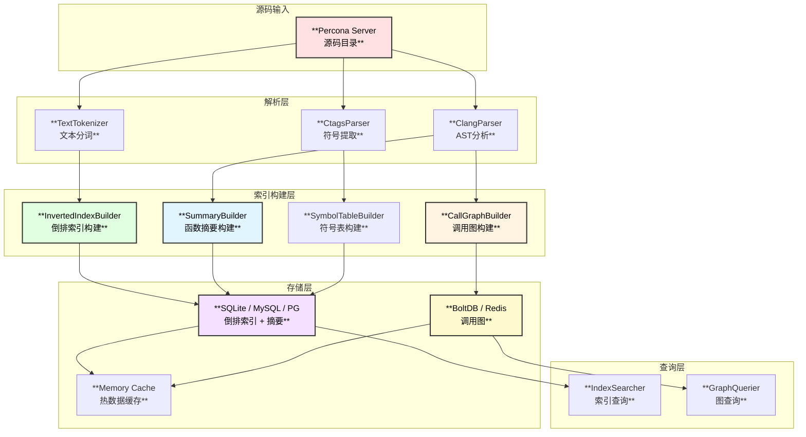
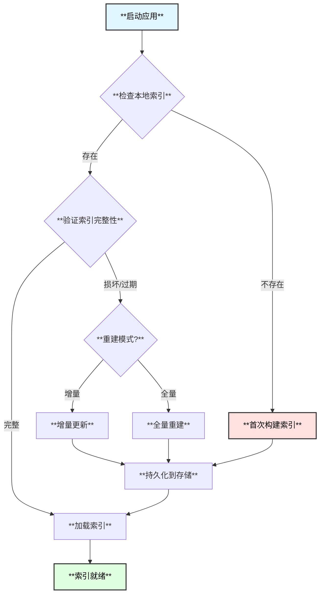
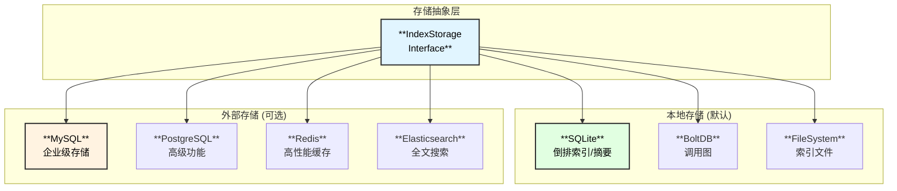
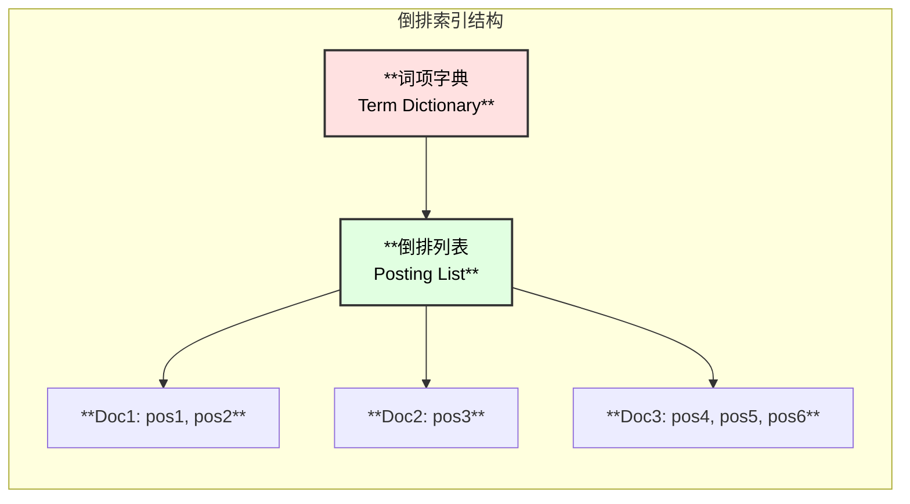
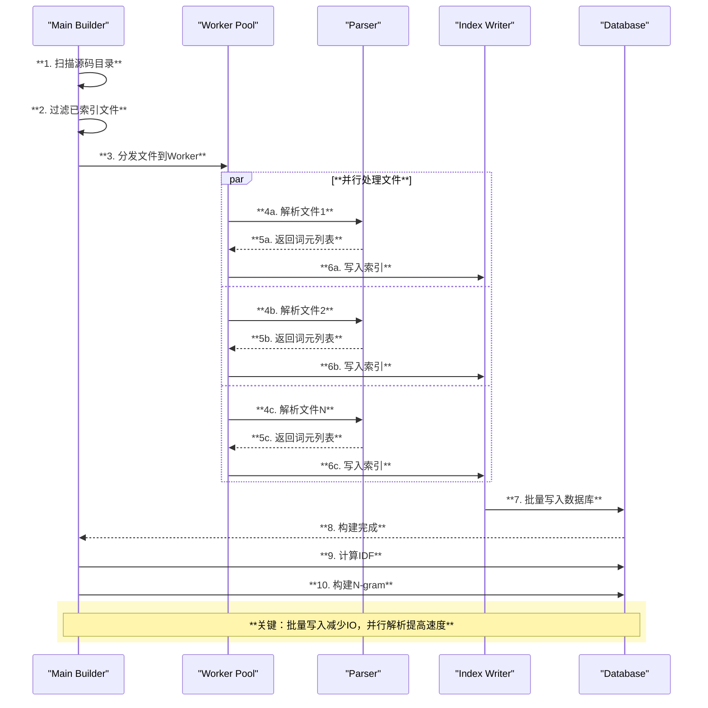
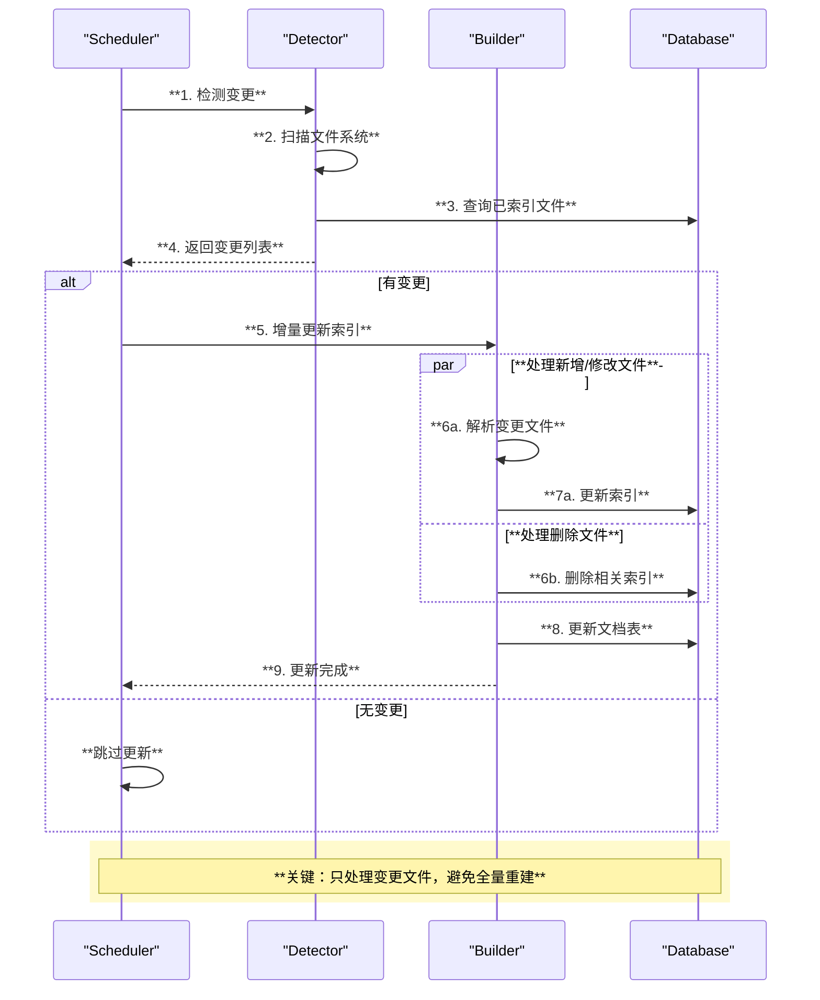

# MySQL内核专家Agent - 索引系统设计

## 1. 索引系统概述

索引系统是MySQL内核专家Agent的核心基础设施，负责对Percona Server源码进行预处理和索引构建，以加速代码搜索和分析。



## 2. 索引生命周期管理

### 2.1 索引初始化策略



### 2.2 索引持久化设计

```go
// IndexPersistence 索引持久化管理器
type IndexPersistence struct {
    version     string                    // 索引版本
    buildTime   time.Time                 // 构建时间
    sourceHash  string                    // 源码目录哈希
    config      *IndexPersistenceConfig
}

type IndexPersistenceConfig struct {
    // 持久化策略
    PersistOnBuild      bool              `yaml:"persist_on_build"`       // 构建后立即持久化
    PersistInterval     time.Duration     `yaml:"persist_interval"`       // 定期持久化间隔
    PersistOnShutdown   bool              `yaml:"persist_on_shutdown"`    // 关闭时持久化
    
    // 索引位置
    LocalPath           string            `yaml:"local_path"`             // 本地存储路径
    RemoteEnabled       bool              `yaml:"remote_enabled"`         // 是否启用远程存储
    RemoteBackend       StorageBackend    `yaml:"remote_backend"`         // 远程存储后端
    
    // 恢复策略
    RecoveryStrategy    RecoveryStrategy  `yaml:"recovery_strategy"`      // 恢复策略
    MaxRecoveryRetries  int               `yaml:"max_recovery_retries"`   // 最大恢复重试次数
}

type RecoveryStrategy string
const (
    RecoveryFromLocal    RecoveryStrategy = "local"      // 从本地恢复
    RecoveryFromRemote   RecoveryStrategy = "remote"     // 从远程恢复
    RecoveryAutoSelect   RecoveryStrategy = "auto"       // 自动选择最新
    RecoveryRebuild      RecoveryStrategy = "rebuild"    // 强制重建
)

// IndexMetadata 索引元数据
type IndexMetadata struct {
    Version         string            `json:"version"`
    BuildTime       time.Time         `json:"build_time"`
    SourcePath      string            `json:"source_path"`
    SourceHash      string            `json:"source_hash"`
    TotalFiles      int               `json:"total_files"`
    TotalFunctions  int               `json:"total_functions"`
    TotalTerms      int               `json:"total_terms"`
    LastUpdateTime  time.Time         `json:"last_update_time"`
    Checksum        string            `json:"checksum"`           // 数据校验和
}

// SaveMetadata 保存元数据
func (p *IndexPersistence) SaveMetadata(meta *IndexMetadata) error {
    data, err := json.MarshalIndent(meta, "", "  ")
    if err != nil {
        return err
    }
    metaPath := filepath.Join(p.config.LocalPath, "index_metadata.json")
    return os.WriteFile(metaPath, data, 0644)
}

// ValidateIndex 验证索引完整性
func (p *IndexPersistence) ValidateIndex() (*ValidationResult, error) {
    result := &ValidationResult{
        Valid: true,
        Errors: make([]string, 0),
    }
    
    // 1. 检查元数据文件
    meta, err := p.LoadMetadata()
    if err != nil {
        result.Valid = false
        result.Errors = append(result.Errors, "metadata file not found or corrupted")
        return result, nil
    }
    
    // 2. 验证数据文件完整性
    if err := p.verifyChecksum(meta.Checksum); err != nil {
        result.Valid = false
        result.Errors = append(result.Errors, fmt.Sprintf("checksum mismatch: %v", err))
    }
    
    // 3. 检查源码目录变更
    currentHash, _ := computeDirHash(meta.SourcePath)
    if currentHash != meta.SourceHash {
        result.NeedsUpdate = true
        result.Warnings = append(result.Warnings, "source directory has changed")
    }
    
    return result, nil
}
```

### 2.3 索引重建命令

```go
// IndexCommand 索引管理命令
type IndexCommand struct {
    indexManager *IndexManager
    config       *Config
}

// RebuildIndex 重建索引
func (c *IndexCommand) RebuildIndex(ctx context.Context, opts *RebuildOptions) error {
    log.Info("Starting index rebuild", "mode", opts.Mode, "force", opts.Force)
    
    switch opts.Mode {
    case RebuildModeFull:
        return c.fullRebuild(ctx, opts)
    case RebuildModeIncremental:
        return c.incrementalRebuild(ctx, opts)
    case RebuildModeSelective:
        return c.selectiveRebuild(ctx, opts)
    default:
        return fmt.Errorf("unknown rebuild mode: %s", opts.Mode)
    }
}

type RebuildOptions struct {
    Mode          RebuildMode     `yaml:"mode"`
    Force         bool            `yaml:"force"`          // 强制重建，忽略缓存
    Modules       []string        `yaml:"modules"`        // 仅重建指定模块
    SkipCallGraph bool            `yaml:"skip_callgraph"` // 跳过调用图构建
    SkipFTS       bool            `yaml:"skip_fts"`       // 跳过全文索引
    Workers       int             `yaml:"workers"`        // 并行工作线程数
}

type RebuildMode string
const (
    RebuildModeFull        RebuildMode = "full"        // 全量重建
    RebuildModeIncremental RebuildMode = "incremental" // 增量更新
    RebuildModeSelective   RebuildMode = "selective"   // 选择性重建
)

func (c *IndexCommand) fullRebuild(ctx context.Context, opts *RebuildOptions) error {
    // 1. 备份当前索引
    if !opts.Force {
        if err := c.backupCurrentIndex(); err != nil {
            log.Warn("Failed to backup current index", "error", err)
        }
    }
    
    // 2. 清空索引
    if err := c.indexManager.Clear(); err != nil {
        return fmt.Errorf("failed to clear index: %w", err)
    }
    
    // 3. 重新构建
    builder := NewIndexBuilder(c.config, opts.Workers)
    if err := builder.Build(ctx, c.config.Source.Path); err != nil {
        // 恢复备份
        c.restoreBackup()
        return fmt.Errorf("failed to build index: %w", err)
    }
    
    // 4. 持久化
    return c.indexManager.Persist()
}
```

## 3. 多存储后端支持

### 3.1 存储后端架构



### 3.2 存储接口定义

```go
// IndexStorage 索引存储接口
type IndexStorage interface {
    // 生命周期
    Init(ctx context.Context) error
    Close() error
    HealthCheck(ctx context.Context) error
    
    // 文档操作
    SaveDocument(ctx context.Context, doc *Document) error
    GetDocument(ctx context.Context, docID int64) (*Document, error)
    DeleteDocument(ctx context.Context, docID int64) error
    ListDocuments(ctx context.Context, filter *DocumentFilter) ([]*Document, error)
    
    // 倒排索引操作
    IndexTerm(ctx context.Context, term string, docID int64, positions []Position) error
    SearchTerm(ctx context.Context, term string) ([]PostingEntry, error)
    DeleteTermIndex(ctx context.Context, docID int64) error
    
    // 函数摘要操作
    SaveFunctionSummary(ctx context.Context, summary *FunctionSummary) error
    GetFunctionSummary(ctx context.Context, funcID string) (*FunctionSummary, error)
    SearchFunctions(ctx context.Context, query *FunctionSearchQuery) ([]*FunctionSummary, error)
    
    // 调用图操作
    SaveCallGraphNode(ctx context.Context, node *CallGraphNode) error
    SaveCallGraphEdge(ctx context.Context, edge *CallGraphEdge) error
    GetCallees(ctx context.Context, funcID string, depth int) (*CallTree, error)
    GetCallers(ctx context.Context, funcID string, depth int) (*CallTree, error)
    
    // 批量操作
    BatchSave(ctx context.Context, batch *IndexBatch) error
    
    // 统计信息
    GetStats(ctx context.Context) (*StorageStats, error)
}

// StorageStats 存储统计
type StorageStats struct {
    TotalDocuments   int64     `json:"total_documents"`
    TotalTerms       int64     `json:"total_terms"`
    TotalFunctions   int64     `json:"total_functions"`
    TotalEdges       int64     `json:"total_edges"`
    StorageSize      int64     `json:"storage_size_bytes"`
    LastUpdateTime   time.Time `json:"last_update_time"`
}
```

### 3.3 存储配置

```go
// StorageConfig 存储配置
type StorageConfig struct {
    // 存储类型选择
    Primary       StorageType       `yaml:"primary"`        // 主存储类型
    Fallback      StorageType       `yaml:"fallback"`       // 备用存储类型
    
    // SQLite配置 (默认本地存储)
    SQLite        *SQLiteConfig     `yaml:"sqlite"`
    
    // BoltDB配置 (默认图存储)
    BoltDB        *BoltDBConfig     `yaml:"boltdb"`
    
    // MySQL配置 (外部存储)
    MySQL         *MySQLConfig      `yaml:"mysql"`
    
    // PostgreSQL配置 (外部存储)
    PostgreSQL    *PostgreSQLConfig `yaml:"postgresql"`
    
    // Redis配置 (缓存/图存储)
    Redis         *RedisConfig      `yaml:"redis"`
    
    // Elasticsearch配置 (全文搜索)
    Elasticsearch *ESConfig         `yaml:"elasticsearch"`
}

type StorageType string
const (
    StorageTypeSQLite        StorageType = "sqlite"
    StorageTypeBoltDB        StorageType = "boltdb"
    StorageTypeMySQL         StorageType = "mysql"
    StorageTypePostgreSQL    StorageType = "postgresql"
    StorageTypeRedis         StorageType = "redis"
    StorageTypeElasticsearch StorageType = "elasticsearch"
)

type SQLiteConfig struct {
    Path            string        `yaml:"path"`
    MaxOpenConns    int           `yaml:"max_open_conns"`
    MaxIdleConns    int           `yaml:"max_idle_conns"`
    ConnMaxLifetime time.Duration `yaml:"conn_max_lifetime"`
    JournalMode     string        `yaml:"journal_mode"`    // DELETE, TRUNCATE, WAL
    SynchronousMode string        `yaml:"synchronous"`     // OFF, NORMAL, FULL
}

type MySQLConfig struct {
    Host            string        `yaml:"host"`
    Port            int           `yaml:"port"`
    User            string        `yaml:"user"`
    Password        string        `yaml:"password"`        // 从环境变量读取
    PasswordEnv     string        `yaml:"password_env"`    // 环境变量名
    Database        string        `yaml:"database"`
    Charset         string        `yaml:"charset"`
    MaxOpenConns    int           `yaml:"max_open_conns"`
    MaxIdleConns    int           `yaml:"max_idle_conns"`
    ConnMaxLifetime time.Duration `yaml:"conn_max_lifetime"`
    TLS             *TLSConfig    `yaml:"tls"`
}

type RedisConfig struct {
    Mode            string        `yaml:"mode"`            // standalone, sentinel, cluster
    Addresses       []string      `yaml:"addresses"`
    Password        string        `yaml:"password"`
    PasswordEnv     string        `yaml:"password_env"`
    Database        int           `yaml:"database"`
    MaxRetries      int           `yaml:"max_retries"`
    PoolSize        int           `yaml:"pool_size"`
    MinIdleConns    int           `yaml:"min_idle_conns"`
    
    // Sentinel配置
    MasterName      string        `yaml:"master_name"`
    
    // TLS配置
    TLS             *TLSConfig    `yaml:"tls"`
}

// NewStorageFromConfig 根据配置创建存储实例
func NewStorageFromConfig(cfg *StorageConfig) (IndexStorage, error) {
    switch cfg.Primary {
    case StorageTypeSQLite:
        return NewSQLiteStorage(cfg.SQLite)
    case StorageTypeMySQL:
        return NewMySQLStorage(cfg.MySQL)
    case StorageTypePostgreSQL:
        return NewPostgreSQLStorage(cfg.PostgreSQL)
    case StorageTypeRedis:
        return NewRedisStorage(cfg.Redis)
    default:
        return nil, fmt.Errorf("unsupported storage type: %s", cfg.Primary)
    }
}
```

### 3.4 MySQL存储实现

```go
// MySQLStorage MySQL存储实现
type MySQLStorage struct {
    db     *sql.DB
    config *MySQLConfig
}

func NewMySQLStorage(cfg *MySQLConfig) (*MySQLStorage, error) {
    password := cfg.Password
    if cfg.PasswordEnv != "" {
        password = os.Getenv(cfg.PasswordEnv)
    }
    
    dsn := fmt.Sprintf("%s:%s@tcp(%s:%d)/%s?charset=%s&parseTime=true",
        cfg.User, password, cfg.Host, cfg.Port, cfg.Database, cfg.Charset)
    
    if cfg.TLS != nil && cfg.TLS.Enabled {
        dsn += "&tls=true"
    }
    
    db, err := sql.Open("mysql", dsn)
    if err != nil {
        return nil, err
    }
    
    db.SetMaxOpenConns(cfg.MaxOpenConns)
    db.SetMaxIdleConns(cfg.MaxIdleConns)
    db.SetConnMaxLifetime(cfg.ConnMaxLifetime)
    
    storage := &MySQLStorage{db: db, config: cfg}
    
    // 初始化表结构
    if err := storage.initSchema(); err != nil {
        return nil, err
    }
    
    return storage, nil
}

func (s *MySQLStorage) initSchema() error {
    schemas := []string{
        `CREATE TABLE IF NOT EXISTS documents (
            doc_id BIGINT PRIMARY KEY AUTO_INCREMENT,
            file_path VARCHAR(1024) UNIQUE NOT NULL,
            file_hash VARCHAR(64) NOT NULL,
            file_size INT,
            line_count INT,
            module VARCHAR(128),
            last_indexed TIMESTAMP DEFAULT CURRENT_TIMESTAMP,
            INDEX idx_module (module),
            INDEX idx_hash (file_hash)
        ) ENGINE=InnoDB DEFAULT CHARSET=utf8mb4`,
        
        `CREATE TABLE IF NOT EXISTS inverted_index (
            term VARCHAR(256) NOT NULL,
            doc_id BIGINT NOT NULL,
            term_frequency INT DEFAULT 1,
            positions JSON,
            PRIMARY KEY (term, doc_id),
            INDEX idx_term (term),
            FOREIGN KEY (doc_id) REFERENCES documents(doc_id) ON DELETE CASCADE
        ) ENGINE=InnoDB DEFAULT CHARSET=utf8mb4`,
        
        `CREATE TABLE IF NOT EXISTS function_summaries (
            id VARCHAR(256) PRIMARY KEY,
            name VARCHAR(256) NOT NULL,
            qualified_name VARCHAR(512),
            file_path VARCHAR(1024) NOT NULL,
            line_start INT,
            line_end INT,
            signature TEXT,
            return_type VARCHAR(256),
            parameters JSON,
            description TEXT,
            tags JSON,
            module VARCHAR(128),
            subsystem VARCHAR(128),
            loc INT,
            complexity INT,
            callers JSON,
            callees JSON,
            stats JSON,
            created_at TIMESTAMP DEFAULT CURRENT_TIMESTAMP,
            updated_at TIMESTAMP DEFAULT CURRENT_TIMESTAMP ON UPDATE CURRENT_TIMESTAMP,
            INDEX idx_name (name),
            INDEX idx_file (file_path),
            INDEX idx_module (module),
            FULLTEXT INDEX ft_search (name, qualified_name, signature, description)
        ) ENGINE=InnoDB DEFAULT CHARSET=utf8mb4`,
    }
    
    for _, schema := range schemas {
        if _, err := s.db.Exec(schema); err != nil {
            return fmt.Errorf("failed to create schema: %w", err)
        }
    }
    
    return nil
}
```

## 4. 倒排索引设计

### 4.1 索引结构



### 4.2 数据库Schema

```sql
-- 文档表 (源码文件)
CREATE TABLE documents (
    doc_id INTEGER PRIMARY KEY AUTOINCREMENT,
    file_path TEXT UNIQUE NOT NULL,
    file_hash TEXT NOT NULL,        -- 文件哈希，用于增量更新
    file_size INTEGER,
    line_count INTEGER,
    module TEXT,                     -- 所属模块
    last_indexed TIMESTAMP DEFAULT CURRENT_TIMESTAMP
);

CREATE INDEX idx_doc_path ON documents(file_path);
CREATE INDEX idx_doc_module ON documents(module);

-- 倒排索引表
CREATE TABLE inverted_index (
    term TEXT NOT NULL,
    doc_id INTEGER NOT NULL,
    term_frequency INTEGER DEFAULT 1,
    positions TEXT,                  -- JSON: [[line, col, len], ...]
    PRIMARY KEY (term, doc_id),
    FOREIGN KEY (doc_id) REFERENCES documents(doc_id)
);

CREATE INDEX idx_term ON inverted_index(term);
CREATE INDEX idx_term_doc ON inverted_index(term, doc_id);

-- 词项统计表
CREATE TABLE term_stats (
    term TEXT PRIMARY KEY,
    document_frequency INTEGER,      -- 包含该词的文档数
    total_frequency INTEGER,         -- 总出现次数
    idf REAL                         -- 逆文档频率
);

-- N-gram索引 (支持子串搜索)
CREATE TABLE ngram_index (
    ngram TEXT NOT NULL,
    term TEXT NOT NULL,
    PRIMARY KEY (ngram, term)
);

CREATE INDEX idx_ngram ON ngram_index(ngram);
```

### 4.3 分词策略

```go
// Tokenizer 分词器接口
type Tokenizer interface {
    Tokenize(content string) []Token
}

// Token 词元
type Token struct {
    Text     string
    Position Position
    Type     TokenType
}

type TokenType int

const (
    TokenWord       TokenType = iota  // 普通单词
    TokenIdentifier                   // 标识符
    TokenKeyword                      // 关键字
    TokenOperator                     // 运算符
    TokenLiteral                      // 字面量
)

// CppTokenizer C++代码分词器
type CppTokenizer struct {
    cppKeywords   map[string]bool
    mysqlKeywords map[string]bool
}

func (t *CppTokenizer) Tokenize(content string) []Token {
    tokens := make([]Token, 0)
    
    // 1. 词法分析
    lexer := NewCppLexer(content)
    for {
        tok := lexer.NextToken()
        if tok.Type == EOF {
            break
        }
        tokens = append(tokens, tok)
    }
    
    // 2. 标识符拆分 (CamelCase, snake_case)
    expanded := make([]Token, 0)
    for _, tok := range tokens {
        if tok.Type == TokenIdentifier {
            expanded = append(expanded, t.expandIdentifier(tok)...)
        } else {
            expanded = append(expanded, tok)
        }
    }
    
    return expanded
}

// expandIdentifier 拆分复合标识符
// mysql_execute_command -> [mysql, execute, command]
// THD -> [THD, thd]
func (t *CppTokenizer) expandIdentifier(tok Token) []Token {
    result := []Token{tok}  // 保留原始
    
    // snake_case拆分
    parts := strings.Split(tok.Text, "_")
    for _, part := range parts {
        if len(part) > 0 {
            result = append(result, Token{
                Text:     strings.ToLower(part),
                Position: tok.Position,
                Type:     TokenWord,
            })
        }
    }
    
    // CamelCase拆分
    camelParts := splitCamelCase(tok.Text)
    for _, part := range camelParts {
        result = append(result, Token{
            Text:     strings.ToLower(part),
            Position: tok.Position,
            Type:     TokenWord,
        })
    }
    
    return result
}
```

### 4.4 索引构建流程



## 5. 函数摘要系统

### 5.1 摘要结构

```go
// FunctionSummary 函数摘要
type FunctionSummary struct {
    ID            string            `json:"id"`
    Name          string            `json:"name"`
    QualifiedName string            `json:"qualified_name"`  // 完整限定名
    FilePath      string            `json:"file_path"`
    LineStart     int               `json:"line_start"`
    LineEnd       int               `json:"line_end"`
    
    // 签名信息
    Signature     string            `json:"signature"`
    ReturnType    string            `json:"return_type"`
    Parameters    []Parameter       `json:"parameters"`
    
    // 语义信息
    Description   string            `json:"description"`     // 从注释提取
    Tags          []string          `json:"tags"`            // 标签: [innodb, lock, critical]
    Module        string            `json:"module"`          // 所属模块
    Subsystem     string            `json:"subsystem"`       // 子系统
    
    // 度量信息
    LOC           int               `json:"loc"`             // 代码行数
    Complexity    int               `json:"complexity"`      // 圈复杂度
    
    // 调用关系
    Callers       []string          `json:"callers"`         // 调用者ID列表
    Callees       []string          `json:"callees"`         // 被调用函数ID列表
    
    // 统计信息 (用于模拟)
    Stats         *FunctionStats    `json:"stats,omitempty"`
}
```

## 6. 增量更新机制

### 6.1 变更检测

```go
// ChangeDetector 变更检测器
type ChangeDetector struct {
    db *sql.DB
}

type FileChange struct {
    FilePath   string
    ChangeType ChangeType
    OldHash    string
    NewHash    string
}

type ChangeType int
const (
    ChangeAdded   ChangeType = iota
    ChangeModified
    ChangeDeleted
)

func (d *ChangeDetector) DetectChanges(sourceDir string) ([]FileChange, error) {
    changes := make([]FileChange, 0)
    
    // 1. 扫描当前文件系统
    currentFiles := make(map[string]string)  // path -> hash
    filepath.Walk(sourceDir, func(path string, info os.FileInfo, err error) error {
        if isCppFile(path) {
            hash := computeFileHash(path)
            currentFiles[path] = hash
        }
        return nil
    })
    
    // 2. 查询已索引文件
    indexedFiles := make(map[string]string)
    rows, _ := d.db.Query("SELECT file_path, file_hash FROM documents")
    for rows.Next() {
        var path, hash string
        rows.Scan(&path, &hash)
        indexedFiles[path] = hash
    }
    
    // 3. 比较差异
    for path, newHash := range currentFiles {
        if oldHash, exists := indexedFiles[path]; !exists {
            changes = append(changes, FileChange{
                FilePath:   path,
                ChangeType: ChangeAdded,
                NewHash:    newHash,
            })
        } else if oldHash != newHash {
            changes = append(changes, FileChange{
                FilePath:   path,
                ChangeType: ChangeModified,
                OldHash:    oldHash,
                NewHash:    newHash,
            })
        }
    }
    
    for path := range indexedFiles {
        if _, exists := currentFiles[path]; !exists {
            changes = append(changes, FileChange{
                FilePath:   path,
                ChangeType: ChangeDeleted,
            })
        }
    }
    
    return changes, nil
}
```

### 6.2 增量更新流程



## 7. 性能优化

### 7.1 缓存策略

| 缓存类型 | 实现 | TTL | 大小限制 |
|----------|------|-----|----------|
| 查询结果缓存 | LRU | 5min | 1000条 |
| 节点数据缓存 | LRU | 10min | 5000条 |
| 路径查询缓存 | LRU | 2min | 500条 |
| 热点函数缓存 | 固定 | 永久 | 100条 |

### 7.2 索引优化

```sql
-- 覆盖索引优化常用查询
CREATE INDEX idx_inverted_covering ON inverted_index(term, doc_id, term_frequency);

-- 部分索引优化高频词
CREATE INDEX idx_high_freq_terms ON term_stats(term) WHERE document_frequency > 100;

-- 分区索引 (按模块)
-- SQLite不支持分区，但可以使用视图模拟
CREATE VIEW innodb_index AS
SELECT i.* FROM inverted_index i
JOIN documents d ON i.doc_id = d.doc_id
WHERE d.module = 'innodb';
```

### 7.3 并行度配置

```go
// IndexConfig 索引配置
type IndexConfig struct {
    // 构建配置
    BuildWorkers     int    // 构建并发数，默认 CPU核数
    BatchSize        int    // 批量写入大小，默认 1000
    
    // 查询配置
    QueryWorkers     int    // 查询并发数，默认 4
    MaxQueryTime     time.Duration  // 最大查询时间，默认 5s
    
    // 缓存配置
    CacheEnabled     bool   // 是否启用缓存
    CacheSize        int    // 缓存大小
    CacheTTL         time.Duration
}

func DefaultIndexConfig() *IndexConfig {
    return &IndexConfig{
        BuildWorkers:  runtime.NumCPU(),
        BatchSize:     1000,
        QueryWorkers:  4,
        MaxQueryTime:  5 * time.Second,
        CacheEnabled:  true,
        CacheSize:     1000,
        CacheTTL:      5 * time.Minute,
    }
}
```
