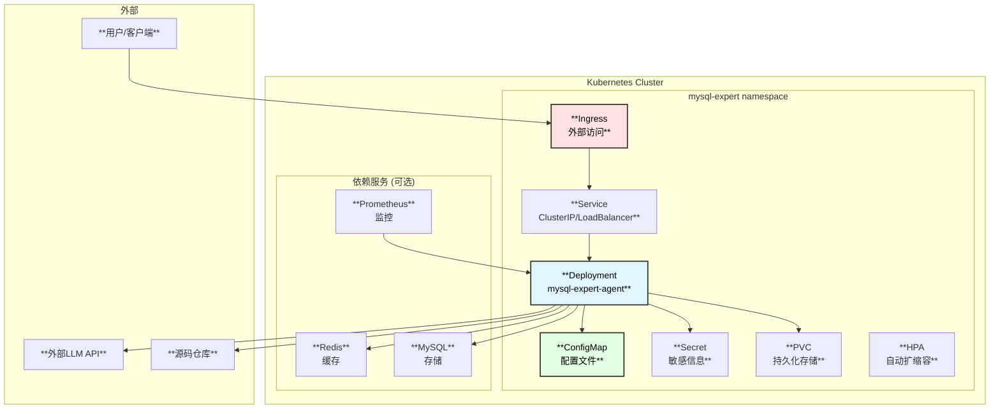

# MySQL内核专家Agent - K8S部署方案设计

## 1. 部署架构概述

支持一键部署到Kubernetes集群，所有配置项外部化，便于在不同环境中部署。



## 2. Helm Chart结构

```
mysql-expert-agent/
├── Chart.yaml
├── values.yaml
├── values-dev.yaml
├── values-staging.yaml
├── values-prod.yaml
├── templates/
│   ├── _helpers.tpl
│   ├── deployment.yaml
│   ├── service.yaml
│   ├── configmap.yaml
│   ├── secret.yaml
│   ├── pvc.yaml
│   ├── ingress.yaml
│   ├── hpa.yaml
│   ├── serviceaccount.yaml
│   ├── role.yaml
│   ├── rolebinding.yaml
│   └── tests/
│       └── test-connection.yaml
└── charts/
    ├── redis/
    └── mysql/
```

## 3. Helm Chart配置

### 3.1 Chart.yaml

```yaml
apiVersion: v2
name: mysql-expert-agent
description: MySQL Kernel Expert Agent - A code analysis and simulation agent
type: application
version: 1.0.0
appVersion: "1.0.0"
keywords:
  - mysql
  - agent
  - llm
  - code-analysis
maintainers:
  - name: Your Team
    email: team@example.com
dependencies:
  - name: redis
    version: "17.x.x"
    repository: "https://charts.bitnami.com/bitnami"
    condition: redis.enabled
  - name: mysql
    version: "9.x.x"
    repository: "https://charts.bitnami.com/bitnami"
    condition: mysql.enabled
```

### 3.2 values.yaml (完整配置)

```yaml
# =====================================================
# MySQL Kernel Expert Agent - Helm Values
# =====================================================

# 全局配置
global:
  imageRegistry: ""
  imagePullSecrets: []
  storageClass: ""

# 基础配置
nameOverride: ""
fullnameOverride: ""

# 镜像配置
image:
  repository: mysql-expert-agent
  tag: "latest"
  pullPolicy: IfNotPresent

# 副本数
replicaCount: 1

# 服务账户
serviceAccount:
  create: true
  annotations: {}
  name: ""

# Pod安全上下文
podSecurityContext:
  fsGroup: 1000

# 容器安全上下文
securityContext:
  runAsNonRoot: true
  runAsUser: 1000
  readOnlyRootFilesystem: true
  allowPrivilegeEscalation: false
  capabilities:
    drop:
      - ALL

# =====================================================
# 服务配置
# =====================================================
service:
  type: ClusterIP
  port: 8080
  
  # 额外端口
  additionalPorts:
    - name: mcp
      port: 8081
      targetPort: 8081
    - name: a2a
      port: 8082
      targetPort: 8082
    - name: ws
      port: 8083
      targetPort: 8083
    - name: metrics
      port: 9090
      targetPort: 9090

# =====================================================
# Ingress配置
# =====================================================
ingress:
  enabled: false
  className: "nginx"
  annotations:
    nginx.ingress.kubernetes.io/proxy-body-size: "100m"
    nginx.ingress.kubernetes.io/proxy-read-timeout: "300"
    nginx.ingress.kubernetes.io/websocket-services: "mysql-expert-agent"
  hosts:
    - host: mysql-expert.example.com
      paths:
        - path: /
          pathType: Prefix
  tls:
    - secretName: mysql-expert-tls
      hosts:
        - mysql-expert.example.com

# =====================================================
# 资源配置
# =====================================================
resources:
  limits:
    cpu: 4000m
    memory: 8Gi
  requests:
    cpu: 500m
    memory: 1Gi

# =====================================================
# 自动扩缩容
# =====================================================
autoscaling:
  enabled: false
  minReplicas: 1
  maxReplicas: 10
  targetCPUUtilizationPercentage: 70
  targetMemoryUtilizationPercentage: 80

# =====================================================
# 健康检查
# =====================================================
livenessProbe:
  httpGet:
    path: /api/v1/health
    port: 8080
  initialDelaySeconds: 30
  periodSeconds: 10
  timeoutSeconds: 5
  failureThreshold: 3

readinessProbe:
  httpGet:
    path: /api/v1/health
    port: 8080
  initialDelaySeconds: 10
  periodSeconds: 5
  timeoutSeconds: 3
  failureThreshold: 3

# =====================================================
# 持久化存储
# =====================================================
persistence:
  enabled: true
  
  # 索引存储
  index:
    enabled: true
    storageClass: ""
    accessModes:
      - ReadWriteOnce
    size: 50Gi
    annotations: {}
  
  # 缓存存储
  cache:
    enabled: true
    storageClass: ""
    accessModes:
      - ReadWriteOnce
    size: 10Gi
    annotations: {}
  
  # 日志存储
  logs:
    enabled: true
    storageClass: ""
    accessModes:
      - ReadWriteOnce
    size: 5Gi
    annotations: {}

# =====================================================
# 源码配置
# =====================================================
source:
  # 源码挂载方式
  type: "pvc"  # pvc | hostPath | nfs | git
  
  # PVC方式
  pvc:
    claimName: "mysql-source-pvc"
    # 或者自动创建
    create: true
    storageClass: ""
    size: 20Gi
  
  # HostPath方式 (开发环境)
  hostPath:
    path: "/data/percona-server"
  
  # NFS方式
  nfs:
    server: "nfs.example.com"
    path: "/exports/percona-server"
  
  # Git方式 (启动时克隆)
  git:
    repository: "https://github.com/percona/percona-server.git"
    branch: "8.0"
    depth: 1
    secretName: "git-credentials"

# =====================================================
# 应用配置
# =====================================================
config:
  # 日志级别
  logLevel: "info"
  logFormat: "json"
  
  # 源码路径 (容器内)
  sourcePath: "/data/source"
  
  # 索引配置
  index:
    path: "/data/index"
    rebuildOnStart: false
    parallelWorkers: 8
    batchSize: 1000
    updateInterval: "1h"
  
  # 缓存配置
  cache:
    l1:
      enabled: true
      maxSize: 10000
      ttl: "5m"
    l2:
      enabled: true
      backend: "redis"  # redis | local
      ttl: "30m"
    l3:
      enabled: true
      dbPath: "/data/cache/query.db"
      ttl: "24h"
  
  # 存储配置
  storage:
    primary: "sqlite"  # sqlite | mysql | postgresql
    sqlite:
      path: "/data/index/mysql_expert.db"
    mysql:
      host: ""
      port: 3306
      database: "mysql_expert"
      # 从Secret读取认证信息
    boltdb:
      path: "/data/index/callgraph.db"
  
  # 统计配置
  stats:
    token:
      enabled: true
      budgetEnabled: true
      dailyBudget: 1000000
      alertThreshold: 0.8
    cache:
      enabled: true
      reportInterval: "5m"
    prometheus:
      enabled: true
      port: 9090
      path: "/metrics"
  
  # Agent配置
  agent:
    maxIterations: 20
    maxConcurrentAgents: 5
    timeout: "5m"
    enableStreaming: true
  
  # 输出配置
  output:
    mode: "document"
    includeDiagrams: true
    includeCodeRefs: true
    outputDir: "/data/output"

# =====================================================
# LLM配置
# =====================================================
llm:
  defaultProvider: "openai"
  defaultModel: "gpt-4-turbo"
  
  providers:
    openai:
      enabled: true
      baseUrl: "https://api.openai.com/v1"
      # apiKey从Secret读取
      timeout: "120s"
      maxRetries: 3
      httpProxy: ""
    
    anthropic:
      enabled: true
      baseUrl: "https://api.anthropic.com"
      timeout: "180s"
    
    qwen:
      enabled: true
      baseUrl: "https://dashscope.aliyuncs.com/api/v1"
      timeout: "60s"
    
    zhipu:
      enabled: true
      baseUrl: "https://open.bigmodel.cn/api/paas/v4"
      timeout: "60s"
    
    deepseek:
      enabled: true
      baseUrl: "https://api.deepseek.com/v1"
      timeout: "60s"
    
    ollama:
      enabled: false
      baseUrl: "http://ollama:11434/api"
      timeout: "300s"
  
  routing:
    enabled: true
    strategy: "smart"

# =====================================================
# Agent交互配置
# =====================================================
agentInteraction:
  # MCP服务器
  mcpServer:
    enabled: true
    transport: "websocket"
    address: ":8081"
  
  # A2A服务器
  a2aServer:
    enabled: true
    address: ":8082"
  
  # REST API
  restServer:
    enabled: true
    address: ":8080"
    basePath: "/api/v1"
    cors:
      enabled: true
      allowOrigins: ["*"]
  
  # WebSocket
  websocketServer:
    enabled: true
    address: ":8083"
    path: "/ws"

# =====================================================
# 密钥配置 (从Secret读取)
# =====================================================
secrets:
  # 创建新的Secret
  create: true
  # 或使用已存在的Secret
  existingSecret: ""
  
  # LLM API Keys (如果create=true)
  llmApiKeys:
    openai: ""      # 或设置 OPENAI_API_KEY 环境变量
    anthropic: ""   # 或设置 ANTHROPIC_API_KEY 环境变量
    qwen: ""        # 或设置 QWEN_API_KEY 环境变量
    zhipu: ""       # 或设置 ZHIPU_API_KEY 环境变量
    deepseek: ""    # 或设置 DEEPSEEK_API_KEY 环境变量
  
  # 数据库密码
  mysql:
    username: ""
    password: ""
  
  # Redis密码
  redis:
    password: ""
  
  # API认证
  apiKeys: []

# =====================================================
# 环境变量 (从ConfigMap/Secret注入)
# =====================================================
env: []
  # - name: CUSTOM_VAR
  #   value: "custom_value"
  # - name: SECRET_VAR
  #   valueFrom:
  #     secretKeyRef:
  #       name: my-secret
  #       key: secret-key

# =====================================================
# 额外环境变量 (从Secret引用)
# =====================================================
envFrom: []
  # - secretRef:
  #     name: extra-secrets

# =====================================================
# Redis子Chart配置
# =====================================================
redis:
  enabled: true
  architecture: standalone
  auth:
    enabled: true
    password: ""  # 设置密码或使用existingSecret
  master:
    persistence:
      enabled: true
      size: 8Gi

# =====================================================
# MySQL子Chart配置 (如果使用MySQL作为存储)
# =====================================================
mysql:
  enabled: false
  auth:
    rootPassword: ""
    database: "mysql_expert"
    username: "mysql_expert"
    password: ""
  primary:
    persistence:
      enabled: true
      size: 20Gi

# =====================================================
# Prometheus监控配置
# =====================================================
serviceMonitor:
  enabled: false
  namespace: ""
  interval: 30s
  scrapeTimeout: 10s
  labels: {}

# =====================================================
# Pod调度配置
# =====================================================
nodeSelector: {}

tolerations: []

affinity: {}

topologySpreadConstraints: []

# =====================================================
# 额外配置
# =====================================================
extraVolumes: []

extraVolumeMounts: []

extraContainers: []

initContainers: []

podAnnotations: {}

podLabels: {}
```

### 3.3 Deployment模板

```yaml
# templates/deployment.yaml
apiVersion: apps/v1
kind: Deployment
metadata:
  name: {{ include "mysql-expert-agent.fullname" . }}
  labels:
    {{- include "mysql-expert-agent.labels" . | nindent 4 }}
spec:
  {{- if not .Values.autoscaling.enabled }}
  replicas: {{ .Values.replicaCount }}
  {{- end }}
  selector:
    matchLabels:
      {{- include "mysql-expert-agent.selectorLabels" . | nindent 6 }}
  template:
    metadata:
      annotations:
        checksum/config: {{ include (print $.Template.BasePath "/configmap.yaml") . | sha256sum }}
        checksum/secret: {{ include (print $.Template.BasePath "/secret.yaml") . | sha256sum }}
        {{- with .Values.podAnnotations }}
        {{- toYaml . | nindent 8 }}
        {{- end }}
      labels:
        {{- include "mysql-expert-agent.selectorLabels" . | nindent 8 }}
        {{- with .Values.podLabels }}
        {{- toYaml . | nindent 8 }}
        {{- end }}
    spec:
      {{- with .Values.global.imagePullSecrets }}
      imagePullSecrets:
        {{- toYaml . | nindent 8 }}
      {{- end }}
      serviceAccountName: {{ include "mysql-expert-agent.serviceAccountName" . }}
      securityContext:
        {{- toYaml .Values.podSecurityContext | nindent 8 }}
      
      {{- if .Values.initContainers }}
      initContainers:
        {{- toYaml .Values.initContainers | nindent 8 }}
      {{- end }}
      
      {{- if eq .Values.source.type "git" }}
      initContainers:
        - name: git-clone
          image: alpine/git:latest
          command:
            - /bin/sh
            - -c
            - |
              if [ ! -d "/data/source/.git" ]; then
                git clone --depth {{ .Values.source.git.depth }} \
                  --branch {{ .Values.source.git.branch }} \
                  {{ .Values.source.git.repository }} /data/source
              else
                cd /data/source && git pull
              fi
          volumeMounts:
            - name: source
              mountPath: /data/source
          {{- if .Values.source.git.secretName }}
          envFrom:
            - secretRef:
                name: {{ .Values.source.git.secretName }}
          {{- end }}
      {{- end }}
      
      containers:
        - name: {{ .Chart.Name }}
          securityContext:
            {{- toYaml .Values.securityContext | nindent 12 }}
          image: "{{ .Values.global.imageRegistry }}{{ .Values.image.repository }}:{{ .Values.image.tag | default .Chart.AppVersion }}"
          imagePullPolicy: {{ .Values.image.pullPolicy }}
          
          ports:
            - name: http
              containerPort: 8080
              protocol: TCP
            - name: mcp
              containerPort: 8081
              protocol: TCP
            - name: a2a
              containerPort: 8082
              protocol: TCP
            - name: ws
              containerPort: 8083
              protocol: TCP
            - name: metrics
              containerPort: 9090
              protocol: TCP
          
          livenessProbe:
            {{- toYaml .Values.livenessProbe | nindent 12 }}
          
          readinessProbe:
            {{- toYaml .Values.readinessProbe | nindent 12 }}
          
          resources:
            {{- toYaml .Values.resources | nindent 12 }}
          
          env:
            - name: CONFIG_PATH
              value: "/etc/mysql-expert/config.yaml"
            # LLM API Keys
            {{- if .Values.llm.providers.openai.enabled }}
            - name: OPENAI_API_KEY
              valueFrom:
                secretKeyRef:
                  name: {{ include "mysql-expert-agent.secretName" . }}
                  key: openai-api-key
            {{- end }}
            {{- if .Values.llm.providers.anthropic.enabled }}
            - name: ANTHROPIC_API_KEY
              valueFrom:
                secretKeyRef:
                  name: {{ include "mysql-expert-agent.secretName" . }}
                  key: anthropic-api-key
            {{- end }}
            {{- if .Values.llm.providers.qwen.enabled }}
            - name: QWEN_API_KEY
              valueFrom:
                secretKeyRef:
                  name: {{ include "mysql-expert-agent.secretName" . }}
                  key: qwen-api-key
            {{- end }}
            {{- if .Values.llm.providers.zhipu.enabled }}
            - name: ZHIPU_API_KEY
              valueFrom:
                secretKeyRef:
                  name: {{ include "mysql-expert-agent.secretName" . }}
                  key: zhipu-api-key
            {{- end }}
            {{- if .Values.llm.providers.deepseek.enabled }}
            - name: DEEPSEEK_API_KEY
              valueFrom:
                secretKeyRef:
                  name: {{ include "mysql-expert-agent.secretName" . }}
                  key: deepseek-api-key
            {{- end }}
            # Redis
            {{- if .Values.redis.enabled }}
            - name: REDIS_PASSWORD
              valueFrom:
                secretKeyRef:
                  name: {{ include "mysql-expert-agent.secretName" . }}
                  key: redis-password
            - name: REDIS_HOST
              value: "{{ include "mysql-expert-agent.fullname" . }}-redis-master"
            {{- end }}
            # MySQL
            {{- if .Values.mysql.enabled }}
            - name: MYSQL_PASSWORD
              valueFrom:
                secretKeyRef:
                  name: {{ include "mysql-expert-agent.secretName" . }}
                  key: mysql-password
            - name: MYSQL_HOST
              value: "{{ include "mysql-expert-agent.fullname" . }}-mysql"
            {{- end }}
            {{- with .Values.env }}
            {{- toYaml . | nindent 12 }}
            {{- end }}
          
          {{- with .Values.envFrom }}
          envFrom:
            {{- toYaml . | nindent 12 }}
          {{- end }}
          
          volumeMounts:
            - name: config
              mountPath: /etc/mysql-expert
              readOnly: true
            - name: source
              mountPath: /data/source
              readOnly: true
            {{- if .Values.persistence.index.enabled }}
            - name: index
              mountPath: /data/index
            {{- end }}
            {{- if .Values.persistence.cache.enabled }}
            - name: cache
              mountPath: /data/cache
            {{- end }}
            {{- if .Values.persistence.logs.enabled }}
            - name: logs
              mountPath: /data/logs
            {{- end }}
            - name: tmp
              mountPath: /tmp
            {{- with .Values.extraVolumeMounts }}
            {{- toYaml . | nindent 12 }}
            {{- end }}
        
        {{- with .Values.extraContainers }}
        {{- toYaml . | nindent 8 }}
        {{- end }}
      
      volumes:
        - name: config
          configMap:
            name: {{ include "mysql-expert-agent.fullname" . }}-config
        
        # 源码卷
        {{- if eq .Values.source.type "pvc" }}
        - name: source
          persistentVolumeClaim:
            claimName: {{ .Values.source.pvc.claimName | default (printf "%s-source" (include "mysql-expert-agent.fullname" .)) }}
        {{- else if eq .Values.source.type "hostPath" }}
        - name: source
          hostPath:
            path: {{ .Values.source.hostPath.path }}
            type: Directory
        {{- else if eq .Values.source.type "nfs" }}
        - name: source
          nfs:
            server: {{ .Values.source.nfs.server }}
            path: {{ .Values.source.nfs.path }}
        {{- else if eq .Values.source.type "git" }}
        - name: source
          emptyDir: {}
        {{- end }}
        
        # 持久化卷
        {{- if .Values.persistence.index.enabled }}
        - name: index
          persistentVolumeClaim:
            claimName: {{ include "mysql-expert-agent.fullname" . }}-index
        {{- else }}
        - name: index
          emptyDir: {}
        {{- end }}
        
        {{- if .Values.persistence.cache.enabled }}
        - name: cache
          persistentVolumeClaim:
            claimName: {{ include "mysql-expert-agent.fullname" . }}-cache
        {{- else }}
        - name: cache
          emptyDir: {}
        {{- end }}
        
        {{- if .Values.persistence.logs.enabled }}
        - name: logs
          persistentVolumeClaim:
            claimName: {{ include "mysql-expert-agent.fullname" . }}-logs
        {{- else }}
        - name: logs
          emptyDir: {}
        {{- end }}
        
        - name: tmp
          emptyDir: {}
        
        {{- with .Values.extraVolumes }}
        {{- toYaml . | nindent 8 }}
        {{- end }}
      
      {{- with .Values.nodeSelector }}
      nodeSelector:
        {{- toYaml . | nindent 8 }}
      {{- end }}
      
      {{- with .Values.affinity }}
      affinity:
        {{- toYaml . | nindent 8 }}
      {{- end }}
      
      {{- with .Values.tolerations }}
      tolerations:
        {{- toYaml . | nindent 8 }}
      {{- end }}
      
      {{- with .Values.topologySpreadConstraints }}
      topologySpreadConstraints:
        {{- toYaml . | nindent 8 }}
      {{- end }}
```

### 3.4 ConfigMap模板

```yaml
# templates/configmap.yaml
apiVersion: v1
kind: ConfigMap
metadata:
  name: {{ include "mysql-expert-agent.fullname" . }}-config
  labels:
    {{- include "mysql-expert-agent.labels" . | nindent 4 }}
data:
  config.yaml: |
    # MySQL Expert Agent Configuration
    # Generated by Helm Chart
    
    # 日志配置
    log:
      level: {{ .Values.config.logLevel | quote }}
      format: {{ .Values.config.logFormat | quote }}
    
    # 源码配置
    source:
      path: {{ .Values.config.sourcePath | quote }}
      include_patterns:
        - "*.cc"
        - "*.h"
        - "*.cpp"
        - "*.hpp"
      exclude_patterns:
        - "*/unittest/*"
        - "*/test/*"
        - "*/mysql-test/*"
    
    # 索引配置
    index:
      path: {{ .Values.config.index.path | quote }}
      rebuild_on_start: {{ .Values.config.index.rebuildOnStart }}
      parallel_workers: {{ .Values.config.index.parallelWorkers }}
      batch_size: {{ .Values.config.index.batchSize }}
      update_interval: {{ .Values.config.index.updateInterval | quote }}
    
    # 缓存配置
    cache:
      l1:
        enabled: {{ .Values.config.cache.l1.enabled }}
        max_size: {{ .Values.config.cache.l1.maxSize }}
        ttl: {{ .Values.config.cache.l1.ttl | quote }}
      l2:
        enabled: {{ .Values.config.cache.l2.enabled }}
        backend: {{ .Values.config.cache.l2.backend | quote }}
        ttl: {{ .Values.config.cache.l2.ttl | quote }}
        {{- if eq .Values.config.cache.l2.backend "redis" }}
        redis:
          addresses:
            - "{{ include "mysql-expert-agent.fullname" . }}-redis-master:6379"
          password_env: "REDIS_PASSWORD"
        {{- end }}
      l3:
        enabled: {{ .Values.config.cache.l3.enabled }}
        db_path: {{ .Values.config.cache.l3.dbPath | quote }}
        ttl: {{ .Values.config.cache.l3.ttl | quote }}
    
    # 存储配置
    storage:
      primary: {{ .Values.config.storage.primary | quote }}
      {{- if eq .Values.config.storage.primary "sqlite" }}
      sqlite:
        path: {{ .Values.config.storage.sqlite.path | quote }}
      {{- end }}
      {{- if eq .Values.config.storage.primary "mysql" }}
      mysql:
        host_env: "MYSQL_HOST"
        port: 3306
        database: "mysql_expert"
        user: "mysql_expert"
        password_env: "MYSQL_PASSWORD"
      {{- end }}
      boltdb:
        path: {{ .Values.config.storage.boltdb.path | quote }}
    
    # 统计配置
    stats:
      token:
        enabled: {{ .Values.config.stats.token.enabled }}
        budget_enabled: {{ .Values.config.stats.token.budgetEnabled }}
        daily_budget: {{ .Values.config.stats.token.dailyBudget }}
        alert_threshold: {{ .Values.config.stats.token.alertThreshold }}
      cache:
        enabled: {{ .Values.config.stats.cache.enabled }}
        report_interval: {{ .Values.config.stats.cache.reportInterval | quote }}
      prometheus:
        enabled: {{ .Values.config.stats.prometheus.enabled }}
        port: {{ .Values.config.stats.prometheus.port }}
        path: {{ .Values.config.stats.prometheus.path | quote }}
    
    # Agent配置
    agent:
      max_iterations: {{ .Values.config.agent.maxIterations }}
      max_concurrent_agents: {{ .Values.config.agent.maxConcurrentAgents }}
      timeout: {{ .Values.config.agent.timeout | quote }}
      enable_streaming: {{ .Values.config.agent.enableStreaming }}
    
    # 输出配置
    output:
      mode: {{ .Values.config.output.mode | quote }}
      include_diagrams: {{ .Values.config.output.includeDiagrams }}
      include_code_refs: {{ .Values.config.output.includeCodeRefs }}
      output_dir: {{ .Values.config.output.outputDir | quote }}
    
    # LLM配置
    llm:
      default_provider: {{ .Values.llm.defaultProvider | quote }}
      default_model: {{ .Values.llm.defaultModel | quote }}
      
      providers:
        {{- if .Values.llm.providers.openai.enabled }}
        openai:
          enabled: true
          base_url: {{ .Values.llm.providers.openai.baseUrl | quote }}
          api_key_env: "OPENAI_API_KEY"
          timeout: {{ .Values.llm.providers.openai.timeout | quote }}
          max_retries: {{ .Values.llm.providers.openai.maxRetries }}
          {{- if .Values.llm.providers.openai.httpProxy }}
          http_proxy: {{ .Values.llm.providers.openai.httpProxy | quote }}
          {{- end }}
        {{- end }}
        
        {{- if .Values.llm.providers.anthropic.enabled }}
        anthropic:
          enabled: true
          base_url: {{ .Values.llm.providers.anthropic.baseUrl | quote }}
          api_key_env: "ANTHROPIC_API_KEY"
          timeout: {{ .Values.llm.providers.anthropic.timeout | quote }}
        {{- end }}
        
        {{- if .Values.llm.providers.qwen.enabled }}
        qwen:
          enabled: true
          base_url: {{ .Values.llm.providers.qwen.baseUrl | quote }}
          api_key_env: "QWEN_API_KEY"
          timeout: {{ .Values.llm.providers.qwen.timeout | quote }}
        {{- end }}
        
        {{- if .Values.llm.providers.zhipu.enabled }}
        zhipu:
          enabled: true
          base_url: {{ .Values.llm.providers.zhipu.baseUrl | quote }}
          api_key_env: "ZHIPU_API_KEY"
          timeout: {{ .Values.llm.providers.zhipu.timeout | quote }}
        {{- end }}
        
        {{- if .Values.llm.providers.deepseek.enabled }}
        deepseek:
          enabled: true
          base_url: {{ .Values.llm.providers.deepseek.baseUrl | quote }}
          api_key_env: "DEEPSEEK_API_KEY"
          timeout: {{ .Values.llm.providers.deepseek.timeout | quote }}
        {{- end }}
        
        {{- if .Values.llm.providers.ollama.enabled }}
        ollama:
          enabled: true
          base_url: {{ .Values.llm.providers.ollama.baseUrl | quote }}
          timeout: {{ .Values.llm.providers.ollama.timeout | quote }}
        {{- end }}
      
      routing:
        enabled: {{ .Values.llm.routing.enabled }}
        strategy: {{ .Values.llm.routing.strategy | quote }}
    
    # Agent交互配置
    agent_interaction:
      mcp_server:
        enabled: {{ .Values.agentInteraction.mcpServer.enabled }}
        transport: {{ .Values.agentInteraction.mcpServer.transport | quote }}
        address: {{ .Values.agentInteraction.mcpServer.address | quote }}
      
      a2a_server:
        enabled: {{ .Values.agentInteraction.a2aServer.enabled }}
        address: {{ .Values.agentInteraction.a2aServer.address | quote }}
      
      rest_server:
        enabled: {{ .Values.agentInteraction.restServer.enabled }}
        address: {{ .Values.agentInteraction.restServer.address | quote }}
        base_path: {{ .Values.agentInteraction.restServer.basePath | quote }}
        cors:
          enabled: {{ .Values.agentInteraction.restServer.cors.enabled }}
          allow_origins:
            {{- toYaml .Values.agentInteraction.restServer.cors.allowOrigins | nindent 12 }}
      
      websocket_server:
        enabled: {{ .Values.agentInteraction.websocketServer.enabled }}
        address: {{ .Values.agentInteraction.websocketServer.address | quote }}
        path: {{ .Values.agentInteraction.websocketServer.path | quote }}
```

## 4. 一键部署脚本

### 4.1 部署脚本

```bash
#!/bin/bash
# deploy.sh - MySQL Expert Agent 一键部署脚本

set -e

# 颜色输出
RED='\033[0;31m'
GREEN='\033[0;32m'
YELLOW='\033[1;33m'
NC='\033[0m'

log_info() {
    echo -e "${GREEN}[INFO]${NC} $1"
}

log_warn() {
    echo -e "${YELLOW}[WARN]${NC} $1"
}

log_error() {
    echo -e "${RED}[ERROR]${NC} $1"
}

# 默认配置
NAMESPACE="mysql-expert"
RELEASE_NAME="mysql-expert"
CHART_PATH="./helm/mysql-expert-agent"
VALUES_FILE=""
DRY_RUN=false

# 解析参数
while [[ $# -gt 0 ]]; do
    case $1 in
        -n|--namespace)
            NAMESPACE="$2"
            shift 2
            ;;
        -r|--release)
            RELEASE_NAME="$2"
            shift 2
            ;;
        -f|--values)
            VALUES_FILE="$2"
            shift 2
            ;;
        --dry-run)
            DRY_RUN=true
            shift
            ;;
        -h|--help)
            echo "Usage: $0 [OPTIONS]"
            echo ""
            echo "Options:"
            echo "  -n, --namespace NAMESPACE    Kubernetes namespace (default: mysql-expert)"
            echo "  -r, --release RELEASE        Helm release name (default: mysql-expert)"
            echo "  -f, --values FILE            Custom values file"
            echo "      --dry-run                Simulate installation"
            echo "  -h, --help                   Show this help"
            exit 0
            ;;
        *)
            log_error "Unknown option: $1"
            exit 1
            ;;
    esac
done

# 检查依赖
check_dependencies() {
    log_info "Checking dependencies..."
    
    if ! command -v kubectl &> /dev/null; then
        log_error "kubectl is not installed"
        exit 1
    fi
    
    if ! command -v helm &> /dev/null; then
        log_error "helm is not installed"
        exit 1
    fi
    
    # 检查kubectl连接
    if ! kubectl cluster-info &> /dev/null; then
        log_error "Cannot connect to Kubernetes cluster"
        exit 1
    fi
    
    log_info "All dependencies are satisfied"
}

# 创建命名空间
create_namespace() {
    log_info "Creating namespace: $NAMESPACE"
    
    if kubectl get namespace "$NAMESPACE" &> /dev/null; then
        log_warn "Namespace $NAMESPACE already exists"
    else
        kubectl create namespace "$NAMESPACE"
    fi
}

# 检查API Keys
check_api_keys() {
    log_info "Checking API keys..."
    
    local missing_keys=()
    
    if [ -z "$OPENAI_API_KEY" ]; then
        missing_keys+=("OPENAI_API_KEY")
    fi
    
    if [ ${#missing_keys[@]} -gt 0 ]; then
        log_warn "Missing API keys: ${missing_keys[*]}"
        log_warn "You can set them as environment variables or in the values file"
    fi
}

# 部署
deploy() {
    log_info "Deploying MySQL Expert Agent..."
    
    local helm_cmd="helm upgrade --install $RELEASE_NAME $CHART_PATH"
    helm_cmd+=" --namespace $NAMESPACE"
    helm_cmd+=" --create-namespace"
    
    # 添加自定义values文件
    if [ -n "$VALUES_FILE" ]; then
        helm_cmd+=" -f $VALUES_FILE"
    fi
    
    # 设置API Keys
    if [ -n "$OPENAI_API_KEY" ]; then
        helm_cmd+=" --set secrets.llmApiKeys.openai=$OPENAI_API_KEY"
    fi
    if [ -n "$ANTHROPIC_API_KEY" ]; then
        helm_cmd+=" --set secrets.llmApiKeys.anthropic=$ANTHROPIC_API_KEY"
    fi
    if [ -n "$QWEN_API_KEY" ]; then
        helm_cmd+=" --set secrets.llmApiKeys.qwen=$QWEN_API_KEY"
    fi
    if [ -n "$ZHIPU_API_KEY" ]; then
        helm_cmd+=" --set secrets.llmApiKeys.zhipu=$ZHIPU_API_KEY"
    fi
    if [ -n "$DEEPSEEK_API_KEY" ]; then
        helm_cmd+=" --set secrets.llmApiKeys.deepseek=$DEEPSEEK_API_KEY"
    fi
    
    if [ "$DRY_RUN" = true ]; then
        helm_cmd+=" --dry-run"
        log_info "Dry run mode enabled"
    fi
    
    log_info "Running: $helm_cmd"
    eval "$helm_cmd"
}

# 等待部署完成
wait_for_ready() {
    if [ "$DRY_RUN" = true ]; then
        return
    fi
    
    log_info "Waiting for deployment to be ready..."
    
    kubectl rollout status deployment/"$RELEASE_NAME" \
        -n "$NAMESPACE" \
        --timeout=300s
    
    log_info "Deployment is ready!"
}

# 显示访问信息
show_access_info() {
    if [ "$DRY_RUN" = true ]; then
        return
    fi
    
    log_info "Access information:"
    echo ""
    echo "REST API:"
    echo "  kubectl port-forward svc/$RELEASE_NAME 8080:8080 -n $NAMESPACE"
    echo "  curl http://localhost:8080/api/v1/health"
    echo ""
    echo "MCP Server:"
    echo "  kubectl port-forward svc/$RELEASE_NAME 8081:8081 -n $NAMESPACE"
    echo ""
    echo "WebSocket:"
    echo "  kubectl port-forward svc/$RELEASE_NAME 8083:8083 -n $NAMESPACE"
    echo ""
    echo "Metrics:"
    echo "  kubectl port-forward svc/$RELEASE_NAME 9090:9090 -n $NAMESPACE"
    echo ""
}

# 主函数
main() {
    log_info "Starting MySQL Expert Agent deployment..."
    
    check_dependencies
    check_api_keys
    create_namespace
    deploy
    wait_for_ready
    show_access_info
    
    log_info "Deployment completed successfully!"
}

main
```

### 4.2 卸载脚本

```bash
#!/bin/bash
# uninstall.sh - 卸载脚本

set -e

NAMESPACE="${1:-mysql-expert}"
RELEASE_NAME="${2:-mysql-expert}"

echo "Uninstalling MySQL Expert Agent..."
echo "Namespace: $NAMESPACE"
echo "Release: $RELEASE_NAME"

# 卸载Helm release
helm uninstall "$RELEASE_NAME" -n "$NAMESPACE" || true

# 删除PVC (可选)
read -p "Delete PVCs? (y/N): " delete_pvcs
if [[ "$delete_pvcs" =~ ^[Yy]$ ]]; then
    kubectl delete pvc -l app.kubernetes.io/instance="$RELEASE_NAME" -n "$NAMESPACE" || true
fi

# 删除命名空间 (可选)
read -p "Delete namespace $NAMESPACE? (y/N): " delete_ns
if [[ "$delete_ns" =~ ^[Yy]$ ]]; then
    kubectl delete namespace "$NAMESPACE" || true
fi

echo "Uninstall completed!"
```

## 5. 环境配置示例

### 5.1 开发环境

```yaml
# values-dev.yaml
replicaCount: 1

resources:
  limits:
    cpu: 2000m
    memory: 4Gi
  requests:
    cpu: 200m
    memory: 512Mi

persistence:
  index:
    size: 10Gi
  cache:
    size: 2Gi

source:
  type: "hostPath"
  hostPath:
    path: "/Users/dev/percona-server"

config:
  logLevel: "debug"
  index:
    rebuildOnStart: true

llm:
  providers:
    ollama:
      enabled: true
      baseUrl: "http://host.docker.internal:11434/api"

redis:
  enabled: false

mysql:
  enabled: false
```

### 5.2 生产环境

```yaml
# values-prod.yaml
replicaCount: 3

resources:
  limits:
    cpu: 8000m
    memory: 16Gi
  requests:
    cpu: 2000m
    memory: 4Gi

autoscaling:
  enabled: true
  minReplicas: 3
  maxReplicas: 10

persistence:
  index:
    storageClass: "fast-ssd"
    size: 100Gi
  cache:
    storageClass: "fast-ssd"
    size: 20Gi

ingress:
  enabled: true
  className: "nginx"
  annotations:
    cert-manager.io/cluster-issuer: "letsencrypt-prod"
  hosts:
    - host: mysql-expert.prod.example.com
      paths:
        - path: /
          pathType: Prefix
  tls:
    - secretName: mysql-expert-tls
      hosts:
        - mysql-expert.prod.example.com

config:
  logLevel: "info"
  stats:
    token:
      dailyBudget: 10000000
      alertThreshold: 0.9

redis:
  enabled: true
  architecture: replication
  replica:
    replicaCount: 2
  master:
    persistence:
      size: 16Gi

serviceMonitor:
  enabled: true
  labels:
    release: prometheus
```
