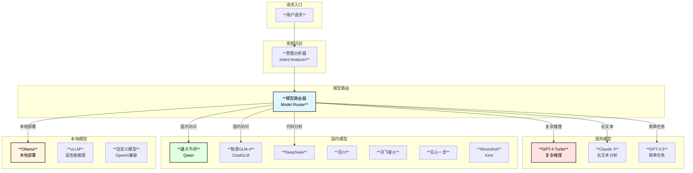

# MySQL内核专家Agent - 大模型支持设计

## 1. 大模型支持概述

支持国内外主流大模型以及本地部署模型，并提供智能路由机制，根据任务类型和复杂度自动选择最优模型。



## 2. 模型配置设计

### 2.1 模型配置结构

```go
// LLMConfig 大模型配置
type LLMConfig struct {
    // 默认模型
    DefaultModel      string                    `yaml:"default_model"`
    DefaultProvider   string                    `yaml:"default_provider"`
    
    // 模型提供商配置
    Providers         map[string]*ProviderConfig `yaml:"providers"`
    
    // 模型路由配置
    Routing           *RoutingConfig            `yaml:"routing"`
    
    // 回退配置
    Fallback          *FallbackConfig           `yaml:"fallback"`
    
    // 限流配置
    RateLimiting      *RateLimitConfig          `yaml:"rate_limiting"`
}

// ProviderConfig 提供商配置
type ProviderConfig struct {
    Name              string                    `yaml:"name"`
    Type              ProviderType              `yaml:"type"`
    Enabled           bool                      `yaml:"enabled"`
    Priority          int                       `yaml:"priority"`          // 优先级 (越小越高)
    
    // API配置
    BaseURL           string                    `yaml:"base_url"`
    APIKey            string                    `yaml:"api_key"`
    APIKeyEnv         string                    `yaml:"api_key_env"`       // 从环境变量读取
    APIVersion        string                    `yaml:"api_version"`
    Organization      string                    `yaml:"organization"`
    
    // 模型列表
    Models            map[string]*ModelConfig   `yaml:"models"`
    
    // 请求配置
    Timeout           time.Duration             `yaml:"timeout"`
    MaxRetries        int                       `yaml:"max_retries"`
    RetryDelay        time.Duration             `yaml:"retry_delay"`
    
    // HTTP代理
    HTTPProxy         string                    `yaml:"http_proxy"`
    
    // TLS配置
    TLS               *TLSConfig                `yaml:"tls"`
    
    // 自定义请求头
    Headers           map[string]string         `yaml:"headers"`
}

type ProviderType string
const (
    ProviderTypeOpenAI      ProviderType = "openai"
    ProviderTypeAnthropic   ProviderType = "anthropic"
    ProviderTypeAzure       ProviderType = "azure"
    ProviderTypeQwen        ProviderType = "qwen"
    ProviderTypeZhipu       ProviderType = "zhipu"
    ProviderTypeDeepSeek    ProviderType = "deepseek"
    ProviderTypeBaichuan    ProviderType = "baichuan"
    ProviderTypeSpark       ProviderType = "spark"
    ProviderTypeErnie       ProviderType = "ernie"
    ProviderTypeMoonshot    ProviderType = "moonshot"
    ProviderTypeOllama      ProviderType = "ollama"
    ProviderTypeVLLM        ProviderType = "vllm"
    ProviderTypeCustom      ProviderType = "custom"
)

// ModelConfig 模型配置
type ModelConfig struct {
    Name              string            `yaml:"name"`
    DisplayName       string            `yaml:"display_name"`
    Description       string            `yaml:"description"`
    Enabled           bool              `yaml:"enabled"`
    
    // 模型能力
    Capabilities      []ModelCapability `yaml:"capabilities"`
    MaxContextLength  int               `yaml:"max_context_length"`
    MaxOutputLength   int               `yaml:"max_output_length"`
    
    // 默认参数
    Temperature       float64           `yaml:"temperature"`
    TopP              float64           `yaml:"top_p"`
    PresencePenalty   float64           `yaml:"presence_penalty"`
    FrequencyPenalty  float64           `yaml:"frequency_penalty"`
    
    // 成本配置 (USD per 1K tokens)
    InputCost         float64           `yaml:"input_cost_per_1k"`
    OutputCost        float64           `yaml:"output_cost_per_1k"`
    
    // 适用场景
    UseCases          []string          `yaml:"use_cases"`
    
    // 性能指标
    AvgLatency        time.Duration     `yaml:"avg_latency"`        // 预估延迟
    QualityScore      float64           `yaml:"quality_score"`      // 质量评分 0-1
}

type ModelCapability string
const (
    CapabilityChat            ModelCapability = "chat"
    CapabilityCompletion      ModelCapability = "completion"
    CapabilityCodeGeneration  ModelCapability = "code_generation"
    CapabilityCodeAnalysis    ModelCapability = "code_analysis"
    CapabilityReasoning       ModelCapability = "reasoning"
    CapabilityLongContext     ModelCapability = "long_context"
    CapabilityToolUse         ModelCapability = "tool_use"
    CapabilityVision          ModelCapability = "vision"
    CapabilityStreaming       ModelCapability = "streaming"
)
```

### 2.2 完整配置示例

```yaml
llm:
  default_model: "gpt-4-turbo"
  default_provider: "openai"
  
  providers:
    # OpenAI
    openai:
      name: "OpenAI"
      type: "openai"
      enabled: true
      priority: 1
      base_url: "https://api.openai.com/v1"
      api_key_env: "OPENAI_API_KEY"
      timeout: 120s
      max_retries: 3
      retry_delay: 1s
      http_proxy: ""  # 可选代理
      
      models:
        gpt-4-turbo:
          name: "gpt-4-turbo"
          display_name: "GPT-4 Turbo"
          enabled: true
          capabilities: [chat, code_generation, code_analysis, reasoning, tool_use, long_context]
          max_context_length: 128000
          max_output_length: 4096
          temperature: 0.1
          input_cost_per_1k: 0.01
          output_cost_per_1k: 0.03
          use_cases: [complex_reasoning, architecture_analysis]
          
        gpt-4o:
          name: "gpt-4o"
          display_name: "GPT-4o"
          enabled: true
          capabilities: [chat, code_generation, code_analysis, reasoning, tool_use, vision]
          max_context_length: 128000
          max_output_length: 16384
          temperature: 0.1
          input_cost_per_1k: 0.005
          output_cost_per_1k: 0.015
          use_cases: [general, code_review]
          
        gpt-3.5-turbo:
          name: "gpt-3.5-turbo"
          display_name: "GPT-3.5 Turbo"
          enabled: true
          capabilities: [chat, code_generation, tool_use]
          max_context_length: 16384
          max_output_length: 4096
          temperature: 0.1
          input_cost_per_1k: 0.0005
          output_cost_per_1k: 0.0015
          use_cases: [simple_query, quick_lookup]
    
    # Anthropic Claude
    anthropic:
      name: "Anthropic"
      type: "anthropic"
      enabled: true
      priority: 2
      base_url: "https://api.anthropic.com"
      api_key_env: "ANTHROPIC_API_KEY"
      timeout: 180s
      
      models:
        claude-3-opus:
          name: "claude-3-opus-20240229"
          display_name: "Claude 3 Opus"
          enabled: true
          capabilities: [chat, code_analysis, reasoning, long_context]
          max_context_length: 200000
          max_output_length: 4096
          temperature: 0.1
          input_cost_per_1k: 0.015
          output_cost_per_1k: 0.075
          use_cases: [deep_analysis, long_document]
          
        claude-3-sonnet:
          name: "claude-3-sonnet-20240229"
          display_name: "Claude 3 Sonnet"
          enabled: true
          capabilities: [chat, code_analysis, reasoning]
          max_context_length: 200000
          max_output_length: 4096
          temperature: 0.1
          input_cost_per_1k: 0.003
          output_cost_per_1k: 0.015
          use_cases: [code_review, documentation]
    
    # 通义千问
    qwen:
      name: "阿里通义千问"
      type: "qwen"
      enabled: true
      priority: 3
      base_url: "https://dashscope.aliyuncs.com/api/v1"
      api_key_env: "QWEN_API_KEY"
      timeout: 60s
      
      models:
        qwen-turbo:
          name: "qwen-turbo"
          display_name: "通义千问Turbo"
          enabled: true
          capabilities: [chat, code_generation, tool_use]
          max_context_length: 8000
          temperature: 0.1
          input_cost_per_1k: 0.002
          output_cost_per_1k: 0.006
          use_cases: [general, quick_query]
          
        qwen-plus:
          name: "qwen-plus"
          display_name: "通义千问Plus"
          enabled: true
          capabilities: [chat, code_generation, reasoning, tool_use]
          max_context_length: 32000
          temperature: 0.1
          input_cost_per_1k: 0.004
          output_cost_per_1k: 0.012
          use_cases: [complex_task, code_analysis]
          
        qwen-max:
          name: "qwen-max"
          display_name: "通义千问Max"
          enabled: true
          capabilities: [chat, code_generation, reasoning, tool_use, long_context]
          max_context_length: 30000
          temperature: 0.1
          input_cost_per_1k: 0.02
          output_cost_per_1k: 0.06
          use_cases: [deep_reasoning, architecture]
    
    # 智谱AI
    zhipu:
      name: "智谱AI"
      type: "zhipu"
      enabled: true
      priority: 3
      base_url: "https://open.bigmodel.cn/api/paas/v4"
      api_key_env: "ZHIPU_API_KEY"
      
      models:
        glm-4:
          name: "glm-4"
          display_name: "GLM-4"
          enabled: true
          capabilities: [chat, code_generation, reasoning, tool_use]
          max_context_length: 128000
          temperature: 0.1
          input_cost_per_1k: 0.01
          output_cost_per_1k: 0.01
          use_cases: [general, code_analysis]
          
        glm-4-air:
          name: "glm-4-air"
          display_name: "GLM-4 Air"
          enabled: true
          capabilities: [chat, code_generation]
          max_context_length: 128000
          temperature: 0.1
          input_cost_per_1k: 0.001
          output_cost_per_1k: 0.001
          use_cases: [simple_query, quick_lookup]
    
    # DeepSeek
    deepseek:
      name: "DeepSeek"
      type: "deepseek"
      enabled: true
      priority: 2
      base_url: "https://api.deepseek.com/v1"
      api_key_env: "DEEPSEEK_API_KEY"
      
      models:
        deepseek-chat:
          name: "deepseek-chat"
          display_name: "DeepSeek Chat"
          enabled: true
          capabilities: [chat, code_generation, code_analysis, reasoning]
          max_context_length: 64000
          temperature: 0.1
          input_cost_per_1k: 0.0014
          output_cost_per_1k: 0.0028
          use_cases: [code_analysis, code_generation]
          
        deepseek-coder:
          name: "deepseek-coder"
          display_name: "DeepSeek Coder"
          enabled: true
          capabilities: [code_generation, code_analysis]
          max_context_length: 64000
          temperature: 0.1
          input_cost_per_1k: 0.0014
          output_cost_per_1k: 0.0028
          use_cases: [code_generation, code_review]
    
    # 百川
    baichuan:
      name: "百川智能"
      type: "baichuan"
      enabled: true
      priority: 4
      base_url: "https://api.baichuan-ai.com/v1"
      api_key_env: "BAICHUAN_API_KEY"
      
      models:
        baichuan2-turbo:
          name: "Baichuan2-Turbo"
          display_name: "百川2 Turbo"
          enabled: true
          capabilities: [chat, code_generation]
          max_context_length: 32000
          temperature: 0.1
          input_cost_per_1k: 0.008
          output_cost_per_1k: 0.008
    
    # 讯飞星火
    spark:
      name: "讯飞星火"
      type: "spark"
      enabled: true
      priority: 4
      base_url: "wss://spark-api.xf-yun.com"
      api_key_env: "SPARK_API_KEY"
      headers:
        app_id: "${SPARK_APP_ID}"
        api_secret: "${SPARK_API_SECRET}"
      
      models:
        spark-v3.5:
          name: "generalv3.5"
          display_name: "星火V3.5"
          enabled: true
          capabilities: [chat, code_generation]
          max_context_length: 8000
          temperature: 0.5
    
    # 文心一言
    ernie:
      name: "百度文心"
      type: "ernie"
      enabled: true
      priority: 4
      base_url: "https://aip.baidubce.com"
      api_key_env: "ERNIE_API_KEY"
      headers:
        secret_key: "${ERNIE_SECRET_KEY}"
      
      models:
        ernie-4.0:
          name: "completions_pro"
          display_name: "文心4.0"
          enabled: true
          capabilities: [chat, code_generation, reasoning]
          max_context_length: 8000
          temperature: 0.1
    
    # Moonshot (Kimi)
    moonshot:
      name: "月之暗面"
      type: "moonshot"
      enabled: true
      priority: 3
      base_url: "https://api.moonshot.cn/v1"
      api_key_env: "MOONSHOT_API_KEY"
      
      models:
        moonshot-v1-8k:
          name: "moonshot-v1-8k"
          display_name: "Moonshot 8K"
          enabled: true
          capabilities: [chat, code_generation]
          max_context_length: 8000
          temperature: 0.3
          
        moonshot-v1-32k:
          name: "moonshot-v1-32k"
          display_name: "Moonshot 32K"
          enabled: true
          capabilities: [chat, code_generation, long_context]
          max_context_length: 32000
          temperature: 0.3
          
        moonshot-v1-128k:
          name: "moonshot-v1-128k"
          display_name: "Moonshot 128K"
          enabled: true
          capabilities: [chat, code_generation, long_context]
          max_context_length: 128000
          temperature: 0.3
    
    # Ollama本地部署
    ollama:
      name: "Ollama"
      type: "ollama"
      enabled: true
      priority: 10
      base_url: "http://localhost:11434/api"
      timeout: 300s
      
      models:
        codellama:
          name: "codellama:13b"
          display_name: "CodeLlama 13B"
          enabled: true
          capabilities: [code_generation, code_analysis]
          max_context_length: 16384
          temperature: 0.1
          input_cost_per_1k: 0
          output_cost_per_1k: 0
          
        llama3:
          name: "llama3:8b"
          display_name: "Llama 3 8B"
          enabled: true
          capabilities: [chat, code_generation]
          max_context_length: 8192
          temperature: 0.1
          
        qwen2:
          name: "qwen2:7b"
          display_name: "Qwen2 7B"
          enabled: true
          capabilities: [chat, code_generation]
          max_context_length: 32768
          temperature: 0.1
    
    # vLLM高性能推理
    vllm:
      name: "vLLM"
      type: "vllm"
      enabled: false
      priority: 10
      base_url: "http://localhost:8000/v1"
      timeout: 300s
      
      models:
        custom-model:
          name: "custom-model"
          display_name: "Custom Model"
          enabled: true
          capabilities: [chat, code_generation]
          max_context_length: 8192
  
  # 模型路由配置
  routing:
    enabled: true
    strategy: "smart"  # simple | cost_optimized | quality_first | smart
    
    # 场景到模型的映射
    scene_mapping:
      complex_reasoning:
        preferred: ["gpt-4-turbo", "claude-3-opus", "qwen-max"]
        fallback: ["gpt-4o", "deepseek-chat"]
      
      code_analysis:
        preferred: ["deepseek-coder", "gpt-4-turbo", "claude-3-sonnet"]
        fallback: ["qwen-plus", "glm-4"]
      
      simple_query:
        preferred: ["gpt-3.5-turbo", "qwen-turbo", "glm-4-air"]
        fallback: ["deepseek-chat"]
      
      long_document:
        preferred: ["claude-3-opus", "moonshot-v1-128k", "glm-4"]
        fallback: ["gpt-4-turbo"]
      
      code_generation:
        preferred: ["deepseek-coder", "gpt-4-turbo", "claude-3-sonnet"]
        fallback: ["qwen-plus", "codellama"]
    
    # 基于内容长度的路由
    context_length_routing:
      - max_length: 4000
        models: ["gpt-3.5-turbo", "qwen-turbo"]
      - max_length: 16000
        models: ["gpt-4o", "qwen-plus", "deepseek-chat"]
      - max_length: 128000
        models: ["gpt-4-turbo", "claude-3-opus", "moonshot-v1-128k"]
  
  # 回退配置
  fallback:
    enabled: true
    max_attempts: 3
    delay_between_attempts: 1s
    
    # 全局回退链
    fallback_chain:
      - "gpt-4-turbo"
      - "claude-3-sonnet"
      - "deepseek-chat"
      - "qwen-plus"
      - "codellama"  # 本地模型作为最后手段
  
  # 限流配置
  rate_limiting:
    enabled: true
    
    # 全局限流
    global:
      requests_per_minute: 100
      tokens_per_minute: 100000
    
    # 按提供商限流
    per_provider:
      openai:
        requests_per_minute: 60
        tokens_per_minute: 90000
      anthropic:
        requests_per_minute: 50
        tokens_per_minute: 100000
      qwen:
        requests_per_minute: 100
        tokens_per_minute: 100000
```

## 3. 模型路由实现

### 3.1 路由器接口

```go
// ModelRouter 模型路由器
type ModelRouter struct {
    config     *RoutingConfig
    providers  map[string]*ProviderClient
    stats      *RouterStats
    limiter    *RateLimiter
    mu         sync.RWMutex
}

// RoutingConfig 路由配置
type RoutingConfig struct {
    Enabled         bool                           `yaml:"enabled"`
    Strategy        RoutingStrategy                `yaml:"strategy"`
    SceneMapping    map[string]*SceneModels        `yaml:"scene_mapping"`
    ContextRouting  []*ContextLengthRule           `yaml:"context_length_routing"`
}

type RoutingStrategy string
const (
    RoutingStrategySimple        RoutingStrategy = "simple"         // 使用默认模型
    RoutingStrategyCostOptimized RoutingStrategy = "cost_optimized" // 成本优先
    RoutingStrategyQualityFirst  RoutingStrategy = "quality_first"  // 质量优先
    RoutingStrategySmart         RoutingStrategy = "smart"          // 智能路由
)

type SceneModels struct {
    Preferred []string `yaml:"preferred"`
    Fallback  []string `yaml:"fallback"`
}

type ContextLengthRule struct {
    MaxLength int      `yaml:"max_length"`
    Models    []string `yaml:"models"`
}

// RouteRequest 路由请求
type RouteRequest struct {
    Scene           string            // 场景: complex_reasoning, code_analysis等
    ContentLength   int               // 内容长度 (估计token数)
    RequiredCaps    []ModelCapability // 必需能力
    PreferredModel  string            // 偏好模型 (可选)
    MaxCost         float64           // 最大成本预算 (可选)
    MaxLatency      time.Duration     // 最大延迟 (可选)
}

// RouteResult 路由结果
type RouteResult struct {
    Provider     string
    Model        string
    ModelConfig  *ModelConfig
    Reason       string
}

func NewModelRouter(config *LLMConfig) (*ModelRouter, error) {
    router := &ModelRouter{
        config:    config.Routing,
        providers: make(map[string]*ProviderClient),
        stats:     &RouterStats{},
        limiter:   NewRateLimiter(config.RateLimiting),
    }
    
    // 初始化提供商客户端
    for name, providerConfig := range config.Providers {
        if !providerConfig.Enabled {
            continue
        }
        
        client, err := NewProviderClient(providerConfig)
        if err != nil {
            log.Warn("Failed to create provider client", "provider", name, "error", err)
            continue
        }
        router.providers[name] = client
    }
    
    return router, nil
}

// Route 路由到最优模型
func (r *ModelRouter) Route(ctx context.Context, req *RouteRequest) (*RouteResult, error) {
    if !r.config.Enabled {
        return r.simpleRoute(req)
    }
    
    switch r.config.Strategy {
    case RoutingStrategySimple:
        return r.simpleRoute(req)
    case RoutingStrategyCostOptimized:
        return r.costOptimizedRoute(req)
    case RoutingStrategyQualityFirst:
        return r.qualityFirstRoute(req)
    case RoutingStrategySmart:
        return r.smartRoute(ctx, req)
    default:
        return r.simpleRoute(req)
    }
}

// simpleRoute 简单路由 - 使用偏好或默认模型
func (r *ModelRouter) simpleRoute(req *RouteRequest) (*RouteResult, error) {
    if req.PreferredModel != "" {
        if result := r.findModel(req.PreferredModel); result != nil {
            return result, nil
        }
    }
    
    // 使用默认模型
    return r.findModel(r.config.DefaultModel)
}

// costOptimizedRoute 成本优化路由
func (r *ModelRouter) costOptimizedRoute(req *RouteRequest) (*RouteResult, error) {
    candidates := r.getCandidates(req)
    
    if len(candidates) == 0 {
        return nil, ErrNoAvailableModel
    }
    
    // 按成本排序
    sort.Slice(candidates, func(i, j int) bool {
        costI := candidates[i].ModelConfig.InputCost + candidates[i].ModelConfig.OutputCost
        costJ := candidates[j].ModelConfig.InputCost + candidates[j].ModelConfig.OutputCost
        return costI < costJ
    })
    
    return candidates[0], nil
}

// qualityFirstRoute 质量优先路由
func (r *ModelRouter) qualityFirstRoute(req *RouteRequest) (*RouteResult, error) {
    candidates := r.getCandidates(req)
    
    if len(candidates) == 0 {
        return nil, ErrNoAvailableModel
    }
    
    // 按质量评分排序
    sort.Slice(candidates, func(i, j int) bool {
        return candidates[i].ModelConfig.QualityScore > candidates[j].ModelConfig.QualityScore
    })
    
    return candidates[0], nil
}

// smartRoute 智能路由
func (r *ModelRouter) smartRoute(ctx context.Context, req *RouteRequest) (*RouteResult, error) {
    // 1. 根据场景获取推荐模型
    var preferredModels []string
    if sceneModels, ok := r.config.SceneMapping[req.Scene]; ok {
        preferredModels = sceneModels.Preferred
    }
    
    // 2. 根据内容长度过滤
    var lengthCompatible []string
    for _, rule := range r.config.ContextRouting {
        if req.ContentLength <= rule.MaxLength {
            lengthCompatible = rule.Models
            break
        }
    }
    
    // 3. 获取交集
    candidates := r.intersectModels(preferredModels, lengthCompatible)
    
    // 4. 过滤掉不可用的模型
    available := make([]*RouteResult, 0)
    for _, modelName := range candidates {
        result := r.findModel(modelName)
        if result == nil {
            continue
        }
        
        // 检查能力
        if !r.hasCapabilities(result.ModelConfig, req.RequiredCaps) {
            continue
        }
        
        // 检查限流
        if !r.limiter.Allow(result.Provider) {
            continue
        }
        
        // 检查健康状态
        if !r.isHealthy(result.Provider, result.Model) {
            continue
        }
        
        available = append(available, result)
    }
    
    if len(available) == 0 {
        // 使用回退链
        return r.fallbackRoute(req)
    }
    
    // 5. 综合评分选择最优
    best := r.selectBest(available, req)
    r.stats.RecordRoute(best.Provider, best.Model, req.Scene)
    
    return best, nil
}

// selectBest 综合评分选择最优模型
func (r *ModelRouter) selectBest(candidates []*RouteResult, req *RouteRequest) *RouteResult {
    type scored struct {
        result *RouteResult
        score  float64
    }
    
    scored_candidates := make([]scored, len(candidates))
    
    for i, c := range candidates {
        score := 0.0
        
        // 质量分 (权重 0.4)
        score += c.ModelConfig.QualityScore * 0.4
        
        // 成本分 (权重 0.3，成本越低分越高)
        maxCost := 0.1 // 假设最大成本
        costNorm := 1.0 - (c.ModelConfig.InputCost+c.ModelConfig.OutputCost)/(maxCost*2)
        score += costNorm * 0.3
        
        // 延迟分 (权重 0.2，延迟越低分越高)
        maxLatency := 10.0 // 秒
        latencyNorm := 1.0 - c.ModelConfig.AvgLatency.Seconds()/maxLatency
        score += latencyNorm * 0.2
        
        // 优先级分 (权重 0.1)
        provider := r.providers[c.Provider]
        priorityNorm := 1.0 - float64(provider.config.Priority)/10.0
        score += priorityNorm * 0.1
        
        scored_candidates[i] = scored{result: c, score: score}
    }
    
    sort.Slice(scored_candidates, func(i, j int) bool {
        return scored_candidates[i].score > scored_candidates[j].score
    })
    
    return scored_candidates[0].result
}

// fallbackRoute 回退路由
func (r *ModelRouter) fallbackRoute(req *RouteRequest) (*RouteResult, error) {
    fallbackChain := r.config.Fallback.FallbackChain
    
    for _, modelName := range fallbackChain {
        result := r.findModel(modelName)
        if result == nil {
            continue
        }
        
        if r.limiter.Allow(result.Provider) && r.isHealthy(result.Provider, result.Model) {
            result.Reason = "fallback"
            return result, nil
        }
    }
    
    return nil, ErrNoAvailableModel
}
```

### 3.2 提供商客户端

```go
// ProviderClient 提供商客户端
type ProviderClient struct {
    config      *ProviderConfig
    httpClient  *http.Client
    rateLimiter *rate.Limiter
    healthy     atomic.Bool
}

// ChatCompletion 聊天补全
func (c *ProviderClient) ChatCompletion(ctx context.Context, req *ChatRequest) (*ChatResponse, error) {
    switch c.config.Type {
    case ProviderTypeOpenAI:
        return c.openAIChatCompletion(ctx, req)
    case ProviderTypeAnthropic:
        return c.anthropicChatCompletion(ctx, req)
    case ProviderTypeQwen:
        return c.qwenChatCompletion(ctx, req)
    case ProviderTypeZhipu:
        return c.zhipuChatCompletion(ctx, req)
    case ProviderTypeDeepSeek:
        return c.deepseekChatCompletion(ctx, req)
    case ProviderTypeOllama:
        return c.ollamaChatCompletion(ctx, req)
    default:
        return c.openAICompatibleChatCompletion(ctx, req)
    }
}

// ChatRequest 聊天请求
type ChatRequest struct {
    Model       string          `json:"model"`
    Messages    []Message       `json:"messages"`
    Temperature float64         `json:"temperature,omitempty"`
    MaxTokens   int             `json:"max_tokens,omitempty"`
    Stream      bool            `json:"stream,omitempty"`
    Tools       []Tool          `json:"tools,omitempty"`
    ToolChoice  interface{}     `json:"tool_choice,omitempty"`
}

type Message struct {
    Role       string          `json:"role"`
    Content    string          `json:"content"`
    ToolCalls  []ToolCall      `json:"tool_calls,omitempty"`
    ToolCallID string          `json:"tool_call_id,omitempty"`
}

// ChatResponse 聊天响应
type ChatResponse struct {
    ID                string      `json:"id"`
    Model             string      `json:"model"`
    Choices           []Choice    `json:"choices"`
    Usage             Usage       `json:"usage"`
    Created           int64       `json:"created"`
}

type Choice struct {
    Index        int      `json:"index"`
    Message      Message  `json:"message"`
    FinishReason string   `json:"finish_reason"`
}

type Usage struct {
    PromptTokens     int `json:"prompt_tokens"`
    CompletionTokens int `json:"completion_tokens"`
    TotalTokens      int `json:"total_tokens"`
}
```

## 4. 模型健康检查

```go
// HealthChecker 健康检查器
type HealthChecker struct {
    router     *ModelRouter
    interval   time.Duration
    timeout    time.Duration
    healthMap  sync.Map  // map[providerModel]bool
}

func NewHealthChecker(router *ModelRouter) *HealthChecker {
    checker := &HealthChecker{
        router:   router,
        interval: 30 * time.Second,
        timeout:  5 * time.Second,
    }
    
    go checker.run()
    return checker
}

func (c *HealthChecker) run() {
    ticker := time.NewTicker(c.interval)
    defer ticker.Stop()
    
    for range ticker.C {
        c.checkAll()
    }
}

func (c *HealthChecker) checkAll() {
    for name, client := range c.router.providers {
        for modelName := range client.config.Models {
            key := fmt.Sprintf("%s:%s", name, modelName)
            healthy := c.checkModel(client, modelName)
            c.healthMap.Store(key, healthy)
            
            if !healthy {
                log.Warn("Model unhealthy", "provider", name, "model", modelName)
            }
        }
    }
}

func (c *HealthChecker) checkModel(client *ProviderClient, model string) bool {
    ctx, cancel := context.WithTimeout(context.Background(), c.timeout)
    defer cancel()
    
    // 发送简单的健康检查请求
    req := &ChatRequest{
        Model: model,
        Messages: []Message{
            {Role: "user", Content: "hello"},
        },
        MaxTokens: 1,
    }
    
    _, err := client.ChatCompletion(ctx, req)
    return err == nil
}

func (c *HealthChecker) IsHealthy(provider, model string) bool {
    key := fmt.Sprintf("%s:%s", provider, model)
    if v, ok := c.healthMap.Load(key); ok {
        return v.(bool)
    }
    return true // 默认健康
}
```

## 5. 限流实现

```go
// RateLimiter 限流器
type RateLimiter struct {
    config      *RateLimitConfig
    global      *rate.Limiter
    perProvider map[string]*ProviderLimiter
    mu          sync.RWMutex
}

type ProviderLimiter struct {
    requests *rate.Limiter
    tokens   *rate.Limiter
}

func NewRateLimiter(config *RateLimitConfig) *RateLimiter {
    rl := &RateLimiter{
        config:      config,
        perProvider: make(map[string]*ProviderLimiter),
    }
    
    if config.Enabled {
        rl.global = rate.NewLimiter(
            rate.Limit(config.Global.RequestsPerMinute)/60,
            config.Global.RequestsPerMinute,
        )
        
        for provider, limits := range config.PerProvider {
            rl.perProvider[provider] = &ProviderLimiter{
                requests: rate.NewLimiter(
                    rate.Limit(limits.RequestsPerMinute)/60,
                    limits.RequestsPerMinute,
                ),
                tokens: rate.NewLimiter(
                    rate.Limit(limits.TokensPerMinute)/60,
                    limits.TokensPerMinute,
                ),
            }
        }
    }
    
    return rl
}

// Allow 检查是否允许请求
func (rl *RateLimiter) Allow(provider string) bool {
    if !rl.config.Enabled {
        return true
    }
    
    // 全局限流
    if !rl.global.Allow() {
        return false
    }
    
    // 提供商限流
    rl.mu.RLock()
    limiter, ok := rl.perProvider[provider]
    rl.mu.RUnlock()
    
    if ok && !limiter.requests.Allow() {
        return false
    }
    
    return true
}

// ConsumeTokens 消耗Token配额
func (rl *RateLimiter) ConsumeTokens(provider string, tokens int) bool {
    if !rl.config.Enabled {
        return true
    }
    
    rl.mu.RLock()
    limiter, ok := rl.perProvider[provider]
    rl.mu.RUnlock()
    
    if !ok {
        return true
    }
    
    return limiter.tokens.AllowN(time.Now(), tokens)
}
```
