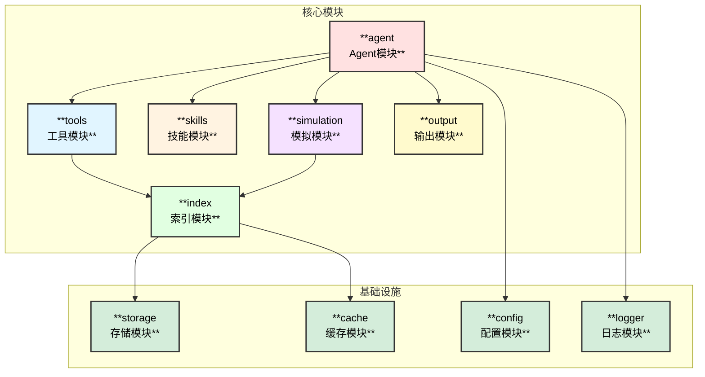
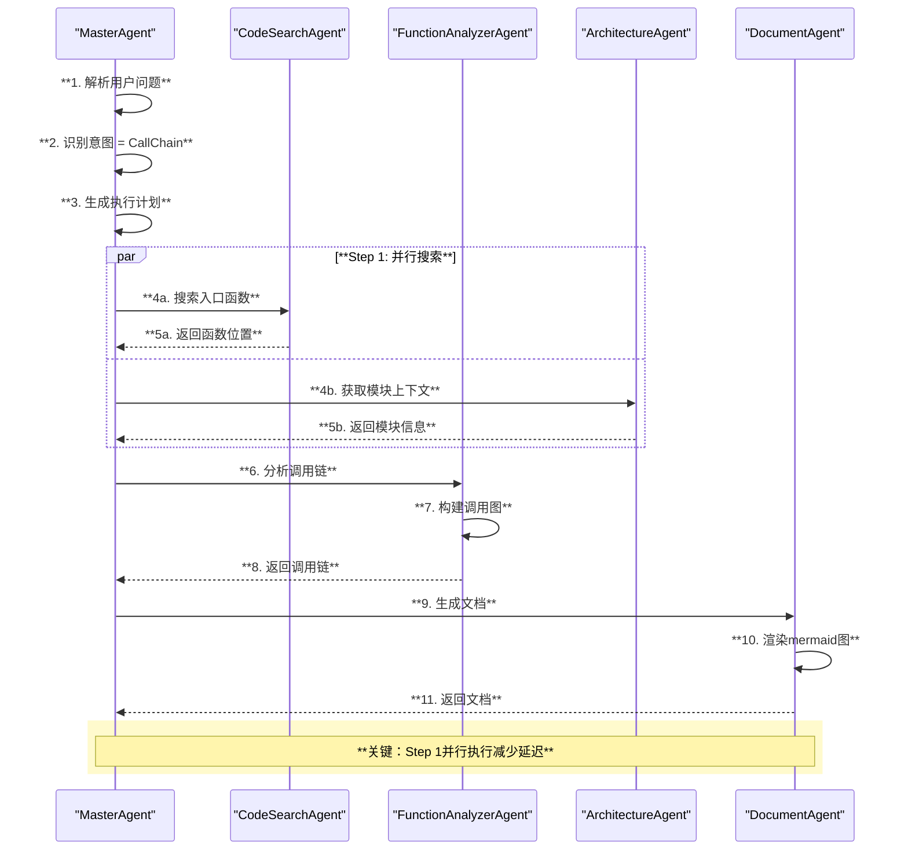
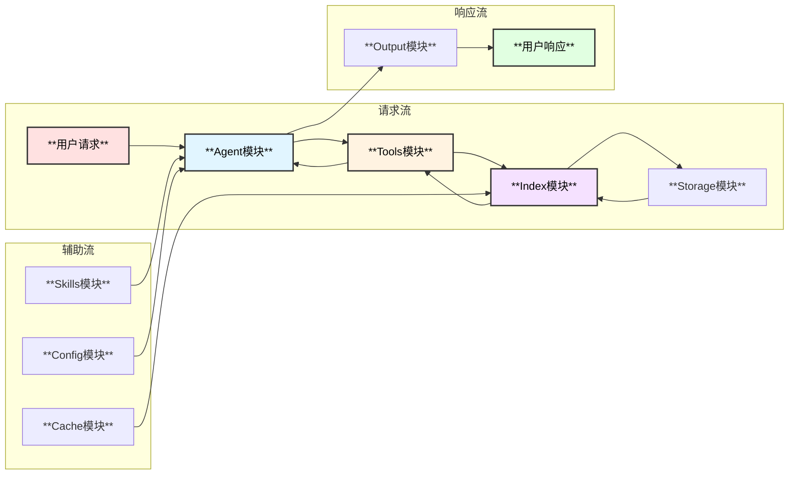

# MySQL内核专家Agent - 模块设计

## 1. 模块总览



## 2. Agent模块 (`agent/`)

### 2.1 模块结构

```
agent/
├── master/             # 主控Agent
│   ├── master.go       # MasterAgent实现
│   ├── intent.go       # 意图识别
│   └── planner.go      # 任务规划
├── search/             # 代码搜索Agent
│   └── search_agent.go
├── analyzer/           # 函数分析Agent
│   └── function_agent.go
├── architect/          # 架构分析Agent
│   └── architecture_agent.go
├── simulator/          # 模拟Agent
│   └── simulation_agent.go
├── document/           # 文档生成Agent
│   └── document_agent.go
└── factory.go          # Agent工厂
```

### 2.2 MasterAgent 设计

```go
// MasterAgent 主控Agent，协调所有子Agent
type MasterAgent struct {
    name        string
    description string
    chatModel   model.ToolCallingChatModel
    subAgents   []adk.Agent
    config      *MasterConfig
}

type MasterConfig struct {
    SourcePath    string                    // 源码路径
    IndexPath     string                    // 索引路径
    OutputMode    OutputMode                // 输出模式
    MaxConcurrent int                       // 最大并发数
    Middlewares   []adk.AgentMiddleware     // 中间件
}

// 意图类型
type IntentType int
const (
    IntentCodeSearch    IntentType = iota  // 代码搜索
    IntentExplain                          // 原理解释
    IntentCallChain                        // 调用链分析
    IntentPerformance                      // 性能分析
    IntentSimulation                       // 负载模拟
    IntentArchitecture                     // 架构理解
)

// 规划结果
type ExecutionPlan struct {
    Intent      IntentType
    Steps       []PlanStep
    Parallel    bool           // 是否可并行
    Priority    int
}

type PlanStep struct {
    AgentName   string
    Task        string
    DependsOn   []string       // 依赖的步骤
    Timeout     time.Duration
}
```

### 2.3 SubAgent 接口设计

```go
// SubAgent 子Agent接口
type SubAgent interface {
    adk.Agent
    
    // CanHandle 判断是否能处理该意图
    CanHandle(ctx context.Context, intent IntentType) bool
    
    // GetCapabilities 返回Agent能力描述
    GetCapabilities() []string
}

// CodeSearchAgent 代码搜索Agent
type CodeSearchAgent struct {
    *adk.ChatModelAgent
    grepTool    *GrepTool
    indexTool   *IndexSearchTool
    skillBackend skill.Backend
}

// FunctionAnalyzerAgent 函数分析Agent
type FunctionAnalyzerAgent struct {
    *adk.ChatModelAgent
    symbolTool    *SymbolLookupTool
    callGraphTool *CallGraphTool
}

// ArchitectureAgent 架构分析Agent
type ArchitectureAgent struct {
    *adk.ChatModelAgent
    moduleGraph *ModuleGraph
}

// SimulationAgent 模拟Agent
type SimulationAgent struct {
    *adk.ChatModelAgent
    statsTool    *StatsTool
    callGraph    *CallGraph
    simEngine    *SimulationEngine
}
```

### 2.4 Agent协作流程



## 3. 索引模块 (`index/`)

### 3.1 模块结构

```
index/
├── builder/            # 索引构建器
│   ├── builder.go      # 主构建器
│   ├── parser.go       # 代码解析器
│   └── worker.go       # 并行Worker
├── inverted/           # 倒排索引
│   ├── index.go        # 倒排索引实现
│   └── tokenizer.go    # 分词器
├── summary/            # 函数摘要
│   ├── extractor.go    # 摘要提取器
│   └── summary.go      # 摘要存储
├── callgraph/          # 调用图
│   ├── graph.go        # 图数据结构
│   ├── builder.go      # 图构建器
│   └── query.go        # 图查询
├── symbol/             # 符号表
│   ├── table.go        # 符号表实现
│   └── scope.go        # 作用域管理
└── storage/            # 存储适配
    ├── sqlite.go       # SQLite存储
    └── boltdb.go       # BoltDB存储
```

### 3.2 倒排索引设计

```go
// InvertedIndex 倒排索引
type InvertedIndex struct {
    db        *sql.DB
    tokenizer Tokenizer
}

// 索引记录
type IndexRecord struct {
    Term      string      // 词项
    DocID     string      // 文档ID (文件路径)
    Positions []Position  // 出现位置
    TF        float64     // 词频
}

type Position struct {
    Line   int
    Column int
    Length int
}

// 查询接口
func (idx *InvertedIndex) Search(query string, opts SearchOptions) ([]SearchResult, error)
func (idx *InvertedIndex) SearchWithContext(query string, contextLines int) ([]SearchResult, error)
func (idx *InvertedIndex) SearchInFiles(query string, filePatterns []string) ([]SearchResult, error)
```

### 3.3 函数摘要设计

```go
// FunctionSummary 函数摘要
type FunctionSummary struct {
    ID          string            // 函数唯一标识
    Name        string            // 函数名
    FilePath    string            // 文件路径
    LineStart   int               // 起始行
    LineEnd     int               // 结束行
    Signature   string            // 函数签名
    Parameters  []Parameter       // 参数列表
    ReturnType  string            // 返回类型
    Description string            // 函数描述 (从注释提取)
    Complexity  int               // 圈复杂度
    Callers     []string          // 调用者列表
    Callees     []string          // 被调用函数列表
    Tags        map[string]string // 标签 (如: subsystem, hotpath等)
}

// FunctionSummaryStore 函数摘要存储
type FunctionSummaryStore interface {
    Add(summary *FunctionSummary) error
    Get(id string) (*FunctionSummary, error)
    Search(query FunctionQuery) ([]*FunctionSummary, error)
    ListByFile(filePath string) ([]*FunctionSummary, error)
    ListByModule(module string) ([]*FunctionSummary, error)
}

// FunctionQuery 函数查询
type FunctionQuery struct {
    NamePattern  string     // 名称模式
    FilePattern  string     // 文件模式
    Module       string     // 所属模块
    HasCallers   []string   // 必须有这些调用者
    HasCallees   []string   // 必须调用这些函数
    Tags         map[string]string
}
```

### 3.4 调用图设计

```go
// CallGraph 函数调用图
type CallGraph struct {
    db       *bolt.DB
    nodes    map[string]*FunctionNode
    edges    map[string][]*CallEdge
}

type FunctionNode struct {
    ID       string
    Name     string
    FilePath string
    Line     int
    Module   string
    Stats    *FunctionStats  // 统计信息 (用于模拟)
}

type FunctionStats struct {
    AvgExecTime   time.Duration  // 平均执行时间
    CallCount     int64          // 调用次数
    MemAlloc      int64          // 内存分配
    IOOps         int64          // IO操作次数
    LockContention float64       // 锁竞争度
}

type CallEdge struct {
    CallerID string
    CalleeID string
    CallSite Position  // 调用位置
    Frequency int64    // 调用频率 (用于模拟)
    IsAsync   bool     // 是否异步调用
}

// CallGraph 查询接口
func (g *CallGraph) GetCallees(funcID string, depth int) ([]*FunctionNode, error)
func (g *CallGraph) GetCallers(funcID string, depth int) ([]*FunctionNode, error)
func (g *CallGraph) FindPath(fromID, toID string) ([][]*FunctionNode, error)
func (g *CallGraph) GetSubgraph(rootID string, depth int) (*CallGraph, error)
func (g *CallGraph) TopologicalSort() ([]*FunctionNode, error)
```

## 4. 工具模块 (`tools/`)

### 4.1 模块结构

```
tools/
├── grep/               # Grep工具
│   ├── grep.go         # 主实现
│   └── ripgrep.go      # ripgrep封装
├── index_search/       # 索引搜索工具
│   └── search.go
├── symbol/             # 符号查找工具
│   └── lookup.go
├── callgraph/          # 调用图工具
│   └── graph_tool.go
├── stats/              # 统计信息工具
│   └── stats_tool.go
└── factory.go          # 工具工厂
```

### 4.2 GrepTool 设计

```go
// GrepTool 代码搜索工具
type GrepTool struct {
    sourcePath string
    ripgrepPath string
    maxResults int
    concurrent int
}

type GrepOptions struct {
    Pattern       string   // 搜索模式
    FileTypes     []string // 文件类型 [cc, h, cpp]
    IgnoreDirs    []string // 忽略目录
    CaseSensitive bool
    WholeWord     bool
    ContextLines  int      // 上下文行数
    MaxResults    int
}

type GrepResult struct {
    FilePath    string
    Line        int
    Column      int
    Content     string
    Context     []string  // 上下文
    MatchLength int
}

func (t *GrepTool) Info(ctx context.Context) (*schema.ToolInfo, error) {
    return &schema.ToolInfo{
        Name: "grep_code",
        Desc: "Search code in MySQL source using pattern matching",
        ParamsOneOf: schema.NewParamsOneOfByParams(map[string]*schema.ParameterInfo{
            "pattern": {Type: schema.String, Required: true, Desc: "Search pattern (regex supported)"},
            "file_types": {Type: schema.Array, Desc: "File extensions to search"},
            "context": {Type: schema.Integer, Desc: "Context lines"},
        }),
    }, nil
}
```

### 4.3 CallGraphTool 设计

```go
// CallGraphTool 调用图分析工具
type CallGraphTool struct {
    graph *index.CallGraph
}

type CallGraphQuery struct {
    FunctionName string   // 目标函数名
    Direction    string   // callers | callees | both
    MaxDepth     int      // 最大深度
    FilterModules []string // 过滤模块
}

type CallChainResult struct {
    Root     *FunctionNode
    Chains   []CallChain
    Diagram  string        // Mermaid图表
}

type CallChain struct {
    Functions []*FunctionNode
    Depth     int
}

func (t *CallGraphTool) Info(ctx context.Context) (*schema.ToolInfo, error) {
    return &schema.ToolInfo{
        Name: "call_graph",
        Desc: "Analyze function call graph in MySQL source",
        ParamsOneOf: schema.NewParamsOneOfByParams(map[string]*schema.ParameterInfo{
            "function": {Type: schema.String, Required: true, Desc: "Function name to analyze"},
            "direction": {Type: schema.String, Desc: "Direction: callers, callees, both"},
            "depth": {Type: schema.Integer, Desc: "Max depth to traverse"},
        }),
    }, nil
}
```

## 5. 技能模块 (`skills/`)

### 5.1 模块结构

```
skills/
├── backend.go          # Skill Backend实现
├── loader.go           # Skill加载器
├── mysql/              # MySQL专用Skills
│   ├── innodb.md       # InnoDB相关
│   ├── replication.md  # 复制相关
│   ├── parser.md       # SQL解析相关
│   ├── optimizer.md    # 优化器相关
│   ├── executor.md     # 执行器相关
│   └── storage.md      # 存储引擎相关
└── templates/          # 模板Skills
    ├── callchain.md    # 调用链分析模板
    └── performance.md  # 性能分析模板
```

### 5.2 Skill 定义格式

```yaml
---
name: innodb_transaction
description: InnoDB事务处理相关的代码搜索技能
---

## 核心文件位置
- storage/innobase/trx/ - 事务管理
- storage/innobase/lock/ - 锁管理
- storage/innobase/log/ - 日志管理

## 关键函数
- trx_start_low - 事务启动
- trx_commit - 事务提交
- trx_rollback - 事务回滚
- lock_table - 表锁
- lock_rec_lock - 行锁

## 搜索模式
- 事务开始: "trx_start|trx_begin"
- 事务提交: "trx_commit|trx_flush"
- 锁获取: "lock_table|lock_rec"

## 常见问题
- 死锁检测: 查找 lock_deadlock_check
- 锁等待: 查找 lock_wait
```

### 5.3 SkillBackend 实现

```go
// MySQLSkillBackend MySQL专用Skill后端
type MySQLSkillBackend struct {
    skillDir  string
    cache     map[string]*skill.Skill
    templates map[string]*template.Template
}

func (b *MySQLSkillBackend) List(ctx context.Context) ([]skill.FrontMatter, error) {
    // 返回所有可用的MySQL Skills
}

func (b *MySQLSkillBackend) Get(ctx context.Context, name string) (skill.Skill, error) {
    // 返回指定的Skill内容
}

// Skill中间件配置
func NewMySQLSkillMiddleware(ctx context.Context, skillDir string) (adk.AgentMiddleware, error) {
    backend := &MySQLSkillBackend{skillDir: skillDir}
    return skill.New(ctx, &skill.Config{
        Backend:    backend,
        UseChinese: true,
    })
}
```

## 6. 输出模块 (`output/`)

### 6.1 模块结构

```
output/
├── formatter/          # 格式化器
│   ├── summary.go      # 总结格式
│   └── document.go     # 文档格式
├── diagram/            # 图表生成
│   ├── mermaid.go      # Mermaid图表
│   ├── callchain.go    # 调用链图
│   └── flowchart.go    # 流程图
├── template/           # 模板
│   ├── summary.tmpl
│   └── document.tmpl
└── renderer.go         # 渲染器
```

### 6.2 输出格式器设计

```go
// OutputFormatter 输出格式化器接口
type OutputFormatter interface {
    Format(ctx context.Context, result *AnalysisResult) (string, error)
}

// SummaryFormatter 总结格式化器
type SummaryFormatter struct {
    maxLength int
}

func (f *SummaryFormatter) Format(ctx context.Context, result *AnalysisResult) (string, error) {
    // 生成简短总结
}

// DocumentFormatter 文档格式化器
type DocumentFormatter struct {
    diagramGenerator *MermaidGenerator
    templateEngine   *template.Template
}

func (f *DocumentFormatter) Format(ctx context.Context, result *AnalysisResult) (string, error) {
    // 生成完整文档，包含mermaid图表
}

// AnalysisResult 分析结果
type AnalysisResult struct {
    Question    string
    Intent      IntentType
    Summary     string
    Details     string
    CodeRefs    []CodeReference
    CallChains  []CallChain
    Diagrams    []Diagram
    Metadata    map[string]interface{}
}

type CodeReference struct {
    FilePath    string
    LineStart   int
    LineEnd     int
    Content     string
    Explanation string
}

type Diagram struct {
    Type    DiagramType  // Architecture | Sequence | Flowchart | CallChain
    Title   string
    Content string       // Mermaid代码
}
```

### 6.3 Mermaid图表生成

```go
// MermaidGenerator Mermaid图表生成器
type MermaidGenerator struct {
    styleConfig *MermaidStyle
}

type MermaidStyle struct {
    NodeColors     map[string]string  // 节点颜色
    EdgeStyle      string             // 边样式
    FontWeight     string             // 字体粗细
    BackgroundColor string            // 背景色
}

// 默认样式 (符合tech.md要求)
var DefaultMermaidStyle = &MermaidStyle{
    NodeColors: map[string]string{
        "entry":    "#ffe1e1",
        "process":  "#e1ffe1",
        "decision": "#e1f5ff",
        "io":       "#fff3e1",
        "storage":  "#f5e1ff",
    },
    EdgeStyle:       "stroke:#333,stroke-width:2px",
    FontWeight:      "bold",
    BackgroundColor: "#f5f5f5",
}

// GenerateCallChainDiagram 生成调用链图
func (g *MermaidGenerator) GenerateCallChainDiagram(chains []CallChain) string

// GenerateArchitectureDiagram 生成架构图
func (g *MermaidGenerator) GenerateArchitectureDiagram(modules []ModuleInfo) string

// GenerateSequenceDiagram 生成时序图
func (g *MermaidGenerator) GenerateSequenceDiagram(interactions []Interaction) string

// GenerateFlowchart 生成流程图
func (g *MermaidGenerator) GenerateFlowchart(steps []FlowStep) string
```

## 7. 模块间交互


